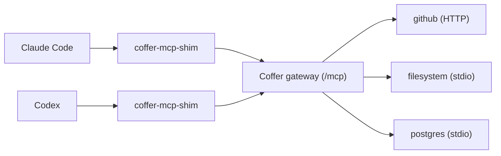

# MCP servers

Coffer's gateway aggregates the MCP servers you register and serves them to every connected agent through one endpoint. This page covers registering stdio and HTTP servers, keeping their secrets in the credential store, curating what each server exposes, choosing which agents reach it, and how the gateway behaves when you have many tools.

## What the gateway does

Without Coffer, each agent carries its own copy of every MCP server's config and secrets. With Coffer, you register a server once and every agent that has Coffer's MCP entry installed sees it:



The gateway:

- prefixes every upstream tool and prompt with its server name — `github__search_issues`, `filesystem__read_file` — and every resource URI with `coffer://<server>/`, so two servers exposing a tool called `search` never collide;
- routes each call back to the server it came from under the tool's original name, and returns the upstream's result unchanged;
- forwards tools, resources and prompts, including list-changed notifications;
- records each call's target, time, duration and outcome — never its arguments or results.

## Prerequisites

- The daemon is running (see [Running the daemon](/guides/daemon)).
- At least one agent has Coffer's MCP entry installed (see [Agents](/guides/agents#install-coffer-s-mcp-entry)), or another client is [connected](/guides/connect-a-client).

## Register a stdio server

A stdio server is a command Coffer starts as a subprocess.

**CLI:**

```sh
coffer mcp add filesystem \
  --stdio "npx -y @modelcontextprotocol/server-filesystem /Users/you/projects" \
  --description "Read and write files under ~/projects"
# registered: mcp_server filesystem
```

`--stdio` takes the whole command line; Coffer splits it shell-style into `command` and `args`.

**Web UI:** open **MCP servers**, click **Add MCP server**, and paste the JSON from the server's README in the standard shape:

```json
{
  "mcpServers": {
    "filesystem": {
      "command": "npx",
      "args": ["-y", "@modelcontextprotocol/server-filesystem", "/Users/you/projects"]
    }
  }
}
```

Click **Continue** to see **Review what will be imported**, then **Import**. You can paste several servers at once.

### Worked example: a stdio server with a secret

The Brave Search server reads its API key from the `BRAVE_API_KEY` environment variable. Store the key once, then cite it:

```sh
# 1. Store the secret (read from stdin, so it never lands in shell history)
printf '%s' "$BRAVE_API_KEY" | coffer credentials set brave/api-key

# 2. Register the server, mapping the env var to the credential ref
coffer mcp add brave \
  --stdio "npx -y @modelcontextprotocol/server-brave-search" \
  --credential BRAVE_API_KEY=brave/api-key

# 3. Check it starts and lists tools
coffer mcp test brave
# OK  (1840 ms)
coffer mcp tool list brave
```

The stored config holds only the reference:

```json
{
  "transport": {
    "type": "stdio",
    "command": "npx",
    "args": ["-y", "@modelcontextprotocol/server-brave-search"],
    "env": {},
    "credential_refs": { "BRAVE_API_KEY": "brave/api-key" },
    "cwd": null
  },
  "spawn_timeout_seconds": 30,
  "request_timeout_seconds": 120
}
```

When Coffer starts the server, it decrypts `brave/api-key` in memory and puts it in the child's environment as `BRAVE_API_KEY`. The child does **not** inherit the daemon's own environment: it gets a minimal safe set (such as `PATH` and `HOME`), the server's static `env`, and its materialised credentials — nothing else.

In the web UI's paste dialog, environment variables whose name or value looks like a secret are pre-marked **Secret**. Values marked Secret are stored in the credential store under a generated ref and cited from `credential_refs`; the rest stay in `env`.

## Register an HTTP server

An HTTP server is a remote MCP endpoint that speaks the streamable HTTP transport. Coffer connects to it; nothing is spawned.

### Worked example: an HTTP server with a bearer token

```sh
# 1. Store the whole header value, including the scheme
printf 'Bearer %s' "$GITHUB_PAT" | coffer credentials set github/authorization

# 2. Register the server, mapping the header to the credential ref
coffer mcp add github \
  --http https://api.githubcopilot.com/mcp/ \
  --credential Authorization=github/authorization

coffer mcp test github
```

For an HTTP server each `--credential NAME=REF` entry becomes a request header: the decrypted secret is sent as the header's **entire** value, so store `Bearer …` when the server expects that form. Non-secret headers go in the transport's `headers` map (edit the config JSON in the web UI).

The config Coffer stores:

```json
{
  "transport": {
    "type": "http",
    "url": "https://api.githubcopilot.com/mcp/",
    "headers": {},
    "credential_refs": { "Authorization": "github/authorization" }
  },
  "spawn_timeout_seconds": 30,
  "request_timeout_seconds": 120
}
```

::: warning Secrets cannot sit in `env` or `headers`
A static `env` or `headers` value that looks like a secret — starting with `Bearer `, `ghp_`, `gho_`, `github_pat_`, `sk-`, `xoxb-`/`xoxa-`/`xoxp-`, or a JWT — is rejected at registration with a message telling you to move it into `credential_refs`. A `credential_refs` entry citing a ref the store does not hold is also rejected, naming the missing credential.
:::

::: info The paste dialog reads `env`, not `headers`
The **Add MCP server** paste dialog reads each server's `env` object. For an HTTP server (`"url": …`) those entries become headers. A `headers` object in the pasted JSON is not read — register such a server with `coffer mcp add --http … --credential`, or add the headers afterwards with **Edit**.
:::

## Server names

A server name is a label of letters, digits, `.`, `_` and `-`, at most 64 characters, unique among MCP servers. It may not contain `__`, because the gateway splits `<server>__<tool>` on the first `__`. Avoid `coffer`, the prefix of Coffer's own tools.

The name can be changed later (`coffer resource rename mcp_server <old> <new>`); the server keeps its `uid`, reach, capability preferences and credentials. Agents see the new prefix on their next tool listing.

## Edit, test, refresh and delete

| Task | Web UI | CLI |
| --- | --- | --- |
| Inspect | **MCP servers** → the server → **Overview** | `coffer mcp show <name>` |
| Change config, timeouts, credentials | **Edit** | `PATCH /api/v1/resources/{uid}` |
| Check the server answers | **Test connection** | `coffer mcp test <name>` (exit 7 on failure) |
| Re-query its tools, resources and prompts | **Refresh capabilities** | `coffer mcp refresh <name>` |
| Enable or disable the whole server | **Reach** control → **Disabled** | `coffer resource disable mcp_server <name>` (and `enable`) |
| Delete | **Delete server** | `coffer mcp remove <name>` |

The **Edit** dialog shows the configuration JSON without secrets; credentials are listed below it and can be added, replaced or removed there. Removing a credential deletes its stored entry. Timeouts are per server: **Spawn** (5–120 seconds, default 30) and **Request** (5–1800 seconds, default 120).

Deleting a server removes its registration and capability preferences, keeps its audit and invocation history, and releases credential refs that nothing else cites.

### Health and a missing launcher

The list's **Health** column shows **Healthy**, **Failing** or **Unknown**. Registering a server whose upstream is unreachable still succeeds; it is marked failing until it answers.

When a stdio server's command is not installed on this machine — for example a server imported from another machine that runs `uvx` where `uv` is missing — the status reads `missing <runner>` and the UI tells you what to install (`uvx is not installed on this machine` / `Install uvx, then refresh`). Coffer does not install software for you.

A stdio server's stderr goes to its own file, `~/.coffer/logs/upstream/<name>.log`, not to the daemon log.

## Curate tools, resources and prompts

Every capability a server exposes can be switched on or off individually. A newly discovered capability starts **enabled**.

**Web UI:** open the server and use the **Tools**, **Resources** and **Prompts** tabs. Each row has an **Enabled** switch and shows the input schema.

**CLI:**

```sh
coffer mcp tool list github
coffer mcp tool disable github delete_repository
coffer mcp tool enable github delete_repository
coffer mcp resource list filesystem
coffer mcp prompt disable github triage
```

The key is the capability's original, unprefixed name (`delete_repository`, not `github__delete_repository`).

A disabled tool disappears from every client's next `tools/list`, and a call to it fails with `TOOL_DISABLED` (JSON-RPC `-32000`). Your choices survive daemon restarts, server upgrades and servers that briefly disappear: Coffer stores only the preference and when the capability was last seen, and discovers the capability itself live from the server.

## Choose which agents reach a server

By default a server reaches every agent. You can narrow that to specific agents — for example, keep a production database server away from an experimental agent. Together with the enabled switch this is the server's **reach**.

**Web UI:** use the **Reach** control on the server's row in **MCP servers** or in its page header. It offers **Disabled**, **Every agent**, or **Only selected agents** with the agents ticked. Selecting no agents makes the server dormant: registered, but reaching nobody.

**CLI:**

```sh
coffer scope show mcp_server postgres
coffer scope set mcp_server postgres --agents claude-code
coffer scope set mcp_server postgres --no-agents     # dormant: reaches nobody
coffer scope clear mcp_server postgres               # back to every agent
```

The gateway enforces reach per session, using the agent identity the shim reports (see [Connect a client](/guides/connect-a-client#agent-identity)). An agent outside a server's reach does not see its tools, resources or prompts, and a call is rejected as `TOOL_DISABLED` and logged as `denied` — while another agent connected at the same moment uses it normally. A session with no identity sees only servers that reach every agent.

Reach is set per machine and is not synced; each machine you use sets its own. **Test connection** and the other management actions are never gated by reach.

## Many tools: tiering and tool search

A model chooses tools less well as the list grows, and every listed tool costs context in every session. The gateway therefore lists a budgeted slice of the upstream catalogue:

- Coffer's own `coffer__…` tools are always listed and do not count against the budget.
- While your upstream tools number **50 or fewer**, all of them are listed.
- Above that, the gateway lists the most-invoked tools over the last **90 days**, reserving at least one slot per server so no server disappears entirely. Ties keep catalogue order, so an unchanged catalogue gives the same list every session.
- Unlisted tools are **not** disabled. They stay callable by name, exactly as before.

`coffer__search_tools` reaches everything tiering left out. The agent describes what it needs and gets back real upstream tool definitions it can call directly:

```json
{ "name": "coffer__search_tools", "arguments": { "query": "create a jira issue", "top_k": 5 } }
```

```json
{
  "tools": [
    { "name": "jira__create_issue", "description": "Create a new issue…", "inputSchema": { "…": "…" }, "score": 7.42 }
  ],
  "total_searched": 186
}
```

The search ranks the full catalogue with a local keyword ranker over tool names and descriptions — no model, no embeddings, no network. `top_k` defaults to 5 and is capped at 20. Coffer's own tools are not in the results. When tools are hidden, the `instructions` Coffer sends at `initialize` tell the agent to use `coffer__search_tools`.

Tiering is controlled by three environment variables of the daemon process (restart the daemon after changing them):

| Variable | Default | Effect |
| --- | --- | --- |
| `COFFER_TOOL_TIERING` | `auto` | `off` lists every upstream tool. Any other value keeps tiering on. |
| `COFFER_TOOL_TIERING_BUDGET` | `50` | How many upstream tools to list. |
| `COFFER_TOOL_TIERING_WINDOW_DAYS` | `90` | The usage window that ranks tools. |

A malformed value falls back to the default, and any failure of the usage query lists everything. To keep a specific tool listed without changing the budget, use it: usage is what ranks it. To remove a tool from agents entirely, disable it instead.

## The invocation log

Every tool call, resource read and prompt fetch is recorded with its time, server, capability, duration and status — `ok`, `error`, `timeout` or `denied`. A tool that returns a result flagged `isError` is recorded as `error`. Arguments and results are never stored. Entries are kept for 30 days by default (see [Activity and audit](/guides/activity) to change retention).

**Web UI:** the server's **Invocations** tab, or the **Activity** page for every server.

**CLI:**

```sh
coffer mcp invocations github --limit 50
coffer mcp invocations --status error --since 2026-09-20T00:00:00Z
coffer mcp invocations --json
```

Without a server name the command reads every server, including Coffer's own tool calls (shown as `coffer`) and servers you have since deleted (`deleted:<name>`).

## How it works

Each client session gets its **own** set of upstream connections. Coffer starts a stdio server the first time a session needs it and stops it when the session ends, so two agents connected at once never share a subprocess or step on each other's state. The PID of every spawned server is recorded under `~/.coffer/upstream-pids/` so orphans can be cleaned up after a crash. If a server crashes mid-call, that call returns an error, the server is marked unhealthy, and the next call restarts it with bounded retries.

When a server is slow to answer during tool listing, its tools are left out of that listing, the server is retried in the background, and the gateway sends `notifications/tools/list_changed` when it recovers so the client re-lists.

See [MCP gateway](/architecture/mcp-gateway) for the full request lifecycle.

## Related

- [Connect a client](/guides/connect-a-client) — the shim, the HTTP endpoint, agent identity
- [Credentials](/guides/credentials) — storing the secrets servers cite
- [Agents](/guides/agents#manage-the-agent-s-own-mcp-entries) — adopting MCP entries already in an agent's config
- [MCP tools reference](/reference/mcp-tools) — Coffer's own `coffer__…` tools
- [Tool Overload: List a Usage-Ranked Slice, Search the Rest](https://github.com/wyx-sg/Coffer/blob/main/docs/decisions/tool-overload-tier-the-list-search-the-rest.md), [Tool Overload: List a Usage-Ranked Slice, Search the Rest](https://github.com/wyx-sg/Coffer/blob/main/docs/decisions/tool-overload-tier-the-list-search-the-rest.md), [Session Subprocess Model](https://github.com/wyx-sg/Coffer/blob/main/docs/decisions/session-subprocess-model.md)
- Spec: [mcp-gateway](https://github.com/wyx-sg/Coffer/blob/main/openspec/specs/mcp-gateway/spec.md)
