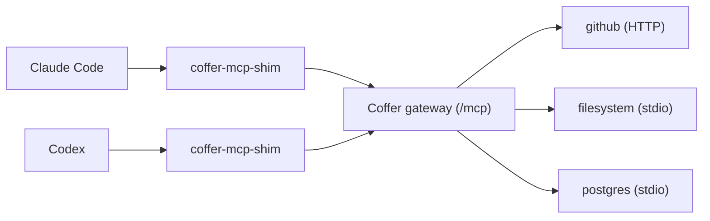

# MCP servers

Coffer's gateway aggregates the MCP servers you register and serves them to every connected agent through one endpoint. This page covers registering stdio and HTTP servers, keeping their secrets in the secret store, curating what each server exposes, choosing which agents reach it, and how the gateway behaves when you have many tools.

## What the gateway does

Without Coffer, each agent carries its own copy of every MCP server's config and secrets. With Coffer, you register a server once and every agent that has Coffer's MCP entry installed sees it:


```mermaid
flowchart LR
    CC["Claude Code"] --> S1["coffer-mcp-shim"]
    CX["Codex"] --> S2["coffer-mcp-shim"]
    S1 --> G["Coffer gateway (/mcp)"]
    S2 --> G
    G --> U1["github (HTTP)"]
    G --> U2["filesystem (stdio)"]
    G --> U3["postgres (stdio)"]
```

The gateway:

- prefixes every upstream tool and prompt with its server name — `github__search_issues`, `filesystem__read_file` — and every resource URI with `coffer://<server>/`, so two servers exposing a tool called `search` never collide;
- routes each call back to the server it came from under the tool's original name, and returns the upstream's result unchanged;
- forwards tools, resources and prompts, including list-changed notifications;
- records each call's target, time, duration and outcome — never its arguments or results.

## Prerequisites

- The daemon is running (see [Running the daemon](/guides/daemon)).
- At least one agent has Coffer's MCP entry installed (see [Agents](/guides/agents#connect-an-agent-to-coffer)), or another client is [connected](/guides/connect-a-client).

## Register a stdio server

A stdio server is a command Coffer starts as a subprocess.

Open **MCP servers**, click **Add server**, and paste whatever the server's README gives you into the one box. It is read as you type:

- an `mcpServers` JSON block, or a single server object — one server or many;
- Codex TOML `[mcp_servers.<name>]` tables;
- a command line — `claude mcp add …`, `codex mcp add …`, or a plain `npx …` / `uvx …` / `docker run …` — which becomes a stdio server named after its package;
- a URL, which becomes a Streamable HTTP server named after its host.

For example, the standard JSON:

```json
{
  "mcpServers": {
    "filesystem": {
      "command": "npx",
      "args": ["-y", "@modelcontextprotocol/server-filesystem", "/Users/you/projects"]
    }
  }
}
```

One server opens the form prefilled with it (name, description, command and arguments or URL, environment or headers, working directory, and who it is available to); **Test** it if you like (below), then click **Add server**. Several servers open **Review before adding**: each server's name as it will be kept (lower case, other characters turned into `-`; a name over 24 characters is flagged and not added until you shorten it), its secrets, and one **Available to** choice for them all; click **Add N servers**. Text the box cannot read — a sentence from a README, broken JSON (the message names the line and column) — adds nothing and leaves you the two manual choices, **Command (stdio)** and **URL (Streamable HTTP)**, which open the empty form. **Import from your agents** in the same dialog lists the MCP servers your agents' own config files already carry (see [Agents](/guides/agents)). Before anything is written it shows the plan for the ones you tick: the servers Coffer will add, entries with the same command in two agents that become one server, entries that are already in Coffer (only the duplicate entry is removed, and that agent then reaches the server through Coffer), and for each agent config file the lines that will change, with secret values hidden. **Import** then does exactly that; secrets move to the keychain, and if one entry fails the rest still import and the result says which. Each server is tested once right after it is added; a failing one shows under **Needs attention**.

### Test before adding

**Test** in the Add form tries what you typed before it is saved: a stdio server is started just for the test, an HTTP server is connected to, its tools are listed, and then everything is stopped and forgotten — nothing is registered and nothing is recorded. A pass shows the tools, resources and prompts it found; a failure says why (the command was not found, the process exited with its code, it did not answer in time, the URL could not be reached) with the last lines it printed on stderr. Secret values you typed are used for this test only and are hidden from what it shows. A test ends within 30 seconds and stops anything the server started. Two things wait until the server is added: a stored secret, which is released only to a server you added and approved, and a URL on your own machine or private network, which the test does not request.

### The built-in `coffer` server

The list ends with **Built-in**: Coffer's own `coffer` server, the one endpoint every connected agent reaches Coffer through, and through it the tools of the servers you add. Its page shows the endpoint, the agents connected to it, its tools as agents see them (`coffer__search_tools`) and its calls in the last 24 hours. It has no settings and cannot be edited, turned off or removed.

### Worked example: a stdio server with a secret

The Brave Search server reads its API key from the `BRAVE_API_KEY` environment variable. Cite it from the server's environment:

1. Open **MCP servers**, click **Add server** and paste `npx -y @modelcontextprotocol/server-brave-search` into the box.
2. In the environment variables, add `BRAVE_API_KEY`, set the row to **Secret** and paste the key. Coffer stores it in the secret store under a generated ref and cites it from `secret_refs`. (When an agent stores a key for you, the hand-off tells it to read the value from stdin with `coffer secret set`, so it never lands in a chat or in shell history.)
3. Press **Test**: the server starts and lists its tools. Then click **Add server**.

A secret you store for the server and then register it with is approved by the registration, and the server uses it at once. Citing a secret that already goes somewhere else, or later changing the server's command line or URL, holds the secret until you approve it in the desktop app: the server's page says it waits, and Coffer does not start the server until then. Coffer also marks a stdio server whose environment carries a secret as readable by other processes on this Mac, because any program running as you can read a process's environment. See [Secrets → Approvals](/guides/secrets#approvals).

The stored config holds only the reference:

```json
{
  "transport": {
    "type": "stdio",
    "command": "npx",
    "args": ["-y", "@modelcontextprotocol/server-brave-search"],
    "env": {},
    "secret_refs": { "BRAVE_API_KEY": "brave/api-key" },
    "cwd": null
  },
  "spawn_timeout_seconds": 30,
  "request_timeout_seconds": 120
}
```

When Coffer starts the server, it decrypts `brave/api-key` in memory and puts it in the child's environment as `BRAVE_API_KEY`. The child does **not** inherit the daemon's own environment: it gets a minimal safe set (such as `PATH` and `HOME`), the server's static `env`, and its materialised secrets — nothing else.

In the web UI's Add server dialog, a pasted environment variable or header whose name or value looks like a secret is offered for storing in Coffer. Values stored this way go into the secret store under a generated name and are cited from `secret_refs`; the rest stay in `env`. Picking a stored secret with a row's 🔑 button cites it the same way.

## Register an HTTP server

An HTTP server is a remote MCP endpoint that speaks the streamable HTTP transport. Coffer connects to it; nothing is spawned.

### Worked example: an HTTP server with a bearer token

1. Open **MCP servers**, click **Add server** and paste `https://api.githubcopilot.com/mcp/` into the box.
2. In the headers, add `Authorization`, set the row to **Secret** and paste the whole header value, including the scheme (`Bearer …`).
3. Press **Test**, then click **Add server**.

For an HTTP server each **Secret** header row becomes a request header: the decrypted secret is sent as the header's **entire** value, so store `Bearer …` when the server expects that form. Non-secret headers go in the transport's `headers` map (edit the config JSON in the web UI).

The config Coffer stores:

```json
{
  "transport": {
    "type": "http",
    "url": "https://api.githubcopilot.com/mcp/",
    "headers": {},
    "secret_refs": { "Authorization": "github/authorization" }
  },
  "spawn_timeout_seconds": 30,
  "request_timeout_seconds": 120
}
```

::: warning Secrets cannot sit in `env` or `headers`
A static `env` or `headers` value that looks like a secret — starting with `Bearer `, `ghp_`, `gho_`, `github_pat_`, `sk-`, `xoxb-`/`xoxa-`/`xoxp-`, or a JWT — is rejected at registration with a message telling you to move it into `secret_refs`. A `secret_refs` entry citing a ref the store does not hold is also rejected, naming the missing secret.
:::

::: info Pasting an HTTP server with `headers`
The **Add server** paste box reads an HTTP server's (`"url": …`) `headers` object and reviews each value for secrets exactly as it does `env`: a value whose name or content looks like a secret (an `Authorization` header, for example) is offered for storing in the secret store and cited from `secret_refs`; the rest stay in the transport's `headers`. An `env` object on an HTTP server is sent as headers too; when both name the same key, the `headers` value wins.
:::

## Server names and descriptions

A server name is a label of letters, digits, `.`, `_` and `-`, at most 24 characters, unique among MCP servers. The cap keeps the name a client shows for each tool, `mcp__coffer__<server>__<tool>`, within the 64 characters model provider APIs accept. It may not contain `__`, because the gateway splits `<server>__<tool>` on the first `__`. The name `coffer` is reserved for Coffer's own tools and is refused.

The name is fixed once the server is registered, because it is the prefix of every tool name `<server>__<tool>` an agent sees, and agents' permission rules and skills quote those names. A request to change it is refused with `NAME_IMMUTABLE`. To use a different name, delete the server and register it again, which resets its capability toggles and its reach. The decision is recorded in the ADR "names-visible-to-agents-are-fixed".

A server carries no title: its name is what every page and every agent shows. Next to the name sits an optional **description**, your own note about what the server is for. Agents never see it. Set it in the Add server form and change it later with **Edit**.

After each discovery, Coffer measures the name a client like Claude Code shows for every tool, `mcp__coffer__<server>__<tool>`. The server's **Tools** tab flags a tool whose name is over 64 characters, the limit model provider APIs accept; Cursor already drops tools above 60. A flagged tool stays enabled and listed. The fix is on the upstream side (a shorter tool name) or a shorter server name for a new registration.

## Edit, test, refresh and delete

| Task | Web UI |
| --- | --- |
| Inspect | **MCP servers** → the server → **Overview** |
| Change the description | **Edit** |
| Change command or URL, environment or headers, secrets, working directory, timeouts | **Edit** |
| Check the server answers and re-list its tools | **Test** (**Test again** while it is failing) |
| Hand a missing launcher or a failure to an agent | **Ask an agent ▾** (with **Copy prompt**) in the Overview's callout |
| Turn the whole server off or on | **⋯** → **Turn off**, **Turn on** |
| Copy its config | **⋯** → **Copy config as JSON** (secret names only, never values) |
| Delete | **⋯** → **Delete…** |

From a terminal, `coffer mcp test <name>` runs the same check (exit 7 on failure); everything else in the table is the web UI. The command line carries only what a program runs, what must work when the daemon is down, what a Coffer hand-off prompt tells an agent to run, or what the web UI cannot do.

The **Edit** dialog shows the name (fixed), a description only you see, the command and arguments or the URL, and the environment variables or headers. Each row is a key, a value and a delete button. The value is plain text; the 🔑 button at the end of the field picks a stored secret instead, and a value that looks like a secret offers to store it in Coffer for you ("This looks like a secret. Store it in Coffer?"). Secrets live only in Coffer: the server's settings hold the secret's name, never its value, and a secret you paste is saved to the Secrets page when you save the server. A command server also has an optional **Working directory**. **Test** tries the edited config before you save it — in the Add dialog too — and a failure that comes from this machine (the command is not found, the process exits, the connection fails or times out) offers **Ask an agent ▾** right there. A failed save stays in the dialog with its reason. Removing a secret row deletes the secret only when Coffer created it for this server. Saving an edit closes every live connection to the server, so the next call from any agent starts it with the new configuration.

Disabling a server takes effect at once, including in sessions that are already connected: its tools leave the listings, a call to one is refused as `TOOL_DISABLED` and logged as `denied`, and every running copy of the server is stopped. Enabling it again needs nothing more; the next call starts it. Timeouts are per server: **Spawn** (5–120 seconds, default 30) and **Request** (5–1800 seconds, default 120).

Deleting a server removes its registration and capability preferences and keeps its audit and invocation history. The confirmation lists what it costs — how many tools disappear from which agents ("26 tools disappear from Claude Code and Codex") — and one row per secret the server cites saying it stays in Secrets: deleting a server never deletes a secret. If the delete is refused, the dialog stays open under "Couldn’t delete `<name>`" with the reason.

### Health and a missing launcher

The list groups servers by what needs you: **Needs attention** (failing, launcher missing, secret missing — each with its reason, such as `Connection refused · since 14:02`), **Healthy**, **Not checked yet** and **Off**. The open server's header carries its state (the icon tinted for a problem), its transport and command or URL on one line, and four fixed buttons that never change with its state: **Reach**, **Test**, **Edit** and **⋯**. A fix is never a header button; it lives in the banner that states the problem. A failing server's banner gives its last error, since when it has been failing, which agents can't call its tools and its last successful call, with **View log** (**View errors** for an HTTP server) and a diagnosis hand-off; a missing launcher has a hand-off for installing it (both below); a secret this Mac does not hold (a vault restored on a new Mac carries names, not values) has **Replace secret** and the setting that cites it; a test you just ran shows what it listed, with its stderr one click away. Below the banner, **Overview** stacks three blocks. **Last 24 hours** shows calls and errors, and per calling agent its calls, errors and last call. **Requires** lists what the server needs on this machine, worked out automatically from its command and settings — you declare nothing: the launcher CLI (`uv` for `uvx`; found or not found, linking to the [CLIs](/guides/clis) page) and every secret its settings cite (set, missing or waiting for approval, linking to the Secrets page). **Most-called tools** is read-only; the switches are on the **Tools** tab. A server that is failing, off or missing something shows its tools from the saved switches at once, marked as such, instead of waiting for it to answer. Registering a server whose upstream is unreachable still succeeds; it is marked failing until it answers. Without a **Test connection** result, health follows the server's most recent call: a call that could not reach the server (it would not start, the connection died, or it timed out) reads as failing, while a tool that answered with an error does not, because the server itself is up. Refused (`denied`) calls are ignored.

When a stdio server's command is not found on this machine — for example a server imported from another machine that runs `uvx` where `uv` is missing — the status reads `missing <runner>`, and both its row in the list and its page say so (`uvx isn't found on this machine`). The launcher is also listed on the [CLIs](/guides/clis#launchers-your-mcp-servers-start-with) page under the command that provides it (`uv` for `uvx`), with this server under **Needed by**. Coffer does not install software for you, and does not guess an install command either: which installer fits depends on the machine. The callout offers **Ask an agent** (its menu holds **Copy prompt**; with no Coffer-managed agent available only **Copy prompt** is offered) — a prompt for your agent that names the launcher, the server, the command line it is started with (a token-looking argument reads `<secret>`, and environment values are never included), the `PATH` Coffer looks it up on and this machine's OS and architecture, and asks for an install a process started from the GUI can find, confirmed with `coffer mcp test <name>`. To do it by hand, install the runtime the command belongs to (`uv` for `uvx`, Node.js for `npx`, Docker for `docker`) where the daemon's `PATH` reaches — the desktop app hands the daemon your login shell's `PATH` — then press **Test**.

A test that an HTTP server answers with 401 or 403 is remembered as a rejected key, and so is an agent's own call that the server refuses that way (Coffer notices it without anyone pressing Test, and a later call the server answers clears it; a tool that returns an error result does not count): the server's page says so with **Replace key** (the Edit dialog on its secret), and Overview lists it as "Every call is rejected with 401 Unauthorized. The API key looks revoked." with the same **Replace key** action. A failing server, and a **Test** that fails, offer a second hand-off beside **View log**: a prompt to find the cause and propose a fix. It carries the server's name, its transport and a config summary (the command line and working directory, or the URL; the *names* of its environment variables, headers and stored secrets, never their values), the last error, and the newest 20 lines the server printed on stderr, each scrubbed of anything that looks like a token. It asks the agent not to read or change the secrets Coffer stores, and to verify with `coffer mcp test <name>`.

A stdio server's stderr goes to its own file, `~/.coffer/logs/upstream/<name>.log`, not to the daemon log. Coffer adds its own lines there when it starts the server, when a start fails (a launcher not found on `PATH`, a start that timed out) and when it stops it. For a stdio server, **⋯** → **Server log** opens a drawer with its **Server log**, newest first, error lines in red, with **Copy** and **Open log file**, beside its **Calls** in the last 24 hours (**All** or **Errors**, one agent or all). An HTTP server runs somewhere else, so Coffer keeps no log of its own for it: its **View errors** opens the **Invocations** tab already filtered to the errors. Choosing a call opens it in a 640-wide drawer with its result, how long it took and its session.

## Curate tools, resources and prompts

Every capability a server exposes can be switched on or off individually. A newly discovered capability starts **enabled**.

Open the server and use the **Tools**, **Resources** and **Prompts** tabs (each tab name carries its count). Each tab says how many are on, has a filter box and **All on** · **All off**, and each row a switch and its use in the last 24 hours (a tool's calls and errors, a resource's reads, a prompt's uses). The Tools tab lists the first ten matches of **Search tools**; a tool row opens to its full description, its input parameters and the name agents see it by, with its character count. The Overview lists the most-called few with **Show all N in Tools**.

A disabled tool disappears from every client's next `tools/list`, and a call to it fails with `TOOL_DISABLED` (JSON-RPC `-32000`). Your choices survive daemon restarts, server upgrades and servers that briefly disappear: Coffer stores only the preference and when the capability was last seen, and discovers the capability itself live from the server.

## Choose which agents reach a server

By default a server reaches every agent. You can narrow that to specific agents — for example, keep a production database server away from an experimental agent. Together with the enabled switch this is the server's **reach**.

Each row in **MCP servers** shows its reach as a badge (**Off**, **All agents**, or the marks of its agents); change it with the **Reach** button in the open server's header, or tick several rows and use the selection bar's reach control. The panel offers **Off**, **All agents** or **Chosen agents** with the agents ticked, and saves every change as you make it (it reads Applying…, then Saved) — there is no Save button. **All agents** includes agents you add later. **Chosen agents** with none ticked makes the server dormant: registered, but reaching nobody.

The gateway enforces reach per session, using the agent identity the shim reports (see [Connect a client](/guides/connect-a-client#agent-identity)). An agent outside a server's reach does not see its tools, resources or prompts, and a call is rejected as `TOOL_DISABLED` and logged as `denied` — while another agent connected at the same moment uses it normally. A session with no identity sees only servers that reach every agent.

Reach is set per machine and is not synced; each machine you use sets its own. **Test connection** and the other management actions are never gated by reach.

## Many tools: tiering and tool search

A model chooses tools less well as the list grows, and every listed tool costs context in every session. The gateway therefore lists a budgeted slice of the upstream catalogue:

- Coffer's own `coffer__…` tools are always listed and do not count against the budget.
- While your upstream tools number **50 or fewer**, all of them are listed.
- Above that, the gateway lists the most-invoked tools over the last **90 days**, reserving at least one slot per server so no server disappears entirely. Ties keep catalogue order, so an unchanged catalogue gives the same list every session.
- Unlisted tools are **not** disabled. They stay callable by name, exactly as before.

`coffer__search_tools` reaches everything tiering left out. The agent describes what it needs and gets back real upstream tool definitions it can call directly:

```json
{ "name": "coffer__search_tools", "arguments": { "query": "create a jira issue", "top_k": 5 } }
```

```json
{
  "tools": [
    { "name": "jira__create_issue", "description": "Create a new issue…", "inputSchema": { "…": "…" }, "score": 7.42 }
  ],
  "total_searched": 186
}
```

The search ranks the full catalogue with a local keyword ranker over tool names and descriptions — no model, no embeddings, no network. `top_k` defaults to 5 and is capped at 20. Coffer's own tools are not in the results. When tools are hidden, the `instructions` Coffer sends at `initialize` tell the agent to use `coffer__search_tools`.

Tiering is controlled by three environment variables of the daemon process (restart the daemon after changing them):

| Variable | Default | Effect |
| --- | --- | --- |
| `COFFER_TOOL_TIERING` | `auto` | `off` lists every upstream tool. Any other value keeps tiering on. |
| `COFFER_TOOL_TIERING_BUDGET` | `50` | How many upstream tools to list. |
| `COFFER_TOOL_TIERING_WINDOW_DAYS` | `90` | The usage window that ranks tools. |

A malformed value falls back to the default, and any failure of the usage query lists everything. A server's page shows the split: **Tools reach agents** reads **Listed directly** or **Most behind search**, the Tools tab marks each tool **Listed** or **Behind search**, and a note says how many of its tools are listed and why. To keep a specific tool listed without changing the budget, use it: usage is what ranks it. To remove a tool from agents entirely, disable it instead.

## The invocation log

Every tool call, resource read and prompt fetch is recorded with its time, server, capability, duration and status — `ok`, `error`, `timeout` or `denied`. A tool that returns a result flagged `isError` is recorded as `error`. Arguments and results are never stored. Entries are kept for 30 days by default (see [Activity and audit](/guides/activity) to change retention).

**Web UI:** the server's **Invocations** tab, the **Last 24 hours** block of its Overview (calls and errors, per calling agent), its **Server log** drawer (stdio servers), or the **Activity** page for every server (its search matches a server's name, so **View in Activity** opens it already searching).

**CLI:**

```sh
coffer log mcp --server github --limit 50
coffer log mcp --status error --since 2026-09-20T00:00:00Z
coffer log mcp --json
```

Without `--server` the command reads every server, including Coffer's own tool calls (shown as `coffer`) and servers you have since deleted (shown by their uid).

## How it works

Each client session gets its **own** set of upstream connections. Coffer starts a stdio server the first time a session needs it and stops it when the session ends, so two agents connected at once never share a subprocess or step on each other's state. The PID of every spawned server is recorded under `~/.coffer/upstream-pids/` so orphans can be cleaned up after a crash. If a server crashes mid-call, that call returns an error, the server is marked unhealthy, and the next call restarts it with bounded retries.

When a server is slow to answer during tool listing, its tools are left out of that listing, the server is retried in the background, and the gateway sends `notifications/tools/list_changed` when it recovers so the client re-lists.

See [MCP gateway](/architecture/mcp-gateway) for the full request lifecycle.

## Related

- [Connect a client](/guides/connect-a-client) — the shim, the HTTP endpoint, agent identity
- [Secret store](/guides/secret-store) — storing the secrets servers cite
- [Agents](/guides/agents#manage-the-agent-s-own-mcp-entries) — adopting MCP entries already in an agent's config
- [MCP tools reference](/reference/mcp-tools) — Coffer's own `coffer__…` tools
- [Tool Overload: List a Usage-Ranked Slice, Search the Rest](https://github.com/wyx-sg/Coffer/blob/main/docs/decisions/tool-overload-tier-the-list-search-the-rest.md), [Tool Overload: List a Usage-Ranked Slice, Search the Rest](https://github.com/wyx-sg/Coffer/blob/main/docs/decisions/tool-overload-tier-the-list-search-the-rest.md), [Session Subprocess Model](https://github.com/wyx-sg/Coffer/blob/main/docs/decisions/session-subprocess-model.md)
- Spec: [mcp-gateway](https://github.com/wyx-sg/Coffer/blob/main/openspec/specs/mcp-gateway/spec.md)
