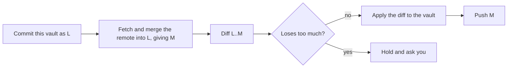

# Vault sync

Vault sync keeps the Coffer vaults on your machines converged through a git repository you own, so a laptop and a desktop hold the same knowledge, skills, MCP servers, agents and providers. This page is for anyone who runs Coffer on more than one machine and wants to set it up, understand what it does to their files, and recover when a round needs them.

::: tip Experimental feature
Vault sync is an [experimental feature](/guides/experimental-features) with the key `vault_sync`. It is off by default in a release build and on in a build from source. Switch it on under **Settings → General → Experimental features**, or run `coffer daemon features enable vault_sync`.
:::

## What it is for

Each machine commits what its vault holds into a local git working tree, lets git merge that with what the remote holds, and applies the difference back, deletions included. A background worker repeats this every hour by default. Every exchange is one **converge round**.

Three rules shape everything below:

- **The remote is a rendezvous, not a system of record.** Every machine keeps a complete vault. You can delete the repository and rebuild it from any one machine without losing anything.
- **Secrets travel only as ciphertext, and only if you ask.** The master key that decrypts them never enters the repository; you carry it between machines yourself.
- **What a machine does with the vault stays on that machine.** Whether a resource is enabled here, and for which agents (its reach), is never synced.

## Before you start

- **A private, empty git repository you own.** GitHub, GitLab, a server of your own, a bare repository on a NAS, or a `file://` path on a USB drive all work. One vault converges with at most one remote.
- **Credentials git can use without prompting.** Coffer runs `git` with your global and system git configuration switched off and terminal prompts disabled, so a credential helper configured in `~/.gitconfig` or macOS's keychain helper is not consulted. Pick one:
  - **HTTPS:** a personal access token with push rights, stored in Coffer's credential store and named with `--credential-ref`. Coffer hands it to git through a credential helper that reads it from the environment of that one `git` process; it never appears in the URL, the command line, the repository's git config or an error message.
  - **SSH** (`git@host:…` or `ssh://…`): a key your SSH setup can use with no passphrase prompt, since no askpass program is available to the daemon.
  - **`file://`**: no credential.
- **The same Coffer on every machine**, with `vault_sync` switched on on each.

## Set up the first machine

1. Store the push token. `coffer credentials set` reads the secret from stdin, so it stays out of your shell history:

   ```sh
   printf '%s' "$GITHUB_TOKEN" | coffer credentials set sync/github-token
   ```

2. Configure the remote:

   ```sh
   coffer sync remote set https://github.com/you/coffer-vault.git \
     --credential-ref sync/github-token \
     --with-credentials
   ```

   | Option | Default | Meaning |
   | --- | --- | --- |
   | `--branch` | `main` | The branch every machine converges on. |
   | `--interval` | `3600` | Seconds between automatic rounds, at least `60`. A smaller value is refused here, by the API and by the web form. |
   | `--with-credentials` / `--without-credentials` | without | Carry credential ciphertext. The master key is never carried under any setting. |
   | `--credential-ref` | none | Name of the push credential in the credential store. `''` removes it. |
   | `--worktree` | `~/.coffer/sync` | Absolute path of the git working tree. It must not be at, inside or above a vault directory (`knowledge`, `skills`, `memory`), or at or above `~/.coffer`. |

   The remote is probed before it is stored, so a typo or a token that cannot push fails here rather than an hour later. Re-running `remote set` changes only the options you pass; everything else keeps its stored value.

3. Join it. Joining is always explicit, even on the first machine:

   ```sh
   coffer sync adopt
   ```

   `adopt` reports what joining would do and asks before it applies anything. Against an empty remote it publishes everything this vault holds.

In the web UI the same steps are on the **Sync** page, **Setup** tab: fill in **Repository URL**, **Branch**, **Interval (seconds)**, **Push credential** and **Include credentials**, choose **Save remote**, then **Join this remote**.

## Join another machine

1. Install Coffer and switch `vault_sync` on.
2. If the remote needs a token, store it under the same reference, then configure the same remote with `coffer sync remote set`. For a remote that needs no credential and uses the defaults, you can pass the URL straight to `adopt` instead.
3. Run `coffer sync adopt` and read the report before you answer:

   ```text
   Joining this remote as a new machine: it takes the union.
     last converged here: never
     documents the remote changed since: 214
     documents this vault holds: 12
   Join this remote? [y/N]:
   ```

`adopt` recognises two cases from the machine registry in the repository:

- **A new machine takes the union.** It gains everything the remote holds and keeps everything it had. Nothing is deleted, and the next round publishes what it brought.
- **A returning machine resumes from its last base.** Its id is already in the registry (you reinstalled Coffer or lost `~/.coffer`). Its own descriptor names the commit it last reached, and the round continues from there: deletions made while it was away are applied, its own edits are kept, and nothing deleted comes back.

If a returning machine's recorded commit is no longer in the remote's history, `adopt` refuses until you choose: `coffer sync adopt --keep-local` publishes this vault's documents as additions (which may bring back what other machines deleted), and `coffer sync rebuild` takes the remote's state instead.

`--yes` skips the question for scripts. Without a terminal and without `--yes`, `adopt` refuses. Until a machine has joined, ordinary rounds apply and publish nothing and end as `awaiting_join`.

## Move the master key

Only needed when the remote carries credentials. On a machine that has the key:

```sh
coffer sync key export ~/coffer-master.key      # written with mode 0600
```

Carry the file over a channel you trust (a password manager, `scp`, a USB stick), never through the sync repository. On the other machine:

```sh
coffer sync key import ~/coffer-master.key
coffer sync key fingerprint                     # compare with the other machine
rm ~/coffer-master.key
```

On the web, the **Master key** card on **Setup** offers **Export key** (a browser download) and **Import key** (a file picker).

Without the key, sync still works, but credentials that arrived are reported as locked on each round (`credential locked: <ref>`), and the resources that need them cannot start until you import the key. The machine table flags a machine whose key differs from this one's.

## What travels and what stays

| Travels | Stays on each machine |
| --- | --- |
| Knowledge files under `~/.coffer/knowledge/` | `coffer.db` itself, logs, `daemon.json`, `daemon-config.json` |
| The master skill store under `~/.coffer/skills/` | **Reach**: each resource's enabled flag and agent scope |
| Definitions of MCP servers, agents, skills, knowledge collections, providers and channels (one YAML document each, keyed by uid) | The `coffer-guide` skill, which each machine generates from its own enabled collections |
| MCP capability preferences, Coffer's model settings, the agent plugin inventory, channel pairings | Memory (`~/.coffer/memory/` and its partitions), which each machine derives from its own agents |
| Credential ciphertext, with `--with-credentials` | Conversations, the audit log, MCP invocation records |
| One descriptor per machine under `machines/` | The master key |

Some consequences to know:

- **Reach is set per machine.** A server that should run only on the desktop is registered everywhere but disabled on the laptop. A resource arriving on a machine for the first time starts at that machine's default reach. The reach control in the UI says it applies to this machine only; so does `coffer scope set`.
- **A channel travels, but its adapter runs on one machine.** A chat bot can have only one consumer, so each channel names the machine that runs it. Other machines hold its configuration and pairings without starting it. To move a bot, run `coffer channel bind <name> [<machine_id>]` from the machine that currently runs it. See [Channels](/guides/channels).
- **Curation runs on one machine.** The pass that merges new knowledge into documents runs on one owner machine, so two machines do not rewrite the same documents differently. Set it under **Settings → Coffer's model → Automatic upkeep** or with `coffer engine curate-owner`. See [Knowledge](/guides/knowledge).
- **The plugin inventory records, it does not install.** It lists which plugins each agent has on each machine and writes nothing into any agent's configuration.
- Paths under your home directory are stored against a `${HOME}` placeholder and expanded with each machine's own home.

## What a round does



Because this machine's state is committed before the merge, git sees both sides and their common base. Edits to different parts of one file merge cleanly, and the difference applied back is exactly what the other machines contributed. A deletion is applied only when some machine actually deleted that document relative to the shared base; a machine that merely lacks a document deletes nothing. A round with nothing to say makes no commit.

Rounds run every `--interval` seconds. To run one now, use `coffer sync now` or **Converge now** on **Setup**.

A document that fails to apply is reported and retried on the next round; the rest of the round still completes. A document that cannot apply on this machine at all, such as an agent whose configuration directory does not exist here, is recorded as **not applicable here**: kept, not retried, not an error, and applied once that directory exists.

## Watch what sync is doing

```sh
coffer sync status       # the remote, this machine, and the last round in full
coffer sync history      # one line per round, newest first (--limit, default 20)
```

`coffer sync status` exits non-zero when the last round needs you: held for confirmation, stopped on a conflict, failed to push or to run, or waiting to join. A cron line or a shell prompt can check that without parsing the text. A paused remote exits zero.

On the web, the **Sync** page opens on **Runs**: every round this machine has run, with what it applied here, what it published and the commit. Consecutive rounds that changed nothing fold into one row. When a round needs you, the **Sync** entry in the sidebar is marked; visiting the page clears the mark, and it returns only if the situation changes. The desktop app raises a notification and marks its icon as well.

## Resolve a conflict

When two machines change the same lines of the same document before either converges, git cannot merge them. If Coffer's model is configured, it tries once to resolve the conflict in the working tree only, validates the result, and reports every path it merged so you can check it. Otherwise the round stops without touching your vault:

```text
conflict
  applied here: nothing
  published: nothing
  conflict: knowledge/projects/coffer.md
  resolve them with your own git tools, then run 'coffer sync now'
```

Resolve it in the working tree, which is an ordinary git repository:

```sh
cd ~/.coffer/sync
git status
$EDITOR knowledge/projects/coffer.md      # remove the conflict markers
git add -A && git commit
coffer sync now
```

The web UI shows the conflicted paths and the working tree as a banner above the runs. Credential ciphertext never conflicts: the more recently encrypted value wins.

## When a round is held for deletions

A round that would lose more than **20%** of the documents in one area, or **20 or more** documents in one area, stops before touching anything. The thresholds are fixed. The guard runs in both directions:

- **apply**: the remote would delete a large part of this vault;
- **publish**: this vault would delete a large part of the remote, which is what a reinstall, a failed restore or a stray `rm -rf` looks like from inside.

A document that reappears at another path in the same round is a move, not a loss, so reorganising a collection publishes without asking.

```text
awaiting_confirmation
  held: this round would delete the following from the remote.
  If this vault was just reinstalled or restored, do NOT confirm.
    knowledge: 186 of 186
    - knowledge/work/notes/oncall.md
    … and 185 more
  'coffer sync confirm' to proceed, 'coffer sync reject' to discard
```

Answer it with one of:

```sh
coffer sync confirm    # the deletions are real: let the round finish
coffer sync reject     # discard the round; the vault was never touched
coffer sync rebuild    # this machine is the damaged one: replace its vault with the remote's
```

`rebuild` discards documents only this machine holds and pushes nothing. It asks first; `--yes` skips the question. On the web the held round's row carries **Confirm**, **Reject** and, on a publish hold, **Rebuild from remote**.

While a hold is outstanding the vault converges no further, but each round re-derives the diff. If the documents come back, the hold releases itself. An unanswered hold is recorded once, not once per interval.

## Undo a round or restore an older state

Every round snapshots the vault before it applies anything, and the ten most recent snapshots are kept:

```sh
coffer sync rollback                        # undo the most recent round's apply
coffer sync restore --at 2026-09-05         # or a sha, or a ref
```

`rollback` returns the vault to the snapshot taken before the most recent round applied anything. The undo is an ordinary local change that the next round publishes, so the other machines follow. Run it before another round applies something else: every round that reaches the apply step takes a new snapshot, even one that applies nothing. On the web, **Undo this round** appears on the newest round only when that round applied something here.

`restore` moves to the last commit at or before `--at` and applies the difference from where the vault is now, so a document deleted last week returns without discarding anything added since. It is command-line only, and a round never reaches back into history on its own.

## Manage the machines

```sh
coffer sync machine list
coffer sync machine rename "Work desktop"
coffer sync machine remove <machine_id>     # retire a machine you no longer use
```

A machine's id is derived from the host (`IOPlatformUUID` on macOS, `/etc/machine-id` on Linux), hashed before it is published, and survives reinstalling Coffer. Where no host identifier is readable, Coffer stores a generated id in `~/.coffer/machine-id`; that one does not survive deleting `~/.coffer`, and both `coffer sync status` and the machine table say so. Renaming changes only a label. Retiring removes the machine's descriptor and rewrites nothing else; a channel still bound to it runs nowhere until you bind it elsewhere.

## Pause or stop syncing

- **Pause:** switch off **Converge automatically** on **Setup**, or run `coffer sync remote pause`. Every round then reports `disabled`, records nothing, pushes nothing and raises no notice. The remote, its settings, the pointer and the history are kept, and switching it back on (or `coffer sync remote resume`) resumes where the vault left off. `coffer sync remote set` never unpauses a paused remote.
- **Forget the remote:** `coffer sync remote clear`. The vault is left exactly as it is.
- **Switch the feature off:** `coffer daemon features disable vault_sync` closes every sync surface on this machine and keeps everything it holds.

## Troubleshooting

| Symptom | Cause | Fix |
| --- | --- | --- |
| `vault_sync is switched off on this machine` | The feature is off. | `coffer daemon features enable vault_sync` |
| Status `awaiting_join`, nothing applied | This machine has not joined the remote. | `coffer sync adopt` |
| Push fails with an authentication error | No usable credential: your git config and keychain helper are not consulted. | Store a token and set `--credential-ref`, or use an SSH key that needs no prompt. |
| `remote set` refused for the working tree | The path is relative, or at, inside or above the vault or `~/.coffer`. | Use the default or an absolute path outside `~/.coffer`. |
| `credential locked: <ref>` on every round | This machine lacks the master key those credentials were encrypted with. | `coffer sync key import <file>` with the key from a machine that has it. |
| A held round after reinstalling Coffer | The empty vault would publish its loss. | Do not confirm. `coffer sync rebuild` takes the remote's state; `coffer sync reject` discards just this round. |
| Status `push_failed` | The round applied here but could not reach the remote. | Check the network and the token; the next round retries. |
| A machine appears twice in the table | Its id was stored locally and `~/.coffer` was deleted. | `coffer sync machine remove <old id>` |

For failures that do not fit here, the round's error is in `coffer sync status`, and the daemon log (**Activity → Daemon**) has the detail.

## How it works

The seven round steps, the joining algorithm, the deletion guard and the reasons behind each are in [Vault sync architecture](/architecture/vault-sync).

## Related

- [Experimental features](/guides/experimental-features)
- [Credentials](/guides/credentials)
- [Channels](/guides/channels)
- [Knowledge](/guides/knowledge)
- [CLI reference](/reference/cli)
- Spec: [vault-sync](https://github.com/wyx-sg/Coffer/blob/main/openspec/specs/vault-sync/spec.md) · Decisions: [Vault Sync](https://github.com/wyx-sg/Coffer/blob/main/docs/decisions/vault-sync.md), [Per-Agent Resource Scope](https://github.com/wyx-sg/Coffer/blob/main/docs/decisions/per-agent-resource-scope.md)
