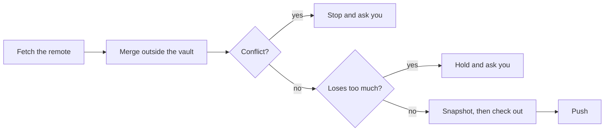

# Vault sync

Vault sync keeps the Coffer vaults on your machines the same through a git repository you own, so a laptop and a desktop hold the same knowledge, skills, MCP servers, providers and channels. This page is for anyone who runs Coffer on more than one machine and wants to set it up, understand what it does to their files, and answer it when a round needs them.

## What it is for

Your vault, `~/.coffer/vault`, is already a git repository: every change to it is a commit, whether or not you sync (see [Editing the vault by hand](/guides/vault-files)). Sync adds one remote. Each **round** fetches it, lets git merge it with this vault outside the working tree, checks the result into the vault if the merge was clean, and pushes. A background worker runs a round every hour by default.

Four rules shape everything below:

- **The remote is a rendezvous, not a system of record.** Every machine keeps a complete vault. You can delete the repository and rebuild it from any one machine.
- **A clean merge is applied; any conflict stops for you.** When two machines changed the same thing in ways git cannot merge, nothing is checked out and nothing is pushed until you choose per file.
- **Secrets travel only as ciphertext, and only if you ask.** The master key that decrypts them never enters the repository; you carry it between machines yourself.
- **What a machine does with the vault stays on that machine.** Whether a resource is enabled here, and for which agents (its reach), your agents, the remote itself: none of it is in the vault, so none of it syncs.

## Before you start

- **A private, empty git repository you own.** GitHub, GitLab, a server of your own, a bare repository on a NAS, or a `file://` path on a USB drive all work. One vault syncs with at most one remote.
- **Credentials git can use without prompting.** Coffer runs `git` with your global and system git configuration switched off and terminal prompts disabled, so a credential helper in `~/.gitconfig` or macOS's keychain helper is not consulted. Pick one:
  - **HTTPS with a token** stored in Coffer's secret store and named with `--secret-ref`. Coffer hands it to git through a credential helper that reads it from the environment of that one `git` process. It never appears in the URL, the command line, the repository's config or an error message.
  - **SSH** (`git@host:…` or `ssh://…`): a key your SSH setup can use with no passphrase prompt.
  - **`file://`**: no secret.
- **`git` 2.40 or later on every machine.** A round merges with `git merge-tree`, which older versions lack. If it is missing, the Sync page reports `git missing` with a prompt that hands installing it to your agent.
- **The same Coffer version on every machine.** A remote written by another vault layout is refused (see [Troubleshooting](#troubleshooting)).
- **The vault outside any cloud-synced folder.** A vault inside Dropbox, iCloud Drive, Syncthing or another File Provider folder pauses sync: two tools syncing one git repository corrupt it.

## Set up the first machine

### GitHub

1. Create a private, empty repository and a fine-grained personal access token with **Contents: Read and write** on it.
2. Store the token. `coffer secret set` reads the value from stdin, so it stays out of your shell history:

   ```sh
   printf '%s' "$GITHUB_TOKEN" | coffer secret set sync/github-token
   ```

3. Look at the repository, then configure it:

   ```sh
   coffer sync remote check https://github.com/you/coffer-vault.git --secret-ref sync/github-token
   coffer sync remote set https://github.com/you/coffer-vault.git --secret-ref sync/github-token
   ```

### GitLab

1. Create a private, empty project, then a **project access token** on it (**Settings › Access tokens**) with the **`write_repository`** scope and a role that may push to the branch (Developer or higher; Maintainer if the branch is protected). A personal access token with `write_repository` works too.
2. Store the token and configure the remote. GitLab's token is sent with the user name `oauth2` (or the account's user name), so pass `--username oauth2`:

   ```sh
   printf '%s' "$GITLAB_TOKEN" | coffer secret set sync/gitlab-token
   coffer sync remote set https://gitlab.com/<group>/<repo>.git \
     --secret-ref sync/gitlab-token --username oauth2
   ```

   `coffer sync remote check` always sends the default username `coffer`, so it cannot look at a GitLab repository with its token. To look before you save, fill in the set-up form on the **Sync** page and press **Check repository**, which sends the **User name** you enter.

   For a self-managed GitLab, use your instance's host in place of `gitlab.com`.

3. Or use SSH instead of a token, with a key added to your GitLab account:

   ```sh
   coffer sync remote set git@gitlab.com:<you>/<repo>.git
   ```

### The username sent with a token

Git sends a username with every HTTPS token. Coffer sends `coffer` unless you pass `--username` (or fill in **User name** on the **Remote** tab, shown for an `https://` URL). It matters only where the host does not tell the user from the token:

| Host | Username |
| --- | --- |
| GitHub | Ignored for a token; the default works. |
| GitLab | `oauth2`, or the account's user name. |
| Bitbucket | A fixed one such as `x-token-auth` for a repository or workspace access token. |
| Azure DevOps | A real one: your user name. |
| Any other git server | Whatever its HTTPS sign-in expects; leave the default when it takes the token alone. An SSH or `file://` remote sends no user name, and the option changes nothing for it. |

```sh
coffer sync remote set https://bitbucket.org/<workspace>/<repo>.git \
  --secret-ref sync/bitbucket-token --username x-token-auth
```

### Options

| Option | Default | Meaning |
| --- | --- | --- |
| `--branch` | `main` | The branch every machine syncs on. |
| `--interval` | `3600` | Seconds between automatic rounds, at least `60`. A smaller value is refused. |
| `--with-secret` / `--without-secret` | without | Carry the encrypted secrets (`vault/secret/`). The master key is never carried under any setting. |
| `--secret-ref` | none | Name of the push token in the secret store. `''` removes it. |
| `--username` | `coffer` | Username sent with an HTTPS token, for a host that does not imply it (GitLab: `oauth2`). |
| `--wait` | off | Wait for a pending approval in the Coffer app instead of exiting. |

Re-running `remote set` changes only the options you pass; everything else keeps its stored value, and a paused remote stays paused.

`coffer sync remote check` tells you what a URL holds before you store it: empty, a Coffer vault (and its layout), another repository, unreachable, or refusing the token.

A token you stored a moment ago for this remote is used at once. Pointing a token that already pushes somewhere at a **different** URL is sending a secret somewhere new, so it waits until you approve it in the desktop app: the command prints `waiting for approval in the Coffer app` and exits `9`, or waits with `--wait`. Until then rounds report a sign-in problem. See [Secrets → Approvals](/guides/secrets#approvals).

### Join it

Joining is always explicit, even on the first machine:

```sh
coffer sync join
```

`join` prints what joining would do and asks before it applies anything. Against an empty remote it pushes everything this vault holds.

In the web UI the same steps are on the **Sync** page, which shows set-up until this machine has joined: **Repository URL**, **Branch**, **Secret**, **User name** (for an `https://` URL), **Run a round**, **Include encrypted secrets**, then **Check repository**. An empty repository offers **Push and start syncing**. One that already holds a vault shows the join preview (what comes down, what is the same, what differs, what goes up, and that nothing is deleted) with **Join and pull**. The **?** next to the page title explains adding another Mac.

## Join another machine

1. Install the same Coffer.
2. If the remote needs a token, store it under the same reference, then run the same `coffer sync remote set`.
3. Run `coffer sync join` and read the preview before you answer. It names the case and what moves in each direction:

- **A new machine takes the union.** Files only the remote has come down, files only this machine has go up, identical files need nothing. A file both hold with different content is left exactly as it is here, and not pushed, until you choose. Nothing is deleted on either side.
- **A returning machine resumes from its last base.** The remote already holds this machine's descriptor (you reinstalled Coffer or lost `~/.coffer`), naming the commit it last reached. The join is an ordinary merge from there: deletions made while it was away are applied here, its own edits are kept, and nothing deleted comes back.

Settle the files a join left different, one at a time or all at once:

```sh
coffer sync choose                          # list them
coffer sync choose knowledge/work/oncall.md --mine
coffer sync choose knowledge/work/oncall.md --theirs
```

On the web the **Status** tab lists them under **Differ from this Mac**, each with **Keep this Mac's** and **Take &lt;machine&gt;'s**.

`--yes` skips the join question for scripts. Until a machine has joined, rounds move nothing and end as `join required`.

## Move the master key

Only needed when the remote carries secrets. On a machine that has the key, open the **desktop app** and back the key up on **Settings › Security**: choose a passphrase, confirm with Touch ID or your login password, pick a folder, and the app writes the passphrase-protected `coffer-master-key.cfk` there with mode `0600`. No command, route or browser page exports the key, because an agent could run it; see [Secrets → The master key and its backup](/guides/secrets#the-master-key-and-its-backup).

Carry the file over a channel you trust (a password manager, `scp`, a USB stick), never through the sync repository. On the other machine:

```sh
coffer sync key import ~/coffer-master-key.cfk   # asks for the passphrase
coffer sync key fingerprint                     # compare with the other machine
rm ~/coffer-master-key.cfk
```

**Import a master key** on **Settings › Security** does it with the two keys' fingerprints side by side before anything is replaced, and a passphrase-protected backup asks for its passphrase. The key it replaces is kept as a backup. Without the key, sync still works, but secrets that arrived cannot be decrypted here and the resources that need them cannot start. The **Machines** tab flags a machine whose key differs from this one's.

## What travels and what stays

| Travels | Stays on each machine |
| --- | --- |
| Definitions of MCP servers, skills, knowledge collections, providers and channels (`vault/resources/`) | Agents (`local/resources/agent/`): each machine registers its own |
| Knowledge documents (`vault/knowledge/`), skill folders (`vault/skills/`), memory triggers (`vault/memory-triggers/`) | **Reach**: each resource's enabled switch and agent scope (`local/reach.json`) |
| MCP capability switches, channel pairings, Coffer's model and upkeep settings (`vault/state/`) | The sync remote, retention, the secret boundary's approvals (`local/`) |
| Secret ciphertext (`vault/secret/`), with `--with-secret` | Memory, caches and the `coffer-guide` skill (`derived/`), which each machine rebuilds |
| One descriptor per machine (`vault/machines/`) | Conversations, audit and invocation logs (`runs.db`), attachments (`content/`), logs, the master key |

Some consequences to know:

- **Reach is set per machine.** A server that should run only on the desktop is registered everywhere but disabled on the laptop. A resource arriving on a machine for the first time takes that machine's default reach.
- **A channel travels, but its adapter runs on one machine.** A chat bot can have only one consumer, so each channel names the machine that runs it. To move a bot, run `coffer channel bind <name> [<machine_id>]` from the machine that currently runs it. See [Channels](/guides/channels).
- **Curation runs on one machine.** The pass that merges new knowledge into documents runs on one owner machine, so two machines do not rewrite the same documents differently. Once the vault spans several machines, choose it under **Curation runs on** in the Knowledge header's **Automatic** popover, or with `coffer config set engine.curate_owner`. See [Knowledge](/guides/knowledge).
- **The plugin inventory records, it does not install.** Each machine's descriptor lists its agents' plugins; nothing is written into any agent's configuration.
- Paths under your home directory are stored against a `${HOME}` placeholder and expanded with each machine's own home.

## What a round does


```mermaid
flowchart LR
  A["Fetch the remote"] --> B["Merge outside the vault"]
  B --> C{"Conflict?"}
  C -- "yes" --> S["Stop and ask you"]
  C -- "no" --> D{"Loses too much?"}
  D -- "yes" --> H["Hold and ask you"]
  D -- "no" --> E["Snapshot, then check out"]
  E --> F["Push"]
```

A deletion is applied only when some machine actually deleted that file relative to the shared base; a machine that merely lacks a file deletes nothing. A file you are editing right now is never overwritten: the round waits on it (`waiting on an edit`) and names the file. A round with nothing to do records `nothing to do`.

Rounds run every `--interval` seconds (**Run a round** on the **Remote** tab). To run one now, use `coffer sync now` or **Sync now** in the Sync page's header.

## Watch what sync is doing

```sh
coffer sync status       # the remote, the last round, and anything waiting for you
coffer sync history      # one line per round, newest first (--limit, default 20)
```

`coffer sync status` exits `1` while a round waits for you: stopped on conflicts, held, unable to reach or sign in to the remote, or paused because the vault is in a synchronised folder. A cron line or a shell prompt can check that without parsing the text. A paused remote exits `0`.

On the web, the **Sync** page's header says in one word where this Mac stands: **In sync**, **N changes to push**, **N changes pulled**, **Syncing**, **Stopped**, **Push failed**, **Remote unreachable**, **Sign-in failed** or **Paused**. Beside it are **Sync now** and the remote's URL with a copy button. The page has three tabs:

- **Status** opens first. It shows what the status means, the four counts (knowledge documents, skills, MCP servers & tools definitions, encrypted secrets), the changes waiting to push with who made each, any card that needs you, and every round this machine has run. Consecutive rounds that ended the same way fold into one row. Click a round to see its safety snapshot, the commits it pulled, what it changed here and what it pushed.
- **Machines** lists the machines (see [Manage the machines](#manage-the-machines)).
- **Remote** holds the remote's settings.

When a round needs you, the **Sync** entry in the sidebar is marked, and the desktop app raises a notification.

## Resolve a conflict

When two machines change the same lines of the same file before either syncs, git cannot merge them. The round stops. Nothing is checked out and nothing is pushed, so the vault on this machine stays as it was:

```sh
coffer sync conflicts                                  # the files the round waits on
coffer sync resolve knowledge/projects/coffer.md --mine     # keep this machine's
coffer sync resolve knowledge/projects/coffer.md --theirs   # take the other's
coffer sync continue                                   # once every file has an answer
```

To merge by hand, `coffer sync edit <path>` prints the path of a marked-up copy under `~/.coffer/derived/sync-conflicts/`. Edit it, remove every conflict marker, then `coffer sync resolve <path> --edited`. A copy that still has a marker is refused, and the message names the line. The vault's own file never receives a marker.

On the web the **Status** tab lists the files under **Changed on both Macs**; **Resolve conflicts** opens them one by one. Each file offers **Keep this Mac's** and **Take &lt;machine&gt;'s**, with the diff the choice makes here, and **Open in editor**, then **Mark resolved**. **Continue round** appears when every file has an answer. **Leave for later** is a real answer too: the vault stays as it is here.

### Merge with an agent

Merging two edits of one file is a job for your agent. On a stopped round, **Merge with an agent** (or `coffer sync conflicts --prompt`) gives you a prompt to copy, or opens a new conversation with it. The prompt names:

- the vault;
- each file, with the commit each side last changed it in;
- how to see each side's changes with `git -C <vault> diff`;
- the marked-up copy of each file that Coffer has written under `~/.coffer/derived/sync-conflicts/`.

The agent edits only those copies. It runs no git command that changes the vault, because Coffer commits the result. When it says it is done, press **I merged it** (`coffer sync resolve --merged`). Coffer takes every merged copy as that file's answer, and refuses while any copy still has a conflict marker, naming the file and line. Then **Continue round**.

An encrypted secret (`secret/*.enc`) is never handed to an agent or edited by hand. It offers only the two choices, and the prompt never carries its contents.

A resource with the same name but a different uid on each side (two machines created `jira` independently) is a conflict too. Secret ciphertext never conflicts: the more recently encrypted value wins.

## When a round is held for deletions

A round that would lose more than **20%** of the files in one area, or **20 or more** files in one area, stops before touching anything. The thresholds are fixed. The breaker runs in both directions:

- **incoming**: the remote would delete a large part of this vault;
- **outgoing**: this machine would push the deletion of a large part of the remote, which is what a reinstall, a failed restore or a stray `rm -rf` looks like from inside.

A file that reappears at another path in the same round is a move, not a loss, and a resource file counts by its uid, so reorganising or renaming never asks.

```sh
coffer sync hold              # what is held, grouped by folder
coffer sync hold --confirm    # the deletions are real: delete the files
coffer sync hold --restore    # keep the files
```

Either answer continues the round. On the web the **Status** tab says who deleted how many files, grouped by folder, and **Review deletions** lists them with **Delete n files…** (asks first; a safety snapshot is taken) and **Restore n files**. If this machine was just reinstalled or restored, restore: do not confirm.

## Roll back a round

Every round snapshots the vault before it checks anything out, and the ten most recent snapshots are kept:

```sh
coffer sync history                 # find the round's id
coffer sync rollback 42             # shows the plan, then asks
```

Rolling back puts back what that round changed, as a new commit on this machine that the next round pushes, so the other machines follow. Files you edited since the round are kept, and the plan lists them. A round that applied nothing, or a rollback, cannot be rolled back. On the web, **Roll back** on a round's row, or **Roll back to before this round** in its drawer, shows the same plan first.

For older states of a single file or folder, use the vault's own history: [`coffer vault history` and `coffer vault restore`](/guides/vault-files#history-and-restore).

## Manage the machines

```sh
coffer sync machine list
coffer sync machine rename "Work desktop"
coffer sync machine rm <machine_id>         # retire a machine you no longer use
```

A machine's id is derived from the host (`IOPlatformUUID` on macOS, `/etc/machine-id` on Linux), hashed before it is published, and survives reinstalling Coffer. Where no host identifier is readable, Coffer stores a generated id in `~/.coffer/machine-id`, which does not survive deleting `~/.coffer`. Renaming changes only a label. Retiring removes the machine's descriptor in a commit of yours and rewrites nothing else; a channel still bound to it runs nowhere until you bind it elsewhere. A retired machine that syncs again comes back.

On the web the **Machines** tab lists every machine with when it was last seen, its last round, its Coffer version and its agents. This Mac is tagged **This Mac**, and the machine that curates knowledge is tagged **Runs curation**. The row's menu renames this Mac (other Macs see the name after their next round) and retires any other one. A machine can only rename itself, because each machine writes only its own descriptor.

## Pause or stop syncing

- **Pause:** set **Run a round** to **Only when I press Sync now** on the **Remote** tab, or run `coffer sync remote pause`. The timer stops; the remote, its settings and the history are kept. **Sync now** still runs a round when you ask. `coffer sync remote resume` switches the timer back on.
- **Stop syncing:** **Stop syncing…** on the **Remote** tab, or `coffer sync remote clear`. This machine forgets the remote; the vault, its history and the repository are left as they are. Syncing again means joining again.

## Troubleshooting

| Symptom | Cause | Fix |
| --- | --- | --- |
| `join required`, nothing moves | This machine has not joined the remote. | `coffer sync join` |
| `sign-in refused` | No usable secret (your git config and keychain helper are not consulted), the token lacks push rights, the host wants another user name (GitLab: `--username oauth2`), or a token for a new URL is waiting for approval. | Store a token with the right scope and set `--secret-ref`, approve it in the desktop app, or use an SSH key that needs no prompt. |
| `remote unreachable` | Network, VPN or a wrong URL. | Nothing is lost; the next round that gets through carries the changes. |
| `push failed` | Applied here, but the remote refused the push (a protected branch, a read-only token). | Fix the branch protection or the token; the next round retries. |
| `git missing` | No `git` on the PATH the daemon uses. | Install git the way that fits the machine. |
| `paused (cloud folder)` | The vault is inside a folder Dropbox, iCloud Drive, Syncthing or similar also syncs. | Move `~/.coffer` out of that folder. |
| `remote too new` | Another machine runs a newer Coffer. | Upgrade this machine. |
| `remote too old` | The remote was written by a Coffer from before the vault layout, or by an older layout. | Rebuild it from an upgraded machine: see [Upgrading an existing Coffer](/guides/upgrading#rebuild-your-sync-remote). |
| `waiting on an edit` | You have an unsaved or invalid edit on a file the round would change. | Finish or fix the edit (`coffer vault problems` lists invalid ones); the next round continues. |
| A held round after reinstalling Coffer | The empty vault would push its loss. | `coffer sync hold --restore`. |
| Secrets cannot be decrypted | This machine lacks the master key they were encrypted with. | `coffer sync key import <file>` with the key from a machine that has it. |

A refused push, a refused sign-in, an unreachable remote and a missing git each come with a prompt for your agent. The prompt names the remote without its credentials, the branch, the secret's name and git's message with tokens scrubbed, and says what to check. It is on the Sync page next to the message, and `coffer sync status --prompt` prints it. It never carries or asks for a token. **Retry** stays Coffer's own button.

For failures that do not fit here, the round's message is in `coffer sync status`, and the daemon log (**Activity → Daemon**) has the detail.

## How it works

The round's steps, the breaker, joining and the reasons behind each are in [Vault sync architecture](/architecture/vault-sync).

## Related

- [Editing the vault by hand](/guides/vault-files) · [Upgrading an existing Coffer](/guides/upgrading)
- [Secret store](/guides/secret-store) · [Secrets](/guides/secrets) · [Channels](/guides/channels) · [Knowledge](/guides/knowledge)
- [CLI reference](/reference/cli)
- Spec: [vault-sync](https://github.com/wyx-sg/Coffer/blob/main/openspec/specs/vault-sync/spec.md) · Decisions: [Sync Only Pulls and Pushes the Vault Repository](https://github.com/wyx-sg/Coffer/blob/main/docs/decisions/sync-applies-clean-merges-and-stops-on-any-conflict.md), [Per-Agent Resource Scope](https://github.com/wyx-sg/Coffer/blob/main/docs/decisions/per-agent-resource-scope.md)
