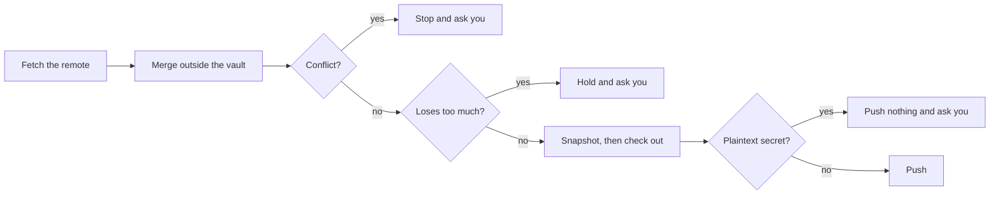

# Vault sync

Vault sync keeps the Coffer vaults on your machines the same through a git repository you own, so a laptop and a desktop hold the same knowledge, skills, MCP servers, providers and channels. This page is for anyone who runs Coffer on more than one machine and wants to set it up, understand what it does to their files, and answer it when a round needs them.

## What it is for

Your vault, `~/.coffer/vault`, is already a git repository: every change to it is a commit, whether or not you sync (see [Editing the vault by hand](/guides/vault-files)). Sync adds one remote. Each **round** fetches it, lets git merge it with this vault outside the working tree, checks the result into the vault if the merge was clean, and pushes. A background worker runs a round every hour by default.

Four rules shape everything below:

- **The remote is a rendezvous, not a system of record.** Every machine keeps a complete vault. You can delete the repository and rebuild it from any one machine.
- **A clean merge is applied; any conflict stops for you.** When two machines changed the same thing in ways git cannot merge, nothing is checked out and nothing is pushed until you choose per file.
- **Secrets travel only as ciphertext, and only if you ask.** The master key that decrypts them never enters the repository; you carry it between machines yourself.
- **What a machine does with the vault stays on that machine.** Whether a resource is enabled here, and for which agents (its reach), your agents, the remote itself: none of it is in the vault, so none of it syncs.

## Before you start

- **A private, empty git repository you own.** GitHub, GitLab, a server of your own, a bare repository on a NAS, or a `file://` path on a USB drive all work. One vault syncs with at most one remote.
- **Credentials git can use without prompting.** Coffer runs `git` with your global and system git configuration switched off and terminal prompts disabled, so a credential helper in `~/.gitconfig` or macOS's keychain helper is not consulted. Pick one:
  - **HTTPS with a token** stored in Coffer's secret store and chosen under **Secret** on the Sync page. Coffer hands it to git through a credential helper that reads it from the environment of that one `git` process. It never appears in the URL, the command line, the repository's config or an error message.
  - **SSH** (`git@host:…` or `ssh://…`): a key your SSH setup can use with no passphrase prompt.
  - **`file://`**: no secret.
- **`git` 2.40 or later on every machine.** A round merges with `git merge-tree`, which older versions lack. If it is missing, the Sync page reports `git missing` with a prompt that hands installing it to your agent.
- **The same Coffer version on every machine.** A remote written by another vault layout is refused (see [Troubleshooting](#troubleshooting)).
- **The vault outside any cloud-synced folder.** A vault inside Dropbox, iCloud Drive, Syncthing or another File Provider folder pauses sync: two tools syncing one git repository corrupt it.

## Set up the first machine

### GitHub

1. Create a private, empty repository and a fine-grained personal access token with **Contents: Read and write** on it.
2. On the **Secrets** page choose **Add secret**, name it (for example `github-sync-token`), paste the token as the value. The value is never shown back and stays out of your shell history.
3. On the **Sync** page enter the **Repository URL**, choose the token under **Secret**, then press **Check repository**. You can also skip step 2 and paste the token straight into the empty **Secret** field: Coffer stores it as a new secret when the remote is saved.

### GitLab

1. Create a private, empty project, then a **project access token** on it (**Settings › Access tokens**) with the **`write_repository`** scope and a role that may push to the branch (Developer or higher; Maintainer if the branch is protected). A personal access token with `write_repository` works too.
2. Add the token as a secret on the **Secrets** page (**Add secret**), as for GitHub. On the **Sync** page enter the **Repository URL**, choose the token under **Secret**, then press **Check repository**. Coffer sends the user name GitLab expects (`oauth2`) on its own.

   For a self-managed GitLab, use your instance's host in place of `gitlab.com`.

3. Or use SSH instead of a token, with a key added to your GitLab account: enter `git@gitlab.com:<you>/<repo>.git` as the **Repository URL** and leave **Secret** as **None**.

### The username sent with a token

Git sends a username with every HTTPS token. You do not set it: Coffer picks it from the host in the remote's URL.

| Host | Username sent |
| --- | --- |
| `bitbucket.org` | `x-token-auth`, which is what a Bitbucket repository or workspace access token expects. |
| A host whose name contains `gitlab` (`gitlab.com`, a self-managed GitLab) | `oauth2`. |
| Any other host, including GitHub and Azure DevOps | `coffer`; both ignore the name when given a token. |

Bitbucket App passwords need your own account name, so they are not supported; use an access token. An SSH or `file://` remote sends no user name.

### Options

The **Remote** tab holds these fields. Each saves when you leave it.

| Field | Default | Meaning |
| --- | --- | --- |
| **Branch** | `main` | The branch every machine syncs on. |
| **Run a round** | Every hour | How often a round runs automatically, from every minute to every few days, or **Only when I press Sync now**. |
| **Include encrypted secrets** | off | Carry the encrypted secrets (`vault/secret/`). The master key is never carried under any setting. |
| **Secret** | **None** | The push token in the secret store. |

**Check repository** tells you what a URL holds before you store it: empty, a Coffer vault (and its layout), another repository, unreachable, or refusing the token.

A token you stored a moment ago for this remote is used at once. Pointing a token that already pushes somewhere at a **different** URL is sending a secret somewhere new, so it waits until you approve it in the desktop app: the page says **The push token is waiting for your approval**, with **Check again**. Until then rounds report a sign-in problem. See [Secrets → Approvals](/guides/secrets#approvals).

### Join it

Joining is always explicit, even on the first machine. The **Sync** page shows set-up until this machine has joined: **Repository URL**, **Branch**, **Secret**, **Run a round**, **Include encrypted secrets**, then **Check repository**. An empty repository offers **Push and start syncing**, which pushes everything this vault holds. One that already holds a vault shows the join preview (what comes down, what is the same, what differs, what goes up, and that nothing is deleted) with **Join and pull**; nothing applies until you press it.

## Join another machine

1. Install the same Coffer.
2. If the remote needs a token, add it as a secret on the **Secrets** page, then fill in the same fields on the **Sync** page.
3. Press **Check repository** and read the join preview before you press **Join and pull**. It names the case and what moves in each direction:

- **A new machine takes the union.** Files only the remote has come down, files only this machine has go up, identical files need nothing. A file both hold with different content is left exactly as it is here, and not pushed, until you choose. Nothing is deleted on either side.
- **A returning machine resumes from its last base.** The remote already holds this machine's descriptor (you reinstalled Coffer or lost `~/.coffer`), naming the commit it last reached. The join is an ordinary merge from there: deletions made while it was away are applied here, its own edits are kept, and nothing deleted comes back.

Settle the files a join left different, one at a time or all at once. The **Status** tab lists them under **Differ from this Mac**, with **Choose versions** and **Hand off to &lt;Agent&gt;**. **Choose versions** opens the same Resolve page a stopped round's conflicts use: each file offers **Keep this Mac's**, **Take &lt;machine&gt;'s**, **Open in editor** and **Hand off to &lt;Agent&gt;**, and the page ends in **Apply choices**. To merge a differing file by hand, **Open in editor** opens the marked-up copy; **Mark resolved** takes it as this machine's version, which the next round pushes.

Until a machine has joined, rounds move nothing and end as `join required`.

## Move the master key

Only needed when the remote carries secrets. On a machine that has the key, open the **desktop app** and back the key up on **Settings › Security**: choose a passphrase, confirm with Touch ID or your login password, pick a folder, and the app writes the passphrase-protected `coffer-master-key.cfk` there with mode `0600`. No command, route or browser page exports the key, because an agent could run it; see [Secrets → The master key and its backup](/guides/secrets#the-master-key-and-its-backup).

Carry the file over a channel you trust (a password manager, `scp`, a USB stick), never through the sync repository. On the other machine, **Import a master key** on **Settings › Security** in the desktop app (it asks for Touch ID) does the rest, with the two keys' fingerprints side by side before anything is replaced, and asks for the passphrase the backup was made with. Delete the copied file afterwards. The key it replaces is kept as a backup, in a second Keychain item. Without the key, sync still works, but secrets that arrived cannot be decrypted here and the resources that need them cannot start. The **Machines** tab flags a machine whose key differs from this one's.

## What travels and what stays

| Travels | Stays on each machine |
| --- | --- |
| Definitions of MCP servers, skills, knowledge collections, providers and channels (`vault/resources/`) | Agents (`local/resources/agent/`): each machine registers its own |
| Knowledge documents (`vault/knowledge/`), skill folders (`vault/skills/`) | **Reach**: each resource's enabled switch and agent scope (`local/reach.json`) |
| MCP capability switches, channel pairings, the speech-to-text model and upkeep settings (`vault/state/`) | The sync remote, retention, the secret boundary's approvals (`local/`) |
| Secret ciphertext (`vault/secret/`), with **Include encrypted secrets** | Memory, caches and the `coffer-guide` skill (`derived/`), which each machine rebuilds |
| One descriptor per machine (`vault/machines/`) | Conversations, audit and invocation logs (`runs.db`), attachments (`content/`), logs, the master key |

Some consequences to know:

- **Reach is set per machine.** A server that should run only on the desktop is registered everywhere but disabled on the laptop. A resource arriving on a machine for the first time takes that machine's default reach.
- **A channel travels, but its adapter runs on one machine.** A chat bot can have only one consumer, so each channel names the machine that runs it. To move a bot, change the machine that runs it on the channel's page, from the machine that currently runs it. See [Channels](/guides/channels).
- **Nothing rewrites your documents unattended.** Tidying is done by an agent when you press **Tidy**, and the result syncs like any other edit. See [Knowledge](/guides/knowledge).
- **The plugin inventory records, it does not install.** Each machine's descriptor lists its agents' plugins; nothing is written into any agent's configuration.
- Paths under your home directory are stored against a `${HOME}` placeholder and expanded with each machine's own home.

## What a round does

```mermaid
flowchart LR
  A["Fetch the remote"] --> B["Merge outside the vault"]
  B --> C{"Conflict?"}
  C -- "yes" --> S["Stop and ask you"]
  C -- "no" --> D{"Loses too much?"}
  D -- "yes" --> H["Hold and ask you"]
  D -- "no" --> E["Snapshot, then check out"]
  E --> P{"Plaintext secret?"}
  P -- "yes" --> N["Push nothing and ask you"]
  P -- "no" --> F["Push"]
```

A deletion is applied only when some machine actually deleted that file relative to the shared base; a machine that merely lacks a file deletes nothing. A file you are editing right now is never overwritten: the round waits on it (`waiting on an edit`) and names the file. A round with nothing to do records `nothing to do`.

Rounds run on the schedule set by **Run a round** on the **Remote** tab. To run one now, use **Sync now** in the Sync page's header.

## Watch what sync is doing

On the web, the **Sync** page's header says in one word where this Mac stands: **In sync**, **N changes to push**, **N changes pulled**, **Syncing**, **Stopped**, **Push failed**, **Remote unreachable**, **Sign-in failed** or **Paused**. Beside it is **Sync now**, always the page's primary button, and under the title the remote's URL with a copy button. The page has no help icon, and three tabs:

- **Status** opens first. It shows what the status means with one grey line under it of what syncs (knowledge documents, skills, MCP server and tool definitions, and whether secrets are synced). With changes waiting to push it carries **Review changes**, which opens `/sync/pending`: every file the next push carries, once each however many saves touched it, with who wrote it last; the chosen file shows its change since the last push, and **Push now** runs the round at once (it still pulls first). Below that come any card that needs you, and every round this machine has run, as a table of when, the round, what it pulled and what it pushed. A problem card, such as sign-in failed, has an **×** that ignores it, like **Ignore** on Overview; it comes back when the problem changes. The git missing card has no **×**: Overview reports a missing git under the CLIs page, where it is ignored. Consecutive rounds that ended the same way fold into one row. The table footer always counts rounds rather than rows, for example **Loaded 38 of 38 rounds** or **Loaded 20 of 38 rounds**. Click a round to see its safety snapshot, the commits it pulled, what it changed here and what it pushed. Each file under **Applied here** and **Pushed** opens in place to its line-by-line diff, with its `+N −M` line counts: for an applied file, this machine's version before the round against after; for a pushed one, the version the remote held against what was pushed. An encrypted secret shows no contents, a binary file or a very large one is not shown line by line, and a round whose commits have since been removed from the vault says its versions are no longer available. Pulled commits carry no diff.
- **Machines** lists the machines (see [Manage the machines](#manage-the-machines)).
- **Remote** holds the remote's settings.

When a round needs you, **Overview** lists it under **Needs you**, and the desktop app raises a notification.

## Resolve a conflict

When two machines change the same lines of the same file before either syncs, git cannot merge them. The round stops. Nothing is checked out and nothing is pushed, so the vault on this machine stays as it was.

The **Status** tab says how many files changed on both Macs, with **Resolve conflicts** and **Hand off to &lt;Agent&gt;** (which hands every file an agent may merge over at once). **Resolve conflicts** opens one page for all files, listed down the left. Each file offers **Keep this Mac's** and **Take &lt;machine&gt;'s**, with what the choice changes here (take theirs also shows the diff it makes), and **Open in editor**, then **Mark resolved**. To merge by hand, **Open in editor** opens a marked-up copy under `~/.coffer/derived/sync-conflicts/`: edit it and remove every conflict marker. The page shows none of that copy's text and has no merge editor of its own: the editor is where you read and change it. A copy that still has a marker is refused, and the message names the line. The vault's own file never receives a marker. One file can also be handed to an agent on its own. **Continue round** appears when every file has an answer. **Leave for later** is a real answer too: the vault stays as it is here.

### Merge with an agent

Merging two edits of one file is a job for your agent. On a stopped round, **Hand off to &lt;Agent&gt;** (all the files at once, from the card; or one file, from the Resolve page) starts your hand-off agent in your preferred terminal with a prompt as its first message, and its menu's **Copy prompt** copies it. The prompt states the goal and the constraints, with no shell command in it:

- the vault, to read for context;
- each file, when each machine changed it, and the marked-up copy Coffer wrote under `~/.coffer/derived/sync-conflicts/` for the merge;
- keep what each side added, and ask you where the two contradict;
- write only those copies: the vault's own files and its git history are left alone, because Coffer writes the merged file into the vault.

An agent's merge is never an answer by itself. When a copy holds a merge, the file reads **Merged by an agent · check it**. Coffer shows no diff of the merge: read the copy in your editor (**Open in editor**) before you answer, with two choices:

- **Mark resolved** takes the copy as the file's answer. Coffer refuses while the copy still has a conflict marker, naming the line.
- **Back to two choices** forgets the copy and the hand-off, and the file is open to **Keep this Mac's** or **Take &lt;machine&gt;'s** again.

Then **Continue round**.

An encrypted secret (`secret/*.enc`) is never handed to an agent or edited by hand. It offers only the two choices, and the prompt never carries its contents.

A resource with the same name but a different uid on each side (two machines created `jira` independently) is a conflict too. Secret ciphertext never conflicts: the more recently encrypted value wins.

## When a round is held for deletions

A round that would lose **20 or more** files in one area, or **5 or more** that are over **half** of one area, stops before touching anything. Removing a few files from a small area — three of five MCP servers — goes through. The thresholds are fixed. The breaker runs in both directions:

- **incoming**: the remote would delete a large part of this vault;
- **outgoing**: this machine would push the deletion of a large part of the remote, which is what a reinstall, a failed restore or a stray `rm -rf` looks like from inside.

A file that reappears at another path in the same round is a move, not a loss, and a resource file counts by its uid, so reorganising or renaming never asks.

Either answer continues the round. On the web the **Status** tab says who deleted how many files, and **Review deletions** lists every one of them, folder by folder; the chosen file shows its whole text as the lines a delete removes. Its foot has two buttons, **Keep the files** and **Delete N files**. Each acts at once: the page already shows what a delete removes, so no second dialog repeats it, and a safety snapshot is taken before a delete. If this machine was just reinstalled or restored, keep the files: do not delete.

## When a round finds a plaintext secret

Before a round pushes, it reads every file version the push would publish: each file changed in every commit the remote does not have yet. It uses the same detection as [Find plaintext keys](./secrets.md): the bundled gitleaks rules for more than 200 credential formats, a password assigned to a password-named key, and a password inside a URL. References, `$VAR`, placeholders and code are left alone. Encrypted secret files (`secret/*.enc`) are ciphertext and are not read.

A value pushed to the remote stays in its history, in every clone and in every backup of either, so a round that finds one pushes **nothing** and says `plaintext found`. Pulling from the other machines still works; only this machine's push waits. The Sync page, the Overview's list name each place by file, line, key and the rule that found it, never the value.

To decide whether a place is a real secret, open it on the Sync page. It shows the flagged line with three lines either side, read from the version the round found, and every value on them **masked**: each character becomes `•`, so the code around it reads as it is. Only a well-known token format's public prefix (`ghp_`, `sk-`, `AKIA`) or a URL's scheme stays visible. Under the lines, the value's shape is described in words: how many characters, which kinds (lowercase, uppercase, digits, symbols), and a hint when it looks like something other than a secret — code such as `process.env.API_TOKEN` (names joined by dots), a placeholder word such as `example` or `dummy`, or one character repeated. The place also says whether the file is new or changed, and whether that line is already on the remote; for a changed file, **Show changes** shows what changed against the remote's copy, masked the same way. Nothing is stored for this, and Coffer never shows the value itself.

- **Move it into secrets.** **Move into secrets…** opens the Secrets page's [Find plaintext keys](./secrets.md) right on the Sync page, listing only what it finds in the flagged files: review the dry run, then apply, and each value moves into the encrypted store with a `coffer://secret/<id>` reference in its place. It moves values out of skill files; a flagged file that is not one (a knowledge document, say) you edit yourself so it refers to a secret by name, and when none of the flagged files is a skill's, the dialog says so. A secret is never handed to an agent here: a prompt would send the agent to the file that holds it. Then press **Sync now**. The old value is still in the unpushed commits, so the round folds them into one commit that holds the files as they are now, and pushes that. The files on disk do not change; the separate history entries of those unpushed edits become one.
- **Push anyway.** If a place is an example or a test value and not a real secret, **Push anyway…** asks first, records who pushed which files in the audit log, and pushes exactly the versions it showed you. It also remembers each of those values as [not a secret](/guides/secrets#the-secrets-page) on this machine, so editing another line of the same file later does not stop the push again; a changed value does.

A round that stopped for you keeps why. Click it on the **Status** tab and its drawer leads with what stopped it — the deletions held, the conflicting files, or where the plaintext secret was — and lists those files, even after you have answered and a later round did the work.

## Roll back a round

Every round snapshots the vault before it checks anything out, and the ten most recent snapshots are kept.

Rolling back puts back what that round changed, as a new commit on this machine that the next round pushes, so the other machines follow. Files you edited since the round are kept, and the plan lists them. A round that applied nothing, or a rollback, cannot be rolled back. Click a round on the **Status** tab and choose **Roll back to before this round** in its drawer (it is nowhere else); it shows the same plan first.

For older states of a single file or folder, use the vault's own history: [History and restore](/guides/vault-files#history-and-restore).

## Manage the machines

A machine's id is derived from the host (`IOPlatformUUID` on macOS, `/etc/machine-id` on Linux), hashed before it is published, and survives reinstalling Coffer. Where no host identifier is readable, Coffer stores a generated id in `~/.coffer/machine-id`, which does not survive deleting `~/.coffer`. Renaming changes only a label. Retiring removes the machine's descriptor in a commit of yours and rewrites nothing else; a channel still bound to it runs nowhere until you bind it elsewhere. A retired machine that syncs again comes back.

The **Machines** tab lists every machine with when it was last seen, its last round, its Coffer version and its agents. This Mac is tagged **This Mac**. The row's menu renames this Mac (other Macs see the name after their next round) and retires any other one. Retiring runs at once, with no confirmation, and the toast that says so offers **Undo**, which registers the machine again exactly as it was. A machine can only rename itself, because each machine writes only its own descriptor.

## Pause or stop syncing

- **Pause:** set **Run a round** to **Only when I press Sync now** on the **Remote** tab. The timer stops; the remote, its settings and the history are kept. **Sync now** still runs a round when you ask. Choosing a schedule again switches the timer back on.
- **Stop syncing:** **Stop syncing** on the **Remote** tab. It runs at once, with no confirmation: this machine forgets the remote; the vault, its history and the repository are left as they are. In the web UI the toast offers **Undo**, which puts back the remote's settings (the push secret as a name), whether this machine had joined, a round waiting for you and a join's differing files, as long as no other remote has been set since. Otherwise syncing again means joining again.

## Troubleshooting

| Symptom | Cause | Fix |
| --- | --- | --- |
| `join required`, nothing moves | This machine has not joined the remote. | Press **Join and pull** on the **Sync** page. |
| `sign-in refused` | No usable secret (your git config and keychain helper are not consulted), the token lacks push rights, or a token for a new URL is waiting for approval. | Store a token with the right scope and choose it under **Secret**, approve it in the desktop app, or use an SSH key that needs no prompt. |
| `remote unreachable` | Network, VPN or a wrong URL. | Nothing is lost; the next round that gets through carries the changes. |
| `push failed` | Applied here, but the remote refused the push (a protected branch, a read-only token). | Fix the branch protection or the token; the next round retries. |
| `plaintext found` | A file the round would push holds what looks like a plaintext secret; nothing was pushed. | **Move into secrets…** and sync again, or **Push anyway…** if it is not a secret. |
| `git missing` | No `git` on the PATH the daemon uses. | Install git the way that fits the machine (**Hand off to &lt;Agent&gt;** on the card), then press **Check again**. |
| `paused (cloud folder)` | The vault is inside a folder Dropbox, iCloud Drive, Syncthing or similar also syncs. | Press **Move the vault…** on the Status tab: Coffer pauses rounds and agent writes, moves the folder (to `~/.coffer/vault` unless you choose another place outside any synchronised folder), checks the git repository there and resumes. The old folder is left empty; delete it yourself. |
| `remote too new` | Another machine runs a newer Coffer. | Upgrade this machine. |
| `waiting on an edit` | You have an unsaved or invalid edit on a file the round would change. | Finish or fix the edit (`coffer vault problems` lists invalid ones); the next round continues. |
| A held round after reinstalling Coffer | The empty vault would push its loss. | **Keep the files** in **Review deletions** on the **Status** tab. |
| Secrets cannot be decrypted | This machine lacks the master key they were encrypted with. | **Import a master key** on **Settings › Security**, with the key from a machine that has it. |

A refused push, a refused sign-in, an unreachable remote and a missing git each come with a prompt for your agent (a plaintext secret has none, above). The prompt names the remote without its credentials, the branch, the secret's name and git's message with tokens scrubbed, and says what to check. It is on the Sync page next to the message. It never carries or asks for a token. **Retry** stays Coffer's own button.

For failures that do not fit here, the round's message is on the **Status** tab, and the daemon log (**Activity → Daemon**) has the detail.

## How it works

The round's steps, the breaker, joining and the reasons behind each are in [Vault sync architecture](/architecture/vault-sync).

## Related

- [Editing the vault by hand](/guides/vault-files)
- [Secret store](/guides/secret-store) · [Secrets](/guides/secrets) · [Channels](/guides/channels) · [Knowledge](/guides/knowledge)
- [CLI reference](/reference/cli)
- Spec: [vault-sync](https://github.com/wyx-sg/Coffer/blob/main/openspec/specs/vault-sync/spec.md) · Decisions: [Sync Only Pulls and Pushes the Vault Repository](https://github.com/wyx-sg/Coffer/blob/main/docs/decisions/sync-applies-clean-merges-and-stops-on-any-conflict.md), [Per-Agent Resource Scope](https://github.com/wyx-sg/Coffer/blob/main/docs/decisions/per-agent-resource-scope.md)
