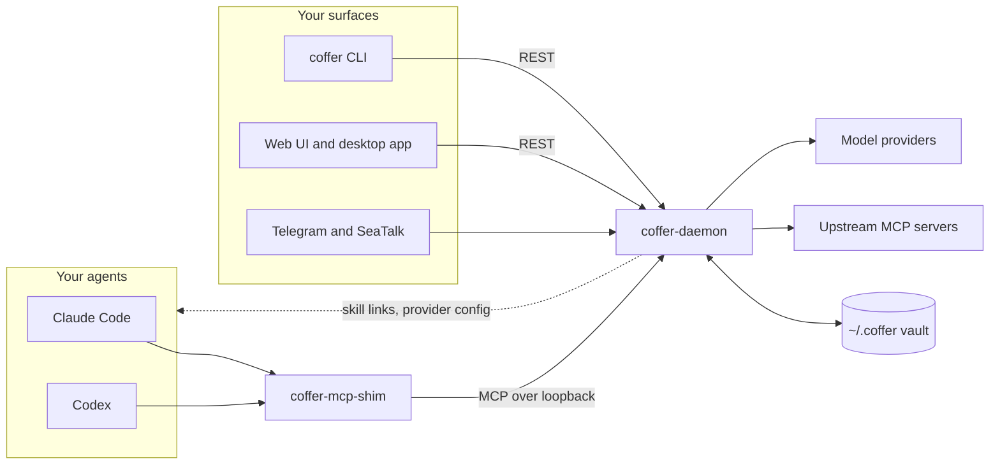

## How it works

Coffer is a daemon that runs on your machine and holds your vault in `~/.coffer`. Agents reach it through a small stdio shim that Coffer writes into each agent's MCP config. You manage it from the CLI, the web UI, the desktop app or a chat channel. All of these talk to the same daemon.



- **The gateway.** Each agent session gets its own set of upstream MCP servers. Coffer lists their tools under a `<server>__<tool>` prefix, next to its own `coffer__*` tools.
- **Delivery into agents.** Skills arrive as directory links in each agent's `skills/` folder. Provider switches are written into the agent's own config file. Coffer never copies an agent's files into its database.
- **The vault.** Configuration and state live in `~/.coffer/coffer.db` (SQLite). Skills, knowledge and memory are plain files in the same directory, and secrets are encrypted.

The [architecture overview](/architecture/) explains each part in depth.

## Install in one line

On a Mac with Apple silicon:

```sh
curl -fsSL --proto '=https' --tlsv1.2 https://wyx-sg.github.io/Coffer/install.sh | sh
```

This installs `coffer`, `coffer-daemon` and `coffer-mcp-shim` into `~/.coffer/bin` and adds that directory to your `PATH`. The [install guide](/start/install) also covers the desktop app, building from source, upgrading and uninstalling.

::: warning No tagged release yet
The installer downloads from a tagged GitHub release, and none is published yet, so for now [install from source](/start/install#from-source).
:::

## Where to next

- **[Getting started](/start/)**: what Coffer is, why it works the way it does, and a [15-minute quickstart](/start/quickstart).
- **[Guides](/guides/agents)**: step-by-step tasks for agents, MCP servers, skills, knowledge, memory, providers, chat, channels and sync.
- **[Architecture](/architecture/)**: how the daemon, the gateway, the resource framework and the vault fit together, and the reasons behind the design.
- **[Reference](/reference/cli)**: every CLI command, MCP tool, REST route, configuration key and error code.
- **[Contributing](/contributing/)**: how to set up a development environment and change Coffer through its specs.
