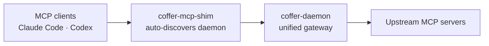

<div style="text-align:center; margin: 2.5rem 0 1rem;">
  
</div>

<div style="display:flex; gap:1rem; flex-wrap:wrap; justify-content:center; margin-bottom:1rem;">
  
  
</div>

## How it works



## Quickstart

```bash
coffer mcp add filesystem --stdio "npx -y @modelcontextprotocol/server-filesystem /tmp"
claude mcp add coffer coffer-mcp-shim
```

[Read the full guide →](/guide/getting-started)
