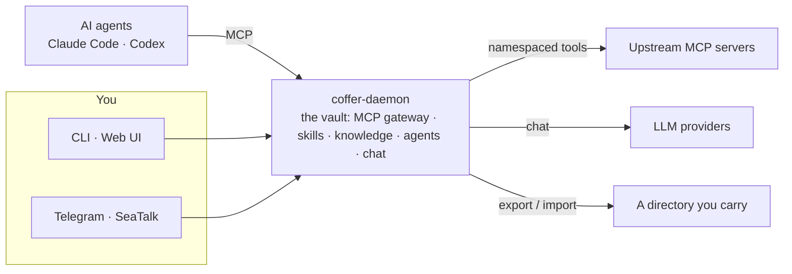

## How it works



Coffer is a long-lived local daemon that holds your vault. The MCP gateway is one part of it: every AI agent connects through one auto-discovering endpoint and sees the same tools, skills, and knowledge — while secrets stay encrypted and nothing leaves your machine. Moving to another of your own machines is an explicit act: export the vault to a directory, carry it across, import it there.

## Quickstart

```bash
# Aggregate an upstream MCP server, then point Claude Code at Coffer.
coffer mcp add filesystem --stdio "npx -y @modelcontextprotocol/server-filesystem /tmp"
claude mcp add coffer coffer-mcp-shim

# Curate a knowledge collection and a shared skill — your agents pick them up automatically.
coffer knowledge create handbook
coffer skill import ./my-skill

# Reach your agents from your phone — pair a channel, then chat over IM.
coffer channel add work --type telegram --credential-ref telegram.token
coffer channel pairing-code work
```

[Read the full guide →](/guide/getting-started)
