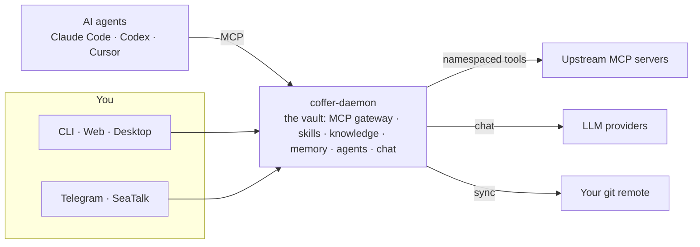

## How it works



Coffer is a long-lived local daemon that holds your vault. The MCP gateway is one part of it: every AI agent connects through one auto-discovering endpoint and sees the same tools, skills, knowledge, and memory — while secrets stay encrypted and nothing leaves your machine unless you sync it to a git remote you own.

## Quickstart

```bash
# Aggregate an upstream MCP server, then point Claude Code at Coffer.
coffer mcp add filesystem --stdio "npx -y @modelcontextprotocol/server-filesystem /tmp"
claude mcp add coffer coffer-mcp-shim

# Curate a knowledge base and a shared skill — your agents pick them up automatically.
coffer kb create handbook
coffer skill import ./my-skill

# Chat with Coffer's built-in agent from the terminal.
coffer chat -m "what MCP servers and knowledge bases do I have?"
```

[Read the full guide →](/guide/getting-started)
