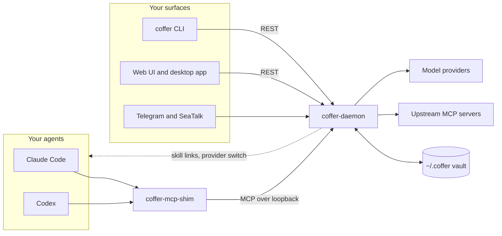

## Start here

New to Coffer? Read these five pages in order. Together they take about half an hour, and leave you with Coffer running and a picture of how it works.

1. **[What is Coffer?](/start/)** The problem it solves, what it manages and where you use it.
2. **[Install](/start/install)** Hand the install to your coding agent, or pick an install path yourself.
3. **[Quickstart](/start/quickstart)** Connect Claude Code, register an MCP server and add a skill in about fifteen minutes.
4. **[Core concepts](/start/concepts)** Resources, kinds, reach and the vault: the vocabulary every other page uses.
5. **[Architecture overview](/architecture/)** How the daemon, the gateway and the vault fit together, and why.

After that, go to the [guides](/guides/) for a task, or the [reference](/reference/cli) for a command.

## How it works

Coffer is a daemon that runs on your machine and holds your vault in `~/.coffer`. Agents reach it through a small stdio shim that Coffer writes into each agent's MCP config. You manage it from the CLI, the web UI, the desktop app or a chat channel. All of these talk to the same daemon.


```mermaid
flowchart LR
  subgraph agents["Your agents"]
    CC["Claude Code"]
    CX["Codex"]
  end
  subgraph surfaces["Your surfaces"]
    CLI["coffer CLI"]
    WEB["Web UI and desktop app"]
    IM["Telegram and SeaTalk"]
  end
  CC --> SHIM["coffer-mcp-shim"]
  CX --> SHIM
  SHIM -->|"MCP over loopback"| D["coffer-daemon"]
  CLI -->|"REST"| D
  WEB -->|"REST"| D
  IM --> D
  D <--> V[("~/.coffer vault")]
  D --> UP["Upstream MCP servers"]
  D --> PR["Model providers"]
  D -.->|"skill links, provider switch"| agents
```

- **The gateway.** Each agent session gets its own set of upstream MCP servers. Coffer lists their tools under a `<server>__<tool>` prefix, next to its own `coffer__*` tools.
- **Delivery into agents.** Skills arrive as directory links in each agent's `skills/` folder. A provider switch points the agent's own config at Coffer's local model proxy. Coffer never copies an agent's files into its own store.
- **The vault.** Configuration and content live as plain files in `~/.coffer/vault`, a git repository: one JSON file per resource, skill folders, knowledge collections, and secrets as ciphertext. You can edit any of them by hand, and every change has a history. History such as the audit log lives beside it in `runs.db`.

The [architecture overview](/architecture/) explains each part in depth.

## Install

Coffer runs on your Mac, and the quickest install is to let the coding agent you already use do it. Paste the prompt from [Let your agent install it](/start/install#let-your-agent-install-it) into Claude Code or Codex: the agent reads the install page, picks the path that fits your machine and checks the result, asking before it touches anything outside Coffer's own directory.

To install by hand, the [install page](/start/install) covers every path. The one-line installer, the desktop app and the release archive download a tagged GitHub release for macOS on Apple silicon:

```sh
curl -fsSL --proto '=https' --tlsv1.2 https://wyx-sg.github.io/Coffer/install.sh | sh
```

This installs `coffer`, `coffer-daemon` and `coffer-mcp-shim` into `~/.coffer/bin` and adds that directory to your `PATH`. Until a release is tagged, and on any machine without a release build, [install from source](/start/install#from-source) with Python 3.12 or later.

## Where to next

- **[Getting started](/start/)**: what Coffer is, why it works the way it does, and a [15-minute quickstart](/start/quickstart).
- **[Guides](/guides/)**: step-by-step tasks for agents, MCP servers, skills, knowledge, memory, providers, chat, channels and sync.
- **[Architecture](/architecture/)**: how the daemon, the gateway, the resource framework and the vault fit together, and the reasons behind the design.
- **[Reference](/reference/cli)**: every CLI command, MCP tool, configuration key and error code.
- **[Contributing](/contributing/)**: how to set up a development environment and change Coffer through its specs.
