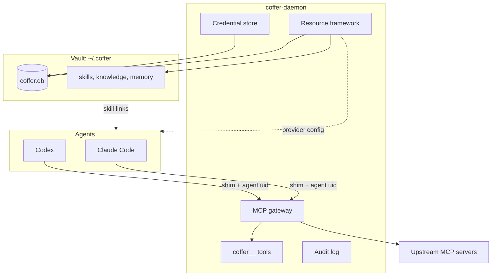

# Core concepts

This page defines the terms the rest of the documentation uses. Read it once before the guides. Each concept has a short definition and links to the guide that shows how to use it and the architecture page that explains how it works.

## The picture

## Daemon

`coffer-daemon` is the one long-running process that owns all of Coffer's state. It listens on `127.0.0.1`, on port 8000 unless you set a different one. It serves the REST API under `/api/v1`, the MCP endpoint at `/mcp`, and the web UI. It is the only process that writes the database. The CLI, the shim and the desktop app are all clients that find the daemon through `~/.coffer/daemon.json` and start one if none is running.

Guide: [Running the daemon](/guides/daemon). Architecture: [Daemon and processes](/architecture/daemon).

## Vault

The vault is the directory `~/.coffer` and everything in it. `coffer.db` (SQLite) is the system of record for configuration, resources, the audit log and encrypted credentials. Skills, knowledge and memory are plain file trees next to it, and those files are the only copy: Coffer does not index or embed them. To back up Coffer, copy this directory with the daemon stopped.

Reference: [Files and directories](/reference/filesystem). Architecture: [Persistence](/architecture/persistence).

## Resource and kind

Everything you manage in Coffer is a **resource**, and every resource has a **kind**. There are seven kinds: `mcp_server`, `agent`, `skill`, `knowledge`, `memory`, `channel` and `provider`. Every kind shares one lifecycle: create, update, enable or disable, rename, delete, with each change audited. What a resource *does* is up to its kind. The kind-agnostic commands (`coffer resource list`, `enable`, `disable`, `rename`, `delete`) work on any kind.

Architecture: [Resource framework](/architecture/resource-framework).

## uid and name

Each resource has an immutable **uid**: an opaque 32-character hex string, created once, never reused, and identical on every machine that holds the resource. Its **name** is a label you can change. Names are unique within a kind and are what you type in the CLI. Anything that must survive a rename refers to the uid. For example, the `--agent-uid` in an agent's MCP entry and the agent list in a resource's scope both store uids.

Architecture: [Resource framework](/architecture/resource-framework).

## Reach

A resource's **reach** decides where it takes effect. Reach has two parts:

- **`enabled`**: the on/off switch every resource has.
- **scope**: an optional allow-list of agents. No scope means every agent, `--agents a,b` means only those agents, and an empty list means none.

Scope applies to MCP servers (which agents see the server's tools), skills (which agents receive the skill), providers (which agents' config a switch writes into) and channels (which agents the channel may drive). Knowledge collections and memory partitions have `enabled` only. Reach is **machine-local**: it is set on the machine it applies to and never syncs, so each of your machines decides reach for itself.

Set scope with `coffer scope set <kind> <name> --agents <names>`, or from the **Reach** control on the resource's page in the web UI. Guide: [MCP servers](/guides/mcp-servers), [Skills](/guides/skills). Architecture: [Resource framework](/architecture/resource-framework).

## Agent

An **agent** is a registered local coding agent: Claude Code (`claude_code`) or Codex (`codex`). Registering an agent tells Coffer where its config directory is. Nothing is registered automatically: `coffer agent detect` only suggests candidates. The agent's own files stay the source of truth. Coffer reads its config, MCP entries, plugins, memory and transcripts when it needs them. It writes only allowlisted entries, atomically and with a `.bak` backup.

Guide: [Agents](/guides/agents). Architecture: [Resource framework](/architecture/resource-framework).

## MCP gateway and namespacing

The **gateway** presents Coffer to every agent as one MCP server. An agent's `coffer` entry runs `coffer-mcp-shim`, which forwards the session to the daemon. Each session gets its own set of upstream server processes. Every upstream capability is **namespaced** with its server's name: tools and prompts appear as `<server>__<tool>` and resources under a `coffer://<server>/…` URI, so two servers can never collide. You can switch individual tools off, and a server's scope hides it from agents outside that scope. When the catalogue grows past a budget (50 upstream tools by default), `tools/list` shows the most-used tools and `coffer__search_tools` searches the rest.

Guide: [MCP servers](/guides/mcp-servers), [Connect a client](/guides/connect-a-client). Architecture: [MCP gateway](/architecture/mcp-gateway).

## Built-in tools

Besides upstream tools, the gateway always offers Coffer's own tools, prefixed `coffer__`:

| Tool | What it does |
| --- | --- |
| `coffer__search_tools` | Ranks the full upstream catalogue against a plain-language query and returns real tool schemas the agent can then call. |
| `coffer__diagnose` | Reads Coffer's own logs, so an agent can look into a problem with Coffer. |
| `coffer__write` | Files new material into a knowledge collection. Available when Knowledge is on. |
| `coffer__recall` | Finds Coffer's distilled memory notes by literal match. Available when Memory is on. |

The gateway takes the calling agent's identity from the MCP handshake. It is not an argument the agent can set.

Reference: [MCP tools](/reference/mcp-tools).

## Skills and delivery

A **skill** is a folder containing a `SKILL.md` in the [AgentSkills](https://agentskills.io) format. Coffer keeps one master copy of each skill in `~/.coffer/skills/<name>/` and **delivers** it by linking that folder into each agent's `skills/` directory. A skill is delivered to an agent only while the skill is enabled and its scope includes that agent. Coffer checks this again whenever either changes, and repairs broken links when the daemon starts. `coffer-guide` is Coffer's own skill. It is rebuilt from the running build and delivered like any other, and it tells the agent about Coffer's tools and your knowledge collections.

Guide: [Skills](/guides/skills).

## Knowledge collections and curation

A **collection** is a folder under `~/.coffer/knowledge/<collection>/` holding one tree of Markdown documents that you and Coffer write together. A document's path is its identity. You can edit documents in any editor, and agents read them with their own file tools, finding them through the catalogue in `coffer-guide`. New material, whether from `coffer__write`, an upload or a channel, first lands in the collection's hidden `.inbox/`. A **curation** pass run by Coffer's own model then merges it into the existing documents. With no model configured, each item becomes a document on its own.

Guide: [Knowledge](/guides/knowledge). Architecture: [Knowledge](/architecture/knowledge).

## Memory partitions

Coffer **aggregates** each registered agent's own native memory, read-only. It never writes to an agent's memory files. It distils what it reads into notes of its own, filed into **partitions**: one per repository plus `global`. Each partition lives at `~/.coffer/memory/<partition>/` with a `MEMORY.md` index and a `notes/` directory. Everything there is derived and can be rebuilt. If you install a delivery hook for an agent, Coffer hands that agent the index at session start.

Guide: [Memory](/guides/memory). Architecture: [Memory](/architecture/memory).

## Providers

A **provider** is a model-provider profile: a wire protocol, a base URL and one credential ref. **Switching** to a provider writes it into the native config of each agent in its scope, so you change gateways once instead of once per agent. Switching back to an agent's own login is a separate action. One provider can also be marked as the default for Coffer's own model, which curation, memory distillation and transcription run on.

Guide: [Model providers](/guides/providers).

## Channels

A **channel** is a Telegram or SeaTalk bot bound to your registered agents. You pair your own IM account with it, then chat with Claude Code or Codex from your phone and receive notifications. A channel's scope names the agents it may drive. Channels sync with the vault, but each one is bound to the single machine whose daemon runs it. The web **Chat** page is the other way to drive an agent, and it can watch and continue conversations that started in a channel.

Guide: [Channels](/guides/channels), [Chat](/guides/chat). Architecture: [Chat and turns](/architecture/chat).

## Credential refs

Coffer stores secrets only as Fernet ciphertext, under a master key kept in a `0600` file (or in the macOS keychain if you choose). Resources never contain a secret. They contain a **credential ref**, a name such as `github.token`, which the daemon resolves only at the moment it starts an upstream server or sends a request. Set a secret with `coffer credentials set <ref>`. Plaintext never reaches the database, the logs or the audit log.

Guide: [Credentials](/guides/credentials). Architecture: [Security model](/architecture/security).

## Audit log

Every lifecycle change to a resource is written to the **audit log** with an actor: `cli`, `api`, `ui`, `system`, `sync`, `channel`, or an agent's name when the agent itself acted. The log sits beside two other records: the **MCP invocation log** (which tool was called, when, how long it took and the outcome, never the content) and the **daemon log**. The web UI's **Activity** page shows all three, each on its own tab.

Guide: [Activity and audit](/guides/activity). Architecture: [Observability](/architecture/observability).

## Experimental features

Three capabilities are switched on or off on each machine: **Sync** (`vault_sync`), **Knowledge** (`knowledge`) and **Memory** (`memory`). Their default comes from the build's channel: off on a `stable` release, on on a `dev` build. Switching one off hides its pages, commands and `coffer__` tools but deletes nothing. Switching it back on continues where it stopped. You can switch them under **Settings → General** or with `coffer daemon features enable|disable <key>`.

Guide: [Experimental features](/guides/experimental-features).

## Glossary

For one-line definitions of every term, see the [glossary](/reference/glossary).
