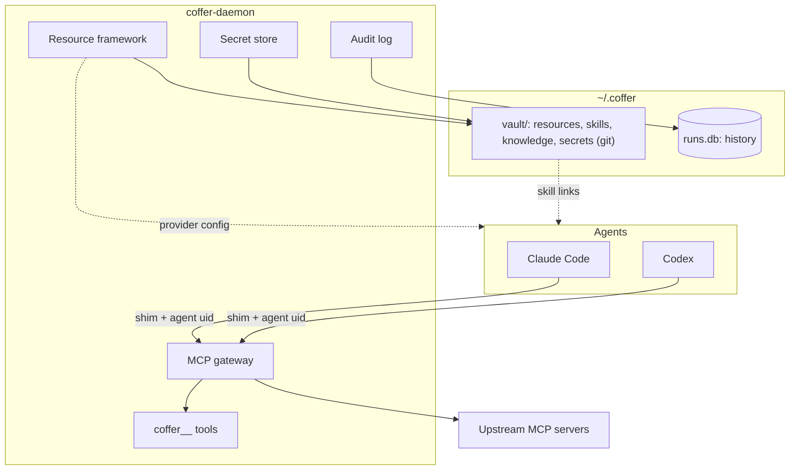

# Core concepts

This page defines the terms the rest of the documentation uses. Read it once before the guides. Each concept has a short definition and links to the guide that shows how to use it and the architecture page that explains how it works.

## The picture

```mermaid
flowchart TB
  subgraph agents["Agents"]
    CC["Claude Code"]
    CX["Codex"]
  end
  subgraph daemon["coffer-daemon"]
    GW["MCP gateway"]
    BT["coffer__ tools"]
    RF["Resource framework"]
    CR["Secret store"]
    AU["Audit log"]
  end
  subgraph vault["~/.coffer"]
    FILES["vault/: resources, skills, knowledge, secrets (git)"]
    DB[("runs.db: history")]
  end
  CC -->|"shim + agent uid"| GW
  CX -->|"shim + agent uid"| GW
  GW --> BT
  GW --> UP["Upstream MCP servers"]
  RF --> FILES
  AU --> DB
  CR --> FILES
  FILES -.->|"skill links"| agents
  RF -.->|"provider config"| agents
```

## Daemon

`coffer-daemon` is the one long-running process that owns all of Coffer's state. It listens on `127.0.0.1`, on port 38470 unless you set a different one. It serves the REST API under `/api/v1`, the MCP endpoint at `/mcp`, and the web UI. It is the only process that writes Coffer's state (you can also edit the vault's files by hand, and the daemon picks the edits up). The CLI, the shim and the desktop app are all clients that find the daemon through `~/.coffer/daemon.json` and start one if none is running.

Guide: [Running the daemon](/guides/daemon). Architecture: [Daemon and processes](/architecture/daemon).

## Vault

The vault is `~/.coffer/vault`, a git repository that holds your configuration and authored content as plain files: one JSON file per resource, the skill folders, the knowledge collections and encrypted secrets. Those files are the only copy, and every accepted change is a commit that names who made it, so any file can be compared with and restored to an earlier version. Beside the vault, `~/.coffer` keeps machine-local settings (`local/`), media (`content/`), history such as the audit log and conversations (`runs.db`), and derived state Coffer can rebuild, such as MCP server health (`derived/`). To back up Coffer, copy `~/.coffer` with the daemon stopped.

Guide: [Editing the vault by hand](/guides/vault-files).

Reference: [Files and directories](/reference/filesystem). Architecture: [Persistence](/architecture/persistence).

## Resource and kind

Everything you manage in Coffer is a **resource**, and every resource has a **kind**. There are six kinds: `mcp_server`, `agent`, `skill`, `knowledge`, `channel` and `provider`. Every kind shares one lifecycle: create, update, enable or disable, rename, delete, with each change audited (knowledge collections and agents cannot be disabled). What a resource *does* is up to its kind. Each kind has its own page in the web UI with the same controls (add, edit, remove, turn on or off and set reach, each where the kind supports it), so a skill and a channel are managed the same way.

Architecture: [Resource framework](/architecture/resource-framework).

## uid and name

Each resource has an immutable **uid**: an opaque 32-character hex string, created once, never reused, and identical on every machine that holds the resource. Its **name** is a label, unique within a kind, and it is what you see in the web UI. You can rename it from the resource's page, except for an MCP server's or a skill's name, which is fixed because agents quote it, and an agent's, which is its type. Providers and channels can also carry a **title**, up to 80 characters, that Coffer's pages show in place of the name; agents, MCP servers, skills and knowledge collections (shown by their folder name) have none. Anything that must survive a rename refers to the uid. For example, the `--agent-uid` in an agent's MCP entry and the agent list in a resource's scope both store uids.

Architecture: [Resource framework](/architecture/resource-framework).

## Reach

A resource's **reach** decides where it takes effect. Reach has two parts:

- **`enabled`**: the on/off switch. Knowledge collections and agents have none: they are always on.
- **scope**: an optional allow-list of agents. No scope means every agent, `--agents a,b` means only those agents, and an empty list means none.

Scope applies to MCP servers (which agents see the server's tools), skills (which agents receive the skill), providers (which agents' config a switch writes into) and channels (which agents the channel may drive). Knowledge collections have neither: each is served to every agent. Reach is **machine-local**: it is set on the machine it applies to and never syncs, so each of your machines decides reach for itself.

Set scope with `coffer <kind> scope <name> --agents <types>` (an agent is named by its type, such as `claude-code`) (`--all` for every agent, `--none` for none), or from the **Reach** control on the resource's page in the web UI. Guide: [MCP servers](/guides/mcp-servers), [Skills](/guides/skills). Architecture: [Resource framework](/architecture/resource-framework).

## Agent

An **agent** is a registered local coding agent: Claude Code (`claude_code`) or Codex (`codex`). A machine has at most one agent of each type, and its name is its type: `claude-code` or `codex`. Registering an agent tells Coffer where its config directory is, by default the type's standard one (`~/.claude`, `~/.codex`). Nothing is registered automatically: the **Agents** page only lists candidates. The agent's own files stay the source of truth. Coffer reads its config, MCP entries, plugins, memory and transcripts when it needs them. It writes only allowlisted entries, atomically and with a backup copy in Coffer's own folder (`~/.coffer/config-backups`).

Guide: [Agents](/guides/agents). Architecture: [Resource framework](/architecture/resource-framework).

## MCP gateway and namespacing

The **gateway** presents Coffer to every agent as one MCP server. An agent's `coffer` entry runs `coffer-mcp-shim`, which forwards the session to the daemon. Each session gets its own set of upstream server processes. Every upstream capability is **namespaced** with its server's name: tools and prompts appear as `<server>__<tool>` and resources under a `coffer://<server>/…` URI, so two servers can never collide. You can switch individual tools off, and a server's scope hides it from agents outside that scope. When the catalogue grows past a budget (50 upstream tools by default), `tools/list` shows the most-used tools and `coffer__search_tools` searches the rest.

Guide: [MCP servers](/guides/mcp-servers), [Connect a client](/guides/connect-a-client). Architecture: [MCP gateway](/architecture/mcp-gateway).

## Built-in tools

Besides upstream tools, the gateway always offers Coffer's own tool, prefixed `coffer__`:

| Tool | What it does |
| --- | --- |
| `coffer__search_tools` | Ranks the full upstream catalogue against a plain-language query and returns real tool schemas the agent can then call. |

There is no knowledge, memory or log tool. Agents read and change knowledge documents, which are Markdown files, with their own file tools, reach memory through their own native memory, and Coffer's records are read with `coffer log audit|mcp|daemon`.

The gateway takes the calling agent's identity from the MCP handshake. It is not an argument the agent can set.

Reference: [MCP tools](/reference/mcp-tools).

## Skills and delivery

A **skill** is a folder containing a `SKILL.md` in the [AgentSkills](https://agentskills.io) format. Coffer keeps one master copy of each skill in `~/.coffer/vault/skills/<name>/` and **delivers** it by linking that folder into each agent's `skills/` directory. A skill is delivered to an agent only while the skill is enabled and its scope includes that agent. Coffer checks this again whenever either changes, and repairs broken links when the daemon starts. `coffer-guide` is Coffer's own skill. It is rebuilt from the running build and delivered like any other, and it tells the agent about Coffer's tools and your knowledge collections.

Guide: [Skills](/guides/skills).

## Knowledge collections and tidying

A **collection** is a folder under `~/.coffer/vault/knowledge/<collection>/` holding one tree of Markdown documents that you and your agents write together. A document's path is its identity. The web UI shows documents read-only and opens them in your editor; you edit them there, and agents read and edit them with their own file tools, finding them through the catalogue in `coffer-guide`. To add knowledge, an agent writes a document straight into the collection; an upload becomes a document as it stands. The `coffer-guide` skill tells the agent where a fact belongs and how to tidy a collection: merge documents on one subject, split a long one, correct a stale statement. Coffer runs no model of its own over your documents. **Tidy** on a collection hands that job to your default agent, in a new conversation.

Guide: [Knowledge](/guides/knowledge). Architecture: [Knowledge](/architecture/knowledge).

## Memory sync {#memory-sync}

Coffer **syncs** what your agents learned into each other's own memory. Each machine reads its registered agents' native memory and publishes every memory an agent wrote itself into the **hub**, `~/.coffer/vault/memory/`, one file per memory, filed by project (the repository's remote) plus `global`; vault sync carries the hub to your other machines. Each machine then writes every hub memory into its other agents, in their own format: `coffer_*.md` files and a marked block in `MEMORY.md` for Claude Code, a memory extension folder for Codex. Coffer touches only its own copies and never edits a memory an agent wrote; merging and forgetting are each agent's own curation. Coffer puts no memory into a session itself: each agent loads its memory as it always does.

Guide: [Memory](/guides/memory). Architecture: [Memory](/architecture/memory).

## Providers

A **provider** is a model-provider profile: a wire protocol, a base URL and one secret ref. **Switching** to a provider writes it into the native config of each agent in its scope, so you change gateways once instead of once per agent. Switching back to an agent's own login is a separate action. One provider can also be marked as the default for speech to text, which transcribes voice messages.

Guide: [Model providers](/guides/providers).

## Channels

A **channel** is a Telegram or SeaTalk bot bound to your registered agents. You pair your own IM account with it, then chat with Claude Code or Codex from your phone and receive notifications. A channel's scope names the agents it may drive. Channels sync with the vault, but each one is bound to the single machine whose daemon runs it. The web **Conversations** page is the other way to drive an agent, and it can watch and continue conversations that started in a channel.

Guide: [Channels](/guides/channels), [Conversations](/guides/chat). Architecture: [Chat and turns](/architecture/chat).

## Secret refs

Coffer stores secrets only as Fernet ciphertext, under a master key kept in the macOS Keychain, where only Coffer's signed binaries can read it. Resources never contain a secret. They contain a **secret ref**, a name such as `github.token`, which the daemon resolves only at the moment it starts an upstream server or sends a request. Set a secret with `coffer secret set <ref>`. Plaintext never reaches the database, the logs or the audit log.

Guide: [Secret store](/guides/secret-store). Architecture: [Security model](/architecture/security).

## Audit log

Every lifecycle change to a resource is written to the **audit log** with an actor: `cli`, `api`, `ui`, `system`, `sync`, `channel`, or an agent's name when the agent itself acted. The log sits beside two other records: the **MCP invocation log** (which tool was called, when, how long it took and the outcome, never the content) and the **daemon log**. The web UI's **Activity** page shows all three, each on its own tab.

Guide: [Activity and audit](/guides/activity). Architecture: [Observability](/architecture/observability).

## Experimental features

A capability that is not ready for everyone yet ships as an experimental feature: it starts switched off and you switch it on, machine by machine. Switching one off makes it look absent — its pages, commands and `coffer__` tools disappear — but deletes nothing. When a feature is ready it graduates and loses its switch. Two features are experimental: Knowledge and Memory. Settings → Features lists them. Sync and Model providers have graduated and are always on.

Guide: [Experimental features](/guides/experimental-features).

## Glossary

For one-line definitions of every term, see the [glossary](/reference/glossary).
