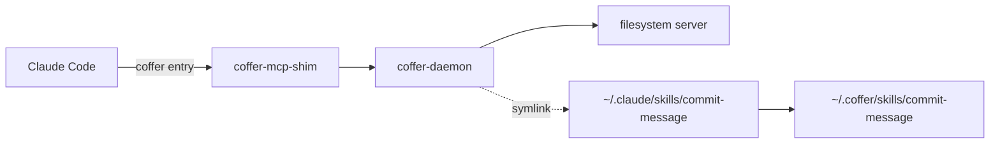

# Quickstart

This tutorial takes about 15 minutes. By the end you will have Claude Code connected to Coffer, an upstream MCP server registered once and visible to Claude Code as `filesystem__*` tools, and a skill delivered into Claude Code's `skills/` directory. Each step shows the CLI command first and the web UI path after it. Use whichever you prefer.

## Before you begin

You need:

- **Coffer installed**, with `coffer` on your `PATH`. See [Install](/start/install).
- **Claude Code installed**, with its config directory at `~/.claude`. Codex works the same way. Use `codex` wherever this page says `claude_code` or `claude-code`.
- **Node.js**, so that `npx` can run the example MCP server.

## 1. Start Coffer and open the UI

```sh
coffer daemon start
coffer open
```

```text
daemon started (pid=48213)
opened http://127.0.0.1:8000/ in your browser
```

`coffer open` opens `http://127.0.0.1:8000/` in your browser, already signed in. You can skip `coffer daemon start`, because any command that needs the daemon starts it. Running it here just shows you that the daemon is up. If a daemon is already running, the command prints `daemon already running`.

## 2. Register Claude Code

Coffer never registers an agent on its own. Ask it what it can find, then confirm.

```sh
coffer agent detect
```

```text
detected: claude_code -> add with `coffer agent add claude_code --name claude-code`
```

```sh
coffer agent add claude_code
```

```text
registered: agent claude-code
```

If you leave out `--name`, Coffer uses a default based on the type: `claude_code` becomes `claude-code`. If your Claude Code config is somewhere other than `~/.claude`, pass `--config-dir <path>`.

**In the web UI:** open **Agents**, click **Add agent**, tick Claude Code under **Detected agents**, and click **Add selected (1)**.

## 3. Install Coffer's MCP entry into Claude Code

```sh
coffer agent mcp install claude-code
```

```text
installed Coffer MCP into agent claude-code (/Users/you/.coffer/bin/coffer-mcp-shim)
```

This adds one entry to `mcpServers` in `~/.claude.json`. Coffer writes the file atomically and keeps a `.bak` of the previous version:

```json
{
  "mcpServers": {
    "coffer": {
      "command": "/Users/you/.coffer/bin/coffer-mcp-shim",
      "args": ["--agent-uid", "fdc37200d76f4ff094a29e41fd06e13c"]
    }
  }
}
```

The `--agent-uid` argument is how Coffer knows which agent a session belongs to. It lets you restrict a server or a skill to particular agents later. The command path is absolute because agents launched from a GUI do not inherit your shell's `PATH`.

**In the web UI:** open **Agents → claude-code** and click **Install Coffer MCP**. The badge beside the button changes from **Not installed** to **Installed**.

::: tip Why not `claude mcp add`?
You can add `coffer-mcp-shim` to any MCP client by hand. However, a hand-written entry has no `--agent-uid`, so Coffer cannot tell which agent the session belongs to, and servers restricted to particular agents stay hidden from it. For Claude Code and Codex, use `coffer agent mcp install`. See [Connect a client](/guides/connect-a-client) for other clients.
:::

## 4. Register an upstream MCP server

Register the reference [filesystem server](https://github.com/modelcontextprotocol/servers/tree/main/src/filesystem) and give it access to one directory:

```sh
mkdir -p ~/projects
coffer mcp add filesystem \
  --stdio "npx -y @modelcontextprotocol/server-filesystem $HOME/projects" \
  --description "Read and write files under ~/projects"
```

```text
registered: mcp_server filesystem
```

`--stdio` takes the whole command line as one string, and Coffer splits it into a command and its arguments. For a server reached over HTTP, use `--http <url>` instead. For a server that needs an API key, add `--credential ENV_NAME=<credential-ref>` (see [Credentials](/guides/credentials)).

Check that Coffer can start the server and see its tools:

```sh
coffer mcp test filesystem
coffer mcp tool list filesystem
```

```text
OK  (2907 ms)

                                filesystem tools
┏━━━━━━━━━━━━━━━━━━━━━━┳━━━━━━━━━━━━━━━━━━━━━━━━━━━━━━┳━━━━━━━━━┳━━━━━━━━━━━━━━━━━┓
┃ Key                  ┃ Prefixed                     ┃ Enabled ┃ Description     ┃
┡━━━━━━━━━━━━━━━━━━━━━━╇━━━━━━━━━━━━━━━━━━━━━━━━━━━━━━╇━━━━━━━━━╇━━━━━━━━━━━━━━━━━┩
│ read_text_file       │ filesystem__read_text_file   │ True    │ Read the …      │
│ write_file           │ filesystem__write_file       │ True    │ Create a new …  │
│ list_directory       │ filesystem__list_directory   │ True    │ Get a detailed… │
│ …                    │ …                            │ …       │ …               │
└──────────────────────┴──────────────────────────────┴─────────┴─────────────────┘
```

The first test can take a few seconds while `npx` downloads the package. The **Prefixed** column shows the name an agent sees.

**In the web UI:** open **MCP servers**, click **Add MCP server**, and paste the server's JSON in the standard `mcpServers` format. The path must be absolute:

```json
{
  "mcpServers": {
    "filesystem": {
      "command": "npx",
      "args": ["-y", "@modelcontextprotocol/server-filesystem", "/Users/you/projects"]
    }
  }
}
```

Click **Continue**, review what will be imported, and click **Import 1**. On the server's page, **Test connection** runs the same check as `coffer mcp test`. The **Tools** tab lists each tool with an **Enabled** switch.

## 5. Use the tools from Claude Code

Start a **new** Claude Code session. A session that was already open loaded its MCP servers when it started. Run `/mcp`, and `coffer` appears as a connected server. Its tools include:

- the filesystem server's tools: `filesystem__read_text_file`, `filesystem__list_directory`, `filesystem__write_file` and the rest;
- Coffer's own built-in tools: `coffer__search_tools` and `coffer__diagnose`, plus `coffer__write` and `coffer__recall` when the Knowledge and Memory features are on.

Claude Code adds its own prefix to every MCP tool, so in its tool list the names appear as `mcp__coffer__filesystem__list_directory`. Ask it to use one:

```text
> Use the filesystem tools to list what is in ~/projects.
```

Claude Code calls `filesystem__list_directory`. Coffer routes the call to the filesystem server under its original name, `list_directory`, and records the call. You can see the record with:

```sh
coffer mcp invocations filesystem
```

or on the server's **Invocations** tab. The record holds the tool, the time, the duration and the outcome. It never holds the arguments or the result.

Every agent you connect in step 3 now gets this server. You did not edit Claude Code's MCP config again, and you will not need to for the next server either.

## 6. Import and deliver a skill

A skill is a folder containing a `SKILL.md` in the [AgentSkills](https://agentskills.io) format. Create a small one:

```sh
mkdir -p ~/skills-src/commit-message
cat > ~/skills-src/commit-message/SKILL.md <<'EOF'
---
name: commit-message
description: Write a Conventional Commits message for the staged changes. Use when the user asks for a commit message.
---

# Commit message

1. Run `git diff --staged` and read the change.
2. Pick the type: feat, fix, docs, refactor, test or chore.
3. Write a subject under 72 characters in the imperative mood.
EOF
```

Import it:

```sh
coffer skill import ~/skills-src/commit-message
coffer skill list
```

```text
imported: skill commit-message

┏━━━━━━━━━━━━━━━━┳━━━━━━━━━━━━━━┳━━━━━━━━━━━━┳━━━━━━━━━━━━━━┳━━━━━━━━━━━━━━┓
┃ Name           ┃ Source       ┃ Scope      ┃ Delivered to ┃ Hash         ┃
┡━━━━━━━━━━━━━━━━╇━━━━━━━━━━━━━━╇━━━━━━━━━━━━╇━━━━━━━━━━━━━━╇━━━━━━━━━━━━━━┩
│ coffer-guide   │ builtin      │ everywhere │ claude-code  │ 4d6299cbbc18 │
│ commit-message │ local_import │ everywhere │ claude-code  │ ca9fb808474f │
└────────────────┴──────────────┴────────────┴──────────────┴──────────────┘
```

Coffer copied the folder into its library at `~/.coffer/skills/commit-message/` and linked it into Claude Code:

```sh
ls -l ~/.claude/skills
```

```text
coffer-guide -> /Users/you/.coffer/skills/coffer-guide
commit-message -> /Users/you/.coffer/skills/commit-message
```

Some things to know:

- **Scope `everywhere`** means every registered agent receives the skill, including agents you register later. To limit the skill to certain agents, run `coffer scope set skill commit-message --agents claude-code`. Scope applies to this machine only.
- **`coffer-guide`** is Coffer's own skill, delivered automatically. It explains Coffer's tools to the agent and lists your knowledge collections.
- **Editing.** The delivered copy is a link to the library copy, so an edit through either path changes the same file. `coffer skill verify` reports any link that has gone missing or been changed, and `--fix` repairs it.

**In the web UI:** open **Skills**, click **Add skill**, choose the folder, and click **Import**. The skill's page shows which agents it is delivered to and lets you change its reach.

Start a new Claude Code session and ask for a commit message. Claude Code finds `commit-message` among its skills.

## What you have now



## Next steps

- **Add Codex.** Run `coffer agent add codex` and `coffer agent mcp install codex`. Codex gets the same servers and skills with no further setup. See [Agents](/guides/agents).
- **Curate tools.** Switch off tools you do not want agents to see, or restrict a server to particular agents. See [MCP servers](/guides/mcp-servers).
- **Store a key.** Register a server that needs an API key, using a credential ref. See [Credentials](/guides/credentials).
- **Share knowledge.** Create a collection with `coffer knowledge create handbook` and drop Markdown files into it. See [Knowledge](/guides/knowledge).
- **Switch providers.** Point both agents at the same model gateway in one step. See [Model providers](/guides/providers).
- **Learn the model.** [Core concepts](/start/concepts) explains the terms used throughout these docs.
