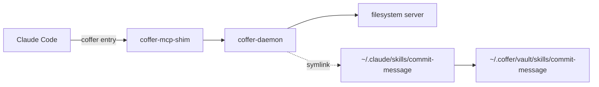

# Quickstart

This tutorial takes about 15 minutes. By the end you will have Claude Code connected to Coffer, an upstream MCP server registered once and visible to Claude Code as `filesystem__*` tools, and a skill delivered into Claude Code's `skills/` directory. Each step is a page of the web UI.

## Before you begin

You need:

- **Coffer installed**, with `coffer` on your `PATH`. See [Install](/start/install).
- **Claude Code installed**, with its config directory at `~/.claude`. Codex works the same way. Use `codex` wherever this page says `claude_code` or `claude-code`.
- **Node.js**, so that `npx` can run the example MCP server.

## Six steps

::::: steps

### Start Coffer and open the UI

```sh
coffer daemon start
```

```text
daemon started (pid=48213)
```

Then open `http://127.0.0.1:8000/` in your browser, or open the Coffer desktop app. The daemon writes its API token into the page it serves, so you are already signed in. If a daemon is already running, the command prints `daemon already running`.

### Register Claude Code

Coffer never registers an agent on its own; you choose it on the **Agents** page. There is one agent per type, and its name is its type, `claude-code`. It is registered at `~/.claude`; if your Claude Code config is somewhere else, change its config directory on the agent's page. Claude Code installed but never run is fine too: registering it creates `~/.claude`.

**In the web UI:** open **Agents**. The page always lists Claude Code and Codex; on the Claude Code row choose **Connect**, review the lines Coffer will write, and apply them. With both agents installed and neither connected, **Connect both** does the two at once.

### Connect Claude Code to Coffer

Open **Agents → claude-code** and click **Connect to Coffer**. The agent's **Coffer** status on the Agents list changes from **Not connected** to **Connected**.

Connecting adds one entry to `mcpServers` in `~/.claude.json` (and Coffer's memory hook — four entries, from session start to each shell command — to `~/.claude/settings.json` — see [Memory](/guides/memory)). Coffer writes the file atomically and keeps a `.bak` of the previous version:

```json
{
  "mcpServers": {
    "coffer": {
      "command": "/Users/you/.coffer/bin/coffer-mcp-shim",
      "args": ["--agent-uid", "fdc37200d76f4ff094a29e41fd06e13c"]
    }
  }
}
```

The `--agent-uid` argument is how Coffer knows which agent a session belongs to. It lets you restrict a server or a skill to particular agents later. The command path is absolute because agents launched from a GUI do not inherit your shell's `PATH`.

::: tip Why not `claude mcp add`?
You can add `coffer-mcp-shim` to any MCP client by hand. However, a hand-written entry has no `--agent-uid`, so Coffer cannot tell which agent the session belongs to, and servers restricted to particular agents stay hidden from it. For Claude Code and Codex, use **Connect to Coffer**. See [Connect a client](/guides/connect-a-client) for other clients.
:::

### Register an upstream MCP server

Register the reference [filesystem server](https://github.com/modelcontextprotocol/servers/tree/main/src/filesystem) and give it access to one directory:

```sh
mkdir -p ~/projects
```

Open **MCP servers**, click **Add server**, and paste the server's JSON in the standard `mcpServers` format (a command line or a URL works too). The path must be absolute:

```json
{
  "mcpServers": {
    "filesystem": {
      "command": "npx",
      "args": ["-y", "@modelcontextprotocol/server-filesystem", "/Users/you/projects"]
    }
  }
}
```

A server that needs an API key takes it as a secret ref (see [Secret store](/guides/secret-store)).

Click **Continue**, review what will be imported, and click **Import 1**. On the server's page, **Test connection** checks that Coffer can start the server and see its tools; from a terminal, `coffer mcp test filesystem` runs the same check. The **Tools** tab lists each tool with an **Enabled** switch. An agent sees each tool as `filesystem__<tool>`. The tab's **Name length** counts the full name a client such as Claude Code sees, `mcp__coffer__filesystem__<tool>`; a name over 64 characters is flagged with `!`, because model provider APIs refuse it. The first test can take a few seconds while `npx` downloads the package.

### Use the tools from Claude Code

Start a **new** Claude Code session. A session that was already open loaded its MCP servers when it started. Run `/mcp`, and `coffer` appears as a connected server. Its tools include:

- the filesystem server's tools: `filesystem__read_text_file`, `filesystem__list_directory`, `filesystem__write_file` and the rest;
- Coffer's own built-in tools: `coffer__search_tools`.

Claude Code adds its own prefix to every MCP tool, so in its tool list the names appear as `mcp__coffer__filesystem__list_directory`. Ask it to use one:

```text
> Use the filesystem tools to list what is in ~/projects.
```

Claude Code calls `filesystem__list_directory`. Coffer routes the call to the filesystem server under its original name, `list_directory`, and records the call. You can see the record on the server's **Invocations** tab, or with `coffer log mcp --server filesystem`. The record holds the tool, the time, the duration and the outcome. It never holds the arguments or the result.

Every agent you connect in step 3 now gets this server. You did not edit Claude Code's MCP config again, and you will not need to for the next server either.

### Import and deliver a skill

A skill is a folder containing a `SKILL.md` in the [AgentSkills](https://agentskills.io) format. Create a small one:

```sh
mkdir -p ~/skills-src/commit-message
cat > ~/skills-src/commit-message/SKILL.md <<'EOF'
---
name: commit-message
description: Write a Conventional Commits message for the staged changes. Use when the user asks for a commit message.
---

# Commit message

1. Run `git diff --staged` and read the change.
2. Pick the type: feat, fix, docs, refactor, test or chore.
3. Write a subject under 72 characters in the imperative mood.
EOF
```

Open **Skills**, click **Add skill**, choose the folder, and click **Import**. The skill's page shows which agents it is delivered to and lets you change its reach.

Coffer copied the folder into its library at `~/.coffer/vault/skills/commit-message/` and linked it into Claude Code:

```sh
ls -l ~/.claude/skills
```

```text
coffer-guide -> /Users/you/.coffer/derived/skills/coffer-guide
commit-message -> /Users/you/.coffer/vault/skills/commit-message
```

Some things to know:

- **Scope `everywhere`** means every registered agent receives the skill, including agents you register later. To limit the skill to certain agents, change its reach on the skill's page. Scope applies to this machine only.
- **`coffer-guide`** is Coffer's own skill, delivered automatically. It explains Coffer's tools to the agent and lists your knowledge collections.
- **Editing.** The delivered copy is a link to the library copy, so an edit through either path changes the same file. The **Skills** page reports any link that has gone missing or been changed.

Start a new Claude Code session and ask for a commit message. Claude Code finds `commit-message` among its skills.

:::::

## What you have now


```mermaid
flowchart LR
  CC["Claude Code"] -->|"coffer entry"| SHIM["coffer-mcp-shim"]
  SHIM --> D["coffer-daemon"]
  D --> FS["filesystem server"]
  D -.->|"symlink"| SK["~/.claude/skills/commit-message"]
  SK --> LIB["~/.coffer/vault/skills/commit-message"]
```

## Next steps

<LinkList variant="cards">

- **Add Codex.** Connect Codex on the **Agents** page. Codex gets the same servers and skills with no further setup. See [Agents](/guides/agents).
- **Curate tools.** Switch off tools you do not want agents to see, or restrict a server to particular agents. See [MCP servers](/guides/mcp-servers).
- **Store a key.** Register a server that needs an API key, using a secret ref. See [Secret store](/guides/secret-store).
- **Share knowledge.** Create a collection on the Knowledge page and add Markdown files to it, or ask an agent to write one into the collection's `.inbox/` folder. See [Knowledge](/guides/knowledge).
- **Switch providers.** Point both agents at the same model gateway in one step. See [Model providers](/guides/providers).
- **Learn the model.** [Core concepts](/start/concepts) explains the terms used throughout these docs.

</LinkList>
