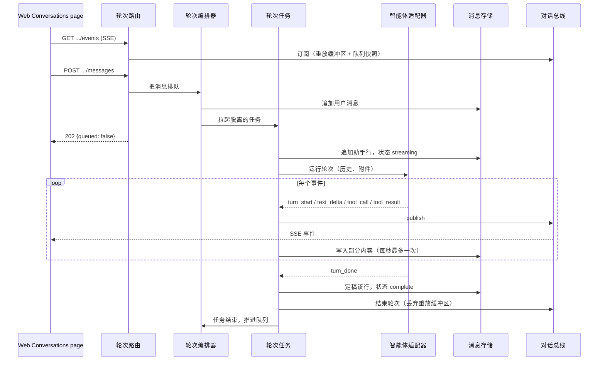
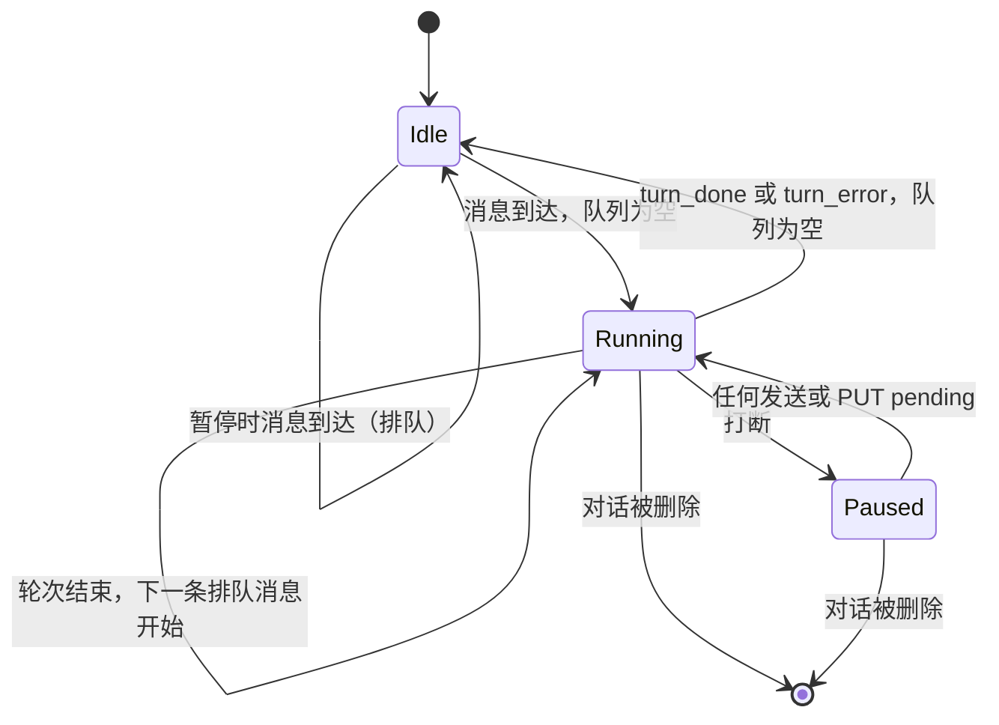
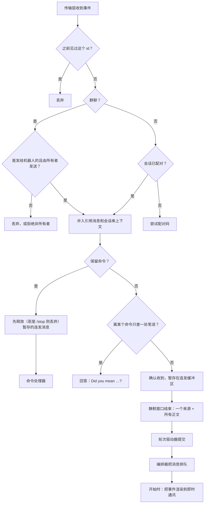

# 对话与轮次 {#chat-and-turns}

本页讲 Coffer 的轮次平台：对话模型、按对话一次只跑一个轮次的编排器、驱动 Claude Code 和 Codex 的适配器、把轮次流式推给每个观看界面的事件总线，以及即时通讯消息渠道怎样作为第二个客户端接入。它写给想理解机制及其背后理由的工程师。日常使用请看[对话指南](/zh/guides/chat)和[消息渠道指南](/zh/guides/channels)。

## 问题 {#the-problem}

保险库的所有者想在不止一个地方和他的编程智能体对话：手机（通过 Telegram 或 SeaTalk）和桌面浏览器。两边需要同样的保证。不管是谁发起的，一个轮次都必须以同样的方式到达智能体。在手机上发起的轮次，必须能在浏览器里看到、打断和继续。任何轮次都不能悄无声息地结束，包括守护进程在回复到一半时挂掉的情况。

还有一个成本约束。Coffer 驱动两个智能体和两个即时通讯平台，而且两边都还会增加。如果每个消息渠道都得认识每个智能体，集成成本就是 N × M。这个设计把它保持在 N + M。

## 设计决策 {#design-decisions}

**一个轮次平台，多个界面。** 对话、待处理队列、轮次生命周期和事件流都属于同一个平台。Web「对话」页面和每个消息渠道都是它的客户端。消息一旦到达编排器，下游就没有任何东西知道它来自哪个界面，智能体也分不出手机轮次和浏览器轮次。

**单一所有者，一条时间线，两块屏幕。** 消息渠道是和所有者配对的：「即时通讯对端」永远是拿着手机的保险库所有者本人。所以在浏览器里看手机上的对话，是同一个人的连续体验，而不是多用户协作。Coffer 没有对端身份模型，没有按用户的可见性规则，也不存在谁能打断谁的问题。Web 页面显示每个对话，包括由消息渠道开启的那些，并用一个徽章标出它还能在哪个消息渠道上访问。

**发起轮次和观看轮次是分开的。** `POST .../messages` 发起或排队一个轮次，并立即返回 `202`。所有输出都通过一个订阅 `GET .../events` 流出。发送方不是特例：「我发起的轮次」和「我手机发起的轮次」走同一条路径，一个重放缓冲区确保发送方不会错过早期事件。

**随便发；只排队，从不拒绝。** 轮次运行期间发送的消息会进入一个按对话的 FIFO 待处理队列。每条排队的消息各自成为一个轮次，消息不会被合并。Web 输入框从不锁定。消息渠道会告诉每条等待的消息它排在第几位（「⏳ Queued (n)」），每个对话最多接受十条待处理消息；第十一条会被丢弃并说明原因（见[入站流水线](#the-inbound-pipeline)）。

**适配器是自足的。** 编排器只给适配器对话历史和本轮的附件，别的什么都不给。适配器自带模型、工具和配置。增加第三个智能体，只需要注册一个提供方和一个适配器。对话 schema、编排器和客户端都不用改。

**完全权限，以所有者配对作为关卡。** 两个智能体都不需要逐个工具审批（Claude Code 是 `bypassPermissions`；Codex 是 `never` 询问加 `danger-full-access`）。信任边界是驱动对话的已配对所有者，而不是一个在手机上没人会去回答的逐工具提示。

## 对话模型 {#conversation-model}

对话不是[资源](/zh/architecture/resource-framework)。它是自己那张 SQLite 对话表里的一行，消息在旁边一张对话消息表里。对话状态不在机器之间同步。

| 字段 | 含义 |
| --- | --- |
| `id` | 不透明的对话 id。 |
| `agent_key` | 对话所属的智能体（`claude_code` 或 `codex`）。存储层没有默认值：每个写入方都明确写出智能体。 |
| `agent_config` | 由提供方拥有的 JSON：`cwd`、`session_id`（要续接的上游会话）、`model` 和 `effort`。 |
| `title` | 一开始是占位文字。除非所有者已经给对话改过名，否则会被第一条用户消息的文字替换。 |
| `archived_at` | 对话活跃时为 `null`。 |
| `channel_uid`、`peer_chat_id` | 可选的消息渠道绑定：把输出转发到即时通讯会话时的回信地址。它存的是消息渠道不可变的 uid，所以改名后依然有效。 |

一条消息存储它的 `role`、一个有序的内容块列表（`text`、`tool_use`、`tool_result`、`attachment`）、一个 `status`（`streaming`、`complete` 或 `failed`），对于助手消息，还有智能体报告时的 `model_id` 和 token 用量。

对话的时间线就是智能体所做之事的记录。轮次刻意**不**写入[审计日志](/zh/architecture/observability)。一个轮次既不是不可逆的，也不涉及安全，事后也不是不可见的，所以每个轮次一条审计记录只会重复时间线。

### 工作目录与会话 {#working-directory-and-session}

每个轮次都在对话的 `cwd` 里运行。如果没有提供，就在 Coffer 管理的工作目录 `~/.coffer/content/workspace` 里运行，首次使用时创建。显式提供的 `cwd` 必须是已存在的目录，否则对话在写入任何东西之前就创建失败。

每个轮次结束后，上游会话 id 会写回 `agent_config.session_id`，让下一个轮次续接同一个 Claude Code 会话或 Codex 线程。因为智能体自己的会话已经保存了对话内容，平台只把最近 **200** 条消息作为历史传过去。这段历史是一个全新会话所需要的。有几千条消息的对话从不会被完整加载。

如果智能体不再认识存储的会话 id，这个轮次会以全新会话重试**一次**。只有第二次失败才会成为轮次错误。没有这次重试，一个过期的 id 会让对话永久不可用，而不只是上下文不连续。

### 轮次使用哪份智能体配置 {#which-agent-configuration-a-turn-runs-against}

轮次使用该类型唯一一个已登记智能体的配置目录运行。这也正是选择器里提供模型的那个智能体。当这个目录不是该类型的标准位置时，拉起的进程会得到 `CLAUDE_CONFIG_DIR=<config_dir>`（Claude Code）或 `CODEX_HOME=<config_dir>`（Codex），与守护进程自己的环境合并。任何 key 都不通过环境传递：使用 API key 的[模型提供商](/zh/guides/providers)连接经由 Coffer 的模型代理访问。对于标准位置，环境保持不变，所以进程的行为和你自己运行命令行时完全一样。这很重要，因为 Coffer 把技能投递到、并把它的 MCP 条目安装到那个目录里。读取别的目录的轮次会看不到它们。

## 轮次编排器 {#the-turn-orchestrator}

轮次编排器是一条消息的唯一入口，Web 的 `POST` 和消息渠道都一样。它知道智能体提供方注册表，但对任何具体智能体一无所知。

每个对话的状态放在一条记录里：事件总线、正在进行的轮次、待处理队列和一个暂停标志。这个状态按设计是进程全局、单守护进程的。它只在有东西需要时存在（有进行中的轮次、排队的消息或已附着的订阅者），否则就被逐出，所以一个服务过一万个对话的守护进程并不会持有一万条总线。

### 发送一条消息 {#enqueue-message}

1. 检查对话是否存在（否则 404）。
2. 如果没有活跃的轮次、队列没有暂停并且队列为空，立即开始这个轮次。
3. 否则把一个待处理条目（文字、附件、标题提示和一个可选的开始 Hook，消息渠道用它来渲染轮次）追加到队列，并广播 `queue_changed`。
4. 发送消息会清除暂停标志，所以打断之后再普通地发一条，就会恢复被挂起的队列。

开始一个轮次会在编排器让出执行权之前同步地占住这个对话的位置，所以两个并发的发送不可能都开始轮次。然后它向注册表要这个对话的提供方，让它构建一个适配器，提交用户消息（一个文字块加上对其附件的引用），并拉起脱离的轮次任务。该任务结束时，编排器弹出队首并开始它的轮次。

排队的轮次如果**启动**失败，既不会丢，也不会循环重试。消息回到队首，队列暂停，并向此刻已附着的订阅者发布一个 `turn_error`。这个错误不属于任何轮次，所以不会保留在重放缓冲里：之后打开或重连的页面看到的是被挂起的队列，而不是一个它无能为力的失败。对于消息渠道的消息，编排器还会交给消息渠道的渲染器一个携带失败信息然后结束的流，因为手机上没有队列标签可看。

### 打断、删除与关闭 {#interrupt-delete-and-shutdown}

轮次提前结束的几种方式，靠进行中轮次上的标记区分，由取消它的一方设置：

| 原因 | 怎样发出信号 | 结果 |
| --- | --- | --- |
| 所有者打断（`POST .../interrupt`，消息渠道里的 `/stop`） | 轮次被标记为已打断；队列暂停 | `turn_done`，`stop_reason: "interrupted"`；部分回复保留为 `complete`。 |
| 对话被删除 | 轮次被标记为已丢弃 | 删除占位行；总线关闭每个订阅者。 |
| 守护进程关闭 | 两个标记都没有 | `turn_error` `daemon_stopped`；部分回复保留为 `failed`。 |

停止所有轮次是守护进程清理中的一步，在数据库关闭之前运行。它先关门（之后不能再开始任何轮次，每个队列都暂停，这样一个被取消轮次的结束不会启动下一个），取消每个运行中的轮次，并最多等五秒让它们完成写入。没能及时收尾的轮次留给启动清扫处理。

## 轮次任务 {#the-turn-task}

轮次任务驱动一个适配器直到完成。它是一个脱离的后台任务，所以它比发起它的 HTTP 请求或消息渠道回调活得更久。这就是为什么发送消息的浏览器标签页关掉之后，回复仍会完成并被保存。

这个任务保证的事情：

- **第一个事件之前先有占位行。** 在适配器产出任何东西之前，就写入一个状态为 `streaming` 的助手行，轮次结束时原地定稿：只有一行，从不重复。守护进程启动时，一次清扫会把所有残留的 `streaming` 行（创建于本守护进程启动之前，所以启动之后才开始的轮次不会被动到）改成 `failed`。没有哪个对话重新打开时会显示一个永远不会到来的回复。
- **节流的部分保存。** 累积的块每秒最多一次被写到 `streaming` 行上。如果某个事件被节流跳过，会安排一次在间隔到期时进行的补写。所以在一次长时间工具运行之前刚流出的文字，大约一秒内就落盘了。被直接杀掉的守护进程会保留到最后一次保存为止流出的内容。
- **闲置看门狗。** 智能体可能卡住但不死：一个挂起的工具，或者一个在等没人会回答的提示的命令行。如果 `COFFER_TURN_IDLE_TIMEOUT_SECONDS`（默认 `300`；`0` 表示关闭）内没有事件到达，就在适配器的事件流内部取消等待。这会走适配器自己的取消路径，打断并终止子进程。然后轮次以 `turn_error` `turn_timeout` 结束。
- **不会悄悄完成。** 如果适配器的流在没有 `turn_done` 或 `turn_error` 的情况下结束，任务会自己发出 `turn_error` `stream_ended`。它不依赖适配器来做这件事，因为在一条话说到一半被切断的回复上打个勾，就是在说谎。
- **恰好一个终结事件。** 在终结事件之后才到达的取消（比如在最终写入期间），会在屏蔽后续取消的保护下重新执行定稿，并且不再发出任何东西。

有三个轮次错误码属于平台而不是某个智能体：`stream_ended`、`turn_timeout` 和 `daemon_stopped`。

### 轮次与消息的状态 {#turn-and-message-states}

轮次写入的助手行有自己的生命周期：`streaming` → `complete`（正常结束或所有者打断），或 `streaming` → `failed`（适配器错误、`stream_ended`、`turn_timeout`、`daemon_stopped`，或崩溃后的启动清扫）。

## 事件与实时镜像 {#events-and-the-live-mirror}

一个轮次是一串有类型的事件。每个事件的 `type` 同时也是它在线上的 SSE 事件名，所以客户端按同一套词汇分发，不需要翻译表：

| 事件 | 载荷 | 由谁发出 |
| --- | --- | --- |
| `turn_start` | 无 | 适配器 |
| `text_delta` | `text` | 适配器 |
| `tool_call` | `tool_use_id`、`tool_name`、`tool_input` | 适配器 |
| `tool_result` | `tool_use_id`、`tool_name`、`output`、`error` | 适配器 |
| `turn_done` | `prompt_tokens`、`completion_tokens`、`stop_reason` | 适配器，或打断时由轮次任务发出 |
| `turn_error` | `code`、`message` | 适配器或轮次任务 |
| `queue_changed` | `pending`（有序的文字） | 只由编排器发出 |

对话总线把每个事件扇出到每个订阅者的队列，并为晚到的订阅者保留两样东西：

- 当前轮次事件的**重放缓冲区**。轮次开始时清空，轮次结束时丢弃，因为从那以后内容已经持久化，晚到的订阅者从历史里加载它。如果再重放一遍，轮次就会被渲染两次。
- **最新的**一个 `queue_changed` 快照，而不是它的历史，因为队列是对话级的状态，不是轮次内容。

客户端订阅时，缓冲区和快照会在它的队列加入订阅者集合之前被同步地放进去。因为并发的发布只能在之后的某个事件循环 tick 上运行，所以不可能有实时事件抢在重放之前到达。

SSE 路由跨轮次保持打开。没有轮次运行时，它保持连接，把下一个轮次（无论从哪个界面发起）推送过来。它在对话被删除（总线发送一个流结束标记）或客户端断开时结束。Web 客户端在流中断时都会重新订阅：无论连接是正常关闭还是读取或请求抛出了错误，也无论轮次是否进行到一半，采用线性退避，重试次数有上限。之后它把错误显示出来，而不是反复冲击这个端点。

### 路由 {#routes}

| 路由 | 用途 |
| --- | --- |
| `POST /api/v1/chat/conversations/{id}/messages` | 发起或排队一个轮次。返回 `202 {queued}`；不携带输出。 |
| `GET /api/v1/chat/conversations/{id}/events` | SSE 订阅：先重放进行中的轮次，然后实时跟随。 |
| `PUT /api/v1/chat/conversations/{id}/pending` | 替换待处理队列（重排、删除、恢复）。会解除暂停。 |
| `POST /api/v1/chat/conversations/{id}/interrupt` | 停止运行中的轮次并暂停队列。返回 `204`。 |
| `GET\|PATCH /api/v1/chat/conversations/{id}/agent-config` | 读取或设置模型和推理强度；保留 `cwd` 和会话 id。 |
| `GET /api/v1/agent-providers` | 已登记的智能体，带显示名和可用性。 |
| `GET /api/v1/agent-providers/{agent_key}/models` | 为某个智能体提供的模型；未知的 key 返回 404。 |

用 `PUT .../pending` 替换队列时，会把新文字和已有条目做调和：每段文字复用第一个未被使用、文字相同的条目。因此在浏览器里重排过的队列，会保留每条消息渠道消息的附件和它的消息渠道渲染器。只有之前没排过队的文字才会成为一个新的、空白的条目。

::: info 没有命令行
Coffer 没有 `coffer chat` 命令组。对话可以通过 REST、Web 页面和消息渠道访问。[chat 规格](https://github.com/wyx-sg/Coffer/blob/main/openspec/specs/chat/spec.md)把这一点记录为 REST 与命令行对等规则中的一个已知缺口。
:::

## 智能体适配器 {#agent-adapters}

平台的接缝是两份契约：

- **智能体提供方**，每种智能体类型一个。它校验并存储新对话的 `agent_config`，为一个轮次构建配置好的适配器，在对话被删除时拆除智能体状态，并报告可用性：智能体的二进制能否在用户的 `PATH`（登录 shell 的 `PATH` 与守护进程继承的 `PATH` 合并）上找到，**并且**该类型有一个已启用的智能体登记在 Coffer 中。「对话」只与受管智能体交谈，所以不可用的智能体会被列出但不能被选中，对没有已启用智能体的类型发起轮次会被拒绝（`AGENT_CONFIG_REJECTED`，原因 `agent_not_managed`），而不是拿命令行默认的配置目录去运行。
- **智能体适配器**，每个轮次一个。给定历史和附件，它产出一个异步的事件流。适配器必须以一个终结事件结束，并且在取消时必须清理并重新抛出。它可以暴露一个 `model_id`，在轮次流式进行时获知（Claude CLI 在助手消息里给出，Codex app-server 在线程结果里给出）。轮次任务在定稿回复时读取它，并记录在助手消息上。

一个注册表持有这些提供方。它们在组合根里注册。没有任何界面直接指名某个提供方。

### Claude Code：Claude Agent SDK {#claude-code-the-claude-agent-sdk}

Claude Code 适配器通过 `claude-agent-sdk` 里的客户端驱动 Claude Code，它是 Coffer 中唯一导入这个 SDK 的部分。每个轮次都续接存储的会话 id，以 `bypassPermissions` 权限模式运行，设置了推理强度时把它传过去，并要求部分消息。Coffer 的系统上下文是追加到 Claude Code 自己的预设提示词之后，而不是替换它。

部分消息正是让回复边写边长的东西。开启后，SDK 既会发送增量，也会发送完整的助手消息。到平台事件的映射会减去已经发出的部分，让回复恰好一次地到达消费方。取消时，适配器打断并断开 SDK 客户端，并且仍然保存会话 id（SDK 很早就会报告它），所以被打断的轮次仍可续接。

### Codex：`codex app-server` {#codex-codex-app-server}

Codex 适配器通过 `codex app-server` 驱动 Codex：stdio 上的 JSON-RPC 2.0，每行一个 JSON 对象（NDJSON，不是 LSP 的 `Content-Length` 分帧）。一个只用标准库的读循环分拣响应、服务端到客户端的请求和通知。

每个轮次都拉起一个 app-server 进程，在 `PATH` 上查找 `codex`。进程登记为守护进程的子进程，所以守护进程启动时的孤儿清扫可以在崩溃后清理它。适配器在握手**之前**就启动通知泵，这样不会错过任何响应握手而发出的通知。然后它运行：

1. `initialize`，然后是 `initialized` 通知。
2. 用存储的线程 id 执行 `thread/resume`，或者 `thread/start`。Coffer 的系统上下文放在 `developerInstructions` 里，它是追加到 Codex 的基础指令上，不会替换它们。被拒绝的续接会回退一次到 `thread/start`。
3. `turn/start`，带上提示词，设置了时再带上 `effort`。在 Codex 的协议里，推理强度属于轮次，而不属于模型名。

通知被映射为平台事件。取消时，适配器发送 `turn/interrupt`，保存线程 id 并关闭进程。

::: details 为什么每个轮次一个子进程，而不是池化的智能体
两个适配器都为每个轮次开一个新会话，并续接智能体自己存储的会话。智能体的状态在智能体自己的文件里，而不在一个 Coffer 需要监管、做健康检查、并在守护进程重启后恢复的常驻进程里。代价是每个轮次都要启动进程。好处是崩溃或卡住的智能体只影响一个轮次，守护进程重启时除了进行中的轮次什么都不会丢。
:::

### 适配器被告知的内容 {#what-the-adapter-is-told}

智能体在自己的系统提示词之上收到的附加内容，都在一个地方组合，两个提供方共用，顺序始终如下：

1. 对于由消息渠道驱动的对话，一段说明智能体正在一个聊天渠道上的提示。它写明平台、会话类型和消息渠道，说明那里能渲染哪些 Markdown，并要求回复适合手机阅读（结果先行，不逐步讲述，长内容放在 `## Details` 下，图表用 PNG 文件，需要所有者回答时调用 `coffer__ask`）。对话层并不为此导入消息渠道类型：消息渠道类型发布一个读取器，它返回这段提示，由对话的会话串记录和运行中传输层声明的渲染说明构建。
2. 对于由消息渠道驱动的对话，[记忆](/zh/architecture/memory)索引。组合根构建记忆组合器，并把它交给两个提供方，旁边还有一个按提示词的检索器，把消息渠道轮次消息中点名的笔记加进它的提示词。索引为空或记忆树读不了时，它什么都不返回。见[消息渠道轮次](/zh/architecture/memory#channel-turns)。
3. 在每个轮次上，一段模型说明：写明 Coffer 让智能体用的是哪个模型，或者说明正在用智能体自己的默认模型，并附几个备选。智能体看不到 Coffer 的选择，被问到时会自己编一个，所以这段说明写明它优先于智能体自己的猜测。

来自 Web「对话」页面的轮次，和你自己在终端里开启的会话一样，在智能体连接到 Coffer 时通过智能体自己的记忆 Hook 获得记忆。没有哪个轮次会两种方式都拿到。

## 附件与文档提取 {#attachments-and-document-extraction}

附件有两种方式进入对话。消息渠道把每个文件下载到 `~/.coffer/content/channel-media` 下，交给编排器一个附件（路径、mime 类型、文件名）。Web 输入框先把每个文件上传到 `POST /api/v1/chat/attachments`，然后在 `POST …/messages` 的 `attachment_ids` 里带上拿回的 id；路由把它们解析成同样的附件值，并以同样的附件参数调用和消息渠道相同的编排器入口。从这里开始两者就是同一条代码路径。无论哪种方式，对话数据库在用户消息里只保存引用（一个附件块：`path`、`mime`、`filename`），从不保存字节。

### Web 上传 {#web-uploads}

一个对话附件服务负责上传的限制和发送时的解析；一个基于文件的媒体存储保存这些文件。

- **限制。** 每次调用一个文件，最大 20 MB（`ATTACHMENT_TOO_LARGE`，413，并写明限制）。HTTP 框架在解析 multipart 请求体时会把它缓存到临时文件，所以上传路由先行一步：它检查令牌，在读取请求体之前，就以同样的 413 拒绝声明的 `Content-Length` 超过限制加 64 KiB multipart 余量的请求，并以只接受一个文件和少量字段的方式解析表单。没有声明长度的请求体会被解析，然后按同一个文件字节上限拒绝。类型由一条规则决定：声明为图片、音频或文档类型的保留，然后查一张固定的扩展名表，字节是不含 NUL 的 UTF-8 的一律算文本。其他都是 `ATTACHMENT_TYPE_UNSUPPORTED`（415）。图片的类型随后会被它的魔数字节所证明的类型替换（PNG、JPEG、GIF、WEBP）；字节不属于其中任何一种的会存为 `application/octet-stream`，从不当作图片。这张表是固定的，而不用 Python 标准库的 mime 查找，因为后者会读取宿主机的 mime 文件。
- **存储。** 每次上传是 `~/.coffer/content/chat-media` 下的两个平铺文件：字节存为 `<id><ext>`，让按路径读取的智能体仍能看到扩展名；以及 `<id>.json`，保存显示名、类型、大小和存储文件名，在字节之后写入。id 是 32 个随机的十六进制字符；存储层不会把任何不是这种形状 id 的东西拼进路径。
- **发送。** 一条消息带文字、最多十个 `attachment_ids`，或两者都有。指向不存在文件的 id 是 `ATTACHMENT_NOT_FOUND`（422），不会持久化或排队任何东西。只有文件没有文字的消息，会保存消息渠道里无说明照片所得到的那段替代文字，因为智能体请求不能包含空的文字块；由它开启的对话以文件名命名。
- **重发。** 页面上的「重试」调用 `POST …/messages/{message_id}/resend`：对话服务找到用户行（否则 `MESSAGE_NOT_FOUND`，404），附件服务从该行的块重建文字和附件值，路由像发送一样把它们排队，所以不管文件来自页面还是消息渠道，重试都会带上原消息的文件。被媒体清扫删掉的引用文件是 `ATTACHMENT_EXPIRED`（410），不会持久化或排队任何东西。在失败提示的行落库之前，页面改为重发它的乐观回显，那里保留着文件的上传 id。
- **保留。** `~/.coffer/content/chat-media` 按和 `channel-media` 相同的 30 天 mtime 规则清理。规则是一条与类型无关的保留规则，保留服务对每个目录跑一次清扫，每次清扫各自用自己的键报告（`channel_media`、`chat_media`）。

页面保存输入框中每个文件的状态（上传中、就绪、失败），通过共享的 API 客户端上传，并在任何文件正在上传或失败时按住**发送**。已发送消息的乐观回显带着文件的名字和类型，所以在该行落库之前它的标签就显示出来了，只有附件的回显按这些名字与它的行匹配。没有图片预览：那需要一个把字节再送回来的路由，而路径始终留在守护进程内部。这个决策记录在 [Chat Attachment Uploads](https://github.com/wyx-sg/Coffer/blob/main/docs/decisions/chat-attachment-uploads.md) 中。

### 物化 {#materialisation}

轮次任务不以参数形式接收附件。它从持久化历史里的最后一条用户消息把附件读回来。这个引用是唯一的真相来源，所以它能挺过守护进程重启，并且和页面显示的一致。路径从不出现在线上：只有读取字节的适配器才看得到它。

然后每个适配器按自己的形式物化附件，顺序如下：

1. **音频**在指定了语音转文字连接时被转写并并入提示词（见[内部引擎](https://github.com/wyx-sg/Coffer/blob/main/openspec/specs/internal-engine/spec.md)）。默认关闭。这是用户内容唯一可能为了转写而离开本机的地方。没有连接或出现任何失败时，音频作为普通文件交出去。
2. **文档**（PDF、Word、PowerPoint、Excel 等）由一个文档提取器转成文本，它延迟导入可选的 `markitdown` 库。如果库缺失或提取失败，文档降级为文件附件。
3. **其他一切：** 只有在通过内联检查时，Claude Code 才以内联方式收到图片，作为一个 base64 图片块：它的字节嗅探为 PNG、JPEG、GIF 或 WEBP，并且 base64 编码后不超过 5 MB（即 Messages API 的单图上限）。块的媒体类型是嗅探出的类型，而不是存储的类型，所以一张标错类型的消息渠道照片不会因为「image does not match media type」被拒绝。其他任何文件，包括没通过任一检查的图片，都变成一段写明保存路径的文字说明。规则在发送时应用，所以消息渠道媒体和 Web 上传共用它。Codex 在 app-server 协议上原生按路径工作，总是收到路径说明，所以它没有内联上限要遵守。

## 消息渠道作为第二个界面 {#channels-as-a-second-surface}

消息渠道是 `channel` 类型的[资源](/zh/architecture/resource-framework)：一个绑定到保险库的 Telegram 机器人或 SeaTalk 应用，带密钥引用、一个默认智能体、一个反向的智能体范围（这个消息渠道可以驱动的智能体），以及 `runs_on`，即由哪台机器的守护进程运行它的适配器。消息渠道层通过恰好两个接缝接触轮次平台：对话用对话服务，轮次用编排器的排队入口，在进程内调用，就像 Web 页面通过 HTTP 调用一样。

### 共享核心之上的薄适配器 {#thin-adapters-over-a-shared-core}

一个传输层只需实现消息渠道适配器契约：启动和停止；出站方面，发送文字、打开一个实时文字界面、编辑文字和更新卡片；入站方面，把平台事件规范化为四种信封（消息、按钮回调、生命周期事件和停止）；以及一份能力记录。配对、所有者关卡、命令、排队、对话映射和渲染策略都在共享核心里。核心根据能力选择行为，从不根据适配器的类型：

| 能力 | 核心问的问题 |
| --- | --- |
| 实时文字 | 有没有一个我能在轮次运行时持续更新的界面？ |
| 编辑 | 传输层能否改写一条已经投递的消息？ |
| 按钮 | 能否渲染可交互的选择卡片？ |
| 卡片更新 | 能否改写一张已经投递的卡片？ |
| 正在输入 | 能否显示正在输入指示？ |
| 消息长度 | 一条出站消息最长可以多长？ |

两个传输层对实时文字都回答「是」，但方式不同。Telegram 编辑同一条消息。SeaTalk 不能编辑文字消息，所以用它的流式 API（`init_stream`/`update_stream`）。一个共享的实时文字界面持有两者共享的规则：调用平台的频率绝不超过传输层的缓冲间隔，记住上一个快照，并在一个界面第一次失败后就不再使用它。

### 传输层 {#transports}

- **Telegram** 直接通过 HTTP 长轮询 Bot API，不用机器人 SDK。更新偏移量只在一次分发尝试之后才提交，所以崩溃会让一个更新被重新投递而不是丢失；分发抛出异常时偏移量仍会前进，跳过有毒的更新。
- **SeaTalk** 每个消息渠道通过一条出站 websocket 连接接收，由守护进程内的一个线程持有。websocket SDK 由操作者提供。它是同步的，所以它的监听循环跑在 Coffer 拥有的一个线程上，事件以线程安全的方式交回守护进程的事件循环。Coffer 自己监管重连：从 1 s 开始指数退避，上限 30 s；被同一应用的另一条连接踢下线后固定等待 60 s。没有任何东西暴露到网络上。出站调用用普通 HTTPS。

两个传输层都用一个有界的、最近见过的 id 内存集合（2048 条）丢弃重复投递的事件。

### 监管 {#supervision}

消息渠道运行时是一个每两秒 tick 一次的调和器。每次 tick 时，它依次询问三个关卡来计算期望集合：消息渠道是 `enabled` 的，`runs_on` 写的是本机，并且它的范围至少留下一个可驱动的智能体。然后它启动、停止或重启适配器使之一致。REST、命令行和界面自己从不启动或停止适配器，这让报告的状态保持真实；唯一的显式请求 `POST /channels/{uid}/restart` 是请运行时立刻停止并重建某个消息渠道的适配器，并与 tick 串行执行。适配器只在构建时读一次密钥，所以 tick 还会比较消息渠道引用的每个密钥的指纹，同一引用下的密钥被更换时就重建适配器。运行时状态按消息渠道 uid 作为键，所以给消息渠道改名不会动任何正在运行的东西。期望集合的计算也是消息渠道的智能体 uid 转换成轮次平台智能体 key 的唯一地方。

### 入站流水线 {#the-inbound-pipeline}

入站处理器对每个传输层的每条入站消息都用同样的方式处理：

- **所有者关卡与配对。** 私聊必须和已配对的对端匹配。未配对的会话只能出示配对码：8 个字符、一次性、一小时有效、限制猜错次数，只保存在内存里。陌生人会被静默忽略：不回复、不开轮次，所以机器人从不暴露自己还活着。在群里，消息必须是发给机器人的，并且来自所有者的发送者 id。无法证明身份的发送者会被拒绝，从不被假定为所有者。
- **对话映射。** 对话身份是 `(channel, chat, thread)`，存在消息渠道的会话串到对话映射表里。私聊和每个群会话串都是独立的对话，所以不同会话串里的并发轮次从不互相争抢。每个入站条目会解析出一个与回复会话串 id 不同的对话会话串 id：私聊里的会话串映射到私聊的 `""` 对话，除非它是由 `/thread` 开启的（它的行带有一个并行会话串编号），或者传输层声明私聊会话串是有意为之、而不是随手的回复（如 Telegram）。映射用对话会话串 id；发送用回复会话串 id，所以随手在会话串里回复一句，仍保留私聊的上下文，同时仍在该会话串里得到回答。首次使用时，消息渠道通过对话服务开启一个普通对话，带上该会话串的粘性设置（见[命令与粘性设置](#commands-and-sticky-settings)）；已离开消息渠道范围的粘性智能体会让位给消息渠道的默认智能体。如果对话已被删除，下一条消息会创建一个新对话。
- **命令**——九个保留词（见[命令与粘性设置](#commands-and-sticky-settings)）——由命令处理器处理，从不成为轮次。控制命令绕过队列。其他所有文字，包括以 `/` 开头的，都是消息。
- **连发。** 连发缓冲区把每个 `(channel, chat, thread)` 的消息暂存起来，直到经过一个静默窗口（文字之后 1.5 s，转发记录或纯文件之后 5 s），然后作为一条排队的入站消息释放：最后一条消息的来源、按顺序的每段正文、每个附件。轮次驱动器在消息到达时发送回执（一个 👀 表情回应，否则是正在输入）。命令会先等待它所在键的释放，`/stop` 会丢弃暂存的内容。同一个键的释放是串起来的，所以它们按顺序到达队列。在那之前的顺序由传输层负责：SeaTalk 把每个会话的 websocket 摄取串起来，Telegram 的轮询器本来就一次等一个更新。
- **轮次。** 消息文字前面会加上它的来源（平台、会话类型和标题、会话串、发送者），这样即使 `/new <agent>` 在同一会话串的不同对话之间换了智能体，智能体也知道自己在哪里回答。当对话已经有 10 条消息待处理时，轮次驱动器丢弃新消息并说明原因（已有十条在等），所以刷屏不会无限堆积。否则它带着一个开始 Hook 把消息排队，被排队而没有立即开始的消息会收到「⏳ Queued (n)」的回复。

### 命令与粘性设置 {#commands-and-sticky-settings}

手机能发送的命令是一个封闭的小词汇表：`/new [agent]`、`/stop`、`/model [name] [level]`、`/dir [path|name]`、`/status`、`/resume [n]`、`/thread [title]`、`/kb [collection]` 和 `/help`。保持封闭很重要，因为每个保留词都是智能体再也收不到的词；之外的一切——智能体自己的 `/compact`、某个技能的 `/review`、以路径开头的消息——都作为普通文字传过去。

- **一份名册。** 命令放在一份名册里，每个条目带有它的英文和中文描述、是否出现在群菜单里、在群里的回答是否私密，以及是否需要知识功能。帮助文字、每个已注册的平台菜单、笔误防护和群隐私规则都从它渲染，所以添加一个命令只需一个条目加它的处理函数，没有哪个列表会落后。笔误防护会对与某个命令相差一两处编辑的词回答「Did you mean …?」，而不是执行它或交给智能体，因为一个打错的 `/stop` 以消息形式到达智能体，会是最糟糕的结果。
- **一套语法。** 不带参数的命令显示当前生效的值（传输层有按钮时显示为卡片），带参数就设置它，`default` 重置它。参数都是人能读懂的名字——智能体的显示名、模型的显示名、目录的基本名——从不是内部 key，也没有任何回答会打印 id。
- **设置属于会话串，而不是对话。** 把 `(channel, chat, thread)` 映射到其活跃对话的那一行按会话串记录，也保存着该会话串选择的智能体、模型、推理强度和工作目录。一个新对话——`/new`、`/dir`、被删除的对话被替换——会带着这些设置打开，所以清空上下文永远不会丢掉所有者的选择。在群里，群自己的那一行（thread id 为 `""`）保存群的默认值，群会话串没有设置的项就继承它，再回退到消息渠道的默认智能体和配置。
- **结构性与参数性。** 智能体会话绑定到它的智能体和目录，所以 `/new <agent>` 和 `/dir` 会开启新对话；模型和推理强度每个轮次都重新读取，所以 `/model` 作用于同一对话的下一个轮次。为某个智能体选的模型在换智能体时会被清除，因为它指的东西另一个智能体根本不跑。
- **`/dir` 的白名单。** 消息渠道的配置列出 `/dir` 能到达的目录（每个都允许其下的子目录），旁边是新对话开始时所在的默认目录（默认智能体配置的 `cwd`）；一个都没列时，`/dir` 关闭。智能体以完全权限运行，所以手机能把它指向哪些文件夹，是事先在电脑上决定的，从不在聊天里放宽。
- **按会话串的历史。** 会话串开启的每个对话都记录在该会话串名下。`/resume` 只读这份历史，所以一个会话可以回到它自己之前的对话，但永远到达不了来自 Web 或另一个会话的对话，即使伪造了按钮值也不行。
- **SeaTalk 上的群主聊天。** 在 SeaTalk 群的主聊天里 @ 机器人会开启一个新会话串，所以在那里发送的设置会配置一个没人会继续的会话串。传输层会把这类消息标记为群主聊天，在那里发出的命令改为写入群的默认值；在那里发 `/stop` 会打断群里的每个轮次。
- **卡片承载操作。** `/status` 和 `/help` 是带 Stop、New、Model、Resume 和 Dir 按钮的卡片。按钮带着命令的名字，点一下执行的和手动输入完全一样，并经过和消息相同的所有者关卡。

### 镜像 Web 端的回复 {#mirroring-a-web-reply}

由消息渠道开启的对话是一个对话、两块屏幕，所以在「对话」页面上输入的回复也必须送到手机上。对话层不能导入消息渠道类型，所以依赖方向是反过来的：**对话层声明一个镜像端口**——「这个对话是否被镜像、镜像到哪里、投递这条回复」——**由消息渠道类型实现它**，在组合根把两者接起来。

- **回复可以去哪里。** 通过按会话串的历史定位对话：它的消息渠道、会话、会话串和会话类型。私聊、私聊里的会话串以及群会话串都可以投递。群主聊天不可以：那是整个群的公共空间，在桌前输入的一条回复、再跟上一个群里没人问过的回答，不属于那里。这样的回复留在 Coffer 里。对话视图会写明目标（平台和会话串标记），让页面在发送之前就能说出回复会去哪里。
- **发送什么。** 回复被发到那个会话或会话串，并标上 `(from Coffer)`，轮次以和消息渠道驱动的轮次相同的渲染 Hook 排队，所以智能体的回答会和原本一样到达该会话。
- **用发件箱，从不丢弃。** 当消息渠道没有在本机运行，或平台拒绝发送时，回复会以待发状态写入发件箱，回答的最终文字也收集在它后面。失败时什么都不会丢。消息渠道调和器的 tick 会按顺序冲刷一个运行中消息渠道的待发条目，失败后退避，并把它们标记为已投递；在那之前，对话会把它们列为未投递。只有发送路由会做镜像，所以页面上的「重试」永远不会把一条回复发两次。

### 渲染 {#rendering}

当消息渠道的消息到达队首时，编排器调用它的开始 Hook，并为那个轮次提供一个专用的事件队列。消息渠道的轮次渲染器消费它，工作沿四个接缝拆分：

- **状态模型**（纯函数）。它统计这个轮次——已用时间、步骤和失败、最新的讲述——并绘制状态块：`⏳ Working · 2m 14s · 7 steps`，一行 `💬` 讲述，以及最新的三行步骤。在私聊里，每行步骤根据调用的输入描述这次调用（`✅ Read · wedding.json`）；在群组里只写工具名，因为输入里可能带着命令或查询。回复文字被保存为被工具调用分隔开的若干段：打开的那段是回答的尾部，已关闭的是讲述，最终回复用段落分隔把它们连起来。
- **实时界面。** 有实时文字时，一个界面在整个轮次期间持续增长。每个快照是状态块、一条 `─` 分隔线，然后是回答尾部；分隔线是与传输层的唯一约定，传输层裁剪的是回答而从不是状态块，并且可以把两者分开渲染（Telegram 的富草稿把头部放在 `<tg-thinking>` 里）。渲染器每 10 秒重绘一次，这是这些界面自己的保活节奏，所以在一个沉默的工具运行期间时钟也在走。作为回复保留下来的界面会立即打开，并在每个快照上带着提问者的 @；临时性的脚手架则不带。
- **收尾。** `MEDIA:` 哨兵会被上传；会话显示不了的内容会根据能力改写：在会话不渲染表格的地方，表格改成列表加一个 CSV，超过传输层内联上限的代码改成文件；在传输层有卡片但自己不会折叠详情的地方，`## Details` 一节会被放到一张摘要卡片后面。如果轮次长于消息渠道的 `notify_after_seconds`，并且它的回答是在一个保留下来的界面上完成的，就会发一次提醒，因为完成一条几分钟前创建的消息不会通知任何人。
- **传输层。** 适配器把 Markdown 转换成平台的格式，按消息长度上限分块且不切断代码围栏，为续篇编号 `(2/3)`，被拒绝的格式化消息改以纯文本重试，遇到限流就退避。其余部分它们声明为能力：表情回应集合（received、working、done、failed、stopped）、@ 模板（可以带 `{name}`），以及给智能体的渲染说明。

干净的成功不发送结尾摘要，因为回复本身就是完成信号。失败、被打断或触及上限的轮次会发一条，而长轮次的提醒会在相应位置带上同样的信息。

Web 页面同时在总线上观看同一个轮次。这就是消息渠道对话的实时镜像的工作方式：消息渠道只保留它的渲染器 Hook，从不自己维护缓冲区；在浏览器里排在手机发起的轮次之后的消息，会在那个轮次结束时运行。

## 并发规则 {#concurrency-rules}

- **每个对话一个轮次。** 位置在轮次开始时同步占住。其余消息都排队；消息不会因为有轮次在运行而被拒绝。
- **多个对话并行。** 不同对话上的轮次，包括同一个群的不同会话串，作为独立任务并发运行。
- **单一守护进程。** 轮次状态、队列和总线都在进程内。没有跨进程扇出，待处理队列在重启时会丢失。这与进行中的轮次在重启时被标记为失败是一致的：未提交的消息从来就不是一行记录。
- **检查所有权的释放。** 正在结束的轮次只清除它自己的进行中记录，所以一个和它竞争的启动永远不会被逐出。
- **保留策略。** 框架的[保留策略任务](/zh/architecture/observability#retention)会归档闲置 7 天的对话（`conversations_archive`），并在归档 30 天后删除已归档的对话及其消息（`conversations`），除非该对话在这段时间内又有新消息写入（从手机恢复的已归档对话不会在使用途中被删除）。两个时间窗口都和其他保留的表一样可以调整。

## 取舍与备选方案 {#trade-offs-and-alternatives}

**一个订阅，还是流式的 POST。** 一个流式输出自己轮次的 POST，加上一个给其他人的订阅，会是两条事件路径，而且两者之间有竞争。单一订阅让发送方成为一个普通订阅者，代价是每个活跃对话一个重放缓冲区。

**顺序 FIFO，还是合并。** 把所有待处理消息合并成下一个轮次，能给智能体更完整的上下文，也用更少的轮次。Coffer 逐条处理，因为结果可预测，每个排队的行都恰好对应一个轮次。

**内存中的队列。** 持久化队列可以挺过重启，但重启很少见，而且丢弃未提交的消息与进行中轮次的处理方式一致。启动清扫让这种丢失是可见的，而不是悄无声息的。

**守护进程内的消息渠道适配器，还是单独的网关进程。** 消息渠道网关进程能更好地隔离传输层，但对一个单用户守护进程来说，会让进程管理的面（检测或拉起、PID 文件、日志）翻倍。适配器作为受监管的任务运行，SeaTalk 的 websocket 作为线程运行，都在守护进程内部。

**把消息渠道当作 MCP 服务器。** MCP 是出站的，从智能体到工具；消息渠道是入站的，从用户到智能体。把消息渠道建模成 MCP 服务器会颠倒数据流，所以 Coffer 不这么做。

**没有审批席位。** 两个智能体都以完全权限运行。发到手机上的审批提示，会让每个轮次卡在一个常常不在看手机的人身上。所有者配对就是关卡。

## 在代码中的位置 {#where-it-lives-in-the-code}

| 包 | 职责 |
| --- | --- |
| `backend/coffer/domain/chat/` | 对话、消息及其各种块、智能体配置、附件、事件类型、错误 |
| `backend/coffer/application/chat/` | 编排器、轮次任务及其看门狗、按对话的状态、部分保存、总线、适配器契约与注册表、附件处理 |
| `backend/coffer/infrastructure/chat/` | Claude SDK 和 Codex app-server 适配器、系统上下文组合、持久化、文档提取、转写、媒体存储 |
| `backend/coffer/surfaces/http/` | 对话、轮次（SSE）、附件和智能体提供方路由，以及把仓储、注册表、编排器、启动清扫和闲置超时接起来的组合 |
| `backend/coffer/application/channel/` | 入站流水线、配对、命令、轮次驱动器、渲染器、运行时调和器 |
| `backend/coffer/infrastructure/channel/` | Telegram 和 SeaTalk 传输层、实时文字界面、Markdown 渲染、媒体 |
| `frontend/` | 「对话」页面、它的事件订阅与有界重连 |

## 相关页面 {#related}

- 规格：[chat](https://github.com/wyx-sg/Coffer/blob/main/openspec/specs/chat/spec.md)、[channels](https://github.com/wyx-sg/Coffer/blob/main/openspec/specs/channels/spec.md)、[channels/telegram](https://github.com/wyx-sg/Coffer/blob/main/openspec/specs/channels/telegram/spec.md)、[channels/seatalk](https://github.com/wyx-sg/Coffer/blob/main/openspec/specs/channels/seatalk/spec.md)
- 决策记录：[Chat Is a Single-Owner Live Mirror](https://github.com/wyx-sg/Coffer/blob/main/docs/decisions/chat-single-owner-live-mirror.md)、[Channel Adapter Framework](https://github.com/wyx-sg/Coffer/blob/main/docs/decisions/channel-adapter-framework.md)、[Channel Attachments: Bytes on Disk, a Reference in the Message, Materialised per Agent at Send](https://github.com/wyx-sg/Coffer/blob/main/docs/decisions/channel-attachments.md)、[The Chat Page Uploads a File First and Sends Its Id, Into a Sibling Media Directory](https://github.com/wyx-sg/Coffer/blob/main/docs/decisions/chat-attachment-uploads.md)、[SeaTalk Inbound Over WebSocket](https://github.com/wyx-sg/Coffer/blob/main/docs/decisions/seatalk-websocket-inbound.md)、[Coffer's Own Model Is an Internal Engine, Not a Persona or a Tool](https://github.com/wyx-sg/Coffer/blob/main/docs/decisions/coffer-model-is-an-internal-engine.md)、[Managed Agents Run With Full Permissions; Owner Pairing Is the Gate](https://github.com/wyx-sg/Coffer/blob/main/docs/decisions/managed-agents-run-with-full-permissions.md)
- 页面：[守护进程与进程](/zh/architecture/daemon)、[持久化](/zh/architecture/persistence)、[记忆](/zh/architecture/memory)、[安全模型](/zh/architecture/security)、[对话指南](/zh/guides/chat)、[消息渠道指南](/zh/guides/channels)
