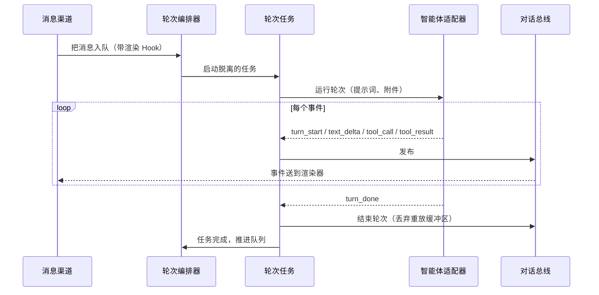
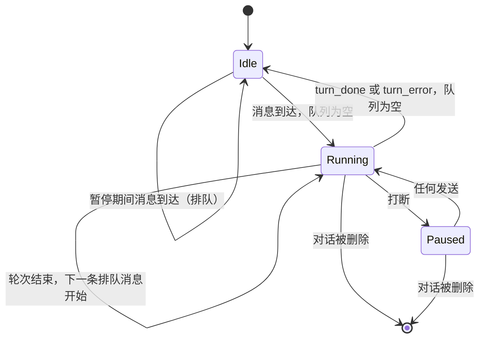
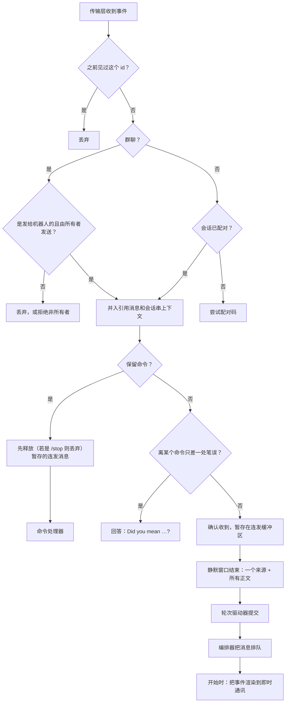

# 对话与轮次 {#chat-and-turns}

本页讲 Coffer 的轮次平台：对话索引、按对话一次只跑一个轮次的编排器、驱动 Claude Code 和 Codex 的适配器、把轮次流式推给发起它的消息渠道的内存事件总线、即时通讯消息渠道如何接入，以及「对话」和「会话」列表如何把一个会话交给你的终端。它写给想了解机制及其背后原因的工程师。日常使用见[对话指南](/zh/guides/chat)和[消息渠道指南](/zh/guides/channels)。

## 问题 {#the-problem}

保险库的所有者想在手机上（通过 Telegram 或 SeaTalk）触达运行在桌面上的编程智能体。无论是谁发起的，轮次都必须以同样的方式到达智能体，必须能从聊天里被打断和继续，而且任何轮次都不能悄无声息地结束，包括守护进程在回复中途死掉的时候。Coffer 还必须让开智能体的路：智能体本来就有自己的会话记录和自己的界面（Claude 桌面应用、Codex 应用、终端），所以 Coffer 不重建聊天客户端，也不保存一份说过的话的副本。

还有一个成本约束。Coffer 驱动两个智能体和两个即时通讯平台，而且两边都会继续增加。如果每个消息渠道都得认识每个智能体，集成成本就是 N × M。这个设计把它保持在 N + M。

## 设计决策 {#design-decisions}

**一个轮次平台，消息渠道是它的客户端。** 对话、待处理队列、轮次生命周期和事件流属于同一个平台。每个消息渠道都是它的客户端。消息一到编排器，下游就不知道它来自哪个消息渠道，智能体也分不出 SeaTalk 的轮次和 Telegram 的轮次。

**智能体自己的会话就是记录。** Coffer 为每个对话保存一行索引（哪个消息渠道线程、哪个智能体、哪个目录、哪个原生会话 id），不保存任何说过的话。智能体每个轮次都恢复自己的会话，所以上下文留在智能体存放它的地方。想读或继续一个对话的人，在智能体自己的界面里做；Coffer 的 Web 界面把它们和所有智能体的其他会话列在一起，并通过每行的打开按钮在终端里打开该会话。

**随便发，排队，从不拒绝。** 轮次运行期间发的消息会进入每个对话一个的 FIFO 待处理队列。每条排队的消息成为它自己的轮次，消息不会合并。消息渠道会告诉每条等待的消息它的位置（「⏳ Queued (n)」），每个对话最多接受十条待处理消息；第十一条会被丢弃并说明原因（见[入站流水线](#the-inbound-pipeline)）。

**一个会话同一时间只在一个地方运行。** 在终端里打开的会话和写入同一个会话的消息渠道轮次，会让这个会话分叉。轮次恢复一个会话之前，守护进程会查找有没有终端已经把它打开了，如果有，就告诉消息渠道，而不是启动轮次（见[一个会话，一个地方](#one-session-one-place)）。

**适配器自成一体。** 编排器只给适配器轮次的提示词和附件，别的什么都不给。适配器自带模型、工具和配置。增加第三个智能体，意味着注册一个提供方和一个适配器。对话索引、编排器和消息渠道都不用变。

**完全权限，所有者配对是关卡。** 两个智能体都不做逐工具审批运行（Claude Code 用 `bypassPermissions`；Codex 用 `never` 询问加 `danger-full-access`）。信任边界是驱动对话的已配对所有者，而不是一个在手机上没人在场回答的逐工具提示。

## 对话模型 {#conversation-model}

对话不是[资源](/zh/architecture/resource-framework)。它是自己的 SQLite 对话表里的一行，是指向智能体自己会话的索引。没有消息表：Coffer 不存任何对话文本。对话状态不会在机器之间同步。

| 字段 | 含义 |
| --- | --- |
| `id` | 不透明的对话 id。 |
| `agent_key` | 对话所属的智能体（`claude_code` 或 `codex`）。没有存储默认值：每个写入方都明确指定智能体。 |
| `agent_config` | 由提供方拥有的 JSON：`cwd`、`session_id`（智能体自己的会话，用于恢复）和 `model`。 |
| `title` | 起初是占位符。除非所有者已经重命名过，否则会被替换成第一条用户消息的文字。重命名也会重命名原生会话。 |
| `channel_uid`、`peer_chat_id` | 拥有这个对话的消息渠道线程。存的是消息渠道不可变的 uid，所以重命名后仍然有效。每一行都有。 |

轮次流式输出的是带类型的事件联合体，它是线上契约，不是存储。智能体自己的会话保存消息、工具调用和结果，「会话」列表从智能体那里读取它们。轮次同样**不**写进[审计日志](/zh/architecture/observability)：轮次不是不可逆的，不涉及安全敏感，事后也不是看不见的，因为智能体的会话里有它。

::: warning 旧会话会随智能体的清理而消失
因为 Coffer 不留副本，对话只和智能体的会话一样长寿。Claude Code 会在 `cleanupPeriodDays`（默认约 30 天）之后删除会话。会话被清理的消息渠道对话会作为全新会话继续。如何修改这个设置见[对话](/zh/guides/chat#chat-and-the-agent-s-own-sessions)。
:::

### 工作目录与会话 {#working-directory-and-session}

每个轮次都在对话的 `cwd` 里运行。没有指定时，它在 Coffer 管理的工作区 `~/.coffer/content/workspace` 里运行，首次使用时创建。明确指定的 `cwd` 必须是已存在的目录，否则在写入任何东西之前创建对话就会失败。

上游会话 id 会在每个轮次之后写回 `agent_config.session_id`，所以下一个轮次恢复同一个 Claude Code 会话或 Codex 线程。平台只把新的提示词和附件交给智能体，从不交历史，因为被恢复的会话已经保存了历史。全新会话（第一个轮次，或下面的重试）从没有历史开始。

如果智能体不再认识存下的会话 id，这个轮次会作为全新会话重试**一次**。只有第二次失败才成为轮次错误。没有这次重试，一个过期的 id 会让对话永久不可用，而不只是不连续。

### 轮次使用哪份智能体配置 {#which-agent-configuration-a-turn-runs-against}

轮次使用该类型唯一一个已登记智能体的配置目录运行。这也正是选择器里提供模型的那个智能体。当这个目录不是该类型的标准位置时，拉起的进程会得到 `CLAUDE_CONFIG_DIR=<config_dir>`（Claude Code）或 `CODEX_HOME=<config_dir>`（Codex），与守护进程自己的环境合并。任何 key 都不通过环境传递：使用 API key 的[模型提供商](/zh/guides/providers)连接经由 Coffer 的模型代理访问。对于标准位置，环境保持不变，所以进程的行为和你自己运行命令行时完全一样。这很重要，因为 Coffer 把技能投递到、并把它的 MCP 条目安装到那个目录里。读取别的目录的轮次会看不到它们。

## 轮次编排器 {#the-turn-orchestrator}

轮次编排器是一条消息的唯一入口，消息总是来自消息渠道。它知道智能体提供方注册表，但对任何具体智能体一无所知。

每个对话的状态放在一条记录里：事件总线、正在进行的轮次、待处理队列和一个暂停标志。这个状态按设计是进程全局、单守护进程的。它只在有东西需要时存在（有进行中的轮次、排队的消息或已附着的订阅者），否则就被逐出，所以一个服务过一万个对话的守护进程并不会持有一万条总线。

### 发送一条消息 {#enqueue-message}

1. 检查对话是否存在（否则 404）。
2. 如果没有活动轮次、队列没有暂停且队列为空，就立即开始轮次。
3. 否则把一个待处理条目（文字、附件、标题提示和一个可选的启动 Hook，消息渠道用它来渲染轮次）追加到队列，并广播 `queue_changed`。
4. 发送消息会清除暂停标志，所以打断之后的一次普通发送会恢复被搁置的队列。

开始轮次会在编排器让出给任何其他事情之前，同步占住对话的位置，所以两个并发的发送不会都开始轮次。然后它向注册表要对话的提供方，让它构建适配器，并派生出脱离的轮次任务。任务结束时，编排器弹出队列头部，开始它的轮次。

一个排队的轮次如果**启动**失败，既不会丢失，也不会陷入循环重试。消息回到队列头部，队列被暂停，一个 `turn_error` 发布给那一刻已连接的订阅者。这个错误不属于任何轮次，所以不会保存在重放缓冲区里。编排器还会交给消息渠道的渲染器一个携带失败并随后结束的流，因为手机上没有队列标签可看。

### 打断、删除与关闭 {#interrupt-delete-and-shutdown}

轮次提前结束的几种方式，由取消它的一方在进行中的轮次上打的标记区分：

| 原因 | 如何发出信号 | 结果 |
| --- | --- | --- |
| 所有者打断（`POST .../interrupt`、消息渠道里的 `/stop`、列表里的**停止**） | 轮次被标记为已打断；队列被暂停 | `turn_done`，`stop_reason: "interrupted"`；到目前为止的输出以事件形式送达消息渠道。 |
| 对话被删除 | 轮次被标记为已丢弃 | 轮次被取消；总线关闭每个订阅者。删除会等这一轮的智能体进程退出后，才请智能体删除会话，因为仍有活进程占着的 thread，Codex 拒绝删除。 |
| 守护进程关闭 | 两个标记都没有 | `turn_error` `daemon_stopped`。 |

停止所有轮次是守护进程拆除过程的一步，发生在数据库关闭之前。它先关门（之后不能再开始任何轮次，每个队列都被暂停，所以被取消的轮次结束时不会开始下一个），取消每个正在运行的轮次，并最多等它们五秒。守护进程被直接杀掉也不会留下需要清理的东西：消息渠道的下一条消息会恢复智能体的会话。

## 轮次任务 {#the-turn-task}

轮次任务驱动一个适配器直到完成。它是一个脱离的后台任务，所以它比发起它的消息渠道回调活得更久。

任务保证：

- **没有为轮次写入任何东西。** 任务只记录智能体报告的会话 id，并在开始和结束时更新对话的 `updated_at`。回复本身只以事件的形式存在，以及存在于智能体自己的会话里。
- **空闲看门狗。** 智能体可能卡住而不死：一个挂起的工具，或一个等着没人会回答的提示的 CLI。如果 `COFFER_TURN_IDLE_TIMEOUT_SECONDS`（默认 `300`；`0` 禁用）内没有事件到达，适配器事件流内部的等待会被取消。这会运行适配器自己的取消路径，中断并终止子进程。轮次随后以 `turn_error` `turn_timeout` 结束。
- **没有悄无声息的完成。** 如果适配器的流没有 `turn_done` 或 `turn_error` 就结束了，任务会自己发出 `turn_error` `stream_ended`。它不依赖适配器来做这件事，因为在半句话被截断的回复上打一个对勾是撒谎。
- **恰好一个终结事件。** 终结事件之后才到的取消会在不受进一步取消影响的情况下重新运行定稿，并且不再发出任何东西。
- **部分输出是送达，不是存储。** 被打断或失败的轮次会把到目前为止产生的内容以事件形式送达消息渠道，然后是终结事件。

有三个轮次错误码属于平台而不是某个智能体：`stream_ended`、`turn_timeout` 和 `daemon_stopped`。

### 轮次状态 {#turn-states}

## 事件 {#events}

一个轮次是一串带类型的事件。每个事件的 `type` 就是它在线上的名字，所以消费者按同一套词汇分派，不需要转换表：

| 事件 | 载荷 | 由谁发出 |
| --- | --- | --- |
| `turn_start` | 无 | 适配器 |
| `text_delta` | `text` | 适配器 |
| `tool_call` | `tool_use_id`、`tool_name`、`tool_input` | 适配器 |
| `tool_result` | `tool_use_id`、`tool_name`、`output`、`error` | 适配器 |
| `turn_done` | `prompt_tokens`、`completion_tokens`、`stop_reason` | 适配器，或在打断时由轮次任务发出 |
| `turn_error` | `code`、`message` | 适配器或轮次任务 |
| `queue_changed` | `pending`（有序文字） | 仅编排器 |

对话总线只在内存里把每个事件扇出到每个订阅者队列，并为晚到的订阅者保留两样东西：

- 当前轮次事件的**重放缓冲区**，轮次开始时清空，结束时丢弃。从中不会存下任何东西，所以轮次结束后就没有什么可重放的。
- 只有**最新的** `queue_changed` 快照，没有它的历史，因为队列是对话级的状态，不是轮次内容。

订阅者连接时，缓冲区和快照会在它的队列加入订阅者集合之前同步入队。因为并发的发布只能在之后的事件循环时刻运行，所以不会有实时事件抢在重放之前到达。Web 界面不订阅：它的列表从轮次状态读取 `running` 和 `needs_you`，并在变更通知后刷新。

### 路由 {#routes}

| 路由 | 用途 |
| --- | --- |
| `GET /api/v1/agent-sessions` | 按最近活动列出每个受管智能体的会话，由各智能体自己的列表合并而成；对话页面读的就是它。`q` 搜索标题和目录，`source` 接受 `local` 和消息渠道 uid，`agent` 限定要询问的智能体。当有对话使用该会话时，每行带 `running`、`needs_you`、`cwd` 和消息渠道。 |
| `GET\|PATCH\|DELETE /api/v1/chat/conversations/{id}` | 读取一个；重命名（智能体先重命名它的会话）；删除（智能体先删除它的会话）。 |
| `POST /api/v1/chat/conversations/{id}/interrupt` | 停止正在运行的轮次并暂停队列。`204`。 |
| `GET /api/v1/agent-providers` | 已注册的智能体，带显示名和可用性。 |
| `GET /api/v1/agent-providers/{agent_key}/models` | 为一个智能体提供的模型；未知的键返回 404。 |

对话没有创建对话或发送消息的路由：消息通过消息渠道在进程内进入。智能体的会话在 `GET /api/v1/agents/{uid}/sessions` 下列出（见[原生会话](#native-sessions)），对话页面则一次列出所有智能体的会话（见[所有智能体会话的一个列表](#all-agent-sessions)）。没有单独列出对话的路由：有了跨智能体的列表后，只含消息渠道的那个列表已被移除。

::: info 命令行上
对话由消息渠道驱动，所以没有命令能发起对话或发送消息。对话页面对一个对话所做的操作，和其他页面操作一样都有命令：`coffer agent session all` 列出所有智能体的会话，`coffer conversation rename`、`interrupt` 和 `delete` 调用和页面相同的路由（[CLI 覆盖表](/zh/reference/cli-coverage#conversation)）。
:::

## 智能体适配器 {#agent-adapters}

平台的接缝是两份契约：

- **智能体提供方**，每种智能体类型一个。它校验并存储新对话的 `agent_config`，为一个轮次构建配置好的适配器，在对话被删除时拆除智能体状态，并报告可用性：智能体的二进制能否在用户的 `PATH`（登录 shell 的 `PATH` 与守护进程继承的 `PATH` 合并）上找到，**并且**该类型有一个智能体登记在 Coffer 中。「对话」只与受管智能体交谈，所以不可用的智能体会被列出但不能被选中，对没有已注册智能体的类型发起轮次会被拒绝（`AGENT_CONFIG_REJECTED`，原因 `agent_not_managed`），而不是拿命令行默认的配置目录去运行。
- **智能体适配器**，每个轮次一个。给定提示词和附件，它产出一个异步的事件流。适配器必须以一个终结事件结束，并且在取消时必须清理并重新抛出。它可以暴露一个 `model_id`，在轮次流式进行时获知（Claude CLI 在助手消息里给出，Codex app-server 在线程结果里给出）。轮次任务在定稿回复时读取它，并记录在助手消息上。

一个注册表持有这些提供方。它们在组合根里注册。没有任何界面直接指名某个提供方。

### Claude Code：Claude Agent SDK {#claude-code-the-claude-agent-sdk}

Claude Code 适配器通过 `claude-agent-sdk` 里的客户端驱动 Claude Code，它是 Coffer 中唯一导入这个 SDK 的部分。每个轮次都续接存储的会话 id，以 `bypassPermissions` 权限模式运行，并要求部分消息。Coffer 的系统上下文是追加到 Claude Code 自己的预设提示词之后，而不是替换它。

部分消息正是让回复边写边长的东西。开启后，SDK 既会发送增量，也会发送完整的助手消息。到平台事件的映射会减去已经发出的部分，让回复恰好一次地到达消费方。取消时，适配器打断并断开 SDK 客户端，并且仍然保存会话 id（SDK 很早就会报告它），所以被打断的轮次仍可续接。

### Codex：`codex app-server` {#codex-codex-app-server}

Codex 适配器通过 `codex app-server` 驱动 Codex：stdio 上的 JSON-RPC 2.0，每行一个 JSON 对象（NDJSON，不是 LSP 的 `Content-Length` 分帧）。一个只用标准库的读循环分拣响应、服务端到客户端的请求和通知。

每个轮次都拉起一个 app-server 进程，在 `PATH` 上查找 `codex`。进程登记为守护进程的子进程，所以守护进程启动时的孤儿清扫可以在崩溃后清理它。适配器在握手**之前**就启动通知泵，这样不会错过任何响应握手而发出的通知。然后它运行：

1. `initialize`，然后是 `initialized` 通知。
2. 用存储的线程 id 执行 `thread/resume`，或者 `thread/start`。Coffer 的系统上下文放在 `developerInstructions` 里，它是追加到 Codex 的基础指令上，不会替换它们。被拒绝的续接会回退一次到 `thread/start`。
3. `turn/start`，带上提示词。Coffer 不传 `effort`，所以 Codex 按它自己配置里的推理强度运行。

通知被映射为平台事件。取消时，适配器发送 `turn/interrupt`，保存线程 id 并关闭进程。

::: details 为什么每个轮次一个子进程，而不是池化的智能体
两个适配器都为每个轮次开一个新会话，并续接智能体自己存储的会话。智能体的状态在智能体自己的文件里，而不在一个 Coffer 需要监管、做健康检查、并在守护进程重启后恢复的常驻进程里。代价是每个轮次都要启动进程。好处是崩溃或卡住的智能体只影响一个轮次，守护进程重启时除了进行中的轮次什么都不会丢。
:::

### 适配器被告知的内容 {#what-the-adapter-is-told}

智能体在自己的系统提示词之上收到的附加内容，都在一个地方组合，两个提供方共用，顺序始终如下：

1. 对于由消息渠道驱动的对话，一段说明智能体正在一个聊天渠道上的提示。它写明平台、会话类型和消息渠道，说明那里能渲染哪些 Markdown，并要求回复适合手机阅读（结果先行，不逐步讲述，完整的答案写在最后一次工具调用之后，在传输层会折叠时把长内容放在 `## Details` 下，图表用 PNG 文件，需要所有者回答时调用 `coffer__ask`）。运行中的传输层能读取会话串时，它还会写明用 `coffer__channel_read_thread` 读取会话串里较早的消息。对话层并不为此导入消息渠道类型：消息渠道类型发布一个读取器，它返回这段提示，由对话的会话串记录和运行中传输层声明的渲染说明构建。如果消息渠道为这个对话的聊天类型（私聊或群聊）设了系统提示词，这段提示会以它结尾，前面是一行 `Instructions from the channel's owner:`。读取器在每个轮次都从已保存的配置里读它，两个适配器每个轮次（无论是否续接）都会发送组合好的上下文，所以修改从下一个轮次起生效。
2. 在每个轮次上，一段模型说明：写明 Coffer 让智能体用的是哪个模型，或者说明正在用智能体自己的默认模型，并附几个备选。智能体看不到 Coffer 的选择，被问到时会自己编一个，所以这段说明写明它优先于智能体自己的猜测。

任何轮次都不带 Coffer 给的记忆。智能体只通过自己的原生记忆获得记忆，[记忆同步](/zh/architecture/memory)会把你其他智能体学到的东西写进这份记忆，无论轮次在这里运行还是在你的终端里运行。

## 附件与文档提取 {#attachments-and-document-extraction}

消息渠道把每个文件下载到 `~/.coffer/content/channel-media`，并把一个附件（路径、MIME 类型、文件名）交给编排器。附件以引用的形式随轮次传递；消息里不存任何东西，字节也不会离开磁盘。没有 Web 上传：对话页面不发送消息。`attachments` 保留策略按时间清理 `channel-media`（默认 30 天；可以调整，或在设置 → 数据 → 本地内容下永久保留）。

### 物化 {#materialisation}

附件随轮次交给适配器，而不是从历史里重新读取，所以只有读取字节的适配器会看到路径。它永远不会上线。

每个适配器随后按各自的形态物化附件，顺序如下：

1. **音频**在指定了语音转文字连接时会被转写并折叠进提示词（见[内部引擎](https://github.com/wyx-sg/Coffer/blob/main/openspec/specs/internal-engine/spec.md)）。这默认是关的。这是用户内容唯一可能为转写离开机器的地方。没有连接，或者任何失败时，音频会作为普通文件交出。
2. **文档**（PDF、Word、PowerPoint、Excel 等）由文档提取器转换成文字，它会延迟导入可选的 `markitdown` 库。库缺失或提取失败时，文档退化为文件附件。
3. **其余一切：**只有通过内联检查时，Claude Code 才会内联收到图片（base64 图片块）：它的字节嗅探为 PNG、JPEG、GIF 或 WEBP，且 base64 编码后不超过 5 MB（Messages API 的单图上限）。块的媒体类型是嗅探到的类型，而不是存下的类型，所以被错标的消息渠道照片不会因为「图片与媒体类型不符」而被拒绝。任何其他文件，包括没通过任一检查的图片，都会变成一条写明保存路径的文字说明。Codex 通过 app-server 协议原生支持路径，所以总是收到路径说明，也就没有需要遵守的内联上限。

## 消息渠道作为第二个界面 {#channels-as-a-second-surface}

消息渠道是 `channel` 类型的[资源](/zh/architecture/resource-framework)：一个绑定到保险库的 Telegram 机器人或 SeaTalk 应用，带密钥引用、一个默认智能体、一个反向的智能体范围（这个消息渠道可以驱动的智能体），以及 `runs_on`，即由哪台机器的守护进程运行它的适配器。消息渠道层通过恰好两个接缝接触轮次平台：对话用对话服务，轮次用编排器的排队入口，在进程内调用。

### 共享核心之上的薄适配器 {#thin-adapters-over-a-shared-core}

一个传输层只需实现消息渠道适配器契约：启动和停止；出站方面，发送文字、打开一个实时文字界面、编辑文字和更新卡片；入站方面，把平台事件规范化为四种信封（消息、按钮回调、生命周期事件和停止）；以及一份能力记录。配对、所有者关卡、命令、排队、对话映射和渲染策略都在共享核心里。核心根据能力选择行为，从不根据适配器的类型：

| 能力 | 核心问的问题 |
| --- | --- |
| 实时文字 | 有没有一个我能在轮次运行时持续更新的界面？ |
| 编辑 | 传输层能否改写一条已经投递的消息？ |
| 按钮 | 能否渲染可交互的选择卡片？ |
| 卡片更新 | 能否改写一张已经投递的卡片？ |
| 正在输入 | 能否显示正在输入指示？ |
| 消息长度 | 一条出站消息最长可以多长？ |

只有 Telegram 对实时文字回答「是」：它在消息草稿里，或在一条会被编辑、最后被删除的状态消息里显示进度。SeaTalk 回答「否」。它不能编辑或删除文字消息，而它的流式 API 会让进度本身成为回复，所以私聊里只显示输入中心跳，答案以一条新消息送达，像其他消息一样发出通知。一个共享的实时文字界面持有预览遵守的规则：调用平台的频率绝不超过传输层的缓冲间隔，记住上一个快照，并在一个界面第一次失败后就不再使用它。

### 传输层 {#transports}

- **Telegram** 直接通过 HTTP 长轮询 Bot API，不用机器人 SDK。更新偏移量只在一次分发尝试之后才提交，所以崩溃会让一个更新被重新投递而不是丢失；分发抛出异常时偏移量仍会前进，跳过有毒的更新。
- **SeaTalk** 每个消息渠道通过一条出站 websocket 连接接收，由一个独立的 `coffer-seatalk-bridge` 进程持有，它加载操作者提供的 websocket SDK，因此第三方代码从不在守护进程里运行。守护进程在标准输入上把应用凭据交给桥接进程，并在 Coffer 拥有的一个线程上以 JSON 行读回事件，再以线程安全的方式交回守护进程的事件循环。Coffer 自己监管重连：从 1 s 开始指数退避，上限 30 s；被同一应用的另一条连接踢下线后固定等待 60 s。没有任何东西暴露到网络上。出站调用用普通 HTTPS。

两个传输层都用一个有界的、最近见过的 id 内存集合（2048 条）丢弃重复投递的事件。

### 监管 {#supervision}

消息渠道运行时是一个每两秒 tick 一次的调和器。每次 tick 时，它依次询问三个关卡来计算期望集合：消息渠道是 `enabled` 的，`runs_on` 写的是本机，并且它的范围至少留下一个可驱动的智能体。然后它启动、停止或重启适配器使之一致。REST、命令行和界面自己从不启动或停止适配器，这让报告的状态保持真实；唯一的显式请求 `POST /channels/{uid}/restart` 是请运行时立刻停止并重建某个消息渠道的适配器，并与 tick 串行执行。适配器只在构建时读一次密钥，所以 tick 还会比较消息渠道引用的每个密钥的指纹，同一引用下的密钥被更换时就重建适配器。运行时状态按消息渠道 uid 作为键，所以给消息渠道改名不会动任何正在运行的东西。期望集合的计算也是消息渠道的智能体 uid 转换成轮次平台智能体 key 的唯一地方。

### 入站流水线 {#the-inbound-pipeline}

入站处理器对每个传输层的每条入站消息都用同样的方式处理：

- **所有者关卡与配对。** 私聊必须和已配对的对端匹配。未配对的会话只能出示配对码：8 个字符、一次性、一小时有效、限制猜错次数，只保存在内存里。陌生人会被静默忽略：不回复、不开轮次，所以机器人从不暴露自己还活着。在群里，消息必须是发给机器人的，并且来自所有者的发送者 id。无法证明身份的发送者会被拒绝，从不被假定为所有者。
- **对话映射。** 对话身份是 `(channel, chat, thread)`，存在消息渠道的会话串到对话映射表里。私聊和每个群会话串都是独立的对话，所以不同会话串里的并发轮次从不互相争抢。每个入站条目会解析出一个与回复会话串 id 不同的对话会话串 id：私聊里的会话串映射到私聊的 `""` 对话，除非它是由 `/thread` 开启的（它的行带有一个并行会话串编号），或者传输层声明私聊会话串是有意为之、而不是随手的回复（如 Telegram）。映射用对话会话串 id；发送用回复会话串 id，所以随手在会话串里回复一句，仍保留私聊的上下文，同时仍在该会话串里得到回答。首次使用时，消息渠道通过对话服务开启一个普通对话，带上该会话串的粘性设置（见[命令与粘性设置](#commands-and-sticky-settings)）；已离开消息渠道范围的粘性智能体会让位给消息渠道的默认智能体。如果对话已被删除，下一条消息会创建一个新对话。
- **命令**——八个保留词（见[命令与粘性设置](#commands-and-sticky-settings)）——由命令处理器处理，从不成为轮次。控制命令绕过队列。其他所有文字，包括以 `/` 开头的，都是消息。
- **连发。** 连发缓冲区把每个 `(channel, chat, thread)` 的消息暂存起来，直到经过一个静默窗口（文字之后 1.5 s，转发记录或纯文件之后 5 s），然后作为一条排队的入站消息释放：最后一条消息的来源、按顺序的每段正文、每个附件。轮次驱动器在消息到达时发送回执（一个 👀 表情回应，否则是正在输入）。命令会先等待它所在键的释放，`/stop` 会丢弃暂存的内容。同一个键的释放是串起来的，所以它们按顺序到达队列。在那之前的顺序由传输层负责：SeaTalk 把每个会话的 websocket 摄取串起来，Telegram 的轮询器本来就一次等一个更新。
- **会话串上下文。** 在能读取会话串历史的传输层上，会话串里的一条消息会把会话串的一个有界片段并入它的文字（`ThreadContextFolder`）。传输层把每一页都只按文字读取（`fetch_thread` 返回一个 `ThreadRead`，其中是从最早开始排列的 `ThreadMessage`），并按需下载单条消息的图片和文件（`fetch_message_media`），所以只下载被并入的内容。一个对话在每个平台会话串里读到了哪里，记在 `channel_thread_cursors` 的游标行里，按消息渠道、聊天、平台会话串和对话来键控，存的是触发该对话在那里最近一个轮次的消息。并入器先只读地判断这条消息会在哪个对话里运行，规则和 `ensure_conversation` 相同（当前对话、未被删除、未超过消息渠道的空闲时限）。该对话没有游标时，它并入会话串里除触发消息之外最近的 20 条消息；有游标时，只并入其他人在游标那条消息之后发的消息，略去机器人自己的消息（由传输层标记，或回复台账记录的 ID），最多 20 条。被略去的消息由末尾一行说明，写明 `coffer__channel_read_thread` 和要传给它的 `before`。尚不存在的对话，其游标先写在待定 ID `""` 下，轮次驱动器打开对话后把它交给该对话，所以一次连发里后面的消息不会把前面的再并入一遍。读取失败时什么都不并入，游标也不移动。
- **轮次。** 消息文字前面会加上它的来源（平台、消息渠道、会话类型和标题、会话串、发送者），这样即使 `/new <agent>` 在同一会话串的不同对话之间换了智能体，智能体也知道自己在哪里回答。当对话已经有 10 条消息待处理时，轮次驱动器丢弃新消息并说明原因（已有十条在等），所以刷屏不会无限堆积。否则它带着一个开始 Hook 把消息排队，被排队而没有立即开始的消息会收到「⏳ Queued (n)」的回复。

### 命令与粘性设置 {#commands-and-sticky-settings}

手机能发送的命令是一个封闭的小词汇表：`/new [agent]`、`/stop`、`/model [name] [level]`、`/dir [path|name]`、`/status`、`/resume [n]`、`/thread [title]` 和 `/help`。群里只有 `/new`、`/stop` 和 `/help` 可用，因为它们控制的是群自己的对话；其余五个会给群所有者私下回一行话，指向私聊。保持封闭很重要，因为每个保留词都是智能体再也收不到的词；之外的一切——智能体自己的 `/compact`、某个技能的 `/review`、以路径开头的消息——都作为普通文字传过去。

- **一份名册。** 命令放在一份名册里，每个条目带有它的英文和中文描述、以及是否出现在群菜单里、在群里是否可用。帮助文字、每个已注册的平台菜单、笔误防护和群规则都从它渲染，所以添加一个命令只需一个条目加它的处理函数，没有哪个列表会落后。笔误防护会对与某个命令相差一两处编辑的词回答「Did you mean …?」，而不是执行它或交给智能体，因为一个打错的 `/stop` 以消息形式到达智能体，会是最糟糕的结果。
- **一套语法。** 不带参数的命令显示当前生效的值（传输层有按钮时显示为卡片），带参数就设置它，`default` 重置它。参数都是人能读懂的名字——智能体的显示名、模型的显示名、目录的基本名——从不是内部 key，也没有任何回答会打印 id。
- **设置属于会话串，而不是对话。** 把 `(channel, chat, thread)` 映射到其活跃对话的那一行按会话串记录，也保存着该会话串选择的智能体、模型和工作目录。一个新对话——`/new`、`/dir`、被删除的对话被替换——会带着这些设置打开，所以清空上下文永远不会丢掉所有者的选择。在群里，群自己的那一行（thread id 为 `""`）保存群的默认值，群会话串没有设置的项就继承它，再回退到消息渠道的默认智能体和配置。
- **结构性与参数性。** 智能体会话绑定到它的智能体和目录，所以 `/new <agent>` 和 `/dir` 会开启新对话；模型每个轮次都重新读取，所以 `/model` 作用于同一对话的下一个轮次。为某个智能体选的模型在换智能体时会被清除，因为它指的东西另一个智能体根本不跑。
- **`/dir` 的白名单。** 消息渠道的配置列出 `/dir` 能到达的目录（每个都允许其下的子目录），旁边是新对话开始时所在的默认目录（默认智能体配置的 `cwd`）；一个都没列时，`/dir` 关闭。智能体以完全权限运行，所以手机能把它指向哪些文件夹，是事先在电脑上决定的，从不在聊天里放宽。
- **按会话串的历史。** 会话串开启的每个对话都记录在该会话串名下。`/resume` 只读这份历史，所以一个会话可以回到它自己之前的对话，但永远到达不了来自 Web 或另一个会话的对话，即使伪造了按钮值也不行。
- **SeaTalk 上的群主聊天。** 在 SeaTalk 群的主聊天里 @ 机器人会开启一个新会话串，所以在那里发送的设置会配置一个没人会继续的会话串。传输层会把这类消息标记为群主聊天，在那里发出的命令改为写入群的默认值；在那里发 `/stop` 会打断群里的每个轮次。
- **卡片承载操作。** `/status` 和 `/help` 是带 Stop、New、Model、Resume 和 Dir 按钮的卡片。按钮带着命令的名字，点一下执行的和手动输入完全一样，并经过和消息相同的所有者关卡。

### 聊天之后对话去哪里 {#where-a-conversation-goes-after-the-chat}

消息渠道打开的对话会和每个智能体的会话一起列在对话页面上，但页面从不向聊天发送：没有 Web 回复，也没有镜像端口。人在那里做的是打开会话（见[在终端中打开会话](#opening-a-session-in-a-terminal)），或者停止、重命名、删除它。重命名或删除先作用于智能体自己的会话，再作用于索引行；删除之后，消息渠道的下一条消息会打开一个新的对话。

### 渲染 {#rendering}

当消息渠道的消息到达队首时，编排器调用它的开始 Hook，并为那个轮次提供一个专用的事件队列。消息渠道的轮次渲染器消费它，工作沿四个接缝拆分：

- **状态模型**（纯函数）。它统计这个轮次——已用时间、步骤和失败、最新的讲述——并绘制状态块：`⏳ Working · 2m 14s · 7 steps`，一行 `💬` 讲述，以及最新的三行步骤。在私聊里，每行步骤根据调用的输入描述这次调用（`✅ Read · wedding.json`）；在群组里只写工具名，因为输入里可能带着命令或查询。回复文字被保存为被工具调用分隔开的若干段：打开的那段是回答的尾部，已关闭的是讲述。在每个传输层上，最终回复都是最后一次工具调用之后的文字；轮次以工具调用结束时，则是最后一段非空文字。
- **实时界面。** 有实时文字时，一个预览界面显示轮次的进度，它从不是回复。每个快照是状态块、一条 `─` 分隔线，然后是回答尾部；分隔线是与传输层的唯一约定，传输层裁剪的是回答而从不是状态块，并且可以把两者分开渲染（Telegram 的富草稿把头部放在 `<tg-thinking>` 里）。渲染器每 10 秒重绘一次，这是这些界面自己的保活节奏，所以在一个沉默的工具运行期间时钟也在走。每个界面只有一个写入者：轮次循环、计时器和保活都只是提交快照，每次平台写入都在同一把锁下进行，并发送提交过的最新快照。所以慢的写入不会被后来者抢先，保活也不会重发更旧的快照。在缓冲间隔内提交的快照不会被丢弃，而是在间隔结束时写出。平台每次更新都会替换整条消息，所以改动了已显示文字的快照会让整条消息重画：只有在已显示内容后面追加的快照按快速的缓冲间隔写出，其余的要等 2 秒的重绘间隔，期间提交的步骤合并成一次写入。头部的计时只随重绘前进（一个步骤、一次计时刷新），所以在它下面流式输出的回答始终只是追加。保活只在一整个间隔内没有别的写入时才重发。界面不带 @；轮次结束时作为新消息发出的回复在群组里带着它。没有实时文字时，输入中心跳就是唯一的进度。
- **收尾。** `MEDIA:` 哨兵会被上传；会话显示不了的内容会根据能力改写：在会话不渲染表格的地方，表格改成列表加一个 CSV，超过传输层内联上限的代码改成文件。在传输层会折叠详情的地方，`## Details` 一节会被折叠，否则完整发送；给智能体的提示只在会折叠的地方要求这一节。回复以新消息发出，所以发出通知的就是它的到达。
- **传输层。** 适配器把 Markdown 转换成平台的格式，按消息长度上限分块且不切断代码围栏，为续篇编号 `(2/3)`，被拒绝的格式化消息改以纯文本重试，遇到限流就退避。其余部分它们声明为能力：表情回应集合（received、working、done、failed、stopped）、@ 模板（可以带 `{name}`），以及给智能体的渲染说明。

干净的成功不发送结尾摘要，因为回复本身就是完成信号。失败、被打断或触及上限的轮次会发一条。

消息渠道只保留它的渲染器 Hook，从不自己维护缓冲区。从聊天里在运行中的轮次后面发的消息会排队，在那个轮次结束时运行。

## 原生会话与终端 {#native-sessions}

Coffer 通过智能体本身读取和修改智能体自己的会话，从不解析它的文件。手写的对话记录解析器、它的摘要缓存和预热任务都没有了。

### 列出、重命名与删除 {#listing-renaming-and-deleting}

智能体类型里的一个原生会话服务，对每种智能体类型有一个小适配器：Claude Code 走 Agent SDK 的会话函数（`list_sessions`、`rename_session`、`delete_session`），Codex 走一个短命的 `codex app-server`（覆盖所有来源类型的 `thread/list`，所以 Coffer 的消息渠道运行的会话也会被列出，还有 `thread/name/set`、`thread/delete`）。登记的智能体的配置目录不是标准位置时，Claude 适配器会在调用期间把 SDK 指向它。路由是 `GET /api/v1/agents/{uid}/sessions`（带 `q`、`limit` 和游标；搜索匹配标题和目录），以及 `.../sessions/{session_id}` 上的 `PATCH` 和 `DELETE`。一行带有会话 id、标题、目录和时间，当有对话在用这个会话时，还带有它的 id、`running`、`needs_you` 和消息渠道，所以两个列表共用一种行和一个对话框。删除一个有对话指向的会话，会连带移除这个对话的索引行。错误是 `AGENT_TYPE_UNSUPPORTED`、`NATIVE_SESSION_NOT_FOUND`、`NATIVE_SESSION_INVALID` 和 `NATIVE_SESSION_BUSY`（另一个进程打开着这个线程时，例如一个 Codex App 窗口，Codex 拒绝改名或删除它）。

对话（chat）不能导入智能体类型，所以对话的路由通过在组合根发布的一个端口来重命名和删除。

### 所有智能体会话的一个列表 {#all-agent-sessions}

对话页面读取 `GET /api/v1/agent-sessions`。守护进程并发地向每个受管智能体的原生会话服务要它的列表，并按最近活动合并，所以终端里开启的会话、消息渠道打开的会话和新建对话做出的会话排在同一个顺序里。合并后的一页只有一个不透明的游标，它按智能体记录各自下一条未读行的位置；应答里没有总数，因为 Codex 不全部读完就数不出来。列表读取失败的智能体会被略去并在应答里点名，页面在其他智能体的会话上方显示一行带「重试」的提示。当 `source` 只指定消息渠道时，列表改为翻对话索引而不去问智能体，所以尚未跑过轮次（没有原生会话）的消息渠道对话仍会列出，标为「尚未开始」，没有可以打开的东西。

这次读取里慢的是去问智能体：Codex 回答 `thread/list` 要一秒左右，跟页大小无关。所以守护进程把每个智能体针对某个位置和搜索的上一次应答留在内存里，从不落盘。五秒内再读，直接用这份应答，不去问智能体；五分钟内再读，立刻返回这份应答，同时在后台刷新一次；更旧的就先重新问再返回。同时到达、读同一份应答的请求共用一次询问。智能体按固定大小分页去问，所以第一页之后的各页复用第一次读取留下的应答。通过智能体重命名或删除会话，会丢掉该智能体留下的应答。页面可见时每 30 秒刷新一次；指针移到侧边栏的「对话」上，就会在点击前先取第一页。

### 在终端中打开会话 {#opening-a-session-in-a-terminal}

`POST /api/v1/fs/terminal` 接受终端、智能体、目录，以及至多一个：要恢复的会话，或新会话的提示词；两者都没有时启动一个空白会话，在该目录里不带参数运行智能体（新建对话背后的命令）。`GET /api/v1/fs/terminals` 列出这台机器上找到的终端，只读取是否存在，和 `/fs/editors` 一样。客户端从不发送命令行：守护进程自己构造 `cd '<cwd>' && claude --resume <id>` 或 `codex resume <id>`，之前会检查会话 id 只由字母、数字和连字符组成。提示词放在 `~/.coffer/tmp/handoff/` 下一个 `0600` 的文件里，由命令读取并删除，所以它的文字不会出现在命令行或 shell 历史里。每种终端有一个小适配器来启动它，用参数向量，守护进程里不经过 shell：Terminal 和 iTerm 走 `osascript`，Warp 走启动配置，Orca 走它的 CLI，Linux 终端走它们各自的命令，自定义模板则拆成参数并代入 `{cwd}` 和 `{command}`。

### 一个会话，一个地方 {#one-session-one-place}

在 Web 上，轮次正在运行或在等待提问的行会先打开一个对话框：在消息渠道里回答，或者停止轮次（普通的打断，它也会取消提问），然后打开终端。反过来，消息渠道的轮次在恢复原生会话之前，轮次平台会问有没有守护进程自己进程树之外的进程，在参数里带着这个会话 id。如果有，轮次不会开始，聊天里会被告知该会话在终端里打开着；Codex 自己的「active writer」拒绝也会映射到同样的回复。在智能体自己的列表里选出来打开的会话，参数里没有 id，是看不到的；Codex 的写入锁仍然保护 Codex。

## 并发规则 {#concurrency-rules}

- **每个对话一个轮次。** 位置在轮次开始时同步占住。其余消息都排队；消息不会因为有轮次在运行而被拒绝。
- **多个对话并行。** 不同对话上的轮次，包括同一个群的不同会话串，作为独立任务并发运行。
- **单一守护进程。** 轮次状态、队列和总线都在进程内。没有跨进程扇出，待处理队列在重启时会丢失。这与进行中的轮次在重启时被标记为失败是一致的：未提交的消息从来就不是一行记录。
- **检查所有权的释放。** 正在结束的轮次只清除它自己的进行中记录，所以一个和它竞争的启动永远不会被逐出。
- **保留策略。** 对话没有保留策略。索引行一直存在，直到人删除这个对话或它的会话，或者消息渠道被删除；智能体自己的会话能保留多久由智能体自己的清理决定。

## 取舍与备选方案 {#trade-offs-and-alternatives}

**只把事件送到消息渠道，还是通用订阅。** 给 Web 页面开一条流式路由，会是第二条事件路径，而且它和消息渠道那条之间有竞争。没有页面观看轮次之后，消息渠道的渲染器是唯一的消费者，重放缓冲区的存在是为了让一开始就连上的渲染器不漏掉任何东西。

**顺序 FIFO，还是合并。** 把所有待处理消息合并成下一个轮次，能给智能体更完整的上下文，也用更少的轮次。Coffer 逐条处理，因为结果可预测，每个排队的行都恰好对应一个轮次。

**内存中的队列。** 持久化队列可以挺过重启，但重启很少见，而且丢弃未提交的消息与进行中轮次的处理方式一致。启动清扫让这种丢失是可见的，而不是悄无声息的。

**守护进程内的消息渠道适配器，还是单独的网关进程。** 消息渠道网关进程能更好地隔离传输层，但对一个单用户守护进程来说，会让进程管理的面（检测或拉起、PID 文件、日志）翻倍。适配器作为受监管的任务运行，SeaTalk 的 websocket 作为线程运行，都在守护进程内部。

**把消息渠道当作 MCP 服务器。** MCP 是出站的，从智能体到工具；消息渠道是入站的，从用户到智能体。把消息渠道建模成 MCP 服务器会颠倒数据流，所以 Coffer 不这么做。

**没有审批席位。** 两个智能体都以完全权限运行。发到手机上的审批提示，会让每个轮次卡在一个常常不在看手机的人身上。所有者配对就是关卡。

## 在代码中的位置 {#where-it-lives-in-the-code}

| 包 | 职责 |
| --- | --- |
| `backend/coffer/domain/chat/` | 对话、智能体配置、附件、事件类型、错误 |
| `backend/coffer/application/chat/` | 编排器、轮次任务及其看门狗、按对话的状态、总线、适配器契约与注册表 |
| `backend/coffer/infrastructure/chat/` | Claude SDK 和 Codex app-server 适配器、系统上下文组合、对话索引、文档提取、转写 |
| `backend/coffer/application/agent/`、`infrastructure/agent/` | 原生会话服务和它按智能体的适配器 |
| `backend/coffer/application/fs/` | 在终端里打开智能体会话、终端适配器 |
| `backend/coffer/surfaces/http/` | 对话、打断、智能体提供方、智能体会话和 `/fs/terminal` 路由，以及把它们接起来的组合 |
| `backend/coffer/application/channel/` | 入站流水线、配对、命令、轮次驱动器、渲染器、运行时调和器 |
| `backend/coffer/infrastructure/channel/` | Telegram 和 SeaTalk 传输层、实时文字界面、Markdown 渲染、媒体 |
| `frontend/` | 「对话」和「会话」列表，以及交给终端 |

## 相关页面 {#related}

- 规格：[chat](https://github.com/wyx-sg/Coffer/blob/main/openspec/specs/chat/spec.md)、[channels](https://github.com/wyx-sg/Coffer/blob/main/openspec/specs/channels/spec.md)、[channels/telegram](https://github.com/wyx-sg/Coffer/blob/main/openspec/specs/channels/telegram/spec.md)、[channels/seatalk](https://github.com/wyx-sg/Coffer/blob/main/openspec/specs/channels/seatalk/spec.md)
- 决策记录：[Chat Is a Single-Owner Live Mirror](https://github.com/wyx-sg/Coffer/blob/main/docs/decisions/chat-single-owner-live-mirror.md)、[Channel Adapter Framework](https://github.com/wyx-sg/Coffer/blob/main/docs/decisions/channel-adapter-framework.md)、[Channel Attachments: Bytes on Disk, a Reference in the Message, Materialised per Agent at Send](https://github.com/wyx-sg/Coffer/blob/main/docs/decisions/channel-attachments.md)、[SeaTalk Inbound Over WebSocket](https://github.com/wyx-sg/Coffer/blob/main/docs/decisions/seatalk-websocket-inbound.md)、[Managed Agents Run With Full Permissions; Owner Pairing Is the Gate](https://github.com/wyx-sg/Coffer/blob/main/docs/decisions/managed-agents-run-with-full-permissions.md)
- 页面：[守护进程与进程](/zh/architecture/daemon)、[持久化](/zh/architecture/persistence)、[记忆](/zh/architecture/memory)、[安全模型](/zh/architecture/security)、[对话指南](/zh/guides/chat)、[消息渠道指南](/zh/guides/channels)
