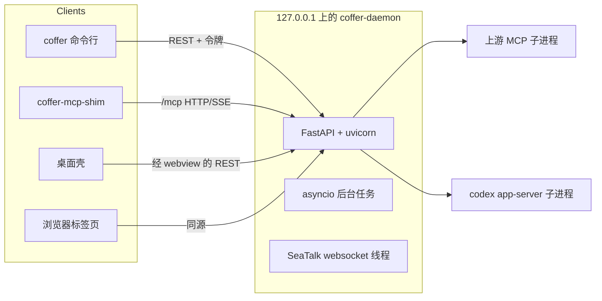
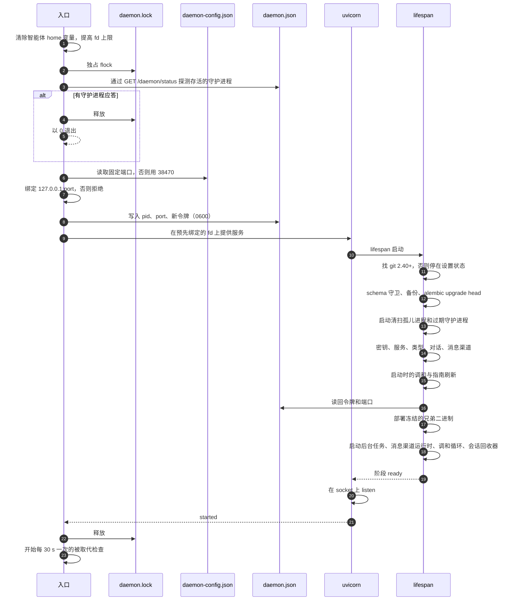
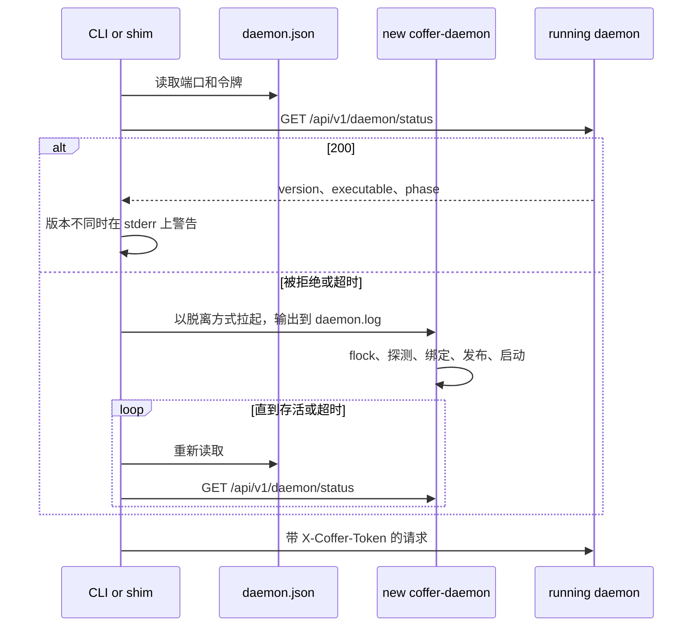
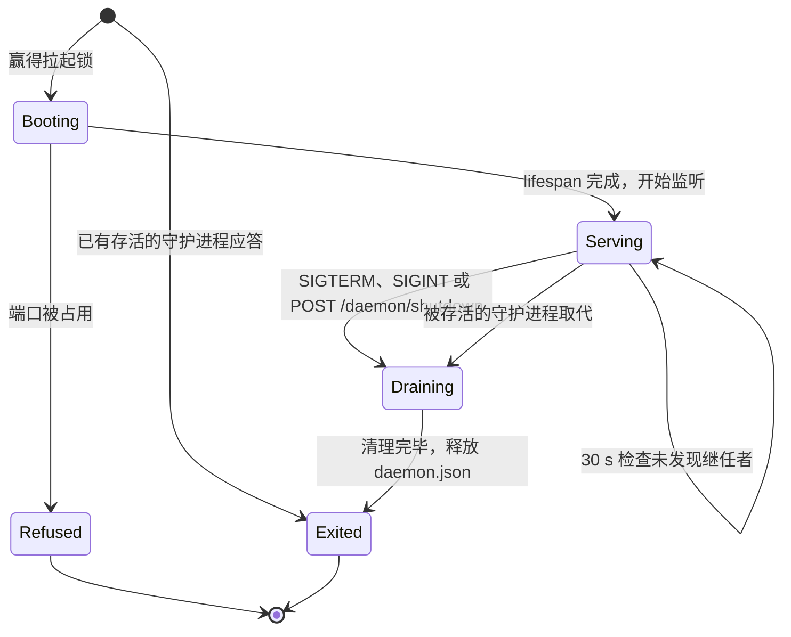

# 守护进程与进程 {#daemon-and-processes}

Coffer 每个保险库运行一个常驻守护进程，其他每个部分都是它的客户端：命令行、智能体启动的 MCP shim、Web 界面和桌面壳。本页讲进程模型、确切的启动顺序、客户端怎样找到或拉起守护进程而绝不会产生两个、守护进程运行的后台任务，以及它怎样停止。它写给想了解机制以及为什么这样设计的工程师。

## 问题 {#the-problem}

一个保险库的状态只有一个所有者：一个 SQLite 写入者、一组上游 MCP 子进程、一组消息渠道连接。但需要这个所有者的进程各有各的节奏，来来去去。编辑器打开时，MCP 客户端启动一个 shim。开发者在终端里运行 `coffer daemon status`。没开任何窗口时来了一条 Telegram 消息。这些调用方都不应该需要知道 Coffer 是否在运行，也都绝不能导致出现第二个守护进程，因为第二个守护进程不会大声失败：它会把保险库的状态拆散在两个进程之间，而你要很久以后才发现。

所以设计必须回答四个问题：

- 谁来启动守护进程，调用方怎样找到它？
- 两个都什么也没找到的调用方，怎样避免启动两个守护进程？
- 调用方怎样知道自己在和预期的构建对话？
- 还没人找它的时候，是什么让守护进程保持运行？

## 决策 {#decisions}

| 决策 | 理由 |
| --- | --- |
| 守护进程是独立的、脱离的进程，从不是调用方的子进程。 | 它必须比启动它的那条命令行命令或那个 shim 活得更久。一个客户端退出，不能把保险库从其他客户端手里带走。 |
| 任何需要守护进程却找不到的界面，都自己拉起一个（检测或拉起）。 | 你永远不会看到「请先启动守护进程」。上手只需要「随便运行一次 `coffer` 命令」。 |
| 发现机制就是一个文件 `~/.coffer/daemon.json`，权限 `0600`。 | 每个客户端读到的端口和令牌都是同一个答案。原子写入，永远不会读到写了一半的内容。 |
| 探测、绑定、发布和就绪都在同一把独占 `flock` 下进行，一直持有到守护进程开始提供 HTTP 服务。 | 两个竞争的拉起只会产生一个守护进程。 |
| 启动最多等这把锁两分钟；发现端口被本保险库正忙的守护进程占着时，作为重复启动退出。 | 卡住的启动或忙到不应答的守护进程，不能让之后每次启动都多出一个闲置进程。 |
| 明确的重启会强制结束不肯停下的守护进程；除此之外没有任何地方会结束守护进程。 | 卡死的守护进程占着端口，温和的重启只能在它旁边失败，旧进程会一直留着。 |
| 存活检测用 HTTP 状态调用，从不用 TCP 连接。 | 崩溃之后，一个无关的进程可能占着记录的端口。 |
| 端口是固定的（除非你指定别的，否则是 `38470`），守护进程宁可拒绝启动也不换端口。 | Web 界面的书签一直有效，浏览器按源保存的状态在重启后也还在。 |
| 版本不一致只检测和报告，从不据此行动。 | 守护进程会跨越升级继续运行。悄悄杀掉它会断开所有附着的 MCP 客户端。 |
| 守护进程从不因为闲置而自行退出。 | 没有打开 Coffer 窗口时智能体也需要它。闲置退出会让下一个调用方承担冷启动。 |

理由记录在 [Daemon Detect-or-Spawn](https://github.com/wyx-sg/Coffer/blob/main/docs/decisions/daemon-detect-or-spawn.md) 中。

## 进程 {#processes}



| 进程 | 生命周期 | 作用 |
| --- | --- | --- |
| `coffer-daemon` | 常驻，每个保险库一个 | 在 `127.0.0.1:<port>` 上提供 REST API（`/api/v1/*`）、MCP 端点（`/mcp`）和构建好的 Web 界面。它拥有全部状态，是唯一的 SQLite 写入者。从源码运行时是 Python 包里的守护进程入口模块。冻结构建运行 `coffer-daemon` 二进制。 |
| 本地模型代理 | 常驻，比守护进程活得久 | 正式构建里是 `coffer-daemon proxy`（从源码运行时是包里的代理入口模块），守护进程唯一的兄弟进程，在 `127.0.0.1:38471` 上。使用 API 密钥 或本地提供商的智能体把模型请求发给它；它用真实的 key 转发到上游，并把用量记录写入缓冲区，供守护进程摄取。守护进程拉起它，在自己重启后通过 `~/.coffer/proxy.json` 重新附着到它，并在它崩溃后重启它。见[本地模型代理](/zh/architecture/model-proxy)。 |
| `coffer` 命令行 | 一条命令 | 通过回环 HTTP 调用守护进程，带上 `daemon.json` 里的令牌和 `X-Coffer-Actor: cli` 请求头，所以它的修改会以命令行身份记入审计。 |
| `coffer-mcp-shim` | 一个 MCP 客户端会话 | 一个 stdio ↔ HTTP/SSE 转发器。智能体把它当作 stdio MCP 服务器启动，它把每行 JSON-RPC 转发给 `/mcp`。见 [MCP 网关](/zh/architecture/mcp-gateway)。 |
| 桌面壳 | 应用运行期间 | 一个 Tauri 2 应用，把同一份前端构建作为本地资源加载，并通过 IPC 把守护进程的 URL 和令牌交给它。它会检测或拉起守护进程，但守护进程比应用活得久：退出应用不会停止守护进程。见[桌面应用](/zh/guides/desktop-app)。 |
| 上游 MCP 服务器 | 每个客户端会话 | 网关为每个 `/mcp` 会话拉起的子进程。每个都记录在 `~/.coffer/upstream-pids/` 下，这样崩溃后下一个守护进程可以回收它。 |
| `codex app-server` | 每个 Codex 对话 | 对话平台一直开着的常驻子进程。它和上游 MCP 服务器走同一条路径拉起和记录。 |
| SeaTalk websocket | 守护进程内读取 `coffer-seatalk-bridge` 子进程的线程 | 每个 SeaTalk 消息渠道一条出站 websocket 连接，由加载 SDK 的桥接进程持有。没有任何监听。 |

Telegram 在守护进程的事件循环里轮询。SeaTalk 的 SDK 是第三方代码，放在智能体可写的目录里，所以它在一个独立的可执行文件 `coffer-seatalk-bridge` 中运行，这个文件没有钥匙串 entitlement，从标准输入接收应用凭据；每个 SeaTalk 消息渠道有一个自己的具名线程，读取桥接进程输出的 JSON 行事件，并通过线程安全的回调把每个事件交回事件循环。SDK 不会重连，所以连接器自己监管连接。出错时它按指数退避，从 1 s 到最多 30 s。当同一个应用的另一处注册把它踢下线时，它固定等待 60 s，因为 SeaTalk 每个应用只允许一条活跃连接，和另一方抢只会让连接来回易手。由于这个 socket 是出站的，守护进程的回环监听仍是保险库唯一暴露的 socket。见 [SeaTalk Inbound Over WebSocket](https://github.com/wyx-sg/Coffer/blob/main/docs/decisions/seatalk-websocket-inbound.md)。

## 两个文件：配置进，运行状态出 {#two-files-configuration-in-runtime-state-out}

守护进程在绑定之前读一个文件，绑定之后写另一个。它们并排放在 `~/.coffer/` 下，有意分开。

| 文件 | 方向 | 由谁写 | 内容 | 生命周期 |
| --- | --- | --- | --- | --- |
| `daemon-config.json` | 进 | 命令行、功能开关、同步的机器身份 | `port`（可选）、`proxy_port`（可选）、`machine_name`、缓存的 `machine_id`、`features` 开关 | 跨重启保留 |
| `daemon.json` | 出 | 守护进程，在启动时 | `version`（schema 版本，当前为 `1`）、`pid`、`port`、`token`、`started_at`、`binary_path` | 退出时删除 |

`daemon-config.json` 不能放在 SQLite 里，因为端口必须在打开或迁移数据库之前选定。它也不能是环境变量：拉起守护进程的调用方会传下自己的环境，而 shell 配置文件只作用于你的终端。这个文件只用标准库读取。读不了或格式错误的文件会记一条警告并按「没有设置」处理，所以手改出的错别字永远不会让守护进程起不来。写入时合并进已有对象，并保留本构建不认识的键，所以新版 Coffer 写的文件被旧版碰过之后仍然完好。

`daemon.json` 以 `0600` 权限原子写入。退出时，守护进程只有在文件里记录的仍是它自己的 pid 时才删除它，所以一个竞争失败的守护进程永远删不掉正在运行的守护进程的发现文件。每个读取方都把文件不存在或格式错误当作「没有守护进程」，从不当作错误。

一个 `daemon.json` 示例：

```json
{
  "version": 1,
  "pid": 48213,
  "port": 38470,
  "token": "q3V0…",
  "started_at": "2026-09-24T08:12:40.118204+00:00",
  "binary_path": "/Users/you/.coffer/bin/0.1.1/coffer-daemon"
}
```

## 启动顺序 {#startup-sequence}

启动分两个阶段。守护进程的进程入口在任何 Web 框架代码之前运行：它要么赢得保险库，要么退出；然后绑定 socket、发布发现文件。接着 uvicorn 导入应用，FastAPI lifespan（应用的启动与关闭钩子，位于 HTTP 界面的组合根）构建其余一切。每个装配步骤都返回它构建的东西，下一步把它当参数接过去，所以你在 lifespan 里读到的顺序就是依赖顺序。



逐步说明（有两个参数会跳过下面全部步骤：`--version` 打印包版本——与 `coffer --version` 打印的是同一行——然后退出；`proxy` 改为运行[本地模型代理](/zh/architecture/model-proxy)）：

1. **环境清理。** 守护进程移除它继承来的每个智能体 home 变量（`CLAUDE_CONFIG_DIR`、`CODEX_HOME`，取自智能体描述符）。否则，从导出了这类变量的 shell 启动的守护进程，会让智能体跑在那个目录上，而 Coffer 却把技能和配置投递到登记的目录里。它还会把 `RLIMIT_NOFILE` 软上限提高到接近硬上限，最多 8192，因为由 GUI 应用启动的守护进程继承到的上限大约只有 256。
2. **拉起锁。** 它在 `~/.coffer/daemon.lock` 上取一把独占 `flock`，并把自己的 pid 写进文件。锁挂在打开的描述符上，所以文件在两次运行之间一直留在磁盘上。等待上限是两分钟：到那时还没启动完的持有者已经卡住了，排在它后面只会让每次 CLI 命令、shim、桌面启动和登录服务重启都多出一个闲置进程。放弃等待的启动会在日志里写下持有者的 pid，并以 0 退出。
3. **存活探测。** 在锁内，它对 `daemon.json` 记录的端口调用 `GET /api/v1/daemon/status`，超时 15 s。超时必须长于一个正在预热的守护进程可能给出的最慢状态响应，因为超时看起来和「没人在线」一模一样。如果有守护进程应答，新进程释放锁，记下「已在运行」并以 0 退出。这一行和日志配置好之前的其他重复退出都按警告级别记录，因为那时只有警告会写进守护进程日志，而重复启动必须留下痕迹。
4. **绑定。** 它从 `daemon-config.json` 读取端口（指定的端口，否则 `38470`），用 `SO_REUSEADDR` 精确绑定 `127.0.0.1:<port>`。它重试四次，间隔 0.3 s，让重启能熬过即将退出的守护进程的最后时刻。如果端口仍被占用，它以端口被占用的错误失败，打印一条写明占用者 pid 和命令行的消息，并以退出码 2 退出。如果占用者是服务同一保险库的 Coffer 守护进程（忙到 15 s 内没应答探测），这次启动就是重复启动而不是失败：它记下「守护进程已在运行但正忙」并以 0 退出，这样登录服务不会每隔几秒重启它一次。
5. **发布。** 它生成一个新的随机令牌（URL 安全，取自 32 个随机字节）并写入 `daemon.json`。socket 保持打开，它的文件描述符交给 uvicorn，所以已发布的端口从不会被释放再重新绑定。否则其他进程可能在中间抢走端口并收到令牌。
6. **git。** lifespan 先找 git 2.40 或更高版本：先在守护进程自己的 `PATH` 上找，再到登录 shell 的 `PATH` 上找，因为从程序坞或编辑器的 MCP shim 启动的守护进程拿到的 `PATH` 是截短的。只在登录 shell 的 `PATH` 上找到的 git，会被放到守护进程 `PATH` 的最前面。一个都没找到时，下面的步骤都不运行，守护进程转而等待 git；见[等待 git](#waiting-for-git)。
7. **迁移。** lifespan 在事件循环之外对 `runs.db` 运行 Alembic。如果数据库的修订号本构建不认识，启动以 `DB_SCHEMA_TOO_NEW` 失败，而不是抛出一个看不懂的 Alembic 错误。如果需要升级，会先把文件及其 `-wal`/`-shm` 伴随文件复制为 `runs.db.pre-<revision>`，保留最新三份。schema 已是最新时什么都不复制。见[持久化](/zh/architecture/persistence)。
8. **启动清扫。** 启动清扫会杀掉 `~/.coffer/upstream-pids/` 下记录的、仍以相同命令行存活的每棵进程树。冻结构建还会终止其他可证明在为同一个保险库服务的守护进程，即可执行文件名相同、解析后的 `~/.coffer` 也相同。读不出保险库的进程不会被动。清扫还会删除早期版本留下的对话记录摘要缓存 `~/.coffer/derived/cache/agent`。
9. **装配。** lifespan 打开保险库仓库，启动处理手动编辑的保险库扫描器，构建密钥存储和主密钥、审计和资源服务、保留策略服务以及内部引擎设置文档（聚合和提炼的维护、语音转文字模型）。它创建内置工具注册表，按依赖顺序装配每种资源类型，然后是对话、知识清扫和消息渠道。对话还会安排一次性清扫，把崩溃时停在 `streaming` 状态的消息标记为 `failed`。
10. **启动调和。** 调和器对它负责收敛的每个目标跑一轮启动调和：智能体的 MCP 条目、技能链接、提供商投射和记忆投递 Hook。它修复的东西会进审计，失败的一轮只记日志，从不让启动失败。然后用本构建重新渲染内置的 `coffer-guide` 技能。
11. **身份。** lifespan 把令牌、端口和启动时间从 `daemon.json` 读回到鉴权依赖和状态路由里。存在但读不了的 `daemon.json` 会让启动失败。如果吞掉这个错误，所有需要鉴权的路由都会返回 503，而状态路由却说已就绪。
12. **二进制部署。** 冻结构建把它的兄弟二进制复制到 `~/.coffer/bin`（见[二进制部署](#binary-deployment)）。从源码运行时这一步什么都不做。
13. **后台任务。** 它启动后台任务、消息渠道运行时、调和器的周期循环、待处理事项监视和 MCP 会话回收器，然后把阶段设为 `ready`。保险库扫描器、模型代理监管者、用量循环和价格刷新已经在第 9 步由各自类型的装配启动了。

只有在 lifespan 返回之后，uvicorn 才开始在 socket 上监听、报告 `started`，并让入口释放拉起锁。因此竞争的拉起在整个启动过程中都被锁挡着，从不会去探测一个已绑定但还不应答的 socket。锁打开时，那个拉起的探测会找到一个正在服务的守护进程，然后干净地退出。在真实的保险库上启动要好几秒（迁移、密钥存储、上游预热），所以探测超时给得很宽裕。

::: info 启动期间的状态
`GET /api/v1/daemon/status` 报告的 `status` 阶段是 `ready` 或 `draining`，[等待 git](#waiting-for-git) 时是 `setup`。没有「启动中」阶段：socket 只在 lifespan 完成之后才开始监听，所以客户端在启动期间看到的是连接被拒绝，然后是 `ready`。关闭开始时，守护进程自己的 uvicorn 服务器（入口里的一个小子类）把阶段切成 `draining`，并让监听 socket 再开着约一秒才关闭，这样轮询的一方真的能看到这个阶段。入口也会在 uvicorn 拿到自己的 dup 之后立刻关掉自己那一份监听 socket，所以关闭过程中端口不会停在没人 accept 的 LISTEN 状态。之后连接会被拒绝。因此刚拉起守护进程的客户端会在限定时间内等待探测应答，而不是把连接被拒绝当成失败。
:::

### 等待 git {#waiting-for-git}

保险库是一个 git 仓库，所以没有可用 git 的守护进程打不开它。如果直接拒绝启动，所有客户端只能说「离线」，所以守护进程照样启动，但处在一个**设置状态**：

- 它不运行 lifespan 的任何装配（没有迁移、保险库、资源类型、后台任务或 MCP 会话），只从 `daemon.json` 读回令牌和端口，让页面、CLI 和桌面壳能和它通信。它的状态报告 `status: "setup"` 和一个 `setup` 对象：原因（`git_missing` 或 `git_too_old`）、找到的版本和需要的版本、一段说明，以及安装或更新的交接提示词。
- CORS 内侧的一个中间件对其他所有 `/api/` 路由和 `/mcp` 返回 503 `GIT_NEEDED`，带着同样的说明和交接提示词；状态、`POST /daemon/setup/check`、重启和关闭除外。CLI 像打印任何带交接的错误一样打印这个拒绝，并以 10 退出；shim 把它完整地转给智能体。
- Web 界面在每个页面的位置显示设置界面。**重新检查**让 `POST /daemon/setup/check` 再找一次（两个 `PATH` 都找，从不用缓存）。git 就绪后，页面按宿主的方式重启守护进程（桌面壳从外部重启，浏览器通过 `POST /daemon/restart`），接替的守护进程正常启动。

恢复靠重启，而不是把保险库装配进正在运行的进程。lifespan 是一个上下文，它的顺序就是依赖顺序，关闭就是它的 `finally`，而 uvicorn 已经把应用报告为已启动；之后从某个请求里补完启动，需要第二套生命周期，有自己的关闭和自己的「就绪」时刻。重启复用了已经能把新令牌和端口交给页面和壳的机制。桌面壳不需要任何改动：设置状态对状态探测返回 200，所以启动握手会成功并加载页面。

## 检测或拉起 {#detect-or-spawn}

有三个界面可以启动守护进程，三者拉起的方式相同：都经过同一个共享的拉起助手，它解析出命令并以脱离方式启动：POSIX 上开一个新会话，stdin 来自 `/dev/null`，stdout 和 stderr 追加到 `~/.coffer/logs/daemon.log`。拒绝启动的守护进程（比如因为端口被占）会在这个文件里说明原因，而每条错误消息都会指向这个文件。这个文件在 10 MB 时轮转（保留三份备份）。因为脱离运行的守护进程自己的 stdout 和 stderr 就是指向它的描述符，轮转处理器在每次滚动之后会把这些描述符移到新文件上；否则直接写到 stderr 的回溯会落进一份没人读的、已被轮转走的副本。uvicorn 启动时关掉了它自己的日志配置，所以它的记录和其他一切一样走同一个 JSON 处理器。

守护进程命令按以下顺序解析：

| 构建 | 候选，按顺序 |
| --- | --- |
| 源码 | 调用方正在运行的 Python 解释器，以包里的守护进程入口模块启动 |
| 冻结 | 正在运行的二进制旁边的 `coffer-daemon`，然后是 `PATH` 上的 `coffer-daemon`，然后是 `/Applications/Coffer.app/Contents/MacOS/coffer-daemon`（macOS） |



这些界面只在等待时长和拉起失败后的处理上有区别：

| 界面 | 探测 | 拉起等待 | 失败时 |
| --- | --- | --- | --- |
| `coffer …`（除 `coffer daemon status` 之外的任何命令） | 共享的存活探测（状态调用） | 30 s | 打印 `daemon failed to start within 30s; check ~/.coffer/logs/daemon.log`，以 3 退出 |
| `coffer daemon start` | 共享的存活探测，然后试绑定计划使用的端口 | 等新守护进程应答状态调用 30 s（只有 `daemon.json` 不算） | 在拉起之前打印端口冲突消息；子进程先退出（保险库迁移被拒）则打印 `daemon exited at startup (code N); check daemon.log`；等待 git 的守护进程会启动，命令随后打印原因；或者打印超时消息，以 1 退出 |
| `coffer-mcp-shim` | `daemon.json` 指向一个正在运行的 Coffer 守护进程时轮询 15 s，否则 1 s | 10 s | 向 stderr 写 `daemon did not come up within 10s`，以 3 退出 |
| 桌面壳 | 它查找链的第 1 步 | 90 s | 显示离线横幅并附上原因 |

没有哪个界面会结束一个它不再等待的守护进程。慢的启动会自己完成，完成不了的会在拉起锁的有限等待之后自己退出。而且结束也会落空：在单文件构建里，调用方启动的进程只是引导程序，结束它之后它解压出来的守护进程还在，只是没人看得见。shim 对正在运行但还没应答的守护进程等得和存活探测一样久，因为过去守护进程一忙，期间打开的每个 MCP 会话都会再拉起一个。

`coffer daemon status` 是唯一从不拉起的命令：它用同一个存活探测，没人应答时打印 `not running`（加 `--json` 时是 `{"status": "stopped"}`）并以 3 退出，所以询问守护进程状态永远不会改变答案。有守护进程在服务时，它还会列出同一保险库的其他守护进程（`--json` 下是 `other_daemon_pids`）：`HOME` 解析到这个 `~/.coffer` 的源码或冻结守护进程，从不包括模型代理，单文件的引导程序和它的子进程只算一个。

`coffer daemon start` 在拉起之前检查端口，让冲突以一条可操作的消息返回，而不是启动超时。检查是一次真实的绑定，随即释放。它只可能错报成「空闲」，比如在守护进程自己绑定之前的空隙里；而漏掉的冲突在拉起的守护进程拿到锁之后，仍会安全地以「已在运行」收场。

### 桌面壳的查找链 {#the-desktop-shell-s-resolution-chain}

壳按固定顺序查找守护进程：

1. `~/.coffer/daemon.json` 指向的、能应答状态调用的运行中的守护进程。壳直接附着到它，从不拉起。
2. 应用包里的 `coffer-daemon`。
3. `~/.coffer/bin/coffer-daemon`。
4. `PATH` 上的 `coffer-daemon`。
5. 否则，提示你安装命令行。

存活检查必须放在最前面。第 2 到 4 步回答的是「要拉起哪个二进制」，而第 1 步回答的是「到底要不要拉起」。如果顺序反过来，打包的应用会在你已经从终端启动的守护进程旁边再启动一个，而在固定端口下，第二个守护进程会拒绝启动。壳以脱离方式拉起，而不是作为托管的 sidecar，因为托管的 sidecar 会随应用一起死掉；它还会把你登录 shell 的 `PATH` 交给子进程。从托盘或离线横幅发起的重启限制为每 5 s 最多一次。它通过 `POST /api/v1/daemon/shutdown` 停止运行中的守护进程，最多等 8 s 让端口释放，然后拉起。如果守护进程 15 s 内不应答状态调用，或者应答了关闭请求却一直占着端口，就先强制结束它：壳在 `ps` 显示 `daemon.json` 记录的 pid 是 Coffer 守护进程命令行（从不是 `coffer-daemon proxy`）之后，给它发 `SIGTERM`，5 s 后发 `SIGKILL`，再等端口释放。发现文件指向的不是活着的 Coffer 守护进程时，壳不动它，直接拉起。

### 从浏览器发起的重启 {#a-restart-asked-from-a-browser}

浏览器里的页面是由守护进程提供的，所以它无法从外部停掉守护进程再启动另一个。`POST /api/v1/daemon/restart` 让守护进程自己完成这两半。它用普通的拉起命令、以脱离方式拉起继任者，环境是它自己的环境加上 `COFFER_DAEMON_PREDECESSOR_PID`，应答 `202` 并带上继任者要绑定的端口，只有在应答发出之后才给自己发 `SIGTERM`，走普通的优雅退出。继任者先等那个 pid 退出（最多 60 s），再去取拉起锁，然后像任何守护进程一样启动。如果等完之后旧守护进程还没退出，说明它卡死了，继任者会先结束它的进程树再继续，所以重启既不会产生两个守护进程，也不会让旧进程一直占着端口。冻结的继任者以 `PYINSTALLER_RESET_ENVIRONMENT=1` 启动，这样它会解压自己的文件，而不是依赖前任在退出时会删掉的那些。这里不请登录服务来重启，因为它只重启失败的退出，而且只在「开机自启动」打开时才存在。随后页面从继任者的源重新加载，拿到新的令牌。

### 重启后 shim 的恢复 {#shim-recovery-after-a-restart}

一个 shim 可能活好几个小时，而守护进程可能在它底下重启。当向 `/mcp` 的 POST 连接失败时，shim 会重新读取 `daemon.json`。如果端口或令牌变了，它重新绑定，丢掉旧的 `Mcp-Session-Id`，对新守护进程重放缓存的 `initialize` 信封，并把这次调用重试一次。智能体的 MCP 客户端保持它的会话不变。

## 固定端口 {#fixed-port}

守护进程绑定一个端口，从不换。什么都没配置时这个端口是 `38470`。你可以指定 1024 到 65535 之间的另一个端口：

```sh
coffer config get daemon.port      # the port the next start will bind
coffer config set daemon.port 8765 # write it to daemon-config.json
coffer daemon restart              # a running daemon owns its socket; restart to move
coffer config unset daemon.port    # back to 38470
```

`daemon.port` 这个键在没有守护进程运行时也能用，因为你恰恰是在守护进程起不来时才去改端口。因此 `coffer config set daemon.port` 直接写进绑定前设置文件，而不经过路由，`coffer config` 也只承载这类键。Web 界面通过运行中的守护进程访问同一个文件：`GET /api/v1/daemon/port` 返回已保存的端口、实际绑定的端口，以及是否有待重启生效的改动；`PUT /api/v1/daemon/port` 保存下次启动的端口，绑不上的端口会被拒绝。

一个扫描空闲端口的守护进程会悄悄搞坏两样东西：你的 Web 界面书签，以及浏览器按那个源保存的一切。拒绝启动并说出占用端口的进程，是更好的失败方式。如果占用者本身就是一个 Coffer 守护进程，消息会说它很可能是你自己还在预热的守护进程，而不是叫你杀掉它。

::: details 测试框架的覆盖
`COFFER_PORT_RANGE_START` / `COFFER_PORT_RANGE_END` 会恢复一个有界的扫描（不带 `SO_REUSEADDR`），让并发的测试守护进程互不冲突。它们的优先级高于你的设置，让测试运行是封闭的。没有任何面向用户的界面会设置它们。

`COFFER_DAEMON_EXIT_WITH_PID` 把测试守护进程绑在它的测试进程上：守护进程每 2 s 检查一次，那个 pid 退出后它就关闭。守护进程从不闲置退出，没有这个变量的话，在清理之前被杀掉的测试运行会让它的守护进程一直活下去。e2e 守护进程脚本传入 Playwright 的 pid，启动 shim 的测试传入自己的 pid。守护进程会从自己的环境里删掉这个变量，所以它拉起的进程不会继承。
:::

## 版本不一致 {#version-skew}

守护进程会跨越升级继续运行，所以新装的命令行可能附着到上一次安装的守护进程上。状态调用报告 `version`（已安装的 Coffer 包的版本）和 `executable`（守护进程运行所用的解释器或二进制的路径）。一个共享的检查把它们和调用方自己的构建比较，生成一行警告：

```text
coffer: WARNING: attached to a Coffer daemon at version 0.1.0 (/Users/you/.coffer/bin/0.1.0/coffer-daemon) but this coffer is 0.1.1; run `coffer daemon restart` to serve the current build
```

命令行在每条命令之前把它打印到 stderr。shim 把它写到 stderr 和自己的日志。桌面壳和它自己的构建版本比较，它承载的页面会显示一条**守护进程版本过旧**横幅，带一个重启按钮。它们都不会拒绝工作或杀掉守护进程：只检测，不强制，因为自动杀进程会断开附着在上面的每个 MCP 会话。

## 后台工作 {#background-work}

不属于某一种类型的周期性后台任务在一个地方启动：HTTP 界面的后台任务启动器。拥有循环的类型在自己的装配代码里启动它，lifespan 和入口点还直接拥有几个任务。每个后台任务先跑一次补课或等一段启动延迟，然后按间隔循环。失败的一轮会记日志，从不会杀掉它的循环。属于实验功能的后台任务在每一轮开头读取开关，功能关闭时跳过这一轮：知识清扫、提炼和聚合都是这样。用量采集、价格刷新和同步收敛任务不属于任何实验功能，不检查开关。

| 后台任务 | 节奏 | 做什么 |
| --- | --- | --- |
| 保留策略 | 立即，然后每 6 h | 把每张登记的日志型表按策略清理，并让 `~/.coffer/logs/` 里的文件（包括每个进程的 shim 日志）按时过期。 |
| 保险库同步 | 30 s 后第一轮，然后按所配远端的间隔（默认 1 h）。没有远端或远端已暂停时，每分钟重新检查一次 | 和你的 git 远端跑一轮同步。在你配置远端之前什么都不做。见[保险库同步](/zh/architecture/vault-sync#the-worker)。 |
| 知识清扫 | 立即一次，然后每 60 s | 把丢进知识集隐藏目录 `.inbox/` 的文件提升为文档，提交在外部编辑过的文档，并重新渲染指南技能。每台机器上都运行。见[知识](/zh/architecture/knowledge)。 |
| 记忆聚合 | 立即，然后默认每小时 | 把每个智能体的原生记忆读进派生的记忆树。见[记忆](/zh/architecture/memory)。 |
| 记忆提炼 | 60 s 后第一次，然后默认每 6 h | 把聚合后的记忆里每条新的原始条目变成一篇笔记，并渲染索引。不涉及任何模型。 |
| 消息渠道运行时 | 每 2 s | 把运行中的适配器（Telegram 轮询、SeaTalk 连接）和绑定到本机的消息渠道资源进行调和。 |
| MCP 会话回收器 | 每 60 s | 关闭闲置超过 30 分钟的 `/mcp` 会话，连同它们的每会话监管者和上游子进程。可用 `COFFER_MCP_SESSION_IDLE_S` 和 `COFFER_MCP_SESSION_REAPER_INTERVAL_S` 调整。 |
| 调用记录写入器 | 持续 | 在请求路径之外，把 MCP 调用日志行批量写入 SQLite。 |
| 解包保活 | 启动时立即执行，之后每 6 h | 仅限冻结构建。刷新单文件二进制解包到 `$TMPDIR/_MEI*` 里的文件时间戳，让系统临时文件清理（macOS 会删除约 3 天未使用的文件）无法在长时间运行的守护进程底下删掉 CA 证书包和库文件。它还会删除每个带 `.coffer-pid` 标记（由每个单文件 Coffer 二进制的运行时钩子写入）、且标记里的 pid 已不再运行的 `$TMPDIR/_MEI*` 目录，回收被杀掉的命令行或桥进程留下的东西。没有标记的目录（别的 PyInstaller 程序的）和守护进程自己的目录从不触碰。 |
| 被取代检查 | 每 30 s，由入口运行 | 当另一个存活的守护进程接管了 `daemon.json` 时，让本守护进程退下（见下文）。 |
| 保险库扫描器 | 启动时扫一次，然后在文件事件时以及每 60 s | 把保险库里的手工编辑落成提交。 |
| 调和器 | 每 60 s，收到提示时提前 | 收敛智能体的 MCP 条目、技能链接、提供商投射和投递 Hook，并记录尚未解决的偏移。 |
| 待处理事项监视 | 每 30 s，收到提示时提前 | 重新计算总览的「需要你处理」列表，并在 `GET /api/v1/events` 上发布变化。 |
| 模型代理监管者 | 每 5 s | 找到或拉起[本地模型代理](/zh/architecture/model-proxy)，把状态推给它，它挂掉时重启它。 |
| 用量摄取 | 每 2 s | 把代理的用量暂存文件写进 `runs.db`。 |
| 价格刷新 | 60 s 后第一次，然后每天 | 刷新用于估算费用的模型价格表。 |

聚合和提炼的间隔来自内部引擎设置，并在后台任务等待期间重新读取，所以在**设置**里的改动无需重启就生效。清扫的 60 s 间隔是固定的。

## 退下 {#standing-down}

守护进程从不因为闲置而退出，但当它能证明自己已被取代时会退出。它每 30 s 重新读一次 `daemon.json`，只有当文件里写的是另一个 pid、并且那是一个存活的 Coffer 守护进程时，才会退下。命令行里写着守护进程入口模块（源码运行）或 `coffer-daemon`（冻结构建）的 pid 算作 Coffer 守护进程。文件不存在或格式错误、写的是它自己的 pid、或者 pid 已死或已被复用，它都继续服务。删掉发现文件绝不能把唯一健康的守护进程一起带走。检查失败会记日志并重试，从不据此行动。



## 关闭 {#shutdown}

只有一条退出路径。`SIGTERM` 和 `SIGINT` 都走它。`POST /api/v1/daemon/shutdown`（需令牌）应答 `204`，然后给自己的进程发 `SIGTERM`，所以通过 API 停止和通过信号停止不可能走岔。`coffer daemon stop` 先确认 `daemon.json` 里的 pid 仍是一个 Coffer 守护进程。如果不是，它删掉这个过期文件，而不是给一个陌生进程发信号。否则它发送 `SIGTERM`，并最多等 15 s 让 `daemon.json` 消失，之后报告这个守护进程没有退出，但不去动它。`coffer daemon restart` 多走一步：同样等 15 s 后，在确认 pid 是服务本保险库的 Coffer 守护进程之后结束它的进程树，并删掉被结束的守护进程来不及删的发现文件。

然后 uvicorn 优雅关闭，对打开的连接设 10 s 上限。没有这个上限，一条永远不会自己结束的 `/mcp` SSE 流会让守护进程永远关不掉。lifespan 的清理按一个至关重要的顺序执行：

1. 先取消调和器的循环，因为一轮调和会写智能体的配置文件，不能在其他部分关闭时开始；然后取消待处理事项监视。
2. 停止后台任务：保留策略、同步、知识清扫、提炼、聚合，以及技能更新检查（它还会删除暂存的来源）。
3. 停止消息渠道运行时，先取消调和器再销毁适配器，这样正在执行的一次调和不会把它们复活。消息渠道要早停，因为它们是发起新轮次的源头。
4. 趁数据库还开着，停止仍在运行的对话轮次，让每个轮次在收尾时写下它已生成的部分回复。
5. 给保留策略任务 2 s 完成一次清理，然后取消它。
6. 取消会话回收器，然后排空带缓冲的调用记录写入器。
7. 停止监管模型代理（代理本身继续运行，所以智能体正在进行的模型流能熬过重启），然后停止价格刷新和用量循环。
8. 销毁每个 MCP 会话监管者，包括管理路由背后那个进程级的监管者，这会终止它们的上游子进程；然后关闭 `/mcp` 会话状态。
9. 销毁数据库引擎并清除当前令牌。
10. 停止保险库扫描器，然后销毁派生数据库。

每一步都是尽力而为：失败会带着步骤名记日志，不会阻止后面的步骤。最后入口释放 `daemon.json`（仅当它仍写着本 pid 时）并关闭 socket。

常驻子进程共用一套终止阶梯：`SIGTERM`、有限等待、`SIGKILL`、有限等待。子进程的 pid 记录只在它确实在这里被回收时才删除。像 `uvx` 和 `npx` 这样的上游 MCP 包装器会拉起解释器孙进程，所以在发任何信号之前会先枚举整棵进程树。崩溃会跳过这一切。这正是 pid 记录和下一个守护进程的启动清扫存在的意义。

## 二进制部署 {#binary-deployment}

冻结构建在启动时把它的兄弟二进制（`coffer`、`coffer-daemon`、`coffer-mcp-shim` 及其 `coffer-mcp-shim-lib/` 文件夹）部署到 `~/.coffer/bin` 下按版本分的目录里，并把公开名字切换为相对符号链接。这件事由守护进程负责，因为不管来自终端压缩包还是 `.dmg`，它都是每个冻结安装一定会启动的那个进程。把 `coffer-daemon` 部署到那里，也让冻结的 shim 在重启电脑后能找到要拉起的守护进程，并让登录服务有一个能跨升级保持有效的路径。源码安装不做这些，因为 `pip install` 已经把 `coffer` 和 `coffer-mcp-shim` 放到了 `PATH` 上。

复制、哨兵文件、符号链接切换和清理的规则只在一处描述：[分发与发布](/zh/architecture/distribution#versioned-directories-and-the-symlink-flip)。

## 登录服务 {#login-service}

在 macOS 上，打开**开机自启动**（**设置 › 守护进程**）会写一个用户级 launchd agent `~/Library/LaunchAgents/dev.coffer.daemon.plist`，让守护进程在任何东西找它之前就已在运行：

| 键 | 值 | 原因 |
| --- | --- | --- |
| `RunAtLoad` | `true` | 登录时就启动，让智能体每天第一次 `coffer__*` 调用不用承担冷启动。 |
| `KeepAlive` | `{SuccessfulExit: false}` | 崩溃会被重启。干净的退出（`coffer daemon stop`、壳发起的重启、为继任者退下）保持停止。简单的 `KeepAlive: true` 会和上述每种情况对着干。 |
| `EnvironmentVariables.PATH` | 你登录 shell 的 `PATH`（`$SHELL -l -c`） | 否则 launchd agent 只拿到一个最小的 `PATH`，`npx` / `uvx` 上游会什么都解析不到。 |
| Program | `~/.coffer/bin/coffer-daemon` 符号链接 | 固定到某个版本目录的路径，在两次升级后那个目录被清理时就失效了。 |
| `StandardOutPath` / `StandardErrorPath` | `~/.coffer/logs/daemon.log` | 所有写入者共用一个日志。 |

打开和关闭它是 Web 界面的常驻设置（`PUT /api/v1/daemon/residency`）。卸载会删除 plist，然后把任务 bootout 掉，只有一个例外，用来保住当前这次请求。一旦 launchd 启动了守护进程，守护进程*就是*那个任务，而 `launchctl bootout` 会杀掉正在应答这个设置请求的进程本身。所以当任务下面有进程在运行时，卸载让它继续运行，由守护进程在退出时（入口的最后一步）自己把任务 bootout 掉。否则用户把「登录时启动」关掉之后，launchd 仍会按它手里的定义在守护进程崩溃后重启它。任务已加载但下面没有进程时，会立即 bootout。

## 取舍与备选方案 {#trade-offs-and-alternatives}

- **每个客户端一个守护进程，而不是共用一个。** 每个 MCP 客户端都可以跑自己的 stdio 服务器，在进程内持有保险库。这会放弃单一 SQLite 写入者、共享的上游监管和 Web 界面，而且每个客户端都要承担完整的冷启动。Coffer 选择只跑一个守护进程，把按客户端的隔离放在它内部，做成每会话的上游子进程。见 [Session Subprocess Model](https://github.com/wyx-sg/Coffer/blob/main/docs/decisions/session-subprocess-model.md)。
- **在发布时就释放拉起锁。** 这样更短，但会留下一个不到一秒的窗口，让竞争的拉起探测到一个已绑定但还没服务的 socket，得出没人在线的结论，然后绑定第二个端口。把锁一直持有到 uvicorn 开始监听，代价只是让输家多等一次启动的时间。
- **动态端口。** 扫描 `8000–8009` 的守护进程永远不会拒绝启动，但它会悄悄搞坏书签和浏览器状态，还会累积孤儿守护进程，每次重启一个，直到范围被占满。固定端口把这两种失败变成一条清楚的消息。
- **闲置退下。** 闲置一段时间后退出能省内存，但会让下一个调用方承担好几秒的冷启动，而这个调用方通常是正在执行任务的智能体，或者没开窗口时到达的一条消息渠道消息。守护进程保持常驻，登录服务让它始终可用。
- **版本不一致时自动重启旧守护进程。** 这能让构建保持一致，但会在毫无预警的情况下拆掉每个附着的 MCP 会话。Coffer 报告版本不一致，把重启留给你。
- **回环加令牌就是全部访问模型。** Coffer 是单用户、本地优先的，没有需要防护的远程访问。剩下的风险——浏览器页面通过 DNS rebinding 访问回环端口——由回环 `Host` 检查处理。见[安全模型](/zh/architecture/security)。

## 在代码中的位置 {#where-it-lives-in-the-code}

| 位置 | 职责 |
| --- | --- |
| 基础设施层的 `daemon` 包 | 进程入口与环境清理、拉起锁、存活探测、固定端口绑定与发布、`daemon-config.json` 和 `daemon.json`、拉起命令解析、版本不一致警告、pid 记录与启动清扫、常驻子进程路径、自我重启、解包保活、launchd agent |
| HTTP 界面 | 组合根与 lifespan、启动时的迁移步骤、后台任务启动器、有序清理、`/api/v1/daemon/*` 路由（状态、常驻、关闭、轮换令牌、日志） |
| 应用层 | 把冻结的兄弟二进制部署到 `~/.coffer/bin` |
| 命令行界面 | 命令行的检测或拉起，以及 `coffer daemon …` |
| shim 界面 | shim 的检测或拉起、握手元数据、重启恢复 |
| 桌面壳（`desktop/`） | 查找链、握手、重启 |

## 相关页面 {#related}

- 规格：[daemon](https://github.com/wyx-sg/Coffer/blob/main/openspec/specs/daemon/spec.md)、[desktop-app](https://github.com/wyx-sg/Coffer/blob/main/openspec/specs/desktop-app/spec.md)、[experimental-features](https://github.com/wyx-sg/Coffer/blob/main/openspec/specs/experimental-features/spec.md)
- 决策记录：[Daemon Detect-or-Spawn](https://github.com/wyx-sg/Coffer/blob/main/docs/decisions/daemon-detect-or-spawn.md)、[PyInstaller Distribution](https://github.com/wyx-sg/Coffer/blob/main/docs/decisions/distribution-pyinstaller.md)、[A Per-Start Token, Handed to the Page by Whoever Hosts It, Behind a Loopback Host Guard](https://github.com/wyx-sg/Coffer/blob/main/docs/decisions/daemon-auth-and-origin-guard.md)、[SeaTalk Inbound Over WebSocket](https://github.com/wyx-sg/Coffer/blob/main/docs/decisions/seatalk-websocket-inbound.md)、[The Desktop Shell Returns](https://github.com/wyx-sg/Coffer/blob/main/docs/decisions/desktop-shell-over-a-shared-frontend.md)
- 指南：[运行守护进程](/zh/guides/daemon)、[桌面应用](/zh/guides/desktop-app)、[故障排查](/zh/guides/troubleshooting)
- 参考：[命令行](/zh/reference/cli)、[配置](/zh/reference/configuration)、[文件与目录](/zh/reference/filesystem)
