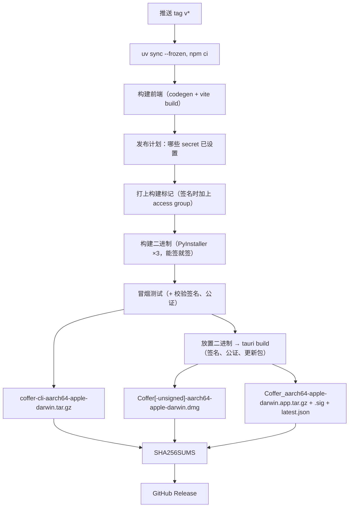
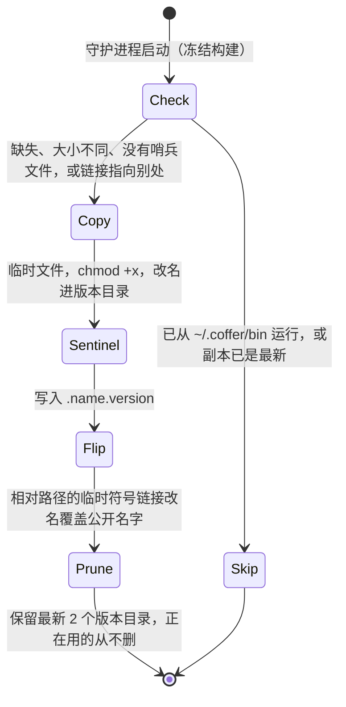
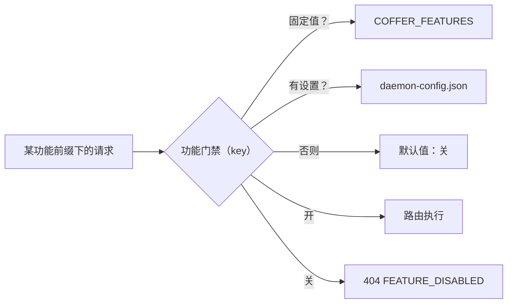
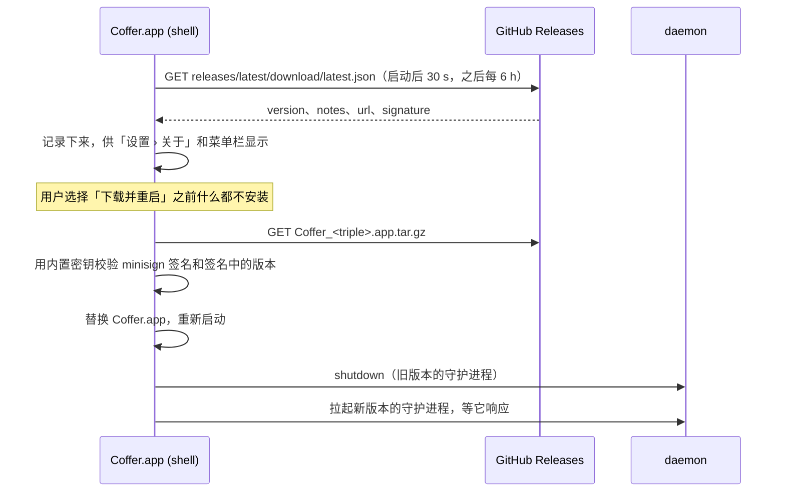

# 分发与发布 {#distribution-and-releases}

本页讲 Coffer 的 Python 代码怎样到达一台没有 Python 的机器：三个冻结二进制、产出它们的发布流水线、发布怎样签名和公证、桌面应用怎样自我更新、两档下载方式、新构建怎样装在旧构建旁边，以及实验功能怎样在一台机器上逐个开启。它写给构建或发布 Coffer 的贡献者，也写给想知道自己磁盘上到底装了什么的人。

## 问题 {#the-problem}

Coffer 是一个 Python 程序，但它的用户是跑 AI 编程智能体的人，不是 Python 开发者。一个要求他们装对 Python 版本、建虚拟环境、再从 wheel 构建错误里爬出来的分发方式，会在第一次运行之前就流失掉大部分人。同时：

- **三个进程必须能找到彼此。** MCP 客户端启动 `coffer-mcp-shim`；shim 必须找到 `coffer-daemon`，必要时启动它；`coffer` 命令行也要做同样的事。
- **升级不能搞坏正在运行的系统。** 新构建落地的那一刻，可能有守护进程正在运行，也可能有 MCP 客户端正要拉起一个 shim。
- **未完成的功能必须能随包发布，又不伤到没要它的人。** 同一条发布线既服务维护者的日常测试，也服务其他所有人。
- **Coffer 是自行分发的。** 只有维护者拿到 Apple Developer ID 之后发布才会签名；在那之前，未签名带来的每个后果——Gatekeeper、钥匙串、调试器附着到守护进程——都必须在设计上绕开，而不能假装不存在。
- **桌面用户不会盯着发布页面。** 应用必须自己发现并安装更新，并且除了构建时内置的一把密钥之外什么都不信任。

## 设计决策 {#design-decisions}

| 决策 | 理由 |
| --- | --- |
| 用 PyInstaller 把每个入口点冻结成单文件可执行程序 | 在没有 Python 的干净机器上也能运行；同一个构建同时服务命令行使用、MCP 客户端拉起和直接下载。 |
| 发布三个二进制，始终放在一起 | shim 和命令行把 `coffer-daemon` 当作同目录的兄弟文件来找，所以放在一起本身就是发现机制。 |
| 两档下载在同一个任务里、用同一批二进制构建 | 桌面应用不可能和它包着的命令行压缩包产生偏移。 |
| 守护进程把兄弟二进制部署到 `~/.coffer/bin` 下按版本分的目录，再切换符号链接 | 部署从不覆盖可能正在运行的二进制，上一个构建也保留下来供手动回滚。 |
| 所有人用同一个构建，每个实验功能默认关闭，由人自己开启 | 没有发布分支，也没有第二个构建：维护者测的正是用户在跑的东西。 |
| 构建标记：提交号，以及打 tag 的发布上的 `stable` 标记 | 打 tag 的发布会忽略开发用的环境开关，不让它们放宽 Host 和 Origin 检查。人看到的任何东西都不会因此改变。 |
| 实验功能在请求时按机器把关 | 切换功能不需要重启，也从不删除它保存的东西。 |
| 只有凭据齐备时才签名、公证和发布更新源 | 同一条流水线为维护者构建签名版本，在其他地方构建未签名版本，两种情况下都保持绿色。 |
| 桌面应用从 GitHub Releases 上一份 minisign 签名的清单更新 | 更新用编译进应用的密钥来验证，所以装什么既不信任 GitHub，也不信任网络。 |

## 二进制 {#the-binaries}

每个二进制都由 `backend/` 下各自的 PyInstaller spec 冻结而成，一个入口点一个：守护进程的、shim 的和命令行的。

| 二进制 | 包含什么 |
| --- | --- |
| `coffer-daemon` | 整个后端：FastAPI 和 uvicorn、SQLAlchemy 和 aiosqlite、alembic 及作为数据文件的迁移脚本、MCP SDK、文档转换器、模型 SDK，以及构建时若前端已构建（`frontend/dist`）则打包进来的 Web 界面。 |
| `coffer-mcp-shim` | MCP 客户端启动的 stdio 到 HTTP 的桥。不含 FastAPI、uvicorn、SQLAlchemy、alembic 和 structlog，这样对每个会话都要拉起它的客户端来说启动很快。 |
| `coffer` | Typer 命令行、httpx 和 `keyring` 后端：守护进程的一个轻量 HTTP 客户端。不含 Web 服务端、SQLAlchemy、Alembic 和 MCP SDK。 |

每个 spec 都构建一个单文件的控制台可执行程序，不做 UPX 压缩，并且都把解释器选项 `-X utf8` 冻结进去。这个选项只对发布出去的二进制有意义：未冻结的解释器在 C locale 下会自己打开 UTF-8 模式，但从 Finder 或 launchd 启动、没有 `LANG` 的冻结二进制否则会退回 ASCII。

PyInstaller 靠静态分析找导入，所以任何在函数里延迟导入的东西——文档转换器、模型 SDK——都在 spec 的隐式导入列表里写死，包数据文件也显式收集。一项 spec 检查在 `make lint` 中运行，当某个 spec 的入口脚本或某个数据文件源路径不再存在，或者某个 spec 丢了 `-X utf8` 时就失败。除了发布之外没有别的 CI 任务会跑 PyInstaller，所以在两次发布之间，是这项检查让 spec 和代码树保持同步。

### 本地构建 {#building-locally}

```sh
make bundle-binaries        # runs scripts/build_binaries.sh → dist/coffer, dist/coffer-daemon, dist/coffer-mcp-shim
bash scripts/smoke_test_bundle.sh dist
```

构建脚本在 `backend/` 下运行 PyInstaller（spec 里的相对路径在那里解析），输出重定向到仓库的 `dist/` 和 `build/`。它会检测宿主机的目标三元组（`aarch64-apple-darwin`、`x86_64-apple-darwin`，以及 Linux 和 Windows 的三元组）用于命名，但只为宿主机构建。

冒烟测试在隔离的 `HOME` 下启动打包好的守护进程，使用空闲的守护进程端口和代理端口以及一个独立的 master key 文件，所以能和本机已在运行的 Coffer 并存，也不会读取登录钥匙串。它等待 `daemon.json` 和 `/api/v1/daemon/status`，检查 `/` 是否提供打包的 Web 界面，用打包的 `coffer daemon status` 查询守护进程，然后通过打包的 shim 发送一次 JSON-RPC `initialize`，期望 15 秒内收到回复。退出时它会停掉守护进程及其启动的模型代理。指向 `Coffer.app/Contents/MacOS` 时，它测试的是桌面 app 自带的那几份二进制。

## 发布流水线 {#the-release-workflow}

发布流水线（在 `.github/workflows/` 下）在推送 `v*` tag 时运行（也可以手动触发，那样只构建产物不发布）。它有一个在 `macos-14` runner 上为 `aarch64-apple-darwin` 构建的任务，和一个发布任务。



1. 用 `uv sync --frozen` 按后端的锁文件（`uv.lock`）安装后端，让打 tag 的构建严格使用锁定的依赖集。
2. 构建前端（`npm run codegen`、`npm run build`）。守护进程的 spec 会把 `frontend/dist` 作为要提供的 Web 界面收进去。
3. 判断哪些签名步骤可以运行（见[签名、公证与更新](#signing-notarisation-and-updates)）。有 Developer ID 时，把它导入一个临时钥匙串，并打上钥匙串 access group 标记。
4. 打上构建标记：始终写入提交号，在 tag 上再加 `stable` 标记（见[构建标记](#the-build-stamp)）。
5. 冻结三个二进制——有 Developer ID 就用它签名——并对 `dist/` 跑冒烟测试。签名的构建随后会校验签名并对二进制做公证。
6. 把 `coffer`、`coffer-daemon` 和 `coffer-mcp-shim` 打包成 `coffer-cli-<triple>.tar.gz`。
7. 把同样三个文件以 `<name>-<triple>` 的名字放进桌面 crate，运行 `tauri build`，产出 `.dmg`——签名时是 `Coffer-<triple>.dmg`（随后公证并 staple），否则是 `Coffer-unsigned-<triple>.dmg`——有更新密钥时还会产出签名的更新包和 `latest.json`。
8. 对每个产物写出 `SHA256SUMS`，然后为这个 tag 创建（或用 `--clobber` 更新）GitHub Release。

只发布 Apple Silicon 上的 macOS 版本。spec 和构建脚本是跨平台的，所以扩大发布矩阵只是改流水线，而不是重新设计。

版本号存在好几个必须完全一致的文件里——其中包括 Python 包、前端 `package.json` 及其锁文件、桌面 crate 及其 Tauri 配置。一个版本号脚本一步改写全部文件，并有一个集成测试确保它们一致。桌面应用把自己的版本和 `/api/v1/daemon/status` 报告的 `version` 比较；不一致时，Web 界面显示一条**守护进程版本过旧**横幅，带一个重启操作。

## 桌面安装包 {#the-desktop-bundle}

桌面应用是一个 Tauri 2 壳，包着守护进程提供的同一套 Web 界面。它的 Tauri 配置打包 `app` 和 `dmg` 两个目标，把构建好的前端作为本地资源加载，并把三个二进制列为外部二进制。Tauri 把每个二进制名字解析为 `<name>-<target-triple>`，放到 `Coffer.app/Contents/MacOS/`，和应用自己的可执行文件放在一起。

应用启动时按固定顺序寻找守护进程：`~/.coffer/daemon.json` 指向的、已在运行的守护进程（直接附着，从不重新拉起）；应用包里的二进制；`~/.coffer/bin/coffer-daemon`；`PATH` 上的 `coffer-daemon`；都没有就提示你安装命令行。壳自己从不写 `~/.coffer/bin`——那是它启动的守护进程的事（见下一节）。所以装了应用也就装了命令行。

| 目标 | 做什么 |
| --- | --- |
| `make desktop` | 构建前端，运行 `make bundle-binaries`，按宿主机三元组放置二进制，然后运行 `tauri build`。在 `desktop/target/release/bundle/` 下产出未签名的 `.app` 和 `.dmg`。大约需要 50 分钟，主要花在 PyInstaller 上。 |
| `make desktop-stage-binaries` | 为缺失的外部二进制放置占位脚本，让 `cargo` 不需要冻结构建也能编译 crate。 |
| `make desktop-lint` | `cargo check` 和 `cargo clippy -D warnings`。 |
| `make desktop-test` | `cargo test`。 |

`desktop` GitHub 流水线在 `desktop/` 下有改动时于 Ubuntu 上运行 `desktop-lint` 和 `desktop-test`；它从不打包。所有桌面目标都不属于 `make verify`，因为它们需要 Rust 工具链。

使用方法见[桌面应用](/zh/guides/desktop-app)。

## 安装到 `~/.coffer/bin` {#installing-into-coffer-bin}

### 一行安装脚本 {#the-one-line-installer}

`install.sh` 由文档站提供，是 POSIX `sh` 脚本：

```sh
curl -fsSL --proto '=https' --tlsv1.2 https://wyx-sg.github.io/Coffer/install.sh | sh
```

它只接受 `arm64` 上的 macOS，其他平台都指向源码安装。它从最新发布（或 `COFFER_VERSION` 指定的 tag）下载 `coffer-cli-aarch64-apple-darwin.tar.gz` 和 `SHA256SUMS`，校验压缩包的校验和，然后把三个二进制装进 `COFFER_INSTALL_DIR`（默认 `~/.coffer/bin`）：每个先复制到同目录的临时文件，再改名覆盖公开的名字——直接复制会顺着守护进程的符号链接写进上一个版本目录，毁掉回滚所需的构建——并且，除非设置了 `COFFER_NO_MODIFY_PATH=1`，在该目录尚未在 `PATH` 上时，向你的 shell 配置文件（`.zshrc`、`.bash_profile`、fish 的 `config.fish` 或 `.profile`）追加一行 `PATH`。`curl` 下载的二进制从不会被隔离，所以这条路径不需要 `xattr` 步骤。见[安装](/zh/start/install)。

### 按版本分的目录与符号链接切换 {#versioned-directories-and-the-symlink-flip}

每个冻结的守护进程，不管来自哪一档下载，都会在启动时部署它的兄弟二进制。源码安装跳过这一步，因为 `pip install` 已经把控制台脚本放到了 `PATH` 上。

```text
~/.coffer/bin/
├── coffer            -> 0.2.0/coffer
├── coffer-daemon     -> 0.2.0/coffer-daemon
├── coffer-mcp-shim   -> 0.2.0/coffer-mcp-shim
├── 0.2.0/
│   ├── coffer-daemon
│   ├── .coffer-daemon.version
│   └── …
└── 0.1.1/            the previous build, kept for rollback
```



对 `coffer`、`coffer-daemon` 和 `coffer-mcp-shim` 中的每一个：

1. **判断。** 当 `~/.coffer/bin/<version>/<name>` 不存在、大小和正在运行的构建的兄弟文件不同、缺少 `.<name>.version` 哨兵文件（说明复制从未完成），或公开名字没有指向它时，就需要部署。不看修改时间：它记录的是构建何时被解压，而不是内容是什么。
2. **复制。** 二进制先复制到一个临时名字，设为可执行，再改名进版本目录。哨兵文件最后写，所以有哨兵就意味着复制完整。
3. **切换。** 以临时名字创建一个相对符号链接，再改名覆盖 `~/.coffer/bin/<name>`。并发的 `exec` 看到的要么是旧二进制，要么是新二进制，永远不会是写了一半的文件。
4. **退役与清理。** 指向版本目录、但名字已不再由本构建发布的公开符号链接会被移除。最新两个之外的版本目录会被删除，但任何仍有公开符号链接指向的目录除外。

部署是尽力而为的：复制不了的二进制会被记日志并跳过，守护进程照常启动。要手动回滚，把三个符号链接指回上一个版本目录即可。

在运行数据库迁移之前，守护进程还会把 `runs.db`（及其 `-wal`/`-shm` 文件）复制为 `runs.db.pre-<revision>`，保留最近三份。另见[持久化](/zh/architecture/persistence)。

::: warning
`install.sh` 往 `~/.coffer/bin` 里装的是普通文件，每个都改名覆盖公开名字，所以之前部署留下的符号链接会被替换而不是被写穿，版本目录保持完好。从 `~/.coffer/bin` 本身运行的守护进程会跳过部署，所以只用安装脚本的机器在别处的构建（比如桌面应用）启动守护进程之前，不会有版本目录。
:::

## 构建标记 {#the-build-stamp}

每个构建都在后端包里带一个内部标记：构建所用的提交号，以及一个说明它是否为打 tag 正式版的标记。仓库里永远写的是 `dev`；在 tag 上，发布流水线在 PyInstaller 运行之前把它改写为 `stable`。二进制是否冻结不是判断依据：维护者自己的测试构建也是冻结的，但仍是 `dev`。

这个标记只是一个安全细节，别无他用。打 tag 的发布会忽略开发用的环境开关 `COFFER_ALLOWED_HOSTS`、`COFFER_CORS_ORIGINS` 和 `COFFER_DEV_CORS`，这样一个遗留的环境变量就不会放宽已发布构建的 Host 和 Origin 检查（见[安全模型](/zh/architecture/security#the-host-and-origin-checks)）。它不改变任何默认值、任何界面、任何报告：从源码构建和正式发布的行为完全一致，守护进程状态、命令行和设置里都不提什么渠道。

## 实验功能 {#experimental-features}

实验功能是一项在每个构建里都有、但在你开启之前一直关闭的能力。领域层里的功能注册表是唯一的清单；不在里面的一律开启。每个条目写明一个键、该功能拥有的 REST 前缀以及它拥有的资源类型。

注册表里有四个条目，顺序为：`knowledge`、`memory`、`sync`（保险库同步）和 `models`（模型提供商、本地模型代理和用量）。对话和消息渠道始终开启。更早的设计里还有 `run` 和 `context` 两个条目，现在都没了，`context` 拆成了 `knowledge` 和 `memory`。存在注册表未声明的键下的设置会被忽略，所以残留的键无害，也不做任何迁移。

没有哪个功能硬依赖另一个。关闭的功能只是在其他展示它的地方被略去那一部分：`knowledge` 关闭时，`coffer-guide` skill 没有知识相关章节；`memory` 关闭时，渠道对话不带记忆；`models` 关闭时，内部引擎已选的连接仍然可用。

功能状态在每次读取时解析，优先级从高到低：

1. 来自 `COFFER_FEATURES` 环境变量的固定值（`key=on|off`，逗号分隔），在守护进程生命周期内不变；
2. 本机自己的设置，存在 `~/.coffer/daemon-config.json`；
3. 默认值：每个构建里的每个功能都默认关闭。

状态会报告是三者中的哪一个决定的：`pin`（固定值）、`setting`（设置）或 `default`（默认）。



门禁在请求时执行：

- 前缀落在某功能前缀之下的每个路由器，挂载时都带一个检查该功能状态的功能门禁依赖。路由始终保持注册，所以 OpenAPI 文档从不随开关变化，开关在下一个请求就生效。
- 与类型无关的 `/api/v1/resources` 路由会拒绝属于被关闭功能的类型的资源，并在列表中略去这些资源。
- MCP 网关唯一的内置工具 `coffer__search_tools` 不属于任何功能，所以开关某个功能不会改变工具列表。
- 命令行命令经由被把关的路由访问守护进程，会打印一行指向 `coffer config set feature.<key> on` 的提示，然后以 1 退出。
- 该功能拥有的后台任务跳过它们的这一轮：`knowledge` 关闭时整理停止，`memory` 关闭时提炼和聚合停止，`models` 关闭时用量采集和价格刷新停止，`sync` 关闭时收敛任务停止。
- 功能放到智能体面前的东西会被撤回，开启时放回：记忆投递 Hook 和指南里提到的记忆根目录（`memory`）、`coffer-guide` skill 的知识章节（`knowledge`），以及向每个智能体自己配置的提供商投射加上空的模型代理状态（`models`）。
- Web 界面从守护进程状态读取功能状态，关闭的功能看起来就像不存在：它的侧边栏入口、命令面板条目、概览数字和页面里的相应部分都不见了，指向它页面的链接会落到“未找到”页面。页面上没有提示，也没有“开启”按钮。**设置 → 功能**是开启功能的唯一入口，每个构建里都有。

关掉一个功能从不删除、移动或改写它保存的东西；重新打开后从同一状态继续。用 `coffer config set feature.<key> on|off` 或 `PUT /api/v1/daemon/features/{key}` 切换功能；被固定的功能会以 `409 FEATURE_PINNED` 拒绝修改。一个功能加入的方式是添加一个注册表条目，并通过它给自己的各个界面把关；准备好之后它离开（转正），方式是删除它的条目、所有提到它的门禁，并通过一次迁移删除它存储的开关。见[实验功能](/zh/guides/experimental-features)。

## 签名、公证与更新 {#signing-notarisation-and-updates}

有三类凭据能把未签名发布变成签名发布，每一类都是可选的。一个发布计划步骤只被告知每个 secret 是否已设置——从不知道它的值——然后回答后续步骤的 `if:` 条件要读的三个问题。它关掉的每一步都会在运行页面上标出缺的是哪个 secret，未签名的发布照旧构建和发布，所以 fork 或没有这些 secret 的仓库也保持绿色。

| 步骤 | 设置了这些时运行 | 做什么 |
| --- | --- | --- |
| Developer ID 签名 | `APPLE_CERTIFICATE`、`APPLE_CERTIFICATE_PASSWORD`、`APPLE_TEAM_ID` | 把证书导入临时钥匙串；把 `<TEAM_ID>.coffer` 写进后端的构建身份和壳；PyInstaller 为每个冻结二进制及其收集的每个库签名，Tauri 为应用签名，都使用 hardened runtime，带 `keychain-access-groups` entitlement，不带 `get-task-allow`；打包前校验签名。 |
| 公证 | 以上各项，再加 `APPLE_API_KEY`、`APPLE_API_KEY_ID`、`APPLE_API_ISSUER` | `notarytool` 为命令行二进制做公证（以 zip 形式；裸二进制无法 staple），Tauri 在用应用构建 `.dmg` 和更新包之前为应用公证并 staple，流水线再为 `.dmg` 公证并 staple。 |
| 更新源 | `TAURI_SIGNING_PRIVATE_KEY`（如有密码也要它的密码），以及仓库变量 `COFFER_UPDATER_PUBKEY` | Tauri 用更新密钥为 `Coffer.app.tar.gz` 签名；一个清单步骤写出 `latest.json`；公钥编译进壳里。 |

### 钥匙串 access group {#the-keychain-access-group}

主密钥存在数据保护钥匙串的 access group `<TEAM_ID>.coffer` 里，只有由该团队签名、并带 `keychain-access-groups` entitlement 的二进制才能读取（[ADR：主密钥存放在 macOS 钥匙串中](https://github.com/wyx-sg/Coffer/blob/main/docs/decisions/master-key-lives-in-the-macos-keychain.md)）。一个 Team ID 同时设置三处：一个打标记步骤在 PyInstaller 冻结之前改写后端构建身份里的 access group 常量，壳在编译时带上 `COFFER_KEYCHAIN_ACCESS_GROUP`，`desktop/` 下的 entitlements 模板用同一个 ID 渲染后用于每一次签名。没有打标记的构建——所有源码构建和所有未签名发布——保留开发用的回退方案：主密钥放在一个 `0600` 文件里，并报告为开发构建。Developer ID 构建是否需要 provisioning profile 才能使用该 entitlement 还有待验证；可选的 `APPLE_PROVISIONING_PROFILE` secret 存在时会被嵌入应用。

### 桌面应用怎样更新 {#how-the-desktop-app-updates}



更新器（Tauri 的更新插件）运行在壳的 Rust 进程里；webview 没有它的任何权限，其内容策略仍然只允许回环地址。壳检查其 Tauri 配置中作为更新端点指定的清单，并用编译时带入的公钥校验每个更新包。更新器还要求签名中的版本一致，拒绝签名版本与清单所写版本不同的更新包，所以被篡改的清单无法把新版本号和旧发布配在一起。编译时没有密钥的构建从不检查更新。安装完成后，壳带着环境变量里的一个标记重新启动，重启后的壳在第一次握手时，通过菜单栏用的同一套重启流程替换掉旧版本的守护进程。见[桌面应用 → 更新](/zh/guides/desktop-app#update)。

### 未签名的发布 {#an-unsigned-release}

没有 Developer ID 时，macOS 会隔离下载的压缩包或 `.dmg`。用 `xattr -dr com.apple.quarantine <extracted-directory>` 解除，或者把应用拖进去之后用 `xattr -dr com.apple.quarantine /Applications/Coffer.app`。一行安装脚本下载的内容不会被隔离。发布说明和 `.dmg` 文件名（`Coffer-unsigned-…`）会事先写明这一点。未签名的守护进程还是以 ad-hoc 方式签名、不带 hardened runtime，所以同一用户下的调试器可以附着到它；这一点，加上主密钥文件，就是开发构建所放弃的东西。

### 维护者需要提供什么 {#what-the-owner-provides}

[`RELEASING.md`](https://github.com/wyx-sg/Coffer/blob/main/RELEASING.md) 是检查清单：Apple Developer Program 会员资格、导出为 `.p12` 的 Developer ID Application 证书、Team ID、用于公证的 App Store Connect API 密钥，以及用 `tauri signer generate` 生成的更新密钥对——私钥及其密码作为仓库 secret，公钥作为仓库变量。

## 取舍与备选方案 {#trade-offs-and-alternatives}

**要求用户装 Python。** 发布到 PyPI、让用户 `pipx install`，可以完全不用 PyInstaller。但它不满足「干净机器」这个要求，还把依赖解析错误转嫁给了用户。源码安装仍然留给贡献者使用。

**体积与启动速度。** 冻结二进制很大（每个几十 MB），启动也比系统解释器慢。守护进程只启动一次并常驻，shim 不含服务端栈以保持启动快，所以这个代价很少需要付。

**为未完成的工作开发布分支。** 把实验性工作放在分支上能让 `stable` 保持干净，但每个修复都得合两次，维护者测的也不是用户在跑的东西。按机器的开关加上默认全部关闭，让同一份代码库只产出同一个构建。

**原地覆盖二进制。** 更简单，但部署可能替换掉一个正在运行的进程马上要 `exec` 的文件，而一个坏构建会让你无处可退。按版本分的目录只多占一份磁盘副本。

**配合代码签名、按密钥分别存钥匙串。** 稳定的签名身份能让钥匙串访问列表跨构建保持有效，但它需要付费的 Apple Team ID。信封加密不依赖任何签名就消除了弹窗，剩下的唯一钥匙串条目——主密钥——通过 access group 读取，而不是访问列表。

**后台下载更新。** 用户一要更新就已经准备好了，但这会在按流量计费的连接上下载一个用户可能永远不想要的版本，而且校验过的更新包得在两次运行之间存放在某处。应用只在用户选择「下载并重启」时才下载。

**只靠传输层信任的更新源。** 通过 HTTPS 从 GitHub 提供清单，比给每个更新包签名更简单，但那样一来，谁控制了发布、账号或网络路径，谁就能在每台运行 Coffer 的 Mac 上安装代码。minisign 密钥只作为仓库 secret 保存。

## 在代码中的位置 {#where-it-lives-in-the-code}

| 目录 | 放着什么 |
| --- | --- |
| `backend/` | 三个 PyInstaller spec |
| `scripts/` | 构建、冒烟测试、spec 检查、构建与构建身份打标记、发布计划与签名、更新清单、版本号改写 |
| `.github/workflows/` | 发布流水线和 `desktop` 检查流水线 |
| `desktop/` | Tauri 壳：打包配置、entitlements、守护进程查找顺序、更新器 |
| `docs-site/public/` | 一行安装脚本 |
| 后端的应用层 | 按版本部署与符号链接切换、实验功能状态；HTTP 界面层放着请求时门禁和迁移前的数据库副本 |

## 相关页面 {#related}

- 指南：[安装](/zh/start/install)、[桌面应用](/zh/guides/desktop-app)、[运行守护进程](/zh/guides/daemon)、[实验功能](/zh/guides/experimental-features)
- 参考：[文件与目录](/zh/reference/filesystem)、[配置](/zh/reference/configuration)
- 架构：[守护进程与进程](/zh/architecture/daemon)、[安全模型](/zh/architecture/security)、[持久化](/zh/architecture/persistence)
- 检查清单：[RELEASING.md](https://github.com/wyx-sg/Coffer/blob/main/RELEASING.md)
- 决策记录：[The Master Key Lives in the macOS Keychain](https://github.com/wyx-sg/Coffer/blob/main/docs/decisions/master-key-lives-in-the-macos-keychain.md)、[Distribution — PyInstaller-Bundled Daemon, Shim, and CLI](https://github.com/wyx-sg/Coffer/blob/main/docs/decisions/distribution-pyinstaller.md)、[Daemon Detect-or-Spawn Pattern](https://github.com/wyx-sg/Coffer/blob/main/docs/decisions/daemon-detect-or-spawn.md)、[The Desktop Shell Returns, Owning Only What a Browser Cannot Do](https://github.com/wyx-sg/Coffer/blob/main/docs/decisions/desktop-shell-over-a-shared-frontend.md)、[Experimental Features Instead of a Release Branch](https://github.com/wyx-sg/Coffer/blob/main/docs/decisions/experimental-features-instead-of-a-release-branch.md)、[The Master Key Lives in a Keychain Access Group Only Coffer's Signed Binaries Can Read; Secrets Stay Envelope-Encrypted in the Vault](https://github.com/wyx-sg/Coffer/blob/main/docs/decisions/master-key-lives-in-the-macos-keychain.md)
- 规格：[daemon](https://github.com/wyx-sg/Coffer/blob/main/openspec/specs/daemon/spec.md)、[desktop-app](https://github.com/wyx-sg/Coffer/blob/main/openspec/specs/desktop-app/spec.md)、[experimental-features](https://github.com/wyx-sg/Coffer/blob/main/openspec/specs/experimental-features/spec.md)
