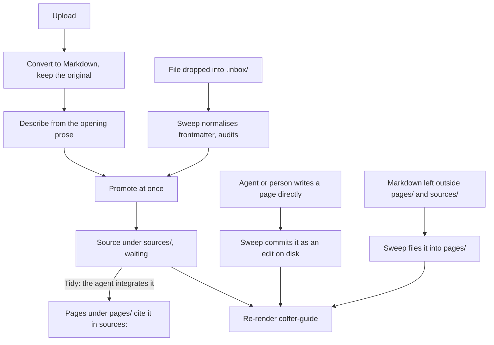
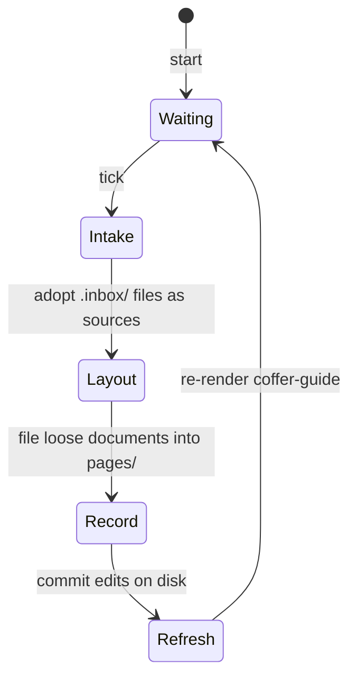

# 知识 {#knowledge}

这一页讲 Coffer 的知识层是怎么搭的：为什么它是不带索引的纯文件，为什么一个知识集是由保留下来的来源编译而成的页面 wiki，新素材如何立即变成来源，页面如何链接以及 Coffer 如何检查它们，智能体如何按 `coffer-guide` 技能教的规则写入、整合、整理和检查，每一次写入如何保存为 git 能显示、智能体能找回的版本，目录如何通过这个技能到达智能体，以及它如何与保险库同步共存。它面向想了解机制和背后理由的工程师。日常使用见 [知识指南](/zh/guides/knowledge)。

## 问题 {#the-problem}

知识是开发者对自己工作环境的了解：哪个团队负责某个服务、某个仓库的约定、某个坑以及怎么绕开它。好几个智能体需要读它，人和智能体都需要往里加东西。有四种失败模式塑造了这个设计：

- **副本会分叉。** 如果每个智能体各记各的笔记，一个智能体上午学到的东西，另一个下午就看不到。
- **检索工具没人用。** 需要智能体记得去调用的工具，算不上检索。有一次对 448 个 Claude Code 会话做了审计，当时语料已经建在一组知识工具和一个投递的技能后面，结果发现那个技能从没被加载过，也没有任何知识工具被调用过。而 Coffer 支持的每个智能体本来就有 `Read` 和 `Grep`，并且一直在用。
- **手工维护的链接会腐烂。** 同一份语料里，398 个内部文件引用中有 343 个是死链，每一个都是写进正文的文件名，被后来的一次改名弄坏了。
- **自由格式的文档不会累积。** 当每次上传都只是多出来的一篇独立文档、原始文件在转换时被丢弃、文档之间又不许互相提及时，知识集长成的是一堆载体，而不是一个个主题：没有任何东西记录哪些上传已经并进去了，没有任何东西能把一句话追溯到它的出处，智能体只能靠 grep 关键词去找相关材料。

知识也不同于 [记忆](/zh/architecture/memory)。知识关于外部世界，因为有人把它放进来才出现。它按知识集组织，通过技能来拉取。记忆关于用户和用户的项目，它自己累积，从智能体的原生记忆聚合而来。

## 设计决策 {#design-decisions}

| 决策 | 理由 |
| --- | --- |
| 一个知识集是 `~/.coffer/vault/knowledge/<collection>/` 下的一棵 Markdown 文件目录树。 | 每个智能体读的是同样的字节，所以不会有副本分叉。一个人在自己编辑器里的修改，下一次读取就生效。 |
| 每个知识集是一个 wiki：一个作为纲要的 `README.md`、保留下来的 `sources/` 和被编辑的 `pages/`。 | 这是 LLM Wiki 模式：素材按到达时的样子保留，智能体把它编译成一个个会累积的主题页面。见 [Knowledge Is a Wiki of Pages Compiled From Kept Sources](https://github.com/wyx-sg/Coffer/blob/main/docs/decisions/knowledge-is-a-wiki-of-pages-compiled-from-kept-sources.md)。 |
| 不要任何索引：没有表、没有 FTS、没有向量、没有缓存。链接图和检查在每次读取时从文件重建。 | 没有派生物，就不会有东西和文件不一致。没什么需要重建或调和。 |
| 文件的路径就是它所在的位置；页面或来源的 slug（它的文件名）是链接用的名字。 | 可读的 slug 就是人在文件管理器里看到的、智能体在 grep 结果里看到的东西，而且它不受整理时文件夹移动的影响。 |
| 元数据放在 YAML frontmatter 里。 | 只有文件本身是每个写入者（人、智能体和 Coffer）都看得到的。 |
| 上传会把原始文件保留在转换出的 Markdown 旁边。来源从不编辑。 | 页面里的一句话可以追溯到实际上传的东西，一次糟糕的转换也能对着原始文件看出来。 |
| 素材立即变成来源。上传一到就保留下来，放进隐藏 `.inbox/` 的文件由下一次扫描保留。 | 没有任何东西要等模型连接或某一轮。提交的东西一分钟之内每个智能体都读得到。 |
| 哪些来源在等待，由页面的 `sources:` 列表推导出来。 | 一份记录已摄入内容的清单，会是第二份可能与页面不一致的记录。 |
| 页面用 `[[slug]]` 链接，从不用路径，Coffer 在读取时解析每个链接。 | 语料重组时路径会变；slug 只随改名而变，而改名弄坏的链接会立刻被报告出来，而不是悄悄腐烂。 |
| Coffer 在每次读取时算出机械的发现，一个都不修。判断交给智能体的**检查**，它只报告，什么都不改。 | 失效链接和缺失的 frontmatter 是遍历一次就能找到的事实；矛盾和过时是判断。曾经观察到彼此独立、无人值守的维护轮次会互相抵消。 |
| Coffer 不在知识上运行任何模型。一条事实该放在哪里、哪些页面回答的是同一个问题、哪句话已经过时，由智能体按 `coffer-guide` 技能教的规则来判断。 | 人本来就在用的智能体有文件工具、更强的模型，还有人在看着。Coffer 自己另带一个无人值守的模型，需要它自己的连接，没配置时它的活就没人做。 |
| 只有人按下**整理**或**交给智能体检查**时，才开始整理或检查。Coffer 不会自己启动智能体运行。 | 无人值守的智能体运行会在人不知情时消耗他的额度，还会留下没人开过的对话。 |
| Coffer 只为维持结构而移动文件。 | 留在 `pages/` 和 `sources/` 之外的 Markdown 文档是放错了位置的页面；把它归位是机械的事，一次提交，不改写内容。 |
| 每一次被接受的写入都是一次写明写入者的 git 提交。 | 智能体改写的是唯一的那份副本。有了谁改了什么的历史，每次改动都可查看，每个版本都只隔着一次 `git` 或一次交给智能体的操作，而它也就是知识集的改动记录。 |
| 新的说法胜出，除非旧的说法被证明是对的。没有哪个写入者可以例外。 | 一句话可信与否，看它是什么时候说的、背后有什么证据，而不是谁写的：人的修改和智能体的修改都可能过时或出错。保险库的历史和从历史抽屉做的恢复是补救途径。 |
| 没有检索工具，目录搭在 Coffer 自己的技能里。 | 智能体用它们已经在用的工具读文件。知识层的任务是把正确的绝对路径摆到模型面前。 |
| 智能体用自己的文件工具直接写知识集的页面来添加知识。没有面向智能体的工具：Coffer 唯一始终列出的内置 MCP 工具是 `coffer__search_tools`。 | 智能体本来就会写文件。指南告诉它们写在哪里，扫描负责提交它们改的东西。 |
| 知识集没有闸门：没有按智能体的生效范围，也没有启用开关。每个知识集都提供给每个智能体。 | 技能把整个知识根目录交给了每个智能体。按智能体过滤或关掉某个知识集，只会缩短一张列表，而根目录照样暴露。 |

## 知识集目录树 {#the-collection-tree}

```text
~/.coffer/vault/knowledge/             # inside the vault repository
├── payments/                        # one collection = one knowledge Resource
│   ├── README.md                    # the schema; first paragraph is the description
│   ├── sources/
│   │   ├── q3-review.md             # a source: converted Markdown + frontmatter
│   │   ├── q3-review.pdf            # its original, named in `original:`
│   │   └── oncall-notes.md          # a Markdown upload is its own source
│   ├── pages/
│   │   ├── session-ownership.md     # a page
│   │   └── infra/
│   │       └── cache.md             # nesting is allowed and means nothing
│   └── .inbox/                      # drop zone, adopted into sources/ by the sweep (hidden)
│       └── rate-limit-change.md
└── personal/
    └── ...
```

- **知识集** 是一个顶层目录，也是一个 `knowledge` 类型的资源，存为 `vault/resources/knowledge/<name>.json`。由人有意地在 Web 界面里创建它。读取、写入、智能体放到别处的文件和工作目录都不会自动创建知识集，也没有任何东西会从智能体的 cwd 推导出边界。知识层在任何地方都没有加表。
- **README** 位于知识集根目录，是这个知识集的纲要。它的第一段就是这个知识集的描述。每次列出时都从磁盘读取，从不复制进资源文件，因为一旦有人编辑了 README，副本就错了。它关于页面类型和约定的内容优先于指南的默认规则，指南也是这样告诉智能体的。README 从不作为页面或来源列出，也不计数。知识集没有自己的标题：每个界面都用文件夹名展示它，资源更新也会拒绝标题。在 Web 界面里编辑描述只改写第一段，README 其余部分保持不动，作为一次写明用户的提交；之后会重新渲染指南技能，因为智能体正是靠描述来认出这个知识集的。
- **文件是什么** 由它所在的位置决定。路径模块的 `kind_of` 对 `pages/` 下的 Markdown 文件返回 `page`，对 `sources/` 下的返回 `source`，其他一律返回 `file`，这类文件会被列出，但既不进目录，也不参与检查。
- `pages/` 和 `sources/` 里的**嵌套** 由归档页面的一方决定，可能是人，也可能是智能体。Coffer 不赋予这些文件夹任何含义；只有 `pages/` 和 `sources/` 这两个目录本身有含义。
- **隐藏条目**（以点开头）不计入任何计数，也不进目录和检查，没有任何界面会列出或读取它们。在知识集内部，Coffer 会读的是 `.inbox/`，它是一个投放区：留在那里的 Markdown 文件会被下一次扫描接收为来源。保险库仓库的 `.git/info/exclude` 忽略知识集里其他所有隐藏条目，所以它们既不会被提交，也不会被同步。`.history/` 和 `.raw/` 并不存在：被替换的文字在 git 历史里，上传的原始文件是 `sources/` 里一个看得见的文件。

### 路径与 slug {#path-and-slug}

文件名是由标题派生的 slug。slug 经过 NFKC 规范化并转为小写。CJK 字符保留，因为音译出来的名字谁都认不出。长度上限 80 个字符。重名时追加 `-2`、`-3`，以此类推：

```text
payments/pages/session-ownership.md
payments/pages/session-ownership-2.md
```

文件的路径就是它的身份；frontmatter 里没有 `id` 键，也没有任何东西把 id 映射到路径。页面或来源的 **slug** 是它去掉 `.md` 的文件名，链接用的就是这个名字（见[链接与检查](#links-and-the-check)）。两个位于不同文件夹的页面共用一个 slug，是一条发现，不是 Coffer 来解决的事。

### Frontmatter {#frontmatter}

页面：

```yaml
---
title: Session ownership
type: concept
description: Which team owns the session service and how to reach them.
sources: [q3-review, oncall-notes]
aliases: [sessions]
actor: agent
created_at: '2026-09-20T08:14:03.512+00:00'
updated_at: '2026-09-22T10:02:41.107+00:00'
reviewed_by: alice          # a key a person added; always preserved
---
```

来源：

```yaml
---
title: Q3 review
description: The quarterly review of the payments gateway.
actor: user
created_at: '2026-10-01T09:00:00.000+00:00'
updated_at: '2026-10-01T09:00:00.000+00:00'
original: q3-review.pdf
---
```

Coffer 按固定顺序写来源的键：`title`、`description`、`actor`（`agent` 或 `user`）、`created_at`、`updated_at`，保留了原始文件时还有 `original`（旁边那个文件的裸文件名）。智能体唯一可以加到来源上的键是 `ingest: skipped`。Coffer 不写页面：页面的 `title`、`type`、`description`、`sources`（来源的 slug）、`aliases`、`actor` 和时间戳，由写页面的一方按指南所教来写。默认的页面类型是 `concept`、`entity`、`how-to`、`decision` 和 `overview`；Coffer 接受任何非空字符串，所以定义了自己类型的 README 说了算。人加的任何其他键，在 Coffer 改写文件时都会保留，解析出的值不变。这一点很重要，因为丢掉一个不认识的键，就等于悄悄删掉了人写的 `tags:`。

frontmatter 的解析会降级而不是抛错：没有围栏的文件，或者围栏里的 YAML 格式不对的文件，会得到空的 frontmatter 和它的正文，所以一个手工编辑时多了个冒号的文件，不会弄坏整个知识集的遍历。

### 所有路径由一个模块负责 {#one-module-owns-every-path}

知识基础设施里有一个模块（`infrastructure/knowledge/paths.py`）负责构建所有路径，并命名 `pages/` 和 `sources/`，别处都不构建路径。每一段都要经过一个守卫，它拒绝空段、全是点的段、以点开头的段以及不在白名单里的段，所以 `payments/.inbox/x.md` 从任何界面都无法寻址。解析后的路径还会在它最近的已存在祖先上与知识根目录比对，所以根目录里的一个符号链接目录没法把写入带到外面去。写入先写到一个用 `O_EXCL | O_NOFOLLOW` 打开的同级临时文件，再做一次原子重命名，并通过保险库唯一的写入者提交。根目录永远是 `~/.coffer/vault/knowledge`，不能覆盖。

## 从素材到来源 {#from-material-to-source}

Coffer 提供的每个入口都以一个来源结束。没有哪个需要等。页面由人和智能体来写，不由 Coffer 写。

| 入口 | 界面 | 结果 |
| --- | --- | --- |
| 上传，先转换为 Markdown | 知识页面、`coffer knowledge upload` | 一个来源，连同原始文件 |
| 放进 `<collection>/.inbox/` 的 Markdown 文件 | Coffer 之外的智能体、另一台机器，或旧版指南；由扫描接收 | 一个来源 |
| 直接写进 `pages/` 的页面 | 智能体自己的文件工具，或人的编辑器 | 一个页面，作为在磁盘上编辑提交 |

没有任何入口会在指定路径创建页面，Web 界面里也没有手工输入页面的表单：人在自己的编辑器里写，或者上传。Web 界面只读地显示每个文件，并在编辑器里打开它。



### 提交 {#submission}

上传会先检查知识集是否存在，然后在知识集的 `sources/` 下写一个来源。它的正文就是转换出的文本原样。它的 frontmatter 由文本填充：`title` 取第一个 `# ` 标题（没有就用文件名），`description` 取第一段正文（没有就用标题），`actor` 记提交者。它以标题的 slug 命名，从不覆盖已有来源，因为两次同标题的提交就是两个来源。提交写明提交者，并记录一条 `knowledge_written` 审计事件。之后 Coffer 在守护进程的事件流上以 `knowledge` 事件宣告这个知识集，因为文件的变化并不涉及对知识集那一行的任何写入。

Coffer 从不把任何东西合并进页面。把来源编译进页面，是人按下**整理**时智能体的事（见[整理是智能体的事](#tidying-is-the-agent-s-job)）；在那之前，来源一直等待。

上传的答复会带上新来源的路径。

### 放进收件箱的文件 {#a-file-dropped-into-the-inbox}

文件可能出现在 `<collection>/.inbox/<any-name>.md`：来自 Coffer 之外的智能体、另一台机器上较旧的构建，或旧版指南。扫描会识别出没有任何 Coffer 界面写过的新收件箱文件，对它做**规范化**，然后用提交所用的同一个操作把它提升进 `sources/`：

- `title` 保留原样，没有就用第一个 `# ` 标题，再没有就用文件名的主干。
- `description` 保留原样，没有就用第一段正文，再没有就用标题，和上传用的回退一样。
- `actor` 按所写保留（它是自报的），没有就是 `agent`。
- `created_at` 和 `updated_at` 保留原样，没有就用扫描发现这个文件的时间。
- 写入者设置的其他键全部保留。

每个文件记录一条 `knowledge_written` 审计事件，当 actor 取自文件时会带标记。写在不是知识集的顶层目录里的 Markdown 文件不会被处理，也不会进目录，因为只有人才能创建知识集。收件箱里不是 Markdown 的文件原样留着，记录日志，不会被提升。

### 上传 {#uploads}

上传按顺序经过四个步骤：

1. **限定上传。** 每次调用一个文件，最大 20 MiB，不选文件夹。在花力气转换之前，先拒绝未知的知识集。
2. **转换。** 转换器注册表按扩展名分派。先走透传（Markdown、文本和源码文件），然后是 CSV，其余都交给 MarkItDown。不支持的类型会以 `INGEST_REJECTED` 和 `reason: unsupported_type` 拒绝。转换后没有文本的（比如纯图片 PDF）也会拒绝。两种情况下都不写任何东西：没有来源，没有原始文件，也没有收件箱文件。
3. **描述。** 描述取来源的第一段正文，再没有就取标题。它从不为空。没有任何模型来写它。
4. **提升这份 Markdown**，`actor: user`，存为 `sources/<slug>.md`；除非转换器是透传，否则把上传的字节保留在旁边，存为 `sources/<slug>.<ext>`，名字写在 `original:` 里。重名时 Markdown 和原始文件加上同样的后缀。

透传上传的 Markdown *就是* 原始文件，所以不会存两份。需要转换的格式会在磁盘上占两份空间；20 MiB 的上限不变。

`markitdown` 是延迟导入的。一条 import-linter 契约把它限定在知识转换器和消息渠道的文档提取里。

### 直接编辑 {#direct-edits}

直接写、改、删一个页面，无论是在你的编辑器里还是用智能体自己的文件工具，都是修改知识的完整方式。不需要导入或注册步骤，改动在下一次读取时就生效。扫描会把它作为在磁盘上编辑提交（见[历史](#history)）。通过 Coffer 删除页面或来源是人在 Web 界面里的动作。Coffer 不提供任何能删除东西的工具。

Web 界面不编辑文件：文件的窗格是只读的（预览和源码），带**在编辑器中打开**和**在访达中显示**，所以没有保存路由、没有文件指纹，也没有保存过期的拒绝。Coffer 的路由表里没有任何一条会写页面的文字。

## 链接与检查 {#links-and-the-check}

`infrastructure/knowledge/wiki.py` 把一个知识集的 `pages/` 和 `sources/` 遍历一次，构建出内存里的 `WikiGraph`：每个页面连同解析后的 frontmatter 和出站链接，每个来源连同它是否被跳过以及它的原始文件，以及把名字解析到文件的映射表。什么都不存储；每次读取都重新构建。一个知识集最多几百个文件，一次遍历只需几毫秒。

### 链接 {#links}

链接写作 `[[target]]` 或 `[[target|text]]`，可以出现在页面正文中代码片段和围栏代码块以外的任何地方，所以作为示例写出来的链接不算链接。`target` 会对照每个页面的 slug、每个页面的 `aliases` 和每个来源的 slug 来解析。匹配时忽略大小写和 Unicode 宽度，用的是文件名所用的同一种 NFKC 规范化，并容忍末尾的 `.md` 或开头的文件夹，所以写成路径的链接照样能解析。什么都指不到的 target 是**失效**的；指到不止一个不同文件的是**有歧义**的。页面的 `sources:` 条目只对照来源的 slug 解析；什么都指不到的条目是**缺失的来源**。

读取页面时，会带上每个链接及其解析到的路径（或没有），以及每个来源条目的路径和标题；读取来源时，会带上引用它的页面、它是否在等待，以及它原始文件的路径。树的列表会带上每个文件的种类和来源是否在等待，所以 Web 界面不需要第二次调用就能标出等待中的来源。

### 等待中的来源 {#waiting-sources}

只要没有页面在 `sources:` 里列出某个来源的 slug，而它的 frontmatter 又没有设置 `ingest: skipped`，这个来源就处于**等待**状态。这在每次读取时从页面推导出来；Coffer 不保留任何其他关于哪些已整合的记录。页面引用一个来源，就是整合它的含义。

### 机械检查 {#the-mechanical-check}

Coffer 在每次读取时从这张图算出知识集的发现，一个都不保存，一个都不修：

| 发现 | 规则 |
| --- | --- |
| `dead_link` | 一个什么都解析不到的链接，带页面和 target。 |
| `ambiguous_link` | 一个解析到不止一个文件的链接。 |
| `duplicate_slug` | 两个页面共用一个 slug，或者一个别名指到两个页面。 |
| `missing_source` | 一个指不到任何来源的 `sources:` 条目。 |
| `incomplete_page` | 缺少 `title`、`type` 或 `description` 的页面。 |
| `unsourced_page` | 没有 `sources:` 的页面。 |
| `orphan_page` | 知识集有两个或更多页面时，没有任何其他页面链接到的页面。`type` 为 `overview` 的页面除外：overview 是入口。 |
| `waiting_source` | 一个等待中的来源。 |

`GET /api/v1/knowledge/collections/{uid}/check` 返回这些发现和检查交接，`coffer knowledge check` 打印它们。知识集列表带有 `page_count`、`source_count`、`waiting_source_count` 和 `finding_count`，每个知识集遍历一次算出，还带有两个交接。没有任何路由会修复一条发现。

## 整理是智能体的事 {#tidying-is-the-agent-s-job}

把来源编译进页面，把一条事实放到它该在的地方，把回答同一个问题的页面合成一个，把回答好几个问题的页面拆开，纠正错误的内容，这些都是判断。Coffer 一样都不做。人平时用的智能体有文件工具，还有人在看着，所以判断放在它加载的 `coffer-guide` 技能里，由人用一个按钮来启动。见决策[整理知识和记忆是智能体的事](https://github.com/wyx-sg/Coffer/blob/main/docs/decisions/tidying-knowledge-and-memory-is-the-agents-job.md)。

### 指南教了什么 {#what-the-guide-teaches}

知识功能开着时，指南的知识部分描述结构（README 是纲要，它的页面类型和约定优先于指南的默认规则；保留下来的 `sources/` 和被编辑的 `pages/`），并带有四条指示。

**写一个页面。** 智能体学到持久的东西时，用自己的文件工具把这条事实直接写进知识集的页面，遵循七条规则：

1. **找到它的归属。** 读目录，在 `pages/` 里 grep 这个主题。把事实并入拥有它的那个页面里它该在的小节，只有没有页面拥有这个主题时才在 `pages/` 下新建页面。
2. **一个字都不丢。** 整合，不要重新生成。被重写的页面里原有的每条事实都要保留。
3. **按主题组织，不按来源。** 不要出现「今天新增」这样的小节。
4. **新的说法胜出，除非旧的说法被证明是对的**：来源、日期、命令输出或代码，不论谁写的哪一条。被取代的说法仍然看得到，并注明改正的日期。
5. **用 `[[slug]]` 链接页面，从不用路径。** 给页面改名时，更新指向它的链接，或把旧 slug 留在 `aliases` 里。
6. **从不编辑来源**，只能加上 `ingest: skipped`。
7. **给每个页面写 frontmatter**：`title`、`type`、一行说明这个页面回答什么问题的 `description`、它的 `sources`、可能有的 `aliases`，以及 `actor: agent`。人加的键不动。

**整合来源。** 从最早的开始，完整读每个等待中的来源和 README；把它的内容并进拥有相应主题的页面，为没有页面的主题新建页面，把来源的 slug 加进因它而改动的每个页面的 `sources`，并给没有任何值得保留内容的来源标记 `ingest: skipped`。

**整理一个知识集。** 一次一个知识集：先整合它等待中的来源；读 README 和每个页面的标题与描述，再完整读页面；合并回答同一个问题的页面，保留每条事实和每个来源，并把被合并掉的 slug 留在保留下来的页面的 `aliases` 里；拆分回答好几个问题的页面，并把拆出的部分互相链接；修正错误或矛盾之处、Coffer 报告的失效链接，以及没有说明页面回答什么问题的描述；最后报告整合或跳过了哪些来源，以及合并、拆分、修正和删除了什么。

**检查一个知识集。** 什么都不改；读 README、页面，以及在某个说法需要时读它们引用的来源；报告矛盾、过时的说法、被讲了两次的主题、值得单独成页的主题，以及 Coffer 的机械发现和每条该怎么处理。

代码不强制其中任何一条规则。它们是技能里的文字，防范一次糟糕编辑的是历史和机械检查，而不是写入时的拒绝。

### 「整理」交接 {#the-tidy-hand-off}

提示词由守护进程写，用的是其他所有交接都用的同一个交接模块（`application/knowledge/tidy_handoff.py`，由 `domain/handoff` 渲染）。读取一个知识集会带上 `tidy_handoff`，它写明知识集名、绝对路径、页面数和待整理来源数，并告诉智能体先按指南的「整合来源」一节整合等待中的来源，再遵循「整理一个知识集」。`GET /api/v1/knowledge/tidy-handoff` 为所有知识集一次返回同类提示词：它写明知识根目录以及每个知识集的路径和数量，并请智能体按同样两节一个一个地处理。

Web 界面在知识集页面上提供**整理**，在知识页面页头提供**整理全部**。按下任何一个，都会在首选终端里启动默认的交接智能体，把这份提示词作为它的第一条消息，走的是与其他所有交接相同的路径。没有可用的托管智能体时，按钮只提供**复制提示词**。人按下的是一个以这件事命名的按钮，提示词只编辑 Coffer 自己的文件，而且这棵树可以从历史恢复。

### 「检查」交接 {#the-check-hand-off}

读取一个知识集还会带上同一个模块写的 `check_handoff`。它写明知识集名和绝对路径，带上按种类分组的机械发现及其路径（最多 40 行，之后写明还省略了多少条），并告诉智能体遵循「检查一个知识集」，什么都不改：不写、不移动、不删除任何文件。知识集页面在**整理**旁边提供**交给智能体检查**，以同样的方式发送这份提示词。一次检查是给人看的报告，由人决定修什么，然后可以按整理。

### 没有什么会无人值守地整理 {#nothing-tidies-unattended}

整理和检查只在人按下它们，或请自己的智能体去做时才运行。定时启动智能体运行需要防止与 Coffer 自己的 Hook 形成循环，会在人不知情时消耗他的额度，还会留下没人开过的对话。机械的扫描和机械的检查归 Coffer；判断不归。

### 优先级 {#precedence}

有两条规则关乎判断，所以放在指南里，不在代码里：

- **新的说法胜出，除非旧的说法被证明是对的。** 新素材与某个页面矛盾时，页面会被改正，除非来源、日期、命令输出或代码表明较旧的说法才是对的。被取代的说法仍然看得到，并注明改动的日期，例如「（此前记录为 X；2026-09-20 改正）」。
- **没有哪个写入者可以例外。** 人、智能体和一次整理，都按一句话是什么时候说的、背后有什么证据来评判，而不是按谁写的。

保护数据的是机械手段。Coffer 不在页面上保存人的任何文字，所以浏览器里的旧副本不可能回滚智能体的编辑。Coffer 自己做的改写会保留它没设置的每个 frontmatter 键。智能体的每次编辑都是历史里的一个版本，版本可以从文件的历史抽屉恢复。

## 扫描 {#the-sweep}

扫描是守护进程里的一个后台 asyncio 任务。它的形状和保留期 worker 一样，并且不调用任何模型。



每次触发（每分钟一次），worker 恰好做四件事：

1. **接收 `.inbox/` 文件。** 知识集收件箱里每个新的 Markdown 文件都会被规范化，并作为来源保留在 `sources/` 下（见[放进收件箱的文件](#a-file-dropped-into-the-inbox)）。它提升的东西，都会以 `knowledge` 事件宣告。
2. **归置零散文档。** 知识集里位于 `pages/`、`sources/` 和隐藏条目之外、不是根目录 `README.md`、并且 60 秒没被动过的 Markdown 文件，会被移到 `pages/<相同的相对路径>`，重名时加后缀。一个知识集在一次触发中的所有移动是一次由 `daemon` 写入者以 `layout` 操作做的提交，文字从不改写。这一分钟的静默期保证不会把智能体还在写的文件从它手底下挪走。在页面和来源出现之前建的知识集，就是这样在升级后的第一次扫描时归入新结构的；写错位置的智能体也会在一分钟内被纠正。`infrastructure/knowledge/layout.py` 负责找出并移动文件；`application/knowledge/layout.py` 负责提交。
3. **提交磁盘上的编辑。** 自上次提交以来树里变过的任何东西，比如人的编辑器或智能体的文件工具，都会通过保险库写入者提交为在磁盘上编辑，这样历史保持最新，智能体写的东西也不会被算作 Coffer 的。
4. **重新渲染指南技能**，这样手工添加的页面也会被编入目录。渲染出的字节没变就什么都不写。

某一项失败只记日志，从不终止循环；某个移动不了的文件会记日志并跳过。`knowledge` 功能关闭期间，扫描跳过它的各轮，知识集原样留在磁盘上。关闭时取消任务，不等待。

扫描在每台机器上都运行。它只写它提升的东西和它做的移动，而且这些写入和其他写入一样走保险库的普通写入者，所以它不会对[保险库同步](/zh/architecture/vault-sync)的一轮持有任何东西，也不等任何一轮。因为它不改写任何文件的内容，两台机器扫描同一个保险库，也不可能把同一个条目并进两个不同的页面。

## 历史 {#history}

对知识集的每一次被接受的写入，都是一次写明 **写入者** 的 git 提交，这遵循「每次保险库写入都是一次写明写入者的已校验提交」这项决策。因此一个文件的历史就是一串版本，每个版本有写入者、时间和 diff，用 git 读取；任何版本都可以找回。知识集的历史就是它的改动记录；不需要维护一个 `log.md`。

### 写入者 {#writers}

| 写入者 | 涵盖什么 |
| --- | --- |
| `user` | 人的上传、删除或对删除的撤销、知识集描述的修改，以及知识集的创建、改名和移除。 |
| `agent` | 智能体的提交到达即被提升，写明是哪个智能体，比如它放进收件箱的文件。 |
| `daemon` | 扫描把零散文档移进 `pages/`（操作 `layout`）。Web 界面把它显示为 **Coffer**。 |
| `curation` | 早期版本的 Coffer 作为整理轮次做的提交。它在历史里保留这个标签。 |
| `sync` | 保险库同步应用的路径。 |
| `disk` | 在树里发现的其他任何改动：人自己的编辑器、智能体自己的文件工具。 |

在 Coffer 之外做的改动从不算作 Coffer 的。保险库的扫描器会在文件安静下来之后，把人或智能体自己的工具改的东西提交为 **在磁盘上编辑**；每次扫描触发和每次读取改动流之前，它也会这么做。

### 存在哪里 {#where-it-lives}

历史就是保险库仓库本身的历史：知识集位于 `~/.coffer/vault` 的 `knowledge/` 下，所以一个文件的历史就是这个仓库里那个文件的历史，读取方式是 `git -C ~/.coffer/vault log -p -- knowledge/<collection>/<path>`。Coffer 的知识路由为改动流读取它（`GET /api/v1/knowledge/changes`，可以按知识集过滤），知识集页面的**改动记录**列出它，删除的撤销也读它。

知识提交带有保险库的 trailer，外加知识专用的那些（`Coffer-Writer`、`Coffer-Operation`、`Coffer-Actor`、`Coffer-Agent`、`Coffer-Collection`、`Coffer-Item`、`Coffer-Status`、`Coffer-Restored-From`）。git 运行时，用户的全局和系统配置被固定到 `/dev/null`，所以个人的 hook、签名规则或别名都改变不了记录的内容。保险库依赖 git：没有 git 时，守护进程会[等待 git](/zh/architecture/daemon#waiting-for-git)，并把安装交给智能体。

### 撤销删除与较早的版本 {#undoing-a-delete-and-older-versions}

文件的**历史**按钮会在文件旁边打开一个抽屉（地址里带 `?history=1`），列出它的版本，显示选中版本的 diff 并可以恢复它，由 `GET /api/v1/vault/history`、`GET /api/v1/vault/diff` 和 `POST /api/v1/vault/restore` 提供（见[持久化](/zh/architecture/persistence)）。抽屉打开时文件仍然看得见，旧的 `/history` 路径段会重定向到抽屉。恢复是 Coffer 自己的写入：一次由用户写入的新提交，带 `Coffer-Operation: restore` 和 `Coffer-Restored-From: <commit>`，并记为一个 `vault_file_restored` 审计事件。读取历史之后文件又变了，就会被拒绝，返回 `VAULT_FILE_STALE`；之前的历史保持完整。提示消失之后，被删除的文件就没有窗格可以打开抽屉了，但它的版本仍留在保险库的 git 历史里，所以可以用 git 取删除之前的那个版本找回。

删除有它自己的撤销，只在提示里的**撤销**还开着的时候。一次删除（一个文件或整个知识集）本身就是改动流里的一条改动，列出它移除的每个文件。撤销（`POST /knowledge/changes/{version}/restore`）会从删除之前的那次提交读出每个被删的文件，逐字节写回，作为一次写明用户、带 `Coffer-Restored-From` 的新提交。文件回到它的知识集。知识集会先写回它的页面、来源、README 以及仍留在它收件箱里的文件，最后才以原来的名字写一个新的资源文件，所以中途失败不会留下注册行，也不会留下残缺的目录。如果恢复会覆盖东西，就什么都不写：同一路径上已有文件，或同名知识集已存在，都会被拒绝；恢复一条不是删除的改动也会被拒绝。一次恢复会记录一条 `knowledge_edited` 审计事件，写明它撤回的是哪次删除。知识集的注册信息无法从 git 找回，所以**删除知识集**会先询问；删除文件则不用，因为它的文件只隔着一次恢复。

## coffer-guide 技能 {#the-coffer-guide-skill}

目录通过 Coffer 自己的技能 `coffer-guide` 到达智能体。它是一个普通的 `skill` 资源：`~/.coffer/derived/skills/coffer-guide/` 下一个主文件夹，一个来源为 `builtin` 的派生资源文件，并像任何导入的技能一样以同样的目录链接投递到每个智能体里。见 [技能](/zh/guides/skills)。知识层只贡献 **文字**，别的什么都不管。

### 渲染 {#rendering}

渲染器（`application/knowledge/guide_render.py`）是纯函数式的：文本进、文本出，除了它自己包里的资源文件，没有端口，也不访问文件系统。它渲染：

- **frontmatter 里的描述。** 这是唯一始终在模型上下文里的部分。它说出 Coffer 和它的内置工具、各知识集涵盖的主题（每个主题取自该知识集 README 的第一句），以及在知识功能开着时，这个技能教人如何写下、整理和检查知识与记忆，这样被要求整理其中任何一种的智能体都能认出它。上限 1024 个字符，这是各种技能导入方里最严的限制；超出时从尾部整条丢掉主题，而不是截断句子。它通过一个不限宽度的 YAML dumper 输出，所以 README 里含有 `: ` 或 ` #` 也不会弄坏或悄悄截断这个块。
- **正文。** 先是作为包数据发布的手写说明书。它讲内置工具、工具分层契约、两个根目录、Coffer 从不写智能体的记忆，以及没有任何 Coffer 工具会等待审批。知识功能开着时，它还带有结构和[整理是智能体的事](#tidying-is-the-agent-s-job)的四条指示。后面跟着生成的目录：知识根目录，以及每个知识集的 README 路径、按 `type` 分组的页面（没有类型的页面归在「untyped」下，每个页面带相对于知识集的路径、标题和描述）、等待整合的来源及其路径和标题，以及它一共有多少个来源。说明书告诉智能体用自己的工具读文件，页面里没有的确切事实就在 `sources/` 里 grep，并把学到的东西直接写进知识集的页面。

正文只有在模型打开它时才付出成本；描述则常驻在每个会话里。这就是 Coffer 只发一个技能而不是一组技能的原因。一条目录条目大约 40 个 token；实测一份 58 篇文档的目录约 5.2K token。目录的预算是 60,000 个字符：超出时，整个目录去掉所有描述；再超出时，只列出每个知识集的页面、来源和待整理数量以及要搜索的目录。两种情况下它都会说明自己被缩短了。

### 确定性、逐字节一致的输出 {#deterministic-byte-identical-output}

渲染出的 `SKILL.md` 是构建和传入目录的纯函数。绝对家目录、时间戳、构建路径都不会进入其中。知识根目录写作 `~/.coffer/vault/knowledge`。

确定性在本地就有回报。技能类型的内置 seed 步骤把渲染出的文字与主文件夹比较，如果完全一致，就什么都不写、不审计、不重新投递。所以一次没有任何变化的启动或扫描触发不会留下任何痕迹，资源的版本哈希意味着「内容变了」，而不是「时间过去了」。

### 为什么不参与同步 {#why-it-is-withheld-from-sync}

指南依赖本机自己的输入：它的知识根目录和记忆根目录在哪里。两台知识完全相同、但根目录不同的机器会渲染出不同的字节，各自在自己那里都是对的。如果任一方发布了自己的副本，另一方就会覆盖它，在下一次触发时重新渲染并发布回去，结果两台机器每次触发都产生一次提交和一条审计事件，无休无止。所以技能类型把这一个资源归入派生类别：它的资源文件和文件夹都在 `~/.coffer/derived/` 下，在保险库仓库之外，同步在两个方向上都带不走它们。每台机器渲染自己的那份。见 [保险库同步](/zh/architecture/vault-sync)。

### 接合点与触发时机 {#the-join-and-its-triggers}

知识类型和技能类型不能互相导入。渲染器和技能类型的 seed 只在组合根里的一个模块中相遇，两者之间的接缝是一段 Markdown 字符串。刷新用一把锁把并发调用串行化，并且从不抛出异常：渲染或写入失败时，之前的主文件夹保持不动。它在这些时候运行：

- 启动时，在技能偏移自愈之后、后台 worker 启动之前；
- 扫描接收或归置了一个文件，或收到一次提交之后；
- 创建或删除知识集时；
- 每次扫描触发时，这样有人手工添加的页面也会被编入目录。

## 为什么没有检索工具，也没有 embedding {#why-no-retrieval-tool-and-no-embeddings}

知识层不暴露任何工具。Coffer 唯一始终列出的内置 MCP 工具是 `coffer__search_tools`，它用来找上游工具；知识没有 `list`、`grep`、`read`、`search`、`write` 或 `delete` 工具。会话审计显示这类工具从没被调用过，而 `Read`、`Grep`、`Edit` 和 `Write` 整天都在用。所以读就是读文件，写就是写文件，力气花在告诉智能体什么上：技能描述里带可匹配的主题，正文里带绝对路径以及写下、整合、整理和检查的规则。网关的 `initialize` 说明会点出内置工具并指向这个技能，但不带目录。

Coffer 不做任何 embedding。它没有向量存储、没有 embedding 模型，也没有 FTS 索引。一条 import-linter 契约在整个仓库范围内禁止 `llama_index`、`mem0`、`chromadb`、`sentence_transformers`、`sqlite_vec` 和 `fastembed`。这些库每一个都想拥有一个派生存储，而派生存储会和文件分叉。知识图谱存储（GraphRAG 一类）出于同样的理由被否决：纯 Markdown 里带类型的 `[[链接]]` 就能拿到大部分关联上的好处，而不需要一个人打不开的数据库。这个设计依靠模型读目录，只要目录放得进上下文就行得通：可以到几百个页面，超出之后由上面的预算把它缩短。字面匹配只是占位，并不是对语义检索下的结论。语义检索以后只可能作为一个可丢弃的旁路回来，文件仍是唯一的事实来源。

## 权衡 {#trade-offs}

- **智能体改写页面，Coffer 在它们动手前不做任何审查。** 保障措施就是任何文件编辑都有的那些，再加上检查：每次改动都是写明写入者的一个版本，任何文件都可以从它的历史抽屉或通过 git 回到任何版本，机械检查会立刻报告坏掉的链接或缺少来源的页面，一次整理以智能体自己报告它整合、合并、拆分、修正和删除了什么作结。出了错的整理，靠恢复到整理之前的版本来修复。
- **在有人整理之前，来源会一直等待。** 上传或放进来的文件会一直作为来源留着，直到智能体整合它。人看得到待整理的数量，也看得到**整理**按钮，没有任何东西会在人背后编译页面。
- **编译要花智能体的 token。** 与直接从原始来源检索相比，一次摄入的成本很高，所以指南保留了在 `sources/` 里 grep 作为查找确切事实的退路。
- **需要转换的格式，上传会在磁盘上占两份空间**：原始文件和 Markdown。
- **扫描会移动文件。** 归置零散文档会改变它的路径。链接用的是 slug 而不是路径，目录也会重新生成，所以除了人的记忆，没有任何东西指向旧路径；这次移动是一次提交，可以恢复。
- **历史随每次写入增长。** 没有任何东西会修剪它。它就在文件旁边，保存着后来被并掉或被删掉的文字。
- **用户内容只会经由人选定的智能体离开本机。** Coffer 不把任何知识发给任何模型。整理和检查会把它发给智能体自己的提供商，和每个对话一样。
- **这里的一切都不是访问控制。** 有 shell 工具的智能体可以读知识根目录下的任何文件。每个知识集都会告诉每个智能体；不让智能体看到某个知识集的唯一办法是删除它。
- **智能体自己的文件工具不留读取遥测。** Coffer 既看不到智能体用自己工具做的读取，也看不到写入。智能体自己的对话记录是事后衡量读取的依据，保险库历史则指明磁盘上变了什么。
- **归档条目的 actor 是自报的。** 扫描保留智能体写下的 `actor`；没有任何东西验证它。页面上的 frontmatter 只是建议性的：没有来源的页面是一条发现，不是错误。

## 在代码里的位置 {#where-it-lives-in-the-code}

| 包 | 职责 |
| --- | --- |
| `application/knowledge/` | 知识集、提交并提升进 `sources/`、规范化放进来的收件箱文件、上传、扫描及其归置职责（`layout.py`）、整理和检查提示词（`tidy_handoff.py`）、改动流、撤销删除，以及 `coffer-guide` 的文字和目录（`guide_render.py`） |
| `infrastructure/knowledge/` | 路径、路径守卫以及文件属于哪一种、文件读写、frontmatter、命名、目录、wiki 图、链接和发现（`wiki.py`）、找出并移动零散文档（`layout.py`）、历史仓库、转换器 |
| `domain/handoff` | 每个交接提示词（包括整理和检查）渲染的唯一位置 |
| `surfaces/http/` | 扫描的装配和启动；渲染器到技能 seed 的接合；Web 界面的知识路由、检查路由和历史交接 |

所有路径都在 `backend/coffer/` 下。

## 相关 {#related}

- 规格：[knowledge](https://github.com/wyx-sg/Coffer/blob/main/openspec/specs/knowledge/spec.md)、[knowledge 数据模型](https://github.com/wyx-sg/Coffer/blob/main/openspec/specs/knowledge/data-model.md)、[skill-manager](https://github.com/wyx-sg/Coffer/blob/main/openspec/specs/skill-manager/spec.md)
- 决策：[Knowledge Is a Wiki of Pages Compiled From Kept Sources](https://github.com/wyx-sg/Coffer/blob/main/docs/decisions/knowledge-is-a-wiki-of-pages-compiled-from-kept-sources.md)、[Knowledge Is a Directory of Markdown Files, Not an Index](https://github.com/wyx-sg/Coffer/blob/main/docs/decisions/knowledge-is-plain-files.md)、[Tidying Knowledge and Memory Is the Agent's Job](https://github.com/wyx-sg/Coffer/blob/main/docs/decisions/tidying-knowledge-and-memory-is-the-agents-job.md)、[Every Vault Write Is One Validated, Compare-and-Swap Commit That Names Its Writer](https://github.com/wyx-sg/Coffer/blob/main/docs/decisions/every-vault-write-is-a-validated-commit-naming-its-writer.md)、[Coffer Ships Its Own Skill](https://github.com/wyx-sg/Coffer/blob/main/docs/decisions/coffer-ships-its-own-skill.md)、[原则 → 治理](/zh/architecture/principles#governance)
- 研究：[Knowledge structures](https://github.com/wyx-sg/Coffer/blob/main/docs/research/knowledge-structures.md)
- 页面：[知识指南](/zh/guides/knowledge)、[记忆](/zh/architecture/memory)、[保险库同步](/zh/architecture/vault-sync)、[MCP 网关](/zh/architecture/mcp-gateway)、[资源框架](/zh/architecture/resource-framework)、[MCP 工具参考](/zh/reference/mcp-tools)、[`coffer knowledge`](/zh/reference/cli/knowledge)
