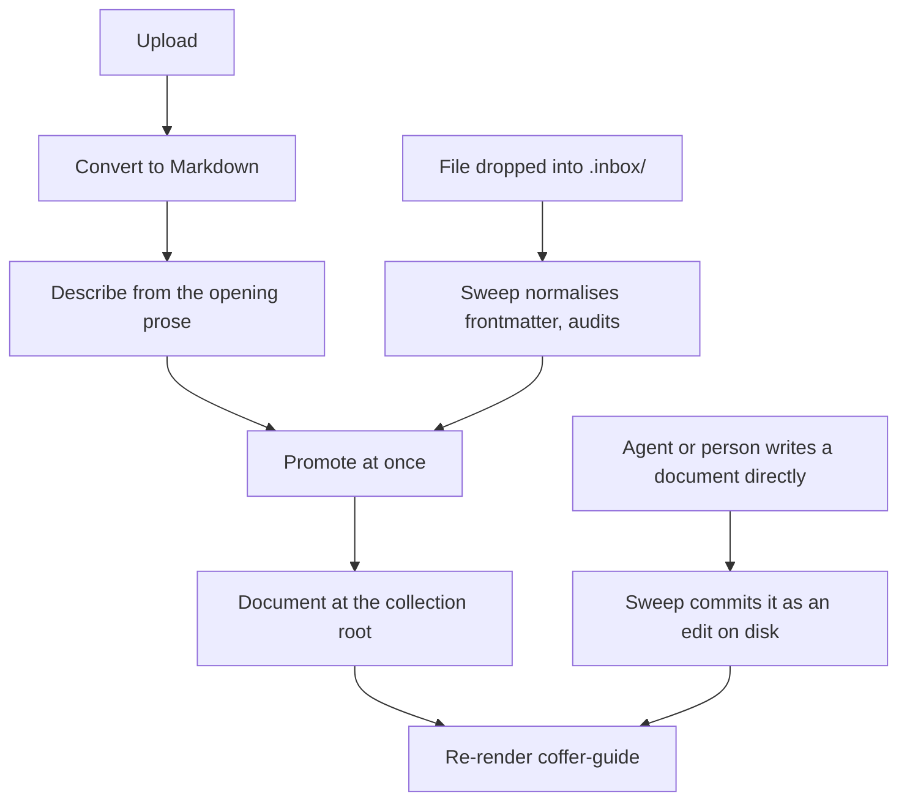
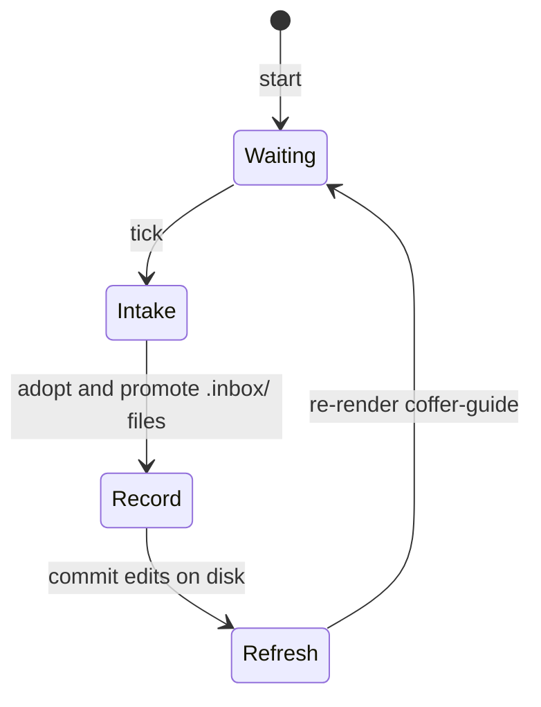

# 知识 {#knowledge}

这一页讲 Coffer 的知识层是怎么搭的：为什么它是不带索引的纯文件，新素材如何立即变成文档，智能体如何按 `coffer-guide` 技能教的规则写入和整理这些文档，每一次写入如何保存为可以恢复的版本，目录如何通过这个技能到达智能体，以及它如何与保险库同步共存。它面向想了解机制和背后理由的工程师。日常使用见 [知识指南](/zh/guides/knowledge)。

## 问题 {#the-problem}

知识是开发者对自己工作环境的了解：哪个团队负责某个服务、某个仓库的约定、某个坑以及怎么绕开它。好几个智能体需要读它，人和智能体都需要往里加东西。有三种失败模式塑造了这个设计：

- **副本会分叉。** 如果每个智能体各记各的笔记，一个智能体上午学到的东西，另一个下午就看不到。
- **检索工具没人用。** 需要智能体记得去调用的工具，算不上检索。有一次对 448 个 Claude Code 会话做了审计，当时语料已经建在一组知识工具和一个投递的技能后面，结果发现那个技能从没被加载过，也没有任何知识工具被调用过。而 Coffer 支持的每个智能体本来就有 `Read` 和 `Grep`，并且一直在用。
- **手工维护的链接会腐烂。** 同一份语料里，398 个内部文件引用中有 343 个是死链，每一个都是写进正文的文件名，被后来的一次改名弄坏了。

知识也不同于 [记忆](/zh/architecture/memory)。知识关于外部世界，因为有人把它放进来才出现。它按知识集组织，通过技能来拉取。记忆关于用户和用户的项目，它自己累积，从智能体的原生记忆聚合而来。

## 设计决策 {#design-decisions}

| 决策 | 理由 |
| --- | --- |
| 一个知识集是 `~/.coffer/vault/knowledge/<collection>/` 下的一棵 Markdown 文件目录树。 | 每个智能体读的是同样的字节，所以不会有副本分叉。一个人在自己编辑器里的修改，下一次读取就生效。 |
| 不要任何索引：没有表、没有 FTS、没有向量、没有缓存。 | 没有派生物，就不会有东西和文件不一致。没什么需要重建或调和。 |
| 文件路径就是它的身份。 | 可读的 slug 就是人在文件管理器里看到的、智能体在 grep 结果里看到的东西。 |
| 元数据放在 YAML frontmatter 里。 | 只有文件本身是每个写入者（人、智能体和 Coffer）都看得到的。 |
| 素材立即提升为文档。上传一到就成为文档，放进隐藏 `.inbox/` 的文件由下一次扫描接收。 | 没有任何东西要等模型连接或某一轮。提交的东西一分钟之内每个智能体都读得到。 |
| Coffer 不在知识上运行任何模型。一条事实该放在哪里、哪些文档回答的是同一个问题、哪句话已经过时，由智能体按 `coffer-guide` 技能教的规则来判断。 | 人本来就在用的智能体有文件工具、更强的模型，还有人在看着。Coffer 自己另带一个无人值守的模型，需要它自己的连接，没配置时它的活就没人做。 |
| 只有人按下**整理**时才开始整理。Coffer 不会自己启动智能体运行。 | 无人值守的智能体运行会在人不知情时消耗他的额度，还会留下没人开过的对话。 |
| 每一次被接受的写入都是一次写明写入者的 git 提交。 | 智能体改写的是唯一的那份副本。有了谁改了什么的历史，每次改动都可查看，每个版本都可恢复。 |
| 新的说法胜出，除非旧的说法被证明是对的。没有哪个写入者可以例外。 | 一句话可信与否，看它是什么时候说的、背后有什么证据，而不是谁写的：人的修改和智能体的修改都可能过时或出错。历史和恢复是补救途径。 |
| 任何文档都不能提到另一个知识文件。指南把它作为一条写作规则来教。 | 语料重组时路径会变。目录负责把主题解析成路径，而目录是生成出来的。 |
| 没有检索工具，目录搭在 Coffer 自己的技能里。 | 智能体用它们已经在用的工具读文件。知识层的任务是把正确的绝对路径摆到模型面前。 |
| 智能体用自己的文件工具直接写进知识集的文档来添加知识。没有面向智能体的工具：Coffer 唯一的内置 MCP 工具是 `coffer__search_tools`。 | 智能体本来就会写文件。指南告诉它们写在哪里，扫描负责提交它们改的东西。 |
| 知识集没有闸门：没有按智能体的生效范围，也没有启用开关。每个知识集都提供给每个智能体。 | 技能把整个知识根目录交给了每个智能体。按智能体过滤或关掉某个知识集，只会缩短一张列表，而根目录照样暴露。 |

## 知识集目录树 {#the-collection-tree}

```text
~/.coffer/vault/knowledge/          # inside the vault repository
├── payments/                     # one collection = one knowledge Resource
│   ├── README.md                 # the collection's own description
│   ├── session-ownership.md      # a document
│   ├── infra/
│   │   └── cache.md              # nesting is allowed and means nothing
│   └── .inbox/                   # drop zone, adopted by the sweep (hidden)
│       └── rate-limit-change.md
└── personal/
    └── ...
```

- **知识集** 是一个顶层目录，也是一个 `knowledge` 类型的资源，存为 `vault/resources/knowledge/<name>.json`。由人有意地在 Web 界面里创建它。读取、写入、智能体放到别处的文件和工作目录都不会自动创建知识集，也没有任何东西会从智能体的 cwd 推导出边界。知识层在任何地方都没有加表。
- **README** 位于知识集根目录，它的第一段就是这个知识集的描述。每次列出时都从磁盘读取，从不复制进资源文件，因为一旦有人编辑了 README，副本就错了。README 从不作为文档列出或计数。知识集没有自己的标题：每个界面都用文件夹名展示它，资源更新也会拒绝标题。在 Web 界面里编辑描述只改写第一段，README 其余部分保持不动，作为一次写明用户的提交；之后会重新渲染指南技能，因为智能体正是靠描述来认出这个知识集的。
- **嵌套** 由归档文档的一方决定，可能是人，也可能是智能体。Coffer 不赋予文件夹任何含义。
- **隐藏条目**（以点开头）不计入任何文档计数，也不进目录，没有任何界面会列出或读取它们。在知识集内部，Coffer 会读的是 `.inbox/`，它是一个投放区：留在那里的 Markdown 文件会被下一次扫描接收并提升。保险库仓库的 `.git/info/exclude` 忽略知识集里其他所有隐藏条目，所以它们既不会被提交，也不会被同步。

### 路径即身份 {#path-as-identity}

文件名是由标题派生的 slug。slug 经过 NFKC 规范化并转为小写。CJK 字符保留，因为音译出来的名字谁都认不出。长度上限 80 个字符。重名时追加 `-2`、`-3`，以此类推：

```text
payments/session-ownership.md
payments/session-ownership-2.md
```

frontmatter 里没有 `id` 键，也没有任何东西把 id 映射到路径。

### Frontmatter {#frontmatter}

```yaml
---
title: Session ownership
description: Which team owns the session service and how to reach them.
actor: user
created_at: '2026-09-20T08:14:03.512+00:00'
updated_at: '2026-09-22T10:02:41.107+00:00'
reviewed_by: alice          # a key a person added; always preserved
---
```

Coffer 按固定顺序写五个键：`title`、`description`、`actor`（`agent` 或 `user`）、`created_at` 和 `updated_at`。人加的任何其他键，在 Coffer 改写文件时都会保留，解析出的值不变。这一点很重要，因为智能体和 Coffer 自己的保存都会改写文档，丢掉一个不认识的键，就等于悄悄删掉了人写的 `tags:`。

### 所有路径由一个模块负责 {#one-module-owns-every-path}

知识基础设施里有一个模块负责构建所有路径，别处都不构建路径。每一段都要经过一个守卫，它拒绝空段、全是点的段、以点开头的段以及不在白名单里的段，所以 `payments/.inbox/x.md` 从任何界面都无法寻址。解析后的路径还会在它最近的已存在祖先上与知识根目录比对，所以根目录里的一个符号链接目录没法把写入带到外面去。写入先写到一个用 `O_EXCL | O_NOFOLLOW` 打开的同级临时文件，再做一次原子重命名，并通过保险库唯一的写入者提交。根目录永远是 `~/.coffer/vault/knowledge`，不能覆盖。

## 从素材到文档 {#from-material-to-document}

每个入口都以一篇文档结束。没有哪个需要等。

| 入口 | 界面 |
| --- | --- |
| 上传，先转换为 Markdown | 知识页面 |
| 直接写进知识集的文档 | 智能体自己的文件工具，或人的编辑器 |
| 放进 `<collection>/.inbox/` 的 Markdown 文件 | Coffer 之外的智能体、另一台机器，或旧版指南；由扫描接收 |

没有任何入口会在指定路径创建文档，Web 界面里也没有手工输入文档的表单：人通过编辑器写（保存已有文档的正文），或者上传。



### 提交 {#submission}

上传会先检查知识集是否存在，然后在知识集根目录写一篇文档。文档正文就是提交的文本原样。它的 frontmatter 由文本填充：`title` 取第一个 `# ` 标题（没有就用文件名），`description` 取第一段正文（没有就用标题），`actor` 记提交者。它以标题的 slug 命名，从不覆盖已有文档，因为两次同标题的提交就是两篇文档。提交写明提交者，并记录一条 `knowledge_written` 审计事件。之后 Coffer 在守护进程的事件流上以 `knowledge` 事件宣告这个知识集，因为文档的变化并不涉及对知识集那一行的任何写入。

Coffer 从不把任何东西合并进另一篇文档。一条事实在现有文档里该放在哪里，是整理的事，由智能体来做（见[整理是智能体的事](#tidying-is-the-agent-s-job)）。提升后的文档保持它到达时的样子。

上传的答复会带上新文档的路径。

### 放进收件箱的文件 {#a-file-dropped-into-the-inbox}

遵循指南的智能体会直接写进知识集的文档。文件仍然可能出现在 `<collection>/.inbox/<any-name>.md`：来自 Coffer 之外的智能体、另一台机器上较旧的构建，或旧版指南。扫描会识别出没有任何 Coffer 界面写过的新收件箱文件，对它做**规范化**，然后用提交所用的同一个操作把它提升：

- `title` 保留原样，没有就用第一个 `# ` 标题，再没有就用文件名的主干。
- `description` 保留原样，没有就用第一段正文，再没有就用标题，和上传用的回退一样。
- `actor` 按所写保留（它是自报的），没有就是 `agent`。
- `created_at` 和 `updated_at` 保留原样，没有就用扫描发现这个文件的时间。
- 写入者设置的其他键全部保留。

每个文件记录一条 `knowledge_written` 审计事件，当 actor 取自文件时会带标记。写在不是知识集的顶层目录里的 Markdown 文件不会被处理，也不会进目录，因为只有人才能创建知识集。收件箱里不是 Markdown 的文件原样留着，记录日志，不会被提升。

### 上传 {#uploads}

上传按顺序经过四个步骤：

1. **限定上传。** 每次调用一个文件，最大 20 MiB。在花力气转换之前，先拒绝未知的知识集。
2. **转换。** 转换器注册表按扩展名分派。先走透传（Markdown、文本和源码文件），然后是 CSV，其余都交给 MarkItDown。不支持的类型会以 `INGEST_REJECTED` 和 `reason: unsupported_type` 拒绝。转换后没有文本的（比如纯图片 PDF）也会拒绝。两种情况下都不写任何东西。
3. **描述。** 描述取文档的第一段正文，再没有就取标题。它从不为空，因为目录里给智能体看的就是它。没有任何模型来写它。
4. **提升这份 Markdown**，`actor: user`。

原始字节和提取出的文本都不会单独保存成文件放在文档旁边。代价是一次糟糕的转换没法从 Coffer 保存的副本重做。你得用自己手里的副本重新上传。

`markitdown` 是延迟导入的。一条 import-linter 契约把它限定在知识转换器和消息渠道的文档提取里。

### 直接编辑 {#direct-edits}

直接写、改、删一篇文档，无论是在你的编辑器里还是用智能体自己的文件工具，都是修改知识的完整方式。不需要导入或注册步骤，改动在下一次读取时就生效。扫描会把它作为在磁盘上编辑提交（见[历史](#history)）。通过 Coffer 删除文档是人在 Web 界面里的动作。Coffer 不提供任何能删除东西的工具。

Web 界面也可以就地编辑文档。保存会替换文档的**正文**并保留它的 frontmatter。读取一篇文档会得到文件的指纹，保存时必须带回编辑器加载的那个：如果文件在这之后在磁盘上变了，无论是人自己的编辑器还是智能体改的，保存都会作为冲突被拒绝，文件原样不动。拒绝会带上文档现在在磁盘上的样子，包括正文和指纹，所以编辑器可以提供重新加载、对比和复制我的文本，而无需再次覆盖文件；再次保存人的文本需要新的指纹。每次保存记录一条 `knowledge_edited` 审计事件，并且是一次写明用户的提交（见[历史](#history)）。

## 整理是智能体的事 {#tidying-is-the-agent-s-job}

把一条事实放到它该在的地方，把回答同一个问题的文档合成一篇，把回答好几个问题的文档拆开，纠正错误的内容，这些都是判断。Coffer 一样都不做。人平时用的智能体有文件工具，还有人在看着，所以判断放在它加载的 `coffer-guide` 技能里，由人用一个按钮来启动。见决策[整理知识和记忆是智能体的事](https://github.com/wyx-sg/Coffer/blob/main/docs/decisions/tidying-knowledge-and-memory-is-the-agents-job.md)。

### 指南教了什么 {#what-the-guide-teaches}

知识功能开着时，指南的知识部分带两条指示。

**写下一件事。** 智能体学到持久的东西时，用自己的文件工具把这条事实直接写进知识集的文档，遵循六条规则：

1. **找到它的归属。** 读目录，在知识集里 grep 这个主题。把事实并入拥有它的那篇文档里它该在的小节，只有没有文档拥有这个主题时才新建文件。
2. **一个字都不丢。** 整合，不要重新生成。被重写的文档里原有的每条事实都要保留。
3. **按主题组织，不按来源。** 不要出现「今天新增」这样的小节。
4. **新的说法胜出，除非旧的说法被证明是对的**：来源、日期、命令输出或代码，不论谁写的哪一条。被取代的说法仍然看得到，并注明改正的日期。
5. **不要提到另一个知识文件。** 路径会变；用文字说出主题。
6. **给每篇文档写 frontmatter**：`title`、一行说明这篇文档回答什么问题的 `description`，以及 `actor: agent`。人加的键不动。

**整理一个知识集。** 被要求整理时，智能体一次处理一个知识集：读 README 和每篇文档的标题与描述，再完整读文档；把回答同一个问题的文档合并，把回答好几个问题的拆开，修正错误或矛盾之处，重写没有说明文档回答什么问题的描述；最后报告它合并、拆分、修正和删除了什么。

代码不强制其中任何一条规则。它们是技能里的文字，防范一次糟糕编辑的是历史，而不是写入时的拒绝。

### 「整理」交接 {#the-tidy-hand-off}

提示词由守护进程写，用的是其他所有交接都用的同一个交接模块。读取一个知识集会带上 `tidy_handoff`，它写明知识集名、绝对路径和文档数，并告诉智能体遵循指南的「整理一个知识集」一节。另一条路由为所有知识集一次返回同类提示词：它写明知识根目录以及每个知识集的路径和数量，并请智能体一个一个地整理。

Web 界面在知识集页面上提供**整理**，在知识页面页头提供**整理全部**。按下任何一个，都会在首选终端里启动默认的交接智能体，把这份提示词作为它的第一条消息，走的是与其他所有交接相同的路径。没有可用的托管智能体时，按钮只提供**复制提示词**。人按下的是一个以这件事命名的按钮，提示词只编辑 Coffer 自己的文件，而且这棵树可以从历史恢复。

### 没有什么会无人值守地整理 {#nothing-tidies-unattended}

整理只在人按下它，或请自己的智能体去做时才运行。定时启动智能体运行需要防止与 Coffer 自己的 Hook 形成循环，会在人不知情时消耗他的额度，还会留下没人开过的对话。机械的扫描留在它的定时器上；整理不在。

### 优先级 {#precedence}

有两条规则关乎判断，所以放在指南里，不在代码里：

- **新的说法胜出，除非旧的说法被证明是对的。** 新素材与某篇文档矛盾时，文档会被改正，除非来源、日期、命令输出或代码表明较旧的说法才是对的。被取代的说法仍然看得到，并注明改动的日期，例如「（此前记录为 X；2026-09-20 改正）」。
- **没有哪个写入者可以例外。** 人、智能体和一次整理，都按一句话是什么时候说的、背后有什么证据来评判，而不是按谁写的。

保护数据的是机械手段。Web 界面里的保存如果文件在加载之后变了就会被拒绝，所以智能体的编辑不会被悄悄回滚。Coffer 自己做的改写会保留它没设置的每个 frontmatter 键。智能体的每次编辑都是历史里的一个版本，版本可以恢复。

## 扫描 {#the-sweep}

扫描是守护进程里的一个后台 asyncio 任务。它的形状和保留期 worker 一样，并且不调用任何模型。



每次触发（每分钟一次），worker 恰好做三件事：

1. **接收并提升 `.inbox/` 文件。** 知识集收件箱里每个新的 Markdown 文件都会被规范化，并成为知识集根目录下的一篇文档（见[放进收件箱的文件](#a-file-dropped-into-the-inbox)）。它提升的东西，都会以 `knowledge` 事件宣告。
2. **提交磁盘上的编辑。** 自上次提交以来树里变过的任何东西，比如人的编辑器或智能体的文件工具，都会通过保险库写入者提交为在磁盘上编辑，这样历史保持最新，智能体写的东西也不会被算作 Coffer 的。
3. **重新渲染指南技能**，这样手工添加的文档也会被编入目录。渲染出的字节没变就什么都不写。

某一项失败只记日志，从不终止循环。`knowledge` 功能关闭期间，扫描跳过它的各轮，知识集原样留在磁盘上。关闭时取消任务，不等待。

扫描在每台机器上都运行。它只写它提升的东西，而且这个写入和其他写入一样走保险库的普通写入者，所以它不会对[保险库同步](/zh/architecture/vault-sync)的一轮持有任何东西，也不等任何一轮。因为它不改写任何已有文档，两台机器扫描同一个保险库，也不可能把同一个条目并进两篇不同的文档。

## 历史 {#history}

对知识集的每一次被接受的写入，都是一次写明 **写入者** 的 git 提交，这遵循「每次保险库写入都是一次写明写入者的已校验提交」这项决策。因此一篇文档的历史就是一串版本，每个版本有写入者、时间和 diff；任何改动都可以查看，任何版本都可以恢复。

### 写入者 {#writers}

| 写入者 | 涵盖什么 |
| --- | --- |
| `user` | 人的保存、删除或恢复，以及知识集的创建、改名和移除。 |
| `agent` | 智能体的提交到达即被提升，写明是哪个智能体。 |
| `curation` | 早期版本的 Coffer 作为整理轮次做的提交。它在历史里保留这个标签。 |
| `sync` | 保险库同步应用的路径。 |
| `disk` | 在树里发现的其他任何改动：人自己的编辑器、智能体自己的文件工具。 |

在 Coffer 之外做的改动从不算作 Coffer 的。保险库的扫描器会在文件安静下来之后，把人或智能体自己的工具改的东西提交为 **在磁盘上编辑**；每次扫描触发和每次读取历史之前，它也会这么做。

### 存在哪里 {#where-it-lives}

历史就是保险库仓库本身的历史：知识集位于 `~/.coffer/vault` 的 `knowledge/` 下，所以一篇文档的历史就是这个仓库里那个文件的历史，知识路由就从那里读取它。

知识提交带有保险库的 trailer，外加知识专用的那些（`Coffer-Writer`、`Coffer-Operation`、`Coffer-Actor`、`Coffer-Agent`、`Coffer-Collection`、`Coffer-Item`、`Coffer-Status`、`Coffer-Restored-From`）。git 运行时，用户的全局和系统配置被固定到 `/dev/null`，所以个人的 hook、签名规则或别名都改变不了记录的内容。保险库依赖 git：没有 git 时，守护进程会[等待 git](/zh/architecture/daemon#waiting-for-git)，并把安装交给智能体。

### 读取和恢复一篇文档 {#reading-and-restoring-a-document}

一篇文档的各个版本按从新到旧列出，带写入者和时间，每个版本的 diff 都可以读。恢复某个版本会把那个版本的字节作为一次写明用户的新提交写回去；之前的历史保持完整。被删除的文档也用同样的方式恢复，取删除之前的那个版本。

一次删除（一篇文档或整个知识集）本身就是改动流里的一条改动，列出它移除的每个文件。恢复它会从删除之前的那次提交读出每个被删的文件，逐字节写回，作为一次写明用户、带 `Coffer-Restored-From` 的新提交。文档回到它的知识集。知识集会以原来的名字得到一个新的资源文件，然后是它的文档、README，以及仍留在它收件箱里的文件。如果恢复会覆盖东西，就什么都不写：同一路径上已有文档，或同名知识集已存在，都会被拒绝；恢复一条不是删除的改动也会被拒绝。一次恢复会记录一条 `knowledge_edited` 审计事件，写明它撤回的是哪次删除。

### 最近改动 {#recent-changes}

一条改动流列出跨所有知识集（或某一个）的改动，从新到旧。每条改动带它的写入者、时间、涉及的知识集，以及它碰到的每篇文档是新增、修改还是移除，附行数。一条改动可以完整读取，附每篇文档的 diff。

## coffer-guide 技能 {#the-coffer-guide-skill}

目录通过 Coffer 自己的技能 `coffer-guide` 到达智能体。它是一个普通的 `skill` 资源：`~/.coffer/derived/skills/coffer-guide/` 下一个主文件夹，一个来源为 `builtin` 的派生资源文件，并像任何导入的技能一样以同样的目录链接投递到每个智能体里。见 [技能](/zh/guides/skills)。知识层只贡献 **文字**，别的什么都不管。

### 渲染 {#rendering}

渲染器是纯函数式的：文本进、文本出，除了它自己包里的资源文件，没有端口，也不访问文件系统。它渲染：

- **frontmatter 里的描述。** 这是唯一始终在模型上下文里的部分。它说出 Coffer 和它的内置工具、各知识集涵盖的主题（每个主题取自该知识集 README 的第一句），以及在知识功能开着时，这个技能教人如何写下和整理知识与记忆，这样被要求整理其中任何一种的智能体都能认出它。上限 1024 个字符，这是各种技能导入方里最严的限制；超出时从尾部整条丢掉主题，而不是截断句子。它通过一个不限宽度的 YAML dumper 输出，所以 README 里含有 `: ` 或 ` #` 也不会弄坏或悄悄截断这个块。
- **正文。** 先是作为包数据发布的手写说明书。它讲内置工具、工具分层契约、两个根目录、Coffer 从不写智能体的记忆，以及没有任何 Coffer 工具会等待审批。知识功能开着时，它还带有[整理是智能体的事](#tidying-is-the-agent-s-job)的两条指示：写下一件事，以及整理一个知识集。后面跟着生成的目录：知识根目录，以及每个知识集里每篇文档相对于知识集的路径、标题和描述。说明书告诉智能体用自己的工具读文件，并把学到的东西直接写进知识集的文档。

正文只有在模型打开它时才付出成本；描述则常驻在每个会话里。这就是 Coffer 只发一个技能而不是一组技能的原因。一条目录条目大约 40 个 token；实测一份 58 篇文档的目录约 5.2K token。

### 确定性、逐字节一致的输出 {#deterministic-byte-identical-output}

渲染出的 `SKILL.md` 是构建和传入目录的纯函数。绝对家目录、时间戳、构建路径都不会进入其中。知识根目录写作 `~/.coffer/vault/knowledge`。

确定性在本地就有回报。技能类型的内置 seed 步骤把渲染出的文字与主文件夹比较，如果完全一致，就什么都不写、不审计、不重新投递。所以一次没有任何变化的启动或扫描触发不会留下任何痕迹，资源的版本哈希意味着「内容变了」，而不是「时间过去了」。

### 为什么不参与同步 {#why-it-is-withheld-from-sync}

指南依赖本机自己的输入：它的知识根目录和记忆根目录在哪里。两台知识完全相同、但根目录不同的机器会渲染出不同的字节，各自在自己那里都是对的。如果任一方发布了自己的副本，另一方就会覆盖它，在下一次触发时重新渲染并发布回去，结果两台机器每次触发都产生一次提交和一条审计事件，无休无止。所以技能类型把这一个资源归入派生类别：它的资源文件和文件夹都在 `~/.coffer/derived/` 下，在保险库仓库之外，同步在两个方向上都带不走它们。每台机器渲染自己的那份。见 [保险库同步](/zh/architecture/vault-sync)。

### 接合点与触发时机 {#the-join-and-its-triggers}

知识类型和技能类型不能互相导入。渲染器和技能类型的 seed 只在组合根里的一个模块中相遇，两者之间的接缝是一段 Markdown 字符串。刷新用一把锁把并发调用串行化，并且从不抛出异常：渲染或写入失败时，之前的主文件夹保持不动。它在这些时候运行：

- 启动时，在技能偏移自愈之后、后台 worker 启动之前；
- 扫描提升了一个文件或收到一次提交之后；
- 创建或删除知识集时；
- 每次扫描触发时，这样有人手工添加的文档也会被编入目录。

## 为什么没有检索工具，也没有 embedding {#why-no-retrieval-tool-and-no-embeddings}

知识层不暴露任何工具。Coffer 唯一的内置 MCP 工具是 `coffer__search_tools`，它用来找上游工具；知识没有 `list`、`grep`、`read`、`search`、`write` 或 `delete` 工具。会话审计显示这类工具从没被调用过，而 `Read`、`Grep`、`Edit` 和 `Write` 整天都在用。所以读就是读文件，写就是写文件，力气花在告诉智能体什么上：技能描述里带可匹配的主题，正文里带绝对路径以及写下和整理的规则。网关的 `initialize` 说明会点出内置工具并指向这个技能，但不带目录。

Coffer 不做任何 embedding。它没有向量存储、没有 embedding 模型，也没有 FTS 索引。一条 import-linter 契约在整个仓库范围内禁止 `llama_index`、`mem0`、`chromadb`、`sentence_transformers`、`sqlite_vec` 和 `fastembed`。这些库每一个都想拥有一个派生存储，而派生存储会和文件分叉。这个设计依靠模型读目录，只要目录放得进上下文就行得通：可以到几百篇文档。字面匹配只是占位，并不是对语义检索下的结论。等知识和记忆的设计稳定下来，语义检索预计会回来，按需要来构建，而不是硬加上去。

## 权衡 {#trade-offs}

- **智能体改写文档，Coffer 在它们动手前不做任何审查。** 保障措施就是任何文件编辑都有的那些：每次改动都是写明写入者的一个版本，任何文档都可以恢复到任何版本，一次整理以智能体自己报告它合并、拆分、修正和删除了什么作结。出了错的整理，靠恢复版本来修复。
- **在有人整理之前，重叠会留着。** 智能体紧挨着已有内容写下的事实，或从上传提升而来的文档，都保持它到达时的样子。人看得到重叠，也看得到**整理**按钮，没有任何东西会在人背后合并文档。
- **历史随每次写入增长。** 没有任何东西会修剪它。它就在文档旁边，保存着后来被并掉或被删掉的文字。
- **用户内容只会经由人选定的智能体离开本机。** Coffer 不把任何知识发给任何模型。整理会把它发给智能体自己的提供商，和每个对话一样。
- **这里的一切都不是访问控制。** 有 shell 工具的智能体可以读知识根目录下的任何文件。每个知识集都会告诉每个智能体；不让智能体看到某个知识集的唯一办法是删除它。
- **智能体自己的文件工具不留读取遥测。** Coffer 既看不到智能体用自己工具做的读取，也看不到写入。智能体自己的对话记录是事后衡量读取的依据，保险库历史则指明磁盘上变了什么。
- **归档条目的 actor 是自报的。** 扫描保留智能体写下的 `actor`；没有任何东西验证它。

## 在代码里的位置 {#where-it-lives-in-the-code}

| 包 | 职责 |
| --- | --- |
| `application/knowledge/` | 知识集、提交与提升、规范化放进来的收件箱文件、上传、扫描、整理提示词、历史读取、恢复、最近改动，以及 `coffer-guide` 的文字 |
| `infrastructure/knowledge/` | 路径及其守卫、文件读写、frontmatter、命名、目录、历史仓库、转换器 |
| `domain/handoff` | 每个交接提示词（包括整理）渲染的唯一位置 |
| `surfaces/http/` | 扫描的装配和启动；渲染器到技能 seed 的接合；Web 界面的知识和历史路由 |

所有路径都在 `backend/coffer/` 下。

## 相关 {#related}

- 规格：[knowledge](https://github.com/wyx-sg/Coffer/blob/main/openspec/specs/knowledge/spec.md)、[skill-manager](https://github.com/wyx-sg/Coffer/blob/main/openspec/specs/skill-manager/spec.md)
- 决策：[Knowledge Is a Directory of Markdown Files, Not an Index](https://github.com/wyx-sg/Coffer/blob/main/docs/decisions/knowledge-is-plain-files.md)、[Tidying Knowledge and Memory Is the Agent's Job](https://github.com/wyx-sg/Coffer/blob/main/docs/decisions/tidying-knowledge-and-memory-is-the-agents-job.md)、[Every Vault Write Is One Validated, Compare-and-Swap Commit That Names Its Writer](https://github.com/wyx-sg/Coffer/blob/main/docs/decisions/every-vault-write-is-a-validated-commit-naming-its-writer.md)、[Coffer Ships Its Own Skill](https://github.com/wyx-sg/Coffer/blob/main/docs/decisions/coffer-ships-its-own-skill.md)、[原则 → 治理](/zh/architecture/principles#governance)
- 页面：[知识指南](/zh/guides/knowledge)、[记忆](/zh/architecture/memory)、[保险库同步](/zh/architecture/vault-sync)、[MCP 网关](/zh/architecture/mcp-gateway)、[资源框架](/zh/architecture/resource-framework)、[MCP 工具参考](/zh/reference/mcp-tools)
