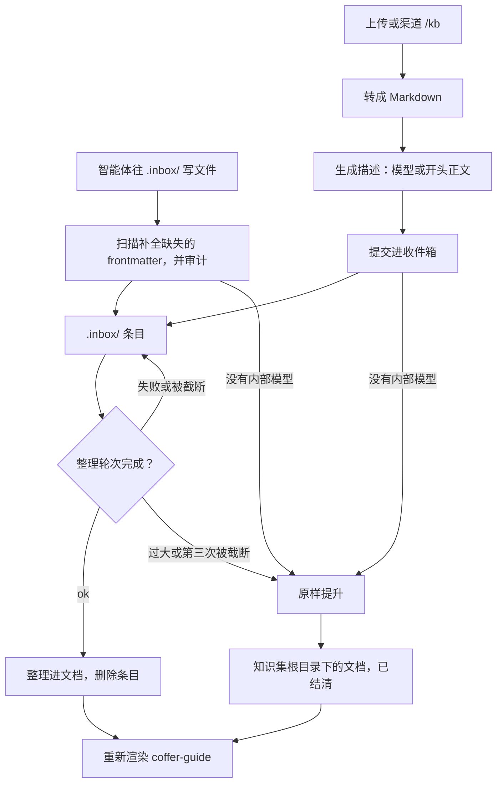
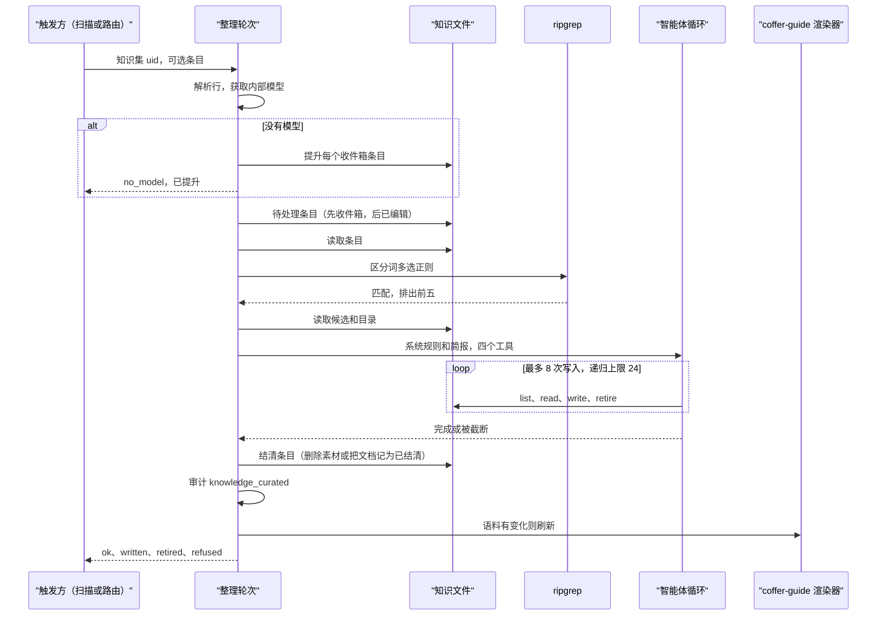
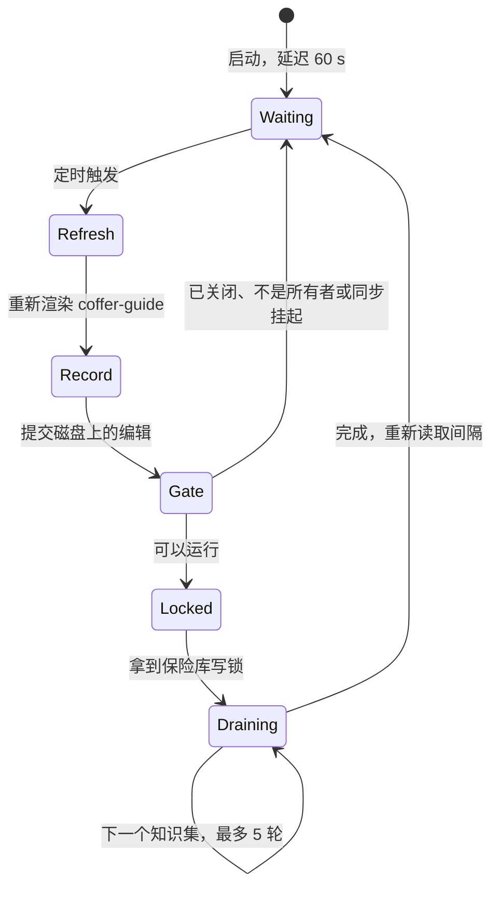

# 知识 {#knowledge}

这一页讲 Coffer 的知识层是怎么搭的：为什么它是不带索引的纯文件，新素材如何经过整理变成文档，每一次写入如何保存为可以恢复或撤销的版本，目录如何通过 `coffer-guide` 技能到达智能体，以及它如何与保险库同步共存。它面向想了解机制和背后理由的工程师。日常使用见 [知识指南](/zh/guides/knowledge)。

## 问题 {#the-problem}

知识是开发者对自己工作环境的了解：哪个团队负责某个服务、某个仓库的约定、某个坑以及怎么绕开它。好几个智能体需要读它，人和智能体都需要往里加东西。有三种失败模式塑造了这个设计：

- **副本会分叉。** 如果每个智能体各记各的笔记，一个智能体上午学到的东西，另一个下午就看不到。
- **检索工具没人用。** 需要智能体记得去调用的工具，算不上检索。有一次对 448 个 Claude Code 会话做了审计，当时语料已经建在一组知识工具和一个投递的技能后面，结果发现那个技能从没被加载过，也没有任何知识工具被调用过。而 Coffer 支持的每个智能体本来就有 `Read` 和 `Grep`，并且一直在用。
- **手工维护的链接会腐烂。** 同一份语料里，398 个内部文件引用中有 343 个是死链，每一个都是写进正文的文件名，被后来的一次改名弄坏了。

知识也不同于 [记忆](/zh/architecture/memory)。知识关于外部世界，因为有人把它放进来才出现。它按知识集组织，通过技能来拉取。记忆关于用户和用户的项目，它自己累积，从智能体的原生记忆聚合而来。

## 设计决策 {#design-decisions}

| 决策 | 理由 |
| --- | --- |
| 一个知识集是 `~/.coffer/vault/knowledge/<collection>/` 下的一棵 Markdown 文件目录树。 | 每个智能体读的是同样的字节，所以不会有副本分叉。一个人在自己编辑器里的修改，下一次读取就生效。 |
| 不要任何索引：没有表、没有 FTS、没有向量、没有缓存。 | 没有派生物，就不会有东西和文件不一致。没什么需要重建或调和。 |
| 文件路径就是它的身份。 | 可读的 slug 就是人在文件管理器里看到的、智能体在 grep 结果里看到的东西。 |
| 元数据放在 YAML frontmatter 里。 | 只有文件本身是每个写入者（人、智能体和 Coffer）都看得到的。 |
| 新知识以素材的形式进入隐藏的 `.inbox/`，由一轮整理把它并入文档。 | 知识集靠整合来增长，而不是每上传一次就多一个文件。 |
| 每一次被接受的写入都是一次写明写入者的 git 提交。 | 整理会在无人值守的情况下改写唯一的那份副本。有了谁改了什么的历史，每次改动都可查看，每个版本都可恢复，每一轮都可撤销。 |
| 新的说法胜出，除非旧的说法被证明是对的。没有哪个写入者可以例外，整理轮次会把一次编辑作为较新的说法向外传播。 | 一句话可信与否，看它是什么时候说的、背后有什么证据，而不是谁写的：人的修改、智能体的修改和整理轮次的修改都可能过时或出错。历史、恢复和撤销是补救途径。 |
| 任何文档都不能提到另一个知识文件，这在写入时强制执行。 | 语料重组时路径会变。目录负责把主题解析成路径，而目录是生成出来的。 |
| 没有检索工具，目录搭在 Coffer 自己的技能里。 | 智能体用它们已经在用的工具读文件。知识层的任务是把正确的绝对路径摆到模型面前。 |
| 智能体往知识集的 `.inbox/` 里写 Markdown 文件来添加知识。没有面向智能体的工具：Coffer 唯一的内置 MCP 工具是 `coffer__search_tools`。 | 智能体本来就会用自己的工具写文件。扫描补全 frontmatter、记录审计并整理，所以智能体只需要知道目录。 |
| 知识集没有闸门：没有按智能体的生效范围，也没有启用开关。每个知识集都提供给每个智能体。 | 技能把整个知识根目录交给了每个智能体。按智能体过滤或关掉某个知识集，只会缩短一张列表，而根目录照样暴露。 |

## 知识集目录树 {#the-collection-tree}

```text
~/.coffer/vault/knowledge/          # inside the vault repository
├── payments/                     # one collection = one knowledge Resource
│   ├── README.md                 # the collection's own description
│   ├── session-ownership.md      # a document
│   ├── infra/
│   │   └── cache.md              # nesting is allowed and means nothing
│   └── .inbox/                   # material waiting to be curated (hidden)
│       └── rate-limit-change.md
└── personal/
    └── ...
```

- **知识集** 是一个顶层目录，也是一个 `knowledge` 类型的资源，存为 `vault/resources/knowledge/<name>.json`。由人有意地在 Web 界面里创建它。读取、写入、智能体放到别处的文件和工作目录都不会自动创建知识集，也没有任何东西会从智能体的 cwd 推导出边界。知识层在任何地方都没有加表。
- **README** 位于知识集根目录，它的第一段就是这个知识集的描述。每次列出时都从磁盘读取，从不复制进资源文件，因为一旦有人编辑了 README，副本就错了。README 从不作为文档列出、计数或整理。知识集没有自己的标题：每个界面都用文件夹名展示它，资源更新也会拒绝标题。在 Web 界面里编辑描述只改写第一段，README 其余部分保持不动，作为一次写明用户的提交；之后会重新渲染指南技能，因为智能体正是靠描述来认出这个知识集的。
- **嵌套** 由归档文档的一方决定，可能是人，也可能是整理。Coffer 不赋予文件夹任何含义。
- **隐藏条目**（以点开头）不计入任何文档计数，也不进目录。在知识集内部，Coffer 只写一个：`.inbox/`。保险库仓库的 `.git/info/exclude` 忽略知识集里其他所有隐藏条目，所以它们既不会被提交，也不会被同步。树视图会把知识集根目录下的 `.inbox/` 作为目录列出，读取视图也能读其中的条目，所以人能看到有什么在等待；其他隐藏条目都不会被列出或读取，也没有任何 Coffer 界面会编辑或删除收件箱条目。智能体通过往里面写文件来添加条目。

### 路径即身份 {#path-as-identity}

文件名是由标题派生的 slug。slug 经过 NFKC 规范化并转为小写。CJK 字符保留，因为音译出来的名字谁都认不出。长度上限 80 个字符。重名时追加 `-2`、`-3`，以此类推：

```text
payments/session-ownership.md
payments/session-ownership-2.md
```

frontmatter 里没有 `id` 键，也没有任何东西把 id 映射到路径。

### Frontmatter {#frontmatter}

```yaml
---
title: Session ownership
description: Which team owns the session service and how to reach them.
actor: user
created_at: '2026-09-20T08:14:03.512+00:00'
updated_at: '2026-09-22T10:02:41.107+00:00'
reviewed_by: alice          # a key a person added; always preserved
---
```

Coffer 按固定顺序写五个键：`title`、`description`、`actor`（`agent` 或 `user`）、`created_at` 和 `updated_at`。人加的任何其他键，在 Coffer 改写文件时都会保留，解析出的值不变。这一点很重要，因为整理会在无人值守时改写文档。丢掉一个不认识的键，就等于悄悄删掉了人写的 `tags:`。

### 所有路径由一个模块负责 {#one-module-owns-every-path}

知识基础设施里有一个模块负责构建所有路径，别处都不构建路径。每一段都要经过一个守卫，它拒绝空段、全是点的段、以点开头的段以及不在白名单里的段，所以 `payments/.inbox/x.md` 从任何界面都无法寻址。解析后的路径还会在它最近的已存在祖先上与知识根目录比对，所以根目录里的一个符号链接目录没法把写入带到外面去。写入先写到一个用 `O_EXCL | O_NOFOLLOW` 打开的同级临时文件，再做一次原子重命名，并通过保险库唯一的写入者提交。根目录永远是 `~/.coffer/vault/knowledge`，不能覆盖。

## 从素材到文档 {#from-material-to-document}

每个入口都是把 **素材** 放进知识集的收件箱，没有一个直接写文档。

| 入口 | 界面 |
| --- | --- |
| 写进 `<collection>/.inbox/` 的 Markdown 文件 | 智能体自己的文件工具；由扫描规范化 |
| 上传，先转成 Markdown | 知识页面 |
| 附件之后发 `/kb <collection>` | 已配对的 [消息渠道](/zh/architecture/chat) 所有者 |

没有任何入口能在指定路径上创建文档，Web 界面里也没有手敲一篇文档的表单：人通过编辑器写（保存一篇已有文档的正文）或上传，所以由收件箱和同一套整理来决定新知识该放在哪里。



### 提交 {#submission}

上传或 `/kb` 的提交会先检查知识集是否存在，然后写一个收件箱条目。条目的 frontmatter 和 Markdown 形态与文档相同，按标题的 slug 命名。它从不覆盖已有条目，因为同一标题的两次提交就是两份素材。提交只是一次普通的文件写入，没有模型、转换或索引步骤。它记录一条 `knowledge_written` 审计事件。

返回结果说明素材的去向：

- `pending`，不带路径：素材在收件箱里等待。收件箱地址在素材被整理后就消失了，所以 Coffer 不报告它。
- `written`，带文档路径：没有内部模型来整理它。这时素材会被当场 **提升**：原样成为知识集根目录下的一篇文档，并记为已结清。知识不能在隐藏目录里干等一个没人配置的模型连接。

### 智能体写入的收件箱文件 {#an-agent-s-inbox-file}

智能体不调用任何东西。它用自己的文件工具往 `<collection>/.inbox/<任意名字>.md` 写一个 Markdown 文件，frontmatter 可选；`coffer-guide` 技能会告诉它路径，并列出现有的知识集。扫描会发现没有任何 Coffer 界面写过的新收件箱文件，并在把它作为磁盘上的编辑提交之前 **规范化** 它：

- `title` 保留已有的，否则取第一个 `# ` 标题，再否则取文件名主干。
- `description` 保留已有的，否则取第一段正文，再否则取标题，和上传用的是同一套兜底。
- `actor` 按文件里写的保留（它是自报的），否则为 `agent`。
- `created_at` 和 `updated_at` 保留已有的，否则取扫描发现该文件的时间。
- 写入者设置的其他键全部保留。

每个条目记录一条 `knowledge_written` 审计事件，当 actor 来自文件时会加以标注。从此这个条目就和其他素材一样。写在不是知识集的顶层目录里的 Markdown 文件不会被处理，也不会进目录，因为只有人才能创建知识集。收件箱里不是 Markdown 的文件原样留着，会被记录日志，不会被整理。

Coffer 有意不为此提供写入工具。文件是智能体本来就在用的接口，目录是它唯一必须知道的东西，其余本来要它自己做对的部分，由扫描补上。

### 上传 {#uploads}

一次上传按顺序经过四步：

1. **限定上传。** 每次调用只收一个文件，最大 20 MiB。在付出转换成本之前，先拒绝不存在的知识集。
2. **转换。** 一个转换器注册表按扩展名分发。先走直通（Markdown、文本和源代码文件），再走 CSV，其他一律交给 MarkItDown。不支持的类型以 `INGEST_REJECTED` 和 `reason: unsupported_type` 拒绝。转换出来没有文本的（比如只有图片的 PDF）也会被拒绝。两种情况都什么都不写。
3. **生成描述。** 配置了内部模型并且它及时响应时，描述由模型生成。否则取文档的第一段正文，再不行就用标题。描述从不为空，因为目录给智能体看的就是它。
4. **把 Markdown 作为素材提交**，`actor: user`。

原始字节和提取出的文本都不会作为文件保留。上传只是知识的载体，知识一旦整理完，载体就没什么可说的了。代价是：一次糟糕的转换没法从 Coffer 保留的副本重做，你得用自己的副本重新上传。

`markitdown` 是惰性导入的。一条 import-linter 契约把它限制在知识转换器和消息渠道的文档提取里。

### 直接编辑 {#direct-edits}

直接写、改或删文档（在你的编辑器里，或者用智能体自己的文件工具），是修改知识的完整方式。不需要任何导入或注册步骤，改动在下一次读取时就生效。整理扫描会根据内容注意到这次编辑（见下文 [结清一个条目](#settling-an-item)），并把它作为较新的说法传播到知识集的其余部分。通过 Coffer 删除文档是人在 Web 界面里做的操作，Coffer 没有任何会删除东西的工具。

Web 界面也可以原地编辑文档。一次保存会替换文档的 **正文**，保留 frontmatter。读取文档会带回文件的指纹，保存时必须回传编辑器加载时拿到的那个：如果磁盘上的文件在此期间变了（无论是人自己的编辑器还是一轮整理改的），保存会被当作冲突拒绝，文件保持不动。拒绝结果带着磁盘上当前的文档（正文和指纹），这样编辑器可以提供「重新加载」「比较」和「复制我的文字」，而不会再覆盖保存一次；要再次保存这个人的文字，需要用新的指纹。这次保存是一个 `user` 提交，所以扫描会像对待在编辑器里的修改一样把它向外传播。收件箱条目、README 以及文档以外的任何路径都会被拒绝。每次保存记录一条 `knowledge_edited` 审计事件，并且是一次写明用户的提交（见 [历史](#history)）。在编辑器里或用智能体文件工具做的修改也会被提交，记为一次磁盘上的编辑。

## 整理轮次 {#the-curation-pass}

整理把素材变成知识，并把一篇文档里的修改传播到其他文档。一个 **轮次**（pass）整理一个条目；一次 **运行**（run）通过一轮接一轮地执行来清空一个知识集。它是一个有边界的智能体循环，跑在 Coffer 的内部模型连接上（见 `coffer config set engine.model`）。它由位于 LLM 基础设施里的一个 LangGraph ReAct 循环驱动。知识包只通过它自己定义的一个窄端口接触这个循环，所以从不导入 LangChain。

### 一个轮次能看到什么 {#what-a-pass-sees}

一个轮次处理 **一个条目**：一份素材，或者一篇自上次整理以来被编辑过的文档。它的上下文是有边界的：

- **完整的条目。** 超过 120,000 个字符的条目从不给模型看，见 [结果](#outcomes)。
- **最多五篇完整的候选文档。**
- **整个知识集的目录**：路径、标题和描述。

规则放在系统轮次里，每个轮次都完全相同，方便提供商缓存。简报可能有几十 KB，放在用户轮次里。

### 候选选择 {#candidate-selection}

因为没有索引，候选是按字面选出来的：

1. 从条目里提取最多 24 个有区分度的词，越具体越靠前：反引号里的标识符、带点的服务名、全大写常量、标题和小标题里的词，以及 CJK 字串。短词和一小张停用词表会被去掉。拉丁词至少 4 个字符，CJK 词至少 2 个字符。
2. 把它们拼成一个转义过的多选正则，用 ripgrep 在知识集的文档上跑一遍。
3. 按命中次数给文档排序，保留前五。条目本身和知识集自己的 README 从不作为候选（子文件夹里的 README 是普通文档）。收件箱从不被搜索，因为 ripgrep 会跳过隐藏目录。

这种选择方式是故意做得粗糙的。选错了也没关系，因为目录也在提示词里：模型拿到五篇不相关的候选，仍然能看出没有一篇负责这个主题，然后新开一篇文档。

### Ripgrep 与 Python 兜底 {#ripgrep-and-the-python-fallback}

搜索运行 `rg --json --no-hidden`，超时 5 秒，最多 200 条匹配。之所以显式传 `--no-hidden`，是因为用户的 `$RIPGREP_CONFIG_PATH` 否则可能打开隐藏文件。rg 退出码 2 会呈现为无效模式，而不是「没有匹配」。超时会杀掉 rg 并报告被截断。

在没有 `rg` 的机器上，一个纯 Python 兜底在一个 worker 线程里用同样的规则遍历同样的文件：逐行正则、按文件设上限、跳过隐藏条目和二进制文件，时间预算也一样。切换到兜底时每个进程只记一次日志。这是知识层里唯一还保留字面匹配的地方，守护进程之外的任何东西都访问不到它。

### 四个工具 {#the-four-tools}

一个轮次只有四个工具，别无其他。它们合起来就是轮次的全部工具面，限定在一个知识集的文档之内：

| 工具 | 作用 | 代码中强制执行的约束 |
| --- | --- | --- |
| `list_documents` | 列出每篇文档及其标题和描述。 | 只有文档：从不包括收件箱或 README。 |
| `read_document` | 完整读取一篇文档。 | 路径必须是本知识集的文档。 |
| `write_document` | 替换 `path` 处的文档，或者按标题新建一篇，可选放进某个 `folder`。 | 计入写入上限。拒绝引用知识文件的正文。记为已结清。 |
| `retire_document` | 删除一篇内容已被本轮写到别处的文档。 | 算一次写入。除非本轮已经看过这篇文档、并且之后写过一篇*不同的*文档，否则拒绝。 |

这些工具是内部的。它们没有注册到 MCP 网关，也不在内置工具注册表里。

**写入上限。** 一个轮次最多写八次，retire 算一次。超过之后，每次写入都返回错误，告诉模型停下。一个条目永远不会引发整个语料的重写。

**不许内部引用。** 写入前，工具会扫描正文里看起来像 Markdown 文件名的 token。如果某个 token 以 `<collection>/` 开头，或者它的文件名和本知识集里的某个文件相同，就拒绝写入。文档仍然可以提到别的仓库的 `AGENTS.md`，因为拒绝这个就成了模型无法满足的规则。这项检查放在代码里，因为当初正是靠提示词要求，才产生了那些死链。

**retire 规则。** 代码证明不了事实已经搬走了。但它可以拒绝所有不可能搬走的 retire：在任何写入之前、针对本轮从没看过的文档、或者之后唯一的写入就是这篇文档本身。

**文件夹写法。** 模型看到 `payments/x.md`，很自然会回答 `folder="payments"`。工具会去掉开头的知识集段，而不是建出 `payments/payments/x.md`。

### 优先级规则 {#precedence-rules}

有两条规则没法用代码裁决，所以放在系统提示词里：

- **新的说法胜出，除非旧的说法被证明是对的。** 新素材和某篇文档矛盾时，文档会被更正，除非有来源、日期、命令输出或代码证明旧的说法才是对的。被取代的说法保留可读，并注明它改变的日期，比如「(previously recorded as X; corrected 2026-09-20)」。
- **没有哪个写入者可以例外。** 人、智能体和整理轮次都按一句话是什么时候说的、背后有什么证据来评判，而不是按谁写的。当条目是一篇被人编辑过的文档时，轮次会把这次编辑作为较新的说法向外传播：更正与之矛盾的其他文档，把属于别处的小节搬过去。被编辑的文档并不受保护，之后的条目可以按同一条规则更正它。

另有两道护栏保护的是数据而不是某个写入者，所以由代码强制：轮次绝不覆盖在它读取之后字节已变化的文档（这次写入被拒绝并计入 `refused`，所以轮次运行期间做的编辑不会被悄悄回退），重写时也会保留所有它没有设置的 frontmatter 键。

提示词还要求：什么都不丢，整合而不是重新生成；先读再写；按主题而不是按来源组织；给每篇文档一个说明它回答什么问题的描述。

### 一个轮次的完整过程 {#a-pass-end-to-end}



### 结清一个条目 {#settling-an-item}

只有在轮次完成之后，条目才会被结清。整理过的素材从收件箱删除；它的文字留在历史里，因为收件箱在历史里是被跟踪的。整个轮次（它的写入和结清）合起来是一次提交（见 [历史](#history)）。被编辑的文档会被记为已结清，内容一点不变。一个抛出异常、或被递归上限截断的轮次会让条目保持原样，这样后面的扫描会重试它，而不是把它弄丢。

**水位线看内容，从不看修改时间。** `local/curation.json` 按文档记录它上次被整理结清时的 blob。当一篇文档在 `HEAD` 上的 blob 与结清时的不同，并且最近一次触及它的提交不是 `curation` 或 `sync` 写入时，这篇文档就欠一个轮次：人或智能体的修改会被向外传播，而 Coffer 自己的输出和另一台机器已经整理过的改动则不会。一次只改动修改时间的检出、备份恢复或时钟变更，不会让任何东西变成待处理。这个文件只属于本机，让整理把所有东西看一遍就能重建。

### 结果 {#outcomes}

每个轮次的结果都是一个 `status`（一次运行如何报告它的各个轮次，见 [手动运行](#manual-runs)）：

| 状态 | 含义 |
| --- | --- |
| `ok` | 轮次跑完并结清了条目。报告 `written`、`retired`、`refused`、`model`、`candidates` 以及前后的文档数。 |
| `no_model` | 没有内部连接。每个收件箱条目都被原样提升（`promoted`）。 |
| `up_to_date` | 没有待处理的东西。什么都没跑，什么都没动。 |
| `too_large` | 条目超过 `limit`。素材被原样提升（`promoted`）。被编辑的文档记为已结清（`stamped`）。模型什么都没看到。 |
| `truncated` | 递归上限截断了轮次。已做的写入保留，条目仍然欠着。同一条目连续第三次被截断时，`gave_up` 为 `true`，条目被提升或结清。 |
| `failed` | 循环抛出异常。条目不变。 |

对于已经有一次运行在进行的知识集，新的运行会以 `UPKEEP_ALREADY_RUNNING` 被拒绝。连续截断次数记在内存里，所以不会为了计数往同步树里写任何东西。重启会清零，代价是每次重启每个条目最多多跑三轮。

每个跑过的轮次，不管有没有被截断，都记录一条 `knowledge_curated` 审计事件。整理没有审核步骤，所以人要通过历史和审计日志才能看到有东西改写了语料；不同意的轮次可以整体撤销。

## 扫描 {#the-sweep}

扫描是守护进程里的一个后台 asyncio 任务，在 HTTP 界面装配整理时启动，结构与保留期 worker 相同。



每次触发时，worker 做这些事：

1. **重新渲染指南技能**，在闸门之前，而且不受闸门影响。创建或删除知识集会改变每个智能体得到的说明，即使在整理已关闭、或者不是所有者的机器上也是如此。渲染结果字节相同时什么都不写。
2. **结清磁盘上的编辑。** 自上次提交以来树里改动过的任何东西（比如人的编辑器或智能体的文件工具改的），都会通过保险库写入者作为一次磁盘上的编辑提交，不管闸门是否允许整理运行，以保证历史是最新的。
3. **检查闸门。**`auto_curate_enabled` 必须打开（默认打开），`curate_owner_machine_id` 必须指向本机或者未设置。当某一轮同步在等用户时（因冲突而停下、因删除而挂起，或者在等加入时的选择），轮次也不会运行。
4. **每一轮拿一次保险库写锁**，就是同步轮次持有的那把锁，而不是在整个扫描期间一直拿着。见 [与同步的加锁](#locking-with-sync)。
5. **逐个处理知识集**，按 uid 识别；每个知识集都会列出来。待处理条目先是全部收件箱素材（从旧到新），然后是被编辑过的文档（从旧到新）。worker 在进程内的维护运行注册表里认领这个知识集，如果被一次手动运行占着就跳过。它在认领之内重新读取待处理列表，把上次被截断的条目排到后面，最多跑五轮。`no_model` 或 `failed` 会结束这个知识集的扫描；`truncated` 不会，这样一个顽固的条目不会饿死其他条目。
6. **等待下一次触发。** 间隔默认一小时；想更快时，手动运行会立刻清空一个知识集。间隔在等待期间会被重新读取，所以用 `coffer config set engine.upkeep.curate.interval` 或在知识页面的「自动」弹出框里做的修改，在一个时间片内就生效，而不是等到启动时就定下的那次等待结束。

一次失败的扫描会被记录日志，但从不结束循环。关闭时直接取消任务，不等轮次跑完。水位线让扫描是幂等的，所以下次启动会接着处理剩下的东西。

### 所有者机器 {#the-owner-machine}

一个轮次会在无人值守时改写同步的内容。如果两台机器整理同一份语料，每台都会把同一份素材并进一篇*不同的*文档。git 会干净地合并两边的新增，保险库里就会有两份相同的知识，而且不报任何冲突。所以整理只在一台机器上跑。

`auto_curate_enabled` 和 `curate_owner_machine_id` 存在同步的引擎设置文档 `vault/state/settings/internal-engine.json` 里，扫描在每次触发时都读取这两个值。没有所有者表示这是单机保险库，「这里」是唯一的答案。所有者指向一台注册表不认识的机器时，所有地方的整理都会停下。这是安全的方向：不整理的代价是素材要等，到处整理的代价是悄无声息的重复。你可以用 `coffer config get|set|unset engine.curate_owner` 查看和修改所有者。

### 手动运行 {#manual-runs}

知识页面上的 **立即整理** 通过一次清空（一轮接一轮地执行）运行 worker 使用的同一个轮次。知识集会先被认领，所以第二个请求会立刻以 `UPKEEP_ALREADY_RUNNING` 被拒绝，而不是阻塞。当某一轮同步在等用户处理时，运行也会以 `KNOWLEDGE_CURATION_HELD` 被拒绝；所有者机器闸门只属于扫描，因为点按钮就是选择在这台机器上运行。

一次运行只读 **一次** 待处理列表：先是收件箱条目（从旧到新），然后是在带外被编辑的文档。接着对每个条目跑一轮，一次一个，每轮仍然限定最多八次写入，直到当初待处理的东西都处理完。它每一轮拿一次保险库写锁，而不是整个运行期间一直拿着，所以同步轮次可以穿插在轮次之间。一轮不会覆盖在它读取之后字节已变化的文档，并把这次拒绝计入 `refused`。运行期间新到的条目等下一次运行或扫描，这样「n of m」里的 *m* 保持不变。

| 轮次结果 | 运行怎么做 |
| --- | --- |
| `ok`、`too_large`、`truncated` | 继续下一个条目。被截断的条目仍然待处理。 |
| `failed` | 停止。其余条目留给下一次运行或扫描。 |
| `no_model` | 停止。这一轮已经把整个收件箱都提升了。 |

返回结果按顺序列出每个轮次的结果，并带上运行自己的 `status`（`ok`、`failed`、`no_model`，或者没有待处理时为 `up_to_date`）和 `total`。运行进行中，它的进度（`total` 中的 `done`）可以在守护进程的进行中运行列表里读到；每轮结束后，守护进程的事件流上会发布一条指明类型 `knowledge` 和知识集 uid 的 `change` 事件，这样打开的页面会随着语料变化刷新。

一次运行也可以限定为一篇文档：恰好针对那篇文档跑一轮，其他待处理的东西仍然待处理。

## 与同步的加锁 {#locking-with-sync}

整理轮次和 [保险库同步](/zh/architecture/vault-sync) 轮次都会写保险库。如果在改写进行到一半时检出一次合并，结果会落在一个撕裂的状态上。所以两者都拿同一把由同步服务拥有的锁：手动路由和 worker 都是每轮拿一次，从不在整个运行或扫描期间一直拿着。

有两把锁在起作用，范围不同：

| 锁 | 范围 | 防止的冲突 |
| --- | --- | --- |
| 维护运行认领（进程内的维护运行注册表） | 一个知识集，进程内 | 同一知识集上的手动运行和扫描 |
| 保险库写锁（同步服务的锁） | 整个保险库 | 一个整理轮次和一轮同步 |

## 历史 {#history}

对知识集的每一次被接受的写入，都是一次写明 **写入者** 的 git 提交，这遵循「每次保险库写入都是一次写明写入者的已校验提交」这项决策。因此一篇文档的历史就是一串版本，每个版本有写入者、时间和 diff；一个整理轮次就是一次可以查看、可以撤销的改动。

### 写入者 {#writers}

| 写入者 | 涵盖什么 |
| --- | --- |
| `user` | 人的保存、删除、恢复或撤销，以及知识集的创建、改名和移除。 |
| `agent` | 智能体的提交在没设模型时到达即被提升，写明是哪个智能体。 |
| `curation` | 每轮一次提交，写明它整理的条目以及提交这个条目的是谁：智能体（取自条目的 `knowledge_written` 审计事件）或 `user`。 |
| `sync` | 保险库同步应用的路径。 |
| `disk` | 在树里发现的其他任何改动：人自己的编辑器、智能体自己的文件工具。 |

在 Coffer 之外做的改动从不算作 Coffer 的。保险库的扫描器会在文件安静下来之后，把人或智能体自己的工具改的东西提交为 **在磁盘上编辑**；每次扫描触发和每次读取历史之前，它也会这么做。一个整理轮次在运行期间会一直保持它的提交处于打开状态；期间它碰过的文档归它所有，磁盘编辑提交不会动它们。

在收件箱里等待的提交也是一次次提交，因为收件箱是被跟踪的：一个轮次消耗掉一个条目之后，它的文字仍可以从历史里找回。这些提交不作为改动显示，因为还没整理的素材还没有改变任何文档。

### 存在哪里 {#where-it-lives}

历史就是保险库仓库本身的历史：知识集位于 `~/.coffer/vault` 的 `knowledge/` 下，所以一篇文档的历史就是这个仓库里那个文件的历史，知识路由就从那里读取它。从更早版本 Coffer 升级上来的家目录，其知识历史已由 `coffer migrate` 并入，每个提交的消息、作者和日期都保留了。

知识提交带有保险库的 trailer，外加知识专用的那些（`Coffer-Writer`、`Coffer-Operation`、`Coffer-Actor`、`Coffer-Agent`、`Coffer-Collection`、`Coffer-Item`、`Coffer-Status`、`Coffer-Restored-From`、`Coffer-Undoes`）。git 运行时，用户的全局和系统配置被固定到 `/dev/null`，所以个人的 hook、签名规则或别名都改变不了记录的内容。保险库依赖 git：没有 git 的机器会在启动时失败，并指出安装步骤。

### 读取和恢复一篇文档 {#reading-and-restoring-a-document}

一篇文档的各个版本按从新到旧列出，带写入者和时间，每个版本的 diff 都可以读。恢复某个版本会把那个版本的字节作为一次写明用户的新提交写回去；之前的历史保持完整。恢复是人的改动，所以扫描会像对待其他编辑一样把它向外传播。被删除的文档也用同样的方式恢复，取删除之前的那个版本。

一次删除（一篇文档或整个知识集）本身就是改动流里的一条改动，列出它移除的每个文件。恢复它会从删除之前的那次提交读出每个被删的文件，逐字节写回，作为一次写明用户、带 `Coffer-Restored-From` 的新提交。文档回到它的知识集。知识集会以原来的名字得到一个新的资源文件，然后是它的文档、README，以及当时在收件箱里等待的条目；收件箱条目以条目的身份回来，所以整理仍然欠它们一轮。如果恢复会覆盖东西，就什么都不写：同一路径上已有文档，或同名知识集已存在，都会被拒绝；恢复一条不是删除的改动也会被拒绝。一次恢复会记录一条 `knowledge_edited` 审计事件，写明它撤回的是哪次删除。

### 最近改动 {#recent-changes}

一条改动流列出跨所有知识集（或某一个）的改动，从新到旧。每条改动带它的写入者、时间、涉及的知识集，以及它碰到的每篇文档是新增、修改还是移除，附行数。只涉及收件箱的提交不进改动流；每个收件箱里仍在等待的条目会在旁边一起显示，带标题、提交者和提交时间。一条改动可以完整读取，附每篇文档的 diff，这样可以在撤销一个轮次之前先查看它。

### 撤销一个轮次 {#undoing-a-pass}

一个整理轮次整体撤销：

- 这个轮次写过或 retire 过的每篇文档都回到轮次之前的原样字节，它新建的文档被移除，作为一次写明用户的新提交。
- 每篇恢复的文档都在 `local/curation.json` 里记为已结清，这样扫描不会把撤销读成一次编辑、又把这个轮次重做一遍。
- 轮次合并掉的条目不会放回收件箱，它的文字留在历史里。轮次原样提升为文档的条目（`no_model`、`too_large`，或整理放弃的条目）会放回收件箱，否则撤销时删掉那篇文档就会丢失这条知识。
- 如果之后有任何提交碰过这个轮次的某篇文档，撤销会被拒绝并指出那篇文档，什么都不写。覆盖后来的改动会让它丢失。

只有轮次能这样撤销；任何单个版本都用恢复代替。

## coffer-guide 技能 {#the-coffer-guide-skill}

目录通过 Coffer 自己的技能 `coffer-guide` 到达智能体。它是一个普通的 `skill` 资源：`~/.coffer/derived/skills/coffer-guide/` 下一个主文件夹，一个来源为 `builtin` 的派生资源文件，并像任何导入的技能一样以同样的目录链接投递到每个智能体里。见 [技能](/zh/guides/skills)。知识层只贡献 **文字**，别的什么都不管。

### 渲染 {#rendering}

渲染器是纯函数式的：文本进、文本出，除了它自己包里的资源文件，没有端口，也不访问文件系统。它渲染：

- **frontmatter 里的描述。** 这是唯一始终在模型上下文里的部分。它说出 Coffer 和它的内置工具，以及各知识集涵盖的主题，每个主题取自该知识集 README 的第一句。上限 1024 个字符，这是各种技能导入方里最严的限制；超出时从尾部整条丢掉主题，而不是截断句子。它通过一个不限宽度的 YAML dumper 输出，所以 README 里含有 `: ` 或 ` #` 也不会弄坏或悄悄截断这个块。
- **正文。** 先是作为包数据发布的手写说明书。它讲内置工具、工具分层契约、两个根目录、Coffer 从不写智能体的记忆，以及没有任何 Coffer 工具会等待审批。后面跟着生成的目录：知识根目录，以及每个知识集里每篇文档相对于知识集的路径、标题和描述。说明书告诉智能体用自己的工具读文件，学到持久的事实时往知识集的 `.inbox/` 里写一个 Markdown 文件，并且也可以直接编辑文档。

正文只有在模型打开它时才付出成本；描述则常驻在每个会话里。这就是 Coffer 只发一个技能而不是一组技能的原因。一条目录条目大约 40 个 token；实测一份 58 篇文档的目录约 5.2K token。

### 确定性、逐字节一致的输出 {#deterministic-byte-identical-output}

渲染出的 `SKILL.md` 是构建和传入目录的纯函数。绝对家目录、时间戳、构建路径都不会进入其中。知识根目录写作 `~/.coffer/vault/knowledge`。

确定性在本地就有回报。技能类型的内置 seed 步骤把渲染出的文字与主文件夹比较，如果完全一致，就什么都不写、不审计、不重新投递。所以一次没有任何变化的启动或扫描触发不会留下任何痕迹，资源的版本哈希意味着「内容变了」，而不是「时间过去了」。

### 为什么不参与同步 {#why-it-is-withheld-from-sync}

指南依赖本机自己的输入：它的知识根目录和记忆根目录在哪里。两台知识完全相同、但根目录不同的机器会渲染出不同的字节，各自在自己那里都是对的。如果任一方发布了自己的副本，另一方就会覆盖它，在下一次触发时重新渲染并发布回去，结果两台机器每次触发都产生一次提交和一条审计事件，无休无止。所以技能类型把这一个资源归入派生类别：它的资源文件和文件夹都在 `~/.coffer/derived/` 下，在保险库仓库之外，同步在两个方向上都带不走它们。每台机器渲染自己的那份。见 [保险库同步](/zh/architecture/vault-sync)。

### 接合点与触发时机 {#the-join-and-its-triggers}

知识类型和技能类型不能互相导入。渲染器和技能类型的 seed 只在组合根里的一个模块中相遇，两者之间的接缝是一段 Markdown 字符串。刷新用一把锁把并发调用串行化，并且从不抛出异常：渲染或写入失败时，之前的主文件夹保持不动。它在这些时候运行：

- 启动时，在技能偏移自愈之后、后台 worker 启动之前；
- 任何改变了语料的整理轮次之后；
- 创建或删除知识集时；
- 每次扫描触发时，这样有人手工添加的文档也会被编入目录。

## 为什么没有检索工具，也没有 embedding {#why-no-retrieval-tool-and-no-embeddings}

知识层不暴露任何工具。Coffer 唯一的内置 MCP 工具是 `coffer__search_tools`，它用来找上游工具；知识没有 `list`、`grep`、`read`、`search`、`write` 或 `delete` 工具。会话审计显示这类工具从没被调用过，而 `Read`、`Grep`、`Edit` 和 `Write` 整天都在用。所以读就是读文件，写就是写文件，力气花在告诉智能体什么上：技能描述里带可匹配的主题，正文里带绝对路径和收件箱的规则。网关的 `initialize` 说明会点出内置工具并指向这个技能，但不带目录。

Coffer 不做任何 embedding。它没有向量存储、没有 embedding 模型，也没有 FTS 索引。一条 import-linter 契约在整个仓库范围内禁止 `llama_index`、`mem0`、`chromadb`、`sentence_transformers`、`sqlite_vec` 和 `fastembed`。这些库每一个都想拥有一个派生存储，而派生存储会和文件分叉。这个设计依靠模型读目录，只要目录放得进上下文就行得通：可以到几百篇文档。字面匹配只是占位，并不是对语义检索下的结论。等知识和记忆的设计稳定下来，语义检索预计会回来，按需要来构建，而不是硬加上去。

## 权衡 {#trade-offs}

- **整理在无人值守时改写文档。** 轮次写入之前没有审核步骤。保障措施是：没有哪个轮次会覆盖在它读取之后被改动的文件、八次写入上限、每个知识集同一时间只跑一轮、每轮一条审计事件，还有历史：每个轮次都是一次可以完整阅读、可以整体撤销的改动，任何文档都能恢复到任何版本。撤销拒绝覆盖后来的改动，所以对于别人已经在其上继续改过的轮次，要通过编辑或恢复某篇文档来修复。
- **素材要等到有轮次运行。** 隐藏的收件箱不进目录，所以一个条目还不是智能体能找到的知识。每小时的扫描、手动运行，以及没配置模型时的提升，让等待保持得很短。
- **历史随每次写入增长。** 没有任何东西修剪它。它和文档放在一起，保存着整理已经并掉的、或者已被删除的文字。
- **用户内容可能离开本机。** 内部模型连接是唯一的出口。整理和上传时生成的描述，是这一层唯一会发往那里的东西。
- **这里没有任何访问控制。** 有 shell 工具的智能体能读知识根目录下的任何文件。每个知识集都告诉了每个智能体；不让智能体看到某个知识集的唯一办法就是删掉它。
- **智能体自己的文件工具不留读取遥测。** Coffer 既看不到智能体用自己工具做的读取，也看不到写入。事后衡量读取靠的是智能体自己的对话记录，保险库历史则会写明磁盘上改了什么。
- **归档条目的 actor 是自报的。** 扫描会保留智能体写下的 `actor`，没有任何东西去验证它。

## 在代码里的位置 {#where-it-lives-in-the-code}

| 包 | 职责 |
| --- | --- |
| `application/knowledge/` | 知识集、提交、整理智能体写入的收件箱文件、没配置模型时的提升、上传、整理轮次（候选、四个受限工具、系统规则、结清）、手动运行、定时扫描、历史读取、恢复、最近改动与撤销，以及 `coffer-guide` 的文字 |
| `infrastructure/knowledge/` | 路径及其守卫、文件读写、frontmatter、命名、目录、ripgrep 及其兜底、历史仓库、转换器 |
| `infrastructure/llm/` | 整理端口背后的 LangGraph 循环 |
| `surfaces/http/` | 轮次构建、所有者闸门和 worker 启动；渲染器与技能 seed 的接合；Web 界面使用的知识路由与历史路由，以及保险库写锁提供方 |

以上路径都在 `backend/coffer/` 下。

## 相关 {#related}

- 规格：[knowledge](https://github.com/wyx-sg/Coffer/blob/main/openspec/specs/knowledge/spec.md)、[internal-engine](https://github.com/wyx-sg/Coffer/blob/main/openspec/specs/internal-engine/spec.md)、[skill-manager](https://github.com/wyx-sg/Coffer/blob/main/openspec/specs/skill-manager/spec.md)
- 决策：[Knowledge Is a Directory of Markdown Files, Not an Index](https://github.com/wyx-sg/Coffer/blob/main/docs/decisions/knowledge-is-plain-files.md)、[Every Vault Write Is One Validated, Compare-and-Swap Commit That Names Its Writer](https://github.com/wyx-sg/Coffer/blob/main/docs/decisions/every-vault-write-is-a-validated-commit-naming-its-writer.md)、[Coffer Ships Its Own Skill](https://github.com/wyx-sg/Coffer/blob/main/docs/decisions/coffer-ships-its-own-skill.md)、[原则 → 治理](/zh/architecture/principles#governance)
- 页面：[知识指南](/zh/guides/knowledge)、[记忆](/zh/architecture/memory)、[保险库同步](/zh/architecture/vault-sync)、[MCP 网关](/zh/architecture/mcp-gateway)、[资源框架](/zh/architecture/resource-framework)、[MCP 工具参考](/zh/reference/mcp-tools)
