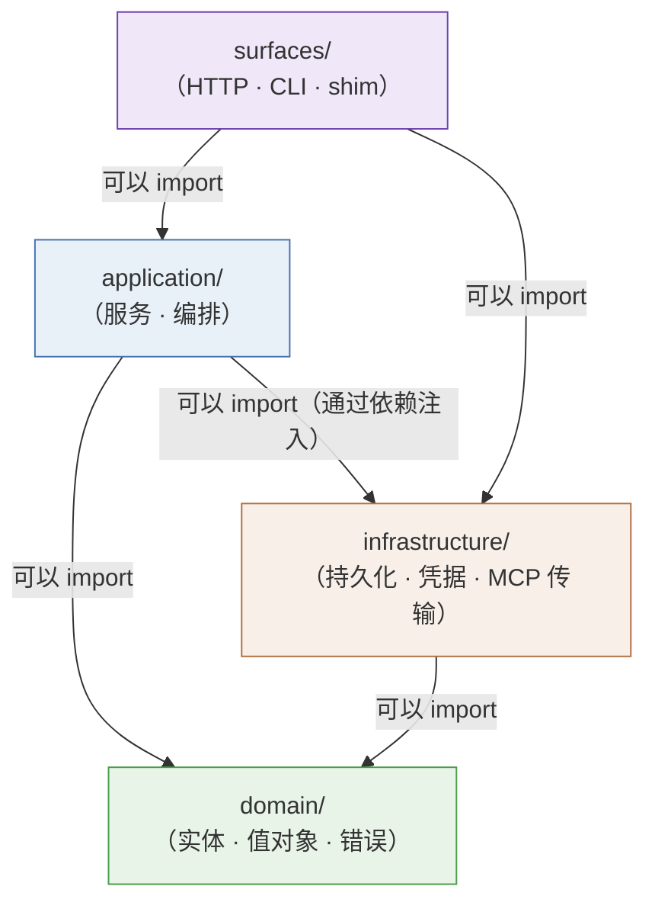

# 分层与代码边界

::: tip 核心模型
Coffer 代码库的四个层次不只是一种组织偏好——它们编码了一套严格的、经机器校验的契约，规定了谁可以调用谁。`domain` 对数据库、HTTP 和 MCP 传输一无所知。`infrastructure` 永远不会被业务逻辑直接 import。组装入口将所有内容显式地、一次性地连接在一起，没有全局状态。顺着 import 箭头，架构就会自我说明。
:::

## 这解决了什么问题

如果没有强制分层，代码库往往会产生循环 import、不相关关注点之间的意外耦合，以及引入了数据库会话或 HTTP 客户端而无法单元测试的业务逻辑。Coffer 的分层正是为了防止这些问题：domain 层可以在没有数据库、没有 MCP 服务器、没有操作系统钥匙串的情况下进行测试。应用层服务可以通过注入测试替身来测试 infrastructure。每一层都有定义明确的职责，不会渗入邻层。

## 四个层次

章程中的分层示意图为：

```
surfaces  →  application  →  domain
                   ↓
            infrastructure
```

箭头表示允许的 import 方向。`surfaces` 可以 import `application`；`application` 可以 import `domain`；两者都可以 import `infrastructure`。反方向永远不允许：`domain` 绝不从上方的层 import 任何内容，`infrastructure` 在组装入口处注入，而不是被 application 或 domain 代码直接 import。

### domain/

domain 层包含与 kind 无关的实体和协议，定义了 Coffer 在概念层面管理的内容。包括 `resource.py`（Resource 实体、`ResourceRef`、kind 协议接口）、`audit.py`（`AuditEvent` 值对象）、`errors.py`（标准错误层次结构），以及 `mcp/` 子目录中 MCP 专用的值对象（工具 schema、能力描述符、会话状态模型）。

::: warning 绝对不变量
`domain/` 不得从 `infrastructure/`、`surfaces/` 或任何外部 SDK import。代码中不出现 SQLAlchemy、FastAPI、`keyring`、`httpx`——这些内容在 domain 层中一概不存在。如果 domain 实体需要校验 URL，它使用 Python 标准库。如果它需要表示一个凭据，它持有的是字符串引用，而不是钥匙串句柄。
:::

这个限制不只是架构品味——它让 domain 层可以被无条件地进行单元测试。测试 domain 逻辑的 `pytest` 测试只 import 纯 Python；它从不触及数据库、不启动子进程、也不访问网络。

### application/

application 层使用 infrastructure 和 surfaces 来编排 domain 实体。它定义了实现 Coffer 用例的服务：`resource_service.py` 用于与 kind 无关的 CRUD（任意 kind 的资源创建/读取/更新/启用/禁用/删除），`audit_service.py` 用于记录生命周期事件，`retention_service.py` 用于后台日志清理工作进程，`application/mcp/` 用于 MCP 专用的应用层服务（会话管理、能力筛选、调用记录）。

应用层服务通过构造函数参数接收其 infrastructure 依赖（repository、钥匙串适配器、上游客户端）——它们不自行实例化这些依赖。这就是依赖倒置模式：application 层通过 `domain/` 中的接口或协议类定义它需要什么，组装入口提供具体实现。

::: warning 绝对不变量
`application/` 不得从 `surfaces/` import。应用层服务绝不应该知道它是被 HTTP 请求、CLI 命令还是测试夹具调用的。这使得同一个 `resource_service.register()` 调用可以从 FastAPI 路由处理器、Typer CLI 命令和集成测试套件中以完全相同的方式调用。
:::

### infrastructure/

infrastructure 层包含所有执行外部 I/O 的代码：SQLAlchemy ORM 模型与 Alembic 迁移（`infrastructure/persistence/`）、操作系统钥匙串适配器（`infrastructure/credentials/keyring_adapter.py`——整个代码库中唯一允许 import `keyring` 的地方）、daemon 发现工具类（`infrastructure/daemon/`），以及 MCP 上游传输实现（`infrastructure/mcp/`——stdio 上游的子进程管理，以及 HTTP 传输上游的 HTTP 客户端）。

infrastructure 在组装入口处注入到系统中，不被 domain 或 application 代码直接 import。应用层服务以注入依赖的方式接收 infrastructure 对象。这意味着可以将真实的 SQLAlchemy repository 替换为测试替身（内存字典或 SQLite `:memory:` 数据库），而无需更改任何 application 或 domain 代码。

钥匙串适配器值得特别说明：它是整个代码库中唯一可以 import `keyring` 的文件。所有其他代码通过不透明的字符串引用访问凭据。这种单点访问规则使「凭据不会到达任何其他层」这一要求可以被机械性地验证。

### surfaces/

surfaces 层将外部协议适配为应用层调用。它包含 FastAPI 应用（`surfaces/http/`）、Typer CLI（`surfaces/cli/`）和 stdio shim 入口点（`surfaces/shim/`）。surfaces 是薄的：它们解析请求、调用应用层服务、格式化响应。它们不包含业务逻辑。

两个组装入口——daemon HTTP 服务器的 `surfaces/http/app.py` 和 CLI 的 `surfaces/cli/main.py`——是四个层唯一交汇的地方。每种 kind 通过 `KindModule` dataclass 在组装入口处显式注册，该 dataclass 将 kind 的 domain 实体、application 服务、infrastructure 实现和 surface 路由/命令处理器捆绑在一起。没有全局 kind 注册表，没有 import 时的副作用。添加新 kind 意味着在每一层创建其子目录，并在组装入口处添加一个 `KindModule` 注册。

## import 规则作为不变量

两条关键不变量，精确表述如下：

::: warning import 规则 1 —— domain 隔离
`domain/` 不得从 `infrastructure/`、`surfaces/` 或任何外部 SDK import。违反此规则意味着 domain 逻辑获得了一个不经过真实 infrastructure 就无法单元测试的 I/O 依赖。
:::

::: warning import 规则 2 —— application 与 surfaces 的隔离
`application/` 不得从 `surfaces/` import。违反此规则意味着业务逻辑获得了对某个接口面的依赖，使得无法在不经过 HTTP 或 CLI 栈的情况下（如在测试中）调用同一逻辑。
:::

第三条规则约束层内的跨 kind 依赖：某个 kind 专用的模块（`domain/mcp/`、`application/mcp/` 等）不得 import 另一个 kind 的模块（`domain/other_kind/`）。层级内的跨 kind 耦合意味着一种 kind 的正确性依赖于另一种 kind 的实现，从而破坏了干净扩展的保证。

章程中「跨层公共模块只在第二个 feature 也需要它时才抽取」的规则是一个推论：驻留在层根目录的共享工具（如 `domain/errors.py`）只有在超过一种 kind 真正需要时才被提升到那里。过早抽取会膨胀共享接口，并让下一个 kind 的作者照搬可能并不适用的模式。

## 强制执行

这些规则不是建议性的。它们由 CI 中两个互补的机制强制执行：

**importlinter 契约** —— 声明于 `backend/pyproject.toml`，这些契约定义了禁止的 import 对，作为 `make verify` 的一部分运行。契约违规会使构建失败，并给出精确命名违规 import 链的错误。强制执行两族规则：分层方向（四层层次结构）和跨 kind 隔离（禁止 `domain/mcp` import `domain/other_kind`）。「只有 `keyring_adapter.py` 可以 import `keyring`」规则作为 importlinter 契约（`backend/pyproject.toml` 中的 Contract 4）强制执行。

**`scripts/check_*.py`** —— 补充性 Python 脚本，强制执行 importlinter 无法以简单 import 图表达的架构规则，例如「跨层公共模块只在第二个 feature 之后才抽取」规则。

两者都在每个 PR 上运行。组合意味着任何违反四层契约或单一钥匙串访问规则的 import 在合并前就会被发现，而不是在代码审查中才被发现。

## 代码布局（ADR-002）

层优先布局由 [ADR-002](/zh/reference/adr/ADR-002-code-layout-layer-first) 规定。完整目录树：

```
backend/coffer/
├── domain/                       # 与 kind 无关的实体 + kind 协议
│   ├── resource.py
│   ├── audit.py
│   ├── errors.py
│   └── mcp/                      # MCP 专用值对象
├── application/
│   ├── resource_service.py       # 与 kind 无关的 CRUD；接受 kinds 字典
│   ├── audit_service.py
│   ├── retention_service.py
│   └── mcp/                      # MCP 专用应用层服务
├── infrastructure/
│   ├── persistence/              # SQLAlchemy + Alembic（统一元数据）
│   ├── credentials/              # 钥匙串适配器——唯一被允许 import `keyring` 的位置
│   ├── daemon/                   # pid_lock、端口分配
│   └── mcp/                      # 子进程传输、HTTP 上游客户端
└── surfaces/
    ├── http/
    │   ├── app.py                # 组装入口——装配所有 KindModule
    │   ├── resource_routes.py
    │   └── mcp/                  # MCP HTTP/SSE 路由和会话处理
    ├── cli/
    │   ├── main.py               # 组装入口——Typer 装配
    │   ├── resource_cmd.py
    │   └── mcp.py
    └── shim/                     # coffer-mcp-shim stdio 入口点
```

在每一层中，根目录文件与 kind 无关。kind 专用代码位于具名子目录下（`domain/mcp/`、`application/mcp/` 等）。当新 kind 到来时，其目录出现在每一层，而不改动与 kind 无关的根目录文件。

### 为何选择层优先而非功能优先（纵向切片）？

ADR-002 考虑并否决了纵向切片替代方案——在顶层目录 `kinds/` 中，每种 kind 包含其自己的 `domain/`、`application/`、`infrastructure/` 和 `surfaces/` 子树。

否决基于三点观察：

1. **第五个顶层概念。** 纵向切片在章程四层之外引入了 `kinds/`。每份架构文档都需要同时解释两种组织轴，每位贡献者在每次跨 kind 抽取时都要面对「它属于共享层根目录还是 `kinds/<x>/<layer>/`？」的双重决策。

2. **模式误用。** 纵向切片适合大型代码库，其目标是团队隔离、独立发布节奏或微服务拆分。这些都不适用于单用户本地优先的应用。其优势（IDE 可发现性）在搜索面前基本消失；代价（布局二元化）则不会消失。

3. **小 kind 不必付出多余仪式。** 一个简单的未来 kind 可能只是一个 `domain/profile.py` 文件。在层优先布局中，它看起来就是如此。在纵向切片布局中，它变成了 `kinds/profile/domain/profile.py`——一个文件对应四层目录。

层优先布局在文件系统中直接映射了章程的分层示意图。阅读架构文档和阅读目录树产生相同的心智图像。

### 组装入口——无全局注册表

`KindModule` dataclass 是让组装入口保持显式且无仪式感的关键。每种 kind 构造一个 `KindModule`，其中包含：

- 其 domain 实体和协议实现
- 其应用层服务类（及其所需的注入点）
- 其 infrastructure 实现（repository、传输层等）
- 其 surface 贡献（HTTP 子路由器、CLI 子命令组）

组装入口读取此列表，按依赖顺序实例化服务，并挂载路由和命令。没有任何 kind 是通过扫描目录「发现」的，没有 `__init__.py` 副作用注册它，从组装入口移除一个 kind 的 `KindModule` 会将该 kind 从系统中彻底移除。

## Mermaid：允许的 import 方向



层内的跨 kind import 也是禁止的：`domain/mcp/` 不得 import `domain/some_other_kind/`，反之亦然。

---

**参见：** [ADR-002：代码布局——层优先](/zh/reference/adr/ADR-002-code-layout-layer-first)，[架构参考](/zh/reference/project/architecture)
