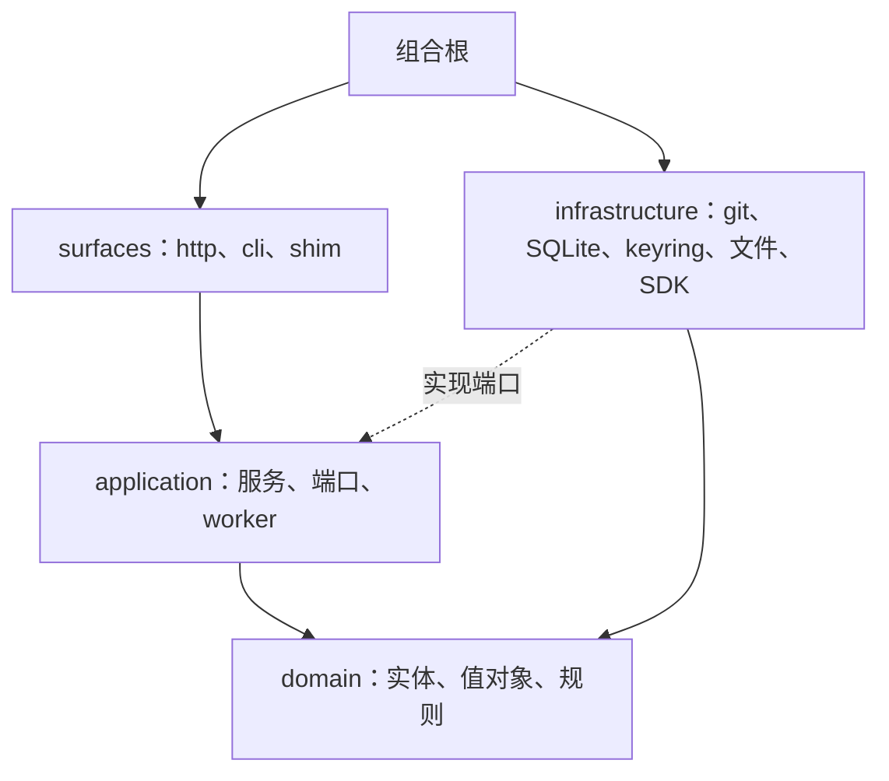
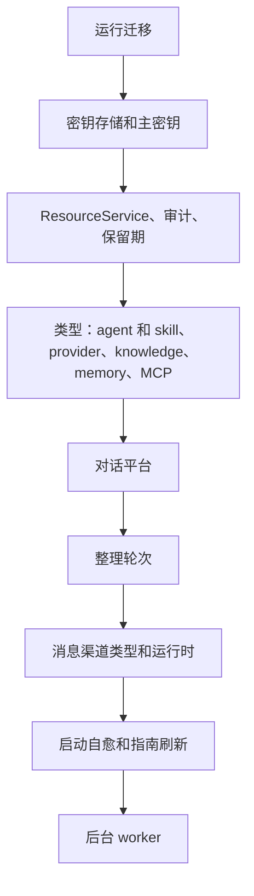

# 分层与代码布局 {#layering-and-code-layout}

Coffer 的后端是一个分层应用：界面层调用应用服务，应用服务使用纯领域对象，基础设施适配应用层定义的端口。这一页讲这些层、让分层不止是约定的导入契约、组合根如何显式接线每种类型、代码在树里该放在哪里，以及结构走样时让构建失败的门禁。添加模块、类型或依赖之前请先读它。

## 它要解决的问题 {#the-problem-it-solves}

Coffer 有七种资源类型、一个轮次平台、一个同步引擎和四个入口界面（REST、MCP、CLI、shim），而且大部分代码是和 AI 编程智能体一起写的。没有强制边界，这样的代码库会以可以预见的方式腐化：路由直接伸手进 SQLAlchemy；一个类型因为方便就导入另一个类型的服务；某个 SDK 从唯一需要它的适配器泄漏进领域层。每条捷径都很小，加在一起就让每次改动都牵一发而动全身。

Coffer 用两族规则来应对，每次构建都会检查：

1. **分层：** 依赖向内指，从界面层到应用层再到领域层，基础设施从外面插进来。
2. **类型隔离：** 任何类型都不导入另一个类型。只有组合根能同时看到两个类型。

## 各层 {#the-layers}


```mermaid
flowchart TB
  S["surfaces：http、cli、shim"]
  A["application：服务、端口、worker"]
  D["domain：实体、值对象、规则"]
  I["infrastructure：git、SQLite、keyring、文件、SDK"]
  CR["组合根"]
  S --> A
  A --> D
  I -.->|实现端口| A
  I --> D
  CR --> S
  CR --> I
```

| 层 | 放什么 | 可以导入 |
| --- | --- | --- |
| `domain/` | 实体、值对象和纯规则：`Resource`、`Kind`、`Scope`、审计事件名、错误码、每种类型的配置 schema 和领域逻辑。 | 标准库和 Pydantic。项目里的其他东西都不行，FastAPI、SQLAlchemy、`sqlite3`、httpx、`keyring`、anyio 也都不行。 |
| `application/` | 用例服务、它们需要的端口（Python `Protocol`）、后台 worker、类型工厂。 | `domain/`。不能导入 `surfaces/`，也不能导入 `infrastructure/`，但知识和记忆的文件底层有两个指名的例外。 |
| `infrastructure/` | 适配器：持久化、密钥存储、子进程和 HTTP 客户端、git、文件树 I/O、LLM 和智能体 SDK 的封装。 | `domain/`、`application/` 的端口。不能导入 `surfaces/`。 |
| `surfaces/` | 入口：FastAPI 应用和路由、Typer CLI、stdio shim，以及把一切接起来的组合根。 | 下面所有层。 |

架构风格由 [原则](/zh/architecture/principles) 固定；为什么选按层优先而不是垂直切片的布局，见 [Layer-First Code Layout](https://github.com/wyx-sg/Coffer/blob/main/docs/decisions/code-layout-layer-first.md)。

### 为什么按层优先、层内按类型分子目录 {#why-layer-first-with-kind-subdirectories}

每一层的根目录放与类型无关的模块，另外每种类型一个子目录：`domain/skill/`、`application/skill/`、`infrastructure/skill/`，以及 `surfaces/http/skill_routes.py`。所以一个类型的代码分布在四个目录里。另一种方案是 `kinds/<kind>/{domain,application,infrastructure,surfaces}` 这样的垂直切片，但它被否决了：它在四个层之外又加了第五个顶层概念，还会把每一次抽取共享代码都变成两个问题（「放哪一层？」和「放类型里面还是外面？」），而不是一个。垂直切片的好处在于团队隔离和独立部署，而单用户的本地应用两样都不需要。靠编辑器搜索，在一个类型的四个目录之间来回走很容易。

## 导入契约 {#the-import-contracts}

这些规则是 [`backend/pyproject.toml`](https://github.com/wyx-sg/Coffer/blob/main/backend/pyproject.toml) 里的 [import-linter](https://github.com/seddonym/import-linter) 契约，由 `make lint` 运行。`if TYPE_CHECKING:` 块里的导入不算，所以一个端口可以用另一个类型的类来*标注类型*，而不执行它的任何代码。用大白话说：

| 契约 | 内容 |
| --- | --- |
| 分层架构：surfaces > application > domain | 导入只能向内。领域模块从不导入应用模块；应用模块从不导入界面模块。 |
| 基础设施不导入界面层 | 适配器从不反过来伸手进路由或 CLI 命令。比如守护进程入口之所以自己读 `daemon.json`，而不是去问某个路由模块，就是这个原因。 |
| 应用层不导入基础设施 | 应用代码依赖它自己定义的端口。例外：`application.knowledge` 可以导入 `infrastructure.knowledge`，`application.memory` 可以导入 `infrastructure.memory`，因为这两个底层都只是很薄的文件 I/O 辅助代码，背后没有引擎，加一个端口纯属形式主义。 |
| 领域层是纯的 | 领域层不导入项目的其他层，也不导入 `fastapi`、`sqlalchemy`、`sqlite3`、`httpx`、`keyring` 或 `anyio`。 |
| keyring 只限于基础设施 | 界面层和应用层从不直接导入 `keyring`。 |
| CLI 不直接访问钥匙串 | `surfaces.cli` 完全不能导入 `infrastructure.secret`。CLI 只能通过守护进程的 HTTP API 接触密钥，所以在每台机器上，守护进程是主密钥唯一的读取者。 |
| 禁止跨类型导入（每种类型一条） | 九条对称的契约：`mcp`、`agent`、`skill`、`knowledge`、`channel`、`chat`、`provider`、`memory`、`sync`，每条都禁止该领域的模块导入其他领域的模块。指名的例外只涉及纯领域词汇：`provider` 和 `memory` 可以读 `domain.agent`，`channel` 可以读 `domain.chat`。`domain.knowledge` 和 `infrastructure.knowledge` 是共享底层。 |
| 与类型无关的核心不导入类型专属代码 | `resource_service`、`resource_scope_ops` 和 `resource_delete_ops`、`AuditService`、保留期服务和 worker、内置工具注册表、Coffer 自己的引擎模块、`domain.resource`、`domain.scope`、`domain.audit`、共享的基础设施包、通用的依赖提供者和通用路由，都不能导入任何类型。唯一获准的例外是 Alembic 的 `migrations/env.py`，它把每种类型的 ORM 模型导入到同一份 metadata 里。 |
| 引擎限定：markitdown | 只有消息渠道的附件提取器和知识上传转换器可以导入 `markitdown`（或 `docling`）。 |
| 已弃用的引擎处处禁止 | `llama_index`、`mem0`、`chromadb`、`sentence_transformers`、`sqlite_vec` 和 `fastembed` 在任何地方都不能导入。Coffer 不做任何 embedding，要重新引入就必须有意地修改这条契约。 |
| LangGraph 和 LangChain 限定在 infrastructure/llm | Coffer 自己的模型调用都走 `infrastructure/llm/`。领域层、应用层，以及对话、MCP、消息渠道、知识、持久化、密钥、守护进程和日志这些基础设施包，都不能导入 `langgraph` 或任何 `langchain*` 包；它们通过注入的端口接触模型。 |
| Claude Agent SDK 限定 | 领域层、应用层和其他基础设施包不能导入 `claude_agent_sdk`。它的归宿是 `infrastructure/chat`（智能体适配器）和 `infrastructure/agent`（读取已安装智能体的目录）。 |

当两个类型确实需要同一段代码时，它会搬到层根目录下一个与类型无关的包里：[`infrastructure/net/`](https://github.com/wyx-sg/Coffer/tree/main/backend/coffer/infrastructure/net)（SSRF 防护）、[`infrastructure/agent_files/`](https://github.com/wyx-sg/Coffer/tree/main/backend/coffer/infrastructure/agent_files)（`agent` 和 `memory` 共用的智能体对话记录读取器）、[`domain/hook_trust.py`](https://github.com/wyx-sg/Coffer/blob/main/backend/coffer/domain/hook_trust.py)（`memory` 类型上报、`agent` 类型的 Hook 列表显示的 Hook 信任值）。其他所有跨类型的东西，都通过消费方类型声明、组合根满足的端口来传递。比如 `application.chat.ports.ModelCatalogPort`，对话平台用它读取智能体类型的模型目录，而无需导入智能体类型。

## 组合根 {#the-composition-root}

组合根是唯一允许看到每种类型的代码。守护进程的组合根是 [`surfaces/http/app.py`](https://github.com/wyx-sg/Coffer/blob/main/backend/coffer/surfaces/http/app.py)，CLI 的是 [`surfaces/cli/main.py`](https://github.com/wyx-sg/Coffer/blob/main/backend/coffer/surfaces/cli/main.py)。

### 按类型显式接线 {#explicit-per-kind-wiring}

没有插件发现，没有全局注册表，也没有导入时的副作用。每种注册的类型在 `application/<kind>/kind.py` 里有一个以包名命名的工厂（`make_agent_kind`、`make_mcp_kind`、`make_provider_kind`……），它接收这个类型需要的服务，返回一个冻结的 [`Kind`](/zh/architecture/resource-framework#kind)。注册表的键可以和包名不同：MCP 类型注册为 `"mcp_server"`。对话和同步不注册类型。`surfaces/http/` 里每种类型有一个接线模块，负责构建这个类型的服务、调用工厂，并把结果存进应用级的字典 `app.state.kinds`：

| 接线模块 | 设置 |
| --- | --- |
| `agent_skill_wiring.py` | `"agent"`、`"skill"` |
| `provider_wiring.py` | `"provider"` |
| `knowledge_wiring.py` | `"knowledge"` |
| `memory_wiring.py` | `"memory"` |
| `app_mcp_composition.py` | `"mcp_server"` |
| `channel_wiring.py` | `"channel"` |

`ResourceService` 在构建时拿到同一个字典的引用，每次分发都读它。

### 接线顺序就是依赖顺序 {#wiring-order-is-the-dependency-order}

守护进程的 lifespan 按固定顺序执行，每一步都*返回*一个小的冻结 dataclass，装着它构建出的东西，下一步把它作为参数接收。没有哪一步通过 `app.state` 去找前面的步骤，所以参数列表本身就是依赖图。


```mermaid
flowchart TB
  M["运行迁移"] --> C["密钥存储和主密钥"]
  C --> R["ResourceService、审计、保留期"]
  R --> K["类型：agent 和 skill、provider、knowledge、memory、MCP"]
  K --> CH["对话平台"]
  CH --> CU["整理轮次"]
  CU --> CN["消息渠道类型和运行时"]
  CN --> H["启动自愈和指南刷新"]
  H --> W["后台 worker"]
```

[`kind_wiring.py`](https://github.com/wyx-sg/Coffer/blob/main/backend/coffer/surfaces/http/kind_wiring.py) 决定各类型自身的顺序：provider 在 agent 之后，因为它要投射进每个智能体的配置；memory 在 MCP 之前，这样网关的握手能说出记忆根目录；MCP 最后，这样它能拿到其他类型注册的每个内置工具。对话平台在所有类型之后接线，因为它内部的网关会话需要完整的内置工具注册表；消息渠道类型在对话之后，因为它通过对话的句柄驱动轮次。同步不需要任何类型的东西：它搬动的是保险库仓库里的文件，一轮同步改了东西之后，调和器会跑一轮，让每种类型重新投射新到的内容。

HTTP 路由器由 [`surfaces/http/routing.py`](https://github.com/wyx-sg/Coffer/blob/main/backend/coffer/surfaces/http/routing.py) 里的一张表统一纳入，这张表还会把某个实验功能前缀下的每个路由器放到该功能的请求时闸门后面。Typer 命令组在 `surfaces/cli/main.py` 里添加。

### 依赖提供者 {#dependency-providers}

FastAPI 依赖就是模块级的 `set_*` / `get_*` 函数对，背后是模块全局的单例。组合根在启动时对每个 setter 调用一次；路由把 getter 写成 `Depends()` 的目标；如果 getter 在 setter 之前被调用，它会抛出异常，而不是给路由一个 `None`。[`surfaces/http/dependencies.py`](https://github.com/wyx-sg/Coffer/blob/main/backend/coffer/surfaces/http/dependencies.py) 只放与类型无关的核心（actor、资源服务、审计、保留期、内部引擎配置）。每种类型从自己的模块发布自己带具体类型的函数对：`surfaces/http/mcp/dependencies.py`、`agent_dependencies.py`、`skill_dependencies.py`、`provider_dependencies.py` 等等，所以核心里没有任何东西被标注为 `Any`，也没有东西能把某个类型拉进来。测试覆盖的也是这些 setter。

## 代码树 {#the-code-tree}

```text
backend/coffer/
├── build_channel.py        # CHANNEL = "dev"; the release workflow stamps "stable"
├── main.py                 # ASGI entry: create_app()
├── domain/                 # pure; imports nothing from other layers
│   ├── resource.py         # Resource, Kind, name validation
│   ├── scope.py            # Scope and is_active, the one reach predicate
│   ├── audit.py            # audit event vocabulary
│   ├── errors.py           # error hierarchy and codes
│   ├── features.py         # experimental-feature registry
│   ├── reconcile.py        # the reconciler's items, differences and pure diff
│   ├── pagination.py       # the opaque cursor growing lists page by
│   ├── mcp/                # tool search and tiering, server config
│   ├── agent/              # agent config, facets, model catalogue
│   ├── skill/              # skill bundle values
│   ├── knowledge/          # catalogue and file values
│   ├── channel/            # channel config, envelopes
│   ├── chat/               # conversation, message, attachment, turn events
│   ├── memory/             # note, partition, budget, reader protocol
│   ├── provider/           # provider config, projection rules, local runtimes
│   ├── model_proxy/        # the state the daemon pushes the model proxy
│   ├── usage/              # usage records, stream usage readers, prices, ranges, quota
│   ├── vault/              # layout, storage classes, documents, format versions, writers
│   └── sync/               # round statuses, stops, joins, the deletion breaker, machines
├── application/            # each kind package holds its services, ports and make_<kind>_kind()
│   ├── resource_service.py # kind-agnostic CRUD, plus resource_*_ops.py
│   ├── audit_service.py
│   ├── retention_service.py # plus retention_registry.py, retention_worker.py
│   ├── builtin_tools.py    # BuiltinTool and its registry
│   ├── features.py         # FeatureService: pin, machine setting, channel default
│   ├── upkeep_runs.py      # passes in flight, in process
│   ├── attention.py        # the cross-kind "needs you" list and its source port
│   ├── reconcile/          # the unified reconciler: target port, loop, hints, drift source
│   ├── events/             # the change feed: numbered hints, replay buffer, attention watch
│   ├── runtime/            # supervised background tasks, event-loop lag probe, correlation ids
│   ├── secret/             # ref-to-secret resolver
│   ├── engine/             # which model Coffer's own passes run on
│   ├── fs/                 # browse, pick, open, editor
│   ├── mcp/                # gateway, supervisor, discovery, search_tools
│   ├── agent/              # agent services
│   ├── skill/              # skill services, builtin-skill seed
│   ├── knowledge/          # the write tool, curation, guide rendering
│   ├── channel/            # adapter protocol, pairing, inbound, runtime
│   ├── chat/               # turn orchestrator, runner, conversation service
│   ├── memory/             # aggregate, distil, delivery, session-start context
│   ├── provider/           # provider service, projection, projection target, proxy tokens and state
│   ├── usage/              # usage ingest, reports, subscription quota
│   ├── vault/              # validation rules, history and restore, problems
│   └── sync/               # the thin round, answers, join, rollback, worker
├── infrastructure/
│   ├── persistence/        # runs.db (SQLAlchemy, Alembic) and derived.db
│   ├── vault/              # the vault repository, its one writer, scanner, stores, the upgrade
│   ├── secret/             # encrypted store, master key; the only keyring user
│   ├── daemon/             # bootstrap, port, spawn, pid lock, daemon-config.json
│   ├── net/                # SSRF guard
│   ├── platform/           # the only code that knows the host OS
│   ├── logging/            # structlog setup, log files
│   ├── media_retention.py  # age sweep for the two attachment media dirs
│   ├── llm/                # LangChain models, completion, transcription
│   ├── agent_files/        # agent transcript readers shared by two kinds
│   ├── mcp/                # upstream subprocess and HTTP clients
│   ├── agent/              # agent config-file store
│   ├── skill/              # master store, delivery engine
│   ├── knowledge/          # paths, file tree, frontmatter, ripgrep
│   ├── channel/            # Telegram and SeaTalk transports
│   ├── chat/               # Claude SDK and Codex adapters, persistence
│   ├── memory/             # native-memory readers, store
│   ├── provider/           # provider introspector, local-runtime detection
│   ├── model_proxy/        # the local model proxy process and its supervisor
│   ├── usage/              # the proxy's usage spool, as the daemon reads it
│   └── sync/               # git over the vault, machine id and descriptor, local sync state
└── surfaces/
    ├── http/               # FastAPI app, composition root, routes, *_wiring.py
    │   └── chat/ knowledge/ mcp/ memory/
    ├── cli/                # Typer app and one module per command group
    └── shim/               # coffer-mcp-shim
```

`scripts/check_architecture_doc.py` 让这一页上的树与真实的包列表保持一致，所以增删包而不更新文档会让构建失败。

### 新代码该放在哪里 {#where-a-new-piece-of-code-goes}

| 你要添加的是 | 放在 |
| --- | --- |
| 没有 I/O 的值对象或规则 | `domain/<kind>/` |
| 一个用例，或它需要的端口 | `application/<kind>/` |
| 数据库表、文件树、子进程或 SDK 的适配器 | `infrastructure/<kind>/`，实现对应的端口 |
| 一个路由或 CLI 命令 | `surfaces/http/<kind>_routes.py` 或 `surfaces/cli/<kind>_cmd.py`；类型的生命周期动词来自 `surfaces/cli/_kind_verbs.py`，所以它的模块只添加自己特有的部分 |
| 把上面这些接起来 | 该类型的 `surfaces/http/<kind>_wiring.py` |
| 第二个类型现在也需要的东西 | 层根目录下一个与类型无关的模块 |
| 因操作系统而异的行为 | 基础设施层的平台部分，应用层通过它的平台端口访问（[平台端口](/zh/architecture/platform)） |
| schema 变更 | `infrastructure/persistence/migrations/versions/` 下一个新的 Alembic 迁移 |

## 前端 {#the-frontend}

[`frontend/src/`](https://github.com/wyx-sg/Coffer/tree/main/frontend/src) 里的 Web 界面用的是 React 18 加 TypeScript、Vite、React Router 6 和 TanStack Query 5，样式是基于 shadcn/ui 和 Radix 原语的 Tailwind。它没有自己的 API：每个页面都渲染在某项能力的 REST 契约之上。完整约定见 [`.agents/frontend.md`](https://github.com/wyx-sg/Coffer/blob/main/.agents/frontend.md) 和 [前端](/zh/contributing/frontend)。

| 路径 | 内容 |
| --- | --- |
| `pages/` | 每个路由一个页面，分列表和详情（`AgentsPage.tsx`、`AgentDetailPage.tsx`……）。详情页用 `lazyPage()` 做代码分割。 |
| `components/<feature>/` | 功能组件、对话框和表格。`DataTable`、`PageHeader`、`ScopeControl` 这类共享原语放在根目录；shadcn 组件在 `components/ui/` 下。 |
| `lib/hooks/` | 一个功能的所有 query 和 mutation 都放在一个 `useX.ts` 文件里。组件从不直接调用 `useQuery`。 |
| `lib/api/` | 按功能划分的请求函数，以及存放所有 query key 的 `queryKeys.ts`。 |
| `lib/api/generated/` | 由 `npm run codegen` 从每个规格的 `contracts/api.openapi.yaml` 生成的 TypeScript 类型，而这个 YAML 本身又是从后端模型生成的。它们与契约不一致时，`npm run lint` 会失败。 |
| `router.tsx` | 所有路由，用类型保持的身份来寻址（`/agents/:type`、`/mcp-servers/:name`、`/channels/:uid`）。 |
| `i18n/locales/` | `en.json` 和 `zh.json`，每种语言一份扁平目录。 |

没有按类型的 UI 注册表。需要 UI 的类型就添加页面、组件文件夹、hooks 文件、API 模块和路由，和其他任何功能一样。

同一份构建好的 `frontend/dist` 运行在三种宿主里，每种宿主都只是凭据的*提供方*，而不是一条单独的代码路径：守护进程把 `window.__COFFER_TOKEN__` 注入它提供的 `index.html`，桌面壳通过 IPC 提供同样的值，Vite 开发服务器则从 `~/.coffer/daemon.json` 读取它们。见 [安全模型](/zh/architecture/security#the-api-token)。

## 让结构保持诚实的门禁 {#gates-that-keep-it-honest}

只靠约定维持的结构，会被一条条方便的捷径逐步侵蚀，所以这一页上的每条规则都由 `make verify` 运行的门禁检查，本地和 CI 都跑。守住*结构*的是这些门禁：

| 门禁 | 强制执行什么 |
| --- | --- |
| `lint-imports` | 上面的每一条导入契约。 |
| [`scripts/check_file_sizes.py`](https://github.com/wyx-sg/Coffer/blob/main/scripts/check_file_sizes.py) | 文件大小上限：后端 Python 和桌面 Rust 最多 400 行；前端页面 200 行、组件 250 行、hooks 和工具函数 300 行。生成的文件不受限。 |
| [`scripts/check_response_models.py`](https://github.com/wyx-sg/Coffer/blob/main/scripts/check_response_models.py) | 每个 FastAPI 路由都声明 `response_model=`（流式和无响应体的用 `response_class=`），所以没有路由会返回未声明的 `dict`。 |
| [`scripts/check_architecture_doc.py`](https://github.com/wyx-sg/Coffer/blob/main/scripts/check_architecture_doc.py) | 这一页上的代码布局树，以及各架构页面上的内置工具列表，与代码一致。 |
| 平台检查门禁 | 平台部分以外的代码都不去问自己运行在哪个操作系统上。见 [平台端口](/zh/architecture/platform)。 |
| 契约新鲜度（`make lint`） | 每个规格的契约恰好就是后端模型生成的样子，并且每个对外提供的路由都属于某个规格。用 `make contracts` 重新生成。 |
| `make verify-contract` | 路由归属和 MCP 协议一致性。 |
| `mypy --strict` | 对 `backend/coffer` 做完整的静态类型检查，所以端口和它的适配器不可能悄悄不一致。 |

`make verify` 运行的完整门禁列表（包括规格、文档和前端门禁）见 [测试](/zh/contributing/testing#what-make-verify-runs)。

400 行的上限明显塑造了后端：`ResourceService` 把工作委托给 `resource_scope_ops.py`、`resource_rename_ops.py`、`resource_delete_ops.py` 和 `resource_kind_ops.py`，组合根也拆分在 `app.py`、`kind_wiring.py`、`routing.py`、`middleware.py` 和各类型的接线模块里。

## 权衡 {#trade-offs}

- **一个类型分布在四个目录里。** 为了只有一套关于依赖方向的心智模型，这是可以接受的；导航上的不便靠编辑器搜索弥补。
- **要维护两族规则。** 跨类型契约是九段几乎一样的配置，靠手工保持对称：每种类型在自己的契约里作为源出现，在其他每条契约里作为被禁止的对象出现。
- **显式接线比较啰嗦。** 每种类型的服务都在它的接线模块里手工构建。换来的是不需要推敲发现顺序，也不会有导入副作用意外地注册了什么东西。

## 在代码里的位置 {#where-it-lives-in-the-code}

| 路径 | 内容 |
| --- | --- |
| [`backend/pyproject.toml`](https://github.com/wyx-sg/Coffer/blob/main/backend/pyproject.toml) | import-linter 契约，在 `[tool.importlinter]` 下。 |
| [`backend/coffer/surfaces/http/app.py`](https://github.com/wyx-sg/Coffer/blob/main/backend/coffer/surfaces/http/app.py) | 守护进程的组合根和 lifespan。 |
| [`backend/coffer/surfaces/http/kind_wiring.py`](https://github.com/wyx-sg/Coffer/blob/main/backend/coffer/surfaces/http/kind_wiring.py) | 类型接线顺序。 |
| [`backend/coffer/surfaces/http/routing.py`](https://github.com/wyx-sg/Coffer/blob/main/backend/coffer/surfaces/http/routing.py) | 路由器表。 |
| [`backend/coffer/surfaces/cli/main.py`](https://github.com/wyx-sg/Coffer/blob/main/backend/coffer/surfaces/cli/main.py) | CLI 的组合根。 |
| [`Makefile`](https://github.com/wyx-sg/Coffer/blob/main/Makefile) | `make lint`、`make verify` 和其他门禁。 |
| [`.agents/stack.md`](https://github.com/wyx-sg/Coffer/blob/main/.agents/stack.md) | 技术栈和代码风格规则。 |

## 相关 {#related}

- [Layer-First Code Layout](https://github.com/wyx-sg/Coffer/blob/main/docs/decisions/code-layout-layer-first.md)
- [Resource Framework Designed Upfront](https://github.com/wyx-sg/Coffer/blob/main/docs/decisions/resource-framework-upfront.md)
- [资源框架](/zh/architecture/resource-framework)
- [设计原则](/zh/architecture/design-principles#extract-on-second-use)
- [测试](/zh/contributing/testing)
