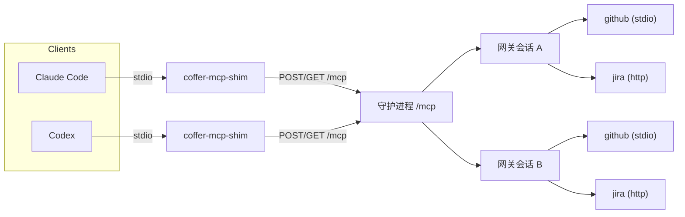
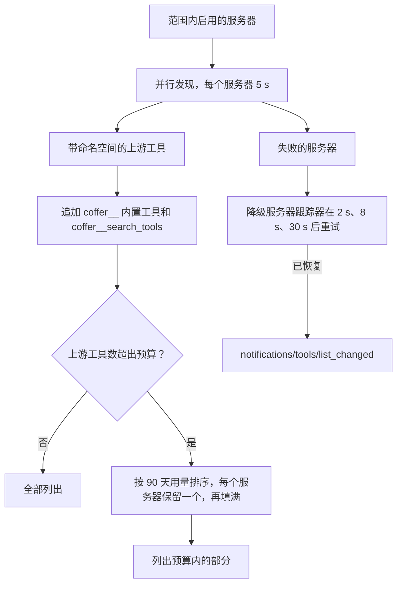
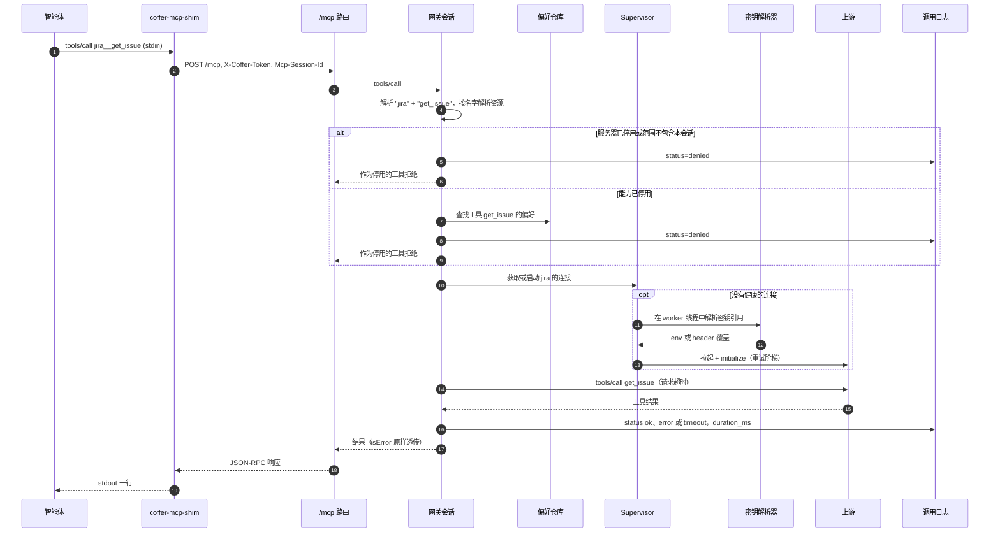
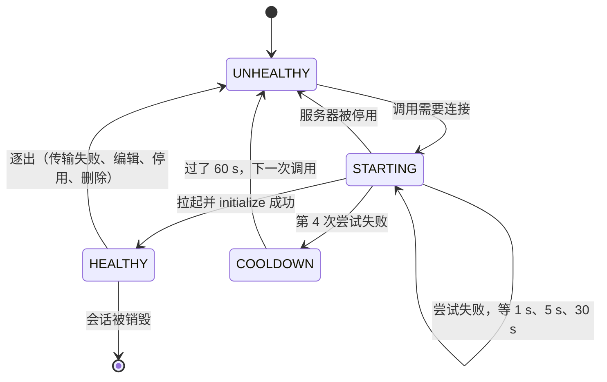

# MCP 网关 {#mcp-gateway}

这一页讲守护进程如何把许多上游 MCP 服务器变成一个供每个智能体连接的 MCP 服务器。它面向想了解 `/mcp` 和 `coffer-mcp-shim` 背后机制的工程师：会话怎么创建，为什么每个会话拥有自己的上游进程，工具列表怎么合并和裁剪，以及每次 `tools/call` 时发生了什么。

## 问题 {#the-problem}

同时用好几个编程智能体的开发者，会在每个智能体自己的配置文件里注册同一批 MCP 服务器，把同样的密钥粘贴进每一份。于是每个智能体都拉起自己的一套副本，而每套副本看到的都是开发者配置的不同子集。

网关把这变成每个服务器只注册一次。每个智能体的配置里恰好只有一个 MCP 条目 `coffer`，它启动 `coffer-mcp-shim`。在它后面，守护进程聚合每个启用的上游服务器的工具、资源和提示词，应用所有者的整理（按能力的开关、按智能体的范围），并记录它转发的每一次调用。

聚合本身也带来问题。用户一旦注册了几个服务器，合并后的目录就会超过模型能可靠选工具的界限，大约是 30 到 50 个工具。网关用两种方式应对：只列出目录中有预算限制的一部分，并提供一个能找到其余工具的搜索工具。

## 设计决策 {#design-decisions}

| 决策 | 理由 |
| --- | --- |
| Coffer 对下游是一个 MCP 服务器，对上游是一个 MCP 客户端。 | 每个智能体只需要一个配置条目，而网关可以在中间自由地改写、过滤和记录。 |
| 每个下游会话都有自己的上游进程。 | MCP 是按会话的协议。在多个客户端之间共享一个上游会话，意味着要在网关里重新实现能力协商和通知路由。 |
| 上游惰性拉起。 | 会话启动快，智能体从不碰的服务器不花任何成本。 |
| 名字改写为 `<server>__<name>` 和 `coffer://<server>/<uri>`。 | 两个都暴露 `search` 的服务器永远不会冲突。选 `__` 是因为 `:`、`.`、`/` 和 `-` 在上游工具名里都是合法字符。 |
| 能力实时发现，只存偏好。 | 上游升级不会留下一份过期的 schema 副本。用户的启用或停用决定在升级和暂时消失之后依然保留。 |
| 列出有预算，调用没有。 | 分层决定模型看到什么，从不决定模型能调用什么。 |
| 智能体身份只在握手时取一次。 | 范围闸门和内置工具的归属需要每个会话一个身份，而且客户端不能逐次调用地更改。 |
| 调用日志不记参数和结果。 | 日志的用途是显示哪项能力在什么时候跑了、跑了多久、结果如何。载荷里可能有密钥。 |
| 自定义工具是第三种上游传输方式，而不是一种新类型。 | 由网关自己发出的 HTTP 请求可以免费获得命名空间、生效范围和停用闸门、日志、审计和同步；单独做一个类型就要把这些全都重复一遍。 |

## 拓扑 {#topology}



会话 A 和会话 B 各自持有自己的 `github` 进程。有 N 个已连接客户端和 M 个启用的服务器时，最坏情况是 N × M 个上游连接。在单用户机器上，N 通常是两三个，而且只有会话真正列出或调用过的服务器才会被启动。

## 端点与 shim {#the-endpoint-and-the-shim}

### `/mcp` {#mcp}

守护进程在 `127.0.0.1:<port>` 的根上挂载 `/mcp`。每个请求都必须在 `X-Coffer-Token` 里带上守护进程令牌（与 REST API 是同一个令牌）。令牌错误或缺失得到 `401`。回环 `Host` 守卫在这里和在其他路由上一样生效。

- **`POST /mcp`** 接收一个 JSON-RPC 信封。第一个不带 `Mcp-Session-Id` 头的请求到来时，守护进程分配一个 UUID，并在这个头里返回。之后每个请求都带上它。守护进程不认识的会话 ID（空闲回收器丢掉了该会话，或守护进程重启过）对除 `initialize` 之外的请求都回答 `404`，让客户端重新握手，新会话带着那次握手里的智能体身份；以 `__` 开头的 ID 永远不会被当作会话 ID。处理方式取决于信封：
  - `initialize` 由网关会话自己回答，`ping` 返回 `{}`。
  - 没有 `id` 的消息是通知，返回 `202`，没有响应体。
  - 有 `id` 但没有 `method` 的消息，是客户端对服务器发起的请求（`sampling/createMessage` 或 `roots/list`）的回复。它会被匹配到正在等待它的那个服务器请求，并以不带响应体的 `202` 确认。
  - 批量请求（顶层是数组）以 `-32600` 拒绝。
- **`GET /mcp`** 打开一条 Server-Sent Events 流，用于服务器到客户端的消息。它要求带一个存活会话的 `Mcp-Session-Id`（否则 `404`）。打开着的流会让其会话不被空闲回收器回收。消息在一个按会话的队列里等待，上限 1000 条。队列满时丢掉最旧的消息。

SSE 流关闭时会话仍然保持打开，因为 shim 会经常重连。会话有三种结束方式：空闲回收、守护进程关闭或被销毁。回收器每 60 秒醒来一次，丢掉 30 分钟内既没有 POST 也没有上游流量、且没有请求正在进行的会话（`coffer__ask` 会等所有者好几个小时）。两个值都可以用 `COFFER_MCP_SESSION_REAPER_INTERVAL_S` 和 `COFFER_MCP_SESSION_IDLE_S` 修改。销毁会话之前，回收器会最多等约 5 秒让进行中的 POST 完成，所以正在运行的请求永远不会碰到一个销毁了一半的会话。

### `coffer-mcp-shim` {#coffer-mcp-shim}

智能体说的是 stdio MCP，所以由 `coffer-mcp-shim` 把 stdio 桥接到 `/mcp`：

1. **找到守护进程，或者启动一个。** shim 读取 `~/.coffer/daemon.json` 并探测 `GET /api/v1/daemon/status`。如果 1 秒内没有守护进程应答，它以分离方式拉起一个，最多等 10 秒。如果守护进程还是起不来，shim 以退出码 `3` 退出，并指向 `~/.coffer/logs/daemon.log`。如果守护进程报告的版本与 shim 不同，shim 在 stderr 上打印一行警告然后继续。见 [守护进程与进程](/zh/architecture/daemon)。
2. **在握手上盖章。** 在 `initialize` 信封里，shim 写入 `params._meta["coffer/cwd"]`（它的启动目录）。如果它是以 `--agent-uid <uid>` 启动的，还会写入 `params._meta["coffer/agent-uid"]`。它会缓存这个信封以便之后重放。如果它的环境里设置了 `COFFER_TURN_TOKEN`（该智能体进程正在运行 Coffer 发起的对话轮次），它还会把它作为 `X-Coffer-Turn` 头随每个请求发出，重放的握手也不例外。网关只向头里指向一个存活轮次的会话提供 `coffer__ask`；见 [MCP 工具参考](/zh/reference/mcp-tools#coffer-ask)。
3. **泵送 stdin。** 每一行 stdin 都作为一个独立任务 POST 出去。所以一个慢的 `tools/call` 不会把后面的 `ping` 堵住。单行上限 64 MiB。
4. **排空 SSE。** shim 一直保持 `GET /mcp` 打开，把每个 `data:` 载荷写到 stdout。如果流断了，它会带退避重连，从 0.5 秒开始，最多增长到 5 秒。
5. **从守护进程重启中恢复。** 如果一次 POST 在传输层失败，shim 会重新读取 `daemon.json`。如果现在有一个活着的守护进程在不同端口或用不同令牌应答，shim 会重新绑定，重放缓存的 `initialize`（不转发第二次的回复），并重试这次调用一次。来自旧守护进程的 401（在同一端口重启会轮换令牌）也按同样方式处理，守护进程已丢掉会话时的 `404` 也一样：shim 重放缓存的 `initialize`，再重发那次没有运行过的调用。重试从不会让一个工具跑两次：只有在连接被拒绝或超时时，也就是旧守护进程根本没看到这个请求时，才会重发 `tools/call`。如果 POST 是在请求发出之后失败的（读超时、响应途中被重置、协议错误），旧守护进程可能已经跑过这个工具了。shim 仍然会重新绑定，让后续调用能正常工作，但会用一个 `-32603` 错误回答这个请求，说明守护进程在调用中途重启了，这次调用可能跑了也可能没跑。其他所有方法都会重发，因为它们没有副作用。

stdout 就是 MCP 的传输线，所以 shim 在写入之前会校验每一个回复。HTTP 错误或非 JSON 响应体会变成针对该请求 id、代码为 `-32603` 的合成 JSON-RPC 错误。诊断信息写到 `~/.coffer/logs/shim-<pid>-<epoch>.log`，从不写到 stdout。

Coffer-MCP 安装（见 [智能体](/zh/guides/agents)）写入的 `coffer` 条目带 shim 的绝对路径和 `--agent-uid <uid>`。参数解析器不接受缩写的选项，所以像 `--agent` 这样的前缀永远不会被当作 `--agent-uid`：这样的条目不上报身份，而不是在该放 uid 的地方传一个名字。

## 会话与身份 {#sessions-and-identity}

网关会话是按会话的路由对象。组合根为每个会话 id 构建一个。每个会话拿到：

- 一个全新的 supervisor，拥有这个会话的上游连接；
- 一个全新的发现模块，保存实时列表和一个 60 秒的缓存；
- 共享的能力偏好、调用日志和内置工具注册表。

在 `initialize` 时，会话记录客户端声明的能力、启动时的 cwd，以及 `_meta["coffer/agent-uid"]` 里的智能体 uid。身份在整个连接期间固定不变，用在两个地方：

- **范围。** 会话列出启用的 `mcp_server` 资源，保留范围允许它的智能体 uid 的那些。`null` 范围允许每个会话。有范围的服务器只允许它点名的 uid 对应的智能体。没有上报身份的会话只能看到没有范围限制的服务器。它看到的只会更少，从不会更多。
- **内置工具归属。** 每次调用内置工具时，会话都会把 uid 解析为智能体当前的名字，并把这个名字作为 `agent` 参数写进调用，写之前先移除客户端提供的任何 `agent`。没有任何内置工具在它的 schema 里公布 `agent`。

::: info 信任边界
身份是自报的，没有经过验证。任何持有令牌的本地进程都能打开 `/mcp` 并声称自己是任意 uid。在 [安全模型](/zh/architecture/security) 所描述的仅限回环、单用户的姿态下，这是可以接受的。
:::

`initialize` 的回复声明 `tools`、`resources` 和 `prompts`，每项都带 `listChanged: true`，协议版本为 `2025-06-18`。它还带一段上限 800 个字符的 `instructions` 字符串。这段文字说明 Coffer 是什么，点出 Coffer 自己的工具，说明对于 Coffer 没有工具的东西智能体该去哪里读（用它自己的文件工具读取和编辑知识与记忆文件，用 `coffer log` 系列读取器读 Coffer 自己的记录），其他一切都指向 `coffer-guide` 技能。当会话最近一次 `tools/list` 有工具没被列出时，这段文字会加一句话，给出未列出工具的数量，并说明它们每一个都仍然可以调用。

## 发现与命名空间 {#discovery-and-namespacing}

发现模块向上游请求 `tools/list`、`resources/list` 和 `prompts/list`。它按（会话、服务器、类型）把每张列表缓存 60 秒，并把名字改写进网关的命名空间：

| 能力 | 上游 | 呈现为 |
| --- | --- | --- |
| 工具 | `get_issue` | `jira__get_issue` |
| 提示词 | `summarize` | `jira__summarize` |
| 资源 | `file:///notes.md` | `coffer://jira/file:///notes.md` |

解析时按第一个 `__` 切分，所以这个类型拒绝任何包含 `__` 的服务器名。由于服务器名是智能体看到的每个工具名的前缀，而智能体的权限规则和技能都会引用它，所以名字一经注册就固定了：修改会以 `409 NAME_IMMUTABLE` 被拒绝。服务器旁边没有单独的显示标题；它的描述就是自由备注。客户端会在上面再加自己的前缀（Claude Code 显示为 `mcp__coffer__<server>__<tool>`），而模型提供商的 API 把工具名限制在 64 个字符（Cursor 会丢掉超过 60 个字符的工具）。所以服务器名上限 24 个字符，给上游工具名留出 25 个字符；每一行发现的能力都带 `client_name_length`，即 `mcp__coffer__<server>__<tool>` 的长度；**工具** 标签页会标出超过 64 的行。对 `resources/list` 或 `prompts/list` 回答 `-32601`（method not found）的上游，被视为没有这项能力，而不是视为失败。

每次冷获取还会在 `derived.db` 里记录每项能力首次和最近一次被看到的时间，以服务器的 uid 为键。你的开关是另一份单独的保险库文档 `state/mcp-preferences/<server>.json`，只列出你关掉的能力，所以你停用的工具即使消失后又回来，也仍然是停用的，而且这个开关会随保险库同步一起传输。每次列出时都重新读取偏好，所以无论缓存里是什么，切换开关都立即生效。

当一次发现请求因超时或 method-not-found 之外的任何原因失败时，发现模块会逐出这个连接，拉起一个新的并重试一次。一个悄悄断掉的连接会在下一次列出时被修复，不需要重启守护进程。

## `tools/list`：聚合、加入内置工具、分层 {#tools-list-aggregate-add-built-ins-tier}



**扇出。** 网关并发查询每个可见的服务器，并给每个服务器一个 5 秒的硬预算。超时或不可用的服务器会被排除在外，并按名字记录日志。密钥无法解析的服务器（密钥缺失，或密钥存储已锁定）也一样。列表的其余部分不受影响。没有这个预算，一个挂掉的上游就可能让整个响应等完 supervisor 的整条重试阶梯。

**降级恢复。** 客户端会缓存 `tools/list`，而一个从没连上的服务器发不出 `list_changed`。所以一个降级服务器跟踪器会记下失败的服务器名，在后台于 2、8 和 30 秒后重试它们。第一次恢复时，它使这个服务器缓存的工具列表失效，并向下游发送 `notifications/tools/list_changed`，客户端就会重新列出。

**内置工具。** 接着，列表里加入注册表当前持有的每个内置工具，前缀为 `coffer__`，再加上 `coffer__search_tools`。

### 按预算分层 {#budget-driven-tiering}

策略是 MCP 领域包里的一个纯函数；网关给它喂用量计数：

1. 把列表分成内置工具（名字以 `coffer__` 开头）和上游工具。内置工具总是列出，不计入预算。
2. 如果上游工具的数量不超过预算（默认 50，`COFFER_TOOL_TIERING_BUDGET`），全部列出。
3. 否则，按过去一段窗口（默认 90 天，`COFFER_TOOL_TIERING_WINDOW_DAYS`）内的调用次数从高到低给上游工具排序。并列时保持目录顺序：服务器按列出顺序，每个服务器的工具按它自己的 `tools/list` 顺序。
4. 沿着排序走，取每个服务器的第一个（排名最高的）工具，这样每个可见服务器至少保留一个被列出的工具。如果服务器比预算名额还多，预算优先，这一部分覆盖尽可能多的服务器。
5. 剩余名额按排序依次填满。
6. 按原始目录顺序输出选中的工具。被排除的数量由 `initialize` 的说明文字报告：握手时根据发现流程最近保存的工具列表估算，紧随其后的列表会用真实数量替换这个估算值。

用量来自对调用日志（`mcp_invocations`）里窗口起点以来的工具调用做的一次分组查询，按 uid 关联到资源表，所以计数归属于注册的服务器，而不是调用时带的随便什么名字。所有状态的调用都算。出错的调用仍然说明智能体想用那个工具。

分层只影响列出什么：

- `tools/call` 的闸门看能力偏好和范围，从不看是否在列表里。一个未列出的工具的路由方式和列出的完全一样。
- `coffer__search_tools` 搜索的是未分层的完整目录。
- 分层失败时放开。`COFFER_TOOL_TIERING=off` 会列出一切，用量查询抛出任何异常时也一样。只有字面值 `off` 才会关闭分层，所以打错字时分层仍然开着。预算或窗口值缺失、不是数字或不是正数时，回退到默认值。

::: tip 为什么看用量而不是配置
新的保险库没有历史，但工具也少，所以会走预算以内的分支，看到全部工具。只有当用量积累到足以产生影响时，它才开始塑造列表。手动白名单在有人配置之前什么都不做，而没有配置的默认状态恰恰是工具过载最伤人的地方。
:::

## `coffer__search_tools` {#coffer-search-tools}

`coffer__search_tools` 是网关自己的工具。它由网关自己回答，而不经过内置工具注册表，因为它的数据就是实时聚合的结果。

```text
coffer__search_tools(query: string, top_k?: integer = 5, 1..20)
  -> { tools: [{ name, description, inputSchema, score }], total_searched }
```

它不分层地聚合可见服务器的工具，去掉所有 `coffer__` 工具，然后给其余工具排序。排序器是一个确定性的简化版 BM25：

- **分词。** 按 camelCase 边界切开，文本转小写，保留 `[a-z0-9]+` 连续串。名字文本是 `"<server> <tool>"`。先把命名空间切开，这样服务器 token 只算一次，而不是两次。
- **词频。** 每个名字 token 加 `3.0`，每个描述 token 加 `1.0`。文档长度是它的权重之和。
- **得分。** 对工具中出现的每个不同查询词 `t`：
  `idf(t) = ln(1 + (N - df + 0.5) / (df + 0.5))`，这个词贡献
  `idf(t) · f · (k1 + 1) / (f + k1 · (1 - b + b · len / avg_len))`，其中 `k1 = 1.5`，`b = 0.75`。
- **输出。** 得分为零的工具被丢掉。并列时保持目录顺序。返回前 `top_k` 个（默认 5，限定在 1–20）。为一份目录建的索引会被缓存，以这份目录本身为键，最多缓存 8 份目录。

返回的是真实的上游 schema，名字就是智能体可以直接调用的名字。这个工具从不替智能体调用任何东西。搜索期间发现失败的服务器会被跳过，不重试。重试归 `tools/list` 路径负责。

## 内置工具 {#built-in-tools}

内置工具注册表是一个进程内注册表，由组合根在启动时填充。每个模块声明一个内置工具，带一个不带前缀的名字、一段描述、一份输入 schema、一个处理函数，以及（可选的）它所属的实验功能。网关把它列为 `coffer__<name>`。注册表拒绝重名，也拒绝已经带前缀的名字。

| 工具 | 声明方 |
| --- | --- |
| `coffer__search_tools` | 网关自己（网关自有） |

`coffer__search_tools` 由网关自己持有，始终存在。对任何其他 `coffer__` 名字的调用都会落到上游路由，并像一个未知工具那样失败。知识和记忆没有内置工具：智能体用自己的文件工具修改它们，所以注册表里没有对应任何一个的工具。

内置工具的处理函数运行之前，网关会按上面所说设置 `agent`。当工具的 schema 声明了 `cwd` 属性而客户端没填时，它还会填上 `cwd`。处理函数的返回值被包装成一个 MCP 工具结果：`content` 里是 JSON 文本，`structuredContent` 里是同一个对象，`isError: false`。处理函数内部的异常会变成带内的 `isError: true` 结果，而不是 JSON-RPC 错误，这样模型能读到它并自我纠正。文本会显示 Coffer 编写的错误和无效值错误的消息，其他异常只显示异常的类型名。工具的具体行为见 [MCP 工具](/zh/reference/mcp-tools)。

## 一次 `tools/call` 的生命周期 {#lifecycle-of-a-tools-call}



`resources/read` 和 `prompts/get` 也共用这条流水线，区别只在于解析器和上游方法：

1. **解析。** 切分带命名空间的名字或 URI。格式错误的作为停用的工具拒绝（"unrecognised tool name"）。
2. **解析资源。** 按客户端发来的服务器名查找 `mcp_server` 行。从这里开始，所有存储或比较都使用身份：日志用 uid，闸门用范围，偏好用 uid。
3. **启用闸门。** `enabled` 标志关闭的服务器，每次调用都被拒绝，记为 `denied`，作为停用的工具拒绝。列表里已经把它隐藏了，但在它被停用之前列出过它的会话仍然持有它的名字。
4. **范围闸门。** 按服务器的范围和会话的智能体 uid 重新检查这次调用。列表已经隐藏了这个服务器，但知道名字的客户端仍然可以调用它。拒绝会记为 `denied` 并作为停用的工具拒绝，与停用的能力得到的错误相同。
5. **能力闸门。** `enabled = false` 的偏好行以同样方式拒绝调用。没有这一行视为启用。
6. **连接。** 会话的 supervisor 返回一个活着的连接，必要时启动一个。会话订阅这个上游的通知和服务器发起的请求。计时在这里已经开始，所以因为上游起不来而失败的调用也会被记录。
7. **转发。** 用原始名字发送调用，受服务器的请求超时限制。
8. **记录。** 无论调用成功还是失败，都写一行，带经过的时间。

### 密钥具体化 {#secret-materialisation}

服务器配置里从不保存密钥。stdio 服务器的 `env` 和 HTTP 服务器的 `headers` 拒绝看起来像令牌的值（`Bearer …`、`ghp_…`、`sk-…`、JWT 前缀等）。密钥在 `secret_refs` 里指名，这是一个从环境变量名或 header 名到密钥引用的映射。

拉起时，密钥解析器在一个 worker 线程里运行，从加密存储中把引用变成明文：

- **stdio。** 子进程的环境是 MCP SDK 默认的最小白名单（`PATH`、`HOME`、`SHELL` 等），加上服务器的静态 `env`，再加上具体化的密钥。守护进程自己的环境变量不会被继承，所以上游读不到守护进程启动时带的令牌。
- **HTTP。** 静态 header 与具体化的 header 在客户端上合并。

明文只存在于子进程的环境或内存里的 HTTP 客户端中，从不持久化，也从不记日志。缺失的引用以密钥缺失错误失败，不重试。见 [密钥存储](/zh/guides/secret-store) 和 [安全模型](/zh/architecture/security)。

## 进程监管 {#supervision}

每个会话的 supervisor 为每个服务器名保存一个条目。



- **重试阶梯。** 最多尝试四次，之间分别等 1、5 和 30 秒。只重试暂时性的拉起失败：上游不可用或超时，以及操作系统错误、连接错误和超时错误。配置错误、密钥错误或取消会立刻终止阶梯。每次尝试受服务器的 `spawn_timeout_seconds` 限制（默认 30，范围 5–120）。
- **冷却。** 第四次失败之后，条目进入 60 秒的冷却期。冷却期间的调用以上游不可用快速失败。在拿到按服务器的拉起锁之前和之后都会检查冷却，所以排在一条失败阶梯后面的调用方不会每个都再跑一遍。
- **并发。** 每个 supervisor 同时最多跑 4 个冷启动（`COFFER_MCP_MAX_CONCURRENT_SPAWNS`）。名额只在构建和 initialize 期间占用，退避睡眠期间从不占用。
- **逐出。** 逐出不拿锁。它把代数计数器加一，并关闭当前连接。在逐出之后才完成的拉起会看到代数变了，于是关闭它的新连接并抛出异常。因此删除、停用或编辑一个服务器从不需要等一条慢吞吞的阶梯。这个类型的删除、停用和配置编辑 Hook 会把服务器从每个活动会话的 supervisor 中逐出，也从支撑管理路由的进程级 supervisor 中逐出。配置编辑之后，下一次调用会用新的命令、URL 或密钥引用拉起服务器；重新启用什么都不用做，因为下一次调用会重新拉起。
- **崩溃恢复。** 在传输层失败的 `tools/call` 会逐出连接，下一次调用会重新拉起服务器。传输失败指任何不是 MCP 协议错误的异常，或说明连接已关闭的 MCP 错误。其他格式正确的 MCP 错误说明上游应答了，所以连接保留。超时也不逐出，一开始就没拿到连接的失败也不逐出。
- **拆除。** stdio 关闭时最多等 10 秒让 SDK 自己关停，SDK 会从 SIGTERM 升级到 SIGKILL。连接自己的生命周期任务先关闭进程及其管道，然后连接杀掉为它记录的每个 PID 及其所有后代。每次拉起都会在 `~/.coffer/upstream-pids/` 下记录一个 PID 文件（PID 取自 SDK 创建的那个进程，而不是靠比对守护进程的其他子进程来猜），以服务器的 uid 为键。启动时，守护进程会清扫崩溃遗留的文件。
- **日志。** 每个 stdio 上游的 stderr 写到它自己的文件 `~/.coffer/logs/upstream/<name>.log`，而不是 `daemon.log`。

守护进程还为管理路由运行一个进程级的 supervisor 和发现模块：`GET …/capabilities`、`POST …/refresh` 以及能力开关。范围从不限制这些路由，所以你总能测试一个没有任何会话被允许看到的服务器。

### 测试一个服务器 {#testing-a-server}

一个探针同时服务两种测试：对已注册服务器的 `POST /api/v1/resources/mcp_server/{uid}/test`，以及对添加对话框尚未保存的配置的 `POST /api/v1/resources/mcp_server/test-config`。它在所有 supervisor 之外建一个全新的连接，运行 `initialize` 和 `tools/list`（服务器声明了资源和提示词时还会计数），返回工具、计数、最新的 20 行 stderr，失败时还有一个代码：`url_refused`、`spawn_failed`、`exited`（带退出状态）、`timeout`、`initialize_failed`、`connect_failed` 或 `stored_secret_not_released`。

- **时间限制。** 整个测试在 30 秒内结束；服务器自己的拉起和请求超时都被它封顶。
- **进程组。** stdio 服务器在 `/bin/sh` 下运行，sh 会等它结束并在 stderr 上打印退出状态，所以提前退出时会报告退出码。它的 stderr 写到一个私有临时文件，而不是服务器的日志。测试结束时（通过、失败、超时，或客户端离开——路由会监视断开并取消），整个进程组先收到 SIGTERM 再收到 SIGKILL，这也能覆盖到服务器在父进程退出后 fork 出的孙进程。
- **密钥。** 已注册服务器的测试会像拉起时一样，通过它已批准的绑定释放密钥。未保存的配置从不会拿到已存储的密钥：引用了已存储密钥的配置（测试请求里的 `secret_refs`）不会被启动，并返回 `stored_secret_not_released`。在表单密钥行里输入的值只对这次测试生效，而且每一个都会从 stderr 行和消息里抹去。
- **保留什么。** 已注册服务器的测试会像以前一样把结果写进服务器的健康行。未保存的测试什么都不写：没有资源、健康行、调用记录或审计事件。在表单里输入的 URL 会先经过 SSRF 防护（见 [安全 → 出站请求](/zh/architecture/security#outbound-requests)）。

### 内置的 `coffer` 服务器 {#the-built-in-coffer-server}

MCP 服务器页面把 Coffer 自己的端点列在最后，归在「内置」下。它不是资源：`GET /api/v1/mcp/builtin` 根据守护进程已知的信息来描述它：绑定的端口（`http://127.0.0.1:<port>/mcp`）、上面的内置工具列表、MCP 配置里有 Coffer 条目的智能体（由组合根提供，因为 MCP 类型不能读取智能体类型），以及以保留 uid `coffer` 记录的最近 24 小时调用。它的「调用记录」标签页读取 `GET /api/v1/mcp/invocations?uid=coffer`。

## 通知与服务器发起的请求 {#notifications-and-server-initiated-requests}

会话对它碰到的每个上游惰性订阅：

- `notifications/tools/list_changed`、`resources/list_changed` 和 `prompts/list_changed` 会使会话缓存里对应的部分失效，并转发给下游。
- `notifications/resources/updated` 在把 URI 改写为 `coffer://<server>/…` 后转发。
- `notifications/message` 和 `notifications/progress` 被丢掉。工具调用受该服务器的请求超时约束；Coffer 不向上游索要进度，所以没有什么会延长这个超时。
- 上游发来的 `sampling/createMessage` 和 `roots/list` 通过 SSE 转给这个会话自己的客户端，并按 id 与客户端的回复匹配，超时 30 秒。只有客户端在 `initialize` 时声明了 `sampling`，才会转发采样请求。

## 调用日志 {#invocation-logging}

每一次被路由的调用，包括内置工具的调用，无论成功还是失败，都会写一行 `mcp_invocations`：哪项能力跑了、跑了多久、`status` 是什么（`ok`、`error`、`timeout` 或 `denied`）、来自哪个会话，以及会话上报了身份时是哪个智能体（`agent_uid`）。参数和结果从不保存，错误文字会简化成 Coffer 编写的摘要（对于上游返回的格式正确的 JSON-RPC 错误，只保留它的数字代码：`upstream answered with a JSON-RPC error (code -32602)`），因为上游的消息可能把密钥回显出来，比如一条引用了 key 的认证失败信息。内置工具以保留 uid `coffer` 记录。

这一行的各列、每个状态的确切含义、缓冲写入器和保留期，统一在 [可观测性](/zh/architecture/observability#the-mcp-invocation-log) 里描述。你可以按服务器读日志（`coffer log mcp --server <server>`），也可以跨所有服务器读（`coffer log mcp`）；见 [活动与审计](/zh/guides/activity)。

### 服务器状态 {#server-status}

`GET …/{uid}/status` 先读 **测试** 持久化的健康行。如果没有健康行，就从最近 20 次到达该服务器的调用中最新的一次推导状态；`denied` 行被跳过，因为被拒绝的调用说明不了上游的任何情况。上游应答了的 `error`，无论是 `isError` 工具结果还是格式正确的 JSON-RPC 错误，都表示工具在一条健康的连接上失败了，读作 `healthy`。只有 `timeout`，或者上游没有应答的 `error`（起不来、传输断了、进程崩溃），才读作 `failing`。如果没有这样的行，服务器有已发现的能力时为 `healthy`，否则为 `unknown`。

## 错误传播 {#error-propagation}

`/mcp` 路由把失败变成 JSON-RPC 错误：

| 失败 | JSON-RPC 错误 |
| --- | --- |
| 被拒绝的工具（服务器或能力已停用、超出范围、名字格式错误） | `-32000`，Coffer 的消息 |
| 其他任何 Coffer 错误（上游不可用或超时、密钥缺失、资源不存在……） | `-32603`，Coffer 的消息 |
| 其他一切，包括上游返回的 MCP 错误 | `-32603`，`internal error: <ClassName>` |

上游带内的 `isError` 结果在这一层不算错误，它作为一个成功的 JSON-RPC 响应原样透传。shim 与守护进程之间的传输失败会变成 shim 合成的 `-32603` 错误，所以客户端永远不会卡在一个死掉的 socket 上。

## 自定义工具：HTTP API 传输 {#custom-tools-the-http-api-transport}

一个 **自定义工具组** 是传输方式为 `http_api` 的 `mcp_server`。它的配置包括一个基础 URL、静态 header、一个认证 header 及其前缀、这个 header 携带的那一个密钥引用、一个超时和一张工具列表；每个工具是一个方法、一个路径模板、header、一个请求体模板、一份描述参数的 JSON Schema、一个开关和一个「会修改数据」标志。面向用户的部分见 [自定义工具指南](/zh/guides/custom-tools)。

### 原则 {#principles}

- **同一条流水线，最后一跳不同。** 智能体和上游之间的一切都是网关的常规路径。只有「连接」不一样：它是一个进程内适配器，实现与任何上游相同的连接契约（启动并 initialize、发送请求、关闭）。它根据配置回答 `tools/list`，在 `tools/call` 时发出 HTTP 请求；`resources/list` 和 `prompts/list` 回答 *method not found*，而发现模块本来就把这读作「没有」。
- **值只能填充请求，不能改变请求的形状。** 请求渲染对每个路径占位符做不保留任何安全字符的百分号编码，参数缺失时丢掉对应的查询参数对，并用 JSON 值填充请求体模板（字符串里的文本做 JSON 转义）。不是路径的路径，或者 schema 没有声明的占位符，会在保存工具时被拒绝。
- **密钥只有一条出路。** 它通过适配器的 header 覆盖到达，由 supervisor 通过受保护的解析器、针对「这个组在这个基础 URL」这个目标具体化；它最后添加，在所有工具 header 之后；从不跟随重定向，所以它永远不会到达没人配置过的主机；上游返回的任何内容里，它的值都会被遮盖成 `***`。
- **天然有界。** 每次调用一个 HTTP 客户端，使用组的超时（1–300 s），以流式方式最多读 1 MiB 响应。

### 各部分在哪里 {#what-is-where}

| 部分 | 位置 | 为什么在那里 |
| --- | --- | --- |
| 定义和工具 | 服务器配置里的传输方式部分 | 它像每个服务器的定义一样随同步传输，工具开关也像能力开关一样传输。 |
| 生效范围覆盖 | `~/.coffer/local/tool-reach.json` | 生效范围只属于本机；覆盖会为某一个工具缩小组的范围。 |
| 按工具的闸门 | 网关，按会话 | 按会话计算被关掉的和超出生效范围的工具；`tools/list` 和 `coffer__search_tools` 丢掉它们，`tools/call` 以 `denied` 拒绝它们，与停用的能力形态相同。 |
| 注解 | 每个发现的工具的注解，复制到它的列表条目 | 会修改数据的工具列为 `readOnlyHint: false, destructiveHint: true`，其他的列为 `readOnlyHint: true`；每个上游自己的注解也会透传。 |
| 管理 | MCP 应用层包和自定义工具 REST 路由 | 每次写入都经过资源服务，所以校验、缺失密钥探测、审计和逐出活动连接都随之而来。 |
| OpenAPI | MCP 领域包里的一个纯读取器，以及 MCP 基础设施包里的一个获取器 | 文档被读成草稿工具；URL 通过 SSRF 防护获取（5 MiB、20 s、重定向会重新检查）。 |

### 密钥边界 {#the-secret-boundary}

目标就是这个组；它的 **target** 是 `http_api <base_url>`，槽位是认证 header 的名字，所以绑定已存储的密钥、改动基础 URL、给 header 改名，都要等人在桌面应用里批准。组会报告它的密钥状态为 `present`、`missing` 或 `pending_approval`（带审批 id），被扣住的密钥会让智能体的调用以 `SECRET_BINDING_PENDING` 失败，而且什么都没发出去。组绑定的独立密钥在组被删除时从不会被释放：它属于密钥页面。

### 测试一个请求 {#testing-a-request}

请求测试用与真实调用相同的请求构建和发送逻辑运行一个草稿工具，什么都不记录。有两个入口：

- **已保存的组**（`POST /api/v1/custom-tools/{name}/test`）通过组已批准的绑定具体化密钥，和一次真实调用完全一样。
- **尚未保存的组**（`POST /api/v1/custom-tools/test`，内联带上组的基础 URL、header 和超时）。它没有绑定，所以不发送任何已存储的密钥，也不加认证 header。它的基础 URL 是在表单里输入的，所以在发送任何东西之前要先经过 SSRF 防护（见 [安全 → 出站请求](/zh/architecture/security#outbound-requests)）；被拒绝或解析不了的地址报告为未测试。

没有收到应答时，结果会说明是怎么失败的：`request`（请求无法构建）、`timeout`、`connect` 或 `blocked`。重新导入的预览还会指出保留下来、但请求被规格改变了的工具（新增了必填参数，或者方法、路径、请求体模板变了），而读取结果会带上每个操作的第一个 tag，方便导入表单对它们分组。

### 健康状况 {#health}

组的健康状况是读出来的，而不是存储的：停用时为 `off`；24 小时内最近一次调用失败或超时为 `failing`；密钥缺失或在等待批准时为 `attention`；最近一次调用成功为 `healthy`；其他情况为 `idle`。每个组和每个工具的 24 小时计数来自 `mcp_invocations`。

## 权衡与替代方案 {#trade-offs-and-alternatives}

- **在客户端之间共享一个上游会话。** 否决。不同客户端声明的能力不同，共享会话会迫使网关编造答案，或者在流中途代理状态。把 `list_changed`、进度 token 和采样请求路由给正确的客户端，本身就会成为一层簿记。不共享的代价是 N × M 个进程，在单用户规模下很小。守护进程级的连接池有同样的问题，还会把每个会话的状态绑到同一个池上。
- **会话开始时就急切拉起。** 否决。它在用户最能感觉到的时刻增加延迟，而且当客户端只用十个服务器里的两个时会浪费进程。惰性拉起加上 60 秒的列表缓存，预热效果一样好。
- **把延迟加载交给客户端。** 实测后否决。面对一个服务器提供的约 125 个工具，某个客户端把整个 `coffer` 命名空间都放到了它自己的延迟加载后面，包括 `coffer__search_tools`。客户端没有用量信号，Coffer 有。
- **把所有上游工具都藏在搜索后面。** 否决。这会给智能体经常使用的工具的每一次例行调用都加一次搜索往返。
- **用 LLM 路由器来挑选并调用工具。** 否决。它给每次工具使用增加第二次模型调用，在调用路径上加入一个无法审计的跳转，而且上下文很少的路由器选得不如主智能体好。搜索返回真实的 schema，把选择留给智能体。
- **基于 embedding 的搜索。** Coffer 不做任何 embedding。关键词排序器是确定性的、本地的、不需要模型，并且有离线检索评测覆盖。
- **用量会自我强化。** 从没被调用过的工具排名低，于是一直不被列出、也不被调用。每个服务器的保底名额和完整目录搜索是它的平衡措施。一个繁忙服务器上的新工具，在被用起来之前仍然只能通过搜索找到。
- **没有逐次调用的人工审批。** 网关转发每一次通过能力和范围闸门的调用，没有审批提示。整理是事先做好的，靠开关和范围。

::: warning 值得了解的行为
- 配置编辑会在写入提交之前就逐出连接。一次恰好落在逐出和提交之间那个写入窗口里的调用，会用旧配置重新拉起，而这个连接会一直缓存到下一次编辑、停用、崩溃或会话结束。
- 拉起失败，或服务器处于冷却期，会让调用以上游不可用失败并写一行 `error`，这会让服务器在状态里被标为 `failing`。
:::

## 在代码里的位置 {#where-it-lives-in-the-code}

| 包 | 职责 |
| --- | --- |
| `surfaces/http/mcp/` | `/mcp` POST/GET、会话表、SSE 队列、空闲回收、JSON-RPC 错误映射、自定义工具路由 |
| `surfaces/shim/` | `coffer-mcp-shim`：探测或拉起、握手 `_meta`、stdin 泵送、SSE 排空、重启恢复 |
| `surfaces/http/` | 会话工厂、按会话和进程级的 supervisor、回收器的环境变量开关、内置服务器的智能体列表 |
| `application/mcp/` | 网关会话（握手、分发、订阅、销毁）、共享的调用流水线及其闸门、并行扇出、降级服务器重试、分层、内置工具分发和身份注入、`coffer__search_tools`、`initialize` 说明文字、通知和采样转发、进程监管、发现、自定义工具组和按工具的闸门 |
| `application/` 根目录和 `application/secret/` | 内置工具注册表；密钥引用具体化 |
| `domain/mcp/` | 命名空间、服务器配置、HTTP API 传输及其请求渲染、OpenAPI 读取、简化版 BM25 排序器、分层策略 |
| `infrastructure/mcp/` | stdio、HTTP 和 HTTP API 上游连接、测试探针、分发表、OpenAPI 获取、持久化、带缓冲的调用写入器 |

## 相关 {#related}

- 规格：[mcp-gateway](https://github.com/wyx-sg/Coffer/blob/main/openspec/specs/mcp-gateway/spec.md)，以及 [resource-framework](https://github.com/wyx-sg/Coffer/blob/main/openspec/specs/resource-framework/spec.md) 里的范围契约
- 决策：[One Upstream Subprocess Set Per Session](https://github.com/wyx-sg/Coffer/blob/main/docs/decisions/session-subprocess-model.md)、[Tool Overload: List a Usage-Ranked Slice, Search the Rest](https://github.com/wyx-sg/Coffer/blob/main/docs/decisions/tool-overload-tier-the-list-search-the-rest.md)、[MCP Capability State: Preferences in the Vault, Lists Live-Queried From Upstream](https://github.com/wyx-sg/Coffer/blob/main/docs/decisions/mcp-capability-state-preferences-in-the-vault-lists-live-queried-from-upstream.md)、[Per-Agent Resource Scope](https://github.com/wyx-sg/Coffer/blob/main/docs/decisions/per-agent-resource-scope.md)、[The Master Key Lives in a Keychain Access Group Only Coffer's Signed Binaries Can Read; Secrets Stay Envelope-Encrypted in the Vault](https://github.com/wyx-sg/Coffer/blob/main/docs/decisions/master-key-lives-in-the-macos-keychain.md)
- 页面：[守护进程与进程](/zh/architecture/daemon)、[资源框架](/zh/architecture/resource-framework)、[安全模型](/zh/architecture/security)、[可观测性](/zh/architecture/observability)、[MCP 服务器](/zh/guides/mcp-servers)、[连接客户端](/zh/guides/connect-a-client)、[MCP 工具](/zh/reference/mcp-tools)
