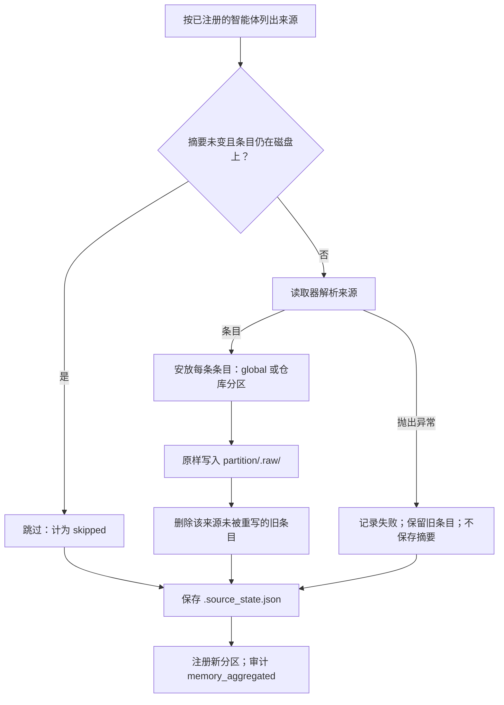
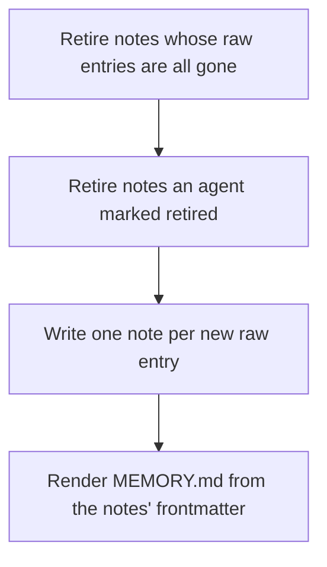
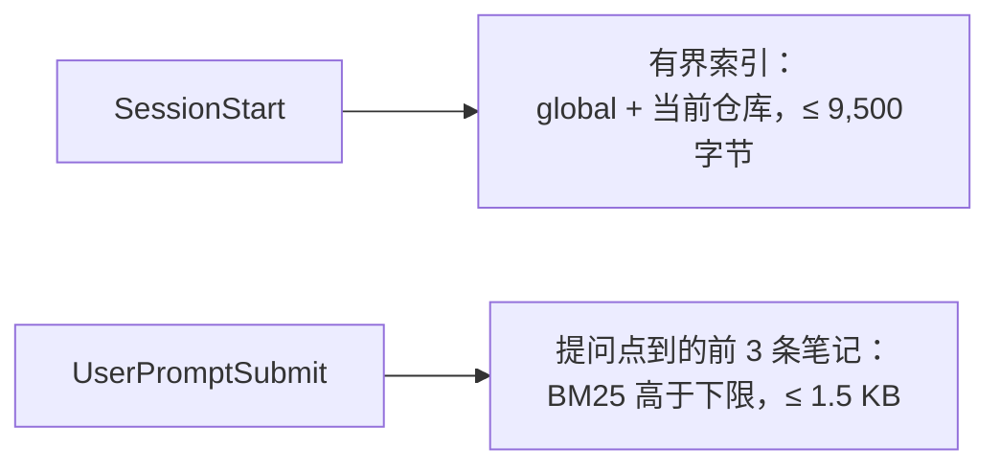
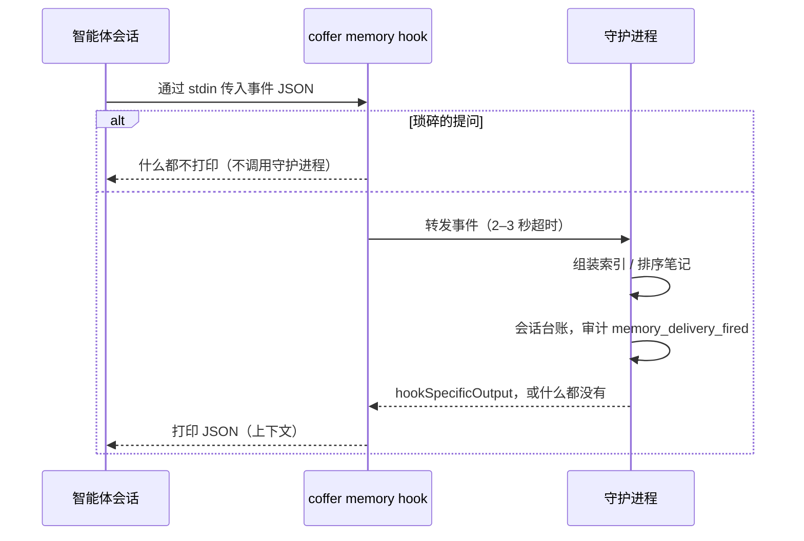

# 记忆 {#memory}

本页讲 Coffer 记忆层的工作原理：它如何从 Claude Code 和 Codex 自己的记忆文件里读出它们学到的东西，变成自己的笔记，在你要求时让智能体整理这些笔记，再把结果交还给每个智能体。本页面向想了解机制和背后理由的工程师。按任务组织的说明见[记忆指南](/zh/guides/memory)。

## 要解决的问题 {#the-problem}

每个编程智能体都有自己的记忆，彼此却看不到对方的。Claude Code 在每个项目下一条事实写一个 Markdown 文件。Codex 把它的 rollout 提炼成任务组和一份档案。两者都做得不错，但知识只留在各自的目录里，结果你得把 Claude Code 已经知道的东西再教 Codex 一遍。

Coffer 的解法分三步：

1. **读取**每个智能体的原生记忆，但从不写入。
2. **提炼**读到的内容，写成 Coffer 自己的笔记：一个条目一条笔记，按仓库归档，另有一个 `global` 分区存放关于你本人的内容。把说同一个主题的笔记合起来、让不再成立的笔记退役，是**整理**，在你按**整理**时由你的智能体来做。
3. **投递**这些笔记给每个智能体，时机有两个：会话开始时给索引；提问发出时给该提问点到的少数几条笔记。每次投递都写明笔记的绝对路径，智能体读正文的方式和读自己的记忆一样：当作文件读。

Claude Code 上午学到的东西，Codex 下午打开同一个仓库时，索引里就已经有了。Coffer 做到这一点并不需要写入 Codex 的记忆，只是把那一行索引交给 Codex。

记忆不是[知识](/zh/architecture/knowledge)。知识是人或智能体关于外部世界写下的东西，智能体通过 `coffer-guide` 目录按需拉取。记忆是智能体在工作中学到的东西，整棵树都能从智能体自己的副本重建。记忆是通过你为每个智能体安装的 Hook 交给会话的，所以它是 Coffer [拉取而非推送](/zh/architecture/design-principles#pull-not-push)原则的一个显式例外，而不是悄悄破例。决策记录（ADR）[记忆在两个时机到达会话](https://github.com/wyx-sg/Coffer/blob/main/docs/decisions/memory-reaches-a-session-at-prompt-time-and-before-a-known-trap.md)陈述了这个例外：会话开始时的索引，以及提问点到的笔记。知识依旧是拉取。

## 设计决策 {#design-decisions}

### 只聚合，从不回写 {#aggregate-never-write-back}

Coffer 读取原生记忆，但从不在其中创建、修改、移动、删除或重排任何文件，也从不禁用或改配智能体的原生记忆。原因有二：

- **不干扰任何智能体自己的循环。** 每个智能体仍按厂商的设计管理自己的记忆。Coffer 从不持有可能与原件产生偏移的第二份副本，所以没有什么需要调和。
- **整个存储都可以丢弃。** `~/.coffer/derived/memory/` 下的一切都是派生的。你可以删掉它，下一轮聚合和提炼会重建一套*等价*的笔记：同样的主题、同样的来源。只有之后智能体或人对笔记做的事（编辑、合并、退役）不会被重现。

Coffer 唯一会写入智能体配置的，是它在智能体 *settings* 里的 Hook 条目。那个文件不是记忆，而且只有在你把智能体接入 Coffer 时才会写（见[投递](#delivery)）。

### 四个目录，各有各的作用 {#four-directories-one-role-each}

分区是 `~/.coffer/derived/memory/` 下的一个顶层目录：

```
~/.coffer/derived/memory/
├── .source_state.json        ← last-seen digest per native source file
├── global/
│   ├── MEMORY.md             ← the index: what a session is given
│   ├── notes/                ← Coffer's own notes, one topic per file
│   ├── RETIRED.md            ← what was retired, and why
│   └── .raw/                 ← what was read out of the agents, verbatim
└── coffer/
    └── …
```

| 路径 | 写入者 | 作用 |
| --- | --- | --- |
| `.raw/` | 仅聚合 | 忠实。每个智能体的原话，一条一个文件，标注智能体、原生路径和读取时间。它只作为提炼的输入：Web 界面不会列出或读取它。 |
| `notes/` | 提炼，以及人和智能体的编辑 | 有用。一个文件一条笔记，出处列出背后的每条原始条目。人可以在 Web 界面里或直接在磁盘上编辑笔记（见[编辑笔记](#editing-a-note)），智能体负责整理它们（见[整理](#tidying-is-the-agent-s-job)）。 |
| `MEMORY.md` | 仅提炼 | 可查找。每条笔记一行，最新的在前（行与顺序同投递一致）。 |
| `RETIRED.md` | 仅提炼 | 让退役生效。下一轮提炼会把它当作排除清单读取。智能体从不写它；它只在笔记上做标记，由提炼这一轮记录退役。 |

因为 `.raw/` 恰好只有一个写入者，别的东西都不碰它，提炼出了问题可以重跑，而不必重新读取智能体：`.raw/` 里仍保存着它们说过的一切。这条规则在代码里可以检查：只有一个模块会写入 `.raw/`，提炼流程从不借它来写。

记忆根目录固定为 `~/.coffer/derived/memory/`，属于派生存储类别（见[持久化](/zh/architecture/persistence)），不能改。测试套件给每个测试一个独立的 `HOME`，所以测试永远不会改写开发者真实的记忆树。

### 一个分区就是一个仓库 {#a-partition-is-a-repository}

分区按**仓库**识别，而不是按路径。主检出、它的 worktree 以及第二份克隆都归入同一个分区。身份键这样推导：

- 仓库有远端时，键是规范化后的远端 URL。规范化会去掉 scheme、用户名、端口、结尾的 `.git` 和结尾的斜杠，并把主机名转小写。路径的大小写保留，因为在大多数代码托管平台上 `owner/Repo` 和 `owner/repo` 是不同的仓库。所以 `git@host:owner/repo.git` 和 `https://host/owner/repo` 得到同一个键。
- 没有远端的仓库退回使用它自己的根路径。键上加了前缀，保证路径永远不会和 URL 撞键。

分区有一个可读的 slug，从不用不透明的 id。slug 取自仓库名。两个仓库同名时，Coffer 会逐级加上父路径片段作为前缀，直到唯一，所以两个都叫 `api` 的检出会变成 `work-api` 和 `personal-api`。分区的资源文件（`~/.coffer/derived/resources/memory/<slug>.json`）在 config 里记录 `repository_key` 和 `repository_path`，`MEMORY.md` 也会在头部重申仓库路径，让浏览这个目录的人知道它属于哪个项目。

有三条路会落到 `global`：

- 类型为 `user` 的条目，无论在哪个仓库学到，都进 `global`。它描述的是人，不是项目。`feedback` 条目没有自己的路线：在某个仓库学到，就归入该仓库的分区，因为在那里给出的长期指示（“在这里推送前先跑门禁”）约束的是那个仓库，归到全局就会把它交给其他所有项目的会话。
- 没有工作目录、或工作目录就是你的家目录的条目，进 `global`。
- 在不属于任何仓库的目录里学到的条目，进 `global` 的 `.raw/`。不会为那个目录创建分区。之后提炼会像对待其他条目一样，把它变成 `global` 里的一条笔记。

只有聚合会创建分区。`memory` 类型拒绝通用的创建路由，由记忆服务自己通过资源生命周期的 opt-in 注册新分区。组装上下文从不创建分区。记录的仓库已不在磁盘上的分区，会在分区列表里显示为 `unresolvable`，你仍然可以删除它。聚合本身从不删除分区。

### 没有按智能体的生效范围，也没有开关 {#no-per-agent-reach-and-no-switch}

大多数资源类型都带有按智能体的**生效范围**（见[资源框架](/zh/architecture/resource-framework)）。记忆没有：它的类型不声明按智能体的范围，并声明自己不可开关，所以分区也没有启用开关，通用的启用/禁用路由会以 `RESOURCE_NOT_TOGGLEABLE` 拒绝。**每个**分区都投递给**每个**智能体。笔记本身就是记忆根目录下的文件。

这是有意为之。按智能体设默认值是很自然的想法，即“把分区限定给它聚合自的那些智能体”。但这个默认值恰好和这一层的目的相反。一个只从 Claude Code 填充的分区，会对在同一仓库工作的 Codex 隐藏，而 Codex 恰恰是还没学到这些的那个智能体。况且生效范围本来也不是真正的边界。笔记是任何本地进程都能打开的普通文件，所以分区上的任何开关最多只能决定 Coffer *提供*什么；一个被禁用的分区，依然是任何智能体都能读的文件。

### 什么都不同步 {#nothing-syncs}

记忆树派生自*这台*机器上安装的智能体，所以它永远不会到达[保险库同步](/zh/architecture/vault-sync)的远端。`memory` 类型声明的是派生存储类别：它的资源文件和整棵树都在 `~/.coffer/derived/` 下，位于保险库仓库之外，同步没有东西可带。每台机器聚合自己的智能体。

### 没有自己的表 {#no-table-of-its-own}

笔记、原始条目、索引、退役记录和各来源的摘要都是文件。分区元数据在分区的派生资源文件里。这一层不新增任何表。

## 读取原生记忆 {#reading-native-memory}

每个受支持的智能体有一个读取器，所有读取器都遵循同一个两步约定：

- **列出来源**：列出智能体的记忆文件并逐个算哈希，不解析。
- **读取来源**：把一个文件解析成若干原始条目：标题、描述、类型、原文正文、锚点、项目根目录，以及可选的检索词。

拆成两步，聚合才能在付出解析代价之前跳过没变的文件。Coffer 只读**已注册**的智能体，路径由每个智能体自己的配置目录（下文的 `config_dir`）推导。

| | Claude Code | Codex |
| --- | --- | --- |
| 读取的文件 | `<config_dir>/projects/<slug>/memory/*.md` | `<config_dir>/memories/MEMORY.md` 和 `memory_summary.md` |
| 一条条目对应 | 一个事实文件 | 任务组里一个有内容的列表小节（`User preferences`、`Reusable knowledge`、`Failures and how to do differently`），外加 summary 里的档案和档案偏好 |
| 标题和描述 | frontmatter 的 `name` 和 `description` | 从列表项推导 |
| 类型 | `metadata.type` 映射到 `feedback` / `project` / `user`；`reference` 视为知识而非记忆，跳过 | 组偏好 → `user`；知识和失败 → `project`；档案 → `user`，项目根目录为空 |
| 项目根目录 | 同级会话记录里记下的 `cwd`，退而从项目 slug 解码 | 任务组的 `applies_to: cwd=…` 行 |
| 检索词 | 无，因为该格式没有 | 来自 summary 里的 `## What's in Memory`，按保守的词元覆盖率关联到任务组 |
| 忽略 | 智能体自己的 `MEMORY.md` 索引 | `## General Tips`、rollout 引用小节、`raw_memories.md`、`rollout_summaries/` |

两个读取器都不把会话记录或 rollout 当作来源。两个智能体都已经在提炼自己的会话，Coffer 从那份产出开始。Claude Code 读取器读会话记录里的 `cwd` 只有一个目的：找到条目的项目根目录（只有当 Claude Code 对该 `cwd` 的编码恰好等于项目文件夹名时才采用，并且每轮每个项目只查找一次）。

Codex 检索词的关联刻意保守。Codex 在 summary 里会改写组的标题，所以精确匹配标题几乎找不到东西。读取器改按词元覆盖率匹配，并且只有在恰好一个组过线、*并且*恰好一个 summary 主题认领该组时才附上检索词。归错比不归更糟。

读取器解析不了某个文件时，会把它报告为不可读，并附上文件路径。聚合把这个失败隔离在那一个文件上：这一轮会报告失败，附上智能体、路径和原因，其他来源照常聚合，坏掉的来源之前产出的东西一条都不会被清理。读取器抛出的意外异常也按同样方式隔离。

## 聚合流程 {#the-aggregation-pass}

这一轮本身是一个作用在普通值和派生树上的纯函数。记忆服务在外面包上资源相关的部分：列出已注册的智能体和已有的分区行，注册新分区，并记一条 `memory_aggregated` 审计事件。



### 跳过未变的来源 {#skipping-unchanged-sources}

`.source_state.json` 在记忆根目录下，`digests` 下存一个 `{native_path: sha256}` 映射，旁边有一个 `version`，每轮结束后原子写入。只有**同时**满足以下两点，来源才会被跳过：

1. 它的摘要与记录的一致。
2. 它产出的原始条目仍在磁盘上。

第二个条件让这棵树真正成为派生的。如果你删掉某个分区的目录而留下摘要文件，下一轮会发现条目不见了，重新读取来源并重建一切。仅凭摘要一致，永远不会阻止重建。这条规则的代价很小：一个本来就不产出条目的来源每轮都会被重新解析。

摘要文件丢失或损坏时，下一轮会重新解析所有来源。正确性不受影响。

`version` 是归档规则的版本。摘要只说明来源没变，并不说明安放其条目的规则没变，所以改变条目归属的构建会提升这个版本。在其他版本下写的文件读出来为空：下一轮会把每个来源重读一次，按当前规则归档条目，并删掉之前写在别处的那些。

### 稳定的原始条目 {#stable-raw-entries}

原始条目的文件名是一个来源键：对 `(agent, native_path, anchor)` 做 SHA-256，取前 16 个十六进制字符。锚点是条目在来源中的位置，例如事实文件的 `name`，或 Codex 列表项的内容哈希。所以对未变来源的第二次读取会覆盖同样的文件，而不会新增近似重复。当智能体从自己的记忆里删掉某个列表项，重读不再产出那条条目，这一轮就会从 `.raw/` 删掉那个过期文件。当智能体整个删掉一个来源文件，该文件不会再被列出，这一轮会用同样的办法清掉它曾经产出的条目，但只针对已注册、已启用且配置目录仍然存在的智能体：目录未挂载说明不了它的文件如何，被停用的智能体则保留它已贡献的内容。

聚合从不比较两个智能体的条目。两个智能体描述同一个教训时几乎没有相同的措辞，所以字面比较什么也合并不了。按含义合并是整理，由智能体来做。

## 提炼流程 {#the-distil-pass}

提炼把一个分区的新原始条目变成笔记，并重写 `MEMORY.md`。它是**机械的**：不调用任何模型，也不把文件内容发到任何地方。它作为一项维护任务按自己的间隔运行，而不是每次聚合后都跑；它会扫过所有还有未提炼原始条目的分区，一个既没有新内容、也没有要退役的笔记的分区不产生任何开销。

一个条目的 id 既不在任何笔记的出处（`origins`）里，也不在任何 `RETIRED.md` 记录里时，才算新条目。对每个分区，这一轮按顺序做四件事：



1. **让来源已消失的笔记退役**（见[来源已消失的笔记](#notes-whose-sources-are-gone)）。
2. **让智能体标记过的笔记退役。** frontmatter 里带 `retired: <原因>` 的笔记会被记入 `RETIRED.md`，从 `notes/` 删除，并且不进索引（见[退役是持久的](#retirements-stick)）。
3. **为每个新条目写一条笔记。** 每个原始条目按原样成为它自己的一条笔记：条目的标题、描述、类型、正文、检索词和出处，外加 `created_at` 和 `updated_at`。之后又来一条主题已被某条笔记覆盖的条目，会在它旁边另开一条笔记。把两条合起来是整理，由智能体来做（见[整理是智能体的事](#tidying-is-the-agent-s-job)）。
4. **根据笔记的 frontmatter 渲染 `MEMORY.md`**，每条路径都会走到这一步，包括什么都没变的时候。会话开始的投递来自索引，所以没有索引的分区什么也投递不出去。

这一轮从不写 `.raw/` 下的任何东西；两个轮次各管一个目录，这正是提炼可以重跑而不必重新读取智能体的原因。每一轮会记录一条 `memory_distilled` 审计事件，带上它 `opened`（新开）和 `retired`（退役）的笔记数，并在守护进程的事件流上以 `memory` 事件宣告这个分区，因为笔记的变化并不涉及对分区那一行的任何写入。

### 退役是持久的 {#retirements-stick}

退役会从 `notes/` 删掉笔记文件，并向 `RETIRED.md` 追加一条记录：标题、原因、替代笔记（如有），以及该记录排除的原始条目 id。这是让删除真正生效的唯一机制。已退役笔记背后的材料仍在智能体自己的记忆里，不受 Coffer 控制，所以下一轮聚合会再次读到它。没有这条记录，下一轮提炼又会把这条笔记开出来。

智能体算不出原始条目的 id，所以它不写这条记录，而是在笔记上做标记：笔记 frontmatter 里写 `retired: <原因>`，可选再写 `replaced_by: <slug>`。下一轮提炼读到这个标记，把笔记自己的 `origins` 抄进记录作为条目 id，删掉文件并重新渲染索引。合并两条笔记不需要标记：留下来的那条带着被合并笔记的 `origins`，而已经出现在某条笔记 `origins` 里的条目就算已被交代。

### 来源已消失的笔记 {#notes-whose-sources-are-gone}

聚合会在来源不再产生某个原始条目时删掉它：智能体把这条事实从自己的记忆里删了，或者归档规则现在把这个条目归到了另一个分区（例如带项目根目录的 `feedback` 条目，会从 `global` 移到那个项目）。只由这类条目构成的笔记下面已经什么都没有了，所以每一轮提炼先让它退役：文件离开 `notes/`，`RETIRED.md` 多一条记录，带上原因和 `sources_gone: true`。只要还有一个出处存活，笔记就保持不动，不记录任何出处的笔记也一样。

这条记录不是排除。它不列任何条目 id，因为没有人判断过这条笔记不对。如果材料又回来了，会像任何新条目一样被提炼。

### 编辑笔记 {#editing-a-note}

人可以编辑笔记：Web 界面的**编辑**会替换笔记的正文并保留它的 frontmatter，用任何编辑器直接改 `notes/` 下的文件则不需要 Coffer 做任何事。Web 界面的保存会带上读取时笔记的指纹。如果这期间笔记变了（智能体合并或重写了它，或者文件在磁盘上被改过），保存会被拒绝，并把笔记现在的样子交给编辑器，所以不会覆盖任何东西，也不会丢失任何东西。

编辑过的笔记就是那条笔记，而不是一条建议。提炼从不重写已有笔记的正文，所以这次编辑会一直保留，直到这条笔记退役或派生树被删除。

人也可以删除笔记。Web 界面的**删除…**会先询问，再让笔记退役，而不只是删掉文件：它会追加一条 `RETIRED.md` 记录，原因为 `Deleted by hand`，带上笔记自己的出处条目 id，再删掉文件并重新渲染 `MEMORY.md`。笔记背后的来源仍在智能体自己的记忆里，所以没有这条记录，下一轮提炼就会把它重新开出来；有了它，这些条目就算已被交代。这次删除以 `memory_note_deleted`（操作者：用户）记入审计，随后这条记忆出现在分区只读的**已退役**分组里。

派生树始终可丢弃。把它删掉再重建，会从智能体自己的记忆里重新产生笔记，一个条目一条，并丢掉所有编辑、合并和退役，所以指南会把这一点说清楚。

### 每个分区同时只跑一轮 {#one-pass-per-partition}

间隔 worker 和「更新记忆」（Web 界面里先聚合、再提炼的那个按钮）都会在共享的维护运行登记表里占用分区的 **uid**。「更新记忆」会把已有一轮在跑的分区记在 `skipped` 下，并提炼其余的。worker 会跳过忙碌的分区，下一次扫描再回来处理。登记表在内存里，每个守护进程一份。

## 整理是智能体的事 {#tidying-is-the-agent-s-job}

两个智能体很少会用同样的话说同一个教训，所以一个分区会攒下近似重复的笔记：每个智能体写的每条记忆各一条。把它们合起来是对含义的判断，判断某条笔记不再成立也是。这两件事 Coffer 都不做。`coffer-guide` 技能教智能体去做，由人按一个按钮来启动。见决策[整理知识和记忆是智能体的事](https://github.com/wyx-sg/Coffer/blob/main/docs/decisions/tidying-knowledge-and-memory-is-the-agents-job.md)。

### 指南教了什么 {#what-the-guide-teaches}

记忆功能开着时，指南的记忆部分会告诉智能体：一次处理一个分区，在记忆根目录下，先读分区的 `MEMORY.md`，再完整读笔记，然后才改动它们，并且：

- **合并**说同一个主题的笔记。它重写留下来的那条笔记，让它包含两者的全部事实，把被合并笔记 `origins:` 列表里的**每一项都原样追加到留下那条的 `origins:`**，再删掉被合并的文件。`origins` 是 Coffer 得知一条记忆已被交代的依据：丢掉一项，被合并的笔记在下次更新时就会回来。
- 让不再成立的笔记**退役**：加上 `retired:` 写明原因，有留下来的笔记时再加 `replaced_by:` 写那条笔记的文件名。它不删文件，因为这条笔记的来源仍在某个智能体自己的记忆里，删掉的笔记还会回来。下一轮提炼会记录这次退役并删掉文件。
- 两条笔记不一致时让**较新的说法胜出**，除非较旧的那条被来源、日期、命令输出或代码证明是对的，不论谁写的哪一条。
- 每条笔记只讲一个主题，并带一行 `description`，因为会话收到的索引就是由它构建的。
- 不碰 `.raw/`、`MEMORY.md`、`RETIRED.md` 和智能体自己的记忆文件。

### 「整理」交接 {#the-tidy-hand-off}

提示词由守护进程写。读取一个分区会带上 `tidy_handoff`，它写明分区名、绝对目录和该遵循的指南章节。`GET /api/v1/memory/tidy-handoff` 为所有分区返回一份提示词：它写明记忆根目录以及每个分区的笔记目录和笔记数，并请智能体一个一个地整理。

Web 界面在分区页面上提供**整理**，在记忆页面页头提供**整理全部**。两者都会在首选终端里启动默认的交接智能体，把这份提示词作为它的第一条消息，走的是与其他所有交接相同的路径。没有可用的托管智能体时，只提供**复制提示词**。没有任何东西会无人值守地整理分区：聚合和提炼的定时器照常运行，但它们从不自己合并或退役任何笔记。

## 索引行 {#the-index-line}

同一个渲染器为每条笔记写出一行。`MEMORY.md` 和投递都用它，所以两者永远不会不一致：

```md
- **Worktrees for parallel sessions** (`worktree-for-parallel-sessions.md`) — Another session edits the main checkout; work in a git worktree. · look up: worktree, parallel session
```

一行承载的是笔记的结论，而不是指向它的指针，所以读完索引通常事情就办完了。它用相对路径命名文件，因为目录在每个投递面只说明一次。来源提供了检索词时，它会重复这些检索词。两个投递面按同一个共享的“最新”定义排序：笔记的 `updated_at`，退而取 `created_at`，再退而取来源的时间戳。它是一条回退链，而不是取三者中最晚的那个：刚重建完时，所有来源共享同一个捕获时间，取最晚值会让排序塌缩。

## 投递 {#delivery}

记忆在**两个时机**、通过**两个 Hook 事件**到达会话：



1. **会话开始时**，给出 `global` 和当前仓库的有界索引，并说明笔记正文在哪里。
2. **每次有实质内容的提问时**，给出该提问点到的少数几条笔记，按字面匹配排序。

设计、权衡过的方案和证据见决策记录（ADR）[记忆在两个时机到达会话](https://github.com/wyx-sg/Coffer/blob/main/docs/decisions/memory-reaches-a-session-at-prompt-time-and-before-a-known-trap.md)。

### 为什么是两个时机 {#why-two-moments}

这份 ADR 在真实会话中取了 107 个经人工核对的时刻来衡量投递，这些时刻里智能体需要的东西存储中都已经有了。大部分遗漏来自两种不同的失败：

- **从未投递。** 事实存在，但从未到达会话。索引被截断了、会话解析到了错误的分区，或者 Coffer 根本没接到那个智能体。在提问时检索能解决这一半。
- **投递了却没照做。** 规则就在上下文里，会话开始时读过，二十个轮次之后照样违反。这一半不是投递能修的：智能体自己权衡拿到的内容；对于适用于每次回复的长期规则，答案是放进智能体每个轮次都会加载的指令里（见[关于每个轮次的规则不归记忆管](#rules-about-every-turn-are-not-memory-s-job)）。

每一层都覆盖了另一层覆盖不到的：索引覆盖第一条消息，检索覆盖提问点到的规则。

### 会话开始时：有界索引 {#at-session-start-the-bounded-index}

组装上下文会为某个工作目录构建会话开始时的内容：

1. 按包含 `cwd` 的最长已记录 `repository_path` 把 `cwd` 解析到一个分区。因此 worktree 会解析到它所属仓库的分区。未知目录解析到 `global`。
2. 按顺序输出：一个 `## Coffer memory` 标题、*Known about you:* 下的 `global` 各行、当前仓库的各行、一行给出 `notes/` 目录的绝对路径并说明把笔记当文件读，以及一行给出记忆根目录，用于查找其他仓库的笔记。
3. 不提任何工具。所有使用方都是本来就会读文件的本地进程。

这份内容有两个上限：

- **token 上限** 为估算的 12,000 个 token，按整份索引而不是几行来定。
- **字节上限** 为 9,500 个 UTF-8 字节，适用于已安装 Hook 打印的任何内容。两个智能体都会截断更长的 Hook 输出，而两种截断都会丢掉关键的行：
  - **Claude Code** 把 Hook 输出内联保留到约 10,000 个字符。超过后，它把输出存到文件里，只给模型看约 2 KB 的预览，其中只有最新的几行 `global`，完全没有仓库的内容。
  - **Codex** 把 `additionalContext` 保留到 2,500 个 token，按 UTF-8 字节数 / 4 计算。超过后，它保留头尾、砍掉中间。

  文本的字符数永远不会多于字节数，所以一个字节数就能同时满足两个智能体。真实保险库的索引有 30–45 KB，所以在会话开始时起作用的是这个上限。

触及上限时，**先保证当前仓库的行**，剩下的给 `global`。每个小节内最旧的行先被丢弃，并附一条提示，说明丢了多少行、在哪个目录里。所以裁剪之后，每条笔记仍然能作为文件找到。没有内容可投递时，文本为空，而不是只有一个光秃秃的标题。

组装上下文不会向任何地方发送任何东西。Coffer 在任何路径上都不会就记忆调用模型。

### 每次提问时：字面检索 {#at-each-prompt-lexical-retrieval}

在 `UserPromptSubmit` 时，守护进程用提问对会话所在仓库分区和 `global` 的笔记排序，并把最好的几条加入会话。

- **排序对象。** 每条笔记的标题、描述、检索词和正文，合成一个文档。
- **方法。** 基于词元的 Okapi BM25，CJK 文本切成重叠的双字 bigram，所以不需要分词器，中文提问也能找到中文笔记。一个小的停用词表去掉太常见、不含信息的词。
- **投递内容。** 得分达到或超过**相关性下限 4.0** 的**前三条**笔记，跳过本会话已经给过的笔记，整次投递（含标题）不超过 **1,500 个 UTF-8 字节**。会超出预算的笔记直接跳过，而不是截断。
- **什么时候不投递。** 少于三个词的提问，或 `continue`、`ok`、`继续` 这类单纯的催促，什么都不检索。最佳匹配低于下限的提问也一样。

这个下限是在评测集上对照真实规模的存储校准的，在那里，一条笔记会和点到它的提问共享一些罕见词。BM25 按一个词在整个存储里有多罕见来加权，只有寥寥几条笔记的存储得分都偏低，很少能过线。这是预期行为。下限防止只和笔记共享常见词的提问把它带进来；随着智能体不断学习，存储会长大到超过这个下限。

**索引是派生的，只存在内存里。** 守护进程为每个仓库分区连同 `global` 建一个排序索引，当任一分区的 `notes/` 在文件名、修改时间或大小上变化时重建。它从不写盘，也没有任何东西对笔记分块或做 embedding。笔记始终是唯一的副本；索引只是它们的一个视图，和 `MEMORY.md` 一样。embedding 做过测量并被否决：在评测集上多出三个点的召回率，抵不上一个 2.2 GB 的本地模型，而且产品早已为字面检索放弃了 embedding。

### 投递的笔记如何措辞 {#how-a-delivered-note-is-worded}

在提问时投递的每条笔记，读起来都是**出处加事实**。它写明笔记的文件，并把标题和描述表述为：`feedback` 笔记是 “the user's standing rule is: …”，其他则是 “a fact they recorded: …”：

```text
Coffer memory, a note recorded for this user (/Users/you/.coffer/derived/memory/coffer/notes/frontend-vitest-needs-node-20.md): the user's standing rule is: Frontend vitest needs Node 20 — run make verify under Node 20; 22 and 24 exit 1 with every test green.
```

这样措辞是有意的。在早先一轮评测里，一条写成祈使句（“删掉分支和 worktree”）的笔记，被智能体当作提示词注入向用户引述出来。改成表述为用户的长期规则之后，72 次运行中 0 次把笔记标记为注入。投递的文本从来不是给智能体的指令。

### 一条命令，两个 Hook 条目 {#one-command-on-two-hook-entries}

投递通过智能体自己的 Hook 机制到达智能体。Coffer 的 Hook 是**两个条目**，每个事件一个，两个条目运行同一条内部命令，**按绝对路径**调用 Coffer 的 CLI：

```sh
: coffer-memory; /Users/you/.coffer/bin/coffer memory hook --agent-uid <uid> --cwd "$PWD"
```

`coffer memory hook` 是由已安装的 Hook 运行的内部入口；它在 CLI 帮助里是隐藏的，因为没有人会自己输入它，也是唯一存在的 `coffer memory` 命令。

| 事件 | 匹配器 | 条目超时 | 能回答什么 |
| --- | --- | --- | --- |
| `SessionStart` | `startup\|resume\|clear\|compact` | 10 秒 | 有界索引，作为 `additionalContext` |
| `UserPromptSubmit` | 无 | 5 秒 | 检索到的笔记，作为 `additionalContext` |

两个智能体拿到的是同样的两个条目：Claude Code 写在 `settings.json`，Codex 写在 `hooks.json`。两者都以同样形状的 JSON 通过 stdin 把事件交给 Hook（`hook_event_name`、`session_id`、`cwd`、`prompt`），也都在每个事件上读回同样的 `hookSpecificOutput` JSON。所以这条 Hook 命令从 stdin 读事件，转发给守护进程，再把返回的内容打印出来。`--cwd "$PWD"` 只是输入里没有 `cwd` 的事件的兜底。所有事件共用一条命令，意味着判断是否过时只需要看一个字符串，Codex 每个条目也只有一种哈希形状。Web 界面里分区的「投递内容」标签页会显示每个智能体在会话开始时拿到的文本。

路径由组合根解析，优先使用稳定的 `~/.coffer/bin/coffer`，而不是它背后的版本目录。只写 `coffer` 不够，因为 Hook 在智能体启动的任意 shell 下运行。Codex 在不加载用户 rc 文件的 `/bin/zsh` 下运行 Hook，所以那个 shell 的 `PATH` 里没有 `~/.coffer/bin`。从 Dock 启动的 Claude Code 也不继承登录 shell 的 `PATH`。

开头的 `: coffer-memory;` 是一个携带标记的 shell 空操作。Coffer 靠这个标记查找、替换和删除自己的条目，从不碰同一事件上其他工具的 Hook。安装或移除都会先把 Coffer 带标记的条目从**所有**事件上清掉，所以任何其他事件上都不会遗留带标记的条目。安装始终是显式操作：Hook 是智能体 Coffer 连接的一部分（智能体页面上的**连接**；见[智能体](/zh/guides/agents#connect-an-agent-to-coffer)）。它是幂等的，移除条目后还会顺手删掉空的事件数组和空的 `hooks` 键。智能体以不可变的 uid 命名，因为 Hook 字符串可能在 settings 文件里躺好几个月，而你期间可能给智能体改名。



### 失败即放行 {#failing-open}

记忆从不因为 Coffer 宕机而挡住提问。以下情况 CLI 什么都不打印并以 0 退出：没有守护进程在运行；守护进程没有及时回答（会话开始时 3 秒，提问时 2 秒，都在条目自身的超时之内）；或者它回了错误、或回了 CLI 读不懂的内容。

一次不可能投递任何东西的触发根本不会联系守护进程。CLI 用和守护进程相同的判断在本地处理琐碎提问，所以只是顺着往下聊的对话，代价是一次进程启动，而不是一次往返。所有依赖状态的判断仍由守护进程决定：会话在哪个分区、本会话是否已经拿到过这条笔记。

### 按会话的台账 {#the-per-session-ledger}

有一项承诺依赖于记住每个会话拿到过什么：为某次提问检索到的笔记，在同一会话中不会再次检索。守护进程把它记在**内存中的按会话台账**里，以智能体交给 Hook 的 `session_id` 为键（消息渠道的轮次则是 `conversation:<id>`），上限为最近的 2,048 个会话。

它从不以进程 id 为键。同一个 Codex app-server 的所有会话共享一个父 pid，所以以 `$PPID` 为键的台账在 Codex Desktop 和各 IDE 宿主下只会对每个 app-server 的第一个会话起作用。

台账不需要自己的表也能挺过守护进程重启。每一次有投递的触发都已经是一条 `memory_delivery_fired` 审计事件，记着它的会话和笔记。新的守护进程在回答第一个提问之前，会把最近七天的触发按从旧到新读回台账。所以正在运行的会话在重启后不会再次拿到同一条笔记。闲置超过七天的会话视为新会话。审计日志读不出来时，失败会记日志，台账从空开始；代价是多一行重复内容。

### 审计与投递视图 {#audit-and-the-delivery-views}

每次**有投递**的触发都是一条 `memory_delivery_fired` 审计事件，资源和操作者都记为该智能体，details 给出它的 `moment`（`session_start` 或 `prompt`）、`session_id` 和它携带的笔记（形如 `<partition>/<slug>`）。事件从不携带笔记文本。会话开始每次触发都记录；提问的触发只在投递了笔记时记录。人对笔记的编辑会审计为 `memory_note_edited`，人手动删除笔记会审计为 `memory_note_deleted`，都写明分区、笔记和用户。

Web 界面里单个分区的只读**投递内容视图**回答智能体拿到了什么：

- **单个分区的「投递内容」视图**。每个智能体在该分区所属仓库里拿到的**确切**会话开始文本，由与 Hook 相同的函数、在相同的上限下组装。默认以渲染后的 Markdown 显示，可切换到原文查看确切文本；在渲染视图里，每个条目都链接到它所属分区页面上对应的记忆条目。读取它不会记录任何东西。

这个视图不说明 Hook 是否已安装或已被信任。那是智能体 Coffer 连接的属性，在智能体页面上：它的连接状态和「钩子」标签页。Hook 自身的状态同样只报告是否安装，不带最后触发时间。它是否*触发*是一串事件，你在[活动](/zh/guides/activity)页面里读。

### Codex 的批准 {#codex-s-approval}

Codex 只在用户审查过 Hook 之后才运行它，并把每次批准记在 `config.toml` 里，每个条目一条记录：

```toml
[hooks.state."/Users/you/.codex/hooks.json:session_start:1:0"]
trusted_hash = "sha256:…"
```

键由文件、事件、匹配器组的位置和处理器的位置组成。哈希覆盖条目定义的规范化形式。没有匹配哈希的条目会被静默跳过：没有错误，没有事件。有两个条目，用户就要在 `/hooks` 里批准两条记录，而 Coffer 的命令每改一次，都需要重新批准。在那之前，Codex 会跳过它没有批准记录的条目。

Coffer 按 Codex 的方式计算每个哈希，并读取这些记录。只有**每个**条目都被信任时，它的 Hook 才算被信任；否则它的信任状态取按文件顺序第一个未被信任的条目。它从不写入记录：

- **这是 Codex 的审查关口。** 一个工具安装了 Hook 又自己批准它，就去掉了用户查看将要运行什么的唯一时机。
- **过时的算法副本必须显式地失败。** 如果 Coffer 写入哈希而它的算法副本过时了，Coffer 会报告 Hook 已批准，而 Codex 却跳过它，这恰恰是本节要防止的失败。用过时算法去读，失败则是可见的：Coffer 显示“需要批准”，而 Codex 实际上在运行这个 Hook。

结果就是 Coffer Hook 的**信任状态**：`trusted`、`untrusted`、`modified`（批准的是更早的命令）、`disabled`、`unknown`，或者对 Claude Code 是 `not_required`，因为它会运行 settings 里的每个 Hook。它出现在智能体的「钩子」标签页里，也会作为一个待处理项出现。解决办法永远一样：打开 Codex，运行 `/hooks`，信任 Coffer 的两个条目。

### 让 Hook 保持最新 {#keeping-hooks-current}

检测只匹配标记，从不读参数。所以一个命令已经过时的 Hook（例如因为某个 CLI 参数改了）仍然显示为已安装，却在每次触发时失败。因此 Hook 是[调和器](/zh/architecture/reconciler)的一个目标。每一轮（启动时、每分钟一次、以及任何智能体变化后不久），调和器都会把每个已安装的 Hook 与当前运行的构建会安装的内容比较：条目所在的**事件集合**，以及每个条目的完整命令。有差异的 Hook 会被重写成当前的两个条目。某个 settings 文件读不了时，报告为 blocked，不影响其他文件。

对 Codex，这个目标还会比较信任状态。一个内容是最新的、但 Codex 不会运行的 Hook，差别只在信任上。这个差别在待处理列表里报告为 `hook_untrusted`（或 `hook_disabled`、`hook_trust_unknown`），附上解决办法，而且从不写入。

普通的一轮从不安装 Hook：缺少 Hook 的已连接智能体会被报告出来，显示为部分连接，直到再次连接。

### 消息渠道的轮次 {#channel-turns}

来自 Telegram 或 SeaTalk 的轮次由 Coffer 自己驱动，所以这个轮次的记忆也由它自己组装。守护进程装配对话时，会把两个记忆回调交给两个智能体提供方，两个回调共用同一个轮次检索服务：

- **索引回调**负责给出索引。对话适配器在组装系统提示词时调用它，只针对消息渠道驱动的轮次，并传入对话的工作目录。它运行与 Hook 相同的上下文组装，所以消息渠道的轮次在系统提示词里拿到的索引和笔记路径，与终端会话拿到的一样。这次投递记为作答智能体的一次 `session_start` 触发，事件为 `ChannelTurn`。
- **检索回调**负责给出提问点到的笔记。提供方只在消息渠道驱动的轮次把它绑定到该轮次，适配器把它返回的内容加在所发送提示词里用户文本的后面——也就是 `UserPromptSubmit` Hook 的上下文会落到的位置，所以笔记留在智能体自己的会话里。轮次检索服务调用的是 Hook 所走的同一个检索服务，以 `conversation:<id>` 作为会话 id，所以一条笔记每个对话只给一次；它把这次投递记为作答智能体的一次 `prompt` 触发，事件为 `ChannelTurn`。存进对话的消息是用户自己的原文。

两个闭包什么都没找到、或者树读不了时（会记日志；记忆是轮次的附加内容，不是前提），都什么也不返回。

Coffer 为这个轮次启动的智能体进程仍会加载智能体自己的设置：Agent SDK 读取用户的 `settings.json`，`codex app-server` 运行已被信任的 `hooks.json`。所以在已连接的智能体上，Coffer 的 Hook 在消息渠道轮次里同样会触发；如果没有专门的规则，它会第二次把索引和笔记交给智能体（它的台账以智能体的会话 id 为键，从没见过这个轮次的 id），并把每次提问审计两遍。因此每个时机只有一个负责方。提供方在消息渠道轮次的进程环境里设置 `COFFER_CHANNEL_TURN=1`（合并在守护进程自身的环境之上），智能体会把这个环境传给它运行的每个 Hook，`coffer memory hook` 看到这个标记时，在 `SessionStart` 或 `UserPromptSubmit` 上什么都不回答。它不联系守护进程，所以什么都不记录。

你从对话页面恢复的会话在你的终端里运行，在 Coffer 之外：它不带这个标记，也不会拿到这两个闭包。它通过智能体自己的 Hook 获得记忆，所以没有哪个轮次会两路都拿到记忆。

### 关于每个轮次的规则不归记忆管 {#rules-about-every-turn-are-not-memory-s-job}

关于**每一次**回复的规则，比如用什么语言回答、什么语气，是检索没法在合适的时机投递的。没有哪个提问会点到它。在评测中，“用中文回复”在所有投递条件下都失败了。这类规则应该放在智能体每个轮次都会加载的指令里，即你自己维护的 `CLAUDE.md` 或 `AGENTS.md`。Coffer 从不写这些文件，理由和它从不写智能体原生记忆一样：安装或触发记忆 Hook 都会让它们保持逐字节不变。

## 在其他分区里找笔记 {#finding-a-note-in-another-partition}

记忆层没有 MCP 工具。笔记是 Markdown 文件，每个分区的 `notes/` 都在同一个**记忆根目录**下（`~/.coffer/derived/memory/`），所以用智能体自己的文件工具搜一次就能覆盖所有分区。会话开始时的内容里写明了这个根目录，`coffer-guide` 技能也把它和知识的根目录写在一起。当前仓库的索引已经在会话上下文里；根目录是给会话*没有*在其中打开的分区里的笔记用的。

对文件的搜索永远不会把原始条目或已退役的笔记当成笔记：原始条目在 `.raw/` 下，已退役的笔记离开 `notes/` 进了 `RETIRED.md`。也没有 `remember` 工具。智能体照常记录，Coffer 在下一轮读取。

## Worker 与调度 {#workers-and-scheduling}

两个流程都以后台任务运行，由守护进程在启动时开启：

| Worker | 首次运行 | 默认间隔 | 审计操作者 |
| --- | --- | --- | --- |
| 聚合 | 启动时立即运行 | 1 小时 | `system:memory-aggregate-worker` |
| 提炼 | 60 秒后 | 6 小时 | `system:memory-distil-worker` |

两者默认开启。它们读智能体的文件，只写派生树，所以无人值守地运行没有风险。每一轮都会**逐轮**从引擎的维护设置（`aggregate`、`distil`）读取自己的开关和间隔，所以在设置里的修改无需重启就生效。失败的一轮会记日志，从不终止循环。关闭时，待执行的一轮会被丢弃，因为下次启动会再全部扫一遍。你也可以一次手动运行两者：Web 界面的「更新记忆」按钮会先聚合，再提炼所有还有未提炼原始条目的分区。提炼已在运行的分区报告为 `skipped`，而不会让调用失败。回答中包含聚合写了什么，以及 `distilled` 和 `skipped` 的分区。

## 权衡与备选方案 {#trade-offs-and-alternatives}

- **把 Coffer 自有的存储投射进每个智能体的记忆。** 这能免费获得自动加载，但代价是写入、软链接或禁用别的工具的记忆。这很侵入、难以理解，而且厂商一改就容易坏。聚合让每个智能体的循环保持原样，代价是一个 Hook。
- **用 Coffer 自己的模型来合并和重写笔记。** 这样在人看到之前重复就已被合并，但它需要人另外配置一个模型连接，无人值守地运行，没配置时又退回机械路径。人本来就在用的智能体，带着文件工具、更强的模型和人的注视，做的是同样的判断。每个原始条目按原样成为一条笔记，`.raw/` 把原文留在它旁边。
- **有预算的摘要加一个搜索工具。** 智能体不会去调用工具查找它没被展示过的东西：Coffer 早先的 recall 工具在整个生命周期里只被调用过五次。两个受支持的宿主都会加载索引、把正文当文件读。Coffer 照搬这个形状，并写明记忆根目录，让其他分区的笔记只需一次搜索。
- **会话开始时给完整、不截断的索引。** 在回放中它覆盖的需求最多，但 30–45 KB 过不了任何一个智能体的 Hook 输出，而且即使完整投递，上下文里一半的规则也被忽略了。所以才有了有界索引加检索。
- **用 embedding 排序。** embedding 为一个 2.2 GB 的模型换来三个点的召回。在评测集证明某个替代方案值回成本之前，排序器保持字面匹配。
- **跨智能体的字面去重。** 两个智能体从不用同样的话描述同一个教训，所以字面比较什么都合并不了。合并是对含义的判断，由负责整理的智能体来做。
- **按定时器整理。** 无人值守的智能体运行需要防止与 Coffer 自己的 Hook 形成循环，会在人不知情时消耗他的额度，还会留下没人开过的对话。在有人按**整理**之前，近似重复的笔记会留着，索引有预算所以投递会更早截断，这是可以接受的：人看得到重复，也看得到那个按钮。
- **按工作目录划分分区。** 这会把一个仓库拆散到它的各个 worktree，目录消失时留下孤立分区，还会把临时文件夹变成永久分区。按仓库划分就避免了这三点。
- **第三个读取器抽象。** 两个读取器就写成两个读取器。第三个智能体按现有的读取器和投递适配器约定写一个适配器，而不是搞一张能力矩阵。

## 代码位置 {#where-it-lives-in-the-code}

| 关注点 | 位置 |
| --- | --- |
| 仓库身份、笔记、排序器、Hook 条目和投递措辞 | 领域层的 `memory` 包 |
| 聚合、安放、提炼、索引、上下文组装、投递、会话台账、投递视图和投递 Hook 的调和目标 | 应用层的 `memory` 包 |
| 原生记忆读取器、各智能体的 Hook 适配器，以及记忆根目录下的文件 | 基础设施层的 `memory` 包 |
| Worker、装配、消息渠道轮次的回调、Web 界面自己的路由和 Hook 路由 | HTTP 接口层 |
| 内部的 `coffer memory hook` 入口 | CLI 接口层 |

## 相关链接 {#related}

- 规格：[memory](https://github.com/wyx-sg/Coffer/blob/main/openspec/specs/memory/spec.md)
- 决策记录：[聚合智能体的记忆，从不写入](https://github.com/wyx-sg/Coffer/blob/main/docs/decisions/aggregate-agent-memory-never-write-it.md)、[记忆在两个时机到达会话](https://github.com/wyx-sg/Coffer/blob/main/docs/decisions/memory-reaches-a-session-at-prompt-time-and-before-a-known-trap.md)、[整理知识和记忆是智能体的事](https://github.com/wyx-sg/Coffer/blob/main/docs/decisions/tidying-knowledge-and-memory-is-the-agents-job.md)
- [记忆指南](/zh/guides/memory) · [知识架构](/zh/architecture/knowledge) · [保险库同步](/zh/architecture/vault-sync) · [MCP 网关](/zh/architecture/mcp-gateway) · [对话与轮次](/zh/architecture/chat)
