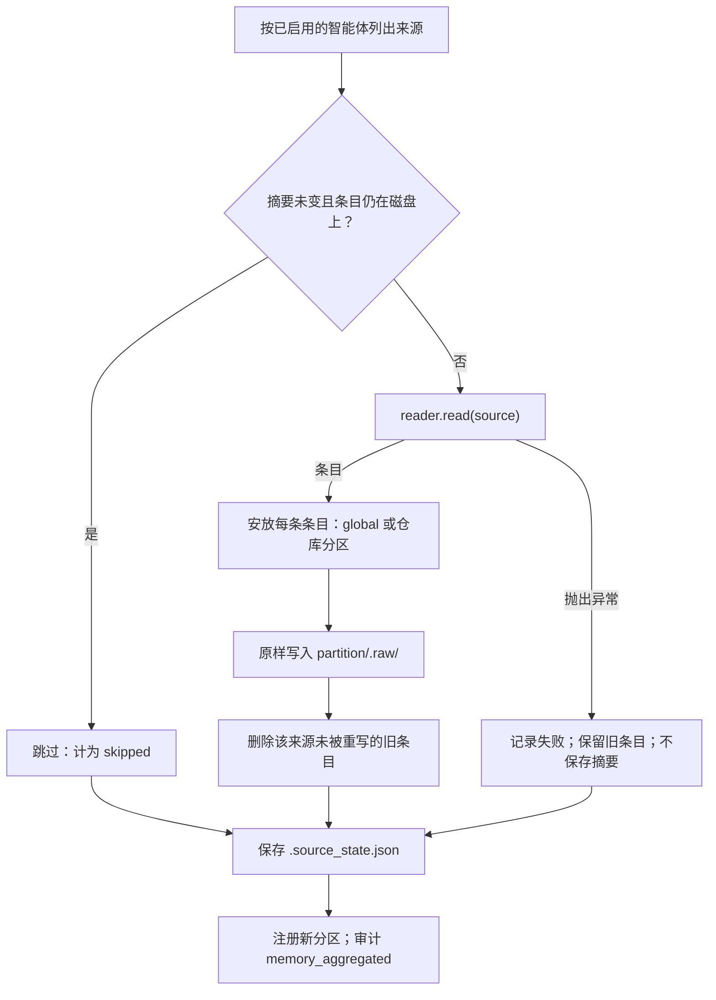
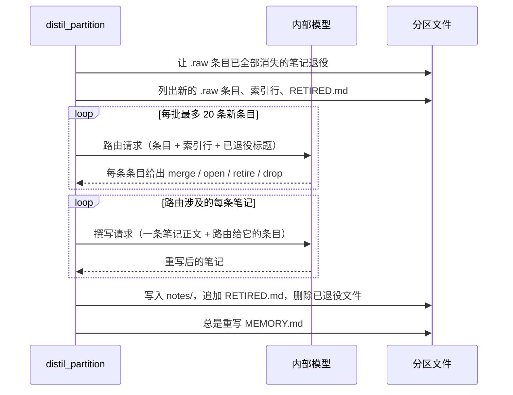
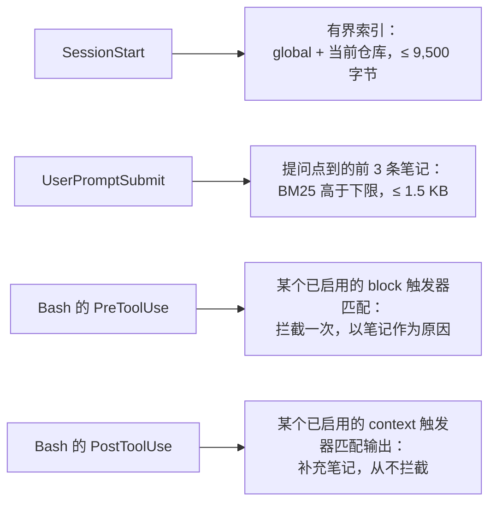
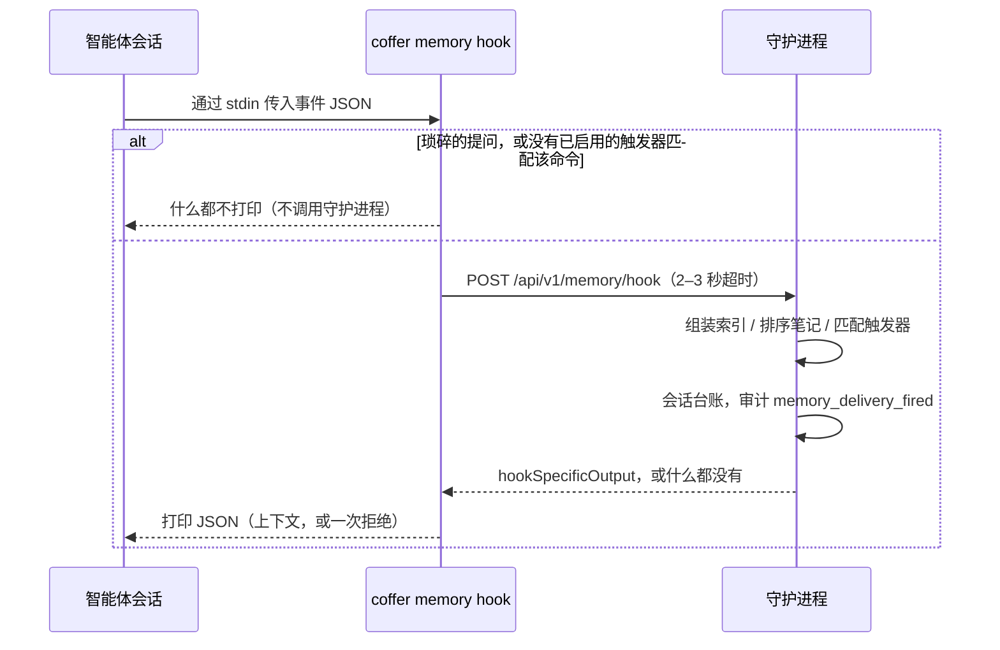

# 记忆 {#memory}

本页讲 Coffer 记忆层的工作原理：它如何从 Claude Code 和 Codex 自己的记忆文件里读出它们学到的东西，提炼成自己的笔记，再把结果交还给每个智能体。本页面向想了解机制和背后理由的工程师。按任务组织的说明见[记忆指南](/zh/guides/memory)。

## 要解决的问题 {#the-problem}

每个编程智能体都有自己的记忆，彼此却看不到对方的。Claude Code 在每个项目下一条事实写一个 Markdown 文件。Codex 把它的 rollout 提炼成任务组和一份档案。两者都做得不错，但知识只留在各自的目录里，结果你得把 Claude Code 已经知道的东西再教 Codex 一遍。

Coffer 的解法分三步：

1. **读取**每个智能体的原生记忆，但从不写入。
2. **提炼**读到的内容，写成 Coffer 自己的笔记：一个主题一个文件，按仓库归档，另有一个 `global` 分区存放关于你本人的内容。
3. **投递**这些笔记给每个智能体，时机有三个：会话开始时给索引；提问发出时给该提问点到的少数几条笔记；在执行某条被人标记为已知陷阱的命令之前，给说明原因的那条笔记。每次投递都写明笔记的绝对路径，智能体读正文的方式和读自己的记忆一样：当作文件读。

Claude Code 上午学到的东西，Codex 下午打开同一个仓库时，索引里就已经有了。Coffer 做到这一点并不需要写入 Codex 的记忆，只是把那一行索引交给 Codex。

记忆不是[知识](/zh/architecture/knowledge)。知识是人或智能体关于外部世界写下的东西，智能体通过 `coffer-guide` 目录按需拉取。记忆是智能体在工作中学到的东西，整棵树都能从智能体自己的副本重建。记忆是通过你为每个智能体安装的 Hook 交给会话的，所以它是 Coffer [拉取而非推送](/zh/architecture/design-principles#pull-not-push)原则的一个显式例外，而不是悄悄破例。这个例外原本只有会话开始时的索引。决策记录（ADR）[记忆在三个时机到达会话](https://github.com/wyx-sg/Coffer/blob/main/docs/decisions/memory-reaches-a-session-at-prompt-time-and-before-a-known-trap.md)（仍为 **Proposed**）把它扩展到每次提问和已知陷阱，并提议修订记忆相关的原则；在修订落地之前，原则页面仍按原样表述。知识依旧是拉取。

## 设计决策 {#design-decisions}

### 只聚合，从不回写 {#aggregate-never-write-back}

Coffer 读取原生记忆，但从不在其中创建、修改、移动、删除或重排任何文件，也从不禁用或改配智能体的原生记忆。原因有二：

- **不干扰任何智能体自己的循环。** 每个智能体仍按厂商的设计管理自己的记忆。Coffer 从不持有可能与原件产生偏移的第二份副本，所以没有什么需要调和。
- **整个存储都可以丢弃。** `~/.coffer/derived/memory/` 下的一切都是派生的。你可以删掉它，下一轮聚合和提炼会重建一套*等价*的笔记：同样的主题、同样的来源，措辞可能不同。正因如此，提炼可以放心地大刀阔斧改写笔记。

Coffer 唯一会写入智能体配置的，是它在智能体 *settings* 里的 Hook 条目。那个文件不是记忆，而且只有在你把智能体接入 Coffer 时才会写（见[投递](#delivery)）。

### 四个目录，各只有一个写入者 {#four-directories-with-one-writer-each}

分区是 `~/.coffer/derived/memory/` 下的一个顶层目录：

```
~/.coffer/derived/memory/
├── .source_state.json        ← last-seen digest per native source file
├── global/
│   ├── MEMORY.md             ← the index: what a session is given
│   ├── notes/                ← Coffer's own notes, one topic per file
│   ├── RETIRED.md            ← what was retired, and why
│   └── .raw/                 ← what was read out of the agents, verbatim
└── coffer/
    └── …
```

| 路径 | 写入者 | 作用 |
| --- | --- | --- |
| `.raw/` | 仅聚合 | 忠实。每个智能体的原话，一条一个文件，标注智能体、原生路径和读取时间。它只作为提炼的输入：Web 界面的文件树和分区文件路由都不会列出或读取它。 |
| `notes/` | 仅提炼 | 有用。Coffer 自己写的文字，一个主题一个文件，出处列出背后的每条原始条目。 |
| `MEMORY.md` | 仅提炼 | 可查找。每条笔记一行，按类型分组，最新的在前。 |
| `RETIRED.md` | 仅提炼 | 让退役生效。下一轮提炼会把它当作排除清单读取。 |

因为每个目录恰好只有一个写入者，提炼出了问题可以重跑，而不必重新读取智能体：`.raw/` 里仍保存着它们说过的一切。这条规则在代码里可以检查：`infrastructure/memory/raw_store.py` 是写入 `.raw/` 的唯一路径，提炼流程不会为了写入而导入它。

记忆根目录固定为 `~/.coffer/derived/memory/`，属于派生存储类别（见[持久化](/zh/architecture/persistence)），不能改。测试套件给每个测试一个独立的 `HOME`，所以测试永远不会改写开发者真实的记忆树。

### 一个分区就是一个仓库 {#a-partition-is-a-repository}

分区按**仓库**识别，而不是按路径。主检出、它的 worktree 以及第二份克隆都归入同一个分区。身份键由 `domain/memory/repository.py` 推导：

- 仓库有远端时，键是规范化后的远端 URL。规范化会去掉 scheme、用户名、端口、结尾的 `.git` 和结尾的斜杠，并把主机名转小写。路径的大小写保留，因为在大多数代码托管平台上 `owner/Repo` 和 `owner/repo` 是不同的仓库。所以 `git@host:owner/repo.git` 和 `https://host/owner/repo` 得到同一个键。
- 没有远端的仓库退回使用它自己的根路径。键上加了前缀，保证路径永远不会和 URL 撞键。

分区有一个可读的 slug，从不用不透明的 id。slug 取自仓库名。两个仓库同名时，Coffer 会逐级加上父路径片段作为前缀，直到唯一，所以两个都叫 `api` 的检出会变成 `work-api` 和 `personal-api`。分区的资源文件（`~/.coffer/derived/resources/memory/<slug>.json`）在 config 里记录 `repository_key` 和 `repository_path`，`MEMORY.md` 也会在头部重申仓库路径，让浏览这个目录的人知道它属于哪个项目。

有三条路会落到 `global`：

- 类型为 `user` 的条目，无论在哪个仓库学到，都进 `global`。它描述的是人，不是项目。`feedback` 条目没有自己的路线：在某个仓库学到，就归入该仓库的分区，因为在那里给出的长期指示（“在这里推送前先跑门禁”）约束的是那个仓库，归到全局就会把它交给其他所有项目的会话。
- 没有工作目录、或工作目录就是你的家目录的条目，进 `global`。
- 在不属于任何仓库的目录里学到的条目，进 `global` 的 `.raw/`。不会为那个目录创建分区。之后由提炼按条目本身判断，要么留在 `global`，要么什么都不留。

只有聚合会创建分区。`memory` 类型设置了 `generic_create_allowed=False`，`MemoryService` 通过生命周期的 opt-in 注册新分区。组装上下文从不创建分区。记录的仓库已不在磁盘上的分区，会在分区列表里显示为 `unresolvable`，你仍然可以删除它。聚合本身从不删除分区。

### 没有按智能体的生效范围，也没有开关 {#no-per-agent-reach-and-no-switch}

大多数资源类型都带有按智能体的**生效范围**（见[资源框架](/zh/architecture/resource-framework)）。记忆没有：它的类型把 `supports_scope` 保持为 `False`，并声明 `toggleable=False`，所以分区也没有启用开关，通用的启用/禁用路由会以 `RESOURCE_NOT_TOGGLEABLE` 拒绝。**每个**分区都投递给**每个**智能体。笔记本身就是记忆根目录下的文件。

这是有意为之。按智能体设默认值是很自然的想法，即“把分区限定给它聚合自的那些智能体”。但这个默认值恰好和这一层的目的相反。一个只从 Claude Code 填充的分区，会对在同一仓库工作的 Codex 隐藏，而 Codex 恰恰是还没学到这些的那个智能体。况且生效范围本来也不是真正的边界。笔记是任何本地进程都能打开的普通文件，所以分区上的任何开关最多只能决定 Coffer *提供*什么；一个被禁用的分区，依然是任何智能体都能读的文件。

### 什么都不同步 {#nothing-syncs}

记忆树派生自*这台*机器上安装的智能体，所以它永远不会到达[保险库同步](/zh/architecture/vault-sync)的远端。`memory` 类型声明的是派生存储类别（`Kind.storage`）：它的资源文件和整棵树都在 `~/.coffer/derived/` 下，位于保险库仓库之外，同步没有东西可带。每台机器聚合自己的智能体。只有人写下或启用的触发器存在保险库里（`vault/memory-triggers/`），因为它们是人写的，不是派生的。

### 没有自己的表 {#no-table-of-its-own}

笔记、原始条目、索引、退役记录和各来源的摘要都是文件。分区元数据在分区的派生资源文件里。这一层不新增任何表。

## 读取原生记忆 {#reading-native-memory}

每个受支持的智能体有一个读取器，实现 `domain/memory/reader.py` 里的 `MemoryReader` 协议。协议分两步：

- `sources(config_dir)` 列出智能体的记忆文件并逐个算哈希，不解析。
- `read(source)` 把一个文件解析成若干 `RawEntry`：标题、描述、类型、原文正文、锚点、项目根目录，以及可选的检索词。

拆成两步，聚合才能在付出解析代价之前跳过没变的文件。Coffer 只读**已注册且已启用**的智能体，路径由每个智能体自己的 `config_dir` 推导。

| | Claude Code（`readers/claude_code.py`） | Codex（`readers/codex.py`） |
| --- | --- | --- |
| 读取的文件 | `<config_dir>/projects/<slug>/memory/*.md` | `<config_dir>/memories/MEMORY.md` 和 `memory_summary.md` |
| 一条条目对应 | 一个事实文件 | 任务组里一个有内容的列表小节（`User preferences`、`Reusable knowledge`、`Failures and how to do differently`），外加 summary 里的档案和档案偏好 |
| 标题和描述 | frontmatter 的 `name` 和 `description` | 从列表项推导；反正提炼会重写 |
| 类型 | `metadata.type` 映射到 `feedback` / `project` / `user`；`reference` 视为知识而非记忆，跳过 | 组偏好 → `user`；知识和失败 → `project`；档案 → `user`，项目根目录为空 |
| 项目根目录 | 同级会话记录里记下的 `cwd`，退而从项目 slug 解码 | 任务组的 `applies_to: cwd=…` 行 |
| 检索词 | 无，因为该格式没有 | 来自 summary 里的 `## What's in Memory`，按保守的词元覆盖率关联到任务组 |
| 忽略 | 智能体自己的 `MEMORY.md` 索引 | `## General Tips`、rollout 引用小节、`raw_memories.md`、`rollout_summaries/` |

两个读取器都不把会话记录或 rollout 当作来源。两个智能体都已经在提炼自己的会话，Coffer 从那份产出开始。Claude Code 读取器读会话记录里的 `cwd` 只有一个目的：找到条目的项目根目录。

Codex 检索词的关联刻意保守。Codex 在 summary 里会改写组的标题，所以精确匹配标题几乎找不到东西。读取器改按词元覆盖率匹配，并且只有在恰好一个组过线、*并且*恰好一个 summary 主题认领该组时才附上检索词。归错比不归更糟。

读取器解析不了某个文件时，会抛出带文件路径的 `UnreadableMemory`。聚合把这个失败隔离在那一个文件上：这一轮会报告失败，附上智能体、路径和原因，其他来源照常聚合，坏掉的来源之前产出的东西一条都不会被清理。读取器抛出的意外异常也按同样方式隔离。

## 聚合流程 {#the-aggregation-pass}

`application/memory/aggregate.py` 把这一轮实现为一个作用在普通值和派生树上的纯函数。`MemoryService.aggregate` 在外面包上资源相关的部分：列出已启用的智能体和已有的分区行，注册新分区，并记一条 `memory_aggregated` 审计事件。



### 跳过未变的来源 {#skipping-unchanged-sources}

`.source_state.json` 在记忆根目录下，`digests` 下存一个 `{native_path: sha256}` 映射，旁边有一个 `version`，每轮结束后原子写入。只有**同时**满足以下两点，来源才会被跳过：

1. 它的摘要与记录的一致。
2. 它产出的原始条目仍在磁盘上。

第二个条件让这棵树真正成为派生的。如果你删掉某个分区的目录而留下摘要文件，下一轮会发现条目不见了，重新读取来源并重建一切。仅凭摘要一致，永远不会阻止重建。这条规则的代价很小：一个本来就不产出条目的来源每轮都会被重新解析。

摘要文件丢失或损坏时，下一轮会重新解析所有来源。正确性不受影响。

`version` 是归档规则的版本（`infrastructure/memory/source_state.py` 里的 `STATE_VERSION`）。摘要只说明来源没变，并不说明安放其条目的规则没变，所以改变条目归属的构建会提升这个版本。在其他版本下写的文件读出来为空：下一轮会把每个来源重读一次，按当前规则归档条目，并删掉之前写在别处的那些。

### 稳定的原始条目 {#stable-raw-entries}

原始条目的文件名是一个来源键：对 `(agent, native_path, anchor)` 做 SHA-256，取前 16 个十六进制字符。锚点是条目在来源中的位置，例如事实文件的 `name`，或 Codex 列表项的内容哈希。所以对未变来源的第二次读取会覆盖同样的文件，而不会新增近似重复。当智能体从自己的记忆里删掉某个列表项，重读不再产出那条条目，这一轮就会从 `.raw/` 删掉那个过期文件。

聚合从不比较两个智能体的条目。两个智能体描述同一个教训时几乎没有相同的措辞，所以字面比较什么也合并不了。按含义合并是提炼的事。

## 提炼流程 {#the-distil-pass}

提炼把一个分区的新原始条目变成笔记，并重写 `MEMORY.md`。它作为内部引擎的一项维护任务按自己的间隔运行，而不是每次聚合后都跑；它会扫过所有还有未提炼原始条目的分区，没有新内容的分区不产生任何模型调用。配置了[内部引擎](/zh/guides/providers)连接时，提炼就用那个连接。它是增量的：没有哪一次模型请求会携带一个分区的全部笔记正文。

在任何路由之前，这一轮先让所有 `origins` 都已不在 `.raw/` 下的笔记退役（见[来源已消失的笔记](#notes-whose-sources-are-gone)）。一条条目的 id 既不出现在任何笔记的出处（`origins`）里，也不出现在任何 `RETIRED.md` 记录里，就算作新条目。



### 两个阶段 {#two-stages}

1. **路由。** 每批最多 20 条新条目发一次请求，每条条目的文本上限 2,000 个字符。请求携带这一批条目、分区的**索引行**以及 `RETIRED.md` 里的标题，但不带任何笔记正文。模型对每条条目给出四种动作之一：
   - **merge**：合并进一条指定的已有笔记，
   - **open**：新开一条笔记（可以和同一批里的另一条条目合开，两个智能体对同一个教训的首次记录就是这样合成一条笔记的），
   - **retire**：让与该条目相矛盾的笔记退役，
   - **drop**：什么都不留。
2. **撰写。** 路由涉及的每条笔记发一次请求。请求携带该笔记当前的正文和路由给它的条目，返回重写后的笔记。

所以一个有 100 条笔记的分区新增三条条目，代价是一次针对 100 行索引的路由请求，外加最多三次小的撰写请求。

### 退役是持久的 {#retirements-stick}

退役会从 `notes/` 删掉笔记文件，并向 `RETIRED.md` 追加一条记录：标题、原因、替代笔记（如有），以及该记录排除的原始条目 id。drop 也以同样方式记录。这是让删除真正生效的唯一机制。已退役笔记背后的材料仍在智能体自己的记忆里，不受 Coffer 控制，下一轮聚合还会再读到它。没有这条记录，下一轮提炼就会把笔记重新开出来。

### 来源已消失的笔记 {#notes-whose-sources-are-gone}

当来源不再产出某条原始条目时，聚合会删掉它：要么智能体从自己的记忆里删掉了那条事实，要么安放规则现在把条目归入了另一个分区（例如带项目根目录的 `feedback` 条目会从 `global` 移到那个项目）。一条只由这类条目构成的笔记，底下已经什么都不剩，所以每一轮提炼（包括机械模式那一轮）都会先让它退役：文件离开 `notes/`，`RETIRED.md` 增加一条带原因和 `sources_gone: true` 的记录。至少还有一个来源存活的笔记不受影响。

这条记录不是排除项。它不列任何条目 id，它的标题也不会作为已退役主题发给路由，因为没有人判断这条笔记是错的。如果材料回来了，就像任何新条目一样被提炼。

### 安全降级 {#degrading-safely}

- **没有内部连接。** `_distil_mechanically` 是一个同步函数，没有可以调用模型的补全端口。每条新条目各自成为一条笔记，带上来源的标题、描述、文本、类型和检索词，索引根据它们的 frontmatter 写出。结果更单薄，但仍然可用。
- **模型输出格式不对。** 未知的 slug、不是 JSON 的回答、或者动作指向了本批之外的条目，都会记日志并跳过。受影响的条目留在 `.raw/` 等下一轮。这一轮从不因为坏输出而抛异常。
- **`MEMORY.md` 在每条路径上都会写**，包括什么都没变、以及所有模型调用都失败的情况。会话开始时的投递来自索引，没有索引的分区在会话开始时就什么也投递不了。

每一轮都会记一条 `memory_distilled` 审计事件，附上计数 `merged`、`opened`、`retired`、`dropped` 以及 `model_used`。

### 每个分区同时只跑一轮 {#one-pass-per-partition}

间隔 worker 和「更新记忆」（`POST /api/v1/memory/sync`、`coffer memory sync`）都会在共享的维护任务登记表里认领分区的 **uid**。「更新记忆」会把已有一轮在跑的分区报告在 `skipped` 下，并提炼其余分区。worker 会跳过忙碌的分区，下次扫描时再来。登记表在内存里，每个守护进程一份。

## 索引行 {#the-index-line}

`application/memory/index.py` 为每条笔记渲染一行。`MEMORY.md` 和投递都用它，所以两者永远不会不一致：

```md
- **Worktrees for parallel sessions** (`worktree-for-parallel-sessions.md`) — Another session edits the main checkout; work in a git worktree. · look up: worktree, parallel session
```

一行承载的是笔记的结论，而不是指向它的指针，所以读完索引通常事情就办完了。它用相对路径命名文件，因为目录在每个投递面只说明一次。来源提供了检索词时，它会重复这些检索词。两个投递面按同一个“最新”定义排序，即 `index.recency`：笔记的 `updated_at`，退而取 `created_at`，再退而取来源的时间戳。它是一条回退链而不是 `max()`：刚重建完时，所有来源共享同一个捕获时间，用 `max()` 会让排序塌缩。

## 投递 {#delivery}

记忆在**三个时机**、通过**四个 Hook 事件**到达会话：



1. **会话开始时**，给出 `global` 和当前仓库的有界索引，并说明笔记正文在哪里。
2. **每次有实质内容的提问时**，给出该提问点到的少数几条笔记，按字面匹配排序。
3. **踩到已知陷阱之前**，给出某人与一条命令绑定的那条笔记，作为这条命令被拦截一次的原因。同一套触发器机制也会在命令输出显示已知错误*之后*补充一条笔记。

设计、权衡过的方案和证据见决策记录（ADR）[记忆在三个时机到达会话](https://github.com/wyx-sg/Coffer/blob/main/docs/decisions/memory-reaches-a-session-at-prompt-time-and-before-a-known-trap.md)。其状态为 **Proposed**。

### 为什么是三个时机 {#why-three-moments}

这份 ADR 在真实会话中取了 107 个经人工核对的时刻来衡量投递，这些时刻里智能体需要的东西存储中都已经有了。大部分遗漏来自两种不同的失败，比例大致相当：

- **从未投递。** 事实存在，但从未到达会话。索引被截断了、会话解析到了错误的分区，或者 Coffer 根本没接到那个智能体。只有在提问时检索才能修好这一半。
- **投递了却没照做。** 规则就在上下文里，会话开始时读过，二十个轮次之后照样违反。只有在命令处匹配才能覆盖这一半，而且它也是唯一能抓住已知陷阱重犯的手段，这是最大的单一类别。

在六个曾经踩过的陷阱上实跑，仅有会话开始时的索引，18 次中只有 1 次首次尝试就避开了错误。检索加守卫，18 次全部避开，每次运行注入约 320 个 token。每一层都覆盖了另外两层覆盖不到的：索引覆盖第一条消息，检索覆盖提问点到的规则，守卫覆盖藏在命令里的陷阱。

### 会话开始时：有界索引 {#at-session-start-the-bounded-index}

`application/memory/context.py` 里的 `compose_context` 为某个工作目录构建会话开始时的内容：

1. 按包含 `cwd` 的最长已记录 `repository_path` 把 `cwd` 解析到一个分区。因此 worktree 会解析到它所属仓库的分区。未知目录解析到 `global`。
2. 按顺序输出：一个 `## Coffer memory` 标题、*Known about you:* 下的 `global` 各行、当前仓库的各行、一行给出 `notes/` 目录的绝对路径并说明把笔记当文件读，以及一行给出记忆根目录，用于查找其他仓库的笔记。
3. 不提任何工具。所有使用方都是本来就会读文件的本地进程。

这份内容有两个上限：

- **token 上限** 为估算的 12,000 个 token（`DEFAULT_CEILING_TOKENS`），按整份索引而不是几行来定。
- **字节上限** 为 9,500 个 UTF-8 字节（`DELIVERY_CEILING_BYTES`），适用于已安装 Hook 打印的任何内容。两个智能体都会截断更长的 Hook 输出，而两种截断都会丢掉关键的行：
  - **Claude Code** 把 Hook 输出内联保留到约 10,000 个字符。超过后，它把输出存到文件里，只给模型看约 2 KB 的预览，其中只有最新的几行 `global`，完全没有仓库的内容。
  - **Codex** 把 `additionalContext` 保留到 2,500 个 token，按 UTF-8 字节数 / 4 计算。超过后，它保留头尾、砍掉中间。

  文本的字符数永远不会多于字节数，所以一个字节数就能同时满足两个智能体。真实保险库的索引有 30–45 KB，所以在会话开始时起作用的是这个上限。

触及上限时，**先保证当前仓库的行**，剩下的给 `global`。每个小节内最旧的行先被丢弃，并附一条提示，说明丢了多少行、在哪个目录里。所以裁剪之后，每条笔记仍然能作为文件找到。没有内容可投递时，文本为空，而不是只有一个光秃秃的标题。

组装上下文不会向任何地方发送任何东西。笔记内容只会经由提炼的内部连接离开本机。

### 每次提问时：字面检索 {#at-each-prompt-lexical-retrieval}

在 `UserPromptSubmit` 时，守护进程用提问对会话所在仓库分区和 `global` 的笔记排序，并把最好的几条加入会话。`domain/memory/retrieval.py` 放排序器，`application/memory/retrieval.py` 放包在外面的服务。

- **排序对象。** 每条笔记的标题、描述、检索词和正文，合成一个文档。
- **方法。** 基于词元的 Okapi BM25，CJK 文本切成重叠的双字 bigram，所以不需要分词器，中文提问也能找到中文笔记。一个小的停用词表去掉太常见、不含信息的词。
- **投递内容。** 得分达到或超过**相关性下限 4.0** 的**前三条**笔记，跳过本会话已经给过的笔记，整次投递（含标题）不超过 **1,500 个 UTF-8 字节**。会超出预算的笔记直接跳过，而不是截断。
- **什么时候不投递。** 少于三个词的提问，或 `continue`、`ok`、`继续` 这类单纯的催促，什么都不检索。最佳匹配低于下限的提问也一样。

这个下限是在评测集上对照真实规模的存储校准的，在那里，一条笔记会和点到它的提问共享一些罕见词。BM25 按一个词在整个存储里有多罕见来加权，只有寥寥几条笔记的存储得分都偏低，很少能过线。这是预期行为。下限防止只和笔记共享常见词的提问把它带进来；随着智能体不断学习，存储会长大到超过这个下限。

**索引是派生的，只存在内存里。** 守护进程为每个仓库分区连同 `global` 建一个排序索引，当任一分区的 `notes/` 在文件名、修改时间或大小上变化时重建。它从不写盘，也没有任何东西对笔记分块或做 embedding。笔记始终是唯一的副本；索引只是它们的一个视图，和 `MEMORY.md` 一样。embedding 做过测量并被否决：在评测集上多出三个点的召回率，抵不上一个 2.2 GB 的本地模型，而且产品早已为字面检索放弃了 embedding。

### 踩到已知陷阱之前：守卫 {#before-a-known-trap-the-guard}

**触发器**是某人做的标记：某条笔记是与某条命令绑定的已知陷阱。触发器是人写的内容，不是派生的记忆，所以它们放在保险库里，每个一个 Markdown 文件，位于派生树旁边而不是里面。删除并重建 `~/.coffer/derived/memory/` 不会丢失任何触发器。

```md
---
id: frontend-vitest-needs-node-20-3fa1c2
note: coffer/frontend-vitest-needs-node-20
kind: block
command: ^make verify
unless: v20
error: ''
armed_by: cli
armed_at: '2026-09-30T08:12:03+00:00'
proposed_by: ''
created: '2026-09-30T08:12:03+00:00'
---
```

文件是 `~/.coffer/vault/memory-triggers/<id>.md`。它的 frontmatter 以 `<partition>/<slug>` 的形式指明笔记，还有 `kind`、`command`、`unless` 和 `error` 模式（Python 正则表达式）、谁提议的、谁在什么时候启用的、以及创建时间。可选的正文是笔记本身不存在时显示的原因。解析失败的文件会被跳过并记日志，所以一个坏文件永远不会挡住其他文件。

触发器有两种：

- **`block`** 拦截命令。在 shell 的 `PreToolUse` 上，命令的 `command` 模式会与每个**真正执行**的 shell 片段匹配：即以 `&&`、`||`、`;`、`|`、换行、`(` 和 `$(` 分隔的片段，每个片段去掉 `VAR=value` 前缀，程序名缩成基本名。模式从每个片段的程序和参数**开头**匹配——如果程序是运行脚本的解释器（`bash`、`sh`、`zsh`、`python3`、`node`……），则从脚本的基本名开始——所以它只看到真正运行的东西：`e2e` 会拦 `bash scripts/e2e.sh`，放过 `cat scripts/e2e.sh`；`make\s+verify` 放过 `echo make verify is slow`。`unless` 模式与整条命令（含前缀）匹配。匹配时说明命令已经在做笔记要求的事（`PATH=…/v20…/bin:$PATH make verify`），触发器保持安静。
- **`context`** 从不拦截。在 shell 的 `PostToolUse` 上，当命令输出出现 `error` 模式（如果触发器有 `command` 模式，也要匹配它）时，把笔记作为上下文加入会话。

会话中第一条被 `block` 触发器匹配的命令会**被拒绝一次**，走的是智能体自己的拒绝决策，以笔记作为原因，并附一行说明只拦这一次。同一个触发器在该会话里不会再拦其他命令，所以智能体的下一次尝试会通过，刻意的重跑也永远不会被卡住。`context` 触发器每个会话同样最多触发一次。不带 `session_id` 的触发什么都不拦，因为“每会话一次”需要一个会话来计数。

触发器只作用于能**触达其笔记**的会话：`global` 笔记的触发器作用于每个会话，仓库笔记的触发器只作用于该仓库的会话。

**只有人能启用触发器。** 人写的触发器（`coffer memory trigger add`、`POST /api/v1/memory/triggers`）在写入时就由这个人启用。提炼可以**提议**触发器：撰写阶段在重写某条笔记时，如果判断它是与特定命令绑定的已知陷阱，可以返回一个命令模式和一个 `unless` 模式。提议以未启用状态归档，带 `proposed_by: distil`，没有 `armed_by`，在有人启用之前什么都不做。提议按笔记、种类和模式去重。自动派生的触发器做过测量并被否决：宽泛的每个会话触发约 25 条笔记而相关的不到一条，修剪过的又丢掉了陷阱恰恰所在的那些命令。对一个能拦截的东西来说，精确就是它全部的价值。**不预置任何触发器**：新的保险库在有人写一个或提炼提议一个之前，没有任何触发器。

触发器引用笔记而不是复制它，所以显示的原因永远是笔记当前的内容。提炼重写笔记时，触发器的消息随之更新。

### 投递的笔记如何措辞 {#how-a-delivered-note-is-worded}

在提问时、命令前或命令后投递的每条笔记，读起来都是**出处加事实**。它写明笔记的文件，并把标题和描述表述为：`feedback` 笔记是 “the user's standing rule is: …”，其他则是 “a fact they recorded: …”：

```text
Coffer memory, a note recorded for this user (/Users/you/.coffer/derived/memory/coffer/notes/frontend-vitest-needs-node-20.md): the user's standing rule is: Frontend vitest needs Node 20 — run make verify under Node 20; 22 and 24 exit 1 with every test green. (Held once by a Coffer memory trigger so you can adjust; run it again if it is still what you intend.)
```

这样措辞是有意的。在早先一轮评测里，一条写成祈使句（“删掉分支和 worktree”）、在命令前投递的笔记，被智能体当作提示词注入向用户引述出来。改成表述为用户的长期规则之后，72 次运行中 0 次把笔记标记为注入。投递的文本从来不是给智能体的指令，命令时投递的内容也从不要求执行破坏性操作。

### 一条命令，四个 Hook 条目 {#one-command-on-four-hook-entries}

投递通过智能体自己的 Hook 机制到达智能体。Coffer 的 Hook 是**四个条目**，每个事件一个，每个条目运行同一条命令，**按绝对路径**调用 Coffer 的 CLI：

```sh
: coffer-memory; /Users/you/.coffer/bin/coffer memory hook --agent-uid <uid> --cwd "$PWD"
```

| 事件 | 匹配器 | 条目超时 | 能回答什么 |
| --- | --- | --- | --- |
| `SessionStart` | `startup\|resume\|clear\|compact` | 10 秒 | 有界索引，作为 `additionalContext` |
| `UserPromptSubmit` | 无 | 5 秒 | 检索到的笔记，作为 `additionalContext` |
| `PreToolUse` | `Bash` | 5 秒 | `permissionDecision: "deny"`，以笔记作为 `permissionDecisionReason` |
| `PostToolUse` | `Bash` | 5 秒 | 笔记，作为 `additionalContext` |

两个智能体拿到的是同样的四个条目：Claude Code 写在 `settings.json`，Codex 写在 `hooks.json`。两者都以同样形状的 JSON 通过 stdin 把事件交给 Hook（`hook_event_name`、`session_id`、`cwd`、`prompt`，shell 事件还有 `tool_name: "Bash"`、`tool_input.command` 和 `tool_response`），也都在每个事件上读回同样的 `hookSpecificOutput` JSON。所以 `coffer memory hook` 从 stdin 读事件，转发给守护进程的 `POST /api/v1/memory/hook`，再把返回的内容打印出来。`--cwd "$PWD"` 只是输入里没有 `cwd` 的事件的兜底。所有事件共用一条命令，意味着判断是否过时只需要看一个字符串，Codex 每个条目也只有一种哈希形状。要查看每个智能体在会话开始时拿到的文本，运行 `coffer memory delivered <partition>`。

**为什么是拒绝，而不是提醒。** `PreToolUse` Hook 也可以回答 `additionalContext`，那样永远不会打断智能体。但 Claude Code 会在命令**运行之后**才把 `PreToolUse` 的上下文连同结果一起交给模型，所以那里的提醒只能帮智能体补救，拦不住第一次尝试。只有 `permissionDecision: "deny"` 能做到。Codex 同样遵守这个拒绝，并给模型显示 `Command blocked by PreToolUse hook: <reason>`。命令之后才是给出错误上下文的正确时机，所以 `context` 种类放在 `PostToolUse` 上。

路径由组合根解析，优先使用稳定的 `~/.coffer/bin/coffer`，而不是它背后的版本目录。只写 `coffer` 不够，因为 Hook 在智能体启动的任意 shell 下运行。Codex 在不加载用户 rc 文件的 `/bin/zsh` 下运行 Hook，所以那个 shell 的 `PATH` 里没有 `~/.coffer/bin`。从 Dock 启动的 Claude Code 也不继承登录 shell 的 `PATH`。

开头的 `: coffer-memory;` 是一个携带标记的 shell 空操作。Coffer 靠这个标记查找、替换和删除自己的条目，从不碰同一事件上其他工具的 Hook。安装或移除都会先把 Coffer 带标记的条目从**所有**事件上清掉，所以任何其他事件上都不会遗留带标记的条目。安装始终是显式操作：Hook 是智能体 Coffer 连接的一部分（`coffer agent connect`，或智能体页面上的「连接到 Coffer」；见[智能体](/zh/guides/agents#connect-an-agent-to-coffer)）。它是幂等的，移除条目后还会顺手删掉空的事件数组和空的 `hooks` 键。智能体以不可变的 uid 命名，因为 Hook 字符串可能在 settings 文件里躺好几个月，而你期间可能给智能体改名。



### 失败即放行 {#failing-open}

记忆从不因为 Coffer 宕机而挡住提问或命令。以下情况 CLI 什么都不打印并以 0 退出：没有守护进程在运行；守护进程没有及时回答（会话开始时 3 秒，提问或命令时 2 秒，都在条目自身的超时之内）；或者它回了错误、或回了 CLI 读不懂的内容。

一次不可能投递任何东西的触发根本不会联系守护进程。CLI 用和守护进程相同的判断在本地处理琐碎提问，并自己读取 `vault/memory-triggers/` 里已启用的触发器，所以一条没有任何已启用触发器匹配的 shell 命令，代价只是一次进程启动和一次目录读取，而不是一次往返。所有依赖状态的判断仍由守护进程决定：会话在哪个分区、笔记能否从那里触达、本会话是否已经拿到过它。

### 按会话的台账 {#the-per-session-ledger}

有两项承诺依赖于记住每个会话拿到过什么：为某次提问检索到的笔记，在同一会话中不会再次检索；一个触发器在每个会话中最多拦截或补充一次。守护进程把两者都记在**内存中的按会话台账**里，以智能体交给 Hook 的 `session_id` 为键（消息渠道的轮次则是 `conversation:<id>`），上限为最近的 2,048 个会话。

它从不以进程 id 为键。同一个 Codex app-server 的所有会话共享一个父 pid，所以以 `$PPID` 为键的守卫在 Codex Desktop 和各 IDE 宿主下只会对每个 app-server 的第一个会话触发。

台账不需要自己的表也能挺过守护进程重启。每一次有投递的触发都已经是一条 `memory_delivery_fired` 审计事件，记着它的会话、笔记，以及触发器触发时的触发器。新的守护进程在回答第一个提问或命令之前，`restore_from_audit`（`application/memory/ledger_restore.py`）会把最近七天的触发按从旧到新读回台账。所以正在运行的会话在重启后不会再次拿到同一条笔记，触发器也不会在其中拦第二条命令。闲置超过七天的会话视为新会话。审计日志读不出来时，失败会记日志，台账从空开始；代价是多一行重复内容或多一次拒绝。

### 审计与投递视图 {#audit-and-the-delivery-views}

每次**有投递**的触发都是一条 `memory_delivery_fired` 审计事件，资源和操作者都记为该智能体，details 给出它的 `moment`（`session_start`、`prompt`、`guard` 或 `error`）、`session_id`、它携带的笔记（形如 `<partition>/<slug>`），以及触发器触发时的触发器 id。事件从不携带笔记文本。会话开始每次触发都记录；提问、守卫或错误的触发只在投递了笔记时记录。触发器的操作也会审计：`memory_trigger_added`、`memory_trigger_proposed`、`memory_trigger_armed`、`memory_trigger_disarmed` 和 `memory_trigger_deleted`，每条都写明触发器及其笔记。

两个只读的**投递视图**把这些记录变成答案。两者在 REST 和 CLI（`coffer memory delivered`）上都有：

- **总览**（`GET /api/v1/memory/deliveries`、`coffer memory delivered`）。对每个装了投递 Hook 的智能体，统计最近七天：记忆到达它多少次、按时机的同样计数、最后一次是什么时候，以及它的会话打开过多少条**不同的笔记**。最后这个数字是从智能体工具调用中出现的文件路径读出来的：记忆根目录下指向一条笔记的路径才算，笔记、工具结果或消息里说了什么一概不读。只有提到记忆根目录的会话记录行才会被解析，每份会话记录的结果按修改时间和大小缓存。智能体的会话记录读不了时，计数报告为**不可用**，而不是零。聚合仍然不读任何会话记录；这是对文件路径的可观测性。
- **单个分区的「投递内容」视图**（`GET /api/v1/memory/partitions/{uid}/delivered`、`coffer memory delivered <partition>`）。每个智能体在该分区所属仓库里拿到的**确切**会话开始文本，由与 Hook 相同的函数、在相同的上限下组装。读取它不会记录任何东西。

两个视图都不说明 Hook 是否已安装或已被信任。那是智能体 Coffer 连接的属性，在智能体页面上：它的连接状态、「钩子」标签页、`coffer agent show` 和 `coffer agent hooks`。Hook 自身的状态同样只报告是否安装，不带最后触发时间。它是否*触发*是一串事件，你在投递视图或[活动](/zh/guides/activity)页面里读。

### Codex 的批准 {#codex-s-approval}

Codex 只在用户审查过 Hook 之后才运行它，并把每次批准记在 `config.toml` 里，每个条目一条记录：

```toml
[hooks.state."/Users/you/.codex/hooks.json:session_start:1:0"]
trusted_hash = "sha256:…"
```

键由文件、事件、匹配器组的位置和处理器的位置组成。哈希覆盖条目定义的规范化形式。没有匹配哈希的条目会被静默跳过：没有错误，没有事件。有四个条目，用户就要在 `/hooks` 里批准四条记录，而 Coffer 的命令每改一次，都需要重新批准。在那之前，Codex 会跳过它没有批准记录的条目。

Coffer 按 Codex 的方式计算每个哈希，并读取这些记录。只有**每个**条目都被信任时，它的 Hook 才算被信任；否则它的信任状态取按文件顺序第一个未被信任的条目。它从不写入记录：

- **这是 Codex 的审查关口。** 一个工具安装了 Hook 又自己批准它，就去掉了用户查看将要运行什么的唯一时机。
- **过时的算法副本必须显式地失败。** 如果 Coffer 写入哈希而它的算法副本过时了，Coffer 会报告 Hook 已批准，而 Codex 却跳过它，这恰恰是本节要防止的失败。用过时算法去读，失败则是可见的：Coffer 显示“需要批准”，而 Codex 实际上在运行这个 Hook。

结果就是 Coffer Hook 的**信任状态**：`trusted`、`untrusted`、`modified`（批准的是更早的命令）、`disabled`、`unknown`，或者对 Claude Code 是 `not_required`，因为它会运行 settings 里的每个 Hook。它出现在 `coffer agent hooks`、`GET /api/v1/agents/{uid}/hooks`、智能体的「钩子」标签页里，也会作为一个待处理项出现。解决办法永远一样：打开 Codex，运行 `/hooks`，信任 Coffer 的四个条目。

### 让 Hook 保持最新 {#keeping-hooks-current}

检测只匹配标记，从不读参数。所以一个命令已经过时的 Hook（例如因为某个 CLI 参数改了）仍然显示为已安装，却在每次触发时失败。因此 Hook 是[调和器](/zh/architecture/reconciler)的一个目标。每一轮（启动时、每分钟一次、以及任何智能体变化后不久），调和器都会把每个已安装的 Hook 与当前运行的构建会安装的内容比较：条目所在的**事件集合**，以及每个条目的完整命令。有差异的 Hook 会被重写成当前的四个条目。某个 settings 文件读不了时，报告为 blocked，不影响其他文件。

对 Codex，这个目标还会比较信任状态。一个内容是最新的、但 Codex 不会运行的 Hook，差别只在信任上。这个差别在待处理列表里报告为 `hook_untrusted`（或 `hook_disabled`、`hook_trust_unknown`），附上解决办法，而且从不写入。

普通的一轮从不安装 Hook：缺少 Hook 的已连接智能体会被报告出来，显示为部分连接，直到再次连接。

### 消息渠道的轮次 {#channel-turns}

来自 Telegram 或 SeaTalk 的轮次由 Coffer 自己驱动，所以这个轮次的记忆也由它自己组装。`wire_chat` 把 `surfaces/http/memory_turn_wiring.py` 里的两个闭包交给两个智能体提供方，两个闭包都捕获了 `TurnRetrieval`（`application/memory/turn_retrieval.py`）：

- `memory_context_composer` 负责给出索引。`infrastructure/chat/adapter_support.py` 里的 `compose_system_context` 只在消息渠道驱动的轮次调用它，并传入对话的工作目录。它运行与 Hook 相同的 `compose_context`，所以消息渠道的轮次在系统提示词里拿到的索引和笔记路径，与终端会话拿到的一样。这次投递记为作答智能体的一次 `session_start` 触发，事件为 `ChannelTurn`。
- `memory_turn_retriever` 负责给出提问点到的笔记。提供方只在消息渠道驱动的轮次把它绑定到该轮次（`infrastructure/chat/prompt_memory.py`），适配器把它返回的内容加在所发送提示词里用户文本的后面——也就是 `UserPromptSubmit` Hook 的上下文会落到的位置，所以笔记留在智能体自己的会话里。`TurnRetrieval` 调用的是 Hook 所走的同一个 `RetrievalService`，以 `conversation:<id>` 作为会话 id，所以一条笔记每个对话只给一次；它把这次投递记为作答智能体的一次 `prompt` 触发，事件为 `ChannelTurn`。存进对话的消息是用户自己的原文。

两个闭包什么都没找到、或者树读不了时（会记日志；记忆是轮次的附加内容，不是前提），都什么也不返回。

Coffer 为这个轮次启动的智能体进程仍会加载智能体自己的设置：Agent SDK 读取用户的 `settings.json`，`codex app-server` 运行已被信任的 `hooks.json`。所以在已连接的智能体上，Coffer 的 Hook 在消息渠道轮次里同样会触发；如果没有专门的规则，它会第二次把索引和笔记交给智能体（它的台账以智能体的会话 id 为键，从没见过这个轮次的 id），并把每次提问审计两遍。因此每个时机只有一个负责方。提供方在消息渠道轮次的进程环境里设置 `COFFER_CHANNEL_TURN=1`（`domain/channel_turn.py`，合并在守护进程自身的环境之上），智能体会把这个环境传给它运行的每个 Hook，`coffer memory hook` 看到这个标记时，在 `SessionStart` 或 `UserPromptSubmit` 上什么都不回答。它不联系守护进程，所以什么都不记录。守卫和错误上下文仍然走 Hook，因为轮次本身不投递这两者：已连接智能体上的消息渠道轮次，和终端会话一样会被已启用的触发器拦截。

来自 Web 对话页面的轮次不带这个标记，也不会拿到这两个闭包。它通过智能体自己的 Hook 获得记忆，所以没有哪个轮次会两路都拿到记忆。

### 关于每个轮次的规则不归记忆管 {#rules-about-every-turn-are-not-memory-s-job}

关于**每一次**回复的规则，比如用什么语言回答、什么语气，是检索和触发器都投递不了的。没有哪个提问会点到它，也没有哪条命令会触发它。在评测中，“用中文回复”在所有投递条件下都失败了。这类规则应该放在智能体每个轮次都会加载的指令里，即你自己维护的 `CLAUDE.md` 或 `AGENTS.md`。Coffer 从不写这些文件，理由和它从不写智能体原生记忆一样：安装或触发记忆 Hook 都会让它们保持逐字节不变。

## 在其他分区里找笔记 {#finding-a-note-in-another-partition}

记忆层没有 MCP 工具。笔记是 Markdown 文件，每个分区的 `notes/` 都在同一个**记忆根目录**下（`~/.coffer/derived/memory/`，由 `coffer path memory` 打印），所以用智能体自己的文件工具搜一次就能覆盖所有分区。投递的内容里写明了这个根目录，网关的 `initialize` 文本里也有。当前仓库的索引已经在会话上下文里；根目录是给会话*没有*在其中打开的分区里的笔记用的。

对文件的搜索永远不会把原始条目或已退役的笔记当成笔记：原始条目在 `.raw/` 下，已退役的笔记离开 `notes/` 进了 `RETIRED.md`。也没有 `remember` 工具。智能体照常记录，Coffer 在下一轮读取。

## Worker 与调度 {#workers-and-scheduling}

两个流程都以 asyncio 任务运行，由守护进程从 `surfaces/http/memory_wiring.py` 启动：

| Worker | 首次运行 | 默认间隔 | 审计操作者 |
| --- | --- | --- | --- |
| `AggregateWorker` | 启动时立即运行 | 1 小时 | `system:memory-aggregate-worker` |
| `DistilWorker` | 60 秒后 | 6 小时 | `system:memory-distil-worker` |

两者默认开启。它们读智能体的文件，只写派生树，所以无人值守地运行没有风险。每一轮都会**逐轮**从内部引擎配置（`aggregate`、`distil`）读取自己的开关和间隔，所以在设置里的修改无需重启就生效。失败的一轮会记日志，从不终止循环。关闭时，待执行的一轮会被丢弃，因为下次启动会再全部扫一遍。你也可以一次手动运行两者：`coffer memory sync`、`POST /api/v1/memory/sync` 或 Web 界面的「更新记忆」按钮（`application/memory/update.py`）会先聚合，再提炼所有还有未提炼原始条目的分区。提炼已在运行的分区报告为 `skipped`，而不会让调用失败。回答中包含聚合写了什么，以及 `distilled` 和 `skipped` 的分区。

## 权衡与备选方案 {#trade-offs-and-alternatives}

- **把 Coffer 自有的存储投射进每个智能体的记忆。** 这能免费获得自动加载，但代价是写入、软链接或禁用别的工具的记忆。这很侵入、难以理解，而且厂商一改就容易坏。聚合让每个智能体的循环保持原样，代价是一个 Hook。
- **把来源的原话直接当作产品。** 这样引用能保持精确，但 Codex 没有标题的列表项会变成标题、描述和正文都是同一句话的笔记。Coffer 把原文保存在 `.raw/`，由出处指向它，笔记则用自己的话写。
- **有预算的摘要加一个搜索工具。** 智能体不会去调用工具查找它没被展示过的东西：Coffer 早先的 recall 工具在整个生命周期里只被调用过五次。两个受支持的宿主都会加载索引、把正文当文件读。Coffer 照搬这个形状，并写明记忆根目录，让其他分区的笔记只需一次搜索。
- **会话开始时给完整、不截断的索引。** 在回放中它覆盖的需求最多，但 30–45 KB 过不了任何一个智能体的 Hook 输出，而且即使完整投递，上下文里一半的规则也被忽略了。所以才有了有界索引加检索和守卫。
- **在 `PreToolUse` 上给提醒而不是拒绝。** Claude Code 在命令运行之后才交付那份上下文，所以它只能帮助补救。它以 `PostToolUse` 上的 `context` 触发器的形式保留下来，在那里“之后”正是合适的时机。
- **用 embedding 排序，或从笔记文本派生触发器。** embedding 为一个 2.2 GB 的模型换来三个点的召回；派生触发器要么太吵，要么漏掉陷阱。在评测集证明某个替代方案值回成本之前，排序器保持字面匹配，触发器保持人写。
- **跨智能体的字面去重。** 两个智能体从不用同样的话描述同一个教训，所以字面比较什么都合并不了。合并是对含义的判断，由提炼模型来做。
- **按工作目录划分分区。** 这会把一个仓库拆散到它的各个 worktree，目录消失时留下孤立分区，还会把临时文件夹变成永久分区。按仓库划分就避免了这三点。
- **第三个读取器抽象。** 两个读取器就写成两个读取器。第三个智能体按现有的 `MemoryReader` 和 `DeliveryAdapter` 协议写一个适配器，而不是搞一张能力矩阵。

## 代码位置 {#where-it-lives-in-the-code}

| 关注点 | 路径 |
| --- | --- |
| 读取器协议、`RawEntry`、`SourceFile` | [`domain/memory/reader.py`](https://github.com/wyx-sg/Coffer/blob/main/backend/coffer/domain/memory/reader.py) |
| 笔记、来源键、笔记类型 | [`domain/memory/note.py`](https://github.com/wyx-sg/Coffer/blob/main/backend/coffer/domain/memory/note.py) |
| 仓库身份、分区 slug | [`domain/memory/repository.py`](https://github.com/wyx-sg/Coffer/blob/main/backend/coffer/domain/memory/repository.py)、[`domain/memory/partition.py`](https://github.com/wyx-sg/Coffer/blob/main/backend/coffer/domain/memory/partition.py) |
| Hook 标记、四个条目、安装变换和 Hook 上限 | [`domain/memory/hook_entries.py`](https://github.com/wyx-sg/Coffer/blob/main/backend/coffer/domain/memory/hook_entries.py)、[`domain/memory/delivery.py`](https://github.com/wyx-sg/Coffer/blob/main/backend/coffer/domain/memory/delivery.py) |
| 排序器、触发器匹配、投递措辞 | [`domain/memory/retrieval.py`](https://github.com/wyx-sg/Coffer/blob/main/backend/coffer/domain/memory/retrieval.py)、[`domain/memory/trigger.py`](https://github.com/wyx-sg/Coffer/blob/main/backend/coffer/domain/memory/trigger.py)、[`domain/memory/hook_output.py`](https://github.com/wyx-sg/Coffer/blob/main/backend/coffer/domain/memory/hook_output.py) |
| 响应 Hook 触发、检索、触发器、会话台账及其恢复、投递视图 | [`application/memory/hook_service.py`](https://github.com/wyx-sg/Coffer/blob/main/backend/coffer/application/memory/hook_service.py)、[`retrieval.py`](https://github.com/wyx-sg/Coffer/blob/main/backend/coffer/application/memory/retrieval.py)、[`triggers.py`](https://github.com/wyx-sg/Coffer/blob/main/backend/coffer/application/memory/triggers.py)、[`session_ledger.py`](https://github.com/wyx-sg/Coffer/blob/main/backend/coffer/application/memory/session_ledger.py)、[`ledger_restore.py`](https://github.com/wyx-sg/Coffer/blob/main/backend/coffer/application/memory/ledger_restore.py)、[`delivery_stats.py`](https://github.com/wyx-sg/Coffer/blob/main/backend/coffer/application/memory/delivery_stats.py) |
| 聚合流程与 worker | [`application/memory/aggregate.py`](https://github.com/wyx-sg/Coffer/blob/main/backend/coffer/application/memory/aggregate.py)、[`aggregate_worker.py`](https://github.com/wyx-sg/Coffer/blob/main/backend/coffer/application/memory/aggregate_worker.py) |
| 条目归入哪个分区 | [`application/memory/placement.py`](https://github.com/wyx-sg/Coffer/blob/main/backend/coffer/application/memory/placement.py) |
| 提炼流程（路由、计划、撰写、应用）与 worker | [`application/memory/distil.py`](https://github.com/wyx-sg/Coffer/blob/main/backend/coffer/application/memory/distil.py) 及其同级的 `distil_*.py` |
| 索引渲染 | [`application/memory/index.py`](https://github.com/wyx-sg/Coffer/blob/main/backend/coffer/application/memory/index.py) |
| 上下文组装 | [`application/memory/context.py`](https://github.com/wyx-sg/Coffer/blob/main/backend/coffer/application/memory/context.py) |
| 投递服务与投递 Hook 的调和目标 | [`application/memory/delivery.py`](https://github.com/wyx-sg/Coffer/blob/main/backend/coffer/application/memory/delivery.py)、[`delivery_reconcile.py`](https://github.com/wyx-sg/Coffer/blob/main/backend/coffer/application/memory/delivery_reconcile.py) |
| 类型（派生存储类别、无范围）与服务 | [`application/memory/kind.py`](https://github.com/wyx-sg/Coffer/blob/main/backend/coffer/application/memory/kind.py)、[`service.py`](https://github.com/wyx-sg/Coffer/blob/main/backend/coffer/application/memory/service.py) |
| 原生记忆读取器 | [`infrastructure/memory/readers/`](https://github.com/wyx-sg/Coffer/tree/main/backend/coffer/infrastructure/memory/readers) |
| 各智能体的 Hook 适配器 | [`infrastructure/memory/delivery/`](https://github.com/wyx-sg/Coffer/tree/main/backend/coffer/infrastructure/memory/delivery) |
| 路径、原始存储、笔记存储、摘要缓存、触发器文件、笔记读取计数 | [`infrastructure/memory/`](https://github.com/wyx-sg/Coffer/tree/main/backend/coffer/infrastructure/memory) |
| 与智能体类型共用的会话记录 `cwd` 查找 | [`infrastructure/agent_files/claude_code_transcripts.py`](https://github.com/wyx-sg/Coffer/blob/main/backend/coffer/infrastructure/agent_files/claude_code_transcripts.py) |
| 装配、worker、投递 Hook 目标 | [`surfaces/http/memory_wiring.py`](https://github.com/wyx-sg/Coffer/blob/main/backend/coffer/surfaces/http/memory_wiring.py) |
| 消息渠道轮次的组装器和按提问检索器 | [`surfaces/http/memory_turn_wiring.py`](https://github.com/wyx-sg/Coffer/blob/main/backend/coffer/surfaces/http/memory_turn_wiring.py)、[`application/memory/turn_retrieval.py`](https://github.com/wyx-sg/Coffer/blob/main/backend/coffer/application/memory/turn_retrieval.py) |
| REST 路由 | [`surfaces/http/memory/`](https://github.com/wyx-sg/Coffer/tree/main/backend/coffer/surfaces/http/memory) |
| CLI | [`surfaces/cli/memory_cmd.py`](https://github.com/wyx-sg/Coffer/blob/main/backend/coffer/surfaces/cli/memory_cmd.py)、[`memory_hook_cmd.py`](https://github.com/wyx-sg/Coffer/blob/main/backend/coffer/surfaces/cli/memory_hook_cmd.py)（`hook`、`trigger`、`delivered`） |

## 相关链接 {#related}

- 规格：[memory](https://github.com/wyx-sg/Coffer/blob/main/openspec/specs/memory/spec.md)、[internal-engine](https://github.com/wyx-sg/Coffer/blob/main/openspec/specs/internal-engine/spec.md)
- 决策记录：[聚合智能体的记忆，从不写入](https://github.com/wyx-sg/Coffer/blob/main/docs/decisions/aggregate-agent-memory-never-write-it.md)、[记忆在三个时机到达会话](https://github.com/wyx-sg/Coffer/blob/main/docs/decisions/memory-reaches-a-session-at-prompt-time-and-before-a-known-trap.md)（Proposed）
- [记忆指南](/zh/guides/memory) · [知识架构](/zh/architecture/knowledge) · [保险库同步](/zh/architecture/vault-sync) · [MCP 网关](/zh/architecture/mcp-gateway) · [对话与轮次](/zh/architecture/chat)
