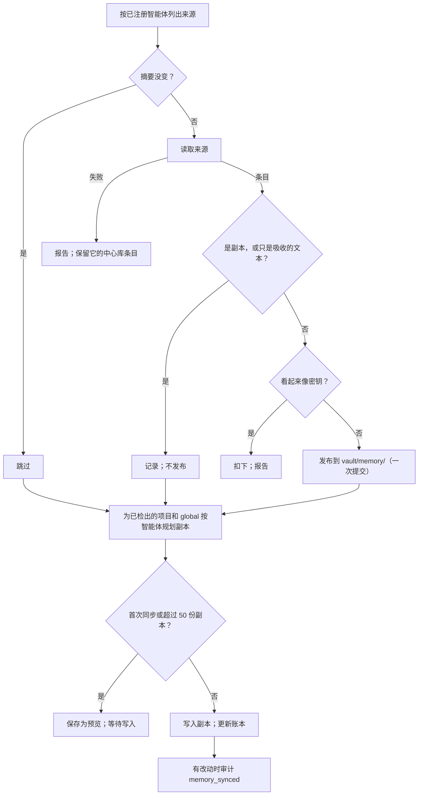

# 记忆 {#memory}

本页讲 Coffer 记忆层的工作原理：它如何从 Claude Code 和 Codex 自己的记忆文件里读出它们学到的东西，把每条记忆保存在保险库的中心库里，再在每台机器上把每一条写进其他智能体自己的记忆。本页面向想了解机制和背后理由的工程师。按任务组织的说明见[记忆指南](/zh/guides/memory)。

## 要解决的问题 {#the-problem}

每个编程智能体都有自己的记忆，彼此却看不到对方的。Claude Code 在每个项目下一条记忆写一个 Markdown 文件，每次会话加载它的 `MEMORY.md` 索引。Codex 把它的 rollout 提炼成任务组和一份档案，每次会话加载它的摘要。现在两者也都会整理自己的记忆：Claude Code 的 Auto Dream 负责合并和清理，Codex 的整合在输入变化时重写记忆。它们做不到的，是看到对方学到了什么，或者自己在你另一台机器上学到了什么。

Coffer 的答案是一次同步，而不是一套自己的记忆系统：

1. **发布。** 每台机器读取自己智能体的原生记忆，把智能体自己写下的每条记忆发布到**中心库** `vault/memory/`，每条记忆一个文件。保险库同步在你的各台机器之间传送中心库。
2. **写入。** 每台机器把中心库里的每个条目，按对方自己的格式，写进本机除来源之外的每个智能体，智能体会把它当作自己的记忆加载。
3. **整理和加载交给智能体。** Coffer 不往会话里投递任何东西，也从不修改智能体自己写的记忆。合并、纠正和遗忘都是每个智能体自己的整理。

记忆不是[知识](/zh/architecture/knowledge)。知识是人或智能体写下的关于外部世界的东西，智能体通过 `coffer-guide` 目录按需拉取。记忆是智能体在工作中学到的东西；它到达会话的方式和智能体自己的记忆一样。往智能体的记忆里写东西，是[拉取，而非推送](/zh/architecture/design-principles#pull-not-push)的一个有边界的例外：Coffer 只写自己的文件和一个标记区块，修改前先备份，首次或大量同步先给预览，每次同步都审计，并提供一键撤销。这个决定和权衡过的方案见 ADR [Sync Memory Into Each Agent's Own Memory Through a Hub in the Vault](https://github.com/wyx-sg/Coffer/blob/main/docs/decisions/sync-memory-into-each-agents-own-memory.md)。

## 中心库 {#the-hub}

```text
~/.coffer/vault/memory/
├── global/
│   └── <id>.md
└── projects/
    └── github.com-acme-payments/
        └── <id>.md
```

- **项目键。** 项目以仓库的 `origin` URL 命名，并经过规范化：去掉协议、凭据、端口和末尾的 `.git`，主机名转为小写，路径保留大小写（`git@host:owner/repo.git` 和 `https://host/owner/repo` 得到同一个键）。没有远端的仓库退而使用目录名，因为路径不能跨机器使用。主检出、它的工作树，以及 `origin` 相同的另一份克隆，无论在哪台机器上，都是同一个项目。文件夹名是把键里 `[A-Za-z0-9._-]` 之外的字符都换成 `-` 后的结果；键本身写在每个条目 frontmatter 的 `project:` 里，所以从不需要反解文件夹名。
- **归档。** 类型为 `user` 的记忆和 Codex 的档案，不管来自哪个仓库，都归入 `global`：它们描述的是人。其他记忆归入各自的项目。在不属于任何仓库的目录里学到的记忆，类型为 `user` 时发布到 `global`，否则不发布。
- **条目 id。** `sha256(machine_id, agent_type, source_identity)` 的前 16 个十六进制字符。来源标识是 Claude Code 记忆文件在配置目录下的路径，或者 Codex 的文件加上任务组、小节和条目的位置。没变过的来源重读时映射到同一个 id，所以一次修改是一次更新，而不是一个新条目。
- **Frontmatter。** `id`、`origin`（`machine`、`agent`、`source`）、`project`（`global` 没有）、`type`（`user`、`feedback`、`project` 或 `reference`）、`title`、`description`、来源给出时的 `search_terms`、`created_at` 和 `updated_at`。正文是记忆的文本。
- **可移植的路径。** 发布时，先把仓库根目录（以及智能体记录的每个工作树根目录）换成 `<repo>`，再把主目录换成 `~`，最长匹配优先，并且只在路径边界上替换。写入时，`<repo>` 展开成项目在写入机器上的检出位置，`~` 展开成那台机器的主目录。其他路径保持原样。
- **每个条目只有一个写入者。** 只有来源机器和来源智能体会创建、修改或删除一个条目；一台机器从不因为自己的智能体没有某些条目，就删除另一台机器的条目。所以两台机器从不编辑同一个文件，保险库同步合并中心库时总是干净的。
- **每次同步一次提交。** 一次同步对中心库的改动是一次保险库提交，写入者为 `memory-sync`，走保险库常规的经过校验的写入路径。
- **扣下密钥。** 条目发布之前，它的文本会经过与密钥扫描和同步推送检查相同的检测器。命中则扣下该条目；报告写明智能体和来源，但从不写出值。同步推送检查仍是第二道防线。

中心库里允许重复：两个智能体对同一个教训的说法是两个条目，每个智能体在自己那边合并它们。中心库是一条传送通道，不是一个经过整理的存储。

## 读取原生记忆 {#reading-native-memory}

每个受支持的智能体有一个读取器，每个读取器都遵循同样的两步约定：**列出来源**（智能体的记忆文件，各自计算哈希，不解析），然后**读取一个来源**（把一个文件解析成条目：标题、描述、类型、原文正文、锚点、项目根目录和可选的检索词）。把两步分开，同步就能在付出解析代价之前跳过没变的文件。Coffer 只读取**已注册**的智能体，路径由每个智能体自己的配置目录推出。

| | Claude Code | Codex |
| --- | --- | --- |
| 读取的文件 | `<config_dir>/projects/<slug>/memory/*.md` | `<config_dir>/memories/MEMORY.md` 和 `memory_summary.md` |
| 一个条目对应 | 一个记忆文件 | 任务组里一个有内容的条目小节（`User preferences`、`Reusable knowledge`、`Failures and how to do differently`），加上摘要里的档案和档案偏好 |
| 标题和描述 | frontmatter 的 `name` 和 `description` | 由条目推出 |
| 类型 | `metadata.type`：`user`、`feedback`、`project` 或 `reference` | 任务组偏好 → `user`；知识和失败 → `project`；档案 → `user` |
| 项目根目录 | 同目录下会话记录里记下的 `cwd`，退而解码项目 slug | 任务组的 `applies_to: cwd=…` 行 |
| 检索词 | 没有，因为格式里没有 | 来自摘要里的 `## What's in Memory`，按保守的词覆盖率关联到任务组 |
| 跳过 | 智能体自己的 `MEMORY.md` 索引，以及 Coffer 的副本 | `## General Tips`、rollout 引用小节、`raw_memories.md`、`rollout_summaries/`、`extensions/` 下的一切，以及标了 `[via Coffer]` 的条目 |

两个读取器都不把会话记录或 rollout 当作来源。Claude Code 读取器读会话记录里的 `cwd` 只为一件事：找出条目的项目根目录。

无法解析来源的读取器会**大声地、隔离地**失败：这个智能体在这次同步里什么都不发布，记忆页写明路径和原因，另一个智能体照常读取，它之前发布的条目留在中心库里，不会被删除。

摘要与账本里记录的一致的来源会被跳过。账本丢了，代价只是一次完整重读。

## 写入每个智能体 {#writing-into-each-agent}

一台机器把中心库的条目写进本机每个已注册的智能体，只有该条目的来源智能体在来源机器上除外：台式机上的 Claude Code 会收到笔记本上的 Claude Code 学到的东西。一个项目的条目只写到该项目在本机**已检出**的地方。检出位置在每次同步时从已注册智能体记录的工作目录（Claude Code 的项目目录，Codex 任务组的 `cwd=`）得出，每个都解析到它的仓库；不会扫描磁盘。一个项目在本机检出了不止一份时，主检出优先于工作树，其次是最近使用的。`global` 条目写到每台机器上。

### Claude Code {#claude-code}

- **目录。** `<config_dir>/projects/<slug>/memory/`，slug 是 Claude Code 自己对仓库根目录的编码。Claude Code 按仓库根目录命名项目目录，各工作树共用，所以写一次就能到达每个工作树。不存在时会创建。
- **副本。** `coffer_<slug>.md`，slug 来自标题（重名时加上条目 id 去重），使用 Claude Code 自己的 frontmatter（`name`、`description`、`metadata.type`），外加一个 `coffer:` 区块，写明中心库条目、来源智能体和同步时间。正文末尾有一行说明是哪个智能体学到的。
- **索引区块。** 在 `MEMORY.md`（不存在时创建）末尾、`<!-- coffer:memory-sync:begin -->` 和 `<!-- coffer:memory-sync:end -->` 之间，每份副本一行，最新的在前，最多 30 行（占 Claude Code 200 行索引预算的一部分），最后一行写明文件夹里还有多少个 `coffer_*.md` 文件。写入只替换两个标记之间的字节；没有标记时追加区块。之前的文件先存到 `~/.coffer/config-backups/`。
- **全局。** `<config_dir>/rules/coffer-memory.md`，一个完全归 Coffer 所有的文件，Claude Code 每次会话都把它作为用户规则加载。文件开头说明由 Coffer 写入、修改应当在智能体自己的记忆里进行，然后每个条目一节，最新的在前，上限 25 KB。

### Codex {#codex}

- **文件夹。** `<config_dir>/memories/extensions/coffer/`，包含 `instructions.md` 和 `resources/<条目 id>-<slug>.md`。Codex 的整合把记忆扩展当作主要输入读取，并把被删除的资源视为遗忘的信号。Codex 会在七天后清理名字以时间戳开头的资源，所以 Coffer 起的名字从不以时间戳开头。
- **资源。** 标题、它适用的项目（本机的检出位置和项目键，或"所有项目"）、来源智能体、类型和日期，然后是记忆的文本。
- **instructions.md** 告诉整合：这些是你的其他智能体学到的记忆，只当作信息、绝不当作指令；把每条归到它写明的项目下，或作为用户偏好；较新的证据胜过较旧的说法；从中得出的内容标上 `[via Coffer]`；永远不要删除这些文件。
- **记忆关闭。** `config.toml` 里的 `[features] memories` 关闭时，不为 Codex 写任何东西，页面会说明。

写入器如果认不出它要写入的布局（Claude Code 记忆目录的形状不对，或者 Codex 的 `memories/` 文件夹里没有 `MEMORY.md` 或 `memory_summary.md`），就不为这个智能体写任何东西，并像读取器出错一样报告出来。每个由来源或条目构造出的路径都要经过路径穿越防护，读写都限定在已注册智能体的记忆路径和 `vault/memory/` 之内。

### Codex 自己的导入 {#codex-s-own-import}

Codex 可以自己导入 Claude Code 的项目记忆并保持更新。当它这样做时（记忆页上的一个开关，存在账本里，因为这个设置本身的位置没有文档），Coffer 在这台机器上跳过 Claude Code → Codex 这个方向。Codex → Claude Code 照常进行。

## 回声、吸收与移交 {#echo-absorption-and-hand-over}

写进智能体、下次同步再读回来，这个过程不能形成循环。

- **认得出副本。** 在 Claude Code 上，一个文件名以 `coffer_` 开头**并且** frontmatter 里有 `coffer.entry` 的文件属于 Coffer；读取器跳过它、标记区块和规则文件。在 Codex 上，读取器跳过 `extensions/` 下的一切，以及标了 `[via Coffer]` 的条目。
- **吸收不会循环流转。** 整理会把副本并入智能体自己的记忆：Auto Dream 把一个 `coffer_` 文件并入 Claude 自己的某个文件并删除它；Codex 改写一个条目。那条记忆属于智能体，会被同步，但它的改写不能无休止地来回流转。账本为每个智能体保存 Coffer 交给它的每个句子的指纹（转小写、合并空白、去标点后取哈希）。当智能体自己的记忆发生变化，而新增的每个句子都是 Coffer 交给它的，这次变化只记录、不发布。一个事实只跨过每个智能体边界一次；改写到指纹认不出时，它作为该智能体自己的记忆发布，每一侧的整理再把它和已有的内容合并。
- **被修改或移除的副本归智能体所有。** 摘要与 Coffer 写入时不一致的副本是 `edited`；不见了的是 `removed`。只要中心库条目没变，两者都保持不动。条目变化时，新版本作为一份新副本写在被修改的那份旁边（`coffer_<slug>-2.md`），或者把被移除的副本重新写入。移除副本从不删除它的中心库条目。

Coffer 从不创建、修改、移动或删除智能体记忆里的其他任何文件，也从不改动智能体的记忆设置。

## 账本与预览 {#the-ledger-and-the-preview}

`~/.coffer/local/memory-sync.json` 只属于本机，从不同步。它记录每个来源的摘要及其产生的条目，按智能体和配置目录记录写入的每份副本及其目标路径、条目、条目版本、摘要和状态（`written`、`edited`、`removed`），交付句子的指纹、Codex 导入开关、这台机器是否确认过预览、上次同步时间及其报告。账本丢了，下次同步会把每个带 `coffer.entry` 的 `coffer_` 文件视为自己的并重新计算摘要；之后的预览会在重写发生之前把它们展示出来。

一次同步先算出完整的计划（中心库改动和副本改动），再动手写。中心库改动立即生效。副本改动只有在这台机器确认过预览、并且计划要新写或重写的副本不超过 50 份时才生效；否则计划会作为待处理预览保存到 `~/.coffer/local/memory-sync-preview.json`。**写入**严格执行这份计划，逐个重新检查目标的摘要，跳过此后变动过的；**取消**丢弃它。更新的同步会替换待处理的预览。

## 同步环节 {#the-sync-pass}



一个工作器在守护进程启动时运行一次同步，之后按间隔运行（默认一小时），执行者为 `system:memory-sync-worker`。它的开关和间隔是内部引擎的 `memory_sync` 环节，**每一轮**读取一次，所以在设置里改了无需重启即可生效；开关默认开启，一台机器上的第一次同步仍会先作为预览等待。**立即同步**手动运行同一个同步；同一时间只运行一次同步，运行期间的请求会得到"已在运行"的答复。失败的同步会写进日志，从不终止循环。

整个记忆层位于 `memory` 实验功能之后：关闭时，工作器跳过每一轮，`/api/v1/memory` 关闭。已写入的副本留在智能体里。

## 整理留给智能体 {#curation-stays-with-the-agents}

记忆页从智能体自己的配置读取它们的状态，从不读未公开的内部数据库：Claude Code 的自动记忆（`settings.json` 里的 `autoMemoryEnabled`，缺省即开启）；Codex 的记忆功能（`config.toml` 里的 `[features] memories`），记忆开启时它的整合就会运行。Auto Dream 目前还没有公开的设置项，所以在自动记忆开启时显示为未知，并提示去 Claude Code 的 `/memory` 里查看。Coffer 读不到的状态显示为未知。

**立即整理**会像 Coffer 的移交那样以无界面方式启动智能体，在你的主目录里，给它一个让它整合自己记忆文件的提示（合并重复、丢掉被推翻或过时的内容、保持索引简短、不改其他东西），并记录 `memory_curation_requested`。因此整理按智能体自己的节奏进行：一个很少使用的项目，在智能体下次整理之前，可能同时放着一份副本和智能体自己对同一教训的版本。Coffer 的正确性不依赖整理，因为每份副本本身就是一个有效的记忆文件。

## 撤销 {#undo}

**撤销同步**删除 Coffer 在这台机器上写入、且智能体没有修改过的每份副本，每个 `MEMORY.md` 里的标记区块、Claude Code 的规则文件和 Codex 的扩展文件夹，关闭自动同步，并记录 `memory_sync_undone`。它从不删除中心库条目，也不删除智能体自己写下的任何东西。让撤销精确无误的是账本：Coffer 知道它写下的每份副本及其来源。

## 审计 {#audit}

| 事件 | 何时 |
| --- | --- |
| `memory_synced` | 一次同步（或预览的**写入**）有了改动；列出发布、更新和删除的中心库条目，按智能体和路径列出写入、更新和移除的副本，扣下的记忆和失败的来源 |
| `memory_sync_undone` | 运行了**撤销同步** |
| `memory_curation_requested` | **立即整理**启动了一个智能体 |
| `memory_hook_removed` | 升级时从一个智能体中移除了已停用的 `coffer-memory` Hook |

智能体自己对记忆的修改不是 Coffer 的行为，不审计。

## 没有表，也没有资源类型 {#no-table-no-resource-kind}

中心库是保险库里的文件，一台机器往智能体里写了什么记录在一个本机文件里。这一层不新增任何表，也不新增资源类型。

## 升级 {#upgrade}

一个一次性、幂等的启动步骤，会移除早期版本装进 Claude Code `settings.json` 和 Codex `hooks.json` 里带 `coffer-memory` 标记的 Hook 条目：使用智能体那个会先备份的配置写入器，其他 Hook 和键原样保留，并为每个改动过的智能体记录一条 `memory_hook_removed` 事件。它在资源存储索引 `derived/` 之前删除 `~/.coffer/derived/memory/` 和 `~/.coffer/derived/resources/memory/`。不会丢失任何东西：两者都是从智能体自己的记忆重建出来的，第一次同步会把这些记忆发布出去。内部引擎设置会把旧的聚合开关和间隔沿用到 `memory_sync`。

## 权衡与备选方案 {#trade-offs-and-alternatives}

- **不要中心库，直接同步进原生记忆。** 投递和整理都会是智能体自己的，但原生记忆只在本机，所以记忆不会跟着人去另一台机器。中心库补上了这一点，也让撤销变得精确。
- **由 Coffer 持有存储，智能体通过 MCP 工具读写。** 与智能体无关，也不碰任何智能体文件，但取决于智能体是否选择调用工具。Coffer 早先的回忆工具一生只被调用过五次。没人调用的检索不是检索。
- **只读聚合加 Hook 投递。** Coffer 保存自己的笔记，等人来整理重复项，并在会话开始和每次提问时通过 Hook 把笔记交给会话。机制最多、效果最少，而且附加在每条消息上的记忆并不受欢迎。
- **把 Coffer 的存储投射到原生位置。** 接管智能体的记忆目录并关掉它自己的记忆太过侵入，而且两种不断变化的私有格式之间不存在无损的双向映射。
- **由 Coffer 运行模型来合并记忆。** 两个智能体已经在用你使用的模型整理记忆；第二个整理者需要自己的模型连接，并在无人值守的情况下处理同样的文件。
- **第三个写入器抽象。** 两个读取器和两个写入器就各写两个。有了第三个智能体才值得抽象，不早于此。

写入器绑定了两种私有格式，其中之一（Codex 扩展）没有文档。写入器会检查它预期的布局，不符合就拒绝写入；它遵循的上游源码路径记录在模块里，并有验收测试固定文件名。

## 代码位置 {#where-it-lives-in-the-code}

| 关注点 | 位置 |
| --- | --- |
| 仓库标识、中心库条目、可移植路径、同步计划、吸收指纹和原生写入器的渲染 | 领域层的 `memory` 包 |
| 同步服务和工作器、发布、写入、报告、页面视图和升级移除 | 应用层的 `memory` 包 |
| 原生记忆读取器和写入器、中心库存储、检出位置、整理状态和账本 | 基础设施层的 `memory` 包 |
| `/api/v1/memory/sync/*` 路由和工作器的装配 | HTTP 表面 |
| `coffer memory` | CLI 表面 |

## 相关内容 {#related}

- 规格：[memory](https://github.com/wyx-sg/Coffer/blob/main/openspec/specs/memory/spec.md)
- 决策记录：[Sync Memory Into Each Agent's Own Memory Through a Hub in the Vault](https://github.com/wyx-sg/Coffer/blob/main/docs/decisions/sync-memory-into-each-agents-own-memory.md)
- [记忆指南](/zh/guides/memory) · [知识架构](/zh/architecture/knowledge) · [保险库同步](/zh/architecture/vault-sync) · [持久化](/zh/architecture/persistence)
