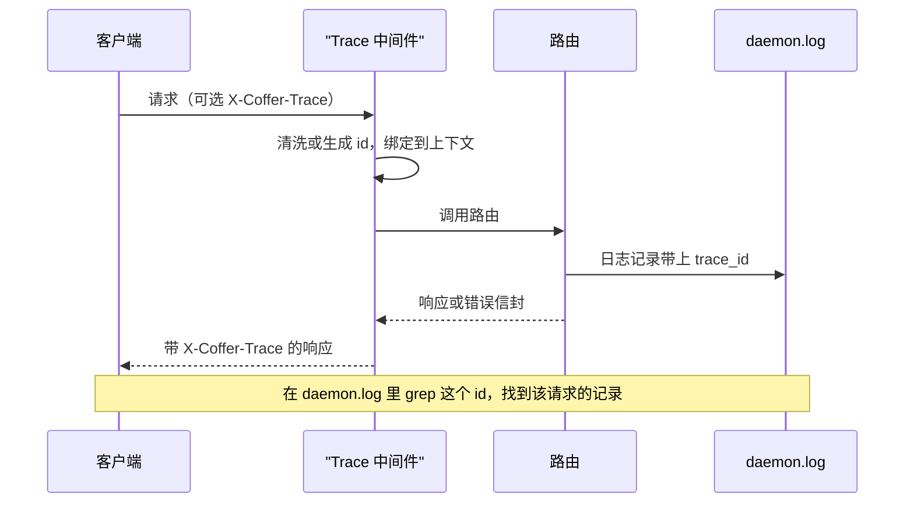
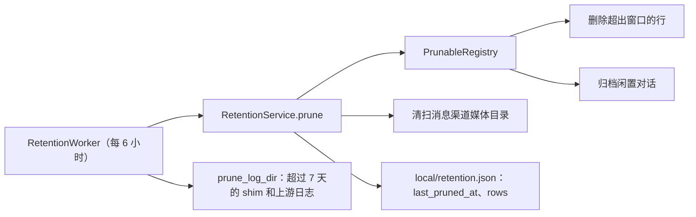
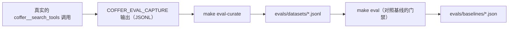

# 可观测性 {#observability}

本页讲 Coffer 关于自身保留的记录：它们怎么写、保留多久、人和智能体怎么读。它面向要改动这些路径的贡献者，也面向想确切知道某行日志或某条审计记录含义的使用者。

## 要解决的问题 {#the-problem}

Coffer 是一个供其他程序调用的后台进程。出问题时，发现问题的人通常盯着的是智能体的聊天窗口，而不是 Coffer。这决定了需求：

- **答案必须能从故障显现的地方找到。** 一个看到工具调用失败的智能体，应该能直接问 Coffer 发生了什么，不需要用户去翻文件。
- **“改了什么”和“发生了什么”是两个不同的问题。** 一个突然解析不出来的密钥，可能是配置变更（有人删了它），也可能是运行时故障（上游拒绝了它）。两种记录都需要，而且要能在同一条时间线上对齐。
- **任何可观测的东西都不能泄露密钥。** Coffer 为它代理的每个上游保管密钥。日志、审计记录和调用记录的写入远比读取频繁，必须从构造上就是安全的。
- **记录不能无限增长。** 一个用了一年就把磁盘写满的本地工具，是辜负了它的用户。

## 设计决策 {#design-decisions}

| 决策 | 理由 |
| --- | --- |
| 一个日志文件 `daemon.log`，每行一个 JSON 对象 | 每个读取方（「活动」页、`coffer log daemon`、智能体，或用 `grep` 的人）解析的是同一组字段。 |
| 每个 HTTP 请求都有一个 trace id，并回显为 `X-Coffer-Trace` | 失败的响应能对应到它产生的那几行日志。 |
| 一个独立的、结构化的审计日志，存在 SQLite 里 | “改了什么、谁改的”需要按资源、类型和事件类型过滤，而且要能挺过改名。 |
| 一个记录经代理的 MCP 调用的调用日志，不含载荷 | 每次调用的延迟和结果有用；参数和结果可能带有密钥，不记录。 |
| 所有类似日志的表和日志文件共用一套保留机制 | 增长有界，不必为每个功能单独写一个清理任务。 |
| 记录通过 CLI（`coffer log`）和日志文件（`coffer path logs`）读取，而不是通过 MCP 工具 | 故障发生时真正的读者是一个带 shell 和自己文件工具的智能体；查找记录不需要在每个会话的工具列表里再加一个工具。 |
| 评测采集是一个独立的、需要手动开启的输出 | 整理评测用例需要请求文本，而共享数据库刻意从不存储它。 |

## 守护进程日志 {#the-daemon-log}

### 一种格式 {#one-format}

Coffer 自己的模块通过标准库（`logging.getLogger`）记日志。根 logger 的 handler 使用 `structlog.stdlib.ProcessorFormatter`，所以每条记录——Coffer 自己的，以及在守护进程里运行的库（如 MCP SDK、asyncio 和 alembic）的——都以一个字段相同的 JSON 对象输出：

| 字段 | 来源 |
| --- | --- |
| `event` | 日志消息（Coffer 使用点分的事件名，如 `mcp.upstream.spawn_failed`） |
| `timestamp` | 记录自身的创建时间，UTC ISO-8601，末尾带 `Z` |
| `level` | `debug`、`info`、`warning`、`error` 或 `critical` |
| `logger` | 记录这条日志的模块 |
| `trace_id` | 当前请求的 trace id，请求之外为 `-` |
| 任何 `extra={...}` 键 | 调用处传入的内容 |
| `exception` | 渲染后的 traceback，保留在同一行内 |

一行真实的日志长这样：

```json
{"event": "mcp.upstream.spawn_failed", "logger": "coffer.application.mcp.supervisor", "level": "warning", "timestamp": "2026-09-24T13:50:15.869933Z", "server": "smart", "attempt": 1, "error": "upstream init failed: ConnectError", "trace_id": "44e10b60da1b4f26"}
```

`structlog` 也配置成走同一组 handler，所以将来使用 `structlog.get_logger()` 的调用处也会产出同样的形状，而不是打印到 stdout。

时间戳来自 `LogRecord`，而不是格式化时的时钟。这样即使两个 handler 格式化同一条记录，它也只有一个时间，而且时间戳可以按字典序排序，读取方的 `since` 过滤依赖这一点。

### 每个文件一个写入者 {#one-writer-per-file}

`daemon.log` 按设计有两个写入者：

1. 守护进程的滚动文件 handler（`RotatingFileHandler`，每个文件 10 MB，保留 3 个备份：`daemon.log.1` … `daemon.log.3`）。
2. 守护进程进程自身的输出。CLI 的探测或启动、`coffer daemon start` 和 MCP shim 会以追加方式打开 `daemon.log`，作为子进程的 stdout 和 stderr；桌面应用也把它启动的守护进程重定向到同一个文件。一个拒绝启动的守护进程（比如端口已被占用）会把原因打印到错误信息让你去查的那个文件里。

因此，如果再加一个 stderr handler，每条记录都会写两遍。守护进程只在 stderr *不是* `daemon.log` 同一个文件时（按设备号和 inode 比较）才挂上 stderr handler，也就是前台运行的情况——终端或测试——这时它是看到输出的唯一途径。

桌面壳把它自己的少量记录（选了哪个守护进程二进制、从菜单栏重启失败、检查或安装更新失败）以同样形状的单行 JSON 写进同一个 `daemon.log`。

### 其他日志文件 {#other-log-files}

| 文件 | 写入者 | 滚动与清理 |
| --- | --- | --- |
| `~/.coffer/logs/daemon.log`（+ `.1`–`.3`） | 守护进程、脱离终端的守护进程的 stdio、桌面壳 | 10 MB 滚动；清理器从不删除 |
| `~/.coffer/logs/upstream/<server>.log` | 每个 stdio MCP 服务器的 stderr，每个已注册服务器一个文件 | 打开时超过 2 MB 就滚动为 `<server>.log.1`；超过 7 天的 `.log.1` 文件会被清理 |
| `~/.coffer/logs/shim-<pid>-<epoch>.log` | 每个 `coffer-mcp-shim` 进程一个，只在 shim 有日志要写时才创建 | 7 天后清理 |
| `~/.coffer/eval-capture.jsonl` | 评测采集，仅在开启时 | 从不清理 |

上游 MCP 服务器有自己的文件，因为它们比 Coffer 啰嗦得多；如果它们的 stderr 写进 `daemon.log`，几周内滚动就会把 Coffer 自己的记录挤掉。`COFFER_LOG_DIR` 会移动整个日志目录——守护进程、上游和 shim 日志一起；见[配置](/zh/reference/configuration)和[文件与目录](/zh/reference/filesystem)。

### 宽容的读取器 {#the-tolerant-reader}

因为 `daemon.log` 同时也是守护进程子进程的 stdio，它永远不能保证是纯 JSON。`application/log_reader.py` 是「活动」页和 `coffer log daemon` 共用的唯一读取器。它：

- 只读文件的最后 512 KiB，所以 10 MB 的日志永远不会整个读进内存；
- 去掉 ANSI 颜色和光标控制序列；
- 先解析 Coffer 的 JSON，再解析文件里实际出现过的其他形状：uvicorn 的 `ERROR:    …`、`LEVEL - logger - message`，以及基于 FastMCP 的上游用 rich 格式化的 `[mm/dd/yy HH:MM:SS] LEVEL …` 面板；
- 把各种级别写法（`WARN`、`WARNING`、`FATAL`……）统一到一套词汇；
- 把 traceback 行和面板边框并入上一条记录（`continuation`），让一次失败就是一行；
- 保留任何解析不了的行，原样放在 `raw` 下——并且把读不出级别的行视为通过所有级别过滤，因为解析不了的行多半是 traceback。

HTTP 路由 `GET /api/v1/daemon/logs` 暴露这个读取器，支持 `since`、`level`（严重程度下限）、`errors_only` 和 `limit`（1–500，默认 100），最新的在前。它需要 API 令牌；`GET /api/v1/daemon/status` 不需要，因为它兼作就绪探针。

## Trace id {#trace-ids}

每个 HTTP 请求在其他任何东西运行之前都会先拿到一个 trace id。`surfaces/http/trace.py` 是一个原始的 ASGI 中间件（不是 `BaseHTTPMiddleware`，后者会缓冲，干扰 `/mcp` 提供的长连接流），它：

1. 如果客户端带了 `X-Coffer-Trace` 请求头就采用它，裁剪到 `[A-Za-z0-9._:-]` 和 64 个字符以内，否则生成一个新的 16 位十六进制 id；
2. 把它绑定到一个上下文变量，日志格式化器会为该请求产生的每条记录读取它；
3. 在响应上加 `X-Coffer-Trace`（错误响应本来就带同样的值）；
4. 请求结束时清空上下文变量，这样比请求活得久的后台任务不会记下过期的 id。

Coffer 自己的 CLI 和 MCP shim 不发送 `X-Coffer-Trace`，所以它们的每个请求都拿到一个新 id。这个请求头是给那些希望多次调用在日志里读起来像一个完整故事的客户端准备的。

trace 中间件位于中间件栈的最外层——在 Host 和 Origin 守卫以及 CORS 之外——所以即使是以 `403 HOST_NOT_ALLOWED` 或 `403 ORIGIN_NOT_ALLOWED` 被拒绝的请求，也带有一个与解释拒绝原因的那条日志匹配的 trace id。守卫见[安全模型](/zh/architecture/security)。



在请求之外记录的日志——后台 worker、MCP 会话回收器——带 `trace_id: "-"`。为处理某个 `/mcp` 请求而做的工作（比如启动一个上游服务器）带的是那个请求的 id。

## 审计日志 {#the-audit-log}

审计日志回答“改了什么、谁改的”。它在历史数据库 `~/.coffer/runs.db` 的 `audit_log` 表里。

### 一行的结构 {#shape-of-a-row}

| 列 | 含义 |
| --- | --- |
| `timestamp` | 事件发生的时间（UTC） |
| `event_type` | 下文词汇表中的一个值 |
| `actor` | 谁引起的：`cli`、`api`、`ui`、`system`，或其他简短的小写标识符 |
| `resource_uid` | 资源的 uid；如果事件不涉及资源，或其资源在保险库布局之前就已删除，则为空 |
| `resource_kind`、`resource_name` | 资源**当时**的标签 |
| `details` | 事件相关字段，已脱敏 |

有两个决策塑造了它：

- **身份和标签分开存储。** 资源的轨迹按 uid 查询，所以给资源改名不影响它的历史，旧记录保留写入时为真的名字。不存在只按标签审计事件的方式；见[资源框架](/zh/architecture/resource-framework)。
- **脱敏在存储之前、按类型进行。** 每种资源类型都可以提供一个 `audit_redactor`，在配置变成 `details` 之前剥掉密钥字段。MCP 服务器类型用它从传输配置里去掉 `env` 和 `headers` 映射，只保留密钥引用。

操作者来自 `X-Coffer-Actor` 请求头，必须匹配 `^[a-z][a-z0-9_-]{0,31}$`；没有这个头表示 `api`，其他值一律以 `400` 拒绝。

每个审计事件也会作为一行 `info` 写进 `daemon.log`，带上事件类型、资源名、类型、uid 和操作者——但不带 `details`，这样决定哪些字段是密钥的地方始终只有脱敏器一处。

### 事件词汇表 {#event-vocabulary}

词汇表是一个封闭的枚举，即 `backend/coffer/domain/audit.py` 里的 `AuditEventType`。

| 领域 | 事件 |
| --- | --- |
| 资源 | `resource_created`、`resource_updated`、`resource_enabled`、`resource_disabled`、`resource_deleted`、`resource_renamed`、`resource_scope_updated` |
| MCP 能力 | `capability_enabled`、`capability_disabled` |
| 守护进程 | `token_rotated`、`daemon_residency_updated`、`daemon_restarted`、`retention_updated`、`internal_engine_model_set` |
| 密钥 | `secret_set`、`secret_revealed`、`secret_deleted`、`secret_migrated`、`master_key_relocated`、`secret_resolved`、`secret_approval_requested`、`secret_approval_approved`、`secret_approval_rejected`、`secret_imported` |
| 智能体 | `agent_config_file_written`、`agent_config_file_deleted`、`agent_mcp_installed`、`agent_mcp_uninstalled`、`agent_mcp_entry_removed`、`agent_mcp_entry_adopted`、`agent_plugin_toggled`、`agent_plugin_uninstalled` |
| 技能 | `skill_imported`、`skill_updated`、`skill_update_merged`、`skill_bound`、`skill_unbound`、`skill_relinked`、`skill_drift_remediated`、`skill_adopted`、`skill_unmanaged_deleted` |
| 知识 | `knowledge_written`、`knowledge_edited`、`knowledge_deleted`、`knowledge_curated` |
| 记忆 | `memory_aggregated`、`memory_distilled`、`memory_delivery_installed`、`memory_delivery_removed`、`memory_delivery_fired`、`memory_trigger_added`、`memory_trigger_proposed`、`memory_trigger_armed`、`memory_trigger_disarmed`、`memory_trigger_deleted` |
| 消息渠道 | `channel_pairing_issued`、`channel_paired` |
| 保险库文件 | `vault_file_edited`（人手动编辑、以 `disk` 提交）、`vault_file_restored` |
| 保险库同步 | `sync_run`、`sync_confirmed`、`sync_rejected`、`sync_rolled_back`、`sync_machine_removed`、`master_key_exported`、`master_key_imported` |
| 提供商 | `provider_switched`、`provider_internal_default_set`、`provider_transcribe_default_set`、`provider_projection_refused` |

没有任何密钥事件携带密钥值；每条只记录 ref、独立密钥的名字或目的地。

- `secret_revealed`——有人在桌面应用里经过在场验证后显示或复制了一个值。这是值被展示的唯一途径，因为没有任何路由、命令或工具会返回它。
- `secret_resolved`——`coffer run` 把一个独立密钥解析进一个子进程。记录写明密钥、程序和工作目录，从不记录值或命令行的其余部分。
- `secret_approval_requested`、`secret_approval_approved`、`secret_approval_rejected`——一个密钥等待被发往新的地方（或者一个正在使用的值等待被替换，或者保护等待被关闭），然后有人做了答复。见[密钥](/zh/guides/secrets#approvals)。
- `secret_imported`——`coffer secret import` 把一个明文密钥从文件移进了存储。
- `master_key_exported`——桌面应用在经过在场验证后写出了一份密钥备份。没有任何命令或路由能导出密钥。

旧的明文读取路由记录的 `secret_read` 不再写入：那个路由已经没了。为启动上游而解密密钥不是审计事件。

你可以在「活动」页的「变更」标签页、用 `coffer log audit`（`--kind`、`--name`、`--event-type`、`--since`、`--limit`、`--json`），或通过 `GET /api/v1/audit` 读取审计日志。见[活动与审计](/zh/guides/activity)。

## MCP 调用日志 {#the-mcp-invocation-log}

网关代理的每一次调用——工具调用、资源读取、prompt 获取——都向 `mcp_invocations` 写一行：

| 列 | 含义 |
| --- | --- |
| `timestamp` | 调用开始的时间 |
| `resource_uid` | MCP 服务器的 uid；内置的 `coffer__*` 工具为 `coffer`；之后被删除的服务器为 `deleted:…` |
| `capability_type`、`capability_key` | `tool` / `resource` / `prompt`，以及上游给它起的名字 |
| `duration_ms` | 上游请求的实际耗时 |
| `status` | `ok`、`error`、`timeout` 或 `denied` |
| `error_message` | 由 Coffer 撰写的摘要，从不是上游的结果文本 |
| `session_id` | 调用来自的 `/mcp` 会话 |
| `agent_uid` | 发起调用的会话所属的智能体，即它的 shim 在 `initialize` 时报告的值；会话没有报告时为空（手工配置的 shim、裸的 MCP 客户端） |

`status` 的含义：

- `ok`——上游作答了，结果不是错误。
- `error`——上游起不来（启动失败，或服务器在冷却中）、请求抛了异常（传输失败，或上游返回 JSON-RPC 错误），或者上游返回了一个格式正确但带 `isError: true` 的工具结果。上游作答了的情况下，这一行存的是一个固定标记而不是它的文本：`isError` 结果为 `upstream tool returned an error result (isError)`，JSON-RPC 错误为 `upstream answered with a JSON-RPC error (code <n>)`。错误文本由上游控制，可能回显参数或密钥。服务器状态路由也靠这些标记区分是工具失败（服务器正常）还是服务器失败。内置工具抛异常同样是 `error`，记录异常的类名或 Coffer 自己的消息，截断到 200 个字符。
- `timeout`——上游没有在超时内作答。
- `denied`——调用在到达上游之前就被拒绝了：服务器已禁用、调用方智能体不在服务器的[生效范围](/zh/architecture/resource-framework#reach)内，或者用户禁用了那个工具。耗时为 `0`。

资源读取和 prompt 获取没有带内的错误标志，所以对它们来说，只有抛出的错误才算 `error`。

记录按 uid 而不是名字作键，所以一个服务器的历史属于那一次注册，而不属于之后以同名注册的服务器，已删除服务器的记录也仍然可读。出于同样的原因，这张表没有外键。

写入是缓冲的：一个内存队列（最多 5,000 行）由一个写入任务每 50 毫秒或每 50 行刷一次，以先到者为准，所以一个大量调用工具的会话不必每次调用都付出一次 SQLite 提交的代价。队列满时，调用方会等待，而不是丢弃记录。

你可以在「活动」页的「MCP 调用」标签页、在服务器详情页按服务器、用 `coffer log mcp [--server <name>]`，或通过 `GET /api/v1/mcp/invocations` 和 `GET /api/v1/resources/mcp_server/{uid}/invocations` 读取它。两个路由都按游标分页、最新的在前，接受 `agent_uid` 以只显示某个智能体的调用，并在每行返回它的 `id`。它们的回答和审计日志一样带有 `total`：所有分页中匹配过滤条件的行数，这样过滤后的视图不用翻到最后一页就能说出有多大。

## 保留 {#retention}

所有类似日志的东西都由同一套机制限定大小。

`application/retention_registry.py` 定义了 `PrunableTable`，它是对保留 worker 所清扫的一张表的声明式描述：策略键、时间戳列、默认窗口、显示名，以及一个 `delete` 或 `archive` 的 `action`。组合根把每张这样的表注册到同一个 `PrunableRegistry` 里，仓储层接受的 SQL 白名单也由这些注册推导，所以没注册的表无法被清理。

| 策略（`name`） | 表 | 时间戳列 | 默认 | 动作 |
| --- | --- | --- | --- | --- |
| `audit_log` | `audit_log` | `timestamp` | 365 天 | delete |
| `mcp_invocations` | `mcp_invocations` | `timestamp` | 30 天 | delete |
| `sync_runs` | `sync_runs` | `finished_at` | 90 天 | delete |
| `conversations_archive` | `conversations` | `updated_at` | 7 天 | archive（设置 `archived_at`） |
| `conversations` | `conversations` | `archived_at` | 30 天 | delete（连同消息） |

聊天对话采用两阶段形式：闲置的对话先归档，归档的对话之后再删除。



- `RetentionService.initialize_defaults` 在启动时为每张已注册的表在 `~/.coffer/local/retention.json` 里写入默认策略，从不覆盖你改过的策略。
- `RetentionWorker` 在启动时立即执行一次清理（补跑），之后每 6 小时一次。清理失败会记日志，worker 继续运行。
- 完整的清理还会清扫消息渠道的媒体目录，worker 也按同样的节奏清理旧的 shim 和上游日志文件。`daemon.log` 本身由自己的滚动限定大小，从不被删除。
- 窗口设为 “none” 会关闭该表的清理。修改窗口会在审计日志里记一条 `retention_updated`。

你可以用 `coffer config list retention.`、`coffer config set retention.<table> <days|forever>` 和 `coffer log prune`，或者通过 `/api/v1/retention/policies` 和 `POST /api/v1/retention/prune` 管理策略。

## 读取记录：`coffer log` 与 `coffer path logs` {#reading-the-records-coffer-log-and-coffer-path-logs}

这些记录真正的读者，往往是出问题那一刻、正在 shell 里工作的智能体。它读取的方式和人一样，用 CLI 和自己的文件工具：

| 命令 | 读取 |
| --- | --- |
| `coffer log audit [--kind] [--name] [--event-type] [--since] [--limit] [--json]` | 审计日志，最新的在前 |
| `coffer log mcp [--server] [--status ok\|error] [--since] [--limit] [--json]` | MCP 调用日志，最新的在前 |
| `coffer log daemon [--errors] [--since] [--limit] [--json]` | `daemon.log` 的末尾，经过与「活动」页相同的宽容读取器 |
| `coffer path logs` | 日志目录及其中的 `daemon.log`，供 `grep` 或 `tail` 使用 |

`--since` 接受一个 ISO 8601 时间点，或 `30m`、`1h`、`2d` 这样的时长。解析不了的过滤条件——只给了名字没给类型，或者该类型下没有这个名字的资源——会报错，而不是被悄悄忽略，因为不加过滤的答案看起来就像“这个资源什么都没发生”。每条命令都是只读的，不打印任何密钥值：审计 details 在存储前就已脱敏，日志记录从构造上就不含密钥。

遇到 `SECRET_MISSING` 错误的智能体不知道自己需要的是“改了什么”还是“什么失败了”，所以它会运行 `coffer log audit --since 1h` 和 `coffer log daemon --errors --since 1h`，或者在 `coffer path logs` 给出的文件里 grep 响应的 trace id。

## 评测采集 {#eval-capture}

Coffer 的确定性测试证明管道是通的。它的非确定性行为的质量——最重要的是 `coffer__search_tools` 给上游工具排序排得多好——由 [`evals/`](https://github.com/wyx-sg/Coffer/tree/main/evals) 里的评测框架衡量，并通过一个需要手动开启的采集输出，从真实使用中不断扩充。



- **采集。** 为守护进程设置 `COFFER_EVAL_CAPTURE` 后，每次 `coffer__search_tools` 调用都会向一个 JSONL 文件追加一行——查询以及返回的排序后工具名：值为 `1`/`true`/`yes` 时写到 `~/.coffer/eval-capture.jsonl`，否则写到给定的路径。采集 logger 不向上传播，所以这些行永远不会进入 `daemon.log`。变量未设置时什么都不写。工具参数和结果从不采集。
- **整理。** `make eval-curate`（`python -m evals.curate`）读取采集输出，去掉数据集已经覆盖的查询，并让你标出哪些返回的工具是相关的。确认后的用例追加到 `evals/datasets/tool_search.jsonl`，标记为 `"source": "captured"`。
- **门禁。** `make eval` 运行确定性的工具检索套件（用网关所用的同一个排序器计算 recall@k 和 MRR），分数低于已提交基线减去容差时失败。`evals` GitHub 工作流会在涉及 `evals/`、MCP、知识或记忆代码的推送和 pull request 上运行它。`make eval-routing` 额外提供一个需要模型参与的工具路由套件，它需要一个模型端点，不进 CI。

调用日志对带内工具错误如实记为 `error`，这才让它能在这里作为信号使用：一个把失败的工具调用记成 `ok` 的日志，分不清路由决策是好是坏。

## 权衡与备选方案 {#trade-offs-and-alternatives}

**在调用日志里记录载荷。** 记录参数和结果会让调试单次调用更容易。Coffer 不这么做，因为两者经常带有密钥、个人数据和文件内容，而这个日志要保留一个月，任何智能体都能通过 `coffer log mcp` 读到。带内工具错误用固定标记，遵循的也是这条规则。

**每个写入者一个日志文件。** 给桌面壳或脱离终端的守护进程的 stdio 各自一个文件，能让 `daemon.log` 保持纯 JSON。Coffer 选择只保留一个文件加一个宽容的读取器，因为所有“去看日志”的提示都指向同一个路径，多出来的文件就是一个没人被告知要去看的地方。上游 MCP 服务器是例外，因为它们的量会把 Coffer 自己的记录挤掉。

**通过 structlog 自己的 API 做结构化日志。** 把一百多个 `logging.getLogger` 调用处都改掉，得不到标准库格式化器没有提供的任何东西。格式化器在标准库记录上运行 structlog 的 processor，所以文件只有一种形状，调用处无需改动。

**只在守护进程日志里记审计事件。** 日志行无法按资源 id 过滤，也撑不过一年的滚动。表才是记录本身；日志行只是给正在 tail 文件的人的方便。

**指标或追踪后端。** Coffer 在一台机器上为一个人运行。导出 OpenTelemetry span 或 Prometheus 指标会多一个依赖和第二个进程，而要回答的问题 `coffer log` 在本地就已经能回答。

## 代码位置 {#where-it-lives-in-the-code}

| 路径 | 作用 |
| --- | --- |
| [`backend/coffer/infrastructure/logging/setup.py`](https://github.com/wyx-sg/Coffer/blob/main/backend/coffer/infrastructure/logging/setup.py) | JSON 格式化器、滚动文件 handler、stderr 规则、trace id 上下文 |
| [`backend/coffer/infrastructure/logging/files.py`](https://github.com/wyx-sg/Coffer/blob/main/backend/coffer/infrastructure/logging/files.py) | 日志目录、每个上游的 stderr 文件、日志文件清理 |
| [`backend/coffer/application/log_reader.py`](https://github.com/wyx-sg/Coffer/blob/main/backend/coffer/application/log_reader.py) | 「活动」页和 `coffer log daemon` 共用的宽容尾部读取器 |
| [`backend/coffer/surfaces/http/trace.py`](https://github.com/wyx-sg/Coffer/blob/main/backend/coffer/surfaces/http/trace.py) | trace id 中间件 |
| [`backend/coffer/surfaces/http/middleware.py`](https://github.com/wyx-sg/Coffer/blob/main/backend/coffer/surfaces/http/middleware.py) | 中间件顺序 |
| [`backend/coffer/domain/audit.py`](https://github.com/wyx-sg/Coffer/blob/main/backend/coffer/domain/audit.py) | 审计条目和事件词汇表 |
| [`backend/coffer/application/audit_service.py`](https://github.com/wyx-sg/Coffer/blob/main/backend/coffer/application/audit_service.py) | 记录和查询审计行 |
| [`backend/coffer/application/mcp/gateway_handlers.py`](https://github.com/wyx-sg/Coffer/blob/main/backend/coffer/application/mcp/gateway_handlers.py) | 经代理调用的调用状态 |
| [`backend/coffer/application/mcp/gateway_builtin.py`](https://github.com/wyx-sg/Coffer/blob/main/backend/coffer/application/mcp/gateway_builtin.py) | 内置工具的调用记录、评测采集挂钩 |
| [`backend/coffer/infrastructure/mcp/invocation_writer.py`](https://github.com/wyx-sg/Coffer/blob/main/backend/coffer/infrastructure/mcp/invocation_writer.py) | `mcp_invocations` 表和缓冲写入器 |
| [`backend/coffer/application/retention_registry.py`](https://github.com/wyx-sg/Coffer/blob/main/backend/coffer/application/retention_registry.py) | `PrunableTable` 和 `PrunableRegistry` |
| [`backend/coffer/application/retention_service.py`](https://github.com/wyx-sg/Coffer/blob/main/backend/coffer/application/retention_service.py)、[`retention_worker.py`](https://github.com/wyx-sg/Coffer/blob/main/backend/coffer/application/retention_worker.py) | 清理逻辑和节奏 |
| [`backend/coffer/surfaces/http/app_mcp_composition.py`](https://github.com/wyx-sg/Coffer/blob/main/backend/coffer/surfaces/http/app_mcp_composition.py) | 已注册的可清理表 |
| [`backend/coffer/surfaces/cli/log_cmd.py`](https://github.com/wyx-sg/Coffer/blob/main/backend/coffer/surfaces/cli/log_cmd.py)、[`path_cmd.py`](https://github.com/wyx-sg/Coffer/blob/main/backend/coffer/surfaces/cli/path_cmd.py) | `coffer log` 和 `coffer path` |
| [`backend/coffer/application/eval_capture.py`](https://github.com/wyx-sg/Coffer/blob/main/backend/coffer/application/eval_capture.py)、[`infrastructure/logging/eval_capture.py`](https://github.com/wyx-sg/Coffer/blob/main/backend/coffer/infrastructure/logging/eval_capture.py) | 评测采集的发出与输出 |
| [`evals/`](https://github.com/wyx-sg/Coffer/tree/main/evals) | 评测框架、数据集、基线、整理 CLI |

## 相关链接 {#related}

- 指南：[活动与审计](/zh/guides/activity)、[故障排查](/zh/guides/troubleshooting)、[运行守护进程](/zh/guides/daemon)
- 参考：[MCP 工具](/zh/reference/mcp-tools)、[文件与目录](/zh/reference/filesystem)、[配置](/zh/reference/configuration)、[错误码](/zh/reference/error-codes)
- 架构：[MCP 网关](/zh/architecture/mcp-gateway)、[安全模型](/zh/architecture/security)、[持久化](/zh/architecture/persistence)
- 决策记录：[评测：可选开启的采集、人工整理与确定性回归门禁](https://github.com/wyx-sg/Coffer/blob/main/docs/decisions/eval-capture-and-regression-gate.md)、[智能体控制层指南](https://github.com/wyx-sg/Coffer/blob/main/.agents/harness.md)、[资源身份是不可变的 UID](https://github.com/wyx-sg/Coffer/blob/main/docs/decisions/resource-identity-is-an-immutable-uid.md)
- 规格：[daemon](https://github.com/wyx-sg/Coffer/blob/main/openspec/specs/daemon/spec.md)、[mcp-gateway](https://github.com/wyx-sg/Coffer/blob/main/openspec/specs/mcp-gateway/spec.md)、[resource-framework](https://github.com/wyx-sg/Coffer/blob/main/openspec/specs/resource-framework/spec.md)
