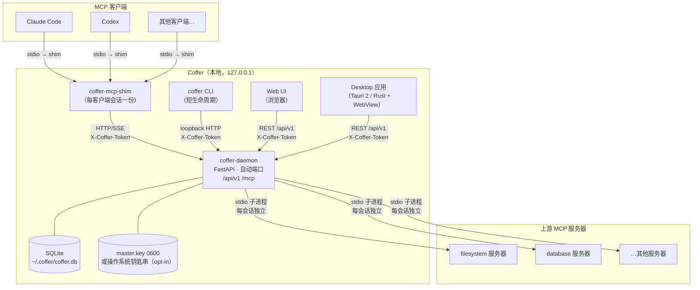

# 系统总览

::: tip 核心模型
Coffer 是一个长生命周期的本地守护进程，将 N 个上游 MCP 服务器聚合为一个命名空间化的统一接口面。注册一次，所有 MCP 客户端（Claude Code、Codex、Cursor）连接同一个守护进程，看到相同的工具集，工具名形如 `filesystem__read_file`。所有状态本地存储于 SQLite（密钥以 Fernet 密文形式存储），唯一的主密钥存于 DB 旁的 `0600` 文件（操作系统钥匙串为 opt-in）。守护进程仅绑定到 `127.0.0.1`——外部机器无法访问。
:::

## 系统拓扑

下图展示了各组件之间的关系。MCP 客户端不直接连接上游服务器——它们连接到 Coffer 守护进程，由守护进程代为管理上游连接。



## 组件与接口说明

| 组件                            | 类型                                      | 职责                                                                                                               |
| ------------------------------- | ----------------------------------------- | ------------------------------------------------------------------------------------------------------------------ |
| `coffer-daemon`                 | 长生命周期进程                            | FastAPI 服务，监听 `127.0.0.1:<auto-port>`。持有全部状态，是唯一的 SQLite 写入者。                                 |
| `coffer-mcp-shim`               | 短生命周期进程（每个 MCP 客户端会话一份） | 桥接 MCP 客户端 stdio ↔ 守护进程 HTTP/SSE。检测已运行的守护进程，或在需要时拉起一个。                             |
| `coffer` CLI                    | 短生命周期子进程                          | 面向用户的管理命令。通过 loopback HTTP 调用守护进程。                                                              |
| Web UI                          | 浏览器进程                                | 管理界面。开发时由 `http://localhost:5173` 的 Vite 开发服务器提供；生产时由 Tauri 桌面 shell 内嵌。调用 REST API。 |
| Desktop 应用                    | 原生进程（Tauri 2，Rust + WebView）       | 将 Web UI 内嵌在原生桌面窗口中。通过 REST 与守护进程通信。                                                         |
| REST API（`/api/v1`）           | 守护进程上的 HTTP 接口面                  | 管理面：资源 CRUD、审计日志、设置。Token + CORS 鉴权。                                                             |
| MCP 端点（`/mcp`）              | 守护进程上的 HTTP/SSE 接口面              | MCP JSON-RPC 端点。shim 连接此处。将命名空间化的工具调用转发给上游子进程。                                         |
| SQLite（`~/.coffer/coffer.db`） | 持久化存储                                | 控制面状态：资源注册、能力偏好、审计日志、保留策略，以及 `credentials` 表中以 Fernet 密文形式存储的密钥。WAL 模式，单写入者。 |
| `master.key` / 操作系统钥匙串   | 主密钥存储                                | 唯一的 Fernet 主密钥。默认：DB 旁的 `0600` `~/.coffer/master.key` 文件；操作系统钥匙串为 opt-in。密钥用它解密，并在上游进程拉起时物化进上游 env / header。 |
| `~/.coffer/daemon.json`         | 发现文件（权限 0600）                     | PID + 端口 + token。守护进程启动时写入；shim 和 CLI 读取此文件以定位运行中的守护进程。                             |

## 鉴权模型

所有与守护进程通信的接口面都携带 `X-Coffer-Token` 头。Token 在守护进程启动时生成，写入 `~/.coffer/daemon.json`（权限 `0600`）。因为该文件仅 owner 可读，且守护进程绑定到 loopback，有效的信任边界就是本地用户账号。

## 全部状态都在 `~/.coffer/`

每一份持久化产物都在同一个目录下：

```
~/.coffer/
├── daemon.json          # 发现信息：PID + 端口 + token（0600）
├── coffer.db            # SQLite：全部控制面状态
├── logs/
│   └── daemon.log       # 守护进程的结构化 JSON 日志
└── upstream-pids/       # 上游子进程的 PID 文件（守护进程重启时清理）
```

这种单目录布局意味着，一条 `cp -r ~/.coffer/ backup/` 命令即可完成 Coffer 状态的完整备份。

## 阅读路线图

后续页面各自深入探讨系统的一个切面：

| 页面                                                 | 主题                                             |
| ---------------------------------------------------- | ------------------------------------------------ |
| [守护进程与进程模型](/zh/architecture/processes)     | 进程模型、detect-or-spawn、上游子进程生命周期    |
| [Resource 框架](/zh/architecture/resource-framework) | 统一身份、生命周期与审计的与 kind 无关的抽象     |
| [分层与边界](/zh/architecture/layering)              | import 规则、各层职责、强制执行                  |
| [Surfaces](/zh/architecture/surfaces)                | REST API、MCP 端点、CLI、Web UI、Desktop         |
| [请求全链路](/zh/architecture/request-lifecycle)     | 工具调用从客户端到上游的端到端追踪               |
| [持久化](/zh/architecture/persistence)               | SQLite schema、WAL、Alembic、JSON 字段处理       |
| [安全](/zh/architecture/security)                    | Token 鉴权、加密凭据存储、SSRF 防护、loopback 强制 |
| [可观测性](/zh/architecture/observability)           | 结构化日志、trace ID、审计日志、保留策略         |
| [分发](/zh/architecture/distribution)                | 包结构、安装方式、平台支持                       |

---

**参见：** [架构参考](/zh/reference/project/architecture)
