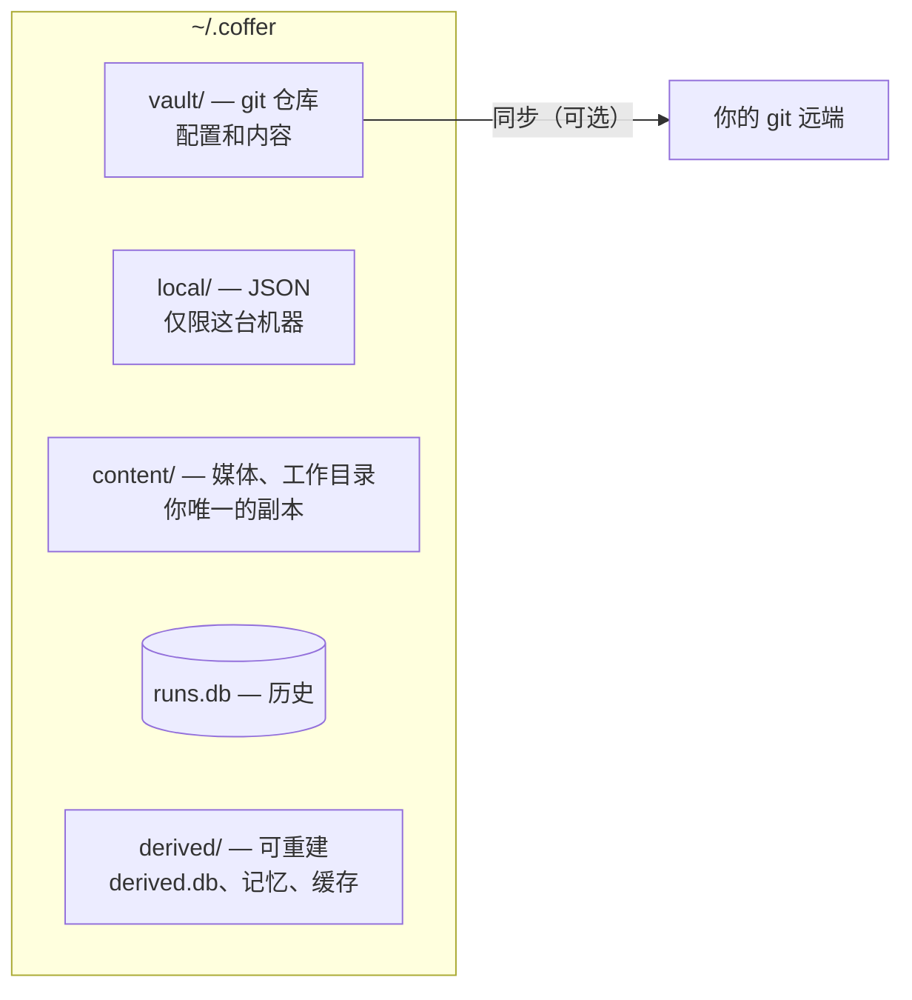
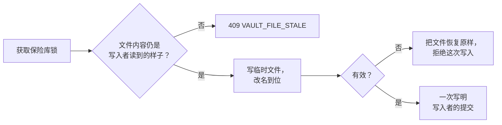
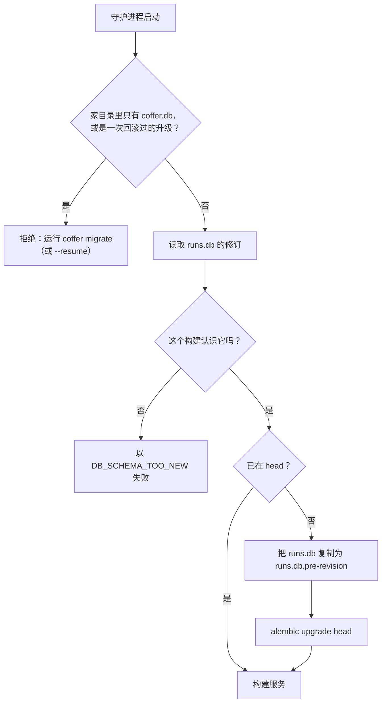

# 持久化 {#persistence}

Coffer 把状态存在 `~/.coffer/` 下的五个**存储类别**里，每个类别一个目录（或文件），按状态*是什么*来划分：你的配置和内容、只关乎这台机器的事实、你的媒体文件、历史记录，以及 Coffer 能重建的东西。本页讲每个类别里放什么、每次写入保险库都要走的那条路径、历史数据库及其迁移，以及守护进程在一切之前读取的两个小 JSON 文件。它面向要改动状态存放位置、排查启动失败，或者要决定新状态该放在哪里的工程师。

## 要解决的问题 {#the-problem-it-solves}

Coffer 的状态过去是按写它的代码碰巧放在哪就存在哪。配置放在一个 SQLite 文件 `coffer.db` 里，旁边是知识和技能的文件树。生效范围、同步指针和聊天历史，和你希望在每台机器上都有的资源放在同一个数据库里。于是同步必须把数据库序列化成文件、再翻译回来，还要为每个不能跟着走的字段记住一条规则。每一条这样的规则都是一个可能出错的地方。

这些状态有五种不同的性质，各自需要不同的处理：

- **你的配置和你写的内容** 必须在每台机器上都完整，能用你自己的工具编辑，有版本，能跟着走。
- **关于这台机器的事实**（这里启用了哪些智能体、同步远端、保留策略）永远不能跟着走，丢了可以重新设置。
- **媒体文件和聊天工作目录** 是你唯一的副本，但体积大，不值得同步。
- **历史记录**（审计、调用、对话）只追加，会被清理。
- **派生状态**（健康检查、缓存、记忆树）可以从其余部分重建。

所以由类别决定目录，由目录决定一样东西能不能跟着走。“生效范围永不同步”不再是翻译器必须记住的一条规则，而是生效范围存放位置本身的一个事实。

## 设计决策 {#design-decisions}

| 决策 | 理由 |
| --- | --- |
| 五个类别，各一个目录：`vault/`、`local/`、`content/`、`runs.db`、`derived/`。 | 一个事实存在哪里，就说明了它是否同步、是否有历史、删掉是否安全。 |
| 保险库从第一次使用起就是一个 git 仓库，不管同不同步。 | 每次变更都有版本、写入者和 diff；恢复就是一次提交；同步只是多加一个远端。 |
| 保险库文档是 JSON 文件，每个资源或状态区域一个，uid 写在文件里面。 | 你可以用任何编辑器读写它们；未知的顶层字段原地保留，而类型没有声明的 config 键会被拒绝；身份是 uid，而不是路径。 |
| 每次保险库写入都经过同一个写入器：加锁、比较并交换、校验、一次写明写入者的提交。 | 三个写入者（你、守护进程、同步）都会改动保险库，谁也不等谁。谁都不能悄悄覆盖别人。 |
| `runs.db` 只存历史，作为唯一的 Alembic 迁移链，以 uid 为键。 | 历史是关系型的、只追加、会被清理；它从不跟着走。 |
| `derived/` 只重建、从不迁移。`derived.db` 的 schema 版本不同时就重建。 | 那里没有任何东西是某个事实的唯一副本，所以删掉永远是安全的。 |
| 本地状态是小 JSON 文件，在按文件的锁下原子写入。 | 它读得多、写得少，而且可以重新设置；再加一条迁移链得不偿失。 |
| 绑定端口前就要用的设置放在 `~/.coffer` 下的 `daemon-config.json`。 | 在打开或升级任何东西之前，必须先知道端口。 |

## 五个类别 {#the-five-classes}



| 类别 | 位置 | 存放内容 | 同步 | 历史 | 删掉是否安全 |
| --- | --- | --- | --- | --- | --- |
| **vault** | `vault/` | 资源定义、状态文档、知识、技能、记忆触发器、密钥密文、机器描述。 | 设置了远端时同步 | Git | 否：这是唯一副本 |
| **local** | `local/` | 本机专属资源（智能体）、生效范围、同步远端、保留策略、密钥边界的批准记录、本机专属密文。 | 从不 | 无 | 你会丢掉一些需要重新设置的设置 |
| **content** | `content/` | 聊天和消息渠道的附件、聊天工作目录。 | 暂不 | 无 | 否：这是你唯一的副本 |
| **runs** | `runs.db` | 审计日志、MCP 调用、对话、消息渠道线程和发件箱、同步轮次、用量、额度。 | 从不 | 它*本身*就是历史 | 你会丢掉历史 |
| **derived** | `derived/` | `derived.db`、记忆树、智能体会话记录缓存、Coffer 自己的指南技能、同步冲突的编辑器副本。 | 从不 | 无 | 是：会被重建 |

一个资源属于哪个类别由它的类型声明，并可按行细化：大多数类型在保险库里，`agent` 在本地（智能体的配置目录是关于这台机器的事实），`memory` 分区是派生的，内置的 `coffer-guide` 技能也是派生的，因为每台机器都自己渲染它。

### 保险库 {#the-vault}

```text
~/.coffer/vault/
├── manifest.json                       {"schema_version": 3}
├── resources/<kind>/<name>.json        mcp_server, skill, channel, provider, knowledge
├── state/mcp-preferences/<server>.json the capabilities you switched off
├── state/channel-peers/<channel>.json  paired identities per channel
├── state/settings/internal-engine.json Coffer's model and upkeep settings (absent = defaults)
├── knowledge/<collection>/…            Markdown documents, hidden .inbox/ for new material
├── skills/<name>/…                     skill master folders
├── memory-triggers/<id>.md             triggers you wrote or armed
├── secret/<ref>.enc                    Fernet ciphertext, one file per secret
└── machines/<machine id>.json          one descriptor per machine that syncs
```

资源文件包含它的身份、格式版本、名字、描述和 config，不含任何本机专属的东西：

```json
{
  "uid": "5f0c1e9a2b7d4c3e8a6f9b0d1c2e3f4a",
  "kind": "mcp_server",
  "format_version": 1,
  "name": "jira",
  "description": "Company Jira",
  "config": {
    "transport": {
      "type": "stdio",
      "command": "${HOME}/.local/bin/jira-mcp",
      "args": [],
      "secret_refs": { "JIRA_TOKEN": "jira-token" }
    }
  }
}
```

- **身份是文件里的 `uid`。** 路径只是 Coffer 把它归档的位置：你可以移动或改名这个文件，它仍然是同一个资源。没有 uid 的文件会在一次守护进程提交中得到一个。两个文件用同一个 uid 时，后来的那个会被拒绝并标记出来，原来的那个继续生效。
- **每个文档都带 `format_version`。** 比当前构建旧的文件会经过内存中的升级链读取，普通写入时不会被重写；比当前构建新的文件只读，如果这个构建读不了就会被标记。未知字段留在原处。见[每个保险库文件都带有自己的格式版本](https://github.com/wyx-sg/Coffer/blob/main/docs/decisions/every-vault-file-carries-its-format-version.md)。
- **家目录下的路径** 按 `${HOME}` 写入，在每台机器上展开。
- **生效范围不在文件里。** 一个资源在这里是否启用、对哪些智能体启用，记录在 `local/reach.json`。
- **`updated_at` 不在文件里。** 它是文件在本机的修改时间，不再保留修订计数器或索引。

Coffer 在仓库里忽略的东西写进 `.git/info/exclude`，从不写进一个另一台机器可能改动的受跟踪 `.gitignore`：编辑器和系统的杂项文件、知识集里的隐藏条目（`.inbox/` 除外），以及 `secret/`（除非你的同步远端携带密钥）。

### 本地 {#local}

```text
~/.coffer/local/
├── resources/agent/<name>.json   agents are machine-local resources
├── reach.json                    {uid: {enabled, agents, projects}}
├── tool-reach.json               custom tools' per-tool reach
├── engine.json                   when this machine last changed engine settings
├── retention.json                retention policy per prunable table
├── curation.json                 the content each knowledge document had when curation settled it
├── skill-source-status.json      what this machine last found at a Git-imported skill's source
├── secret/                       machine-local ciphertext (proxy tokens)
├── secret-boundary/              bindings, approvals, switches, first-stored times
├── sync/remote.json              the one sync remote
├── sync/round.json               a stopped round, a hold, a join's pending choices
└── migration.json                the record of the one-time upgrade
```

每个文件是一个 JSON 对象，整体读取，在按文件的锁下修改，再原子写回（先写一个同级临时文件，再改名）。缺失的文件读作空。解析不了的文件会被挪到一边，命名为 `<name>.unreadable-<n>`，记日志，并读作空：本地状态可以重新设置，一个因为设置文件而拒绝启动的守护进程，比一个忘了设置的守护进程更糟。

### 内容 {#content}

`content/chat-media/`（在对话页面附加的文件）、`content/channel-media/`（从聊天平台下载的附件）和 `content/workspace/`（聊天轮次的默认工作目录）。两个媒体目录都按时间清理。内容是你唯一的副本，不同步。

### runs.db {#runs-db}

`~/.coffer/runs.db`（连同它的 `-wal` 和 `-shm` 伴随文件）是 WAL 模式的 SQLite，只由守护进程通过基于 aiosqlite 的 SQLAlchemy 异步 ORM 写入。`COFFER_DB_URL` 可以指定另一个数据库。它只存历史，每一行涉及资源时都写它的 uid（`resource_uid`、`skill_uid`、`agent_uid`），从不写行号：

| 表 | 用途 |
| --- | --- |
| `audit_log` | 每一次生命周期变更：时间、事件类型、操作者、资源的 uid 及其当时的类型和名字、脱敏后的 details。 |
| `mcp_invocations` | 经网关的每次工具调用一行，由批量写入器写入。默认 30 天后清理。 |
| `conversations`、`chat_messages` | 对话页面和每个消息渠道的对话元数据和消息历史。默认闲置 7 天的对话会归档，归档 30 天后删除。 |
| `channel_thread_conversations`、`channel_thread_history` | IM 线程对应哪个对话，以及一个线程开过的每个对话。 |
| `channel_outbox` | Coffer 欠某个聊天、还没送达的回复。 |
| `sync_runs` | 这台机器跑过的每一轮同步。默认 90 天后清理。 |
| `usage_requests`、`usage_daily` | 模型代理暂存的上游尝试，以及用量页面读取的按天汇总。 |
| `quota_snapshots` | 每个来源报告的最新官方订阅额度。 |
| `attention_ignores` | 这台机器上有人忽略掉的“需要你处理”项，按项键记录，附带忽略时间。待处理列表会把它们排除在条目和计数之外。 |

::: details 没有代码读取的表
迁移链还会创建 `workflow_runs`、`workflow_events`、`workflow_node_attempts` 和 `workflow_approvals`。这个构建里没有模块读取它们；它们之所以存在，是因为迁移是一条线性历史，后面的修订建立在创建它们的那些修订之上。
:::

每个连接都会执行这组 pragma：

| Pragma | 值 | 原因 |
| --- | --- | --- |
| `journal_mode` | `WAL` | 守护进程写入时，读取可以继续进行。 |
| `foreign_keys` | `ON` | 不显式要求的话，SQLite 会忽略外键。 |
| `synchronous` | `NORMAL` | 配合 WAL 是安全的，而且比 `FULL` 便宜得多。 |
| `busy_timeout` | `5000` | 遇到锁时最多等五秒，而不是立刻失败。 |
| `cache_size` | `-64000` | 大约 64 MB 的页缓存。 |
| `temp_store` | `MEMORY` | 临时表和索引放在内存里。 |

### 派生 {#derived}

```text
~/.coffer/derived/
├── derived.db                   MCP server health, skill deliveries, capability first/last seen
├── memory/<partition>/          the memory tree (MEMORY.md, notes/, RETIRED.md, .raw/)
├── cache/agent/                 agent transcript cache
├── resources/                   derived resource files (memory partitions, coffer-guide)
├── skills/coffer-guide/         Coffer's own guide skill, rendered from the build
└── sync-conflicts/              editor copies of a stopped round's conflicting files
```

`derived.db` 没有 Alembic 迁移链。它的表在打开时创建，它的 `PRAGMA user_version` 会与构建的版本比较：版本不同的文件会被删除并重新创建。在守护进程停止时删掉整个 `derived/` 永远是安全的；「设置 → 数据」可以替你清理缓存。

## 进入保险库的唯一写入路径 {#the-one-write-path-into-the-vault}

有三个写入者会改动保险库：你（编辑器、shell、智能体的文件工具）、守护进程（Web 界面里的保存、CLI 或 API 的改动、一轮整理）和同步。它们做的每一次改动，都以同样的方式由唯一的保险库写入器接纳：



1. **比较。** 一次写入要说明它预期文件里是什么：它读到的字节的指纹、“不存在”，或者“`HEAD` 里的内容”。在锁内重新读取文件并比较。不一致就是 `VAULT_FILE_STALE`（409）。没有无条件写入的模式，修改时间也从不决定任何事。内容 API（保存技能文件、知识文档、恢复）都要求提供指纹。
2. **写入** 一个同级临时文件，再改名到位。
3. **校验** 每个被触及的路径，规则与手工编辑和同步合并所遇到的相同。出现阻断性问题时，把所有文件恢复原样。
4. **提交** 恰好这些被触及的路径，作为一次提交。它的 trailer 写明写入者（`Coffer-Writer: user`、`disk`、`agent`、`daemon`、`curation` 或 `sync`）、操作，以及相关时的操作者、智能体、机器，或恢复来源的版本。

手工编辑是被发现的，而不是被拦截的。文件事件只是提示（防抖到路径安静一秒为止），每 60 秒一次以及启动时的扫描才是准绳。有效的编辑以 `disk` 写入提交，并以人为操作者审计为 `vault_file_edited`。无效的编辑留在工作区里、不提交，会在待处理列表和 `coffer vault problems` 里被标记出来，同时 `HEAD` 继续生效。生效的状态永远是 `HEAD`：各个存储从一个由 `HEAD` 加载、每次提交后刷新的缓存里读取文档。

保险库里的每个文件和文件夹都有可以查看、diff 和恢复的历史：`coffer vault history|diff|show|restore`、`/api/v1/vault/` 下的 REST 路由，以及技能的「历史」标签页。恢复是一次经过同样检查的新提交。见[手工编辑保险库](/zh/guides/vault-files)。

保险库需要 `git`。没有 git 的机器会在启动时失败，并给出说明。git 怎么装取决于这台机器，所以 `GIT_MISSING` 错误不点名任何安装程序，而是在 `details.handoff` 里带上交给你的智能体的安装提示词；同步状态也会报告问题 `git_missing`，附带同一段提示词。

## runs.db 的迁移 {#migrations-of-runs-db}

`runs.db` 的 schema 变更是放在持久化包里的 Alembic 修订，每个修订一个文件，命名为 `YYYYMMDD_NNNN_<slug>`。当前 head 是 `0138`，它删掉了 `conversations` 上没人使用的 `owner` 列。`0137` 给审计日志加上了关联 id，更早的 `0136` 把旧数据库变成了 `runs.db`：它把历史表改为以 uid 为键，并删掉了所有状态已移到文件里的表。schema 变更永远是一次迁移，从不由模型隐式建表。

迁移在守护进程的 lifespan 里、在构建任何服务之前运行：



- **备份。** 升级之前，运行器把数据库连同它的 `-wal` 和 `-shm` 伴随文件复制为 `runs.db.pre-<revision>`。已有的副本从不被覆盖，只保留最新的三份。要撤销一次有问题的迁移：停止守护进程，把 `runs.db` 挪开，把对应的副本改回原名，再启动上一个构建。
- **来自更新构建的 schema。** 这个构建不认识的修订会让守护进程在碰任何东西之前以 `DB_SCHEMA_TOO_NEW` 停止，遵循[检测而不是猜测](/zh/architecture/design-principles#detect-never-refuse)的原则。
- **旧的家目录。** 只有 `coffer.db` 的家目录不会被守护进程迁移。它会以 `VAULT_MIGRATION_REQUIRED` 拒绝启动，并提示 `coffer migrate`，即你自己运行的一次性升级。见[升级已有的 Coffer](/zh/guides/upgrading)。

## 静态存储的密钥 {#secrets-at-rest}

密钥的密文是一个文件 `vault/secret/<ref>.enc`：Fernet 令牌加一个结尾换行，权限 `0600`，所在目录权限 `0700`。本机专属的 ref（比如模型代理的令牌）改放在 `local/secret/`，从不进入保险库。密文放在保险库里是安全的，因为密钥不在那里：主密钥留在操作系统的密钥存储里，或者 `0600` 权限的文件 `~/.coffer/master.key` 里。`vault/secret/` 是否提交由你的同步远端的 `include_secret` 设置决定；在那之前它被排除在仓库之外。密钥边界的绑定、批准和开关在 `local/secret-boundary/`。见[安全模型](/zh/architecture/security)。

## 不属于任何类别的设置 {#settings-that-live-outside-every-class}

`~/.coffer` 下直接放着两个小 JSON 文件。`daemon.json` 是守护进程启动时写、退出时删的运行时状态（pid、端口、令牌）：每个使用方都靠读它来找到守护进程。`daemon-config.json` 是守护进程绑定端口之前读取的配置：固定端口、模型代理的端口、机器名和 id，以及实验功能开关。它必须在任何升级运行之前就能读取，所以它既不是保险库也不是本地状态。两者都以 `0600` 权限原子写入。它们的内容见[守护进程与进程](/zh/architecture/daemon#two-files-configuration-in-runtime-state-out)，逐键说明见[配置](/zh/reference/configuration#daemon-config-json)。

## 权衡 {#trade-offs}

- **配置用文件存储就放弃了数据库约束。** 取而代之的是一个校验器，不论来源，每次写入都会运行，无效的文件永远到不了 `HEAD`。
- **每次保险库写入都是一次 git 提交。** 提交小而且在本地；代价是每个操作一个 git 进程，所以结构化写入会按操作合并成一次提交。
- **人可以编辑任何文件。** 这正是目的所在，也正因如此，每次写入都先比较再写，无效的编辑会被标记而不是被应用。
- **`runs.db` 仍然原地迁移。** 迁移前的副本和“太新”守卫让这件事是安全的，而且里面只剩历史了。
- **内容保持为文件，就意味着没法对内容做查询。** Coffer 不需要：检索就是智能体读文件，目录是生成出来的。

## 代码位置 {#where-it-lives-in-the-code}

| 位置 | 内容 |
| --- | --- |
| 领域层的 `vault` 包 | 布局、文档、格式版本、写入者和 trailer。 |
| 应用层的 `vault` 包 | 校验规则、历史与恢复、问题。 |
| 基础设施层的 `vault` 包 | `~/.coffer` 下各类别的根目录、仓库、写入器、扫描器、资源和状态存储、生效范围、本地 JSON、一次性升级。 |
| 基础设施层的 `persistence` 包 | runs.db 引擎、模型和 Alembic 修订；`derived.db`。 |
| 基础设施层的 `persistence` 包（迁移运行器部分） | 迁移运行器：启动时迁移、备份、“太新”守卫、拒绝旧的家目录；守护进程启动和 `coffer migrate` 都调用它。 |
| 基础设施层的 `secret` 包 | 以文件形式存放的密钥密文。 |
| 基础设施层的 `daemon` 包 | `daemon-config.json`。 |

## 相关链接 {#related}

- [文件与目录](/zh/reference/filesystem) · [保险库同步](/zh/architecture/vault-sync) · [资源框架](/zh/architecture/resource-framework) · [安全模型](/zh/architecture/security)
- 决策记录：[存储按性质分为五个类别](https://github.com/wyx-sg/Coffer/blob/main/docs/decisions/storage-is-five-classes-by-nature.md)、[身份是文件里的 uid](https://github.com/wyx-sg/Coffer/blob/main/docs/decisions/identity-is-the-uid-inside-the-file.md)、[每次保险库写入都是一次写明写入者的已校验提交](https://github.com/wyx-sg/Coffer/blob/main/docs/decisions/every-vault-write-is-a-validated-commit-naming-its-writer.md)
- 规格：[daemon](https://github.com/wyx-sg/Coffer/blob/main/openspec/specs/daemon/spec.md)
