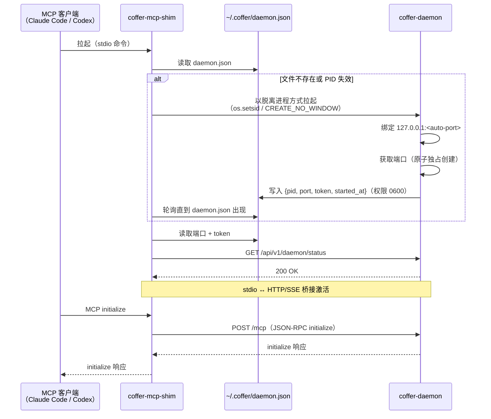

# 守护进程与进程模型

Coffer 围绕进程职责的清晰分离而构建：一个持有全部状态的长生命周期守护进程，与它通信的短生命周期入口点，为上游 MCP 服务器按会话建立的子进程树，以及——在 SeaTalk 通道启用时——一个由守护进程拉起、用于接收入站 webhook 的回调监听器。

## 进程角色

### coffer-daemon

守护进程是整个系统的核心。它是一个 FastAPI 应用，绑定到 `127.0.0.1:<auto-port>`——默认端口 8000，若 8000 已被占用则在一个小范围内自动选择下一个空闲端口。守护进程：

- 是**唯一的 SQLite 写入者**。没有其他进程以写模式打开数据库。这使 WAL 模式的隔离正确性成为显然，并消除了并发 schema 修改引发的一整类 bug。
- 持有已连接 MCP 客户端的全部内存会话状态。
- 为上游 MCP 服务器拉起并监管子进程（每个已连接的客户端会话一套独立的子进程——详见下方[上游会话模型](#上游会话模型-adr-005)）。
- 持久化全部控制面与 vault 状态：资源注册、能力偏好、审计日志、保留策略、加密凭据存储、知识/记忆索引、chat 会话与 turn、通道绑定，以及 sync 状态。
- **不**自动关闭。守护进程持续运行，直到执行 `coffer daemon stop` 或系统关机。这是有意为之：守护进程的职责就是比任何单个客户端或 CLI 调用活得更久。

### stdio shim（coffer-mcp-shim）

shim 是一个轻量级桥接进程，每个 MCP 客户端会话一份。它的全部职责是在 MCP 客户端的 stdio 接口（Claude Code、Codex 等工具所期望的）与守护进程的 HTTP/SSE MCP 端点之间进行转换。shim：

- 由 MCP 客户端在启动时拉起，使用客户端的普通「命令」配置方式（例如 `claude mcp add coffer coffer-mcp-shim`）。
- 读取 `~/.coffer/daemon.json` 以找到运行中的守护进程的端口和 token。
- 如果没有发现运行中的守护进程，则将 `coffer-daemon` 作为一个脱离 (detached) 的后台进程拉起，然后短暂等待 `daemon.json` 出现后再连接。
- 在 MCP 会话期间持续转发 stdin/stdout ↔ 守护进程 HTTP/SSE。
- 当 MCP 客户端退出时随之退出。其退出**不会**导致守护进程关闭——其他 shim 和其他客户端不受影响。

### coffer CLI

CLI（`coffer …`）是一个短生命周期的子进程。用户用它执行管理任务：注册服务器、列出工具、检查状态。它通过 loopback HTTP 调用守护进程，携带来自 `~/.coffer/daemon.json` 的 `X-Coffer-Token`，每条命令执行完后退出。与 shim 一样，它在发出请求前使用 detect-or-spawn 确保守护进程正在运行。

### 回调监听器（coffer-callback）

回调监听器是守护进程拉起的子进程，唯一存在目的是接收入站 SeaTalk webhook（spec 009，[ADR-014](/zh/reference/adr/ADR-014-channel-adapter-framework)）。与由用户（或 MCP 客户端）启动的 shim 和 CLI 不同，监听器由守护进程自己拉起并监管。它：

- **仅在某个 SeaTalk 通道启用时运行**。通道协调器在第一个 SeaTalk 通道上线时启动它，并在最后一个下线时停止它。
- 只服务一条路由 `POST /seatalk/{channel}`，监听一个 loopback 端口（默认 `8787`，可通过 `COFFER_CALLBACK_PORT` 覆盖）。它不持有任何其他状态，除了守护进程之外什么都触及不到。
- 校验每个回调的 SeaTalk 签名，应答平台的验证握手，并把有效事件携带 daemon token 经 loopback 转发给守护进程。用户把隧道（cloudflared/ngrok）指向监听器的端口；守护进程自身始终仅监听 loopback。
- 其签名密钥、daemon URL 和 daemon token 在拉起时注入其环境（上游子进程模式——密钥只落在子进程的环境中，永不落盘）。其拉起记录在 `~/.coffer/upstream-pids/` 中，因此守护进程崩溃不会遗留任何东西：启动时的孤儿清扫会将其回收。daemon token 轮换会重新拉起监听器。

## 受监管的后台 worker

除上述子进程外，守护进程还运行若干进程内后台 worker——它们是受监管的 asyncio 任务，而非独立进程——在无需任何用户操作的情况下让 vault 状态持续收敛：

- **保留 worker。** 按配置的保留策略修剪日志型表（审计日志、调用日志）。
- **通道适配器协调器**（[ADR-014](/zh/reference/adr/ADR-014-channel-adapter-framework)）。每个 tick 它都会把已启用的通道资源与运行中的适配器做 diff，并启动/停止/重启以保持一致——并随 SeaTalk 通道集合启动或停止回调监听器。REST/CLI/UI 永不直接启动或停止适配器；协调器持有全部运行时状态转换，从而让状态保持真实。
- **Sync worker**（[ADR-016](/zh/reference/adr/ADR-016-multi-machine-sync)），**opt-in 且默认关闭。** 它以保留 worker 为蓝本，为希望免手动多机收敛的用户增加去抖的「变更即推送」加间隔拉取。`coffer sync` 仍是显式、可预期的默认方式。

## Detect-or-spawn（ADR-006）

detect-or-spawn 模式确保任何 Coffer 入口点都能引导整个系统启动——用户永远不会看到「守护进程未运行」这样的错误。

::: tip 不变量
永远不需要手动启动守护进程。任何 `coffer` 命令和任何 `coffer-mcp-shim` 调用，都会在守护进程未运行时透明地将其启动。
:::

发现机制的核心是 `~/.coffer/daemon.json`——守护进程在启动时原子性写入的 JSON 文件，包含 `{pid, port, token, started_at}`。该文件权限为 `0600`（仅 owner 可读），因此只有本地用户账号能读取 token。

detect-or-spawn 算法，由 shim 和 CLI 共用：

1. 尝试读取 `~/.coffer/daemon.json`。
2. 如果文件存在且其中的 PID 处于活跃状态，则携带 token 连接到 `127.0.0.1:<port>`。
3. 如果文件不存在，或 PID 已失效（守护进程崩溃或被杀死），则将 `coffer-daemon` 作为脱离进程拉起，stdio 重定向到 `~/.coffer/logs/daemon.log`，然后短暂等待 `daemon.json` 出现。
4. 一旦 `daemon.json` 存在且 PID 有效，即连接。

当两个入口点同时检测到守护进程不存在并尝试拉起时，可能出现竞争条件。缓解措施：守护进程通过原子独占创建（`O_CREAT|O_EXCL`，权限 0600）写入 `daemon.json`，并在已有包含有效 PID 的 `daemon.json` 存在时拒绝启动。

## 启动序列

下图追踪了从 MCP 客户端启动到 shim 准备好转发请求的完整流程：

## 上游会话模型（ADR-005）

当下游 MCP 客户端连接时（通过 shim 或直接连接 `/mcp`），守护进程会创建一个 `MCPGatewaySession`，持有该连接的全部上游子进程状态。

**每个下游客户端会话独立维护一套子进程。** 如果 Claude Code 和 Codex 同时运行，守护进程会维护两套独立的上游子进程——每个客户端各一套，之间不共享子进程状态。

这一设计选择保持了 MCP 协议的正确性。MCP 协议的每次连接都以 `initialize` 握手开始，协商协议版本和能力。让两个客户端会话共用一个上游子进程，就需要守护进程在一个并非为此设计的协议之上重新实现会话多路复用，为通知路由（哪个客户端应该收到 `tools/list_changed`？哪个请求 ID 属于哪个客户端？）创建一个既复杂又容易产生细微 bug 的记账层。

::: tip 为什么选择每会话独立子进程？
在单用户规模上，协议正确性优先于资源效率。N × M 个子进程（N 个客户端 × M 个上游服务器）听起来很多，但开发者使用场景中 N 很少超过 3，且大多数 stdio MCP 服务器启动时间不到一秒、内存占用低于 100 MB。
:::

**惰性拉起 (Lazy spawn)。** 子进程不在会话建立时启动——它们在首次需要时才启动（对该上游的首次 `tools/list` 或首次工具调用）。只有在会话中实际用到的上游服务器才需要承担拉起成本。

**会话销毁。** 当下游客户端断开（shim 退出、HTTP/SSE 连接关闭），会话被销毁，其全部上游子进程被回收。守护进程崩溃产生的孤儿上游子进程，在下次守护进程启动时通过 `~/.coffer/upstream-pids/` 中的 PID 文件进行清理。

**能力发现。** 每个会话在内存中为每个上游的能力列表（工具、资源、提示）维护一个 60 秒 TTL 的缓存。缓存失效触发条件：TTL 到期、上游 `notifications/*/list_changed` 通知、用户主动刷新、上游会话重启。能力名称和 schema **永不**持久化到数据库——只有用户偏好标志（启用/禁用）会被存储，以能力名称为键。见 [ADR-004](/zh/reference/adr/ADR-004-capability-state-model)。

## 被拒绝的替代方案

**手动启动守护进程。** 要求用户在任何客户端交互前先执行 `coffer daemon start`，被拒绝，因为这迫使用户在每次 MCP 会话前都记住一个额外步骤。Detect-or-spawn 消除了这种摩擦。

**入口点持有守护进程。** 将守护进程的生命周期绑定到启动它的 shim 或 CLI，被拒绝，因为第一个客户端退出时，第二个客户端的 shim 就会失去守护进程。守护进程必须比所有入口点活得更久。

**共享上游子进程池。** 跨所有会话共享的守护进程级别单例子进程，被拒绝，原因与多路复用方案相同：协议级别的会话语义无法被干净地模拟，通知路由成为 bug 滋生地，且守护进程重启会同时使所有会话失效。

**即时拉起所有子进程 (Eager spawn)。** 在会话建立时启动所有已注册的上游服务器，被拒绝，因为大多数会话只使用已注册上游的一个子集。即时拉起在会话开始时（用户最容易感知延迟的时刻）增加了额外延迟，并浪费了从未被调用的服务器的资源。

---

**参见：** [ADR-006：守护进程 detect-or-spawn](/zh/reference/adr/ADR-006-daemon-detect-or-spawn)，[ADR-005：会话子进程模型](/zh/reference/adr/ADR-005-session-subprocess-model)
