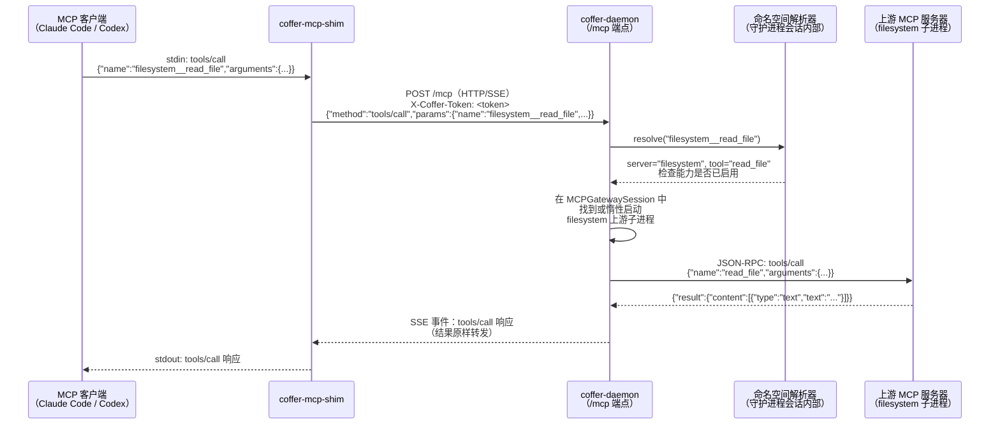

# 请求全链路

::: tip 核心模型
Coffer 如今承载**多条**请求全链路，而不止一条。最初——也仍是最核心的——路径是 **MCP `tools/call`** 全链路：MCP 客户端 → 守护进程 → 上游服务器，入口处 shim 将 stdio 转换为 HTTP/SSE，分发处命名空间解析器将 `filesystem__read_file` 拆分为服务器 `filesystem` 和工具 `read_file`。与之并行的还有 **agent 对话回合**全链路、**channel 入站**全链路和**知识/记忆检索**全链路。本页先完整讲解 MCP 路径，再勾勒其余三条。
:::

## MCP 工具调用全链路

这是 Coffer 的请求全链路之一——MCP 网关路径。其余三条在本页末尾概述。

### 三步摘要

1. **到达。** 工具调用以 JSON-RPC 2.0 `tools/call` 请求的形式到达守护进程的 `/mcp` HTTP/SSE 端点，请求携带命名空间化的工具名，例如 `{"method": "tools/call", "params": {"name": "filesystem__read_file", "arguments": {...}}}`。调用来自 shim（桥接 MCP 客户端的 stdio）或任何持有有效 `X-Coffer-Token` 的进程。

2. **命名空间解析。** 守护进程将 `<server-name>__<tool-name>` 形式拆分，以识别来源上游（`filesystem`）和工具的原始未加前缀名称（`read_file`）。它定位此下游客户端连接的 `MCPGatewaySession`，并在该会话内找到或惰性启动 `filesystem` 上游的子进程（或 HTTP 连接）。

3. **转发和返回。** 守护进程使用未加前缀的工具名向上游发出 JSON-RPC `tools/call` 请求，通过 ID 关联请求，等待上游响应，并将响应原样返回给下游客户端。上游的结果——无论是成功的内容负载还是工具级别的错误——都原封不动地转发。

## 端到端时序图



## Shim 的作用

MCP 客户端（Claude Code、Codex）期望通过 stdio 与 MCP 服务器通信：它们将 JSON-RPC 写入服务器的 stdin，并从服务器的 stdout 读取响应。然而，守护进程通过 HTTP/SSE 暴露 MCP（服务器到客户端通知使用长效 SSE 通道，客户端到服务器请求使用 HTTP POST）。stdio shim 桥接了这种差异：

- 它由 MCP 客户端作为上游 MCP 服务器启动。
- 它通过 HTTP/SSE 连接到守护进程的 `/mcp` 端点，使用来自 `~/.coffer/daemon.json` 的 token 进行鉴权。
- 它从 stdin 读取 JSON-RPC 消息并将其作为 HTTP POST 请求发送到守护进程。
- 它从守护进程读取 SSE 事件（响应和通知）并将其写回 stdout。

从 MCP 客户端的角度看，shim 与任何其他 stdio MCP 服务器无法区分。从守护进程的角度看，shim 只是另一个 HTTP 客户端——其连接创建一个 `MCPGatewaySession`。

连接后发生的 `initialize` 握手由守护进程处理，守护进程将自己呈现为包含所有已注册和已启用上游能力之并集的单一 MCP 服务器。

## 命名空间化

聚合多个上游 MCP 服务器而不发生冲突的核心设计选择是双下划线命名空间：通过 Coffer 暴露的每个工具、资源和提示都携带来源服务器的注册名称作为前缀。

| 上游服务器                 | 上游工具名            | Coffer 命名空间化名称         |
| -------------------------- | --------------------- | ----------------------------- |
| `filesystem`               | `read_file`           | `filesystem__read_file`       |
| `github`                   | `search_repositories` | `github__search_repositories` |
| `postgres`                 | `query`               | `postgres__query`             |
| `filesystem`（第二个实例） | `read_file`           | `filesystem2__read_file`      |

分隔符 `__`（双下划线）之所以被选择，是因为它在自然 MCP 工具名称中很少见，且与工具名称中按惯例使用的单下划线在视觉上有清晰区分。服务器名称来自用户分配的注册名称——与 `coffer mcp add <name>` 中使用的名称相同。此名称是稳定且持久化的；更改它需要重新注册。

**分发。** 当 `tools/call` 请求以 `filesystem__read_file` 为名到达时，守护进程在第一个 `__` 处拆分：

- `server_name = "filesystem"`
- `tool_name = "read_file"`

然后它：

1. 在数据库中查找名为 `filesystem` 的 `mcp_server` 资源并验证其已启用。
2. 检查服务器 `filesystem` 上工具 `read_file` 的能力偏好——如果用户已禁用此工具，则在联系上游之前拒绝调用，返回 `TOOL_DISABLED` 错误。
3. 找到此下游客户端的 `MCPGatewaySession`，并获取（或惰性启动）`filesystem` 上游的子进程。
4. 向上游子进程发出 `{"method": "tools/call", "params": {"name": "read_file", "arguments": ...}}`，使用新的请求 ID。
5. 通过请求 ID 关联上游的响应并将其返回给下游客户端。

**资源和提示。** 相同的命名空间化适用于此。资源 URI 包含服务器前缀。提示名称遵循相同的 `<server>__<prompt>` 惯例。分发逻辑是对称的。

## 会话模型与惰性启动

每个下游客户端连接在守护进程中创建一个 `MCPGatewaySession`（按 [ADR-005](/zh/reference/adr/ADR-005-session-subprocess-model)）。此会话拥有该连接的上游子进程。子进程不在会话创建时启动——它们在第一次需要时惰性启动，即路由到给定上游的第一个 `tools/list` 或 `tools/call` 支付一次子进程启动和 `initialize` 握手的代价。同一会话中的后续调用重用正在运行的上游。

同时连接的两个 MCP 客户端（例如 Claude Code 和 Codex 同时运行）产生两个独立的 `MCPGatewaySession` 对象，每个都有自己的上游子进程集。它们不共享任何状态。这防止了一个客户端的上游崩溃影响另一个客户端，并保持 MCP 协议正确性：每个上游 `initialize` 为每个会话新鲜协商能力，守护进程无需多路复用或伪造会话状态。

每个会话还维护每个上游能力列表的 60 秒内存缓存。缓存由 TTL 到期、来自上游的 `notifications/tools/list_changed` 通知或用户发起的能力刷新来失效。能力 schema 和描述从不写入数据库——只有用户的每能力启用/禁用偏好标志被持久化，以能力名称为键。

## 网关做什么和不做什么

::: tip 网关做什么

- 将所有已注册已启用上游 MCP 服务器的工具、资源和提示聚合到单一命名空间化的 MCP 接口面中。
- 拆分命名空间化名称并将调用路由到正确的上游。
- 在转发任何调用之前强制执行每能力启用/禁用策略。
- 在每次工具调用或资源读取时重置会话不活动超时（以便长期运行的会话在活跃使用期间保持活跃）。
- 在子进程启动时将上游的授权 token（通过凭据引用配置时）转发到上游——凭据从不被记录或存储。
- 为每次工具调用记录调用条目（时间戳、目标、持续时间、结果）——不记录参数或返回内容。
  :::

::: warning 网关不做什么
**不主动转发流式进度通知。** MCP 协议包含上游在长时间运行的工具调用期间可以发出的进度通知（`notifications/progress`）。当前 Coffer 网关不主动将这些中间进度通知转发给下游客户端。这是一个刻意的、明确的范围选择：实现正确的进度转发代理需要基于进度 token 的每通知路由，这是额外的记录管理复杂性。对于单用户、容忍延迟的用例，返回最终结果就足够了。如果你的上游在调用期间发出进度通知，客户端不会在调用中途看到它们；它将在调用完成时收到最终结果。

**不进行响应转换。** 上游的响应原样返回给下游客户端。网关不检查、重写或过滤工具结果的内容。如果上游返回二进制块，网关转发该二进制块。

**不进行参数重写。** 工具调用参数原样转发给上游。网关不添加、删除或重写参数。
:::

## 错误路径

当出错时，守护进程总是向下游客户端返回结构良好的错误。错误从不挂起或返回非结构化响应。

**统一错误信封。** 管理 API 的所有错误遵循以下结构：

```json
{
  "error": {
    "code": "TOOL_DISABLED",
    "message": "Tool filesystem__read_file is disabled",
    "details": { "server": "filesystem", "tool": "read_file" }
  }
}
```

`X-Coffer-Trace` 响应头携带关联 ID，该 ID 出现在 `~/.coffer/logs/daemon.log` 下的结构化日志中，将 HTTP 错误响应与日志中的完整请求上下文关联起来。

**具体故障模式：**

| 场景                       | 守护进程的处理方式                                                                                                    |
| -------------------------- | --------------------------------------------------------------------------------------------------------------------- |
| 工具或能力已禁用           | 在联系上游之前以 `TOOL_DISABLED`（JSON-RPC 代码 -32000）拒绝。                                                        |
| 上游服务器在启动时不可达   | 调用返回上游不可达错误。服务器在守护进程的会话状态中被标记为不健康。后续调用触发带有有界重试的重启尝试。              |
| 上游在调用中途崩溃         | 进行中的调用返回错误。会话将上游标记为不健康。下一次对该上游的调用触发带退避的重启。                                  |
| 上游返回工具错误           | 错误原样转发给下游客户端。Coffer 不重新解释或吞没上游错误。                                                           |
| 调用超时                   | 每次调用时重置会话不活动超时。如果上游在配置的每次调用超时内没有响应，守护进程返回超时错误。                          |
| 守护进程在 shim 活跃时崩溃 | shim 检测到 HTTP/SSE 连接已关闭，向 MCP 客户端返回干净的错误（而不是挂起），并可能尝试通过 detect-or-spawn 重新连接。 |

**调用日志记录。** 每次工具调用、资源读取和提示获取都记录在 `mcp_invocations` 表中：时间戳、目标能力（命名空间化形式）、持续时间和结果（成功或错误）。参数和返回内容从不存储。这为用户提供了活动历史记录和网关 I/O 的审计跟踪，而不会因敏感参数值而产生隐私风险。

## 示例 JSON-RPC 交换

在 shim 的 stdin/stdout 边界处看到的完整往返：

**客户端 → shim → 守护进程（`tools/call` 请求）：**

```json
{
  "jsonrpc": "2.0",
  "id": 42,
  "method": "tools/call",
  "params": {
    "name": "filesystem__read_file",
    "arguments": {
      "path": "/tmp/example.txt"
    }
  }
}
```

**守护进程 → shim → 客户端（成功响应）：**

```json
{
  "jsonrpc": "2.0",
  "id": 42,
  "result": {
    "content": [
      {
        "type": "text",
        "text": "Hello, world!\n"
      }
    ]
  }
}
```

**守护进程 → shim → 客户端（能力已禁用错误）：**

```json
{
  "jsonrpc": "2.0",
  "id": 43,
  "error": {
    "code": -32000,
    "message": "Tool filesystem__write_file is disabled"
  }
}
```

守护进程不向上游的成功结果添加任何包装或额外字段。错误结构遵循 JSON-RPC 2.0，Coffer 特定的负代码在 -32000 范围内。

## Agent 对话回合全链路

对话接口面驱动的是另一条全链路：它不是把单个 JSON-RPC 调用转发给上游，而是运行一个多步的 **agent 回合**，在生成回复前可能先调用 Coffer 自己的若干网关工具。此路径由[规约 008](/zh/reference/specs/008-agent-chat/spec) 规定。

1. **回合开始。** 对话客户端（Web UI 或某个 channel）发送一条用户消息。`TurnOrchestrator`（`application/chat/turn_orchestrator.py`）创建或恢复会话，持久化用户回合，并开始流式输出。

2. **进程内 agent。** 对于内置 agent，编排器驱动一个进程内 LangGraph agent（`infrastructure/chat/langgraph_agent.py`）。该 agent 的工具就是 Coffer 自己的网关工具，通过网关工具 provider（`infrastructure/chat/gateway_tool_provider.py`）暴露给模型——因此对话 agent 可以在进程内、无需 shim 地调用与外部 MCP 客户端相同的聚合 MCP 能力。

3. **流式返回。** 随着运行推进，token 和工具调用事件通过 SSE 流式发送给客户端；`interrupt_turn` 取消进行中的回合，完成时持久化最终的 assistant 回合。

**CLI-agent 变体。** 对话 agent 也可以不用进程内 LangGraph agent，而是通过 `infrastructure/chat/cli_agent.py` 和 `infrastructure/chat/cli_providers.py` 驱动一个**外部编码 agent 子进程**（Claude Code 或 Codex）。编排器接缝完全相同——相同的回合持久化、相同的流式契约——只是模型循环运行在外部 CLI 进程中，而非进程内。

## Channel 入站全链路

消息 channel（Telegram、SeaTalk）将用户消息送入与 Web UI **相同的 `TurnOrchestrator` 接缝**——一旦到达编排器，channel 回合与 UI 回合无法区分。入站传输因平台而异（按 [ADR-014](/zh/reference/adr/ADR-014-channel-adapter-framework)）：

- **SeaTalk（webhook）。** SeaTalk 只通过公开 webhook 投递事件。一个独立的**回调监听器进程**（`coffer-callback`，在任何 SeaTalk channel 启用期间由守护进程启动）在 loopback 端口上提供 `POST /seatalk/{channel}`。它应答平台的验证挑战，校验请求签名（`sha256(body + signing_secret)`），归一化事件，并转发给守护进程——再由守护进程送入编排器。

- **Telegram（长轮询）。** Telegram 入站以守护进程内的长轮询循环运行（无公开端点），在到达编排器前将每个 update 归一化为相同的入站形态。

进度由 agent 的能力渲染，而非适配器类型：Telegram 通过编辑同一条消息流式呈现进度，SeaTalk 降级为 ack-then-final。

## 知识/记忆检索全链路

检索请求（KB 搜索，以及 `recall` / `remember` 记忆工具）遵循一条锚定于 [ADR-012](/zh/reference/adr/ADR-012-files-as-truth-sqlite-retrieval) 的全链路：**markdown 文件是事实来源**，`coffer.db` 只保存派生索引。

- **`grep`** —— 对原始文件做 ripgrep（零索引、与语言无关）。
- **keyword** —— SQLite **FTS5** 的 `MATCH … ORDER BY bm25()`。
- **vector** —— **sqlite-vec** 对 chunk 嵌入做 KNN（可选启用；嵌入来自用户可配置的 OpenAI 兼容端点）。

KB 搜索融合已启用的引擎并返回排序后的 chunk；`recall` 从记忆存储读取，`remember` 写入一个事实文件，随后从文件重新生成派生的 FTS5/vec 索引。由于文件即事实，索引随时可重建，用户也可用普通工具 diff/grep/编辑内容。

---

**参见：** [规约 001：MCP 网关](/zh/reference/specs/001-mcp-gateway/spec)，[ADR-005：会话子进程模型](/zh/reference/adr/ADR-005-session-subprocess-model)，[规约 008：Agent 对话](/zh/reference/specs/008-agent-chat/spec)，[ADR-014：Channel 适配器框架](/zh/reference/adr/ADR-014-channel-adapter-framework)，[ADR-012：文件即事实，SQLite 检索](/zh/reference/adr/ADR-012-files-as-truth-sqlite-retrieval)
