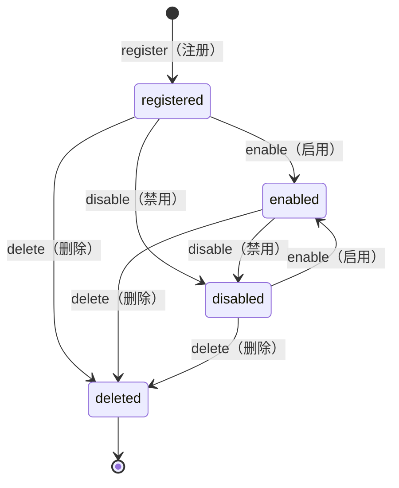

# Resource 框架

Resource 框架是 Coffer 的核心抽象。理解它，是理解系统如何随着新管理实体类型的加入而优雅扩展的关键。

## 一切皆资源 kind

Coffer 中每一个由用户管理的实体都是一个 **Resource（资源）**，由形如 `<kind>:<name>` 的稳定字符串标识。当前已注册两个 kind：`mcp_server` 和 `agent`（一个已注册的本地 AI 编码助手）。未来的 kind——提示词库、工具策略、凭据集——都将接入同一个框架，无需对框架本身做任何修改。

框架提供四件事，且仅此四件：

| 关注点                           | 框架做什么                                                                                   |
| -------------------------------- | -------------------------------------------------------------------------------------------- |
| **身份 (Identity)**              | 为每个资源分配 `kind`、`name`，以及复合稳定引用 `<kind>:<name>`。                            |
| **生命周期 (Lifecycle)**         | 定义并强制执行资源可处于的状态：registered、enabled、disabled、deleted。                     |
| **审计 (Audit)**                 | 为每一次生命周期变更记录时间戳和操作者（`cli`、`api`、`ui`、`system`）。                     |
| **模式校验 (Schema validation)** | 在 application 层边界分发每个 kind 对应的 Pydantic schema 校验，而分发机制本身与 kind 无关。 |

::: warning 框架不做什么
Resource 框架不统一调用语义。每个 kind 自行定义其能力的使用方式。没有通用的 `invoke()` 方法，没有共享调用路径，没有跨 kind 行为。框架描述的是资源如何被注册、如何被自描述、如何被治理——而不是使用它时会发生什么。
:::

## 为什么提前设计 kind 无关框架（ADR-001）

章程通常将跨层公共抽象推迟到第二个 feature 也需要它时才抽取（「在第二个 feature 时抽取」）。Resource 框架是一个明确的例外，原因在于成本不对称。

框架横跨每一层：domain 实体、数据库 schema、审计表、保留框架、接口面路由（REST API 子路由、CLI 子命令组）。如果这个抽象在第一个规范中被设计为 `mcp_server` 的专用实现，然后等第二个 kind 到来时再抽取，重构成本将不是简单的模块移动——它需要同时重建审计表、接口面路由和保留框架。「第二个 feature」时的重构将是一次重大且高风险的迁移，而非干净的模块分离。

构建各 kind 独立孤岛、没有共享抽象的替代方案同样被拒绝：已经有四个及以上 kind 在高置信度的规划中，分别构建四份身份 + 生命周期 + 审计 + 接口面 CRUD，将产生更多代码和更大的漂移风险。

结果是第一个规范（`001-mcp-gateway`）在只有一个具体 kind 的情况下承担了框架的抽象开销。这被接受为已知的成本，明确以避免未来重构为收益来平衡。

## 标识符格式：`<kind>:<name>`（ADR-003）

资源在外部以 `<kind>:<name>` 字符串引用：

- CLI：`coffer resource show mcp_server:filesystem`
- REST API URL：`/api/v1/resources/mcp_server/filesystem`
- 配置引用：agent 的 `tools` 字段中列出 `mcp_server:filesystem`

格式是自描述的：前缀告诉你应该查询哪个 kind，在许多代码路径中省去一次额外查询。它对人类可读，调试时无需解码器。

内部，数据库使用代理主键 `id INTEGER PRIMARY KEY AUTOINCREMENT` 用于 join 和外键，`UNIQUE (kind, name)` 约束强制外部标识符的唯一性。领域层的值对象 `ResourceRef(kind: str, name: str)` 在 application 层边界处理解析与序列化——原始字符串永远不进入 domain 层。

**被拒绝的替代方案：**

- **完整 URN**（`urn:coffer:mcp_server:filesystem`）：被拒绝，因为 Coffer 是单用户本地优先的——不存在需要区分的另一个 Coffer 实例，`urn:coffer:` 前缀是纯粹的形式主义。
- **纯 UUID**：被拒绝，因为不透明、不自描述，且强迫每个引用都携带单独的 `kind` 字段。
- **路径风格**（`mcp_server/filesystem`）：功能上等价，但被拒绝，因为斜杠在 URL、文件路径和许多 DSL 中已经过载；冒号使 kind 命名空间关系更清晰直观。

## 能力状态模型（ADR-004）

每个资源在一个明确定义的生命周期中流转。状态机有意保持简单：

**registered（已注册）** — 资源已存在于数据库中并附带其配置，尚未被明确启用或禁用。

**enabled（已启用）** — 资源处于活跃状态。对于 `mcp_server`，这意味着守护进程会连接到它并向 MCP 客户端暴露其工具。

**disabled（已禁用）** — 资源配置被保留，但守护进程不会连接到它或暴露其工具。禁用是非破坏性的：重新启用后无需重新注册即可恢复。

**deleted（已删除）** — 资源被移除，这是一个终态。以相同名称重新添加服务器将是一次全新注册。

每一次状态转换都被记录到审计日志中，并附带操作者信息。审计日志无法通过普通 API 修改或删除——它是只追加的。

对于 `mcp_server`，还存在并行的能力级别状态：上游服务器暴露的每个单独工具、资源或提示都可以单独启用或禁用（见 ADR-004）。数据库只存储这些能力的用户偏好标志——不缓存能力 schema 或描述。这些内容在每次请求时从上游实时获取，以每会话内存缓存的形式保存，TTL 为 60 秒。

## Kind 在组装入口处注册

框架不使用全局注册表，也不依赖 import 副作用。每个 kind 在组装入口处通过 `KindModule` dataclass 显式装配。组装入口是 `surfaces/http/app.py`（FastAPI 装配）和 `surfaces/cli/main.py`（Typer 装配）。

添加新 kind 是机械性工作：在每一层创建 kind 的子目录（`domain/<kind>/`、`application/<kind>/`、`infrastructure/<kind>/`、`surfaces/http/<kind>/`、`surfaces/cli/<kind>/`），实现 kind 特定的逻辑，然后在组装入口注册一个 `KindModule`。审计、保留和资源列表接口面将自动继承。

## 为什么「一切皆资源 kind」（ADR-007）

信息架构遵循与领域模型相同的原则：存在单一轴向的导航模型，每一个面向用户的被管理实体都是一个资源 kind，通过同一个侧边栏分组呈现。不存在与 resource 概念并列的独立「surface」概念。

这消除了每个未来规范都需要回答的问题：「这个新东西是 kind 还是 surface？」运维工具——可观测性、设置——出现在单独的 System 分组中；用户管理的一切都出现在 Resources 分组中。

由此产生一条刻意的策略：**不设「即将推出」占位符**。一个 kind 在 UI 或侧边栏中不显示，直到它真正可用。UI 始终应被读解为「这是 Coffer 现在能做的」，而不是「这是 Coffer 计划要做的」。

---

**参见：** [ADR-001：Resource 框架提前设计](/zh/reference/adr/ADR-001-resource-framework-upfront)，[ADR-007：一切皆资源 kind](/zh/reference/adr/ADR-007-everything-is-a-resource-kind)，[ADR-003：资源标识符格式](/zh/reference/adr/ADR-003-resource-identifier-format)，[ADR-004：能力状态模型](/zh/reference/adr/ADR-004-capability-state-model)
