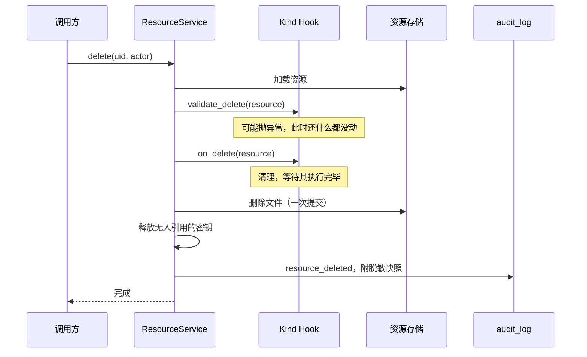

# 资源框架 {#resource-framework}

你在 Coffer 里管理的每一个实体——MCP 服务器、智能体、技能、知识集、记忆分区、消息渠道、模型提供商——都是某种**类型**的一个**资源**。本页讲解这个与类型无关的核心：它让所有实体共享同一种身份、同一套生命周期、同一条审计轨迹和同一套生效范围概念；也讲一个类型要接入它必须实现的确切契约。本页面向要新增类型、修改生命周期行为，或者想弄明白某次写入为什么被拒绝的工程师。

## 它解决的问题 {#the-problem-it-solves}

七种东西需要同样的操作：创建、列出、查看、编辑、启用、禁用、设置范围、删除，以及所有这些操作的历史。做七遍，这些操作就会各自偏移——一种类型通过自己的路由改名，另一种根本没有改名路由；一种类型审计配置时带着密钥，另一种则会剥掉。只做一遍但不够小心，共享层就会长出一个「上帝」接口，硬要统一本来毫无共同点的东西：调用 MCP 工具、交付技能和运行 Telegram 适配器，并不是同一种操作。

框架接受前一半，拒绝后一半：

- **统一的：** 身份、生命周期、审计、schema 校验、生效范围（scope 加 `enabled`）、日志表的保留策略，以及这一切的 REST 和命令行接口。
- **不统一的：** 调用语义。每种类型自己定义它的能力怎么用，每种类型也在自己的咽喉点上*执行*生效范围。

## 设计决策 {#design-decisions}

| 决策 | 理由 |
| --- | --- |
| 每种类型一个冻结的 `Kind` 描述符，包含数据和可调用对象。 | 类型按值接入。核心只查字段，从不导入类型模块。 |
| 写入前的校验器可以拒绝；写入后的反应不可以。 | 校验器决定改动是否发生。反应是在改动已经持久化并审计之后去跟上它，让它抛异常就等于假装能撤销一件它撤销不了的事。 |
| 创建是唯一没有通用化的操作。 | 技能需要一个主文件夹，智能体需要一个探测到的配置目录。这类类型设置 `generic_create_allowed=False`，通过自己的服务注册。创建之后的一切都是通用的。 |
| 身份是不可变的 `uid`，名字只是标签。 | 同步的保险库需要一个所有机器都认同、改名也破坏不了的身份。 |
| 被智能体引用的名字是固定的；只有名字可自由修改的类型才带 `title`。 | MCP 服务器的名字是智能体看到的每个工具名的前缀，技能的名字是智能体加载它的文件夹。改这两个名字会破坏 Coffer 看不到的权限规则、技能和笔记，所以这些类型设置 `name_fixed`。智能体的名字就是它的类型，每台机器一个。这三种都不带显示标题：在固定名字旁边再加一个标签，只会把人和智能体实际使用的名字藏起来。提供商、消息渠道、知识集和记忆分区保留可选的 `title`。 |
| 框架存储生效范围；类型负责执行。 | 执行应该放在知道是哪个智能体在请求的地方。集中式的闸门必须挂在每种类型的读取路径上。 |
| 核心用一个假类型来测试。 | 如果核心需要真实类型才能测试，说明它已经泄漏了。一条导入契约让它保持这样。 |

## 机制 {#the-mechanism}

### Resource {#resource}

[`Resource`](https://github.com/wyx-sg/Coffer/blob/main/backend/coffer/domain/resource.py) 是一个普通的 dataclass。每个资源是一个 JSON 文件 `resources/<kind>/<name>.json`，存放在它的类型所声明的存储类别里（大多数类型在保险库里；见[持久化](/zh/architecture/persistence)）：

| 字段 | 含义 |
| --- | --- |
| `uid` | 身份，写在文件里面。`uuid4().hex`，在 `ResourceService.register` 中生成一次（或者写进一个缺少它的手工文件），不可变，在持有该资源的每台机器上都相同。每个引用、数据行和链接都以它为键。 |
| `kind` | 类型名，比如 `mcp_server`。 |
| `name` | 标签，在该类型内唯一。可变，除非类型声明它固定（`name_fixed`）。 |
| `title` | 可选的显示标签，最多 80 个字符的自由文本，只在带它的类型（`titled`）上有。设置后，界面会用它代替名字显示。只在设置时写入资源文件。 |
| `description` | 可选的自由文本。 |
| `config` | 该类型的配置，按类型的 Pydantic schema 校验。当前构建不认识的字段会保留在文件里，并报告为警告。 |
| `enabled` | 开关。资源生效范围的一半，存储在 `~/.coffer/local/reach.json` 中，不在文件里。对非 `toggleable` 的类型始终为 true。 |
| `created_at`、`updated_at` | 时间戳。`updated_at` 来自派生的 uid 索引，不来自文件。 |
| `scope` | 可选的智能体白名单（`Scope`），生效范围的另一半，同样在 `local/reach.json` 里。`None` 表示所有智能体。 |
| `rev` | 派生索引（`derived/index/resources.json`）中每个 uid 的计数器，文件内容或本机的生效范围改变时递增。事件流和调和器都会携带它。 |

名字仍限定为 `^[a-zA-Z0-9_.-]+$`，最多 64 个字符（`validate_resource_name`），因为有三种类型——`skill`、`knowledge` 和 `memory`——会把名字变成目录。类型可以额外加更严格的规则。

### Kind {#kind}

[`Kind`](https://github.com/wyx-sg/Coffer/blob/main/backend/coffer/domain/resource.py) 是一个冻结的 dataclass。下面每个字段都是真实存在的；除 `name`、`display_name` 和 `config_schema` 外都是可选的。

**声明**

| 字段 | 默认值 | 含义 |
| --- | --- | --- |
| `name` | — | 类型键，比如 `"skill"`。 |
| `display_name` | — | 给人看的标签。 |
| `config_schema` | — | 配置必须通过校验的 Pydantic 模型。 |
| `generic_create_allowed` | `True` | `POST /api/v1/resources`（以及通用的配置更新）能否操作这种类型。 |
| `supports_scope` | `False` | 该类型是否带有按智能体划分的范围。没有它的类型会拒绝任何非空 scope（`SCOPE_INVALID`，422）。 |
| `toggleable` | `True` | 该类型到底有没有启用开关。`knowledge` 和 `memory` 设为 `False`：它们的每个资源都是启用并提供服务的，启用或禁用会被拒绝，返回 `RESOURCE_NOT_TOGGLEABLE`（409），什么都不改。 |
| `storage` | `vault` | 该类型资源文件所在的存储类别：`vault`（同步）、`local`（`agent`）或 `derived`（`memory`）。目录就是同步策略。 |
| `storage_row` | `None` | 对 `storage` 的逐行细化，只取决于配置。`skill` 类型把内置的 `coffer-guide` 归为 `derived`。 |
| `name_fixed` | `False` | 名字注册后是否固定，因为它在 Coffer 之外被引用，或者由配置派生而来。名字不同的 `PATCH` 会被拒绝，返回 `409 NAME_IMMUTABLE`。 |
| `name_fixed_resets` | `""` | 删除后重新注册会重置什么，写在 `NAME_IMMUTABLE` 的消息里。 |
| `name_from_config` | `None` | 由配置派生出的、数据行唯一可用的名字。`agent` 设置了它：智能体按类型命名（`claude_code` → `claude-code`），注册时会拒绝其他名字。 |
| `titled` | `True` | 该类型的数据行是否带可选的 `title`。`agent`、`mcp_server` 和 `skill` 为 `False`；在这些类型上注册或编辑时给出非空标题会被拒绝，返回 `CONFIG_INVALID`。 |

**写入前的校验器——在持久化之前运行；抛异常即拒绝写入**

| 字段 | 调用方 | 含义 |
| --- | --- | --- |
| `validate_name` | 注册、改名、对其文件的每次改动 | 在框架规则之上的类型专属命名规则；保险库对手工编辑或同步合并也按它判断。 |
| `validate_config` | 仅注册 | schema 之外的语义校验（同步或异步）。更新时不运行，所以编辑一个无关字段永远不会重新探测文件系统。 |
| `on_update_config` | 更新 | 看到资源的当前状态和拟议的配置；可以拒绝。 |
| `on_rename` | 改名 | 把可改名类型（`knowledge`、`memory`）存在旧名字下的东西挪走。在数据行改变之前运行；如果随后有并发的写入者抢走了这个名字，服务会再调用它一次把东西挪回来。 |
| `validate_scope_for` | 范围更新 | 看到资源的当前状态和拟议的范围；可以拒绝。 |
| `validate_delete` | 删除 | 在拆除任何东西之前拒绝删除。 |

**核心会查询的声明——只取决于配置的纯函数**

| 字段 | 含义 |
| --- | --- |
| `secret_ref_extractor` | 为一份配置返回 `{key: secret_ref}`。核心在任何写入前探测每个引用（`SECRET_MISSING`），并用同一个答案拒绝删除仍被引用的密钥，以及在删除后释放不再被引用的密钥。 |
| `audit_redactor` | 返回一份可安全写入审计的配置副本。 |
| `default_scope` | 新注册数据行的初始范围，代替「所有智能体」。 |

**写入后的反应——在持久化和审计之后运行；无法撤销写入**

| 字段 | 在何时之后调用 | 含义 |
| --- | --- | --- |
| `on_delete` | 删除已决定 | 清理。唯一在数据行被移除*之前*运行的反应，所以它仍能解析资源；会等待它执行完毕，它抛出的异常会中止删除。 |
| `on_scope_changed` | 范围已持久化 | 按新范围做调和（比如交付或回收技能）。 |
| `on_enabled_changed` | `enabled` 已翻转 | 按新标志做调和。值没变时不触发。 |

同步没有接入类型的 Hook。通过同步到达的资源文件，和你手工编辑的文件一样，在检出之前会经过每次写入都要经过的同一个校验器；这一轮结束后，调和器会重新投射发生变化的内容。智能体根本不会通过同步到达：`agent` 类型是本机专属的。见[保险库同步](/zh/architecture/vault-sync)。

### 每种类型设置了什么 {#what-each-kind-sets}

| 类型 | 它提供的 Hook 和标志 |
| --- | --- |
| `mcp_server` | `name_fixed`（名字是智能体看到的每个工具名的前缀）、`titled=False`、`supports_scope`、`validate_name`（保留 `__` 作为工具命名空间分隔符，并把名字限制在 24 个字符以内）、`audit_redactor`（剥掉 `transport.env` 和 `transport.headers`）、`secret_ref_extractor`、`on_update_config`（驱逐活跃连接，让下一次调用用新配置启动）、`on_delete`、`on_enabled_changed`（禁用时驱逐活跃连接） |
| `agent` | `generic_create_allowed=False`、`name_from_config` 和 `name_fixed`（每种类型一个智能体，以类型命名）、`titled=False`、`storage=local`、`on_delete`、`on_enabled_changed` |
| `skill` | `generic_create_allowed=False`、`supports_scope`、`validate_name`（`SKILL.md` frontmatter 规则）、`validate_delete`（拒绝删除内置的 `coffer-guide`）、`storage_row`（把 `coffer-guide` 归为 derived）、`name_fixed`（名字是智能体加载它的文件夹）、`titled=False`、`on_delete`、`on_scope_changed`、`on_enabled_changed` |
| `knowledge` | `generic_create_allowed=False`、`toggleable=False`、`on_rename`（移动知识集目录）、`on_delete` |
| `memory` | `generic_create_allowed=False`、`toggleable=False`、`storage=derived`、`on_rename`、`on_delete` |
| `channel` | `supports_scope`（反向的，见下文）、`secret_ref_extractor`、`validate_config`、`on_update_config`、`validate_scope_for`、`on_delete` |
| `provider` | `supports_scope`、`default_scope`、`secret_ref_extractor`、`validate_config`、`on_update_config` |

### ResourceService {#resourceservice}

[`ResourceService`](https://github.com/wyx-sg/Coffer/blob/main/backend/coffer/application/resource_service.py) 在构造时接收每个应用的 `kinds` 字典、一个仓储、审计服务和密钥存储。它按 `resource.kind` 分派，从不导入类型模块。它的操作如下，按每个操作执行步骤的顺序列出：

| 操作 | 步骤 |
| --- | --- |
| `register` | 类型不允许通用创建且调用方没有显式选择时拒绝 → 框架与类型的命名规则（类型设置了 `name_from_config` 时还有派生名字）→ 标题规则（最多 80 个字符，非 `titled` 类型不得有标题）→ schema 校验 → `validate_config` → 探测引用的密钥 → 生成 `uid`（或接受同步文档带来的那个）→ 以 `default_scope` 插入 → 用脱敏后的配置审计 `resource_created`。 |
| `update_config` | 同样的通用创建闸门 → schema → 密钥探测 → `on_update_config` → 写入 → 用脱敏后的前后配置审计 `resource_updated`。 |
| `rename` | 没变化则不操作 → 拒绝 `name_fixed` 的类型（`NAME_IMMUTABLE`，409，不审计）→ 命名规则 → 冲突检查（`RESOURCE_ALREADY_EXISTS`，409）→ `on_rename` → 写入 → 带 `from` 和 `to` 审计 `resource_renamed`。 |
| `set_title` | 没变化则不操作 → 标题规则（空白即清除；超过 80 个字符，或在非 `titled` 类型上有任何标题，都是 `CONFIG_INVALID`）→ 写入 → 带标题的 `before` 和 `after` 审计 `resource_updated`。不受通用创建闸门限制。 |
| `set_enabled` | 拒绝非 `toggleable` 的类型（`RESOURCE_NOT_TOGGLEABLE`，409）→ 没变化则不操作（也不审计）→ 写入 → 审计 `resource_enabled` 或 `resource_disabled` → `on_enabled_changed`。 |
| `update_scope` | 按 `supports_scope` 执行 `validate_scope` → `validate_scope_for` → 写入 → 审计 `resource_scope_updated` → `on_scope_changed`。 |
| `delete` | 解析 → `validate_delete` → `on_delete` → 在一次保险库提交中删除资源文件 → 释放不再被任何资源引用的密钥 → 用脱敏快照审计 `resource_deleted`。 |

删除路径最清楚地展示了校验器与反应的分工：


```mermaid
sequenceDiagram
  participant C as 调用方
  participant S as ResourceService
  participant K as Kind Hook
  participant R as 资源存储
  participant A as audit_log
  C->>S: delete(uid, actor)
  S->>R: 加载资源
  S->>K: validate_delete(resource)
  Note over K: 可能抛异常，此时还什么都没动
  S->>K: on_delete(resource)
  Note over K: 清理，等待其执行完毕
  S->>R: 删除文件（一次提交）
  S->>S: 释放无人引用的密钥
  S->>A: resource_deleted，附脱敏快照
  S-->>C: 完成
```

类型自己的路由和通用路由调用的是同一个服务方法，所以两边的拒绝结果完全一样：删除 `coffer-guide`，无论走 `DELETE /api/v1/skills/{uid}` 还是 `DELETE /api/v1/resources/{uid}`，都返回 `409 RESOURCE_PROTECTED`。

### 通用路由 {#the-generic-routes}

[`surfaces/http/resource_routes.py`](https://github.com/wyx-sg/Coffer/blob/main/backend/coffer/surfaces/http/resource_routes.py) 通过 REST 暴露框架。每条路由都要求 `X-Coffer-Token` 请求头。

| 方法与路径 | 用途 |
| --- | --- |
| `GET /api/v1/resources?kind=&name=` | 列出，可按类型和确切名字过滤。命令行正是靠名字过滤把标签转换成 uid。 |
| `POST /api/v1/resources` | 注册一个允许通用创建的类型的资源。 |
| `GET /api/v1/resources/{uid}` | 查看一个资源。返回内容带有该类型的 `toggleable`，这样界面可以直接不显示开关，而不是给出一个会被拒绝的开关。 |
| `PATCH /api/v1/resources/{uid}` | 编辑 `description`、`config`、`title`（在 `titled` 类型上）和 `name`。只改请求体里出现的字段；单独改名不会触发配置写入，而且改名最后应用，所以配置被拒绝时名字不受影响。`name_fixed` 类型上改了名字会最先被拒绝（`409 NAME_IMMUTABLE`），因此该请求里什么都不会写入。 |
| `DELETE /api/v1/resources/{uid}` | 删除。 |
| `POST /api/v1/resources/{uid}/enable`、`/disable` | 翻转 `enabled`。对非 `toggleable` 的类型返回 `409 RESOURCE_NOT_TOGGLEABLE`。 |
| `GET /api/v1/resources/{uid}/scope` | 范围以及 `supports_scope`。 |
| `PUT /api/v1/resources/{uid}/scope` | 替换范围。 |

属于某个已关闭实验功能的类型，在这些路由上会被拒绝，返回 `404 FEATURE_DISABLED`，也不会出现在列表中；它的数据行不受影响。各类型也会挂载自己的路由器（`/api/v1/skills`、`/api/v1/channels` 等），承载框架不负责的行为。

命令行用名字代替 uid，镜像了通用接口。一个工厂（[`surfaces/cli/_kind_verbs.py`](https://github.com/wyx-sg/Coffer/blob/main/backend/coffer/surfaces/cli/_kind_verbs.py)）根据每种类型的描述符生成它的生命周期动词，每个命令组都提供 `list`、`show`、`edit` 和 `rm`。其余动词只在适用时出现，类型不支持的动词直接不出现，而不是在运行时被拒绝：`enable` 和 `disable` 只出现在 `toggleable` 类型上（所以 `knowledge` 和 `memory` 都没有），`scope` 只出现在带 `supports_scope` 的类型上（`mcp`、`skill`、`channel`、`provider`），`add` 只出现在类型自己注册了 `add` 的地方，因为每种类型的创建需要的东西都不同（`memory` 没有，因为只有聚合才会创建分区）。有些命令组也会自己写 `list` 或 `show`，因为那些类型的记录由它们自己的路由提供。

```sh
coffer mcp list
coffer mcp show github
coffer mcp edit github --description "Work org"  # the name itself is fixed
coffer channel edit tg --name telegram           # a channel stays renamable
coffer channel edit tg --title "Team Telegram"   # and carries a title
coffer skill disable pdf-tools
coffer mcp scope github --agents claude-code
coffer skill scope pdf-tools --none              # dormant
coffer mcp scope github --all                    # every agent again
```

REST 和命令行是对等的接口，通过同样的服务作答。每一种修改，以及每一种对非普通文件状态的读取，两边都能做到。对于其所属规格声明为可直接读取或编辑的普通文件——知识文档、记忆笔记、技能的文件夹、智能体自己的配置文件、守护进程日志——命令行通过 `coffer path` 给出文件位置来满足对等性，你再用普通工具去读或编辑它；提供这些文件的 REST 路由仍然保留，因为浏览器页面读不了磁盘。有一个覆盖整个命令行树的测试，按一张经过审阅的表断言这种对等性，表里列出了 `coffer path` 能回答的每一条基于文件的路由。

## 身份 {#identity}

有三个值用来命名资源，各司其职。文件路径不在其中：它只是 Coffer 存放资源的位置。

| 值 | 范围 | 用于 |
| --- | --- | --- |
| `uid` | 全局且永久 | URL（`/api/v1/resources/{uid}`、Web 详情页）、跨资源引用（范围里的智能体列表、消息渠道的 `default_agent`），以及 `runs.db` 和 `derived.db` 中每一条指向资源的数据行。它写在资源文件里面，所以移动或重命名文件，资源不变。 |
| `name` | 在类型内唯一；可变，除非类型是 `name_fixed` | 人输入的、智能体引用的名字。命令行把名字解析为 uid。智能体的名字就是它的类型。 |
| `title` | 可选，自由文本，只在带它的类型上有 | 设置后，界面用它代替名字显示。智能体、MCP 服务器和技能没有。 |

新资源总是得到一个随机的 `uid`；从另一台机器来的资源保留那台机器给它的 `uid`，因为 uid 就在文件里。两个文件拥有同一个 uid 时会被拒绝：新来的被标记，原来的继续生效。因为引用和历史数据行存的都是 uid，改名只改变文件的 `name`（并在同一次提交里把它移动到 `<new name>.json`），Coffer 内部不需要重新指向任何东西。uid 保护不了的，是在 Coffer 之外被引用的名字：MCP 服务器的名字是智能体看到的每个工具名的前缀（在 Claude Code 中是 `mcp__coffer__<server>__<tool>`），技能的名字是智能体加载它的目录。这两种类型设置 `name_fixed`；要换名字，就删除资源再重新注册，这会重置服务器的能力开关和生效范围，或者技能的绑定。智能体的名字固定则是另一个原因：一台机器上每种类型只有一个智能体，所以类型就是它的名字。MCP 服务器名字限制在 24 个字符以内——在每次注册和改名时，以及对文件的每次改动时，无论是手工还是同步合并——这样工具名才能保持在模型提供商 API 强制的 64 字符限制之内；每条能力数据行都带有 `client_name_length`，**工具**标签页和 `coffer mcp cap list` 会标出超过 64 的行。见 [Names Visible to Agents Are Fixed](https://github.com/wyx-sg/Coffer/blob/main/docs/decisions/names-visible-to-agents-are-fixed.md)。

## 生命周期事件与审计 {#lifecycle-events-and-audit}

每一次修改都通过 [`AuditService`](https://github.com/wyx-sg/Coffer/blob/main/backend/coffer/application/audit_service.py) 写一条 `audit_log` 数据行。框架自己的事件有 `resource_created`、`resource_updated`、`resource_renamed`、`resource_enabled`、`resource_disabled`、`resource_scope_updated` 和 `resource_deleted`；每种类型把自己的事件类型加进 [`domain/audit.py`](https://github.com/wyx-sg/Coffer/blob/main/backend/coffer/domain/audit.py) 中的同一套词汇表（比如 `skill_bound`、`channel_paired`、`provider_switched`）。

一条审计记录包含：

- **操作者**，来自 `X-Coffer-Actor` 请求头——一个短的小写标识符，比如 `cli`、`ui` 或 `system`；缺省时为 `api`，格式不对时以 400 拒绝；
- 资源的 `uid`，加上它**当时的类型和名字**，这样历史在改名后依然成立，旧记录仍能说明当时的真实情况；
- **详情**，其中配置会经过该类型的 `audit_redactor`。范围只携带智能体 uid，原样记录。

你可以在 Web 界面**活动**页的**变更**标签页、用 `coffer log audit`，或者通过 `GET /api/v1/audit` 查看这份日志。

## Schema 校验 {#schema-validation}

每种类型的 `config_schema` 是一个 Pydantic v2 模型。`ResourceService` 校验传入的配置，并存储 `model_dump(mode="json")`，所以 URL 这类特殊类型会以普通字符串持久化。形状不对是 `CONFIG_INVALID`（422）。需要超出形状的语义检查——这个消息渠道的 `default_agent` 是否指向一个已注册的智能体、这个工作目录是否存在——在 `validate_config` 或 `on_update_config` 中运行。密钥引用会在写入数据行之前对照加密存储进行探测，所以缺失的密钥会以 `SECRET_MISSING` 失败，并且不留下任何东西。

## 生效范围 {#reach}

资源的**生效范围**是它的 `enabled` 标志加上它的 `scope`。既不 `toggleable` 也没有范围的类型——`knowledge`、`memory`——没有生效范围可设：它对所有智能体生效，Web 界面也不为它显示生效范围或状态控件。两者都是本机专属的：在它们所作用的机器上设置，从不通过同步收敛。

[`domain/scope.py`](https://github.com/wyx-sg/Coffer/blob/main/backend/coffer/domain/scope.py) 定义了形状，以及每个执行点都会调用的那一个谓词：

| 存储的 scope | 含义 |
| --- | --- |
| `null` | 对所有智能体生效。 |
| `{"agents": ["<uid>", …]}` | 只对这些智能体生效。不匹配任何已注册智能体的 uid 是合法的，只是永远不会匹配。 |
| `{"agents": []}` | 休眠：对任何智能体都不生效。与禁用不是一回事。 |

```python
def is_active(scope: Scope | None, agent_uid: str | None) -> bool:
    if scope is None or scope.agents is None:
        return True
    return agent_uid is not None and agent_uid in scope.agents
```

一个身份不明的会话——手工配置、没有带 `--agent-uid` 的 shim——只能匹配不受限的范围，所以它看到的只会更少，绝不会更多。

### 消息渠道的反向范围 {#the-inverted-scope-of-channels}

对其他所有类型，scope 指的是资源*交付给*哪些智能体。消息渠道不被任何智能体消费：它是一个入站接口。所以消息渠道的 scope 指的是该渠道可以**驱动**哪些智能体。聊天里的 `/new <agent>` 只列出和接受这些智能体，消息渠道的 `default_agent` 也必须留在非空的范围之内——两条写入路径上都会强制执行，配置由 `on_update_config` 把关，范围由 `validate_scope_for` 把关。scope 为 `{"agents": []}` 的消息渠道根本不会启动它的适配器。休眠消息渠道的配置仍可编辑，所以令牌填错了可以直接改，不必重新激活。

### 七种类型 {#the-seven-kinds}

| 类型 | 携带内容 | 范围 | 生效范围在哪里执行 |
| --- | --- | --- | --- |
| `mcp_server` | 传输方式（stdio 或 HTTP）、密钥引用、每个服务器的网关策略。 | 有 | MCP 网关按会话的智能体 uid 过滤该服务器的工具（`application/mcp/gateway_scope.py`）。 |
| `agent` | 智能体类型、配置目录、Coffer MCP 的安装状态。其余一切都从智能体自己的文件中读取。 | 无——它本身就是智能体 | — |
| `skill` | 它的来源、`SKILL.md` 描述，以及 `~/.coffer/vault/skills/` 下主文件夹的版本哈希。 | 有 | 交付：技能当且仅当已启用且 `is_active(scope, agent)` 时才到达智能体；否则被回收。 |
| `knowledge` | 一个知识集，即 `~/.coffer/vault/knowledge/` 下的一个目录。 | 无，也不是 `toggleable` | 无处执行：每个知识集都出现在交付的目录中。 |
| `memory` | `~/.coffer/derived/memory/` 下的一个分区（一个仓库，或 `global`），从智能体的原生记忆派生而来。派生数据，从不同步。 | 无，也不是 `toggleable` | 无处执行：每个分区都提供给每个智能体。 |
| `channel` | 传输配置、密钥引用、`default_agent`、`runs_on`（由哪一台机器的守护进程运行适配器）。 | 有，反向 | 智能体路由（`/new <agent>` 和默认智能体）以及消息渠道运行时，它不会启动休眠的消息渠道。 |
| `provider` | 线上协议、基础 URL、一个 `secret_ref`。 | 有，由 `default_scope` 根据线上协议预填 | 投射接缝 `application/provider/targets.py`：切换、按智能体查找密钥、导入后调和和启动自愈。 |

`knowledge` 和 `memory` 不带范围也没有开关，因为两者提供的都是智能体拿到路径就能读的文件：范围或开关最多只能让它们在规规矩矩的查找中隐身，永远扣不住它们。

## 保留策略注册表 {#retention-registry}

日志类的表由一个工作者对照一个注册表来清理，所以没有哪种类型需要自己写清理任务。一张表在组合根处注册一个 [`PrunableTable`](https://github.com/wyx-sg/Coffer/blob/main/backend/coffer/application/retention_registry.py)——它的时间戳列、默认保留天数，以及一个动作（`delete`，或者 `archive`，后者改为给某一列打标记）。注册表同时也是 SQL 白名单：没注册的表无法被清理。用 `coffer config set retention.<table>` 或 `PATCH /api/v1/retention/policies/{table_name}` 修改策略；每次修改都以 `retention_updated` 审计。

已注册的策略、默认值和工作者的执行节奏列在[可观测性](/zh/architecture/observability#retention)中。

## 进行中的整理任务 {#passes-in-flight}

长时间运行、由模型驱动的重写——对一个知识集的整理、对一个记忆分区的提炼——在一个进程内的注册表中跟踪（[`application/upkeep_runs.py`](https://github.com/wyx-sg/Coffer/blob/main/backend/coffer/application/upkeep_runs.py)），以类型和名字为键，所以同一个目标上永远不会启动第二个任务：整理请求会被拒绝，返回 `UPKEEP_ALREADY_RUNNING`，「更新记忆」和定时器会跳过正忙的目标。没有表也没有租约：守护进程重启会结束所有任务，而一个比它的执行者活得更久的持久化占用，会让目标永远卡住。用 `GET /api/v1/upkeep/runs` 或 `coffer daemon status` 查看它。

## 权衡与备选方案 {#trade-offs-and-alternatives}

- **等第二种类型出现时再抽取框架。** 这是 Coffer 的惯常规则。这里被否决，因为从 MCP 专属代码里抽出一个通用资源模型，意味着要同时重新建模审计表、路由和保留策略。
- **第三方插件架构。** 否决：一个可用的插件契约需要好几个具体实现来做设计参照，而单用户的本地工具没有插件生态可以服务。
- **每种类型各自为政。** 否决：对于每种类型都共有的操作，代码更多、偏移也更多。
- **把按智能体划分的范围留在每种类型内部。** 在两种类型已经用两种不同方式解决它之后被否决；把它提升到框架中，身份相关的管线只需付出一次成本。
- **黑名单式的范围。** 否决：新智能体会悄无声息地获得对每个有范围资源的访问。
- **集中式的生效范围闸门。** 否决：它得挂在每种类型的读取路径上，而且仍然需要每种类型各自对「使用」的理解。

## 在代码中的位置 {#where-it-lives-in-the-code}

| 路径 | 内容 |
| --- | --- |
| [`backend/coffer/domain/resource.py`](https://github.com/wyx-sg/Coffer/blob/main/backend/coffer/domain/resource.py) | `Resource`、`Kind`、名字校验。 |
| [`backend/coffer/domain/scope.py`](https://github.com/wyx-sg/Coffer/blob/main/backend/coffer/domain/scope.py) | `Scope`、`is_active`、`validate_scope`。 |
| [`backend/coffer/domain/audit.py`](https://github.com/wyx-sg/Coffer/blob/main/backend/coffer/domain/audit.py) | 审计事件词汇表和条目。 |
| [`backend/coffer/application/resource_service.py`](https://github.com/wyx-sg/Coffer/blob/main/backend/coffer/application/resource_service.py) | 与类型无关的 CRUD，旁边还有 `resource_*_ops.py`。 |
| [`backend/coffer/application/retention_registry.py`](https://github.com/wyx-sg/Coffer/blob/main/backend/coffer/application/retention_registry.py) | `PrunableTable` 和注册表。 |
| `backend/coffer/application/<kind>/kind.py` | 每种类型的 `make_<kind>_kind()` 工厂。 |
| [`backend/coffer/surfaces/http/resource_routes.py`](https://github.com/wyx-sg/Coffer/blob/main/backend/coffer/surfaces/http/resource_routes.py) | 通用 REST 路由。 |
| [`backend/coffer/surfaces/cli/_kind_verbs.py`](https://github.com/wyx-sg/Coffer/blob/main/backend/coffer/surfaces/cli/_kind_verbs.py) | 构建每种类型命令行命令组的生命周期动词工厂。 |

## 相关内容 {#related}

- 规格：[resource-framework](https://github.com/wyx-sg/Coffer/blob/main/openspec/specs/resource-framework/spec.md)
- [Resource Framework Designed Upfront](https://github.com/wyx-sg/Coffer/blob/main/docs/decisions/resource-framework-upfront.md)
- [Resource Identity Is an Immutable `uid`](https://github.com/wyx-sg/Coffer/blob/main/docs/decisions/resource-identity-is-an-immutable-uid.md)
- [Names Visible to Agents Are Fixed](https://github.com/wyx-sg/Coffer/blob/main/docs/decisions/names-visible-to-agents-are-fixed.md)
- [Per-Agent Resource Scope](https://github.com/wyx-sg/Coffer/blob/main/docs/decisions/per-agent-resource-scope.md)
- [The Resource Framework Is Core Domain, Designed Before the Second Kind](https://github.com/wyx-sg/Coffer/blob/main/docs/decisions/resource-framework-upfront.md)
- [分层与代码布局](/zh/architecture/layering)——类型如何在组合根处接线。
