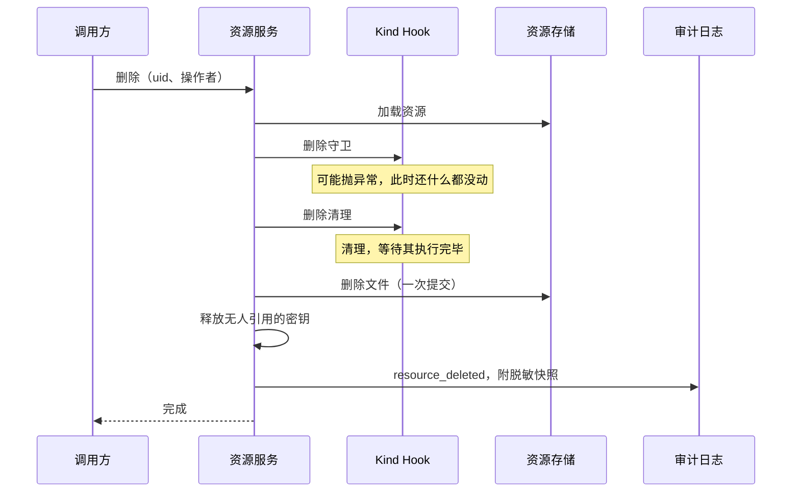

# 资源框架 {#resource-framework}

你在 Coffer 里管理的每一个实体——MCP 服务器、智能体、技能、知识集、记忆分区、消息渠道、模型提供商——都是某种**类型**的一个**资源**。本页讲解这个与类型无关的核心：它让所有实体共享同一种身份、同一套生命周期、同一条审计轨迹和同一套生效范围概念；也讲一个类型要接入它必须实现的确切契约。本页面向要新增类型、修改生命周期行为，或者想弄明白某次写入为什么被拒绝的工程师。

## 它解决的问题 {#the-problem-it-solves}

七种东西需要同样的操作：创建、列出、查看、编辑、启用、禁用、设置范围、删除，以及所有这些操作的历史。做七遍，这些操作就会各自偏移——一种类型通过自己的路由改名，另一种根本没有改名路由；一种类型审计配置时带着密钥，另一种则会剥掉。只做一遍但不够小心，共享层就会长出一个「上帝」接口，硬要统一本来毫无共同点的东西：调用 MCP 工具、交付技能和运行 Telegram 适配器，并不是同一种操作。

框架接受前一半，拒绝后一半：

- **统一的：** 身份、生命周期、审计、schema 校验、生效范围（scope 加 `enabled`）、日志表的保留策略，以及这一切的 REST 和命令行接口。
- **不统一的：** 调用语义。每种类型自己定义它的能力怎么用，每种类型也在自己的咽喉点上*执行*生效范围。

## 设计决策 {#design-decisions}

| 决策 | 理由 |
| --- | --- |
| 每种类型一个固定不变的描述符，包含数据和可调用对象。 | 类型按值接入。核心只查字段，从不导入类型模块。 |
| 写入前的校验器可以拒绝；写入后的反应不可以。 | 校验器决定改动是否发生。反应是在改动已经持久化并审计之后去跟上它，让它抛异常就等于假装能撤销一件它撤销不了的事。 |
| 创建是唯一没有通用化的操作。 | 技能需要一个主文件夹，智能体需要一个探测到的配置目录。这类类型不参与通用创建，通过自己的服务注册。创建之后的一切都是通用的。 |
| 身份是不可变的 `uid`，名字只是标签。 | 同步的保险库需要一个所有机器都认同、改名也破坏不了的身份。 |
| 被智能体引用的名字是固定的；只有人看的名字是自由文本。 | MCP 服务器的名字是智能体看到的每个工具名的前缀，技能的名字是智能体加载它的文件夹。改这两个名字会破坏 Coffer 看不到的权限规则、技能和笔记，所以这些类型声明名字固定。智能体的名字就是它的类型，每台机器一个。提供商和消息渠道的名字只在 Coffer 自己的界面上被读到，所以它就是人输入的任何文字（1 到 80 个字符，不区分大小写地唯一），它们的文件以 `uid` 命名，改名从不移动文件。没有任何类型带第二个显示标签：它只会把人们实际使用的名字藏起来。 |
| 框架存储生效范围；类型负责执行。 | 执行应该放在知道是哪个智能体在请求的地方。集中式的闸门必须挂在每种类型的读取路径上。 |
| 核心用一个假类型来测试。 | 如果核心需要真实类型才能测试，说明它已经泄漏了。一条导入契约让它保持这样。 |

## 机制 {#the-mechanism}

### Resource {#resource}

资源是普通的数据。每个资源是一个 JSON 文件 `resources/<kind>/<name>.json`，存放在它的类型所声明的存储类别里（大多数类型在保险库里；见[持久化](/zh/architecture/persistence)）：

| 字段 | 含义 |
| --- | --- |
| `uid` | 身份，写在文件里面。32 个随机的十六进制字符，在注册时生成一次（或者写进一个缺少它的手工文件），不可变，在持有该资源的每台机器上都相同。每个引用、数据行和链接都以它为键。 |
| `kind` | 类型名，比如 `mcp_server`。 |
| `name` | 标签，在该类型内唯一。可变，除非类型声明名字固定。大多数类型是 slug（字母、数字、`_`、`.`、`-`，最多 64 个字符）；声明了自由文本的类型则是自由文本。 |
| `description` | 可选的自由文本。 |
| `config` | 该类型的配置，按类型的 schema 校验。当前构建不认识的字段会保留在文件里，并报告为警告。 |
| `enabled` | 开关。资源生效范围的一半，存储在 `~/.coffer/local/reach.json` 中，不在文件里。对非 `toggleable` 的类型始终为 true。 |
| `created_at`、`updated_at` | 时间戳。`updated_at` 是文件在本机的修改时间，不是文件里的键。 |
| `scope` | 可选的智能体白名单，生效范围的另一半，同样在 `local/reach.json` 里。未设置表示所有智能体。 |

名字仍限定为 `^[a-zA-Z0-9_.-]+$`，最多 64 个字符，因为有三种类型——`skill`、`knowledge` 和 `memory`——会把名字变成目录。类型可以额外加更严格的规则。

### Kind {#kind}

一种类型由一个固定不变的描述符来描述。它声明的一切都列在下面；只有类型键、显示名和配置 schema 是必需的。

**声明**

| 声明 | 默认值 | 含义 |
| --- | --- | --- |
| 类型键 | — | 比如 `"skill"`。 |
| 显示名 | — | 给人看的标签。 |
| 配置 schema | — | 配置必须通过校验的类型化模型（Pydantic）。 |
| 通用创建 | 允许 | `POST /api/v1/resources`（以及通用的配置更新）能否操作这种类型。 |
| `supports_scope` | 否 | 该类型是否带有按智能体划分的范围。没有它的类型会拒绝任何非空 scope（`SCOPE_INVALID`，422）。 |
| `toggleable` | 是 | 该类型到底有没有启用开关。`knowledge`、`memory` 和 `agent` 不可切换：它们的每个资源读起来都是启用并提供服务的（包括在其类型变成不可切换之前、存储的生效范围里写着关闭的那一个），启用或禁用会被拒绝，返回 `RESOURCE_NOT_TOGGLEABLE`（409），什么都不改。 |
| 存储类别 | `vault` | 该类型资源文件所在的存储类别：`vault`（同步）、`local`（`agent`、`channel`）或 `derived`（`memory`）。目录就是同步策略。 |
| 逐行存储 | 无 | 对存储类别的逐行细化，只取决于配置。`skill` 类型把内置的 `coffer-guide` 归为 `derived`。 |
| 互斥标志 | 无 | 同一类型里最多只能有一个资源持有的配置标志。服务的每次写入都保持只有一个持有者，保险库校验器拒绝任何会留下两个持有者的提交（手工编辑、同步合并）。`provider` 声明了 `transcribe_default`。 |
| 固定名字 | 否 | 名字注册后是否固定，因为它在 Coffer 之外被引用，或者由配置派生而来。名字不同的 `PATCH` 会被拒绝，返回 `409 NAME_IMMUTABLE`。 |
| 重新注册会重置什么 | 空 | 删除后重新注册会重置什么，写在 `NAME_IMMUTABLE` 的消息里。 |
| 由配置派生的名字 | 无 | 由配置派生出的、数据行唯一可用的名字。`agent` 声明了它：智能体按类型命名（`claude_code` → `claude-code`），注册时会拒绝其他名字。 |
| 自由文本名字 | 否 | 名字是否是人输入的任何文字而不是 slug：去掉首尾空白、NFC 规范化、1 到 80 个字符、不含控制字符、不以 `-` 开头，并且在类型内不区分大小写地唯一（只改变资源自己名字大小写的改名是允许的）。资源文件是 `resources/<kind>/<uid>.json`，改名从不移动它。`provider` 和 `channel` 声明它。 |

**写入前的校验器——在持久化之前运行；抛异常即拒绝写入**

| 校验器 | 调用方 | 含义 |
| --- | --- | --- |
| 命名规则 | 注册、改名、对其文件的每次改动 | 在框架规则之上的类型专属命名规则；保险库对手工编辑或同步合并也按它判断。 |
| 注册检查 | 仅注册 | schema 之外的语义校验（同步或异步）。更新时不运行，所以编辑一个无关字段永远不会重新探测文件系统。 |
| 配置变更检查 | 更新 | 看到资源的当前状态和拟议的配置；可以拒绝。 |
| 改名搬运 | 改名 | 把可改名类型（`knowledge`、`memory`）存在旧名字下的东西挪走。在数据行改变之前运行；如果随后有并发的写入者抢走了这个名字，服务会再调用它一次把东西挪回来。 |
| 范围检查 | 范围更新 | 看到资源的当前状态和拟议的范围；可以拒绝。 |
| 删除守卫 | 删除 | 在拆除任何东西之前拒绝删除。 |

**核心会查询的声明——只取决于配置的纯函数**

| 声明 | 含义 |
| --- | --- |
| 密钥引用 | 为一份配置返回 `{key: secret_ref}`。核心在任何写入前探测每个引用（`SECRET_MISSING`），并用同一个答案拒绝删除仍被引用的密钥，以及在删除后释放不再被引用的密钥。 |
| 审计脱敏 | 返回一份可安全写入审计的配置副本。 |

**写入后的反应——在持久化和审计之后运行；无法撤销写入**

| 反应 | 在何时之后调用 | 含义 |
| --- | --- | --- |
| 删除清理 | 删除已决定 | 清理。唯一在数据行被移除*之前*运行的反应，所以它仍能解析资源；会等待它执行完毕，它抛出的异常会中止删除。 |
| 范围反应 | 范围已持久化 | 按新范围做调和（比如交付或回收技能）。 |
| 启用反应 | `enabled` 已翻转 | 按新标志做调和。值没变时不触发。 |

同步没有接入类型的 Hook。通过同步到达的资源文件，和你手工编辑的文件一样，在检出之前会经过每次写入都要经过的同一个校验器；这一轮结束后，调和器会重新投射发生变化的内容。智能体和消息渠道根本不会通过同步到达：`agent` 和 `channel` 类型是本机专属的。见[保险库同步](/zh/architecture/vault-sync)。

### 每种类型设置了什么 {#what-each-kind-sets}

| 类型 | 它提供的 Hook 和标志 |
| --- | --- |
| `mcp_server` | 固定名字（名字是智能体看到的每个工具名的前缀）、支持范围、命名规则（保留 `__` 作为工具命名空间分隔符，并把名字限制在 24 个字符以内）、审计脱敏（剥掉 `transport.env` 和 `transport.headers`）、密钥引用、配置变更检查（驱逐活跃连接，让下一次调用用新配置启动）、删除清理、启用反应（禁用时驱逐活跃连接） |
| `agent` | 不参与通用创建、由配置派生的名字和固定名字（每种类型一个智能体，以类型命名）、不可切换、`local` 存储、删除清理 |
| `skill` | 不参与通用创建、支持范围、命名规则（`SKILL.md` frontmatter 规则）、删除守卫（拒绝删除内置的 `coffer-guide`）、逐行存储（把 `coffer-guide` 归为 derived）、固定名字（名字是智能体加载它的文件夹）、删除清理、范围反应、启用反应 |
| `knowledge` | 不参与通用创建、不可切换、改名搬运（移动知识集目录）、删除清理 |
| `memory` | 不参与通用创建、不可切换、`derived` 存储、改名搬运、删除清理 |
| `channel` | `local` 存储、支持范围（反向的，见下文）、密钥引用、注册检查、配置变更检查、范围检查、删除清理 |
| `provider` | 互斥标志（`transcribe_default`）、密钥引用、注册检查、配置变更检查（没有范围：由地址决定服务哪些智能体） |

### 资源服务 {#resourceservice}

资源服务在构建时接收应用的全部类型、一个仓储、审计服务和密钥存储。它按资源的类型分派，从不导入类型模块。它的操作如下，按每个操作执行步骤的顺序列出：

| 操作 | 步骤 |
| --- | --- |
| 注册 | 类型不允许通用创建且调用方没有显式选择时拒绝 → 框架与类型的命名规则（类型按配置给数据行命名时还有派生名字）→ 名字规则（slug，或声明了自由文本的类型上的自由文本）→ schema 校验 → 注册检查 → 探测引用的密钥 → 生成 `uid` → 以不限范围（所有智能体）写入资源文件 → 用脱敏后的配置审计 `resource_created`。 |
| 编辑配置 | 同样的通用创建闸门 → schema → 密钥探测 → 配置变更检查 → 写入 → 用脱敏后的前后配置审计 `resource_updated`。 |
| 改名 | 没变化则不操作 → 拒绝固定名字的类型（`NAME_IMMUTABLE`，409，不审计）→ 命名规则 → 冲突检查（`RESOURCE_ALREADY_EXISTS`，409）→ 改名搬运 → 写入 → 带 `from` 和 `to` 审计 `resource_renamed`。 |
| 启用或禁用 | 拒绝非 `toggleable` 的类型（`RESOURCE_NOT_TOGGLEABLE`，409）→ 没变化则不操作（也不审计）→ 写入 → 审计 `resource_enabled` 或 `resource_disabled` → 启用反应（该类型有的话）。 |
| 设置范围 | 检查范围的形状以及类型是否支持范围 → 范围检查 → 写入 → 审计 `resource_scope_updated` → 范围反应。 |
| 删除 | 解析 → 删除守卫 → 删除清理 → 在一次保险库提交中删除资源文件 → 释放不再被任何资源引用的密钥 → 用脱敏快照审计 `resource_deleted`。 |

删除路径最清楚地展示了校验器与反应的分工：

```mermaid
sequenceDiagram
  participant C as 调用方
  participant S as 资源服务
  participant K as Kind Hook
  participant R as 资源存储
  participant A as 审计日志
  C->>S: 删除（uid、操作者）
  S->>R: 加载资源
  S->>K: 删除守卫
  Note over K: 可能抛异常，此时还什么都没动
  S->>K: 删除清理
  Note over K: 清理，等待其执行完毕
  S->>R: 删除文件（一次提交）
  S->>S: 释放无人引用的密钥
  S->>A: resource_deleted，附脱敏快照
  S-->>C: 完成
```

类型自己的路由和通用路由调用的是同一个服务操作，所以两边的拒绝结果完全一样：删除 `coffer-guide`，无论走 `DELETE /api/v1/skills/{uid}` 还是 `DELETE /api/v1/resources/{uid}`，都返回 `409 RESOURCE_PROTECTED`。

### 通用路由 {#the-generic-routes}

通用路由通过 REST 暴露框架。每条路由都要求 `X-Coffer-Token` 请求头。

| 方法与路径 | 用途 |
| --- | --- |
| `GET /api/v1/resources?kind=&name=` | 列出，可按类型和确切名字过滤。命令行正是靠名字过滤把标签转换成 uid。 |
| `POST /api/v1/resources` | 注册一个允许通用创建的类型的资源。 |
| `GET /api/v1/resources/{uid}` | 查看一个资源。返回内容带有该类型的 `toggleable`，这样界面可以直接不显示开关，而不是给出一个会被拒绝的开关。 |
| `PATCH /api/v1/resources/{uid}` | 编辑 `description`、`config` 和 `name`。只改请求体里出现的字段；单独改名不会触发配置写入，而且改名最后应用，所以配置被拒绝时名字不受影响。固定名字的类型上改了名字会最先被拒绝（`409 NAME_IMMUTABLE`），因此该请求里什么都不会写入。 |
| `DELETE /api/v1/resources/{uid}` | 删除。 |
| `POST /api/v1/resources/{uid}/enable`、`/disable` | 翻转 `enabled`。对非 `toggleable` 的类型返回 `409 RESOURCE_NOT_TOGGLEABLE`。 |
| `GET /api/v1/resources/{uid}/scope` | 范围以及 `supports_scope`。 |
| `PUT /api/v1/resources/{uid}/scope` | 替换范围。 |

属于某个已关闭实验功能的类型，在这些路由上会被拒绝，返回 `404 FEATURE_DISABLED`，也不会出现在列表中；它的数据行不受影响。各类型也会挂载自己的路由器（`/api/v1/skills`、`/api/v1/channels` 等），承载框架不负责的行为。

人在 Web 界面页面或桌面应用里能做的每个管理操作，都有一条调用同一路由的 `coffer` 命令，所以智能体也能做，并且无论谁来操作，守护进程的校验、审计和生命周期都一样。命令从不重新实现路由，也从不直接碰保险库的文件、`runs.db` 或密文。豁免的只有两类：所属规格声明为可直接读取或编辑的普通文件（知识文档、记忆笔记、技能的文件、智能体自己的配置和原生记忆文件），用普通工具读写；以及意义完全在于窗口的操作（原生文件夹选择器、在编辑器、终端或访达中打开文件、界面的语言和主题）。注册、绑定、生效范围、投递和历史恢复即使管理的是文件，也仍然是命令。需要本人在场的步骤（批准密钥、显示值、写出主密钥备份）通过桌面请求交给桌面应用自己的在场验证。

每条命令都是 CLI 包里同一个注册表中的一行，写明它代表的界面操作和它调用的路由；少数不代表任何界面操作的命令改为记录理由（`program`、`offline`、`hand-off` 或 `no-ui`）。大多数行是声明式的：路径参数成为位置参数，查询参数成为选项，请求体来自 `--data`/`--set`；更复杂的命令（自定义工具、审批、密钥、守护进程生命周期）是手写的，并在同一个注册表里登记自己的行。策略测试读取 Web 界面通过类型化客户端调用的每个路由和桌面外壳的每个命令，遇到既没有命令也没有记录豁免（`file-content`、`window` 或 `internal`）的就失败；它还对一个记录请求的传输层运行每条声明式命令，断言它发出的路由。同一份数据生成 [CLI 覆盖表](/zh/reference/cli-coverage)。

所有命令共享一份约定：`--json` 把守护进程的回答打印到标准输出，失败时在标准错误上打印 `{"error": {"code", "message", "details"}, "exit_code"}`；请求体来自 `--data '<json>'`、`--data @file` 或 `--data -`，可重复的 `--set key=value` 合并在其上；只有标准输入是终端时才会提示输入；守护进程的错误码原样透传；退出码是[错误码](/zh/reference/error-codes#cli-exit-codes)里那张稳定的表。请求返回后仍在继续的操作提供状态命令和 `--wait` / `--timeout`。

## 身份 {#identity}

有两个值用来命名资源，各司其职。文件路径不在其中：它只是 Coffer 存放资源的位置。

| 值 | 范围 | 用于 |
| --- | --- | --- |
| `uid` | 全局且永久 | URL（`/api/v1/resources/{uid}`、Web 详情页）、跨资源引用（范围里的智能体列表、消息渠道的 `default_agent`），以及 `runs.db` 和 `derived.db` 中每一条指向资源的数据行。它写在资源文件里面，所以移动或重命名文件，资源不变。 |
| `name` | 在类型内唯一（提供商和消息渠道的名字是自由文本，不区分大小写）；可变，除非类型的名字固定 | 人输入的、智能体引用的名字。命令行把名字解析为 uid。智能体的名字就是它的类型。 |

新资源总是得到一个随机的 `uid`；从另一台机器来的资源保留那台机器给它的 `uid`，因为 uid 就在文件里。两个文件拥有同一个 uid 时会被拒绝：新来的被标记，原来的继续生效。因为引用和历史数据行存的都是 uid，改名只改变文件的 `name`，Coffer 内部不需要重新指向任何东西。（slug 类型的文件会在同一次提交里移动到 `<new name>.json`；提供商和消息渠道的文件以 `uid` 命名，原地不动。）uid 保护不了的，是在 Coffer 之外被引用的名字：MCP 服务器的名字是智能体看到的每个工具名的前缀（在 Claude Code 中是 `mcp__coffer__<server>__<tool>`），技能的名字是智能体加载它的目录。这两种类型声明名字固定；要换名字，就删除资源再重新注册，这会重置服务器的能力开关和生效范围，或者技能的绑定。智能体的名字固定则是另一个原因：一台机器上每种类型只有一个智能体，所以类型就是它的名字。MCP 服务器名字限制在 24 个字符以内——在每次注册和改名时，以及对文件的每次改动时，无论是手工还是同步合并——这样工具名才能保持在模型提供商 API 强制的 64 字符限制之内；每条能力数据行都带有 `client_name_length`，**工具**标签页会标出超过 64 的行。见 [Names Visible to Agents Are Fixed](https://github.com/wyx-sg/Coffer/blob/main/docs/decisions/names-visible-to-agents-are-fixed.md)。

## 生命周期事件与审计 {#lifecycle-events-and-audit}

每一次修改都通过审计服务写一条 `audit_log` 数据行。框架自己的事件有 `resource_created`、`resource_updated`、`resource_renamed`、`resource_enabled`、`resource_disabled`、`resource_scope_updated` 和 `resource_deleted`；每种类型把自己的事件类型加进同一套共享词汇表（比如 `skill_bound`、`channel_paired`、`provider_switched`）。

一条审计记录包含：

- **操作者**，来自 `X-Coffer-Actor` 请求头——一个短的小写标识符，比如 `cli`、`ui` 或 `system`；缺省时为 `api`，格式不对时以 400 拒绝；
- 资源的 `uid`，加上它**当时的类型和名字**，这样历史在改名后依然成立，旧记录仍能说明当时的真实情况；
- **详情**，其中配置会经过该类型的审计脱敏。范围只携带智能体 uid，原样记录。

你可以在 Web 界面**活动**页的**变更**标签页、用 `coffer log audit`，或者通过 `GET /api/v1/audit` 查看这份日志。

## Schema 校验 {#schema-validation}

每种类型的配置 schema 是一个 Pydantic v2 模型。资源服务校验传入的配置，并以它的 JSON 形式存储，所以 URL 这类特殊类型会以普通字符串持久化。形状不对是 `CONFIG_INVALID`（422）。需要超出形状的语义检查——这个消息渠道的 `default_agent` 是否指向一个已注册的智能体、这个工作目录是否存在——在该类型的注册检查或配置变更检查中运行。密钥引用会在写入数据行之前对照加密存储进行探测，所以缺失的密钥会以 `SECRET_MISSING` 失败，并且不留下任何东西。

## 生效范围 {#reach}

资源的**生效范围**是它的 `enabled` 标志加上它的 `scope`。既不 `toggleable` 也没有范围的类型——`knowledge`、`memory`、`agent`——没有生效范围可设：它始终开启且不设范围，Web 界面也不为它显示生效范围或状态控件。两者都是本机专属的：在它们所作用的机器上设置，从不通过同步收敛。

框架定义了范围的形状，以及每个执行点都会应用的那一条规则：

| 存储的 scope | 含义 |
| --- | --- |
| `null` | 对所有智能体生效。 |
| `{"agents": ["<uid>", …]}` | 只对这些智能体生效。不匹配任何已注册智能体的 uid 是合法的，只是永远不会匹配。 |

scope 从不持有空列表：`{"agents": []}` 在每种类型上都会被拒绝，返回 422 `SCOPE_INVALID`。让资源不对任何智能体生效的办法是**关闭**——也就是 `enabled` 标志——而关闭会保留已选的智能体。

规则是：未设置、或者不带智能体列表的范围，对每个会话都生效，无论会话身份是否明确。带智能体列表的范围，只对智能体 uid 在该列表中的会话生效。

因此，一个身份不明的会话——手工配置、没有带 `--agent-uid` 的 shim——只能匹配不受限的范围，所以它看到的只会更少，绝不会更多。

### 消息渠道的反向范围 {#the-inverted-scope-of-channels}

对其他所有类型，scope 指的是资源*交付给*哪些智能体。消息渠道不被任何智能体消费：它是一个入站接口。所以消息渠道的 scope 指的是该渠道可以**驱动**哪些智能体。聊天里的 `/new <agent>` 只列出和接受这些智能体，消息渠道的 `default_agent` 也必须留在范围之内——两条写入路径上都会强制执行，配置由该类型的配置变更检查把关，范围由它的范围检查把关。不该驱动任何智能体的消息渠道就把它关闭，和其他类型一样；关闭的消息渠道不会启动它的适配器。它的配置仍可编辑，所以令牌填错了可以直接改，不必先打开它。

### 七种类型 {#the-seven-kinds}

| 类型 | 携带内容 | 范围 | 生效范围在哪里执行 |
| --- | --- | --- | --- |
| `mcp_server` | 传输方式（stdio 或 HTTP）、密钥引用、每个服务器的网关策略。 | 有 | MCP 网关按会话的智能体 uid 过滤该服务器的工具。 |
| `agent` | 智能体类型、配置目录、Coffer MCP 的安装状态。其余一切都从智能体自己的文件中读取。 | 无——它本身就是智能体 | — |
| `skill` | 它的来源、`SKILL.md` 描述，以及 `~/.coffer/vault/skills/` 下主文件夹的版本哈希。 | 有 | 交付：技能当且仅当已启用且它的范围接纳该智能体时才到达智能体；否则被回收。 |
| `knowledge` | 一个知识集，即 `~/.coffer/vault/knowledge/` 下的一个目录。 | 无，也不是 `toggleable` | 无处执行：每个知识集都出现在交付的目录中。 |
| `memory` | `~/.coffer/derived/memory/` 下的一个分区（一个仓库，或 `global`），从智能体的原生记忆派生而来。派生数据，从不同步。 | 无，也不是 `toggleable` | 无处执行：每个分区都提供给每个智能体。 |
| `channel` | 传输配置、密钥引用、`default_agent`、工作目录。本机资源，与智能体相同。 | 有，反向 | 智能体路由（`/new <agent>` 和默认智能体）以及消息渠道运行时，它不会启动已关闭的消息渠道。 |
| `provider` | 线上协议、基础 URL、可选的 Anthropic 地址、一个 `secret_ref`。 | 没有，由地址决定 | 提供商类型唯一的投射接缝：切换、按智能体查找密钥、导入后调和和启动自愈。 |

`knowledge` 和 `memory` 不带范围也没有开关，因为两者提供的都是智能体拿到路径就能读的文件：范围或开关最多只能让它们在规规矩矩的查找中隐身，永远扣不住它们。

## 保留策略注册表 {#retention-registry}

日志类的表由一个工作者对照一个注册表来清理，所以没有哪种类型需要自己写清理任务。一张表在组合根处把自己登记为可清理——它的时间戳列、默认保留天数，以及一个动作（`delete`，或者 `archive`，后者改为给某一列打标记）。注册表同时也是 SQL 白名单：没注册的表无法被清理。用 `coffer config set retention.<table>` 或 `PATCH /api/v1/retention/policies/{table_name}` 修改策略；每次修改都以 `retention_updated` 审计。

已注册的策略、默认值和工作者的执行节奏列在[可观测性](/zh/architecture/observability#retention)中。

## 进行中的维护任务 {#passes-in-flight}

长时间运行的重写——对一个记忆分区的提炼——在一个进程内的注册表中跟踪，以类型和名字为键，所以同一个目标上永远不会启动第二个任务：请求会被拒绝，返回 `UPKEEP_ALREADY_RUNNING`，「更新记忆」和定时器会跳过正忙的目标。没有表也没有租约：守护进程重启会结束所有任务，而一个比它的执行者活得更久的持久化占用，会让目标永远卡住。用 `GET /api/v1/upkeep/runs` 或 `coffer daemon status` 查看它。

## 权衡与备选方案 {#trade-offs-and-alternatives}

- **等第二种类型出现时再抽取框架。** 这是 Coffer 的惯常规则。这里被否决，因为从 MCP 专属代码里抽出一个通用资源模型，意味着要同时重新建模审计表、路由和保留策略。
- **第三方插件架构。** 否决：一个可用的插件契约需要好几个具体实现来做设计参照，而单用户的本地工具没有插件生态可以服务。
- **每种类型各自为政。** 否决：对于每种类型都共有的操作，代码更多、偏移也更多。
- **把按智能体划分的范围留在每种类型内部。** 在两种类型已经用两种不同方式解决它之后被否决；把它提升到框架中，身份相关的管线只需付出一次成本。
- **黑名单式的范围。** 否决：新智能体会悄无声息地获得对每个有范围资源的访问。
- **集中式的生效范围闸门。** 否决：它得挂在每种类型的读取路径上，而且仍然需要每种类型各自对「使用」的理解。

## 在代码中的位置 {#where-it-lives-in-the-code}

| 包 | 内容 |
| --- | --- |
| `backend/coffer/domain/` | 资源、类型和范围模型，名字校验，审计词汇表。 |
| `backend/coffer/application/` | 与类型无关的资源服务和保留策略注册表。 |
| `backend/coffer/application/<kind>/` | 每种类型的描述符。 |
| `backend/coffer/surfaces/http/` | 通用 REST 路由。 |
| `backend/coffer/surfaces/cli/` | 构建每种类型命令行命令组的生命周期动词生成器。 |

## 相关内容 {#related}

- 规格：[resource-framework](https://github.com/wyx-sg/Coffer/blob/main/openspec/specs/resource-framework/spec.md)
- [Resource Framework Designed Upfront](https://github.com/wyx-sg/Coffer/blob/main/docs/decisions/resource-framework-upfront.md)
- [A Resource's Identity Is the `uid` Inside Its File; Path and Name Are Location and Label](https://github.com/wyx-sg/Coffer/blob/main/docs/decisions/identity-is-the-uid-inside-the-file.md)
- [Names Visible to Agents Are Fixed](https://github.com/wyx-sg/Coffer/blob/main/docs/decisions/names-visible-to-agents-are-fixed.md)
- [Per-Agent Resource Scope](https://github.com/wyx-sg/Coffer/blob/main/docs/decisions/per-agent-resource-scope.md)
- [The Resource Framework Is Core Domain, Designed Before the Second Kind](https://github.com/wyx-sg/Coffer/blob/main/docs/decisions/resource-framework-upfront.md)
- [分层与代码布局](/zh/architecture/layering)——类型如何在组合根处接线。
