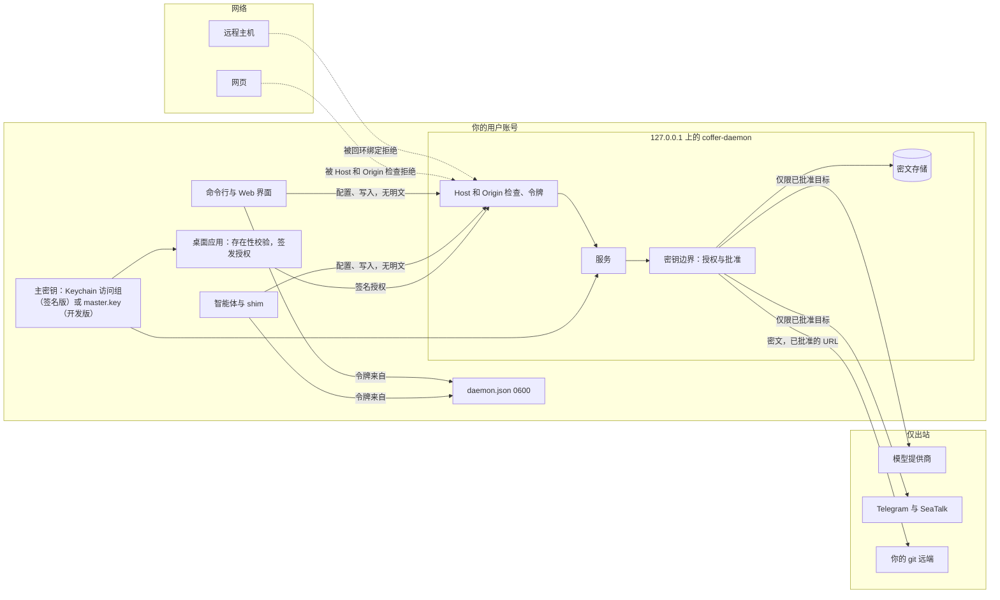

# 安全模型 {#security-model}

本页先说明 Coffer 防御什么、不防御什么，再逐一讲解守住防线的每个机制：密钥边界、网络边界、API 认证、密钥存储及其主密钥、出站请求、智能体身份、消息渠道、日志和同步。本页面向审查 Coffer 安全立场的工程师，以及正在决定是否把 API 密钥 交给它的人。日常如何使用这条边界——`coffer run`、批准、密钥备份——见[密钥](/zh/guides/secrets)。

## 威胁模型 {#threat-model}

Coffer 是**单台机器上的单用户工具**。只有一个所有者，没有账号、没有角色，也没有多租户。守护进程以你的身份运行，它启动的一切也是——包括它所服务的编程智能体。

### 对手 {#the-adversary}

真正要紧的情形是**一个以你的身份运行、被提示词注入的智能体**：Claude Code 或 Codex 读到了一个恶意网页、issue、README 或工具结果，从此用你的 shell 执行攻击者的指令。它能运行你能运行的任何命令，读取 `~/.coffer/daemon.json` 并用其中的令牌调用每一条管理路由，运行每一个 `coffer` 命令，改写它自己的配置，读取你拥有的任何进程的初始环境变量。这些 Coffer 都拿不走，也不打算去拿。

其次是**你浏览器里的网页**，它可以向 `127.0.0.1` 发送请求，并通过 DNS 重绑定读到响应。

不在范围内的：你自己安装的恶意程序（用户级别没有东西能阻止它），以及这台机器上的其他用户账号（回环绑定和文件权限已经把它挡在外面）。

### 边界就是密钥 {#the-boundary-is-the-secret}

因为智能体本来就几乎能做你能做的一切，Coffer 并不限制*配置*：智能体可以通过命令行、REST API 和 MCP 读取和修改 Coffer 的设置，和你完全一样。智能体正是这样帮你配置 Coffer 的。Coffer 守护的是智能体靠自己**做不到**的两件事：

1. **获知密钥的明文。** 没有任何路由、命令或 MCP 工具会返回存储的值或主密钥。明文只会交给在桌面应用前的人，并且要先为这一次操作做存在性校验。见[明文只交给在场的真人](#plaintext-reaches-only-a-present-human)。
2. **让 Coffer 把密钥发往新去处。** 密钥不必被读出来才能被偷：智能体可以注册一个 MCP 服务器，让它的环境变量引用你的 GitHub 令牌、命令却是攻击者的脚本，然后等 Coffer 把令牌送过去。所以密钥只有在你于桌面应用中批准之后，才会发往新的目的地。见[密钥发往新去处必须经你批准](#a-secret-goes-somewhere-new-only-with-your-approval)。

有三条规则让这两点名副其实：

3. **这些保护只能用同样的方式关闭**——在桌面应用中批准。任何环境变量、配置键或命令行参数都做不到。
4. **每个监听端都检查 `Host` 和 `Origin`**，堵住浏览器这条攻击途径。见[Host 和 Origin 检查](#the-host-and-origin-checks)。
5. **智能体拿到的是能力，不是密钥。** MCP 网关自己注入 HTTP 上游的请求头，所以智能体看到的是工具结果，永远看不到令牌。

这与密码管理器和智能体厂商最终采用的两步做法相同：一道智能体无法通过的真人在场闸门，以及一个代为注入密钥、让智能体永远不持有密钥的中介。

::: danger 这条边界只在签名发布版中成立
证明「有人批准了这件事」的存在性授权，是用从主密钥派生的密钥签名的，而只有签名的桌面应用才能读到那把密钥——**前提是 Coffer 发布了用 Apple Developer ID 签名的二进制**。目前还没有。在那之前，每个构建都是开发构建：主密钥就是文件 `~/.coffer/master.key`，任何以你的身份运行的进程都能读取它，因此同用户的进程可以伪造授权。**在开发构建中，密钥边界不成立。** 见[开发构建](#development-builds)。
:::

### Coffer 防御什么 {#what-coffer-defends-against}

| 威胁 | 防御 |
| --- | --- |
| 智能体向 Coffer 索要密钥的值——通过 REST、命令行、MCP 或导出主密钥。 | 没有任何路由、命令或工具返回值或密钥。查看明文和备份密钥只存在于桌面应用中，并受存在性校验保护。 |
| 智能体让 Coffer 把已有的密钥交给它选定的程序或 URL。 | 每个目的地都在使用时检查。密钥只有在桌面应用中获批、并带有存在性授权签名后，才会发往一个没人批准过的目标。 |
| 智能体替换密钥的值（把消息渠道的机器人令牌换成攻击者的机器人）或关闭保护。 | 两者都要等同样的批准。 |
| 密钥被粘贴进会同步到 git 的技能文件、`.env` 或脚本，或者被回显进对话记录。 | 独立密钥以 `coffer://secret/<name>` 形式引用，由 `coffer run` 解析后只注入一个子进程的环境，输出中的确切值会被遮蔽。这防的是意外，而不是智能体（见下文）。 |
| 你浏览器里的网页访问守护进程——包括通过 DNS 重绑定。 | 凡是 `Host` 不是守护进程自己的回环地址和端口的请求都会被拒绝，`Origin` 不属于 Coffer 自己的请求也一样。每次管理调用还必须携带 API 令牌。浏览器界面不提供查看明文、备份或批准。 |
| 网络上的主机访问守护进程。 | 守护进程只绑定 `127.0.0.1`。操作系统在远程连接到达 Coffer 之前就拒绝了它们。 |
| 同一台机器上的其他用户账号。 | `daemon.json`、`daemon-config.json` 以及开发构建中的 `master.key` 权限都是 `0600`。 |
| 密钥通过寻常产物泄露：配置文件、日志、审计轨迹、同步远端、URL 截图。 | 密钥在静态存储中只以 Fernet 密文存在。配置里存的是引用。审计记录引用，从不记录值。同步只携带密文，而且只在你选择开启时。令牌从不放进 URL。 |
| `~/.coffer/` 的离线副本（被盗的备份、被同步的文件夹）。 | 在签名发布版中，主密钥在 Keychain 里，不在 `~/.coffer/` 里，所以副本只是没有密钥的密文。在开发构建中，只有钥匙串模式下才如此。 |
| 陌生人给你的 Telegram 或 SeaTalk 机器人发消息。 | 一个消息渠道只听从唯一一个已配对的所有者，通过一次性配对码绑定。其他人一律忽略。 |
| 提供商的基础 URL 指向内网地址。 | 提供商探测器会解析主机名，拒绝回环、私有、链路本地及类似的地址段。 |

### 仍然暴露的部分 {#what-stays-exposed}

直说出来，免得有人过度信任这条边界。每一条都是以同一用户身份运行的必然结果，界面会把它们涉及的密钥标为本地进程可读，而不是说 Coffer 在保护它们。

- **stdio MCP 服务器的环境变量。** 从环境变量读取令牌的第三方服务器，会把令牌放在它的初始环境里，任何以你身份运行的进程都能用 `ps eww` 读到——在 Claude Code 的沙箱内部以及针对启用了 hardened runtime 的二进制都实测过。Coffer 修不了不是它写的服务器。它会把这类服务器标为 "readable by other processes on this Mac"；只要上游提供 HTTP 服务器，就优先用 HTTP 服务器加网关注入请求头的方式。
- **`coffer run` 的子进程。** 解析进命令环境的独立密钥，可以被启动该命令的智能体读取：智能体是父进程，而且 `ps eww` 总能用。它也可以直接运行 `coffer run --secret X -- env`。`coffer run` 是防意外的护栏，每个独立密钥都被标为本地进程可读。
- **能操作电脑的智能体。** 被授予辅助功能或屏幕控制权限的智能体，可以点击批准或输入你的密码。存在性校验挡得住只有 shell 的智能体，挡不住能操作鼠标的智能体。
- **签名的命令行共享密钥的访问组。** 在签名发布版中，`coffer` 命令行能读到主密钥。这是可以接受的，因为命令行没有任何代码路径返回明文、密钥或授权，而 hardened runtime 阻止其他进程附加或注入 Coffer 的签名二进制。
- **绕过模式。** 处于 `bypassPermissions`、`--yolo` 或 `danger-full-access` 的智能体自身没有沙箱。上面的一切都不依赖沙箱；但上面的一切也保护不了这样的智能体在 Coffer 之外能触及的东西。Coffer 自己的聊天轮次就是这样运行智能体的（见下文）。
- **开发构建。** [开发构建](#development-builds)中的一切。

以及，和以前一样：

- **智能体自己的行为。** 聊天轮次以 `bypassPermissions` 运行 Claude Code，以 `approvalPolicy = "never"` 和 `sandbox = "danger-full-access"` 运行 Codex。Coffer 不对单次工具调用设闸：发出指令的已配对所有者就是回路中的那个人。智能体在它的工作目录里能做你能做的任何事。
- **你注册的上游 MCP 服务器。** stdio 服务器是 Coffer 以你的身份启动的程序。注册一个服务器就是信任它。
- **智能体身份冒充。** shim 报告它服务的是哪个智能体；没有任何东西对此做密码学验证（见[智能体身份](#agent-identity)）。
- **被攻破的系统钥匙串，或恶意的 Coffer 二进制。**

### 信任边界 {#trust-boundaries}



## 明文只交给在场的真人 {#plaintext-reaches-only-a-present-human}

有三种操作会放出明文，而三者都只存在于桌面应用中：**查看或复制密钥**、**写出主密钥备份**，以及**批准**一项[审批](#a-secret-goes-somewhere-new-only-with-your-approval)。每一种的运行方式相同：

1. **先做存在性校验。** 应用运行一次 LocalAuthentication 校验——Touch ID，或你的登录密码——为这一次操作使用全新的上下文，**没有复用窗口**：下一次查看还会再问。macOS 显示的提示会写明操作及其目标（"reveal the secret github/token"），所以告诉你在批准什么的是操作系统，而不是页面。取消则什么都不发送。
2. **一次性挑战。** 应用向守护进程请求一个绑定到该操作和该目标的挑战——这个引用、这项审批、这个文件夹。挑战在两分钟内过期，并在第一次使用时被消耗，无论验证是否通过。
3. **签名授权。** 应用用从主密钥派生的密钥对挑战签名，而只有 Coffer 的签名二进制才能读到主密钥。派生密钥在需要时计算，从不存储。
4. **执行操作。** 守护进程检查签名，只有验证通过才执行——把那一个值发到应用窗口、把备份写进你选定的文件夹，或应用这项批准。针对一种操作的授权不授权任何其他操作；缺失、重用、过期或伪造的授权会被拒绝，返回 `PRESENCE_GRANT_INVALID`。

在签名发布版中，智能体控制的进程读不到主密钥，因此无法签发授权。守护进程把值发给应用，而不是让应用自己解密密文：只有一条解密路径，应用也不需要访问存储。

围绕这三种操作：

- **没有其他路径返回明文。** 没有读取明文的路由，也没有 `coffer secret get --show`；`coffer secret get` 只检查是否存在。没有导出密钥的命令或路由。浏览器界面在这些操作的位置显示 **Open in Coffer app**。明文离开守护进程的另一处，是 `coffer run` 对独立密钥的解析，它限定在 `secret/` 命名空间内，已在[仍然暴露的部分](#what-stays-exposed)中说明。
- **主密钥从不经过 API。** 密钥备份由守护进程写进你选择的文件夹，文件名 `coffer-master-key.cfk`，权限 `0600`，从不覆盖已有文件；响应只携带路径和指纹。文件里存的是用一把密钥加密后的主密钥，这把密钥由 scrypt 从你在应用中输入的口令（至少八个字符）派生，所以就算副本落到共享位置，没有口令也打不开。口令从页面经过 shell 进入守护进程的请求，从不存储、记日志或审计；出于同样原因，校验失败的日志也不带提交的值。
- **每一次放出都会审计：** 查看记为 `secret_revealed`，只带引用；备份记为 `master_key_exported`；批准记为 `secret_approval_approved`。
- **写入保持开放，但有两个例外。** 任何界面都可以存储资源的密钥：能提供值的人本来就有它。新的独立密钥（`secret/<name>`）以及已在使用的密钥的新值，会以加密形式暂存，直到你在桌面应用中批准，因为一旦存下，它们就会到达 `coffer run` 的子进程，或者一个为旧值批准过的目的地。

## 密钥发往新去处必须经你批准 {#a-secret-goes-somewhere-new-only-with-your-approval}

**目的地**是 Coffer 发送密钥明文的地方。每个目的地都有一个**目标**：实际接收这个值的东西，写成人能判断的形式。

| 目的地 | 目标 |
| --- | --- |
| stdio MCP 服务器的环境变量 | 完整命令行、它的工作目录和非密钥的环境变量——`NODE_OPTIONS=--require …` 会改变进程的行为 |
| HTTP MCP 服务器的请求头 | 服务器的 URL |
| Telegram 消息渠道的机器人令牌 | 该 Telegram 机器人 |
| SeaTalk 消息渠道的 app secret | 该 SeaTalk app id |
| 同步远端的推送令牌 | git URL |

提供商连接的密钥也按它的基础 URL 走同样的检查：本地模型代理和 Coffer 自己的引擎只会为已批准的 URL 拿到它，替换正在使用的密钥同样要等批准。自定义工具的认证会在自定义工具构建时加入；新的目的地类型会在引入它的那次改动里加进这张表。

每个消费方都在使用时、解析密钥之前询问边界——启动服务器、启动消息渠道适配器、推送一轮同步。已为当前目标批准的密钥会被注入。否则什么都不注入，这次尝试以 `SECRET_BINDING_PENDING` 失败，并为每个目标记录一项待批准；更新的目标会取代旧目标的审批。因为检查发生在使用时，绕过 Coffer 做的改动——手工编辑的保险库文件、另一台机器同步进来的服务器——会在关键的地方被拦下。

有两种情况无需人来批准绑定：

- **为它提供了值。** 一个从未发送到任何地方、不是独立密钥、且在最近五分钟内存储的引用，会被立即使用。每个「添加」流程都会先存下粘贴的密钥，几秒后再引用它；很久以前存的、已经发往别处的，或者为 `coffer run` 保留的密钥，都不算新鲜。
- **保护已关闭**，而关闭保护本身就要等批准。

还有两种改动会扩大密钥的去处，同样要等批准：

- **替换正在使用的值。** 为某个已批准目的地所接收的引用、或为任何独立密钥设置新值，会以加密形式暂存，直到你批准；在此之前仍使用旧值。把消息渠道的机器人令牌换成攻击者的机器人，会把你的对话转走。
- **关闭保护**（`secrets.require_approval`）。开启则立即生效。

批准需要存在性授权。拒绝不需要——拒绝只会缩小 Coffer 做的事——并且在每个界面都能操作，包括 `coffer secret reject`。桌面应用会为每一项新的待批准弹出通知，并打开一个面板供你处理；命令行会打印 `waiting for approval in the Coffer app` 并以 `9` 退出，或者用 `--wait` 等待。见[密钥 → 批准](/zh/guides/secrets#approvals)。

边界的状态是本机专属的：它的绑定、待批准项、开关以及每个引用首次在本机存储的时间，都是 `~/.coffer/local/secret-boundary/` 下的 JSON 文件，原子写入，从不提交进保险库，也从不同步。待批准的替换值以密文形式在那里等待。

## 开发构建 {#development-builds}

这条边界建立在一个事实之上：在签名发布版中，只有 Coffer 的签名二进制能读到主密钥，所以只有桌面应用能签发授权。Coffer 目前还没有发布这样的二进制，而从源码构建的版本永远不会是。在这些**开发构建**中：

- 主密钥是文件 `~/.coffer/master.key`（或者选择开启时，是一个登录钥匙串条目），任何以你身份运行的进程都能读取；
- 这样的进程可以派生出授权密钥，伪造一次查看、一次密钥备份或一次批准；
- 所以**密钥边界不成立**。规则仍在运行——没有明文路由、有审批、`coffer run` 会遮蔽输出——仍能拦住意外，但挡不住一个处心积虑的同用户智能体。

开发构建会如实说明。守护进程会报告自己是开发构建，桌面应用会在每个存在性提示的标题上写 "Development build"。如果开发机上没有 LocalAuthentication，应用会退回到在自己窗口里弹出确认对话框——绝不会退回到不做校验。

只有在用 Coffer 的 Developer ID 签名、启用 hardened runtime 并完成公证、主密钥位于只有这些二进制能读取的 Keychain 访问组中的发布版里，这条边界才成立。

## 回环绑定 {#loopback-binding}

守护进程只绑定 `127.0.0.1`（[`infrastructure/daemon/port_alloc.py`](https://github.com/wyx-sg/Coffer/blob/main/backend/coffer/infrastructure/daemon/port_alloc.py)）。交给 Uvicorn 的是一个预先绑定好的 socket，而不是主机和端口，所以下游的任何东西都无法扩大绑定范围。Coffer 还监听另一个 socket：[本地模型代理](/zh/architecture/model-proxy)——守护进程的兄弟进程——只绑定 `127.0.0.1:8001`（`daemon-config.json` 中的 `proxy_port`），并运行它自己的 Host 和 Origin 检查（见[下文](#the-model-proxy-listener)）。除此之外没有别的监听：Telegram 在守护进程内部长轮询，每个 SeaTalk 消息渠道持有一条出站 websocket 连接。没有哪个消息渠道需要公网 URL、隧道或入站端口。

## Host 和 Origin 检查 {#the-host-and-origin-checks}

绑定回环能挡住远程主机，挡不住浏览器，因为你打开的任何页面都能向 `127.0.0.1` 发请求。Coffer 在任何路由看到请求之前，对每个请求运行两项检查。它们覆盖 REST API、`/mcp` 端点、`/api/v1/events` 事件流、websocket、状态探针和对外提供的 Web 界面。守护进程只有一个监听端，所有接口都在上面，所以不存在绕过检查通往守护进程的路径。这遵循了 MCP 规范，规范要求 HTTP 服务器必须在每个连接上校验 `Origin`。同样的漏洞曾导致 MCP Inspector 的 CVE-2025-49596、Ollama 的 CVE-2024-28224 以及 Tailscale 的 TS-2022-004/005。

### Host：DNS 重绑定 {#host-dns-rebinding}

假设攻击者控制了 `evil.example`，并把它的 DNS 名称重新指向 `127.0.0.1`。对浏览器来说，页面仍然与 `evil.example` 同源，所以 CORS 根本不起作用，页面能读到响应体。守护进程会把 API 令牌放进 Web 界面的 `index.html`（见下文），所以从那个页面发一次 `fetch("/")` 就能拿到令牌，随之拿到 API 能做的一切：修改 Coffer 的配置、注册服务器、刷爆你的提供商账单。

DNS 重绑定不会改变 `Host` 请求头。一个重绑定的请求仍然写着 `Host: evil.example:8000`。所以守护进程只在 `Host` 指明 `127.0.0.1`、`localhost` 或 `[::1]`，**并且**端口就是请求到达的那个端口时才接受请求。其他一律拒绝，包括没有 `Host` 的请求，以及回环名字配上其他端口的请求：

```text
HTTP/1.1 403 Forbidden
{"error": {"code": "HOST_NOT_ALLOWED", "message": "Coffer only answers requests addressed to 127.0.0.1:8000 or localhost:8000; this one named evil.example:8000.", "details": null}}
```

### Origin：来自其他站点的请求 {#origin-requests-from-other-sites}

其他站点的页面虽然读不到响应，仍然可以向正确的地址*发送*请求：表单提交、`EventSource`，或者 `no-cors` 模式的 `fetch`。令牌本来就会让这类请求失败。Origin 检查让它们在不依赖令牌的情况下失败。带有 `Origin` 请求头的请求，只有当来源属于 Coffer 自己时才能通过：

| Origin | 何时允许 |
| --- | --- |
| `http://127.0.0.1:<port>`、`http://localhost:<port>`、`http://[::1]:<port>` | 始终允许。这是守护进程提供、在浏览器标签页中打开的 Web 界面。 |
| `tauri://localhost`、`http://tauri.localhost` | 默认允许。这是桌面应用，它从自己的来源加载界面。 |
| `http://localhost:5173`、`http://127.0.0.1:5173` | 仅在设置 `COFFER_DEV_CORS=1` 时。这是 Vite 开发服务器。 |
| `COFFER_CORS_ORIGINS` 中列出的任何来源 | 仅在设置了该变量时。该列表会替换桌面应用和 Vite 的条目。 |

其他所有来源，包括 `null`，都得到 `403 ORIGIN_NOT_ALLOWED`。检查发生在路由运行之前，所以即使请求带着正确的令牌也照样生效。

**没有** `Origin` 的请求会继续进入令牌检查。命令行、shim、智能体的 MCP 客户端和 `curl` 都是这样发请求的。只有浏览器会发送 `Origin`，而非浏览器客户端反正可以在那里填任何东西。

守护进程对每个不同的被拒 `Host` 或 `Origin` 只记一次日志，事件为 `http.request_refused`。一个循环重试的页面刷不爆日志。

### 允许开发用的来源 {#allowing-a-development-origin}

只有当你自己提供界面、而不是从守护进程或桌面应用打开它时，才需要这个。

- **5173 端口上的 Vite 开发服务器。** 用 `COFFER_DEV_CORS=1` 启动守护进程。`make dev` 会替你这么做。
- **其他任何来源**，比如在空闲端口上的 Vite：在启动守护进程之前，把 `COFFER_CORS_ORIGINS` 设为逗号分隔的确切来源列表，例如 `COFFER_CORS_ORIGINS=http://localhost:5174,http://127.0.0.1:5174`。该列表会替换桌面应用和 Vite 的条目，所以如果你仍需要它们，也要一并写上。守护进程自己的来源始终允许。

两个变量都在守护进程启动时读取，改了之后要重启它。绝不要把你不掌控的站点放进列表：列出的来源上的任何页面都能调用守护进程。

`COFFER_ALLOWED_HOSTS`（逗号分隔的主机名，或 `*`）会增加 Host 检查接受的名字。它从不放宽 Origin 检查。后端测试套件会设置它，因为它用虚构的主机名在进程内驱动应用。真实安装不需要它。

### 模型代理的监听端 {#the-model-proxy-listener}

[本地模型代理](/zh/architecture/model-proxy)是 Coffer 的第二个监听端，它在做任何事之前先运行自己的检查（[`infrastructure/model_proxy/app.py`](https://github.com/wyx-sg/Coffer/blob/main/backend/coffer/infrastructure/model_proxy/app.py)）。这些检查比守护进程的更严格。`Host` 不是请求到达端口上的回环名字的请求得到 403，而且 `COFFER_ALLOWED_HOSTS` 在这里不适用。**任何**带 `Origin` 请求头的请求也得到 403，因为没有浏览器页面是代理的客户端。只有在这之后，模型路由才检查智能体的本地代理令牌。守护进程的控制路由由另一个来自 `~/.coffer/proxy.json` 的控制令牌把守。

## API 令牌 {#the-api-token}

### 生成与存储 {#minting-and-storage}

每次启动时，守护进程用 `secrets.token_urlsafe(32)`（256 位）生成一个新令牌，并连同 pid 和端口一起写进 `~/.coffer/daemon.json`。文件先用 `mkstemp` 暂存，再原子地移到位，所以它从不以宽于 `0600` 的权限存在。令牌不会跨重启保留，不放进任何环境变量，也不写进任何智能体的配置：shim 在运行时从 `daemon.json` 读取它。

### 检查令牌 {#checking-it}

`/api/v1/*` 下的每条路由和 `/mcp` 端点都要求 `X-Coffer-Token` 请求头，并以常数时间（`hmac.compare_digest`）与守护进程进程内的令牌比较。缺失或错误的令牌得到 `401`；在守护进程发布令牌之前到达的请求得到 `503`。唯一不需要认证的 API 路由是 `GET /api/v1/daemon/status`，这是命令行和 shim 在拿到令牌之前调用的就绪探针；它返回生命周期阶段、版本、可执行文件、端口、发布渠道、功能开关、机器名和上游健康状况汇总——没有任何密钥。

`coffer daemon rotate-token`（或 `POST /api/v1/daemon/rotate-token`）会生成新令牌、重写 `daemon.json`、立即使旧令牌失效，并在审计日志中记录 `token_rotated`。

### 把令牌交给页面 {#getting-it-into-the-page}

Web 界面也需要令牌，而 URL 是错误的渠道：它会进入浏览器历史、会话恢复、截图和粘贴出去的 bug 报告。所以守护进程通过**响应体**交付它。每当它提供 `index.html`——无论是 `/`，还是经由 SPA 回退的每一条客户端路由——都会把 `window.__COFFER_TOKEN__` 作为 `<head>` 中的第一个脚本注入，其值读自令牌检查所比较的同一个进程内变量，所以页面持有的令牌不会与 API 接受的令牌偏移（[`webui.py`](https://github.com/wyx-sg/Coffer/blob/main/backend/coffer/surfaces/http/webui.py)）。

- 该文档以 `Cache-Control: no-store` 提供，不带 ETag 或 Last-Modified，所以重启后的守护进程所对应的浏览器永远不会从缓存里拿到上一个守护进程的令牌。`/assets` 下带哈希的文件照常缓存。
- 页面不持久化任何东西：守护进程重启后刷新页面，就会对新的守护进程完成认证。
- `coffer open` 不携带任何凭据。它从 `daemon.json` 读取守护进程的端口，然后在那里打开浏览器。

页面里的令牌，正是 [Host 检查](#host-dns-rebinding)必不可少的原因；两者缺一不可。

桌面壳把同一个前端作为本地资源加载，没有人提供它，所以也就没有 `index.html` 可以注入。它改为在首次渲染之前通过一个 Tauri IPC 命令提供同样的两个全局变量。开发期间，Vite 开发服务器也从 `daemon.json` 做同样的事。每种宿主都是凭据的*提供者*；无论哪种，页面读的都是同一对全局变量。

### CORS {#cors}

CORS 只授予 [Origin 表](#origin-requests-from-other-sites)中的跨源条目：默认是桌面应用的来源，你选择开启时再加上开发用来源。浏览器提供的界面与 API 同源，不需要 CORS。CORS 从不使用通配符，`allow_credentials` 始终为 false，所以不会附带任何 cookie。CORS 和 Origin 检查读的是同一份列表，因此不可能不一致。

## 密钥存储 {#the-secret-store}

### 信封加密 {#envelope-encryption}

密钥只以 **Fernet 密文**存在，每个密钥一个文件，以一个**引用**为键——比如 `github-token` 这样的名字。一个引用的密文是 `~/.coffer/vault/secret/<ref>.enc`：Fernet 令牌加一个换行符，权限 `0600`，位于 `0700` 的目录中。只属于本机的引用，比如模型代理的令牌，存在 `~/.coffer/local/secret/` 中，从不进入保险库。密文放在保险库仓库里是安全的，因为密钥不在那里；`vault/secret/` 列在仓库的 `.git/info/exclude` 中，所以在同步远端开始携带密钥之前，它甚至不会被提交。Coffer 中其余一切都只持有引用：

- MCP 服务器的配置在 `transport.secret_refs` 中把环境变量或请求头映射到引用。它的 schema 会拒绝看起来像密钥的静态 `env` 或请求头值（`Bearer …`、`ghp_…`、`github_pat_…`、`sk-…`、`xox?-…`、JWT 前缀），并提示你把它移进 `secret_refs`。
- 消息渠道的机器人令牌或 app secret、提供商的 API 密钥，以及同步远端的推送密钥，都是引用。
- **独立密钥**——不属于任何资源的密钥，比如某个技能需要的数据库密码——是 `secret/<name>` 下的引用，在文件中以 `coffer://secret/<name>` 引用，由 `coffer run` 交给命令（见[密钥](/zh/guides/secrets)）。
- 当你把智能体切换到某个提供商时，智能体会被指向回环上的[本地模型代理](/zh/architecture/model-proxy)，并用它自己的本地代理令牌认证（`coffer proxy token --agent-uid <uid>`，由 Claude Code 的 `apiKeyHelper` 和 Codex 的提供商 `auth` 命令运行）。提供商的密钥从不写进智能体的文件或环境，也没有任何路由或命令返回它：守护进程解密后交给代理，代理把它注入上游请求，只在内存中持有。

明文只在解密到被消费它的进程启动或请求头注入之间存在于内存中，而且只在[密钥边界](#a-secret-goes-somewhere-new-only-with-your-approval)批准了那个目的地之后。注册会在写入资源之前探测每个被引用的引用，所以缺失的密钥以 `SECRET_MISSING` 失败，不留下任何东西；删除仍被某个资源引用的密钥，或者被某个技能引用的独立密钥，会以 `409` 被拒绝；删除资源时会释放不再被任何剩余资源引用的密钥。

**守护进程是密钥存储的唯一所有者。** 每个界面——Web 界面、命令行、shim、桌面应用——都通过守护进程的 `/api/v1/secrets` 路由访问密钥；命令行从不在进程内触碰存储（一条导入契约禁止命令行导入密钥模块或访问钥匙串），所以每台机器上密钥恰好只有一个读取者。这些路由负责存储、列出和删除；唯一会放出值的，是桌面应用受存在性校验保护的查看，以及 `coffer run` 对独立密钥的解析。

### 主密钥 {#the-master-key}

唯一不是密文的密钥，是 Fernet 主密钥，由 [`MasterKeyManager`](https://github.com/wyx-sg/Coffer/blob/main/backend/coffer/infrastructure/secret/master_key.py) 在一个存储端口之后管理。它用哪种存储由构建方式决定，从不由设置或环境变量决定：

| 构建 | 密钥存放位置 | 能防 `~/.coffer/` 的离线副本吗？ | 能防同用户进程吗？ |
| --- | --- | --- | --- |
| 签名发布版 | 一个数据保护 Keychain 条目（service 为 `coffer`，account 为 `master-key`），位于仅限 Coffer Team ID 的访问组中，不带存在性标志 | 能 | 能——任何其他二进制都无权访问，也没有可点的 "Always Allow" 对话框 |
| 开发版，`file`（默认） | `~/.coffer/master.key`，权限 `0600` | 不能 | 不能 |
| 开发版，`keychain`（选择开启） | 登录钥匙串，service 为 `coffer`，条目 `master-key` | 能 | 不能——任何进程都可以请求，点一次 "Always Allow" 就永久放行 |

**存在性校验管的是操作，不是密钥。** Keychain 条目不带 Touch ID 标志，所以签名的守护进程每次启动都静默读取密钥——包括崩溃后、键盘前没人时由登录服务重启——并在整个生命周期内把它留在内存中。需要人的，是放出明文或把密钥发往新去处。

**签名发布版只读它的 Keychain 条目。** 它从不查看 `master.key` 或登录钥匙串，也拒绝把密钥挪到文件中。

**在开发构建中**，你可以用**设置 → 安全**或 `coffer config set secrets.storage keychain` 在文件和钥匙串之间切换。切换**只移动密钥，从不重新加密数据**；旧副本最后删除，而且解析时优先读文件，所以一次被中断的移动总能解析到一把可用的密钥。

每种构建的启动都是失败即关闭的。守护进程在解析密钥*之前*先统计密文文件，只有在一个都没有时才创建新密钥。有密文却解析不到密钥，守护进程以 `MASTER_KEY_MISSING` 停止；钥匙串拒绝读取时，以 `SECRET_LOCKED` 停止，而不是创建第二把会遮住它的密钥。

`keyring` 只被一个模块导入：[`infrastructure/secret/keyring_adapter.py`](https://github.com/wyx-sg/Coffer/blob/main/backend/coffer/infrastructure/secret/keyring_adapter.py)，如果接口层或应用层代码导入它，一条导入契约会让构建失败。

::: warning 签名发布版的 Keychain 后端尚未在真实构建上验证
访问组后端已在存储端口之后实现，并用一个假 Keychain 测试过。一个用 Developer ID 签名、以裸二进制形式在 app bundle 之外运行的 `coffer-daemon` 能否获得访问组，还需要在签名构建上证明；如果不能，守护进程将从签名的 app bundle 内部运行。在签名构建出现之前，实际运行的是上面的开发构建方案。
:::

::: tip 备份密钥
没有主密钥的 `~/.coffer` 副本得不到任何密钥，而在签名发布版中，Keychain 是密钥唯一的存放处。请在桌面应用中备份它：应用会在存在性校验之后，把一个密钥文件写进你选定的文件夹。没有任何命令或浏览器页面能导出密钥。见[密钥 → 主密钥及其备份](/zh/guides/secrets#the-master-key-and-its-backup)。
:::

## 出站请求 {#outbound-requests}

[`infrastructure/net/ssrf_guard.py`](https://github.com/wyx-sg/Coffer/blob/main/backend/coffer/infrastructure/net/ssrf_guard.py) 会解析 URL 的主机，只要解析出的任一地址是回环、私有（RFC 1918、`fc00::/7`）、链路本地、运营商级 NAT（`100.64.0.0/10`）、组播、未指定或保留地址，就拒绝它。解析失败的名字按拦截处理。

规则（[原则 → 网络默认值](/zh/architecture/principles)）是：Coffer 根据用户在表单里输入的内容、代表你去探测或获取的 URL 要经过防护，而你配置为自己端点的地址不用。有四条路径会根据输入的内容发起请求。第一条是提供商探测器（[`infrastructure/provider/introspector.py`](https://github.com/wyx-sg/Coffer/blob/main/backend/coffer/infrastructure/provider/introspector.py)），位于连接编辑器在保存任何东西之前运行的三个探测之后——`POST /api/v1/models/list-models`、`/test-connection` 和 `/detect-protocol`。每个探测在第一次请求之前检查基础 URL。有两种情况跳过检查：

- 协议本来就是本地的连接（`ollama`）从不检查，因为它的 URL 就是回环。
- `detect-protocol` 会把回环主机（`localhost`、`127.0.0.1`、`::1`、`0.0.0.0`、`host.docker.internal`）直接归类为 `ollama`，不发送任何请求。

[自定义工具](/zh/guides/custom-tools)的 OpenAPI 导入是第二条：在导入表单里输入的规格 URL 会在获取之前检查，它返回的每一次重定向也会检查（`infrastructure/mcp/openapi_fetch.py`，上限 5 MiB、20 秒）。位于私有主机上的规格改为以文件形式导入。

第三条是 MCP 服务器页面对一个尚未添加的服务器所做的测试（`POST /api/v1/resources/mcp_server/test-config`）：HTTP 服务器输入的 URL 会在测试连接之前检查，而 MCP SDK 只在该 URL 自己的源内跟随重定向，所以测试不会被引到防护没见过的主机上。位于私有或回环地址上的服务器，在添加之后再测试。同一个测试只在测试期间启动 stdio 服务器，放在它自己的进程组里，测试结束时整个进程组一起停止；并且不向它放出任何存储的密钥——只有为这次测试在表单里输入的值，而这些值会从 stderr 行和返回的消息中脱敏。

第四条是自定义工具页面对一个尚未保存的分组中的请求所做的测试（`POST /api/v1/custom-tools/test`）：输入的基础 URL 在发送请求之前检查，请求不跟随任何重定向，也不发送任何存储的密钥，因为该分组还没有已批准的绑定。位于私有主机上的分组在保存后再测试；保存之后，它的请求就属于下面所说的已配置端点。

所以，对位于私有或链路本地地址上的非 Ollama 端点的探测会被拒绝。保存和使用连接不是探测，防护也不作用于你配置为自己的端点：

- **HTTP 传输的 MCP 服务器**，URL 是你注册的——它们通常就跑在你自己的机器或网络上。
- **已保存的自定义工具分组**，基础 URL 是你配置的。它们的请求不跟随任何重定向，所以认证请求头只会发往那个基础 URL。
- **Coffer 自己的模型调用**和**语音转写**，发往你配置的提供商。
- **Telegram 和 SeaTalk**，即 IM 平台自己的主机，包括它们返回的媒体 URL。
- **保险库同步**，它是针对你配置的远端运行的 `git` 子进程。
- **技能的 Git 仓库**，同样是针对你输入的 URL 运行的 `git` 子进程，运行时不弹任何提示，只允许 `https`、`http`、`ssh`、`git` 和 `file` 传输，不拉子模块；公司自己的 Git 主机通常位于私有地址上（见[技能](/zh/architecture/skills#git-repositories)）。

有一个出站请求发往的是 Coffer 自己选定的地址，而不是你输入或配置的，因此不受防护：**每日价格表刷新**（[`infrastructure/usage/price_refresh.py`](https://github.com/wyx-sg/Coffer/blob/main/backend/coffer/infrastructure/usage/price_refresh.py)）。守护进程启动后不久一次，之后每 24 小时一次，它向 pydantic/genai-prices 发布的文件 `https://raw.githubusercontent.com/pydantic/genai-prices/refs/heads/main/prices/new_data/v2/data.json` 发送一个只读 `GET`，超时 10 秒，上限 16 MiB，不跟随重定向，不带凭据，也不带任何关于你或你用量的信息。响应在缓存之前会先校验，计算请求费用时从不临时去查价格。在防火墙后面的机器上，可以用设置 › 通用中的**刷新模型价格**（`coffer config set prices.refresh off`）关掉它；之后 Coffer 按构建中附带的价格表计价。

防护在校验时解析 DNS，HTTP 客户端在连接时会再解析一次，所以在两次之间重新指向的主机可能溜过去。把解析出的地址一路钉到客户端会破坏 TLS 证书校验；对于一个 URL 由你自己输入的单用户守护进程，这个残余风险是可以接受的。

## Coffer 为技能依赖运行的命令 {#commands-coffer-runs-for-skill-requirements}

技能可以声明它需要的命令行工具（见[技能依赖](/zh/architecture/skill-requirements)），而检查这些依赖会在你的机器上运行两样东西：`<command> --version`，以及技能的登录检查。两者都限定在技能指定的那个命令上——一个在你的 `PATH` 上查找的裸名字，以及第一个词必须是同一个命令的登录检查——并以 argv 方式运行，从不经过 shell，`stdin` 关闭，带超时。登录检查的输出不读直接丢弃，所以它打印出的账号名或令牌从不会被捕获、记日志或显示；只看退出码。Coffer 不运行任何安装程序或登录命令：安装以提示词的形式交给你的智能体（[智能体交接](/zh/architecture/skill-requirements#the-agent-hand-off)），提示词会要求它在做任何需要 `sudo` 的事之前先问你，并把登录留给你。

## 智能体身份 {#agent-identity}

Coffer 把它的 MCP 条目装进某个智能体时，写入的是 `coffer-mcp-shim --agent-uid <uid>`。shim 把这个 uid 作为 `_meta["coffer/agent-uid"]` 标记在 MCP 握手上，网关用它做两件事：

1. **生效范围。** 每个有范围的资源都用 `is_active(scope, agent_uid)` 过滤。没有身份的会话——你手工配置的 shim——只匹配没有范围限制的资源，所以它看到的只会更少，绝不会更多。发送基于名字的键的旧版 shim 会被当作身份不明；没有任何回退能让一个过期的标签去匹配范围。
2. **归属。** 每次内置工具调用都带一个 `agent` 参数指明调用者，`coffer__write` 这类工具会把它记录下来。网关**总是**根据握手身份设置它（解析为智能体当前的名字）：客户端提供的值会被无条件丢弃，没有身份时这个参数干脆不存在。没有哪个内置工具对外声明这个参数，所以模型无从填写。

身份是由一个以你身份运行的进程自己报告的。它不是抵御恶意本地进程的安全边界——任何这样的进程本来就持有令牌——规格也如实这么说，而不是暗示更强的隔离。

## 消息渠道与所有者配对 {#channels-and-owner-pairing}

消息渠道是你机器之外的人唯一能让智能体行动的接口，所以它恰好有一道闸门：**所有者配对**。

- 你在消息渠道的页面上或用 `coffer channel` 生成配对码。配对码是 8 个字符，取自没有易混字符的字母表（没有 `0`、`O`、`1`、`I`），一次性使用，有效期一小时，猜错 10 次即作废，并且只存在于内存中——守护进程重启就会丢失。
- 你用自己的账号把配对码发给机器人（或者点开带有它的启动链接）。这会把你的平台身份绑定为该消息渠道的所有者，并在审计日志中记录 `channel_paired`。
- 从此消息渠道只听从发送者是所有者的消息。在群里，其他人对机器人说话会收到一行拒绝；在已配对的聊天里，其他成员的消息会被静默忽略，也无法重新配对该消息渠道；未配对的私聊除了出示配对码什么都做不了。如果在群里无法确定发送者身份，消息会被拒绝，绝不会被假定为所有者的消息。
- 消息渠道的**反向范围**限制了它到底能驱动哪些智能体，范围为空的消息渠道不会启动。

消息渠道的密钥都是引用，在适配器启动时从密钥存储中解析。

## 哪些内容会进入日志和审计 {#what-goes-into-logs-and-audit}

- **日志**（`~/.coffer/logs/`，每行一个 JSON 对象）记录事件、标识符和错误。没有任何代码路径会记录密钥值、令牌或解密后的密钥。
- **审计**记录每一次生命周期变更及其操作者。密钥事件（`secret_set`、`secret_revealed`、`secret_deleted`、`secret_migrated`、`secret_resolved`、`secret_imported` 以及 `secret_approval_*` 事件）只记录**引用**、密钥的名字或目的地。资源配置先经过该类型的 `audit_redactor`——MCP 类型会整个剥掉 `transport.env` 和 `transport.headers`——所以即使把值粘贴进了错误的字段，它也到不了 `audit_log`。主密钥事件（`master_key_relocated`、`master_key_exported`、`master_key_imported`）只记录事件发生过，不记录密钥。
- **同步历史**存储远端的提交和错误，推送密钥已被脱敏去除。

## 同步只携带密文 {#sync-carries-ciphertext-only}

保险库同步在你拥有的 git 远端上拉取和推送保险库仓库。在你配置远端之前它是关闭的，它的安全性取决于什么会传出去、什么不会：

- **只有你选择开启，密钥才会传输**（`coffer sync remote set --with-secret`，或**包含加密密钥**），而且只以 Fernet 密文形式，即 `secret/<ref>.enc` 文件。在那之前，`secret/` 被排除在仓库之外。落进仓库的内容单独无法解密，而已经推送的密文无法撤回：要吊销一个密钥，就得轮换它。`local/secret/` 中的本机专属密文从不传输。
- **主密钥从不随数据传输。** 你自己在机器之间携带它：桌面应用在一台机器上经过存在性校验后写出一份受口令保护的密钥备份，`coffer sync key import` 或**设置 › 安全 › 导入主密钥**把它装到另一台机器上，`coffer sync key fingerprint` 让你比较两边。导入一把不同的密钥之前，会先把现有密钥保留为备份——开发构建中是带时间戳的 `master.key.bak-*` 文件，签名发布版中是第二个 Keychain 条目——因为它可能是唯一能解密现有密文的密钥。
- **推送令牌只发往它被批准的 URL。** 把它指向新的远端 URL 要等批准，和任何新目的地一样。
- **没有匹配密钥的机器**会报告那些它持有密文却无法解密的引用，**机器**标签页会标出密钥指纹不同的机器，而不是静默失败。
- **密钥边界留在本机。** 它的绑定、审批和开关在 `local/secret-boundary/` 中，从不进入保险库，所以另一台机器无法替这台机器预先批准一个目的地。
- **生效范围不传输。** 哪些资源被启用、对哪些智能体启用，由每台机器自己决定，所以另一台机器的一轮同步永远无法扩大这台机器暴露的范围。
- **删除受到保护。** 一轮同步如果会在任一方向上丢失 20 个文件或某个区域 20% 以上的内容，就会停下来等你答复。
- **冲突的密文从不展示给你。** 同一个引用的两份密文按令牌中明文携带的加密时间排序，较新的胜出；而且密钥在 `coffer vault` 中没有可读的历史，也无法恢复。

完整协议见[保险库同步](/zh/architecture/vault-sync)。

## 权衡与备选方案 {#trade-offs-and-alternatives}

- **以令牌权限范围作为边界**——修改用管理员令牌，网关用按智能体划分的令牌。否决：`coffer` 命令行以你的身份运行，所以能运行它的智能体就持有管理员令牌，而注册 MCP 服务器就是运行一个命令，智能体本来就能用自己的 shell 做到。它守住了「谁能改配置」，却把「密钥能去哪里」留空了。按智能体划分的令牌对归属仍有用，但不作为边界。
- **在每个智能体的配置里对 `~/.coffer` 设置禁止读取的规则。** 否决：智能体本来就该去那里读知识和记忆，而一旦那里既没有明文也没有密钥，这条规则就什么都不保护。在绕过模式下它也毫无作用。
- **在命令行上提供明文，配合 Touch ID 复用窗口**（密码管理器命令行的模式）。否决：复用窗口是送给下一个行动者的礼物——从那个终端启动的智能体会继承会话——而且值会落在智能体可能正在读取的终端里。
- **给主密钥本身加存在性标志。** 否决：守护进程每次启动都会弹提示，在无人值守的崩溃重启后还会以锁定状态运行。存在性校验应该放在放出明文的操作上。
- **让守护进程以单独的系统用户运行。** 否决：这要给一个单用户工具做一个带权限分离的安装程序，而上游服务器仍然以你的身份运行，它们的环境变量又回到了可被读取的范围。
- **每个密钥各自作为一个 Keychain 条目。** 否决：保险库同步就无法在你的机器之间携带密文了，而访问组中的一把密钥已经足以让复制出去的存储毫无用处。
- **默认用文件存主密钥、可选开启钥匙串**（开发构建的方案）。只保留给开发构建：对于未签名、频繁重建的二进制，macOS 每次重建都会重新弹提示，只有 Team ID 签名才能消除。
- **从口令派生的密钥。** 不作为默认方案：每次守护进程启动都要输口令，而忘记口令就会丢失所有密钥。
- **让 API 令牌跨重启保留。** 否决：一个能解锁密钥端点、长期存在于磁盘上的令牌，比每个进程一个的令牌更糟。
- **把令牌放进 URL。** 否决：URL 会泄露到历史记录、截图和 bug 报告里；响应体不会。
- **只依赖回环绑定。** 否决：这正是 DNS 重绑定钻的空子。
- **为智能体的每次工具调用弹批准提示。** 没有做：每条指令本来就来自已配对的所有者，逐个工具的提示只会重复确认所有者已经要求的事。只有在密钥要去新地方时才会请求批准。

## 在代码中的位置 {#where-it-lives-in-the-code}

| 路径 | 内容 |
| --- | --- |
| [`surfaces/http/auth.py`](https://github.com/wyx-sg/Coffer/blob/main/backend/coffer/surfaces/http/auth.py) | 令牌检查。 |
| [`surfaces/http/host_guard.py`](https://github.com/wyx-sg/Coffer/blob/main/backend/coffer/surfaces/http/host_guard.py) | `Host` 和 `Origin` 检查。 |
| [`surfaces/http/cors.py`](https://github.com/wyx-sg/Coffer/blob/main/backend/coffer/surfaces/http/cors.py)、[`middleware.py`](https://github.com/wyx-sg/Coffer/blob/main/backend/coffer/surfaces/http/middleware.py) | CORS 白名单和中间件顺序。 |
| [`surfaces/http/webui.py`](https://github.com/wyx-sg/Coffer/blob/main/backend/coffer/surfaces/http/webui.py) | 提供注入了令牌的界面。 |
| [`infrastructure/daemon/bootstrap.py`](https://github.com/wyx-sg/Coffer/blob/main/backend/coffer/infrastructure/daemon/bootstrap.py)、[`atomic_write.py`](https://github.com/wyx-sg/Coffer/blob/main/backend/coffer/infrastructure/daemon/atomic_write.py) | 令牌生成、`daemon.json`、`0600` 写入。 |
| [`infrastructure/secret/`](https://github.com/wyx-sg/Coffer/tree/main/backend/coffer/infrastructure/secret) | 加密存储、主密钥及其存储后端、keyring 适配器、绑定与审批存储、明文扫描。 |
| [`application/secret/`](https://github.com/wyx-sg/Coffer/tree/main/backend/coffer/application/secret) | 密钥边界（目的地、绑定、审批）、存在性授权、受保护的解析器。 |
| [`surfaces/http/secret_boundary_routes.py`](https://github.com/wyx-sg/Coffer/blob/main/backend/coffer/surfaces/http/secret_boundary_routes.py) | 受存在性校验保护的查看和密钥备份、审批、`coffer run` 的解析、扫描和导入。 |
| [`surfaces/cli/run_cmd.py`](https://github.com/wyx-sg/Coffer/blob/main/backend/coffer/surfaces/cli/run_cmd.py) | `coffer run` 及其输出遮蔽。 |
| [`desktop/src/`](https://github.com/wyx-sg/Coffer/tree/main/desktop/src) | 桌面应用的存在性校验、授权签名和审批通知。 |
| [`infrastructure/net/ssrf_guard.py`](https://github.com/wyx-sg/Coffer/blob/main/backend/coffer/infrastructure/net/ssrf_guard.py) | SSRF 防护。 |
| [`application/mcp/gateway_parsing.py`](https://github.com/wyx-sg/Coffer/blob/main/backend/coffer/application/mcp/gateway_parsing.py)、[`gateway_builtin.py`](https://github.com/wyx-sg/Coffer/blob/main/backend/coffer/application/mcp/gateway_builtin.py) | 握手身份以及 `agent` 参数的覆盖。 |
| [`application/channel/pairing.py`](https://github.com/wyx-sg/Coffer/blob/main/backend/coffer/application/channel/pairing.py)、[`inbound.py`](https://github.com/wyx-sg/Coffer/blob/main/backend/coffer/application/channel/inbound.py) | 配对码和所有者闸门。 |

## 相关内容 {#related}

- [密钥指南](/zh/guides/secrets)
- [密钥存储指南](/zh/guides/secret-store)
- [安全策略](/zh/contributing/security)——如何报告漏洞。
- [Agents May Configure Coffer; Only a Present Human Sees a Secret's Plaintext or Sends It Somewhere New](https://github.com/wyx-sg/Coffer/blob/main/docs/decisions/only-a-present-human-sees-a-secret-or-sends-it-somewhere-new.md)
- [The Master Key Lives in a Keychain Access Group Only Coffer's Signed Binaries Can Read](https://github.com/wyx-sg/Coffer/blob/main/docs/decisions/master-key-lives-in-the-macos-keychain.md)
- [Standalone Secrets Are Named `coffer://secret/` References, Injected Only Into One Child Process](https://github.com/wyx-sg/Coffer/blob/main/docs/decisions/standalone-secrets-are-named-references-injected-into-one-child.md)
- [Envelope-Encrypted Credential Store](https://github.com/wyx-sg/Coffer/blob/main/docs/decisions/envelope-encrypted-credential-store.md)
- [A Per-Start Token, Handed to the Page by Whoever Hosts It, Behind a Loopback Host Guard](https://github.com/wyx-sg/Coffer/blob/main/docs/decisions/daemon-auth-and-origin-guard.md)
- [Per-Agent Resource Scope](https://github.com/wyx-sg/Coffer/blob/main/docs/decisions/per-agent-resource-scope.md)
- [Managed Agents Run With Full Permissions; Owner Pairing Is the Gate](https://github.com/wyx-sg/Coffer/blob/main/docs/decisions/managed-agents-run-with-full-permissions.md)
- 规格：[secret](https://github.com/wyx-sg/Coffer/blob/main/openspec/specs/secret/spec.md)、[desktop-app](https://github.com/wyx-sg/Coffer/blob/main/openspec/specs/desktop-app/spec.md)、[daemon](https://github.com/wyx-sg/Coffer/blob/main/openspec/specs/daemon/spec.md)、[channels](https://github.com/wyx-sg/Coffer/blob/main/openspec/specs/channels/spec.md)
