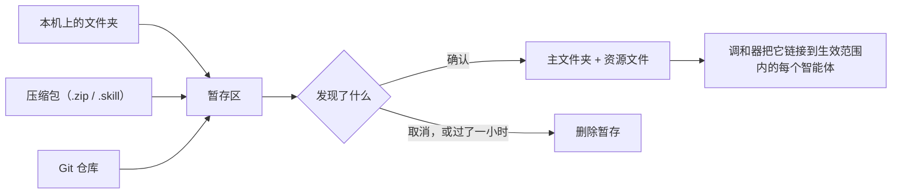

# 技能 {#skills}

技能是智能体在任务需要时加载的一个文件夹：一个写着说明的 `SKILL.md`，加上它需要的脚本和参考资料。Coffer 为每个技能保留一份主副本，并把它交给每个应该拥有它的智能体。本页讲解这套机制如何运作、为什么这样设计。使用方法见[技能指南](/zh/guides/skills)。

## 原则 {#principles}

- **一份副本，多个读者。** 每个技能只存在一处，即 `~/.coffer/vault/skills/<name>/`。智能体拿到的是指向这个文件夹的链接，从来不是它们自己的副本，所以一次编辑会同时到达所有智能体，也不会有东西悄悄分叉。
- **没看过之前什么都不信任。** 文件夹、压缩包或仓库都先读进暂存区。Coffer 说明它发现了什么，在你确认之前什么都不写。
- **来源是一枚钉子，不是一份订阅。** 从 Git 仓库导入的技能，会精确保持它所来自的那个提交时的样子。更新的提交只是一份供你审阅的提议，永远不会自动生效。
- **由技能决定谁能拿到它。** 一个智能体是否持有某个技能，取决于技能自己的开关和生效范围，与智能体上存储的任何东西无关。

## 主文件夹与交付 {#the-master-folder-and-delivery}

每个托管技能都是一个 `skill` 资源，存为 `~/.coffer/vault/resources/skill/<name>.json`，外加 `~/.coffer/vault/skills/` 下的一个文件夹。两者都在保险库仓库里，所以对任一方的每次改动都是一个有历史的提交。文件夹的名字就是技能的名字，取自它的 `SKILL.md`，技能注册后就固定下来：它既是智能体加载技能的目录，也是智能体调用它时用的名字。

交付只有一条规则：技能当且仅当已启用、且智能体在它的生效范围内时，才会到达该智能体。[调和器](/zh/architecture/reconciler)让每个智能体的技能目录始终符合这条规则。对于智能体应当持有的每个技能，它在 `<config_dir>/skills/<name>` 放一个指向主文件夹的链接——符号链接，在 Windows 上是联接，仅在 Windows 上两者都不支持的文件系统上才是副本（与主副本不一致时，修复流程会用主副本替换它）——并移除规则不再允许的链接。如果链接该在的位置被别人放了一个文件夹，它从不覆盖，而是报告出来。

因为交付的路径是一个链接，在智能体文件夹里编辑技能的人，编辑的就是主副本。编辑之后不需要重新交付。

## 历史 {#history}

主文件夹在保险库仓库里，所以技能有历史：在编辑器里或由智能体自己的文件工具做的编辑，会在文件静止一段时间后以 `disk` 身份提交，Coffer 自己的写入（导入、更新、替换）是由 `user` 写入的提交。Web 界面不在技能文件夹里写任何文件：**文件**标签页是只读的，带**在编辑器中打开**和**在访达中显示**，所以不会有保存和磁盘上的编辑赛跑。技能的**历史**标签列出该文件夹的版本，显示选中版本的 diff，并把它恢复为一次由用户写入的新提交（文件夹里的每个文件都会回去，之后新增的文件被删除），由[持久化](/zh/architecture/persistence)里描述的保险库历史路由提供。Coffer 的内置技能也有这个标签，上面写着它没有历史，因为它在每次启动时由运行中的版本重建，不存放在保险库里。见[手工编辑保险库](/zh/guides/vault-files)。

Coffer 自己的 `coffer-guide` 是例外：它由当前运行的构建渲染生成，所以放在保险库之外的 `~/.coffer/derived/skills/coffer-guide/` 下，没有历史。

## 技能从哪里来 {#where-a-skill-comes-from}

技能通过三种来源之一进入技能库。每一种都走同样的步骤：暂存、查看、确认。

**暂存。** 暂存区是系统临时空间里的一个目录，从不在 `~/.coffer` 内部，所以保险库同步看不到它，崩溃也不会在保险库里留下任何东西。守护进程会把每个暂存记住一小时；确认或取消会立即删除它。从未确认的暂存会在下一次调用时被清扫掉。

**找到技能。** 每种来源都用同一条规则：顶层有 `SKILL.md` 的文件夹就是一个技能。如果你交来的东西顶层不是技能，那么下一层中每个符合条件的文件夹都会成为候选，由你选择添加哪些。不会往下搜索两层——埋得那么深的技能通常是仓库的示例或测试夹具。每个候选都像任何导入的文件夹一样被检查（有效的 `name` 和 `description`、没有指向文件夹之外的符号链接、最多 50 MB），检查不通过的会连同原因显示出来，而不会让其他候选一起失败。

**名字已被占用**时会被拒绝，除非你选择「替换」。替换会原地更换主文件夹的内容，所以技能保留它的生效范围和已交付的链接。

### 压缩包 {#archives}

在解压任何一个字节之前，只要有条目可能写到暂存区之外（绝对路径、`..` 段），或者有条目是符号链接（它的目标是由制作压缩包的人选定的），或者它声明的大小已经超过 50 MB，整个压缩包就会被拒绝，并点名出问题的条目。声明的大小只是承诺，所以解压时还会统计实际写入的字节数，总量一超过上限就立即停止。上传本身也有同样的上限。

### Git 仓库 {#git-repositories}

Coffer 运行本机自己的 `git`，把仓库克隆到暂存区，把你给出的 ref 解析为一个提交——先按分支，再按标签，再按提交，没给时用默认分支——并且只检出你指定的那个文件夹。GitHub 文件夹地址（`…/tree/<ref>/<path>`）会被一次性解读为这三者。

Git 运行时不弹提示，也不使用来自 Coffer 的凭据。它能访问任何公开仓库；如果本机的 git 已经持有某个私有仓库的凭据——凭据助手或 SSH 密钥——也能访问那个私有仓库，因为 Coffer 保留用户自己的 git 配置不变。Coffer 自己不存储任何 Git 密钥。只允许 `https`、`http`、`ssh`、`git` 和 `file` 传输，不拉取子模块，不运行 Hook，耗时太久的克隆会被停止。git 打印的任何消息，在显示之前都会去掉 URL 中的密钥。带用户名或密码的 URL 会被直接拒绝，因为来源 URL 会存进保险库、技能自己的元数据和 API 响应。

仓库地址不经过 [SSRF 防护](/zh/architecture/security#outbound-requests)：它是你自己指定的端点，由 `git` 子进程获取，方式与保险库同步远端相同，而公司自己的 Git 主机通常位于防护会拒绝的私有地址上。

## 固定在一个提交上 {#pinned-to-a-commit}

从仓库添加的技能会记录它的来源：URL、你请求的 ref、仓库内的文件夹、它被复制时的完整提交，以及该文件夹在该提交时的**内容哈希**。哈希覆盖每个文件的路径和字节，但不包括 Coffer 自己的记账文件。把主文件夹的哈希与固定的哈希比较，Coffer 就能知道你在固定之后是否编辑过这个技能，而不需要一直保留旧提交的检出。

固定信息随技能通过保险库同步到达你的其他机器；技能的文件也一起过去，所以每台机器持有的都是同样的固定内容。

## 检查更新 {#checking-for-updates}

Coffer 会在你要求时检查每个从 Git 导入的技能是否有更新的提交，也会按这台机器的计划自动检查（默认每六小时；**设置 › 通用 › 检查技能更新**还提供每天、每周或仅在要求时，保存在 `~/.coffer/daemon-config.json`，不同步）。检查会再次克隆到暂存区、解析 ref，并统计自固定以来改动了技能文件夹的提交数。ref 移动了但没碰到文件夹，就算是最新的。结果——何时运行、git 是否访问到了仓库以及失败时 git 的消息、ref 指向哪里、涉及多少提交和文件——保存在 `~/.coffer/local/skill-source-status.json` 中，只在本机。它是一次观察，不属于保险库，所以同步从不携带它。后台检查会跳过在所选间隔内检查过的技能，所以频繁重启的守护进程不会每次启动都去拉取每个仓库。

仓库访问不到时什么都不会改变：技能继续使用它的固定副本工作，页面上会显示 git 的消息以及上次检查成功的时间。

## 把更新交给智能体 {#handing-an-update-to-an-agent}

Coffer 自己不应用任何更新。检查发现有更新时，技能提供**交给 &lt;Agent&gt; 更新**，Web 界面在按下按钮的那一刻向守护进程要提示词（`POST /api/v1/skills/{uid}/source/handoff`），所以它从不过时。守护进程像检查那样把上游暂存下来，列出固定点到新提交之间的提交，以及固定之后主文件夹里被编辑过的文件，用所有交接共用的那个交接模块构造提示词，然后删除暂存。提示词写明主文件夹是唯一可编辑的地方、两个提交及其主题、读取上游用的仓库（不带凭据）、ref 和文件夹、本地改动（或说明没有），并请智能体在保留这些改动的前提下带入新内容，在两边冲突处询问，并给出 diff。没有更新的提交改动文件夹时，这条路由以 `SKILL_UPDATE_NOT_PENDING` 拒绝，并且不向主库或固定点写任何东西。没有更新预览，没有对比，没有跳过提交的状态，也没有应用：更新不再是 Coffer 必须点名的冲突。

记录由人来做：**我已合并**（`POST /skills/{uid}/source/merged`，带上游提交）把固定点移到那个提交，不碰主文件夹的文件，并审计 `skill_update_merged`，写明两个提交。固定点的内容哈希变成那个提交自己的内容，所以保留了本地改动的文件夹，相对它的新基准仍算被编辑过，下一次交接会恰好列出带过来的改动。只有正在等待的更新可以被记录；其他一律是 `SKILL_UPDATE_NOT_PENDING`。

## 处理自动修复不碰的情况 {#resolving-what-repair-will-not-touch}

自动修复只会把缺失或指错的链接恢复回来；它从不覆盖不是 Coffer 创建的文件夹，也从不在两个版本之间做选择。这些情况要等人来处理，每一种都有一个需要确认的答案：

- **有文件夹挡路。** 偏移报告会列出智能体链接路径上的真实文件夹，无论之前是否交付过、还是现在才需要交付。比较会把该文件夹与主副本做 diff；保留主副本会把该文件夹移到 `~/.coffer/content/backup/skills/<agent>/` 下并重新链接主副本，保留智能体的版本则会先把它的文件换进主副本。只有那一个智能体的副本会改变。
- **删除时遇到外来副本。** 只要有任何智能体的路径上放着不是 Coffer 创建的文件夹，删除技能就会被拒绝，什么都不改——否则删除要么会把它留在那里，要么会删掉别人的文件。
- **没有技能认领的文件夹。** 技能存储中没有记录的文件夹，可以原地注册，也可以移到 `~/.coffer/content/backup/skills/orphans/`；它从不被彻底删除。
- **主副本缺失。** 每次读取技能都会说明它的主文件夹是否在磁盘上，所以即使技能处于关闭状态，也能看到它的文件夹没了。页面提供一个交接，提示词会把智能体指向备份文件夹、各智能体的技能文件夹、技能的来源和保险库的 git 历史，另有**删除技能…**；Coffer 自己不恢复任何东西。

Git 技能的来源也可以更改：新的仓库、ref 和文件夹会像从 Git 添加那样被暂存，必须恰好包含一个同名的有效技能；返回会列出相对当前文件夹会新增、移除或改变的文件名（没有 diff）。确认会原子地换入文件夹，保留生效范围和链接，记录固定在新提交上的新来源，并审计为一次更新；取消暂存则什么都不变。

## 技能声明它需要什么 {#what-a-skill-says-it-needs}

`SKILL.md` 可以在 `requires` 下列出它依赖的命令——`jq`、`gh>=2.40`，或者一个包含命令和版本的映射。Coffer 每次显示技能时都从主文件夹读取这份列表，所以编辑会立刻可见，并且会把每个命令链接到命令行工具页面上它自己的页面。声明依赖不会改变交付：命令缺失的技能照样会被交付，而遵循它的智能体会在需要该命令的那一步失败。

## 相关内容 {#related}

- [技能指南](/zh/guides/skills)——添加、更新和交付技能。
- [调和器](/zh/architecture/reconciler)——让已交付链接保持正确的循环。
- [资源框架](/zh/architecture/resource-framework)——所有类型共享的身份、生效范围和审计。
- [安全模型](/zh/architecture/security)——出站请求以及防护覆盖的范围。
- 规格：[skill-manager](https://github.com/wyx-sg/Coffer/blob/main/openspec/specs/skill-manager/spec.md)
