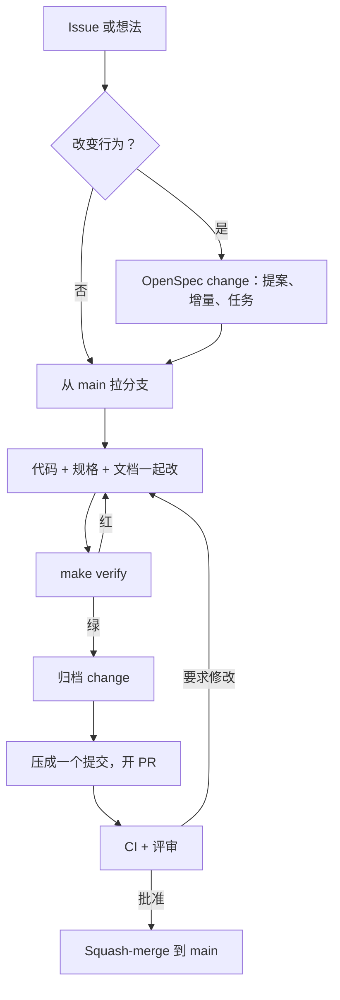

# 参与贡献 {#contributing}

这一部分写给所有想修改 Coffer 的人：修 bug、加功能、改进文档或者评审 pull request。它对人类贡献者和在仓库里工作的 AI 编程智能体同样适用。本页解释项目如何运作、一个改动要走怎样的路径，后面几页讲细节。

| 页面 | 什么时候读 |
| --- | --- |
| [开发环境搭建](/zh/contributing/development) | 克隆、安装，从源码运行守护进程和 Web 界面，而且不碰你自己的保险库 |
| [规格驱动的工作流](/zh/contributing/spec-workflow) | 修改行为：编写或更新一个 OpenSpec change，引用需求，撰写决策记录（ADR） |
| [测试](/zh/contributing/testing) | 选对测试层级，给验收场景打标记，弄懂 `make verify` 跑的每一道门禁 |
| [前端](/zh/contributing/frontend) | 改动 `frontend/src`：API 客户端、query key、设计系统、i18n |
| [安全策略](/zh/contributing/security) | 报告漏洞，或者检查一个改动是否遵守安全不变量 |

## 项目如何运作 {#how-the-project-runs}

Coffer 是一个单人维护、采用 MIT 许可证的项目，在 [github.com/wyx-sg/Coffer](https://github.com/wyx-sg/Coffer) 公开开发。几乎每一次贡献都受下面五条规则约束。

### 规格就是契约 {#specs-are-the-contract}

产品契约放在 [`openspec/specs/`](https://github.com/wyx-sg/Coffer/tree/main/openspec/specs)，用 [OpenSpec](https://github.com/Fission-AI/OpenSpec) 编写。规格不是跟在代码后面补的文档。它规定代码必须做什么；两者不一致时，错的是代码。改变外部可见行为的 pull request 要带一个 OpenSpec change，说明改完之后什么会成立。这个 change 在同一个 pull request 里归档进 `openspec/specs/`，所以 `main` 上的规格永远描述的是 `main` 上的代码。见[规格驱动的工作流](/zh/contributing/spec-workflow)。

长期不变的约束位于规格之上一层，在[原则](/zh/architecture/principles)里：本地优先、只绑定回环地址、密钥只以密文存在、分层架构。任何两处来源不一致时，以原则为准。

### 默认用 AI 辅助开发 {#ai-assisted-development-is-the-default}

Coffer 的大部分代码是用 AI 编程智能体写的，主要是 Claude Code 和 Codex。仓库为此做了专门的设置：

- [`AGENTS.md`](https://github.com/wyx-sg/Coffer/blob/main/AGENTS.md) 是智能体在会话开始时读的操作手册。人也可以读，规则一样适用。
- [`.agents/`](https://github.com/wyx-sg/Coffer/tree/main/.agents) 每个主题一个约定文件：`workflow.md`、`openspec.md`、`stack.md`、`frontend.md`、`visual-language.md`、`testing.md` 和 `harness.md`。这一部分的页面对它们做了概括，细则请点链接看原文。
- `.claude/` 是一个签入仓库的控制层。里面有权限设置、自动格式化被编辑文件的 Hook、拦截破坏性 shell 命令的 Hook、在 `make verify` 结果过期时提交会发出警告的 Hook，以及 `/opsx:*` 这组 OpenSpec 命令。[`.agents/harness.md`](https://github.com/wyx-sg/Coffer/blob/main/.agents/harness.md) 逐一说明了它们。

当 AI 智能体对某个提交有实质性贡献时，该提交要带一个写明模型的 `Co-Authored-By` 尾注，例如 `Co-Authored-By: Claude Opus 5 <noreply@anthropic.com>`。

### 只有一条开发主线 {#one-line-of-development}

所有东西都进 `main`，发布就是给 `main` 打一个标签。还没准备好给用户的工作也进 `main`，由实验功能注册表（`backend/coffer/domain/features.py`）里的一个条目把关。这类工作在每个构建里（包括你本地的）默认都是关的，由人在设置 → 功能里为自己的机器开启（或用 `COFFER_FEATURES` 固定）。这项工作新增的每一个入口都要通过这一个条目来把关。功能准备好之后，用一个 pull request 让它转正：从注册表里删掉它，删掉所有提到它的把关代码，并把它加进同一文件里的 `GRADUATED_FEATURES`（有设置要迁移就写上映射），守护进程启动时就会把它存下的开关从 `daemon-config.json` 里删掉。若功能是被移除而不是转正，则加进 `RETIRED_FEATURES`，它还会删掉表里指明的设置。不要维护长期存在的旁支。把关机制的具体表现见[实验功能](/zh/guides/experimental-features)。

### Conventional Commits，每个 pull request 一个提交 {#conventional-commits-one-commit-per-pull-request}

提交标题和 pull request 标题遵循 [Conventional Commits 1.0](https://www.conventionalcommits.org/)。真正会拒绝提交信息的规则在 [`.commitlintrc.yaml`](https://github.com/wyx-sg/Coffer/blob/main/.commitlintrc.yaml) 里。本地的 `commit-msg` Hook（由 `make hooks` 安装）和 `pr-title` workflow 都会执行这些规则。

| 规则 | 取值 |
| --- | --- |
| 类型 | `feat`、`fix`、`docs`、`refactor`、`perf`、`test`、`build`、`ci`、`chore`、`revert` |
| 范围 | 受影响的能力或领域的名字：`mcp-gateway`、`channels`、`ui`、`ci` |
| 标题 | 祈使语气，末尾不加句号，最多 120 个字符，不限大小写 |
| 头部 | `type(scope): subject`，最多 150 个字符 |
| 正文 | 每行在 100 个字符处折行 |

```text
fix(mcp-gateway): route a tool call to the upstream that owns it

Adds a regression test for the mcp-gateway scenario
"route a tool call to the correct upstream".

Fixes #42
```

分支名使用五个前缀之一，采用 kebab case：`feature/`、`fix/`、`docs/`、`refactor/` 或 `chore/`。最后一次推送前把分支压成一个提交，并让 pull request 标题和这个提交的标题完全一致。这个标题会成为 `main` 上的 squash-merge 提交。

### 合并策略 {#the-merge-policy}

- 每个改动都通过 pull request 进入 `main`。任何人都不直接推送 `main`，也不强制推送它。
- CI 必须是绿的。红的 pull request 永远不合并，不管谁批准了它。
- pull request 以 squash-merge 方式合并，让 `main` 保持线性。
- AI 智能体开完 pull request 就停下。只有人类直接告诉它时（"merge it"、"merge PR #N"），它才会合并。"Looks good" 不是合并指令。
- `main` 上的缺陷用一个新的 pull request 修复（必要时用 `git revert`），从不改写历史。

## 一个改动的生命周期 {#the-lifecycle-of-a-change}



1. **从 issue 开始。** 比小修复更大的改动，先开一个或评论一个 [GitHub issue](https://github.com/wyx-sg/Coffer/issues)，先把方案商量好再投入精力。增加或删除一整项能力，必须得到维护者同意。
2. **编写 OpenSpec change**（如果行为有变化）。运行 `/opsx:propose`，或者手写 `openspec/changes/<change-id>/`：一份提案、规格增量、一份任务清单，评审需要时再加一份设计说明。纯重构、工具链改动或一行修复不需要 change 文件夹。
3. **从最新的 `main` 拉分支：**

   ```sh
   git checkout main && git pull --ff-only
   git checkout -b feature/<short-name>
   ```

4. **代码、规格和文档一起改。** 行为有变化时，在同一个 pull request 里更新，而不是留到后续：规格增量、OpenAPI 契约、`docs-site/architecture/` 下的架构页面、相关的决策记录、`docs-site/` 页面及其 `docs-site/zh/` 对应页，以及改动涉及的任何 `.agents/` 约定。在正确的层级加测试，并给改动覆盖的每个场景打上验收标记。
5. **运行 `make verify`**，直到变绿。如果你改动了某个对外入口（网页、HTTP 路由、CLI 或 MCP shim），还要运行 `make verify-all`。
6. **归档 change**，用 `/opsx:archive` 或 `npx openspec archive <change-id> --yes`。这会把它的增量合并进 `openspec/specs/`。
7. **压缩提交并开 pull request：**

   ```sh
   git reset --soft main && git commit      # one commit, Conventional Commits subject
   git push -u origin feature/<short-name>
   gh pr create --fill --base main
   ```

   [pull request 模板](https://github.com/wyx-sg/Coffer/blob/main/.github/PULL_REQUEST_TEMPLATE.md)会要求你写明：改了什么、为什么改、怎么测（写出覆盖的验收场景）、涉及哪些能力、UI 改动的截图，以及任何破坏性变更。

8. **回应评审。** 每次强制推送时，保持标题、正文和压缩后的提交一致。评审满意且 CI 为绿后，由维护者 squash-merge。

::: tip 让 pull request 保持小巧
每个 pull request 只做一件逻辑上的事，评审最快。如果某个功能需要先重构，就把重构单独作为一个 `refactor/` pull request 发出来。
:::

## 双语文档站 {#docs-site-in-two-languages}

本站和 README 提供英文和简体中文两种版本。仓库里的其他所有文档（`AGENTS.md`、`.agents/`、`docs/` 下的决策记录、`openspec/` 下的规格）都只有英文。

- **一个页面，两个文件。** 位于 `docs-site/<path>.md` 的英文页面，其中文对应页在 `docs-site/zh/<path>.md`。在同一个 pull request 里同时修改两者。
- **相同的标题，相同的锚点。** 中文页面保留英文页面的每一个标题，顺序相同，并把英文锚点作为显式 id 标在每个标题上，比如 `## 纳入托管 {#adopt-an-agent}`，这样无论哪种语言，链接都会落到同一个位置。翻译完一个页面后，`.venv/bin/python scripts/check_docs_locales.py --stamp-anchors docs-site/zh/<path>.md` 会替你写好这些 id。
- **链接留在各自的语言里。** 中文页面链接到 `/zh/...` 页面。
- **一份侧边栏。** 两种语言的侧边栏都由 `docs-site/.vitepress/sidebar.json` 生成，每个条目都带有英文和中文标签。
- **用应用里的词。** 使用 Web 界面使用的中文术语（`frontend/src/i18n/locales/zh.json`）：智能体、技能、知识、记忆、密钥、MCP 服务器、模型提供商、消息渠道、对话、整理。代码、命令、路径、配置键和错误码保持英文。
- **生成的页面。** `make docs-reference` 会生成两种语言的 CLI 参考。命令帮助来自 CLI 本身，所以两个页面上都是英文。
- **页面组件。** 文档站以设计画布「7 · Docs site」为准，每块画板是一种页面模板。任务的步骤用 `::: steps` … `:::` 包住其中的 `###` 标题即可编号（步骤里还要放容器时，外层用更长的围栏，如 `::::: steps`）。Markdown 写不出的图和列表是 `docs-site/.vitepress/theme/components/` 下的 Vue 组件，按文件名全局注册，页面直接写 `<ArchDiagram />`，不用 import。首页本身就是组件 `CofferHome`，截图在 `docs-site/public/overview.png`。

`scripts/check_docs_locales.py` 是 `make lint` 的一部分。当某个页面、侧边栏条目、标题锚点或链接只存在于一种语言而缺少另一种时，它会报错并给出路径。

README 遵循同样的规则：`README.md` 和 `README.zh-CN.md` 在开头互相链接，并一起修改。

## 依赖与锁文件 {#dependencies-and-the-lockfile}

`backend/pyproject.toml` 声明最低版本。`backend/uv.lock` 锁定每一个传递依赖的确切版本和哈希。CI 和发布 workflow 用 `uv sync --frozen` 安装，所以只要锁文件和 `pyproject.toml` 出现偏移，它们就会失败。添加、升级或删除 Python 依赖时，编辑 `pyproject.toml`，运行 `make lock`，然后把两个文件一起提交。永远不要手动编辑 `uv.lock`。

仓库只接收 Dependabot 的安全更新，没有例行的版本升级 pull request。要升级依赖，请手动提一个普通的 `chore(deps)` pull request。

## 许可证与行为准则 {#licence-and-conduct}

Coffer 以 [MIT 许可证](https://github.com/wyx-sg/Coffer/blob/main/LICENSE)发布。参与贡献即表示你同意你的贡献也以该许可证授权。

仓库没有单独的行为准则文档。讨论请保持技术性和礼貌，在 issue 和评审中以善意揣度他人。

## 去哪里提问 {#where-to-ask}

- **问题、bug 和提案：** [GitHub Issues](https://github.com/wyx-sg/Coffer/issues)。
- **安全问题：** 永远不要开公开 issue。请遵循[安全策略](/zh/contributing/security)。
- **某样东西是怎么工作的：** 从[架构概览](/zh/architecture/)和[决策记录](/zh/architecture/decisions)开始。它们解释了代码为什么是现在这个样子。

## 相关 {#related}

- [开发环境搭建](/zh/contributing/development)
- [规格驱动的工作流](/zh/contributing/spec-workflow)
- [设计原则](/zh/architecture/design-principles)
- [`.agents/workflow.md`](https://github.com/wyx-sg/Coffer/blob/main/.agents/workflow.md)：完整的分支、提交和合并规则
