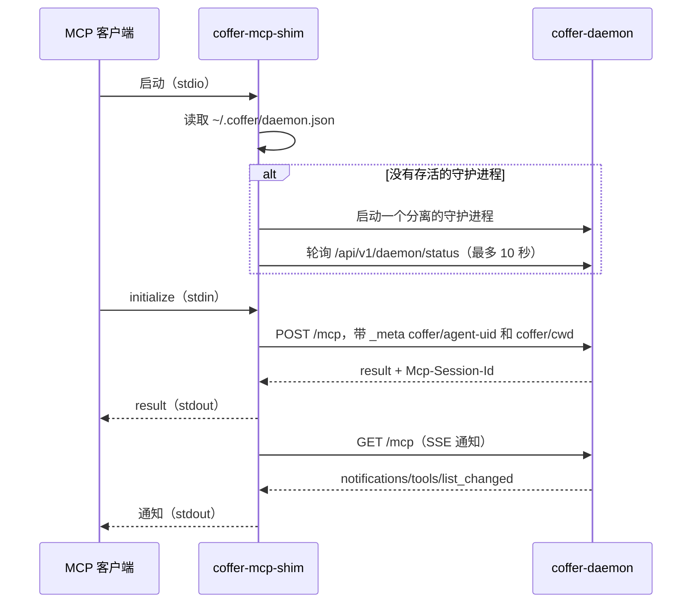

# 连接客户端 {#connect-a-client}

对 MCP 客户端来说，Coffer 表现为一个 MCP 服务器。本页讲客户端访问它的两种方式——`coffer-mcp-shim` stdio 桥和守护进程的 HTTP 端点——客户端的智能体身份如何确定，以及如何检查和修复连接。

## 两种接入方式 {#two-ways-in}

| | `coffer-mcp-shim`（stdio） | `/mcp`（HTTP） |
| --- | --- | --- |
| 客户端配置 | 一条命令 | 一个 URL 加一个令牌请求头 |
| 如何找到守护进程 | 读取 `~/.coffer/daemon.json` | 由你提供端口和令牌 |
| 守护进程没在运行时启动它 | 是 | 否 |
| 守护进程重启后仍可用 | 是——重新读取发现文件并重新握手 | 否——每次启动令牌都会变 |
| 上报智能体身份 | `--agent-uid <uid>` | 仅当客户端自己设置 `_meta` 时 |
| 推荐用于 | 所有能启动命令的客户端 | 只能走 HTTP 的客户端 |

两者都落到同一个网关：每个客户端会话都有自己的一组上游服务器进程，看到相同的带命名空间的工具（`<server>__<tool>`），并记录在同一份调用日志里。

## Claude Code 和 Codex：让 Coffer 写条目 {#claude-code-and-codex-let-coffer-write-the-entry}

对已注册的[智能体](/zh/guides/agents)，把它接入 Coffer，而不是手写条目：

打开 **智能体 →（该智能体）**，点击 **连接**。Coffer 会先显示确切的几行，由你确认。

Coffer 会写入 shim 的绝对路径和智能体的 uid：

::: code-group

```json [Claude Code: ~/.claude.json]
{
  "mcpServers": {
    "coffer": {
      "command": "/Users/you/.coffer/bin/coffer-mcp-shim",
      "args": ["--agent-uid", "9a006a32d0bf5787955c43d54e4b44e9"]
    }
  }
}
```

```toml [Codex: ~/.codex/config.toml]
[mcp_servers.coffer]
command = "/Users/you/.coffer/bin/coffer-mcp-shim"
args = ["--agent-uid", "bc0eff325c015d279faab81ce63e50b2"]
```

:::

对注册在自定义配置目录上的 Claude Code 智能体，条目会写进 `<config_dir>/.claude.json`——也就是 Claude Code 用 `CLAUDE_CONFIG_DIR` 启动时读取的文件。写入是原子的，会保留 `.bak`，并记入审计。写完后重启智能体。

通过 Coffer 安装比手写条目好，原因有二：路径是绝对的，所以从不继承 shell `PATH` 的图形界面启动的智能体也能用；`--agent-uid` 标识了智能体，所以[按智能体的生效范围](#agent-identity)会生效。shim 路径如何解析，见[智能体](/zh/guides/agents#connect-an-agent-to-coffer)。

## 其他 MCP 客户端：stdio shim {#any-other-mcp-client-the-stdio-shim}

任何能启动 stdio MCP 服务器的客户端都可以运行 shim。使用已安装二进制的绝对路径：

```json
{
  "mcpServers": {
    "coffer": {
      "command": "/Users/you/.coffer/bin/coffer-mcp-shim"
    }
  }
}
```

shim 只接受自己的一个参数 `--agent-uid <uid>`，客户端传入的其他参数一律忽略。不带 `--agent-uid` 时，会话身份不明（见下文）。要让手动配置的客户端算作已注册的智能体，加上 `"args": ["--agent-uid", "<uid>"]`，uid 取自智能体 **⋯** 菜单里的 **复制 uid**。

### shim 做了什么 {#what-the-shim-does}



- **探测或启动。** shim 读取 `~/.coffer/daemon.json`（端口和令牌，权限 `0600`），检查守护进程是否响应。如果没有，就在后台启动一个，最多等 10 秒。守护进程仍没起来时，shim 向 stderr 写入 `daemon did not come up within 10s; check ~/.coffer/logs/daemon.log`，并以退出码 3 退出。
- **桥接。** stdin 上的每一行 JSON-RPC 变成一次 `POST /mcp`；回复写回 stdout。请求并发分发，所以一次慢的工具调用不会阻塞 ping 或其他调用。服务器通知通过 `GET /mcp` SSE 流到达并写到 stdout；流断开时会带退避重连。
- **握手打标。** 在 `initialize` 上，shim 加上 `params._meta["coffer/cwd"]`（它的工作目录），传了 uid 时还会加上 `params._meta["coffer/agent-uid"]`。
- **守护进程重启。** 如果请求失败，shim 会重新读取 `daemon.json`。当那里有一个端口不同或令牌已换的存活守护进程时，它会重新绑定，重放最初的 `initialize` 以打开新会话，并把请求重试一次。客户端不会看到第二次 `initialize` 回复。`tools/call` 是例外：只有在它根本没到达旧守护进程时（连接本身失败）才会重发。已经发出后才失败的调用可能已经执行过，所以 shim 仍会重新绑定，但对这次调用回一个错误，说明它可能执行过也可能没有。
- **版本检查。** 当响应的守护进程是另一个 Coffer 版本时，shim 向 stderr 打印一条警告并继续运行：

  ```text
  coffer-mcp-shim: WARNING: attached to a Coffer daemon at version 0.1.1 (/Applications/Coffer.app/Contents/MacOS/coffer-daemon) but this coffer-mcp-shim is 0.1.2; run `coffer daemon restart` to serve the current build
  ```

- **诊断。** shim 从不往 stdout 写日志，因为那是 MCP 的传输通道。它写到 `~/.coffer/logs/shim-<pid>-<timestamp>.log`，只有需要记录时才创建。

## 其他 MCP 客户端：HTTP {#any-other-mcp-client-http}

只能走 HTTP MCP 的客户端直接连接守护进程：

| | 值 |
| --- | --- |
| URL | `http://127.0.0.1:<port>/mcp`——除非你改过，端口是 `38470`（`coffer config get daemon.port`） |
| 认证请求头 | `X-Coffer-Token: <token>`，即 `~/.coffer/daemon.json` 的 `token` 字段 |
| 会话 | 守护进程在第一次响应里返回 `Mcp-Session-Id`；之后每个请求都带上它 |
| 请求 | 通过 `POST /mcp` 发送 JSON-RPC |
| 通知 | 带 `Mcp-Session-Id` 的 `GET /mcp`，以 server-sent event 流返回 |

```sh
TOKEN=$(python3 -c 'import json,os;print(json.load(open(os.path.expanduser("~/.coffer/daemon.json")))["token"])')
curl -s http://127.0.0.1:38470/mcp \
  -H "X-Coffer-Token: $TOKEN" -H 'Content-Type: application/json' \
  -d '{"jsonrpc":"2.0","id":1,"method":"initialize","params":{"protocolVersion":"2025-06-18","capabilities":{},"clientInfo":{"name":"curl","version":"0"}}}'
```

::: warning 每次守护进程启动令牌都会变
守护进程每次启动都会生成新令牌，也可以在 **设置 → 安全 → 守护进程访问令牌** 中点 **轮换…** 按需替换它。配置了字面令牌的客户端在下次重启后就失效了。只要客户端能运行命令，就优先用 shim。
:::

守护进程只监听回环地址，并拒绝 `Host` 不是回环名的请求。请使用 `127.0.0.1` 或 `localhost`。空闲的 HTTP 会话在 30 分钟无流量后会被丢弃（用 `COFFER_MCP_SESSION_IDLE_S` 修改）。

## 智能体身份 {#agent-identity}

网关根据握手时上报的身份——`params._meta["coffer/agent-uid"]` 中智能体的 uid——决定一个会话能看到什么。这个身份在整个会话内固定，适用于每一次列表和调用。

| 会话 | 能看到 |
| --- | --- |
| 上报一个已注册智能体的 uid | 所有生效范围为全部智能体的已启用服务器，加上生效范围点名了该智能体的服务器 |
| 什么都不上报（手写条目、普通 HTTP 客户端） | 只有生效范围为全部智能体的服务器 |
| 上报一个不属于任何已注册智能体的 uid（例如智能体被移除之后） | 只有生效范围为全部智能体的服务器 |

身份不明的会话看到的总是更少，绝不会更多。调用会话生效范围之外的服务器，会得到与停用工具相同的错误（`TOOL_DISABLED`，JSON-RPC `-32000`），并记为 `denied`。基于名字的 `_meta` 键（例如 `coffer/agent`）会被忽略；只认 uid。

Coffer 自己的工具从网关获得会话身份。客户端在调用它时放入的任何 `agent` 参数都会被覆盖，所以客户端无法在每次调用时冒充别的智能体。

::: info 信任边界
身份是自报的，没有经过密码学验证。任何能读取 `~/.coffer/daemon.json` 的本地进程都能打开会话并声称任意 uid。对一个绑定在回环地址上的单用户守护进程，这是可以接受的；它不是用户之间的访问控制机制。
:::

## 验证连接 {#verify-the-connection}

1. **检查条目。** 打开 **智能体 →（该智能体）**：**连接** 一栏会说明该智能体通过一个 MCP 条目和一个钩子接入 Coffer，并给出 shim 的路径。

2. **检查守护进程。**

   ```sh
   coffer daemon status
   ```

3. **在客户端里列出工具。** 在 Claude Code 里，`/mcp` 命令会显示 `coffer` 服务器及其工具。你应该能看到 Coffer 自己的 `coffer__…` 工具，以及以 `<server>__<tool>` 形式出现的上游工具。上游工具很多时，只列出预算内的一部分；其余仍可调用，`coffer__search_tools` 能找到它们（见 [MCP 服务器](/zh/guides/mcp-servers#many-tools-tiering-and-tool-search)）。

4. **发起一次调用，并在日志里找到它。** 打开 **活动 → MCP 调用**：调用会带着服务器、工具、耗时和状态出现。`coffer log mcp --limit 5` 打印同样的行。

## 故障排查 {#troubleshooting}

| 现象 | 可能原因 | 解决 |
| --- | --- | --- |
| 客户端说 `coffer` 服务器启动失败，或 `command not found` | 条目指向的 shim 在那个路径下不存在 | 在该智能体页面再次点击 **连接**；手写条目的话，使用绝对路径 `~/.coffer/bin/coffer-mcp-shim`。 |
| shim 以退出码 3 退出 | 10 秒内无法启动守护进程 | 查看 `~/.coffer/logs/daemon.log`。常见原因是另一个进程占用了守护进程的端口；`coffer config get daemon.port` 显示它想用哪个端口。 |
| 每次调用都以 `All connection attempts failed` 失败 | shim 丢了守护进程，而且没有可达的存活守护进程 | 启动守护进程（`coffer daemon start`），然后在客户端里重启 MCP 服务器，让新的 shim 启动。 |
| 某个服务器的工具只对某一个智能体缺失 | 该服务器的生效范围排除了这个智能体，或条目没有 `--agent-uid` | 在该服务器页面检查它的 **生效范围**；在该智能体页面点击 **连接** 重写条目。 |
| 某个工具不在列表里，但按名字调用可用 | 工具分层让它没有被列出 | 使用 `coffer__search_tools`，或调高预算（见 [MCP 服务器](/zh/guides/mcp-servers#many-tools-tiering-and-tool-search)）。 |
| stderr 显示版本不匹配的警告 | 升级后旧的守护进程仍在运行 | `coffer daemon restart`。 |
| HTTP 客户端收到 `401 bad token` | 守护进程重启时令牌变了 | 从 `~/.coffer/daemon.json` 读取当前令牌，或改用 shim。 |
| 已停用的工具仍然出现 | 客户端缓存了工具列表 | 在客户端里重新加载 MCP 服务器，或重启客户端。 |

## 相关 {#related}

- [智能体](/zh/guides/agents)——注册智能体并安装条目
- [MCP 服务器](/zh/guides/mcp-servers)——网关提供什么
- [运行守护进程](/zh/guides/daemon)——端口、服务模式、重启
- [MCP 网关](/zh/architecture/mcp-gateway)——会话、路由和分层详解
- [Detect-or-spawn](https://github.com/wyx-sg/Coffer/blob/main/docs/decisions/daemon-detect-or-spawn.md)、[Session Subprocess Model](https://github.com/wyx-sg/Coffer/blob/main/docs/decisions/session-subprocess-model.md)、[Per-Agent Resource Scope](https://github.com/wyx-sg/Coffer/blob/main/docs/decisions/per-agent-resource-scope.md)
