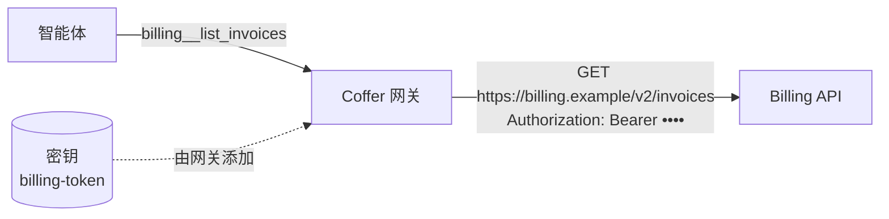

# 自定义工具 {#custom-tools}

**自定义工具**就是 Coffer 替智能体发出的一个 HTTP 请求。不需要编写或运行 MCP 服务器：你描述这个请求——方法、路径、请求头、请求体和参数——每当智能体调用该工具时，Coffer 的网关就发出它，并在发出时加上你的 API 密钥。在智能体看来，自定义工具和任何 MCP 服务器的工具完全一样。

自定义工具放在**分组**里。一个分组就是一个 API：它有一个智能体看作前缀的名字、一段说明这个 API 是做什么的描述、一套工具、一个默认生效范围，以及一个或多个**环境**——同一套工具被发往的地方，比如 `test` 和 `live`，每个都有自己的 base URL 和请求头（其中可以有引用已存储密钥的）。每个工具在调用所指定环境的 base URL 后面接上自己的路径（见[环境](#environments)）。

分组说明是写给智能体看的：这是什么 API、什么时候该用它。智能体用 `coffer__search_tools` 搜索工具时，分组里的工具既按自己的说明匹配，也按分组说明匹配；搜到的每个工具旁边都会带上分组说明。智能体的工具列表里，每个工具仍然只显示它自己的说明。



## 前提 {#prerequisites}

- 守护进程正在运行，并且至少有一个智能体已接入 Coffer（见[智能体](/zh/guides/agents#connect-an-agent-to-coffer)）。
- 如果 API 需要 key，先准备好。密钥只存在于 Coffer：分组表单里可以从[密钥页面](/zh/guides/secrets)选一个已存的密钥，也可以粘贴一个值，它会被存到那里。除了 Coffer 发出的请求本身，值从不离开密钥存储。

## 从 OpenAPI 规范添加分组 {#add-a-group-from-an-openapi-spec}

在**自定义工具**页面，选择**添加自定义工具**。先选分组：这是一个可以输入名字筛选的下拉框，默认是**新分组**。保持新分组，选**导入 OpenAPI 规范**，再点**继续**。（OpenAPI 导入总是创建新分组；已有分组只接受手动添加的请求。）

1. 给分组起名——智能体看到的工具名是 `<group>__<tool>`，分组一旦创建，名字就固定了。
2. 以 **URL** 或**文件**提供规范（JSON 或 YAML，OpenAPI 3.0 或 3.1，最大 5 MB），然后点**加载**。Coffer 会按规范的 tag 分组列出找到的每个操作。读不懂的规范会指出出错的那一行；连不上的 URL 会指出主机和原因（域名解析不了、连接被拒绝、请求超时），这样你可以检查 URL、网络、VPN 或代理，或者切到**文件**选一份本地副本。
3. 检查分组的**说明**：默认填入规范自己的描述（`info.description`），你可以改写成给智能体看的说明。
4. 勾选要变成工具的**操作**。读取类操作默认勾选；会修改数据的操作默认不勾选。**只选读取**会回到这个默认选择；筛选框可以缩短长列表。
5. 检查规范的 security scheme 填好的**请求头**（Bearer 方案会得到一个 `Authorization` 请求头）：值是一个保存密钥的已存储密钥，或者你粘贴密钥，Coffer 会随分组一起把它存进密钥页面；Bearer 方案的行默认认证方案为 **Bearer**。然后设置**可用于**：分组默认对哪些智能体生效。base URL 来自规范的 `servers`；规范没写时，表单会让你填。分组从一个名为 `default` 的环境开始，里面是这个 base URL 和这些请求头；其他环境在分组页面上添加（见[环境](#environments)）。
6. 可选地**试运行一个操作**：在任何东西创建之前，对规范的 base URL 运行一次某个已勾选的操作（见[保存前测试](#test-before-you-save)）。
7. **检查 N 个工具**会展示将要创建的分组：勾选的操作作为它的工具，每个都附上它在规范里对应的那段文本，其余标为**已跳过**。点**创建分组（N 个工具）**之前什么都不会保存。

每个操作变成一个以其 `operationId` 命名的工具——`listInvoices` 变成 `billing__list_invoices`。路径参数和查询参数变成工具参数；JSON 请求体变成一个 `body` 参数。

规范 URL 只从公网地址获取：Coffer 拒绝代你从回环、私有或链路本地地址的主机获取（见[安全 → 出站请求](/zh/architecture/security#outbound-requests)）。内部主机上的规范，请下载后以文件导入。

### 规范变化时重新导入 {#re-import-when-the-spec-changes}

通过导入创建的分组会显示它的规范和获取时间，并提供**重新导入**（分组的 **⋯** 菜单里也有）。重新导入会再读一次规范，先把所有变化作为预览展示，在 Coffer 保存了旧文本的地方还会并排给出规范改动前后的文本：要**添加**的操作——读取类操作变成工具并开启；修改数据的操作会列出但不添加——规范**改动了**的工具（新增了必填参数、路径变了），以及因为操作已不存在而要**移除**的工具。点**应用 N 项改动**之前什么都不会变。没变的工具保留它们的开关和修改数据标记；你手动添加的工具永远不会被移除，每个环境也都保持原样。从文件导入的分组会再次要求提供文件。

## 手动添加请求 {#add-a-request-by-hand}

选择**添加自定义工具**，再在下拉框里选它所属的分组（输入可筛选）：

- **已有分组**——**继续**会打开**添加请求**，使用该分组的环境及其密钥。分组自己的**添加请求**按钮（在工具表上方那一行）打开同一个表单。
- **新分组**——选**手动添加一个请求**，然后填写分组：名字、说明、base URL、请求头（认证请求头是一行，值是一个已存储的密钥，并带一个认证方案）和默认生效范围。base URL 和请求头成为分组的第一个环境 `default`。**创建分组**会进入它的第一个请求；分组和这个请求一起保存。

请求表单需要填写：

- **工具名称**——智能体看到的是 `<group>__<tool>`；添加后固定。
- **请求**——方法和一个接在环境 base URL 后面的路径模板。花括号里的空位由参数填充：`/services/{service}/deploys?env={env}`。值总是会被编码，所以它永远改不了路径或主机；参数没给出的查询对会被省略。`{env:NAME}` 则由环境的[变量](#variables)填充。
- **工具说明**——智能体读它来决定何时调用。
- **修改数据**——POST、PUT、PATCH 和 DELETE 默认开启（见[下文](#tools-that-change-data)）。
- **请求头**——分组的认证请求头从分组继承并显示；可为这个请求添加请求头，其中也可以用空位。
- **请求体模板**——用于 POST、PUT 或 PATCH，是带空位的 JSON：`{"service": {service}, "note": "rollback by {user}"}`。引号外的空位变成参数的 JSON 值；引号内的变成文本。没有模板时，路径和请求头没用到的参数会以一个 JSON 对象发送。
- **参数**——名字、类型、是否必填，以及给智能体看的描述。每个空位都必须是一个参数。参数是一份 JSON Schema，保存时会检查；`coffer_environment` 是保留名，不能用作参数（见[任何请求之前先检查参数](#arguments-are-checked-before-any-request)）。

点**添加到 `<group>`**之前什么都不会保存。保存后的工具会在分组页面的抽屉里打开，在那里编辑同样的字段（名字除外），以及它的**可用于**、一个**开关**和**删除工具**；点**保存**之前什么都不会变。

## 保存前测试 {#test-before-you-save}

每个请求表单的最后都是**测试**：为每个参数填一个示例值，然后点**运行**。分组开启了不止一个环境时，**运行**旁边的**环境**选择器决定请求发往哪里，结果会写明**在 &lt;环境&gt; 中运行**。它按表单当前的内容运行一次请求，显示状态码、耗时、大小和响应体——或者 API 的错误响应体、超时（使用分组的超时设置）、连接失败，或在 1 MiB 处截断的响应，这些也正是智能体会拿到的。401 或 403 表示 API 拒绝了密钥。不符合工具 schema 的参数会逐个字段列出，什么都不发送。不保存任何东西，也不会记为智能体的调用。

**尚未保存**的分组里的请求测试时不带密钥：已存储的密钥只会发给已保存的分组，而且要在你批准之后（见下文）。它的 base URL 是在表单里填的，所以 Coffer 只在它是能解析的公网地址时才测试；回环、私有或无法解析的主机会报告为未测试——先添加工具，再从分组里测试。

## 密钥与批准 {#secrets-and-approval}

分组的请求头是名字加值。认证请求头和别的请求头一样是一行：它的值是一个只保存 API 给你的**密钥本身**的已存储密钥，这一行还有一个**认证方案**：**Bearer**、**Token** 或 **None**。Coffer 发送 `<方案> <密钥>`，Bearer 就是 `Authorization: Bearer <key>`；选 **None**（用于 `X-Api-Key` 这类请求头）则原样发送密钥。新的 `Authorization` 行默认是 **Bearer**。为什么密钥里不存 `Bearer` 这个词，见[认证方案](/zh/guides/mcp-servers#register-an-http-server)。用这一行的 🔑 按钮选择密钥，或粘贴一个新值，它会随分组一起存进密钥页面。Coffer 在工具自己的请求头之后把每个密钥请求头加到每个请求上，所以没有工具能替换它。密钥从不出现在工具的描述或参数里，从不出现在智能体收到的内容里——响应里回显的密钥会显示为 `***`——也从不出现在任何日志里。

::: tip 密钥里已经写着 `Bearer …` 的分组照常工作
没有方案的请求头会原样发送它的密钥，所以保存着 `Bearer <key>` 的旧密钥仍然可用。要切换过去，打开分组的编辑对话框，把 `Authorization` 行的方案设为 **Bearer**，并在同一次保存里把值**替换**为原始密钥。只做其中一步，会发出 `Bearer Bearer …` 或者根本没有 `Bearer`，API 通常会回 401。
:::

把已存储的密钥发给一个分组，等于把它发到一个新地方，所以分组第一次使用它时，该密钥**会等待你在 Coffer 桌面应用里批准**（见[密钥 → 审批](/zh/guides/secrets#approvals)）。批准之前，分组显示*等待批准*，它的调用什么都不发送。每个环境都是一个独立的去处：为 `live` 批准一个密钥，对 `test` 什么都不批准；修改某个环境的 base URL 或它的某个密钥请求头，只会为这个环境再次请求批准。在密钥等待批准的环境里发出的调用会以 `SECRET_BINDING_PENDING` 失败，写明审批 id 和 `coffer approval approve <id>`，智能体可以运行这条命令把提示带到你的屏幕上；分组的其他环境照常工作。如果你拒绝了这条审批，分组会显示该密钥**已拒绝**而不是等待批准，调用以 `SECRET_BINDING_REJECTED` 失败；横幅上的**重新申请**会重新提出请求（在桌面应用里会直接弹出 Touch ID 并批准），`coffer approval ask-again <id>` 也一样。

## 环境 {#environments}

一个 API 往往有好几份——沙箱、预发布服务器、正式服务——接受同样的请求，但地址不同、密钥不同。一个分组只保留**一套工具**，把这几份列为**环境**。工具从不按环境复制：`billing__list_invoices`、它的开关和生效范围在每个环境里都一样，变的只是请求发往哪里。

分组概览里的**环境**部分每个环境一行，显示它的开关、base URL、密钥状态（**密钥已设置**、**密钥缺失**、**等待批准**、**已拒绝**或**无密钥**）和变量，每行有**编辑…**和**删除**，下方有**添加环境**。一个环境包括：

- **名称**——任意你选的名字，比如 `test`、`uat` 或 `live`；没有哪个名字是特殊的。在分组内唯一，智能体以 `coffer_environment` 传入它。重命名会保留它的审批。
- **Base URL**——它的请求发往哪里；工具的路径接在它后面。
- **请求头**——这个环境里每个请求都会带上，可以是明文，也可以是带认证方案的已存储密钥，和[密钥与批准](#secrets-and-approval)里一样。
- **变量**——见[下文](#variables)。
- **开关**——关闭的环境不能被选择；指名它的调用会被拒绝。
- **超时**——留空则使用分组的超时。

分组至少保留一个环境，所以最后一个不能删除。在环境出现之前创建的分组读出来是一个名为 `default` 的环境，base URL、请求头和已批准的密钥都和原来一样。

### 选择一次调用的环境 {#choosing-the-environment-of-a-call}

没有什么会保存一个“当前环境”，让一个智能体的选择影响另一个。每次调用都指定自己的环境：每个自定义工具列给智能体时都多一个参数 `coffer_environment`，可选值是分组里开启的环境。只开启一个环境时可以不传；开启两个或更多时必须传，不传的调用会被拒绝（`CUSTOM_TOOL_ENVIRONMENT_REQUIRED`）。分组没有的名字或已关闭的环境同样会被拒绝（`CUSTOM_TOOL_ENVIRONMENT_UNKNOWN`、`CUSTOM_TOOL_ENVIRONMENT_DISABLED`），都发生在任何请求之前。Coffer 在构建请求之前从参数里去掉 `coffer_environment`，所以 API 永远看不到它，也没有任何参数能改变环境的 base URL、请求头或密钥。同时发往不同环境的调用各自只使用自己的那一套。区域、租户或客户 id 仍是工具的普通参数。

### 变量 {#variables}

变量是环境定义的明文、非机密文本，比如 `region` = `eu-1`，工具在路径、查询、请求头或请求体里以 `{env:region}` 使用它：`GET /v1/{env:region}/items` 在一个环境里发往 `/v1/eu-1/items`，在另一个环境里发往 `/v1/us-1/items`。变量从不出现在 base URL 里，所以密钥发往的主机只由环境的 base URL 决定。看起来像凭据的值会被拒绝——请改存为密钥请求头——引用了某个开启环境没有定义的变量的工具，保存时会被拒绝。

## 修改数据的工具 {#tools-that-change-data}

每个工具都带有一个**修改数据**标记，除 GET 外的所有方法默认开启。Coffer 把它作为工具的 MCP annotations 传给智能体——只读的工具是 `readOnlyHint: true`，会写入的是 `readOnlyHint: false` 加 `destructiveHint: true`——这样每个智能体自己的审批提示都会作用于那些会改动东西的工具。对只做搜索的 POST 关掉它；对有副作用的 GET 打开它。在命令行上，它是 `coffer custom-tool tool add` 和 `tool update` 的 `--changes-data` 或 `--read-only`。

## 选择每个工具对哪些智能体生效 {#choose-which-agents-reach-each-tool}

分组和任何 MCP 服务器一样有生效范围：它头部的**生效范围**按钮（**关闭**、**所有智能体**或**指定智能体**，修改即保存）。工具自己没有生效范围：每个开启的工具对哪些智能体生效，就和它所在的分组一样。想让某个工具不对某些智能体生效——一堆无害操作里那一个危险操作——就把它关掉，或把它移到自己的分组并缩小那个分组的范围。分组上的**所有智能体**也包括以后新增的智能体，并且和所有生效范围一样只保存在本机。

每个工具还有一个开关。勾选工具（表头的复选框勾选筛选出的全部工具）后，选择栏提供**开启**、**关闭**和**暴露方式**，作用于勾选的工具。关闭的工具，或所在分组不在某个智能体生效范围内的工具，不会向那个智能体列出，调用也会被拒绝。

## 自定义工具页面 {#the-custom-tools-page}

还没有分组时，页面只展示自定义工具是怎么工作的以及两种添加方式，头部和页面里都有**添加自定义工具**。有了分组之后，列表把**需要处理**的分组放在最前——最近一次调用失败、密钥缺失、正在等待批准或审批被拒绝的分组——然后是正常的，最后是已关闭的。搜索框下方的**生效范围**可以把列表缩小到某一个智能体能用的分组（智能体的**打开自定义工具 ›** 链接会带着这个智能体跳到这里）。分组可以勾选：选择栏取代搜索框，显示“已选 N / M”以及**生效范围**、**删除**和 **×**（全选行和 **Esc** 也可清除或扩展选择），生效范围或删除一次作用于所有勾选的分组。分组页面有一个头部和两个标签页，各有自己的地址（`/custom-tools/billing`、`/custom-tools/billing/tools`），布局和 MCP 服务器页面一致：

- **头部**有三个固定按钮：**生效范围**、**编辑分组**和 **⋯**（删除分组），以及一行最近 24 小时的汇总：调用数和错误数。分组的调用失败时，头部下方的横幅提供**查看调用记录**（跳到活动页并搜索该分组名）和守护进程给出的交接，**交给 &lt;Agent&gt; ▾**；
- **概览**——分组的**定义**（分组说明、智能体看到什么，`billing__<tool>`；base URL、带密钥名字（链接到它的页面）的认证请求头、超时，以及它来自哪份规范；导入创建的分组还有**重新导入**），分组的**环境**（见[环境](#environments)），然后是 MCP 服务器概览里的那几块：**最近 24 小时**（调用数和错误数，以及每个调用方智能体的调用、错误和最近一次调用；**在活动中查看**会打开活动页并搜索该分组名）、**依赖**（分组请求头引用的每个密钥，用密钥自己的名字列出并链接到它的页面——已设置、缺失、已拒绝或等待批准——带**更换密钥…**，其中**改用其他密钥**会让那个请求头改用另一个密钥；分组不启动任何程序，所以不列 CLI）和**最常调用的工具**（最忙的四个，只读，带**在工具中查看全部 N 个**）；
- **工具**——**工具表**，上方一行有按工具名的搜索和**添加请求**——每个工具的开关、方法和路径、修改数据标记、**暴露方式**，以及它 24 小时内的调用和错误。选中一个工具会在 640 宽的抽屉里打开它的编辑器，测试结果显示在字段下方。

### 每个工具如何提供给智能体 {#how-each-tool-reaches-agents}

自定义工具列给智能体的方式和 MCP 服务器的工具一样（见[工具很多时：分层与工具搜索](/zh/guides/mcp-servers#many-tools-tiering-and-tool-search)）：工具总数超过列出额度时，最常用的工具直接列出，其余通过 `coffer__search_tools` 找到。工具标签页的**暴露方式**列逐个工具设置这一点，选项和 MCP 服务器的工具标签页相同：**自动**（由额度决定；这一行显示**自动 · 直接列出**或**自动 · 通过搜索**）、**始终列出**或**仅搜索**。这个选择随分组保存、记录在活动里，并且从分组建好那一刻就生效——不需要先有智能体列出过它。它从不决定工具能不能被调用：开启的工具始终可以按名字调用；要让智能体用不到某个工具，就把它关掉。

## 调用是怎么发出的 {#how-a-call-is-made}

智能体调用工具时，网关选出调用所指定的环境，检查参数，渲染出请求，按该环境的超时把请求发往它的 base URL（分组默认 30 秒，最多 300 秒），**不跟随重定向**——重定向会连同它的 location 返回给智能体，这样密钥永远不会被带到你没配置的主机——并最多读取 1 MiB 的响应。智能体收到 `HTTP <status> <reason>`，后面跟着响应体；400 及以上的状态码作为工具错误返回。每次调用都会连同工具、环境、时间、耗时和结果记在活动页面，从不记录参数、请求头或响应。

### 任何请求之前先检查参数 {#arguments-are-checked-before-any-request}

工具的参数是一份 JSON Schema。每次调用——智能体的、这个页面上的测试、命令行上的测试——在发出任何东西之前，都由同一个校验器按整份 schema 检查：类型（以及 OpenAPI 的 `nullable`）、`enum` 和 `const`、数值范围和 `multipleOf`、字符串长度和 `pattern`、数组元素、长度和唯一性、`required` 和 `additionalProperties`、`allOf`、`anyOf`、`oneOf`、`not`、`if`/`then`/`else` 以及本地 `$ref`。不符合的参数以 `CUSTOM_TOOL_ARGUMENTS_INVALID` 被拒绝，每个字段一条，写明路径、违反的规则和原因，API 收不到任何请求。智能体会以工具错误收到同样的列表，从而可以修正调用。本身不合法的 schema——`minimum` 写成文本、`pattern` 不是正则表达式、`$ref` 指向不存在的定义——在保存工具时就会被拒绝。缺失的密钥、等待批准的密钥，以及未知或已关闭的环境，同样在任何请求之前被拒绝。

## 在命令行上 {#from-the-command-line}

自定义工具页面上的每个操作都有一条调用同一路由的 `coffer custom-tool` 命令，所以智能体不用页面也能从头到尾配好一个分组。中间没有脚本、本地代理或 MCP 包装：命令直接和守护进程对话，网关自己调用 API。

```sh
# A group with two environments, one key per environment
coffer custom-tool group create billing --env test=https://test.billing.example --description "Invoices and payments"
coffer custom-tool env add billing live --base-url https://billing.example
coffer custom-tool env set-header billing test Authorization --secret billing-test-token --scheme Bearer
coffer custom-tool env set-var billing test region eu-1

# A tool from a JSON file (method, path, headers, body template, argument schema, changes_data)
coffer custom-tool tool add billing --data @search.json

# Who reaches it, and a test in one environment
coffer custom-tool group reach billing --agent claude-code
coffer custom-tool tool test billing search --env test --args '{"q": "x"}' --json
```

| 页面上 | 命令 |
| --- | --- |
| 列表、分组页面 | `coffer custom-tool group list`、`group show <group>` |
| **添加自定义工具** › 新分组、**编辑分组**、**⋯** › 删除分组 | `coffer custom-tool group create`、`group update`、`group delete` |
| 分组的开关、**生效范围** | `coffer custom-tool group enable` / `disable`、`group reach --agent <agent>`（可重复）或 `--all` |
| **环境** | `coffer custom-tool env list`、`env add`、`env update`（`--rename`、`--base-url`、`--timeout`）、`env enable` / `disable`、`env delete` |
| 环境的请求头和变量 | `coffer custom-tool env set-header`（`--value`，或 `--secret` 加 `--scheme`）、`env unset-header`、`env set-var`、`env unset-var` |
| **添加请求**、工具抽屉、工具的开关、**删除工具** | `coffer custom-tool tool add`、`tool show`、`tool update`、`tool enable` / `disable`、`tool delete` |
| 对已保存的工具、草稿、尚未保存的分组**测试** | `coffer custom-tool tool test`、`tool test-draft`、`tool test-unsaved` |
| **导入 OpenAPI 规范** | `coffer custom-tool import read --file <spec>`，然后 `group create <group> --from-openapi <spec> --operation <op>`（可重复） |
| **重新导入** | `coffer custom-tool reimport preview <group>`、`reimport apply <group> --add <op>` |

工具的定义、请求模板和参数 schema 可以来自参数、文件（`--data @search.json`）或标准输入（`--data -`），`--set key=value` 在其上修改单个字段。每条命令都接受 `--json`。`--env` 选择测试所在的环境，开启了不止一个环境时必须给；`--args` 以 JSON 给出参数（文本、`@file` 或 `-`）。参数违反 schema 的测试以 `6` 退出，每个字段一条错误，什么都不发送；API 以错误状态码回应的测试以 `7` 退出。

让某个密钥进入等待的命令——把已存储的密钥绑定到环境的请求头，或修改环境的 base URL——会保存改动，打印审批 id 和 `next: coffer approval approve <id>`，并以 `9` 退出。运行那条命令会在桌面应用里弹出 Touch ID 或密码提示；见[密钥 → 在命令行上](/zh/guides/secrets#on-the-command-line)。[`coffer custom-tool` 参考](/zh/reference/cli/custom-tool)列出了每个选项。

## 相关 {#related}

- [MCP 服务器](/zh/guides/mcp-servers)——每个自定义工具都经过的网关。
- [密钥](/zh/guides/secrets)——存放分组使用的 API 密钥。
- [MCP 网关 → 自定义工具](/zh/architecture/mcp-gateway#custom-tools-the-http-api-transport)——这种传输如何工作。
