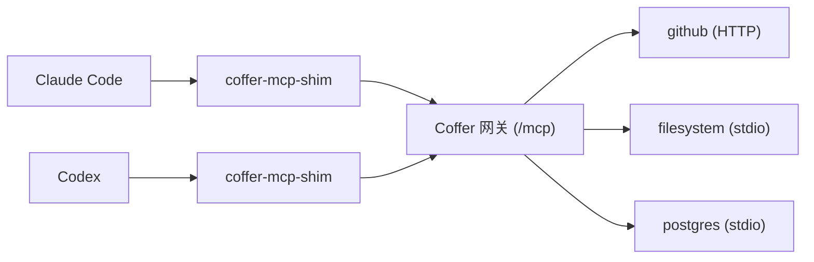

# MCP 服务器 {#mcp-servers}

Coffer 的网关把你注册的 MCP 服务器聚合起来，通过一个端点提供给每个已接入的智能体。本页讲如何注册 stdio 和 HTTP 服务器、把它们的密钥放进密钥存储、整理每个服务器暴露的内容、选择哪些智能体可以访问它，以及工具很多时网关如何表现。

## 网关做什么 {#what-the-gateway-does}

没有 Coffer 时，每个智能体都各自保存一份所有 MCP 服务器的配置和密钥。有了 Coffer，你只需注册一次服务器，每个装了 Coffer MCP 条目的智能体都能看到它：



网关会：

- 给每个上游工具和提示词加上服务器名前缀——`github__search_issues`、`filesystem__read_file`——给每个资源 URI 加上 `coffer://<server>/` 前缀，这样两个都暴露名为 `search` 的工具的服务器永远不会冲突；
- 把每次调用以工具的原名路由回它所属的服务器，并原样返回上游的结果；
- 转发工具、资源和提示词，包括 list-changed 通知；
- 记录每次调用的目标、时间、耗时和结果——从不记录参数或返回内容。

## 前提 {#prerequisites}

- 守护进程正在运行（见[运行守护进程](/zh/guides/daemon)）。
- 至少一个智能体装了 Coffer 的 MCP 条目（见[智能体](/zh/guides/agents#connect-an-agent-to-coffer)），或有其他客户端已[连接](/zh/guides/connect-a-client)。

## 注册 stdio 服务器 {#register-a-stdio-server}

stdio 服务器是一条由 Coffer 作为子进程启动的命令。

打开 **MCP 服务器**，点**添加服务器**，把服务器 README 给你的内容原样粘贴进那个输入框。它会边输入边识别：

- 一个 `mcpServers` JSON 块，或单个服务器对象——一个或多个服务器；
- Codex TOML 的 `[mcp_servers.<name>]` 表；
- 一条命令行——`claude mcp add …`、`codex mcp add …`，或普通的 `npx …` / `uvx …` / `docker run …`——会变成一个以包名命名的 stdio 服务器；
- 一个 URL，会变成一个以主机名命名的 Streamable HTTP 服务器。

例如标准 JSON：

```json
{
  "mcpServers": {
    "filesystem": {
      "command": "npx",
      "args": ["-y", "@modelcontextprotocol/server-filesystem", "/Users/you/projects"]
    }
  }
}
```

一个服务器会打开预填好的表单（名字、描述、命令和参数或 URL、环境变量或请求头、工作目录，以及对谁可用）；需要的话先**测试**（见下文），然后点**添加服务器**。多个服务器会打开**添加前检查**：每个服务器最终保留的名字（小写，其他字符转为 `-`；超过 24 个字符的名字会被标记，缩短之前不会添加）、它们的密钥，以及对所有服务器统一的一个**可用于**选项；点**添加 N 个服务器**。输入框读不懂的文本——README 里的一句话、损坏的 JSON（提示会指出行号和列号）——什么都不会添加，只留给你两个手动选项：**命令（stdio）**和 **URL（Streamable HTTP）**，它们会打开空表单。同一对话框里的**从你的智能体导入**会列出智能体自己的配置文件里已有的 MCP 服务器（见[智能体](/zh/guides/agents)）。写入任何东西之前，它会为你勾选的条目展示计划：Coffer 将添加的服务器、两个智能体里命令相同而合并为一个服务器的条目、已经在 Coffer 里的条目（只删除重复的那个条目，该智能体之后通过 Coffer 访问这个服务器），以及每个智能体配置文件里将改动的行，密钥值会隐藏。然后**导入**严格照此执行；密钥会移进钥匙串，某个条目失败时其余的照常导入，结果会说明是哪一个。每个服务器添加后会立刻测试一次；失败的会出现在**需要处理**下。

### 添加前测试 {#test-before-adding}

添加表单里的**测试**会在保存前试一下你填的内容：stdio 服务器只为这次测试启动，HTTP 服务器会被连接，列出它的工具，然后一切都停止并丢弃——不注册任何东西，也不记录任何东西。通过时显示它找到的工具、资源和提示词；失败时说明原因（找不到命令、进程以某个退出码退出、没有及时响应、URL 无法访问），并附上它在 stderr 上打印的最后几行。你填的密钥值只用于这次测试，并在展示结果中隐藏。测试在 30 秒内结束，并停止服务器启动的一切。有两件事要等服务器添加之后：已存储的密钥，只会交给你已添加并批准的服务器；以及你本机或私有网络上的 URL，测试不会去请求它。

### 内置的 `coffer` 服务器 {#the-built-in-coffer-server}

列表最后是**内置**：Coffer 自己的 `coffer` 服务器，也就是每个已接入的智能体访问 Coffer 的那一个端点，你添加的服务器的工具也经由它提供。它的页面展示端点、接入它的智能体、智能体看到的它的工具（`coffer__search_tools`），以及最近 24 小时的调用。它没有设置，不能编辑、关闭或删除。

### 完整示例：带密钥的 stdio 服务器 {#worked-example-a-stdio-server-with-a-secret}

Brave Search 服务器从环境变量 `BRAVE_API_KEY` 读取 API 密钥。在服务器的环境变量里引用它：

1. 打开 **MCP 服务器**，点**添加服务器**，把 `npx -y @modelcontextprotocol/server-brave-search` 粘贴进输入框。
2. 在环境变量里添加 `BRAVE_API_KEY` 并把 key 粘贴为它的值（这个字段提示「选择一个密钥，或粘贴新的值」，粘贴的、看起来像密钥的值会在你添加服务器时存为新密钥）。Coffer 把它存进密钥库，用生成的 ref 命名，并在 `secret_refs` 里引用。（由智能体替你存 key 时，交接提示词会让它用 `coffer secret set` 从 stdin 读取值，这样值不会进入聊天或 shell 历史。）
3. 点**测试**：服务器启动并列出它的工具。然后点**添加服务器**。

你为服务器存下、再随注册一起引用的密钥，会由这次注册批准，服务器立即生效。引用一个已经用在别处的密钥，或之后修改服务器的命令行或 URL，都会让密钥暂扣，直到你在桌面应用里批准：服务器页面会提示它在等待，在此之前 Coffer 不会启动该服务器。Coffer 还会把环境变量里带密钥的 stdio 服务器标记为「这台 Mac 上的其他进程可读」，因为任何以你的身份运行的程序都能读取进程的环境变量。见[密钥 → 审批](/zh/guides/secrets#approvals)。

存储的配置里只有引用：

```json
{
  "transport": {
    "type": "stdio",
    "command": "npx",
    "args": ["-y", "@modelcontextprotocol/server-brave-search"],
    "env": {},
    "secret_refs": { "BRAVE_API_KEY": "brave/api-key" },
    "cwd": null
  },
  "spawn_timeout_seconds": 30,
  "request_timeout_seconds": 120
}
```

Coffer 启动服务器时，会在内存里解密 `brave/api-key`，并以 `BRAVE_API_KEY` 放进子进程的环境。子进程**不**继承守护进程自己的环境：它只拿到一个最小的安全集合（例如 `PATH` 和 `HOME`）、服务器的静态 `env`，以及物化出来的密钥——别的都没有。

在 Web 界面的添加服务器对话框里，粘贴进来的环境变量或请求头，如果名字或值看起来像密钥，会提示你存进 Coffer。这样存下的值会以生成的名字进入密钥存储，并从 `secret_refs` 引用；其余的留在 `env` 里。用某一行的 🔑 按钮选一个已存的密钥，引用方式相同。

## 注册 HTTP 服务器 {#register-an-http-server}

HTTP 服务器是一个使用 streamable HTTP 传输的远程 MCP 端点。Coffer 连接它，不启动任何进程。

### 完整示例：带 bearer 令牌的 HTTP 服务器 {#worked-example-an-http-server-with-a-bearer-token}

1. 打开 **MCP 服务器**，点**添加服务器**，把 `https://api.githubcopilot.com/mcp/` 粘贴进输入框。
2. 在请求头里添加 `Authorization`，并把完整的请求头值粘贴为它的值（从字段菜单里选一个已存的密钥，或粘贴一个会存为新密钥的值），包含方案（`Bearer …`）。
3. 点**测试**，然后点**添加服务器**。

对 HTTP 服务器，每个值是密钥的请求头都会变成一个请求头：解密后的密钥作为该请求头的**完整**值发送，所以当服务器要求 `Bearer …` 形式时，就把它原样存进去。非密钥的请求头放在传输配置的 `headers` 映射里（在 Web 界面编辑配置 JSON）。

Coffer 存储的配置：

```json
{
  "transport": {
    "type": "http",
    "url": "https://api.githubcopilot.com/mcp/",
    "headers": {},
    "secret_refs": { "Authorization": "github/authorization" }
  },
  "spawn_timeout_seconds": 30,
  "request_timeout_seconds": 120
}
```

::: warning 密钥不能放在 `env` 或 `headers` 里
看起来像密钥的静态 `env` 或 `headers` 值——以 `Bearer `、`ghp_`、`gho_`、`github_pat_`、`sk-`、`xoxb-`/`xoxa-`/`xoxp-` 开头，或是 JWT——在注册时会被拒绝，提示你把它移到 `secret_refs`。`secret_refs` 条目引用了存储中没有的 ref 也会被拒绝，并指出缺失的密钥。
:::

::: info 粘贴带 `headers` 的 HTTP 服务器
**添加服务器**的粘贴框会读取 HTTP 服务器（`"url": …`）的 `headers` 对象，并像对待 `env` 一样逐个检查值是否是密钥：名字或内容看起来像密钥的值（例如 `Authorization` 请求头）会提示存进密钥存储并从 `secret_refs` 引用；其余的留在传输配置的 `headers` 里。HTTP 服务器上的 `env` 对象也会作为请求头发送；两者有同名键时，以 `headers` 的值为准。
:::

## 服务器名字和描述 {#server-names-and-descriptions}

服务器名字是由字母、数字、`.`、`_` 和 `-` 组成的标签，最多 24 个字符，在 MCP 服务器之间唯一。这个上限让客户端为每个工具显示的名字 `mcp__coffer__<server>__<tool>` 保持在模型提供商 API 接受的 64 个字符以内。名字里不能有 `__`，因为网关按第一个 `__` 拆分 `<server>__<tool>`。名字 `coffer` 保留给 Coffer 自有的工具，会被拒绝。

服务器注册后名字就固定了，因为它是智能体看到的每个工具名 `<server>__<tool>` 的前缀，而智能体的权限规则和技能会引用这些名字。修改名字的请求会以 `NAME_IMMUTABLE` 被拒绝。要换名字，就删除服务器再重新注册，这会重置它的能力开关和生效范围。这项决策记录在决策记录（ADR）「names-visible-to-agents-are-fixed」里。

服务器没有标题：名字就是每个页面和每个智能体看到的东西。名字旁边是可选的**描述**，是你自己关于这个服务器用途的备注。智能体看不到它。在添加服务器的表单里设置，之后用**编辑**修改。

每次发现之后，Coffer 会测量像 Claude Code 这样的客户端为每个工具显示的名字 `mcp__coffer__<server>__<tool>` 的长度。服务器的**工具** tab 会标记名字超过 64 个字符（模型提供商 API 接受的上限）的工具；Cursor 已经会丢掉超过 60 的工具。被标记的工具仍保持启用和列出。修复要在上游一侧（更短的工具名），或在新注册时用更短的服务器名。

## 编辑、测试、刷新和删除 {#edit-test-refresh-and-delete}

| 任务 | Web 界面 |
| --- | --- |
| 查看 | **MCP 服务器** → 该服务器 → **概览** |
| 修改描述 | **编辑** |
| 修改命令或 URL、环境变量或请求头、密钥、工作目录、超时 | **编辑** |
| 检查服务器是否响应并重新列出工具 | **测试**（失败时为**再次测试**） |
| 把缺失的启动器或故障交给智能体 | 概览提示框里的**交给 &lt;Agent&gt; ▾**（含**复制提示词**） |
| 关闭或开启整个服务器 | **⋯** → **关闭**、**开启** |
| 复制它的配置 | **⋯** → **复制配置为 JSON**（只有密钥名，从不含值） |
| 删除 | **⋯** → **删除…** |

在终端里，`coffer mcp test <name>` 做同样的检查（失败时退出码 7）；表中其余操作都在 Web 界面完成。命令行只保留程序会运行的、守护进程不可用时也必须能用的、Coffer 交接提示词让智能体运行的，以及 Web 界面做不到的命令。

**编辑**对话框显示名字（固定）、只有你能看到的描述、命令和参数或 URL，以及环境变量或请求头。每一行是键、值和删除按钮。值是明文；字段末尾的 🔑 按钮可以改为选一个已存的密钥，看起来像密钥的值会提示你存进 Coffer（“这看起来像密钥，要存进 Coffer 吗？”）。密钥只存在于 Coffer：服务器的设置里只有密钥的名字，没有值，而你粘贴的密钥会在保存服务器时存进密钥页面。命令型服务器还有可选的**工作目录**。**测试**会在你保存前试一下编辑后的配置——添加对话框里也一样——如果失败出在这台机器上（找不到命令、进程退出、连接失败或超时），当场就有**交给 &lt;Agent&gt; ▾**。保存失败时对话框保持打开并给出原因。删除密钥行时，只有当该密钥是 Coffer 为这个服务器创建的，才会删除密钥本身。保存编辑会关闭与该服务器的所有活动连接，所以任何智能体的下一次调用都会用新配置启动它。

停用服务器立即生效，已连接的会话也一样：它的工具从列表中消失，调用会以 `TOOL_DISABLED` 被拒绝并记为 `denied`，服务器所有正在运行的副本都会被停止。重新启用不需要做别的；下一次调用就会启动它。超时按服务器设置：**启动超时**（5–120 秒，默认 30）和**请求超时**（5–1800 秒，默认 120）。

删除服务器会移除它的注册和能力偏好，保留它的审计和调用历史。确认框会列出代价——有多少个工具将从哪些智能体中消失（「26 个工具将从 Claude Code 和 Codex 中消失」），并为服务器引用的每个密钥列一行，说明它仍保留在密钥中：删除服务器从不删除密钥。若删除被拒绝，对话框保持打开，并在「无法删除 `<名称>`」下给出原因。

### 健康状态与缺失的启动器 {#health-and-a-missing-launcher}

搜索框下方的**生效范围**可以把列表缩小到某一个智能体能用的服务器（智能体的 **MCP 服务器** tab 会带着这个智能体跳到这里）。列表按需要你处理的程度对服务器分组：**需要处理**（失败、缺启动器、缺密钥——各自带原因，例如 `Connection refused · since 14:02`）、**正常**、**尚未检查**和**已关闭**。打开的服务器的头部显示它的状态（有问题时图标带颜色）、一行内的传输方式和命令或 URL，以及四个固定的按钮，不会随状态改变：**生效范围**、**测试**、**编辑**和 **⋯**。修复从来不是头部按钮，而是放在说明问题的横幅里。失败服务器的横幅给出最后一个错误、从何时开始失败、哪些智能体调不了它的工具以及最后一次成功调用，附带**查看日志**（HTTP 服务器是**查看错误**）和诊断交接；缺失的启动器附带安装交接（两者见下文）；这台 Mac 上没有的密钥（在新 Mac 上恢复的保险库只带名字、不带值），附带**替换密钥**和引用它的设置项；你刚运行的测试会显示它列出的内容，stderr 点一下就能看到。横幅下面，**概览**依次叠放三个区块。**最近 24 小时**显示调用、错误，以及每个调用方智能体的调用数、错误数和最后一次调用；**在活动中查看**打开活动页，并已搜索这个服务器的名字。**依赖**列出这个服务器在这台机器上需要的东西，由它的命令和设置自动算出，不用你声明：启动器命令行工具（`uvx` 对应 `uv`；找到或没找到，链接到[命令行工具](/zh/guides/clis)页面）和它的设置引用的每个密钥，按密钥自己的名字显示（已设置、缺失或等待批准；悬停可看到承载它的设置项），**在密钥中查看**会打开已搜索该密钥的密钥列表。**调用最多的工具**是只读的，开关在**工具** tab 里。失败、关闭或缺东西的服务器会立即按已保存的开关显示它的工具，并做相应标记，而不是等它响应。注册一个上游不可达的服务器仍会成功；在它响应之前都标为失败。没有**测试连接**结果时，健康状态跟随服务器最近一次调用：无法到达服务器的调用（启动不了、连接断了或超时）算作失败，而工具返回错误则不算，因为服务器本身是正常的。被拒绝（`denied`）的调用会被忽略。

当 stdio 服务器的命令在这台机器上找不到时——例如从另一台机器导入的服务器运行 `uvx`，而这里没有 `uv`——状态显示 `missing <runner>`，列表里的行和它的页面都会这样提示（`uvx isn't found on this machine`）。启动器也会列在[命令行工具](/zh/guides/clis#launchers-your-mcp-servers-start-with)页面上提供它的命令之下（`uvx` 对应 `uv`），并把这个服务器列在**依赖方**下。Coffer 不替你安装软件，也不会猜安装命令：哪种安装方式合适取决于机器。提示框提供**交给 &lt;Agent&gt;**（它的菜单里有**复制提示词**；没有 Coffer 托管的智能体可用时只提供**复制提示词**）——一段给智能体的提示词，写明启动器、服务器、启动它的命令行（看起来像令牌的参数显示为 `<secret>`，环境变量的值从不包含在内）、Coffer 查找它的 `PATH`，以及这台机器的操作系统和架构，并要求安装成一个从图形界面启动的进程也能找到的形式，最后用 `coffer mcp test <name>` 确认。要手动处理，就把命令所属的运行时（`uvx` 对应 `uv`，`npx` 对应 Node.js，`docker` 对应 Docker）装到守护进程的 `PATH` 能找到的地方——桌面应用会把你登录 shell 的 `PATH` 交给守护进程——然后点**测试**。

HTTP 服务器对测试返回 401 或 403 时，Coffer 会记下这是密钥被拒绝；智能体自己的调用被服务器这样拒绝时也一样（无需有人点测试，Coffer 就会发现；之后服务器应答了一次调用就会清除该记录，工具返回错误结果则不算）：服务器页面会这样提示并给出**更换密钥**（打开编辑对话框并定位到其密钥），概览里则列为“Every call is rejected with 401 Unauthorized. The API key looks revoked.”，并带同样的**更换密钥**操作。失败的服务器，以及失败的**测试**，会在**查看日志**旁提供第二个交接：一段让智能体查明原因并提出修复的提示词。它包含服务器的名字、传输方式和配置摘要（命令行和工作目录，或 URL；环境变量、请求头和已存密钥的*名字*，从不含值）、最后一个错误，以及服务器在 stderr 上打印的最新 20 行，每行都清除了看起来像令牌的内容。它要求智能体不要读取或修改 Coffer 存储的密钥，并用 `coffer mcp test <name>` 验证。

stdio 服务器的 stderr 写到它自己的文件 `~/.coffer/logs/upstream/<name>.log`，而不是守护进程日志。Coffer 在启动服务器时、启动失败时（`PATH` 上找不到启动器、启动超时）以及停止它时，会在那里加上自己的行。对于 stdio 服务器，**⋯** → **服务器日志**会打开一个抽屉，里面是它的**服务器日志**，最新的在前，错误行标红，附带**复制**和**打开日志文件**，旁边是它最近 24 小时的**调用**（**全部**或**错误**，单个智能体或全部）。HTTP 服务器运行在别处，所以 Coffer 没有它自己的日志：它的**查看错误**会打开活动页，已搜索该服务器并按失败调用筛选。点一条调用会在 640 宽的抽屉里展开，显示结果、耗时和会话。

## 整理工具、资源和提示词 {#curate-tools-resources-and-prompts}

服务器暴露的每一项能力都可以单独开关。新发现的能力默认**启用**。

打开服务器，使用**工具**、**资源**和**提示词** tab（每个 tab 名带着数量）。每个 tab 会说明开启了多少，有一个只匹配名字的筛选框和**全部开启** · **全部关闭**，每一行有一个开关和它最近 24 小时的使用情况（工具的调用和错误、资源的读取、提示词的使用）。工具 tab 列出**搜索工具**的前十个匹配；展开工具行可看到它的完整描述、输入参数和智能体看到的名字，以及名字的字符数。概览列出调用最多的几个，并有**在工具中查看全部 N 个**。

停用的工具会从每个客户端下一次的 `tools/list` 中消失，调用它会以 `TOOL_DISABLED`（JSON-RPC `-32000`）失败。你的选择在守护进程重启、服务器升级以及服务器短暂消失后依然保留：Coffer 只存储偏好和该能力最后被看到的时间，能力本身则从服务器实时发现。

## 选择哪些智能体可以访问服务器 {#choose-which-agents-reach-a-server}

默认情况下，服务器对所有智能体生效。你可以把范围缩小到特定智能体——例如，让生产数据库服务器远离一个实验性的智能体。它与启用开关一起构成服务器的**生效范围**。

**MCP 服务器**里的每一行都用徽标显示它的生效范围（**已关闭**、**所有智能体**，或它对应智能体的标记）；在打开的服务器头部用**生效范围**按钮修改，或勾选多行后用选择栏里的生效范围控件。面板里有**关闭**、**所有智能体**和勾选了智能体的**指定智能体**，每次修改都会立即保存（先显示“正在应用…”，再显示“✓ 已保存”），没有保存按钮。**所有智能体**也包括以后新增的智能体。**指定智能体**一个都不选会让服务器休眠：已注册，但对谁都不生效。

网关按会话执行生效范围，依据是 shim 上报的智能体身份（见[连接客户端](/zh/guides/connect-a-client#agent-identity)）。不在服务器生效范围内的智能体看不到它的工具、资源或提示词，调用会以 `TOOL_DISABLED` 被拒绝并记为 `denied`——而同一时刻接入的另一个智能体照常使用。没有身份的会话只能看到对所有智能体生效的服务器。

生效范围按机器设置，不参与同步；你用的每台机器各自设置。**测试连接**和其他管理操作从不受生效范围限制。

## 工具很多时：分层与工具搜索 {#many-tools-tiering-and-tool-search}

列表越长，模型选工具就越不准，而且每个列出的工具在每个会话里都要占上下文。所以网关只列出上游目录里预算内的一部分：

- Coffer 自己的 `coffer__…` 工具总是列出，不计入预算。
- 上游工具**不超过 50 个**时，全部列出。
- 超过之后，网关列出最近 **90 天**调用最多的工具，并为每个服务器至少保留一个位置，这样没有哪个服务器会完全消失。同分时按目录顺序，所以目录不变时，每个会话得到的列表都一样。
- 未列出的工具**没有**被停用。它们仍能按名字调用，和以前完全一样。

`coffer__search_tools` 能找到分层漏掉的一切。智能体描述它需要什么，拿回可以直接调用的真实上游工具定义：

```json
{ "name": "coffer__search_tools", "arguments": { "query": "create a jira issue", "top_k": 5 } }
```

```json
{
  "tools": [
    { "name": "jira__create_issue", "description": "Create a new issue…", "inputSchema": { "…": "…" }, "score": 7.42 }
  ],
  "total_searched": 186
}
```

搜索用本地关键词排序器按工具名和描述对整个目录排序——不用模型、不用 embedding、不走网络。`top_k` 默认 5，上限 20。结果里不包含 Coffer 自己的工具。有工具被隐藏时，Coffer 在 `initialize` 时发送的 `instructions` 会告诉智能体使用 `coffer__search_tools`。

分层由守护进程的三个环境变量控制（修改后重启守护进程）：

| 变量 | 默认值 | 作用 |
| --- | --- | --- |
| `COFFER_TOOL_TIERING` | `auto` | `off` 会列出所有上游工具。其他任何值都保持分层开启。 |
| `COFFER_TOOL_TIERING_BUDGET` | `50` | 列出多少个上游工具。 |
| `COFFER_TOOL_TIERING_WINDOW_DAYS` | `90` | 用于给工具排序的使用量窗口。 |

格式错误的值会回退到默认值，使用量查询出任何故障都会列出全部工具。服务器页面会展示这种划分：**工具如何提供给智能体**显示**直接列出**或**大多在搜索之后**，工具 tab 把每个工具标为**直接列出**或**通过搜索**，还有一条说明写着它有多少工具被列出以及原因。想让某个工具保持列出又不改预算，就多用它：排序依据的就是使用量。想让智能体完全看不到某个工具，就停用它。

## 调用日志 {#the-invocation-log}

每次工具调用、资源读取和提示词获取都会记录时间、服务器、能力、耗时和状态——`ok`、`error`、`timeout` 或 `denied`。返回结果带 `isError` 标记的工具记为 `error`。参数和结果从不存储。条目默认保留 30 天（修改保留期见[活动与审计](/zh/guides/activity)）。

**Web 界面：** 它概览里的**最近 24 小时**区块（调用和错误，按调用方智能体）、它的**服务器日志**抽屉（stdio 服务器），或覆盖所有服务器的**活动**页面（它的搜索会匹配服务器名称，所以**在活动中查看**打开时就已经在搜索了）。

**CLI：**

```sh
coffer log mcp --server github --limit 50
coffer log mcp --status error --since 2026-09-20T00:00:00Z
coffer log mcp --json
```

不带 `--server` 时，命令读取所有服务器，包括 Coffer 自己的工具调用（显示为 `coffer`）和你之后删除的服务器（以其 uid 显示）。

## 工作原理 {#how-it-works}

每个客户端会话都有**自己的**一组上游连接。Coffer 在某个会话第一次需要时启动 stdio 服务器，会话结束时停止它，所以同时接入的两个智能体永远不会共享子进程或踩到彼此的状态。每个启动的服务器的 PID 都记录在 `~/.coffer/upstream-pids/` 下，崩溃后可以清理孤儿进程。如果服务器在调用中途崩溃，那次调用返回错误，服务器被标为不健康，下一次调用会在有限次重试内重启它。

当某个服务器在列工具时响应很慢，它的工具会被排除在那次列表之外，服务器在后台重试，恢复后网关发送 `notifications/tools/list_changed`，让客户端重新列出。

完整的请求生命周期见 [MCP 网关](/zh/architecture/mcp-gateway)。

## 相关 {#related}

- [连接客户端](/zh/guides/connect-a-client)——shim、HTTP 端点、智能体身份
- [密钥存储](/zh/guides/secret-store)——存放服务器引用的密钥
- [智能体](/zh/guides/agents#manage-the-agent-s-own-mcp-entries)——把智能体配置里已有的 MCP 条目纳入托管
- [MCP 工具参考](/zh/reference/mcp-tools)——Coffer 自己的 `coffer__…` 工具
- [Tool Overload: List a Usage-Ranked Slice, Search the Rest](https://github.com/wyx-sg/Coffer/blob/main/docs/decisions/tool-overload-tier-the-list-search-the-rest.md)、[Tool Overload: List a Usage-Ranked Slice, Search the Rest](https://github.com/wyx-sg/Coffer/blob/main/docs/decisions/tool-overload-tier-the-list-search-the-rest.md)、[Session Subprocess Model](https://github.com/wyx-sg/Coffer/blob/main/docs/decisions/session-subprocess-model.md)
- 规格：[mcp-gateway](https://github.com/wyx-sg/Coffer/blob/main/openspec/specs/mcp-gateway/spec.md)
