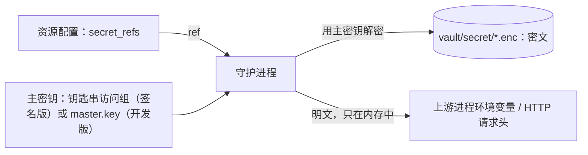

# 密钥存储 {#secret-store}

Coffer 需要的每个密钥——MCP 服务器的令牌、提供商的 API 密钥、消息渠道机器人的令牌、同步远端的推送令牌——都放在同一个加密存储里，其他地方一律按 id 引用密钥。本页介绍如何存入和引用密钥、如何轮换和删除、主密钥放在哪里，以及如何备份主密钥或把它迁到另一台机器。

没有任何命令、路由或 MCP 工具会打印已存储的值。只有在桌面应用里、通过 Touch ID 或登录密码验证之后，你才能看到一个值；密钥要发往一个从未去过的地方，也必须先由你在桌面应用里批准（智能体可以用 `coffer approval approve` 请求，它会把提示带到应用里）。这条边界、审批的工作方式，以及如何允许把独立密钥交给你用 `coffer run` 运行的命令，见[密钥](/zh/guides/secrets)。

## 密钥如何存储 {#how-secrets-are-stored}

- 每个密钥用 [Fernet](https://cryptography.io/en/latest/fernet/) 加密，以密文形式单独存成一个文件 `~/.coffer/vault/secret/<ref>.enc`（例如 `secret/<id>.enc`）（权限 `0600`），文件里只有 Fernet 令牌。令牌自带加密时间；这台机器第一次存入该 ref 的时间记录在 `~/.coffer/local/secret-boundary/times.json`。在同步远端开始携带密钥之前，保险库的 git 仓库提交时不包含 `secret/`。
- 一把**主密钥**可以解密全部密钥，而且它只存在一个地方。签名发行版把它放在一个只有 Coffer 签名二进制能读取的钥匙串条目里。开发版——所有从源码构建的版本，以及签名发行版出现之前的所有版本——把它放在文件里（`~/.coffer/master.key`，权限 `0600`，默认）或系统钥匙串里（需手动开启）。见[主密钥放在哪里](#where-the-master-key-lives)。
- 资源配置——MCP 服务器、提供商、消息渠道、同步远端——里只保存 **ref**。ref 在使用的那一刻才解析成明文：启动 MCP 服务器或发送 HTTP 请求头时，或者取用提供商的 Key 时。
- 守护进程是唯一会打开存储的进程。命令行和 Web 界面都通过守护进程的 `/api/v1/secrets` 路由写入和列出密钥；它们都碰不到主密钥，也没有任何路由会返回值。



## 存入密钥 {#store-a-secret}

每个密钥都只有一种 ref 形状：`secret/<id>`，其中 `<id>` 是 Coffer 生成的 32 位十六进制字符。ref 不由你来选。你给密钥起一个**名称**（最多 64 个字符），也可以再写一段**描述**（最多 200 个字符），两者随时都能修改：它们是保存在你保险库里、紧挨着密钥的备注，所以修改它们不会影响任何引用该密钥的地方。

```sh
# From stdin, so the value never reaches your shell history
printf '%s' "$GITHUB_TOKEN" | coffer secret set --name "GitHub token"
# stored: GitHub token
#   id:  secret/<id>
#   uri: coffer://secret/<id>

# Or at a hidden prompt
coffer secret set --name "GitHub token"
```

空值会被拒绝。`--value <secret>` 也能用，但会打印警告，因为值会留在你的 shell 历史里。`coffer secret set <已有的 ref>` 只会替换一个已存在的密钥的值；一个不存在、又不是 `secret/<id>` 的 ref 会被拒绝。

大多数时候你不用手动运行这条命令。需要填写密钥的对话框——MCP 服务器页面的 **添加服务器**、MCP 服务器 **编辑** 对话框中的密钥、**添加模型提供商**、消息渠道的令牌字段、同步远端的推送密钥——会先把粘贴的值写进存储，成为为该资源新建的一个 `secret/<id>`，再只保存这个 ref。如果随后的注册失败，刚写入的密钥会被删掉。它们的选择器也会按名称列出已存储的密钥，所以你也可以改为引用在[密钥页面](/zh/guides/secrets#the-secrets-page)上添加的那个。

## 引用密钥 {#cite-a-secret}

| 位置 | 如何引用 ref |
| --- | --- |
| stdio MCP 服务器 | **添加服务器**或**编辑**对话框里设为**密钥**的环境变量行——成为服务器进程的一个环境变量 |
| HTTP MCP 服务器 | 同样的对话框里设为**密钥**的请求头行——成为一个请求头，密钥只是凭据本身，发送时会在前面加上这一行的认证方案（Bearer、Token 或 None） |
| 纳入托管某个智能体的 MCP 条目 | 智能体 **MCP 服务器** tab 里的**纳入托管**——Coffer 把该条目当前的值存到一个新生成的 `secret/<id>` 下 |
| 模型提供商 | **添加提供商**里的 **API key** 字段 |
| 消息渠道 | 消息渠道的令牌字段（见[消息渠道](/zh/guides/channels)） |
| 同步远端 | **同步**页面上的推送密钥 |
| 你运行的命令、技能、env 文件 | `coffer://secret/<id>`，指向以 `secret/<id>` 存储的独立密钥——只有你允许后 `coffer run` 才会解析它，见[密钥](/zh/guides/secrets#allow-coffer-run-to-use-it) |

注册一个引用了存储中不存在的 ref 的资源会失败，报错里会写出缺少哪个密钥，而且什么都不会保存。

多个资源可以引用同一个 ref，但一个已经发往某处的 ref，要发往第二个地方，必须先在桌面应用里由你批准。存入一个值后在注册资源时引用它，会立即生效，因为值是你刚刚提供的。在新资源里引用一个已在使用的密钥，或者改变某个资源发送密钥的去处（stdio 服务器的命令、HTTP 服务器的 URL、同步远端的 URL），会保存改动但扣住密钥：它会等待你在桌面应用里批准。见[密钥 → 审批](/zh/guides/secrets#approvals)。

## 列出与查看 {#list-and-inspect}

```sh
coffer secret list
```

```text
                                     Secrets
┏━━━━━━━━━━━━━━━━━━━━┳━━━━━━━━━━━━━━━━━━┳━━━━━━━━━━━━━━━━━━━━━━━━━┳━━━━━━━━━━━━━━━━━━━━━━━━━━━━━┓
┃ Ref          ┃ Name         ┃ Present in store ┃ Used by                 ┃ Readable by local processes ┃
┡━━━━━━━━━━━━━━╇━━━━━━━━━━━━━━╇━━━━━━━━━━━━━━━━━━╇━━━━━━━━━━━━━━━━━━━━━━━━━╇━━━━━━━━━━━━━━━━━━━━━━━━━━━━━┩
│ secret/<id>  │ GitHub token │ yes              │ mcp_server github       │ yes                         │
│ secret/<id>  │ DeepSeek key │ no               │ provider deepseek       │ no                          │
│ secret/<id>  │ Orders DB    │ yes              │ skill coffer-database   │ yes                         │
│ secret/<id>  │ Old API      │ yes              │ (unreferenced)          │ yes                         │
└──────────────┴──────────────┴──────────────────┴─────────────────────────┴─────────────────────────────┘
```

列表显示存储中保存的每个 ref，以及每个已注册资源引用的每个 ref：

- **Name**——密钥的名称，没有则为空。
- **Present in store**——存储里是否有值。恢复一个不含密钥的保险库之后，`no` 的那些行就是需要重新设置的。
- **Used by**——引用该 ref 的资源、文件中引用了独立密钥 `coffer://secret/<id>` 的技能，以及有多少个去处在等待审批。`(unreferenced)` 表示没有任何东西在用这个密钥，可以考虑删除。
- **Readable by local processes**——以你的身份运行的其他程序，能否在 Coffer 放置该值的地方读到它：stdio MCP 服务器的环境变量，或你已允许 `coffer run` 使用的独立密钥。见[仍然暴露的部分](/zh/architecture/security#what-stays-exposed)。

它不解密任何东西，也不记入审计。`--json` 给出同样的数据，外加每个密钥的 `label`、`description` 和 `created_for`（为之创建它的资源的 uid）、各引用方所用的槽位（`cited_by`），以及每个 ref 已批准和待批准的去处。Web 界面里的[密钥页面](/zh/guides/secrets#the-secrets-page)显示同一份列表。

没有任何命令能打印出值。[密钥页面](/zh/guides/secrets#the-secrets-page)的每一行会说明值是否已存储。要查看或复制一个值，请在桌面应用的[密钥页面](/zh/guides/secrets#the-secrets-page)选择 **显示值…**，每次都会要求 Touch ID 或登录密码。在终端里，`coffer secret reveal <ref>` 发起同样的显示流程；值仍然只显示在应用里。

## 轮换密钥 {#rotate-a-secret}

在同一个 ref 下存入新值：

```sh
printf '%s' "$NEW_TOKEN" | coffer secret set secret/<id>
```

该条记录原地重新加密，创建时间保持不变。所有引用该 ref 的地方，下次解析时就会用新值——对 MCP 服务器来说，是下一个会话启动它的时候。在密钥页面上，详情里的 **编辑** 对任何密钥都能做到：填入新值并保存。

资源自己的页面也用同样的方式显示它所用的密钥：密钥的名字（链接到它在密钥页面上的页面），旁边是**更换密钥…**。**输入新值**会轮换这个值，所有使用该密钥的资源都会生效；**改用其他密钥**只让这一个资源改用另一个已存的密钥，旧密钥和它的值保持不变。

替换会立即存入，不需要批准，和任何写入一样：能提供值的人本来就拥有它。它作为一次替换被审计，从不记录值。

## 删除密钥 {#delete-a-secret}

在[密钥页面](/zh/guides/secrets#the-secrets-page)上选择该密钥 **⋯** 菜单里的 **删除…**，它会先询问。只要还有资源引用这个 ref，或者还有技能文件引用它的 `coffer://secret/<id>`，删除就会被拒绝：对仍在使用的 ref，对话框不会删除，而是按类型和当前名称列出使用它的每一项，并附上各自页面的链接。

你很少需要手动删除。你粘贴进某个资源自己对话框的密钥是为该资源创建的，删除这个资源时它也会一并删除——但前提是没有别的东西引用它：没有其他资源，也没有技能文件含有它的 `coffer://secret/<id>`。资源引用的其他所有密钥，比如你在密钥页面上添加的那个，都会保留，并显示在 **未被使用** 下。密钥的名称和描述随它一起删除。删除一个 ref 会忘掉它已批准的去处，所以之后在同一个 ref 下存入的新值会被当作一个新密钥。删除不存在的 ref 会成功，但什么都不做。

## 主密钥放在哪里 {#where-the-master-key-lives}

主密钥放在哪里，由 Coffer 的构建方式决定，而不是由某个设置决定。

| 构建 | 主密钥的位置 | 谁能读取 |
| --- | --- | --- |
| **签名发行版** | macOS 数据保护钥匙串中的一个条目，所在访问组仅限 Coffer 的 Apple Team ID | 只有 Coffer 的签名二进制。其他任何程序——智能体的脚本、`/usr/bin/security`——都拿不到访问权限，也不会弹出可以点“允许”的对话框。守护进程每次启动时静默读取。 |
| **开发版** | `~/.coffer/master.key`，权限 `0600`（默认），或系统钥匙串（需手动开启） | 以你身份运行的任何程序都能读这个文件。 |

签名发行版只读它自己的钥匙串条目：从不查看 `master.key` 或登录钥匙串。

::: warning 签名发行版目前还不存在
Coffer 目前还没有发布用 Apple Developer ID 签名的二进制，所以今天的每个构建都是开发版，主密钥放在文件里。在开发版中，[密钥边界](/zh/guides/secrets)并不成立：以你身份运行的任何进程都能读取主密钥，并伪造桌面应用的批准。桌面应用在每次在场验证的提示上都会标明“开发版”。见[安全模型 → 开发版](/zh/architecture/security#development-builds)。
:::

在开发版中，你仍然可以在文件和系统钥匙串之间选择：

| | 文件（默认） | 系统钥匙串（需手动开启） |
| --- | --- | --- |
| 位置 | `~/.coffer/master.key`，权限 `0600` | 服务 `coffer`，条目 `master-key` |
| 提示 | 无 | 每次守护进程启动时，macOS 可能会询问一次是否允许访问 |
| 能防住 | — | 在没有你的钥匙串的情况下拷走 `~/.coffer/` 的人 |

打开**设置 › 安全**的 **加密** 部分。打开 **将主密钥存入系统钥匙串**，然后在确认框里点 **移动主密钥**。

移动时，会先把主密钥写到目标位置并读回校验，然后才删除原位置，所以中途被打断的话，主密钥仍留在原处。无论往哪个方向移动，所有已存储的密钥都保持可读，移动会以 `master_key_relocated` 记入审计。主密钥可以移动，但不能轮换：Coffer 不会用一把新密钥重新加密整个存储。签名发行版拒绝把主密钥移出钥匙串。

开发版启动时先在文件里找主密钥，再去钥匙串里找。无论哪种构建，只有在密钥存储为空时才会生成新的主密钥。

::: danger 保留一份主密钥副本
没有主密钥，所有已存储的密钥都无法恢复。如果存在密文却找不到可用的主密钥，守护进程会以 `MASTER_KEY_MISSING` 拒绝启动，而且绝不会在已有密文之上写入一把替代密钥。恢复原来的主密钥，就能恢复所有密钥。在签名发行版中，钥匙串是唯一的副本，所以登录钥匙串被重置、或换了新 Mac 却没有迁移，都会让所有密钥丢失，除非你做过备份。
:::

**备份主密钥** 位于[桌面应用](/zh/guides/desktop-app#presence-checks-and-approvals)的 **设置 › 安全**：你选一个口令，通过 Touch ID 或密码验证后，应用会让你选一个文件夹，把 `coffer-master-key.cfk` 写进去——用该口令加密的主密钥，文件只有你能读——并在活动中记为 `master_key_exported`。把这个文件移出这台 Mac——放进密码管理器或 U 盘——然后删掉这里的副本。在浏览器标签页中，这里显示的是一个禁用的 **在 Coffer 应用中导出**，因为主密钥从不经过守护进程的 API。

同一个标签页上的 **导入主密钥** 用来导入另一台 Mac 的主密钥：选择 `.cfk` 文件，对话框会在任何改动发生之前，把 **当前主密钥** 和 **文件中的主密钥** 并排显示，并标出 *相同* 或 *不同*。输入导出时用的口令，然后点 **替换主密钥**。结果会告诉你这把主密钥能解密多少个密钥，并列出仍然解不开的那些——在这台 Mac 上用旧主密钥存入的密钥——同时提供 **打开密钥页面**，让你重新填入它们的值。**密钥指纹** 以四个字符一组显示这台 Mac 的主密钥（`7F3A 91C2 5D0E`）；两台 Mac 显示相同的指纹，就说明持有同一把主密钥。

### 设置 › 安全 {#settings-›-security}

设置 › 安全只放属于这台 Mac 的东西：**加密**（主密钥放在哪里、它的备份、导入另一台 Mac 的主密钥，以及密钥指纹）、**访问**（守护进程的访问令牌——点 **显示** 之前是隐藏的，另有 **复制** 和 **轮换…**；轮换会立即把新令牌装进当前页面，并记为 `token_rotated`；其他标签页和仍在用旧令牌的客户端会停止工作，直到它们载入新令牌）以及 **审批**（密钥发往新去处之前是否要等你批准，**查看** 可以看到正在等待的项）。已存储的密钥在[密钥](/zh/guides/secrets)页面列出和管理，该标签页上以 **前往密钥页面** 链接过去。

## 备份主密钥 {#back-up-the-key}

打开**桌面应用**备份主密钥：选一个至少八个字符的口令（输入两遍），用 Touch ID 或登录密码确认，选一个文件夹，应用就会把 `coffer-master-key.cfk` 以权限 `0600` 写进该文件夹。文件里是用口令派生的密钥（scrypt）加密的主密钥，外加主密钥的指纹；没有口令它什么也打不开，忘了口令 Coffer 也无法找回。它从不覆盖已有文件（第二份备份叫 `coffer-master-key-2.cfk`），主密钥和口令都不会出现在页面的响应、日志或审计里，备份以 `master_key_exported` 记入审计。把文件和口令放在安全的地方，比如你的密码管理器。

没有任何命令、REST 路由或浏览器页面能写出主密钥备份。智能体能运行你能运行的任何命令，所以一个能导出主密钥的命令，就等于把所有密钥都交给了它。`coffer secret backup-key` 只是在桌面应用里打开备份流程，你在那里完成在场验证、输入口令并选择文件夹。

在开发版中，主密钥也就是 `~/.coffer/master.key` 这个文件（或钥匙串条目，服务 `coffer`，条目 `master-key`），在守护进程停止时拷贝整个 `~/.coffer/` 就能带上它。

## 把主密钥带到另一台机器 {#carry-the-key-to-another-machine}

[保险库同步](/zh/guides/vault-sync)可以把密钥带到你的其他机器，但只以密文形式，而且只在你打开时才会（同步页面上的 **包含加密密钥**）。无论怎么设置，主密钥都不会被推送。一台收到密文却没有主密钥的机器，会把这些 ref 报告为已锁定，而不是悄悄失败。

要让第二台机器能解密，请通过你信任的渠道自己搬运主密钥：

1. 在机器 A 上，用桌面应用备份主密钥（见上文），并记下它的指纹（**设置 › 安全**上的**密钥指纹**）。
2. 把备份文件拷到机器 B。
3. 在机器 B 上，在桌面应用中使用 **设置 › 安全** 上的 **导入主密钥**，选择文件并输入口令，再用 Touch ID 或登录密码确认（提示会点名这把主密钥的指纹）；**文件中的主密钥**必须显示为*相同*，即与机器 A 的指纹一致。然后删除拷贝的文件。

导入需要桌面应用：守护进程只对针对这把主密钥指纹的在场授权才安装主密钥，因为任何程序都能装的主密钥，会让它能用自己选的主密钥伪造之后所有的授权。浏览器标签页显示 **打开 Coffer 应用以导入主密钥**。裸主密钥（开发版的 `master.key`）导入时不需要口令。正在运行的守护进程会立即使用导入的主密钥。被替换的旧主密钥会先备份到一个 `master.key.bak-*` 文件，无论它原来存放在哪里（开发版里也包括系统钥匙串，导入的主密钥会在那里取代它）。**同步** 页面也提供 **导入主密钥**（同样需要应用），它的机器列表会显示每台机器是否持有 **同一把主密钥**。导入一把不同的主密钥时，之前那把会作为备份保留在旁边：开发版中是一个带时间戳的 `master.key.bak-*` 文件，签名发行版中是第二个钥匙串条目。

## 哪些内容永远不会被记录 {#what-never-gets-logged}

- 密钥的值从不以明文出现在保险库、`runs.db`、日志文件、审计日志或 MCP 调用日志中。
- 密钥相关的审计事件——`secret_set`、`secret_revealed`、`secret_deleted`、`secret_notes_updated`、`master_key_relocated`、`master_key_exported`、`secret_resolved` 以及各个 `secret_approval_*` 事件——只携带 ref、去处或被修改字段的名称，从不携带值，也不携带名称或描述的文字。`secret_resolved` 记录谁用了这个密钥以及用的槽位，每个去处每分钟最多一条。`secret_revealed` 记录的是在桌面应用中的一次显示或复制；列表不记入审计。
- 明文只存在于守护进程的内存中，从解密到使用它的进程启动或 HTTP 请求为止——以及你查看显示出来的值时，桌面应用的窗口里。
- stdio MCP 服务器只收到它自己的密钥。它不继承守护进程的环境，所以读不到守护进程启动时带的其他密钥。它自己的密钥放在它的环境变量里，以你身份运行的其他程序可以读到；列表会把这类 ref 标为“readable by local processes”（本机进程可读）。
- HTTP 上游的连接错误只报告异常类型，所以携带密钥的 URL 或请求头不会被回显到错误信息里。

## 故障排查 {#troubleshooting}

| 错误 | 含义 | 解决办法 |
| --- | --- | --- |
| 启动时报 `MASTER_KEY_MISSING` | 存在密文，但找不到可用的主密钥 | 用**设置 › 安全**上的**导入主密钥**导入你的主密钥备份；开发版中也可以恢复 `~/.coffer/master.key`（或钥匙串条目）。 |
| 启动时报 `SECRET_LOCKED` | 钥匙串无法读取——它被锁住了，或者提示框被关掉了 | 解锁钥匙串，再次启动守护进程。 |
| `SECRET_UNREADABLE`，并指出某个 ref | 密文用当前主密钥解不开——通常是另一台机器的主密钥加密的 | 导入对应的主密钥，或者重新设置该 ref 的值。 |
| `SECRET_IN_USE` | 仍有资源引用该 ref | 解除或删除报错中列出的资源。 |
| `waiting for approval: <id>`，退出码 `9` | 改动中的某个密钥要发往一个从未去过的地方 | 运行它打印的 `next:` 命令 `coffer approval approve <id>` 并在桌面应用里确认，或在应用的审批对话框中批准，对话框列出正在等待的项。见[密钥 → 审批](/zh/guides/secrets#approvals)。 |
| `PRESENCE_GRANT_INVALID` | 在桌面应用之外尝试了显示值、备份主密钥或审批 | 到桌面应用里去做。 |
| MCP 服务器启动失败，提示缺少某个密钥 | 引用的 ref 不在存储中 | 用 `coffer secret set <ref>` 给一个已有的密钥设置值，或到密钥页面添加该密钥。 |

## 相关 {#related}

- [密钥](/zh/guides/secrets)——密钥边界、审批、`coffer run` 与独立密钥
- [MCP 服务器](/zh/guides/mcp-servers)——在环境变量和请求头中引用密钥
- [模型提供商](/zh/guides/providers)——提供商 Key 与 `apiKeyHelper`
- [保险库同步](/zh/guides/vault-sync)——在机器之间搬运密文
- [安全模型](/zh/architecture/security)——这些选择背后的威胁模型
- [The Master Key Lives in a Keychain Access Group Only Coffer's Signed Binaries Can Read; Secrets Stay Envelope-Encrypted in the Vault](https://github.com/wyx-sg/Coffer/blob/main/docs/decisions/master-key-lives-in-the-macos-keychain.md)
- [智能体可以配置 Coffer；只有在场的人能看到密钥明文或把它发往新去处](https://github.com/wyx-sg/Coffer/blob/main/docs/decisions/only-a-present-human-sees-a-secret-or-sends-it-somewhere-new.md)
- 规格：[secret](https://github.com/wyx-sg/Coffer/blob/main/openspec/specs/secret/spec.md)
