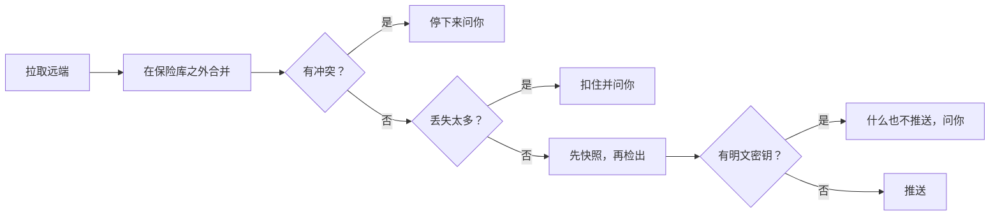

# 保险库同步 {#vault-sync}

保险库同步通过一个你自己拥有的 git 仓库，让你各台机器上的 Coffer 保险库保持一致，这样笔记本和台式机上就有同样的知识、技能、MCP 服务器、提供商和消息渠道。本页写给在不止一台机器上运行 Coffer 的人：怎样设置它，它会对你的文件做什么，以及某一轮需要你处理时该怎么答复。

## 它用来做什么 {#what-it-is-for}

你的保险库 `~/.coffer/vault` 本来就是一个 git 仓库：不管你同步与否，对它的每次改动都是一个提交（见[手动编辑保险库](/zh/guides/vault-files)）。同步只是加了一个远端。每**一轮**都会 fetch 它，让 git 在工作树之外把它和这个保险库合并；如果合并是干净的，就把结果检出到保险库里，然后 push。默认情况下，一个后台工作者每小时跑一轮。

下面的一切都由四条规则决定：

- **远端是汇合点，不是记录系统。** 每台机器都保有一个完整的保险库。你可以删掉那个仓库，再从任意一台机器重建它。
- **干净的合并会被应用；任何冲突都会停下来等你。** 当两台机器以 git 无法合并的方式改了同一处，在你逐个文件做出选择之前，什么都不会检出，什么都不会推送。
- **密钥只以密文形式传输，而且只在你要求时。** 用来解密它们的主密钥永远不进入仓库；你要自己把它带到其他机器上。
- **一台机器怎样使用保险库，只留在那台机器上。** 某个资源在这里是否启用、对哪些智能体启用（它的生效范围）、你的智能体、远端本身：这些都不在保险库里，所以都不会同步。

## 开始之前 {#before-you-start}

- **一个你自己拥有的、私有且为空的 git 仓库。** GitHub、GitLab、你自己的服务器、NAS 上的一个 bare 仓库，或者 U 盘上的一个 `file://` 路径都可以。一个保险库最多和一个远端同步。
- **git 无需提示就能使用的凭据。** Coffer 运行 `git` 时会关闭你的全局和系统 git 配置，并禁用终端提示，所以 `~/.gitconfig` 里的凭据助手或 macOS 的钥匙串助手都不会被用到。选一种：
  - **HTTPS 加令牌**：存放在 Coffer 的密钥存储里，用 `--secret-ref` 指定名字。Coffer 通过一个凭据助手把它交给 git，这个助手从那一个 `git` 进程的环境里读取它。它永远不会出现在 URL、命令行、仓库配置或错误消息里。
  - **SSH**（`git@host:…` 或 `ssh://…`）：一把你的 SSH 设置可以直接使用、不会提示输入 passphrase 的密钥。
  - **`file://`**：不需要密钥。
- **每台机器上都有 `git` 2.40 或更高版本。** 一轮同步用 `git merge-tree` 合并，旧版本没有这个功能。如果没有，同步页会报告 `git missing`，并提供一段提示词，把安装交给你的智能体。
- **每台机器上都是同一个 Coffer 版本。** 由另一种保险库布局写出的远端会被拒绝（见[故障排查](#troubleshooting)）。
- **保险库不在任何云同步文件夹里。** 放在 Dropbox、iCloud Drive、Syncthing 或其他 File Provider 文件夹里的保险库会让同步暂停：两个工具同步同一个 git 仓库会把它弄坏。

## 设置第一台机器 {#set-up-the-first-machine}

### GitHub {#github}

1. 创建一个私有的空仓库，以及一个对它有 **Contents: Read and write** 权限的 fine-grained personal access token。
2. 存储这个令牌。`coffer secret set` 从 stdin 读取值，所以它不会进入你的 shell 历史：

   ```sh
   printf '%s' "$GITHUB_TOKEN" | coffer secret set sync/github-token
   ```

3. 先检查仓库，再配置它：

   ```sh
   coffer sync remote check https://github.com/you/coffer-vault.git --secret-ref sync/github-token
   coffer sync remote set https://github.com/you/coffer-vault.git --secret-ref sync/github-token
   ```

### GitLab {#gitlab}

1. 创建一个私有的空项目，然后在它上面创建一个 **project access token**（**Settings › Access tokens**），授予 **`write_repository`** 范围，以及一个可以推送到该分支的角色（Developer 或更高；分支受保护时需要 Maintainer）。带 `write_repository` 的 personal access token 也可以。
2. 存储令牌，查看仓库，然后配置它。GitLab 的令牌要和用户名 `oauth2`（或账号的用户名）一起发送，所以两条命令都传入 `--username oauth2`：

   ```sh
   printf '%s' "$GITLAB_TOKEN" | coffer secret set sync/gitlab-token
   coffer sync remote check https://gitlab.com/<group>/<repo>.git \
     --secret-ref sync/gitlab-token --username oauth2
   coffer sync remote set https://gitlab.com/<group>/<repo>.git \
     --secret-ref sync/gitlab-token --username oauth2
   ```

   对于自建的 GitLab，把 `gitlab.com` 换成你实例的主机名。

3. 或者用 SSH 代替令牌，使用一把已添加到你 GitLab 账号的密钥：

   ```sh
   coffer sync remote set git@gitlab.com:<you>/<repo>.git
   ```

### 随令牌发送的用户名 {#the-username-sent-with-a-token}

git 每次发送 HTTPS 令牌时都会带一个用户名。除非你传入 `--username`（或者在**远端**标签页上填写**用户名**，这一项在 `https://` URL 时显示），Coffer 发送的是 `coffer`。只有在主机无法从令牌判断用户是谁时，这一项才有意义：

| 主机 | 用户名 |
| --- | --- |
| GitHub | 对令牌会被忽略；默认值即可。 |
| GitLab | `oauth2`，或账号的用户名。 |
| Bitbucket | 对仓库或 workspace access token，用一个固定值，比如 `x-token-auth`。 |
| Azure DevOps | 一个真实的用户名：你自己的用户名。 |
| 其他任何 git 服务器 | 它的 HTTPS 登录要求什么就填什么；只凭令牌就能登录时保留默认值。SSH 或 `file://` 远端不发送用户名，这个选项对它们不起任何作用。 |

```sh
coffer sync remote set https://bitbucket.org/<workspace>/<repo>.git \
  --secret-ref sync/bitbucket-token --username x-token-auth
```

### 选项 {#options}

| 选项 | 默认值 | 含义 |
| --- | --- | --- |
| `--branch` | `main` | 所有机器同步所用的分支。 |
| `--interval` | `3600` | 两次自动同步之间的秒数，至少 `60`。更小的值会被拒绝。 |
| `--with-secret` / `--without-secret` | without | 是否带上加密的密钥（`vault/secret/`）。无论怎么设置，主密钥都不会被带上。 |
| `--secret-ref` | 无 | 推送令牌在密钥存储里的名字。`''` 表示移除它。 |
| `--username` | `coffer` | 随 HTTPS 令牌发送的用户名，用于无法从令牌推断用户的主机（GitLab：`oauth2`）。 |
| `--wait` | 关 | 等待 Coffer 应用里的待批准请求，而不是直接退出。 |

重新运行 `remote set` 只会改动你传入的选项；其余选项保留已存储的值，已暂停的远端也保持暂停。

`coffer sync remote check` 会在你存储 URL 之前告诉你它里面是什么：空的、一个 Coffer 保险库（以及它的布局）、别的仓库、无法连接，还是拒绝了这个令牌。

你刚为这个远端存储的令牌会立即被使用。把一个已经在往别处推送的令牌指向一个**不同的** URL，等于把密钥发往一个新地方，所以它要等你在桌面应用里批准：命令会打印 `waiting for approval in the Coffer app` 并以 `9` 退出，或者加上 `--wait` 时一直等待。在此之前，各轮都会报告登录问题。见[密钥 → 批准](/zh/guides/secrets#approvals)。

### 加入 {#join-it}

加入总是显式的，即使在第一台机器上也是如此：

```sh
coffer sync join
```

`join` 会打印加入将做什么，并在应用任何东西之前征求你的同意。对着一个空远端，它会推送这个保险库持有的一切。

在 Web 界面里，同样的步骤在**同步**页面上；在这台机器加入之前，它显示设置表单：**仓库 URL**、**分支**、**密钥**、**用户名**（`https://` URL 时显示）、**同步频率**、**包含加密的密钥**，然后是**检查仓库**。空仓库会提供**推送并开始同步**。已经存有保险库的仓库会显示加入预览（什么会下来、什么相同、什么不同、什么会上去，以及不会删除任何东西），并提供**加入并拉取**。页面标题旁的 **?** 说明了怎样添加另一台 Mac。

## 加入另一台机器 {#join-another-machine}

1. 安装同样的 Coffer。
2. 如果远端需要令牌，用同样的引用名存储它，然后运行同样的 `coffer sync remote set`。
3. 运行 `coffer sync join`，在回答之前先看预览。它会说明属于哪种情况，以及每个方向上会移动什么：

- **新机器取并集。** 只有远端有的文件会下来，只有这台机器有的文件会上去，完全相同的文件什么都不用做。两边都有但内容不同的文件，在你做出选择之前，会原样留在这里，也不会被推送。两边都不会删除任何东西。
- **回归的机器从它上次的基准继续。** 远端已经存有这台机器的描述文件（你重装了 Coffer，或者丢了 `~/.coffer`），里面记着它上次到达的提交。这次加入就是从那里开始的一次普通合并：它离开期间做的删除会应用到这里，它自己的编辑会保留，已删除的东西不会回来。

处理加入后留下的不同文件，可以一个一个来，也可以一次全部处理：

```sh
coffer sync choose                          # list them
coffer sync choose knowledge/work/oncall.md --mine
coffer sync choose knowledge/work/oncall.md --theirs
```

在 Web 上，**状态**标签页会把它们列在**与本机不同**下面，每个都有**保留本机的**和**采用 &lt;machine&gt; 的**。

`--yes` 会为脚本跳过加入时的询问。一台机器加入之前，各轮什么都不会移动，并以 `join required` 结束。

## 迁移主密钥 {#move-the-master-key}

只有远端带着密钥时才需要。在一台有主密钥的机器上，打开**桌面应用**，在**设置 › 安全**里备份主密钥：选一个 passphrase，用 Touch ID 或登录密码确认，选一个文件夹，应用就会在那里写出受 passphrase 保护的 `coffer-master-key.cfk`，权限为 `0600`。没有任何命令、路由或浏览器页面能导出主密钥，因为智能体可能会去运行它；见[密钥 → 主密钥及其备份](/zh/guides/secrets#the-master-key-and-its-backup)。

通过你信任的渠道传递这个文件（密码管理器、`scp`、U 盘），永远不要经过同步仓库。在另一台机器上：

```sh
coffer sync key import ~/coffer-master-key.cfk   # asks for the passphrase
coffer sync key fingerprint                     # compare with the other machine
rm ~/coffer-master-key.cfk
```

**设置 › 安全**里的**导入主密钥**也能做这件事：在替换任何东西之前，它会把两把密钥的指纹并排显示；受 passphrase 保护的备份会要求输入 passphrase。被替换掉的主密钥会作为备份保留。没有主密钥，同步照样能用，但传过来的密钥在这里解不开，需要它们的资源也就启动不了。**机器**标签页会标出主密钥与本机不同的机器。

## 什么会传输，什么留在本机 {#what-travels-and-what-stays}

| 会传输 | 留在每台机器上 |
| --- | --- |
| MCP 服务器、技能、知识集、提供商和消息渠道的定义（`vault/resources/`） | 智能体（`local/resources/agent/`）：每台机器注册自己的 |
| 知识文档（`vault/knowledge/`）、技能文件夹（`vault/skills/`）、记忆触发器（`vault/memory-triggers/`） | **生效范围**：每个资源的启用开关和智能体范围（`local/reach.json`） |
| MCP 能力开关、消息渠道配对、Coffer 的模型和定期维护设置（`vault/state/`） | 同步远端、保留策略、密钥边界的批准（`local/`） |
| 密钥密文（`vault/secret/`），需要 `--with-secret` | 记忆、缓存和 `coffer-guide` 技能（`derived/`），每台机器各自重建 |
| 每台机器一个描述文件（`vault/machines/`） | 对话、审计和调用日志（`runs.db`）、附件（`content/`）、日志、主密钥 |

需要知道的几个后果：

- **生效范围按机器设置。** 一个只该在台式机上运行的服务器，会在所有机器上注册，但在笔记本上禁用。一个资源第一次到达某台机器时，采用那台机器的默认生效范围。
- **消息渠道会传输，但它的适配器只在一台机器上运行。** 一个聊天机器人只能有一个消费者，所以每个消息渠道都写明由哪台机器运行它。要迁移一个机器人，在当前运行它的机器上执行 `coffer channel bind <name> [<machine_id>]`。见[消息渠道](/zh/guides/channels)。
- **整理只在一台机器上运行。** 把新知识并入文档的这一轮只在一台所有者机器上运行，这样两台机器不会把同一批文档改写得各不相同。保险库跨了多台机器之后，在知识页头的**自动**弹出框里的**整理运行在**中选择它，或者用 `coffer config set engine.curate_owner`。见[知识](/zh/guides/knowledge)。
- **插件清单只记录，不安装。** 每台机器的描述文件会列出它的智能体的插件；不会往任何智能体的配置里写任何东西。
- 你 home 目录下的路径会以 `${HOME}` 占位符存储，并按每台机器自己的 home 展开。

## 一轮做了什么 {#what-a-round-does}



只有当某台机器相对于共同的基准真的删除了那个文件，删除才会被应用；一台机器只是缺少某个文件，不会删除任何东西。你正在编辑的文件永远不会被覆盖：这一轮会等它（`waiting on an edit`），并写明是哪个文件。没什么可做的一轮会记录为 `nothing to do`。

各轮每隔 `--interval` 秒运行一次（**远端**标签页上的**同步频率**）。要马上跑一轮，用 `coffer sync now` 或同步页头上的**立即同步**。

## 查看同步在做什么 {#watch-what-sync-is-doing}

```sh
coffer sync status       # the remote, the last round, and anything waiting for you
coffer sync history      # one line per round, newest first (--limit, default 20)
```

当某一轮在等你时，`coffer sync status` 以 `1` 退出：因冲突停下、被扣住、无法连接或无法登录远端，或者因为保险库在一个同步文件夹里而暂停。cron 任务或 shell 提示符不用解析文本就能检查这一点。已暂停的远端以 `0` 退出。

在 Web 上，**同步**页面的页头用一个词说明这台 Mac 的状况：**已同步**、**N 项改动待推送**、**已拉取 N 项改动**、**同步中**、**已停止**、**推送失败**、**远端无法连接**、**登录失败**或**已暂停**。旁边是**立即同步**和带复制按钮的远端 URL。页面有三个标签页：

- **状态**最先打开。它显示状态的含义、四项计数（知识文档、技能、MCP 服务器和工具定义、加密的密钥）、等待推送的改动以及每项改动是谁做的、需要你处理的卡片，以及这台机器跑过的每一轮。以同样方式结束的连续几轮会折叠成一行。点击某一轮，可以看到它的安全快照、它拉取的提交、它在这里改了什么以及它推送了什么。
- **机器**列出所有机器（见[管理机器](#manage-the-machines)）。
- **远端**保存远端的设置。

当某一轮需要你时，侧边栏里的**同步**入口会被标记，桌面应用也会弹出通知。

## 解决冲突 {#resolve-a-conflict}

当两台机器在任何一方同步之前改了同一个文件的同样几行，git 就无法合并它们。这一轮会停下。什么都不检出，什么都不推送，所以这台机器上的保险库保持原样：

```sh
coffer sync conflicts                                  # the files the round waits on
coffer sync resolve knowledge/projects/coffer.md --mine     # keep this machine's
coffer sync resolve knowledge/projects/coffer.md --theirs   # take the other's
coffer sync continue                                   # once every file has an answer
```

要手动合并，`coffer sync edit <path>` 会打印 `~/.coffer/derived/sync-conflicts/` 下一份带冲突标记的副本的路径。编辑它，去掉所有冲突标记，然后运行 `coffer sync resolve <path> --edited`。还留着标记的副本会被拒绝，消息会写明是哪一行。保险库自己的文件永远不会被写入标记。

在 Web 上，**状态**标签页会把这些文件列在**两台 Mac 都改过**下面；**解决冲突**会逐个打开它们。每个文件都提供**保留本机的**和**采用 &lt;machine&gt; 的**，并显示这个选择会在这里造成的 diff，还有**在编辑器中打开**，然后是**标记为已解决**。每个文件都有了答案时，会出现**继续这一轮**。**稍后处理**也是一个正式的答案：保险库在这里保持原样。

### 交给智能体合并 {#merge-with-an-agent}

合并一个文件的两份编辑，是你的智能体该干的活。在停下的一轮上，**交给智能体合并**（或 `coffer sync conflicts --prompt`）会给你一段可以复制的提示词，或者用它开一个新对话。这段提示词写明：

- 保险库；
- 每个文件，以及两边各自最后修改它的提交；
- 怎样用 `git -C <vault> diff` 查看两边各自的改动；
- Coffer 在 `~/.coffer/derived/sync-conflicts/` 下为每个文件写好的带冲突标记的副本。

智能体只编辑这些副本。它不运行任何会改动保险库的 git 命令，因为结果由 Coffer 提交。它说完成之后，按下**我已合并**（`coffer sync resolve --merged`）。Coffer 会把每一份合并后的副本当作那个文件的答案；只要还有副本留着冲突标记，它就会拒绝，并写明是哪个文件哪一行。然后点**继续这一轮**。

加密的密钥（`secret/*.enc`）永远不会交给智能体，也不能手动编辑。它只提供两个选择，提示词也从不带上它的内容。

两边同名但 uid 不同的资源（两台机器各自独立创建了 `jira`）也算冲突。密钥密文永远不会冲突：最近一次加密的值胜出。

## 某一轮因删除被扣住时 {#when-a-round-is-held-for-deletions}

如果一轮会让某个区域丢失超过 **20%** 的文件，或者丢失 **20 个或更多**文件，它会在碰任何东西之前停下。这些阈值是固定的。断路器在两个方向上都起作用：

- **传入**：远端会删掉这个保险库的一大部分；
- **传出**：这台机器会把远端一大部分内容的删除推送上去，而重装、失败的恢复或者一条手滑的 `rm -rf`，从内部看起来正是这个样子。

同一轮里在另一个路径重新出现的文件算移动，不算丢失；资源文件按它的 uid 计数，所以重新组织或改名永远不会触发询问。

```sh
coffer sync hold              # what is held, grouped by folder
coffer sync hold --confirm    # the deletions are real: delete the files
coffer sync hold --restore    # keep the files
```

两种答案都会让这一轮继续。在 Web 上，**状态**标签页会按文件夹分组，说明是谁删了多少文件；**查看删除**会列出它们，并提供**删除 n 个文件…**（会先询问；会先拍一个安全快照）和**恢复 n 个文件**。如果这台机器刚刚重装或恢复过，选恢复，不要确认。

## 某一轮发现明文密钥时 {#when-a-round-finds-a-plaintext-secret}

一轮在推送之前，会读一遍这次推送会发布的每个文件版本：远端还没有的每个提交里改过的每个文件。它用的检测和密钥页面上的**查找明文密钥**以及 `coffer secret scan` 相同：赋给一个名字表明是密钥的变量的值（`DB_PASSWORD=…`、`api_key: …`），或者常见的令牌格式。加密的密钥文件（`secret/*.enc`）是密文，不会被读取。

推送到远端的值会留在它的历史里、每一份克隆里，以及这两者的每一份备份里，所以发现明文密钥的一轮**什么也不推送**，并记为 `plaintext found`。从其他机器拉取照常进行，只有这台机器的推送在等待。同步页面、概览的列表和 `coffer sync status` 会按文件、行号和键名指出每一处，从不显示值：

```sh
coffer sync status             # each file:line and key the round found
coffer sync status --prompt    # the prompt that hands the move to your agent
coffer sync push-anyway        # lists the places, asks, then pushes them as they are
```

- **移入密钥。****交给智能体**（或 `coffer sync status --prompt`）会把这些位置交给你的智能体，请它用 `coffer secret set` 把每个值移入 Coffer 的密钥（过程中不打印值），并在原处写上 `coffer://secret/<name>` 引用。需要这个值的技能命令改为通过 `coffer run --secret` 运行。然后点**重试**。旧的值仍在尚未推送的提交里，所以这一轮会把它们合并成一个提交，内容是文件现在的样子，再推送它。磁盘上的文件不变；只是那些尚未推送的编辑在历史里的多条记录会合成一条。
- **仍然推送。**如果某一处只是示例或测试值，不是真的密钥，**仍然推送…**（或 `coffer sync push-anyway`）会先询问，在审计日志里记下是谁推送了哪些文件，并且只推送它给你看过的那些版本。之后再改过的文件会被重新读取。

## 回滚一轮 {#roll-back-a-round}

每一轮在检出任何东西之前都会给保险库拍一个快照，最近的十个快照会被保留：

```sh
coffer sync history                 # find the round's id
coffer sync rollback 42             # shows the plan, then asks
```

回滚会把那一轮改动的东西放回去，作为这台机器上的一个新提交，由下一轮推送出去，于是其他机器也会跟上。那一轮之后你编辑过的文件会保留，计划里会把它们列出来。什么都没应用的一轮，或者一次回滚本身，都不能被回滚。在 Web 上，某一轮所在行上的**回滚**，或者它抽屉里的**回滚到这一轮之前**，会先显示同样的计划。

要找回单个文件或文件夹更早的状态，用保险库自己的历史：[`coffer vault history` 和 `coffer vault restore`](/zh/guides/vault-files#history-and-restore)。

## 管理机器 {#manage-the-machines}

```sh
coffer sync machine list
coffer sync machine rename "Work desktop"
coffer sync machine rm <machine_id>         # retire a machine you no longer use
```

机器的 id 由主机派生（macOS 上是 `IOPlatformUUID`，Linux 上是 `/etc/machine-id`），发布之前会先做哈希，重装 Coffer 也不会变。在读不到主机标识的地方，Coffer 会把一个生成的 id 存进 `~/.coffer/machine-id`，删除 `~/.coffer` 之后它就不在了。改名只改一个标签。下线一台机器会在你的一个提交里移除它的描述文件，别的什么都不重写；仍绑定在它上面的消息渠道在你把它绑到别处之前不会在任何地方运行。一台已下线的机器再次同步时会回来。

在 Web 上，**机器**标签页列出每台机器最后一次出现的时间、它的最后一轮、它的 Coffer 版本和它的智能体。你当前这台 Mac 标记为**本机**，负责整理知识的机器会标记为**负责整理**。行菜单可以给这台 Mac 改名（其他 Mac 在它们的下一轮之后才看到新名字），也可以下线其他任何一台。一台机器只能给自己改名，因为每台机器只写它自己的描述文件。

## 暂停或停止同步 {#pause-or-stop-syncing}

- **暂停：**在**远端**标签页上把**同步频率**设为**只在我点「立即同步」时**，或者运行 `coffer sync remote pause`。定时器停止；远端、它的设置和历史都会保留。你要求时，**立即同步**仍会跑一轮。`coffer sync remote resume` 会把定时器重新打开。
- **停止同步：****远端**标签页上的**停止同步…**，或者 `coffer sync remote clear`。这台机器会忘掉这个远端；保险库、它的历史和那个仓库都原样保留。再次同步就意味着重新加入。

## 故障排查 {#troubleshooting}

| 症状 | 原因 | 解决办法 |
| --- | --- | --- |
| `join required`，什么都不移动 | 这台机器还没有加入远端。 | `coffer sync join` |
| `sign-in refused` | 没有可用的密钥（你的 git 配置和钥匙串助手不会被用到），令牌没有推送权限，主机需要另一个用户名（GitLab：`--username oauth2`），或者一个用于新 URL 的令牌在等待批准。 | 存储一个范围正确的令牌并设置 `--secret-ref`，在桌面应用里批准它，或者使用一把不需要提示的 SSH 密钥。 |
| `remote unreachable` | 网络、VPN 或者 URL 错了。 | 不会丢任何东西；下一次能连上的一轮会把改动带过去。 |
| `push failed` | 已经在这里应用，但远端拒绝了推送（受保护的分支、只读令牌）。 | 修好分支保护或令牌；下一轮会重试。 |
| `plaintext found` | 这一轮要推送的某个文件里有看起来像明文密钥的内容；什么也没推送。 | 把值移入密钥（**交给智能体**，或 `coffer sync status --prompt`）后重试；如果它不是密钥，用 `coffer sync push-anyway`。 |
| `git missing` | 守护进程使用的 PATH 上没有 `git`。 | 按适合这台机器的方式安装 git。 |
| `paused (cloud folder)` | 保险库在一个 Dropbox、iCloud Drive、Syncthing 或类似工具也在同步的文件夹里。 | 把 `~/.coffer` 移出那个文件夹。 |
| `remote too new` | 另一台机器运行着更新版本的 Coffer。 | 升级这台机器。 |
| `remote too old` | 远端是由采用保险库布局之前的 Coffer，或者更旧的布局写出的。 | 从一台已升级的机器重建它：见[升级已有的 Coffer](/zh/guides/upgrading#rebuild-your-sync-remote)。 |
| `waiting on an edit` | 在这一轮会改动的某个文件上，你有一处未保存或无效的编辑。 | 完成或修好这处编辑（`coffer vault problems` 会列出无效的编辑）；下一轮会继续。 |
| 重装 Coffer 后有一轮被扣住 | 空的保险库会把它的丢失推送出去。 | `coffer sync hold --restore`。 |
| 密钥无法解密 | 这台机器没有加密它们时用的主密钥。 | 用从有主密钥的机器上拿到的密钥运行 `coffer sync key import <file>`。 |

被拒绝的推送、被拒绝的登录、无法连接的远端和缺失的 git，都会附带一段给你的智能体的提示词（明文密钥有它自己的提示词，见上文）。提示词会写明远端（不含凭据）、分支、密钥的名字，以及去掉了令牌的 git 消息，并说明该检查什么。它在同步页面上的消息旁边，`coffer sync status --prompt` 也会把它打印出来。它从不携带、也从不索要令牌。**重试**仍然是 Coffer 自己的按钮。

对于这里没列出的失败，这一轮的消息在 `coffer sync status` 里，守护进程日志（**活动 → 守护进程日志**）里有细节。

## 工作原理 {#how-it-works}

一轮的各个步骤、断路器、加入流程以及每一项背后的理由，见[保险库同步架构](/zh/architecture/vault-sync)。

## 相关内容 {#related}

- [手动编辑保险库](/zh/guides/vault-files) · [升级已有的 Coffer](/zh/guides/upgrading)
- [密钥存储](/zh/guides/secret-store) · [密钥](/zh/guides/secrets) · [消息渠道](/zh/guides/channels) · [知识](/zh/guides/knowledge)
- [命令行参考](/zh/reference/cli)
- 规格：[vault-sync](https://github.com/wyx-sg/Coffer/blob/main/openspec/specs/vault-sync/spec.md) · 决策：[同步只拉取和推送保险库仓库](https://github.com/wyx-sg/Coffer/blob/main/docs/decisions/sync-applies-clean-merges-and-stops-on-any-conflict.md)、[按智能体划分的资源范围](https://github.com/wyx-sg/Coffer/blob/main/docs/decisions/per-agent-resource-scope.md)
