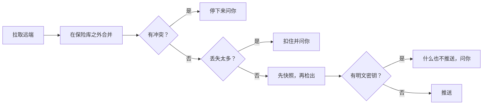

# 保险库同步 {#vault-sync}

保险库同步通过一个你自己拥有的 git 仓库，让你各台机器上的 Coffer 保险库保持一致，这样笔记本和台式机上就有同样的知识、技能、MCP 服务器、提供商和消息渠道。本页写给在不止一台机器上运行 Coffer 的人：怎样设置它，它会对你的文件做什么，以及某一轮需要你处理时该怎么答复。

## 它用来做什么 {#what-it-is-for}

你的保险库 `~/.coffer/vault` 本来就是一个 git 仓库：不管你同步与否，对它的每次改动都是一个提交（见[手动编辑保险库](/zh/guides/vault-files)）。同步只是加了一个远端。每**一轮**都会 fetch 它，让 git 在工作树之外把它和这个保险库合并；如果合并是干净的，就把结果检出到保险库里，然后 push。默认情况下，一个后台工作者每小时跑一轮。

下面的一切都由四条规则决定：

- **远端是汇合点，不是记录系统。** 每台机器都保有一个完整的保险库。你可以删掉那个仓库，再从任意一台机器重建它。
- **干净的合并会被应用；任何冲突都会停下来等你。** 当两台机器以 git 无法合并的方式改了同一处，在你逐个文件做出选择之前，什么都不会检出，什么都不会推送。
- **密钥只以密文形式传输，而且只在你要求时。** 用来解密它们的主密钥永远不进入仓库；你要自己把它带到其他机器上。
- **一台机器怎样使用保险库，只留在那台机器上。** 某个资源在这里是否启用、对哪些智能体启用（它的生效范围）、你的智能体、远端本身：这些都不在保险库里，所以都不会同步。

## 开始之前 {#before-you-start}

- **一个你自己拥有的、私有且为空的 git 仓库。** GitHub、GitLab、你自己的服务器、NAS 上的一个 bare 仓库，或者 U 盘上的一个 `file://` 路径都可以。一个保险库最多和一个远端同步。
- **git 无需提示就能使用的凭据。** Coffer 运行 `git` 时会关闭你的全局和系统 git 配置，并禁用终端提示，所以 `~/.gitconfig` 里的凭据助手或 macOS 的钥匙串助手都不会被用到。选一种：
  - **HTTPS 加令牌**：存放在 Coffer 的密钥存储里，在同步页的**密钥**里选择。Coffer 通过一个凭据助手把它交给 git，这个助手从那一个 `git` 进程的环境里读取它。它永远不会出现在 URL、命令行、仓库配置或错误消息里。
  - **SSH**（`git@host:…` 或 `ssh://…`）：一把你的 SSH 设置可以直接使用、不会提示输入 passphrase 的密钥。
  - **`file://`**：不需要密钥。
- **每台机器上都有 `git` 2.40 或更高版本。** 一轮同步用 `git merge-tree` 合并，旧版本没有这个功能。如果没有，同步页会报告 `git missing`，并提供一段提示词，把安装交给你的智能体。
- **每台机器上都是同一个 Coffer 版本。** 由另一种保险库布局写出的远端会被拒绝（见[故障排查](#troubleshooting)）。
- **保险库不在任何云同步文件夹里。** 放在 Dropbox、iCloud Drive、Syncthing 或其他 File Provider 文件夹里的保险库会让同步暂停：两个工具同步同一个 git 仓库会把它弄坏。

## 设置第一台机器 {#set-up-the-first-machine}

### GitHub {#github}

1. 创建一个私有的空仓库，以及一个对它有 **Contents: Read and write** 权限的 fine-grained personal access token。
2. 在**密钥**页面点**添加密钥**，起个名字（例如 `github-sync-token`），把令牌粘贴为值。值不会再显示出来，也不会进入你的 shell 历史。
3. 在**同步**页面填入**仓库 URL**，在**密钥**里选择这个令牌，然后点**检查仓库**。

### GitLab {#gitlab}

1. 创建一个私有的空项目，然后在它上面创建一个 **project access token**（**Settings › Access tokens**），授予 **`write_repository`** 范围，以及一个可以推送到该分支的角色（Developer 或更高；分支受保护时需要 Maintainer）。带 `write_repository` 的 personal access token 也可以。
2. 和 GitHub 一样，在**密钥**页面（**添加密钥**）把令牌添加为密钥。在**同步**页面填入**仓库 URL**，在**密钥**里选择这个令牌，然后点**检查仓库**。Coffer 会自动发送 GitLab 要求的用户名（`oauth2`）。

   对于自建的 GitLab，把 `gitlab.com` 换成你实例的主机名。

3. 或者用 SSH 代替令牌，使用一把已添加到你 GitLab 账号的密钥：把 `git@gitlab.com:<you>/<repo>.git` 填为**仓库 URL**，**密钥**保持**不使用**。

### 随令牌发送的用户名 {#the-username-sent-with-a-token}

git 每次发送 HTTPS 令牌时都会带一个用户名。你无需设置它：Coffer 根据远端 URL 中的主机自动选择。

| 主机 | 发送的用户名 |
| --- | --- |
| `bitbucket.org` | `x-token-auth`，这正是 Bitbucket 仓库或 workspace access token 所要求的。 |
| 名称中含有 `gitlab` 的主机（`gitlab.com`、自建 GitLab） | `oauth2`。 |
| 其他任何主机，包括 GitHub 和 Azure DevOps | `coffer`；使用令牌时这两者都会忽略用户名。 |

Bitbucket 的 App password 需要你自己的账号名，因此不受支持；请改用 access token。SSH 或 `file://` 远端不发送用户名。

### 选项 {#options}

**远端**标签页包含下列字段，每个字段在你离开时自动保存。

| 字段 | 默认值 | 含义 |
| --- | --- | --- |
| **分支** | `main` | 所有机器同步所用的分支。 |
| **同步频率** | 每小时 | 自动同步多久运行一轮，从每分钟到每几天，或者**只在我点「立即同步」时**。 |
| **包含加密的密钥** | 关 | 是否带上加密的密钥（`vault/secret/`）。无论怎么设置，主密钥都不会被带上。 |
| **密钥** | **不使用** | 推送令牌在密钥存储里的名字。 |

**检查仓库**会在你存储 URL 之前告诉你它里面是什么：空的、一个 Coffer 保险库（以及它的布局）、别的仓库、无法连接，还是拒绝了这个令牌。

你刚为这个远端存储的令牌会立即被使用。把一个已经在往别处推送的令牌指向一个**不同的** URL，等于把密钥发往一个新地方，所以它要等你在桌面应用里批准：页面会显示**推送令牌正在等待批准**，并提供**重新检查**。在此之前，各轮都会报告登录问题。见[密钥 → 批准](/zh/guides/secrets#approvals)。

### 加入 {#join-it}

加入总是显式的，即使在第一台机器上也是如此。在这台机器加入之前，**同步**页面显示设置表单：**仓库 URL**、**分支**、**密钥**、**同步频率**、**包含加密的密钥**，然后是**检查仓库**。空仓库会提供**推送并开始同步**，把这个保险库持有的一切推送上去。已经存有保险库的仓库会显示加入预览（什么会下来、什么相同、什么不同、什么会上去，以及不会删除任何东西），并提供**加入并拉取**；在你点它之前不会应用任何东西。

## 加入另一台机器 {#join-another-machine}

1. 安装同样的 Coffer。
2. 如果远端需要令牌，在**密钥**页面把它添加为密钥，然后在**同步**页面填入同样的字段。
3. 点**检查仓库**，在点**加入并拉取**之前先看预览。它会说明属于哪种情况，以及每个方向上会移动什么：

- **新机器取并集。** 只有远端有的文件会下来，只有这台机器有的文件会上去，完全相同的文件什么都不用做。两边都有但内容不同的文件，在你做出选择之前，会原样留在这里，也不会被推送。两边都不会删除任何东西。
- **回归的机器从它上次的基准继续。** 远端已经存有这台机器的描述文件（你重装了 Coffer，或者丢了 `~/.coffer`），里面记着它上次到达的提交。这次加入就是从那里开始的一次普通合并：它离开期间做的删除会应用到这里，它自己的编辑会保留，已删除的东西不会回来。

处理加入后留下的不同文件，可以一个一个来，也可以一次全部处理。**状态**标签页会把它们列在**与本机不同**下面，附**选择版本**和**交给 &lt;Agent&gt;**。**选择版本**会打开与停下的一轮的冲突相同的“解决”页面：每个文件都提供**保留本机的**、**采用 &lt;machine&gt; 的**、**在编辑器中打开**和**交给 &lt;Agent&gt;**，页面以**应用选择**结束。要手动合并某个不同的文件，**在编辑器中打开**会打开带标记的副本；**标记为已解决**把它当作这台机器的版本，由下一轮推送。

一台机器加入之前，各轮什么都不会移动，并以 `join required` 结束。

## 迁移主密钥 {#move-the-master-key}

只有远端带着密钥时才需要。在一台有主密钥的机器上，打开**桌面应用**，在**设置 › 安全**里备份主密钥：选一个 passphrase，用 Touch ID 或登录密码确认，选一个文件夹，应用就会在那里写出受 passphrase 保护的 `coffer-master-key.cfk`，权限为 `0600`。没有任何命令、路由或浏览器页面能导出主密钥，因为智能体可能会去运行它；见[密钥 → 主密钥及其备份](/zh/guides/secrets#the-master-key-and-its-backup)。

通过你信任的渠道传递这个文件（密码管理器、`scp`、U 盘），永远不要经过同步仓库。在另一台机器上，**设置 › 安全**里的**导入主密钥**（在桌面应用中，会要求 Touch ID）完成其余的事：在替换任何东西之前，它会把两把密钥的指纹并排显示；受 passphrase 保护的备份会要求输入 passphrase。之后请删掉拷贝过去的文件。被替换掉的主密钥会作为备份保留。没有主密钥，同步照样能用，但传过来的密钥在这里解不开，需要它们的资源也就启动不了。**机器**标签页会标出主密钥与本机不同的机器。

## 什么会传输，什么留在本机 {#what-travels-and-what-stays}

| 会传输 | 留在每台机器上 |
| --- | --- |
| MCP 服务器、技能、知识集、提供商和消息渠道的定义（`vault/resources/`） | 智能体（`local/resources/agent/`）：每台机器注册自己的 |
| 知识文档（`vault/knowledge/`）、技能文件夹（`vault/skills/`） | **生效范围**：每个资源的启用开关和智能体范围（`local/reach.json`） |
| MCP 能力开关、消息渠道配对、语音转文字模型和定期维护设置（`vault/state/`） | 同步远端、保留策略、密钥边界的批准（`local/`） |
| 密钥密文（`vault/secret/`），需要**包含加密的密钥** | 记忆、缓存和 `coffer-guide` 技能（`derived/`），每台机器各自重建 |
| 每台机器一个描述文件（`vault/machines/`） | 对话、审计和调用日志（`runs.db`）、附件（`content/`）、日志、主密钥 |

需要知道的几个后果：

- **生效范围按机器设置。** 一个只该在台式机上运行的服务器，会在所有机器上注册，但在笔记本上禁用。一个资源第一次到达某台机器时，采用那台机器的默认生效范围。
- **消息渠道会传输，但它的适配器只在一台机器上运行。** 一个聊天机器人只能有一个消费者，所以每个消息渠道都写明由哪台机器运行它。要迁移一个机器人，在当前运行它的机器上，到该消息渠道的页面更改运行它的机器。见[消息渠道](/zh/guides/channels)。
- **没有任何东西会在无人看管时改写你的文档。** 整理由智能体在你按下**整理**时进行，结果和其他编辑一样同步。见[知识](/zh/guides/knowledge)。
- **插件清单只记录，不安装。** 每台机器的描述文件会列出它的智能体的插件；不会往任何智能体的配置里写任何东西。
- 你 home 目录下的路径会以 `${HOME}` 占位符存储，并按每台机器自己的 home 展开。

## 一轮做了什么 {#what-a-round-does}

只有当某台机器相对于共同的基准真的删除了那个文件，删除才会被应用；一台机器只是缺少某个文件，不会删除任何东西。你正在编辑的文件永远不会被覆盖：这一轮会等它（`waiting on an edit`），并写明是哪个文件。没什么可做的一轮会记录为 `nothing to do`。

各轮按**远端**标签页上**同步频率**设定的节奏运行。要马上跑一轮，用同步页头上的**立即同步**。

## 查看同步在做什么 {#watch-what-sync-is-doing}

**同步**页面的页头用一个词说明这台 Mac 的状况：**已同步**、**N 项改动待推送**、**已拉取 N 项改动**、**同步中**、**已停止**、**推送失败**、**远端无法连接**、**登录失败**或**已暂停**。旁边是**立即同步**，始终是页面的主按钮；标题下面是带复制按钮的远端 URL。页面没有帮助图标，有三个标签页：

- **状态**最先打开。它显示状态的含义，下面用一行灰字说明同步的内容（知识文档、技能、MCP 服务器和工具定义，以及是否同步密钥）；有改动等待推送时带**查看改动**，打开 `/sync/pending`：列出下一次推送会带上的每个文件（同一个文件不管保存过几次都只列一次）和最后是谁写的，选中的文件显示它自上次推送以来的改动，**立即推送**会马上跑一轮（仍然先拉取）。下面是需要你处理的卡片，以及这台机器跑过的每一轮，以一张表列出时间、哪一轮、拉取了什么和推送了什么。问题卡片（比如登录失败）带一个 **×**，作用和总览上的**忽略**一样；问题变化时它会回来。缺少 git 的卡片没有 **×**：总览把缺少 git 归在命令行工具页下报告，要忽略就在那里忽略。以同样方式结束的连续几轮会折叠成一行。表格页脚始终按轮次而不是按行计数，例如**已加载 38 轮中的 38 轮**或**已加载 38 轮中的 20 轮**。点击某一轮，可以看到它的安全快照、它拉取的提交、它在这里改了什么以及它推送了什么。
- **机器**列出所有机器（见[管理机器](#manage-the-machines)）。
- **远端**保存远端的设置。

当某一轮需要你时，**总览**的**需要你处理**里会列出它，桌面应用也会弹出通知。

## 解决冲突 {#resolve-a-conflict}

当两台机器在任何一方同步之前改了同一个文件的同样几行，git 就无法合并它们。这一轮会停下。什么都不检出，什么都不推送，所以这台机器上的保险库保持原样。

**状态**标签页会说明有几个文件两台 Mac 都改过，附**解决冲突**和**交给 &lt;Agent&gt;**（后者把智能体可以合并的所有文件一次交出去）。**解决冲突**用一个页面处理所有文件，文件列在左边。每个文件都提供**保留本机的**和**采用 &lt;machine&gt; 的**，并说明这个选择会在这里造成什么（采用对方的还会显示它造成的 diff），还有**在编辑器中打开**，然后是**标记为已解决**。要手动合并，**在编辑器中打开**会打开 `~/.coffer/derived/sync-conflicts/` 下一份带冲突标记的副本：编辑它，去掉所有冲突标记。页面不显示这份副本的任何文字，自己也没有合并编辑器：读和改都在编辑器里进行。还留着标记的副本会被拒绝，消息会写明是哪一行。保险库自己的文件永远不会被写入标记。也可以单独把一个文件交给智能体。每个文件都有了答案时，会出现**继续这一轮**。**稍后处理**也是一个正式的答案：保险库在这里保持原样。

### 交给智能体合并 {#merge-with-an-agent}

合并一个文件的两份编辑，是你的智能体该干的活。在停下的一轮上，**交给 &lt;Agent&gt;**（从卡片上一次交出所有文件，或在“解决”页面上交出一个文件）会在你的首选终端里启动交接智能体，并把一段提示词作为它的第一条消息，它菜单里的**复制提示词**可以复制这段提示词。提示词写明目标和约束，里面没有 shell 命令：

- 保险库，供它阅读上下文；
- 每个文件、两台机器各自何时改过它，以及 Coffer 在 `~/.coffer/derived/sync-conflicts/` 下为合并写好的带标记副本；
- 保留两边各自新增的内容，两边矛盾的地方来问你；
- 只写那些副本：保险库自己的文件和 git 历史不动，因为合并后的文件由 Coffer 写进保险库。

智能体的合并本身从不算答案。当某份副本里有了合并结果，该文件显示为**智能体已合并 · 请检查**。Coffer 不显示这次合并的 diff：回答之前，请在你的编辑器里（**在编辑器中打开**）读一遍这份副本，提供两个选择：

- **标记为已解决**把副本当作这个文件的答案。副本里还留着冲突标记时 Coffer 会拒绝，并写明是哪一行。
- **回到两个选择**丢弃副本和交接记录，文件重新可以选**保留本机的**或**采用 &lt;machine&gt; 的**。

然后点**继续这一轮**。

加密的密钥（`secret/*.enc`）永远不会交给智能体，也不能手动编辑。它只提供两个选择，提示词也从不带上它的内容。

两边同名但 uid 不同的资源（两台机器各自独立创建了 `jira`）也算冲突。密钥密文永远不会冲突：最近一次加密的值胜出。

## 某一轮因删除被扣住时 {#when-a-round-is-held-for-deletions}

如果一轮会让某个区域丢失 **20 个或更多**文件，或者丢失 **5 个以上**且超过该区域的**一半**，它会在碰任何东西之前停下。从小区域删掉几个文件（比如 5 个 MCP 服务器删掉 3 个）会直接通过。这些阈值是固定的。断路器在两个方向上都起作用：

- **传入**：远端会删掉这个保险库的一大部分；
- **传出**：这台机器会把远端一大部分内容的删除推送上去，而重装、失败的恢复或者一条手滑的 `rm -rf`，从内部看起来正是这个样子。

同一轮里在另一个路径重新出现的文件算移动，不算丢失；资源文件按它的 uid 计数，所以重新组织或改名永远不会触发询问。

两种答案都会让这一轮继续。在 Web 上，**状态**标签页会说明是谁删了多少文件；**查看删除**会按文件夹逐个列出它们，选中的文件把全文显示为删除会移除的行，底部有两个按钮：**保留文件**和**删除 N 个文件**。每个都立即生效：页面已经展示了删除会移除什么，所以没有第二个对话框重复一遍，删除之前会先拍一个安全快照。如果这台机器刚刚重装或恢复过，选保留，不要删除。

## 某一轮发现明文密钥时 {#when-a-round-finds-a-plaintext-secret}

一轮在推送之前，会读一遍这次推送会发布的每个文件版本：远端还没有的每个提交里改过的每个文件。它用的检测与[查找明文密钥](./secrets.md)相同：内置的 gitleaks 规则（200 多种凭据格式）、赋给名字里带 password 的键的密码，以及写在 URL 里的密码。引用、`$VAR`、占位符和代码不会被当成明文。加密的密钥文件（`secret/*.enc`）是密文，不会被读取。

推送到远端的值会留在它的历史里、每一份克隆里，以及这两者的每一份备份里，所以发现明文密钥的一轮**什么也不推送**，并记为 `plaintext found`。从其他机器拉取照常进行，只有这台机器的推送在等待。同步页面和概览的列表会按文件、行号、键名和发现它的规则指出每一处，从不显示值。

要判断某一处是不是真的密钥，在同步页面上展开它。它会显示被标出的那一行和上下各三行，内容取自这一轮发现它时的版本，行里的每个值都**已遮盖**：每个字符都换成 `•`，周围的代码照原样可读。只有常见令牌格式的公开前缀（`ghp_`、`sk-`、`AKIA`）或 URL 的协议部分保持可见。行的下方用文字描述这个值的形态：多少个字符、包含哪几类（小写字母、大写字母、数字、符号），以及它看起来不像密钥时的提示——像 `process.env.API_TOKEN` 这样的代码（用点连接的名字）、`example`、`dummy` 之类的占位词，或者同一个字符反复出现。这一处还会说明文件是新文件还是改动的文件，以及这一行远端是否已经有了；对改动的文件，**查看改动**会显示它相对远端那一份的改动，同样遮盖。这些都不会被保存，Coffer 也从不显示值本身。

- **移入密钥。****移入密钥…**会直接在同步页面上打开密钥页面的[查找明文密钥](./secrets.md)，只列出它在被标出的文件里找到的内容：先查看试运行结果，再应用，每个值就会移入加密存储，原处换成 `coffer://secret/<id>` 引用。它能从技能文件里移出值；被标出的文件如果不是技能文件（比如一篇知识文档），请自行改为按名字引用密钥；被标出的文件都不是技能文件时，对话框会直接说明。这里从不把密钥交给智能体：提示词会让智能体去读存着值的那个文件。然后点**立即同步**。旧的值仍在尚未推送的提交里，所以这一轮会把它们合并成一个提交，内容是文件现在的样子，再推送它。磁盘上的文件不变；只是那些尚未推送的编辑在历史里的多条记录会合成一条。
- **仍然推送。**如果某一处只是示例或测试值，不是真的密钥，**仍然推送…**会先询问，在审计日志里记下是谁推送了哪些文件，并且只推送它给你看过的那些版本。之后再改过的文件会被重新读取。

停下等你的那一轮会保留停下的原因。在**状态**标签页点开它，抽屉最上面会说明是什么让它停下——被暂扣的删除、冲突的文件，或明文密钥在哪里——并列出这些文件；即使你已经答复、后面的轮次已经完成了改动，也照样能看到。

## 回滚一轮 {#roll-back-a-round}

每一轮在检出任何东西之前都会给保险库拍一个快照，最近的十个快照会被保留。

回滚会把那一轮改动的东西放回去，作为这台机器上的一个新提交，由下一轮推送出去，于是其他机器也会跟上。那一轮之后你编辑过的文件会保留，计划里会把它们列出来。什么都没应用的一轮，或者一次回滚本身，都不能被回滚。在**状态**标签页点开某一轮，在它的抽屉里还能看到它改了什么：**在此应用**和**推送**下的每个文件都可以就地展开成逐行差异，并带着 `+N −M` 行数。已应用的文件是这台机器在这一轮之前与之后的版本对比，已推送的文件是远端原有的版本与推送上去的版本对比。已加密的密钥不展示内容，二进制文件或特别大的文件不逐行显示，提交已从保险库中移除的一轮会提示版本已不可用。拉取的提交没有差异。在它的抽屉里选**回滚到这一轮之前**（别处没有）；它会先显示同样的计划。

要找回单个文件或文件夹更早的状态，用保险库自己的历史：[历史与恢复](/zh/guides/vault-files#history-and-restore)。

## 管理机器 {#manage-the-machines}

机器的 id 由主机派生（macOS 上是 `IOPlatformUUID`，Linux 上是 `/etc/machine-id`），发布之前会先做哈希，重装 Coffer 也不会变。在读不到主机标识的地方，Coffer 会把一个生成的 id 存进 `~/.coffer/machine-id`，删除 `~/.coffer` 之后它就不在了。改名只改一个标签。下线一台机器会在你的一个提交里移除它的描述文件，别的什么都不重写；仍绑定在它上面的消息渠道在你把它绑到别处之前不会在任何地方运行。一台已下线的机器再次同步时会回来。

**机器**标签页列出每台机器最后一次出现的时间、它的最后一轮、它的 Coffer 版本和它的智能体。你当前这台 Mac 标记为**本机**。行菜单可以给这台 Mac 改名（其他 Mac 在它们的下一轮之后才看到新名字），也可以下线其他任何一台。下线会立即执行，不弹确认，提示它的 toast 提供**撤销**，会把这台机器原样重新登记。一台机器只能给自己改名，因为每台机器只写它自己的描述文件。

## 暂停或停止同步 {#pause-or-stop-syncing}

- **暂停：**在**远端**标签页上把**同步频率**设为**只在我点「立即同步」时**。定时器停止；远端、它的设置和历史都会保留。你要求时，**立即同步**仍会跑一轮。重新选一个频率会把定时器重新打开。
- **停止同步：****远端**标签页上的**停止同步**。它立即执行，不弹确认：这台机器会忘掉这个远端；保险库、它的历史和那个仓库都原样保留。在 Web 界面里，toast 提供**撤销**，会放回远端的设置（密钥只以名字保存）、这台机器是否已加入、等你处理的一轮和加入时不同的文件，前提是此后没有设置别的远端。否则再次同步就意味着重新加入。

## 故障排查 {#troubleshooting}

| 症状 | 原因 | 解决办法 |
| --- | --- | --- |
| `join required`，什么都不移动 | 这台机器还没有加入远端。 | 在**同步**页面点**加入并拉取**。 |
| `sign-in refused` | 没有可用的密钥（你的 git 配置和钥匙串助手不会被用到），令牌没有推送权限，或者一个用于新 URL 的令牌在等待批准。 | 存储一个范围正确的令牌并在**密钥**里选择它，在桌面应用里批准它，或者使用一把不需要提示的 SSH 密钥。 |
| `remote unreachable` | 网络、VPN 或者 URL 错了。 | 不会丢任何东西；下一次能连上的一轮会把改动带过去。 |
| `push failed` | 已经在这里应用，但远端拒绝了推送（受保护的分支、只读令牌）。 | 修好分支保护或令牌；下一轮会重试。 |
| `plaintext found` | 这一轮要推送的某个文件里有看起来像明文密钥的内容；什么也没推送。 | 用**移入密钥…**后再同步一次；如果它不是密钥，用**仍然推送…**。 |
| `git missing` | 守护进程使用的 PATH 上没有 `git`。 | 按适合这台机器的方式安装 git（卡片上的**交给 &lt;Agent&gt;**），然后点**再检查一次**。 |
| `paused (cloud folder)` | 保险库在一个 Dropbox、iCloud Drive、Syncthing 或类似工具也在同步的文件夹里。 | 在状态标签页点**移动保险库…**：Coffer 会暂停各轮和智能体的写入，移动文件夹（默认到 `~/.coffer/vault`，也可以选任何不在同步文件夹里的位置），在新位置检查 git 仓库，然后恢复。旧文件夹留空，请自己删除。 |
| `remote too new` | 另一台机器运行着更新版本的 Coffer。 | 升级这台机器。 |
| `waiting on an edit` | 在这一轮会改动的某个文件上，你有一处未保存或无效的编辑。 | 完成或修好这处编辑（`coffer vault problems` 会列出无效的编辑）；下一轮会继续。 |
| 重装 Coffer 后有一轮被扣住 | 空的保险库会把它的丢失推送出去。 | 在**状态**标签页的**查看删除**里点**保留文件**。 |
| 密钥无法解密 | 这台机器没有加密它们时用的主密钥。 | 用从有主密钥的机器上拿到的密钥，在**设置 › 安全**里**导入主密钥**。 |

被拒绝的推送、被拒绝的登录、无法连接的远端和缺失的 git，都会附带一段给你的智能体的提示词（明文密钥没有提示词，见上文）。提示词会写明远端（不含凭据）、分支、密钥的名字，以及去掉了令牌的 git 消息，并说明该检查什么。它在同步页面上的消息旁边。它从不携带、也从不索要令牌。**重试**仍然是 Coffer 自己的按钮。

对于这里没列出的失败，这一轮的消息在**状态**标签页里，守护进程日志（**活动 → 守护进程日志**）里有细节。

## 工作原理 {#how-it-works}

一轮的各个步骤、断路器、加入流程以及每一项背后的理由，见[保险库同步架构](/zh/architecture/vault-sync)。

## 相关内容 {#related}

- [手动编辑保险库](/zh/guides/vault-files)
- [密钥存储](/zh/guides/secret-store) · [密钥](/zh/guides/secrets) · [消息渠道](/zh/guides/channels) · [知识](/zh/guides/knowledge)
- [命令行参考](/zh/reference/cli)
- 规格：[vault-sync](https://github.com/wyx-sg/Coffer/blob/main/openspec/specs/vault-sync/spec.md) · 决策：[同步只拉取和推送保险库仓库](https://github.com/wyx-sg/Coffer/blob/main/docs/decisions/sync-applies-clean-merges-and-stops-on-any-conflict.md)、[按智能体划分的资源范围](https://github.com/wyx-sg/Coffer/blob/main/docs/decisions/per-agent-resource-scope.md)
