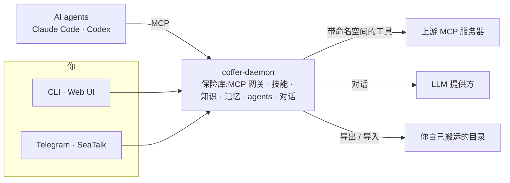

## 工作原理



Coffer 是一个常驻的本地守护进程,持有你的保险库。MCP 网关只是其中一部分:每个 AI agent 通过一个自动发现的端点接入,看到同一批工具、技能、知识与记忆 —— 同时密钥保持加密,一切都不离开你的机器。搬到你自己的另一台机器上是一个明确的动作:把保险库导出到一个目录,搬过去,再导入。

## 快速上手

```bash
# 聚合一个上游 MCP 服务器,然后让 Claude Code 指向 Coffer。
coffer mcp add filesystem --stdio "npx -y @modelcontextprotocol/server-filesystem /tmp"
claude mcp add coffer coffer-mcp-shim

# 整理一个知识库和一个共享技能 —— 你的 agent 会自动获取。
coffer kb create handbook
coffer skill import ./my-skill

# 在终端里与 Coffer 内置 agent 对话。
coffer chat -m "我有哪些 MCP 服务器和知识库?"
```

[阅读完整指南 →](/zh/guide/getting-started)
