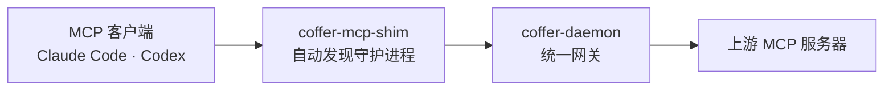

<div style="text-align:center; margin: 2.5rem 0 1rem;">
  
</div>

<div style="display:flex; gap:1rem; flex-wrap:wrap; justify-content:center; margin-bottom:1rem;">
  
  
</div>

## 工作原理



## 快速上手

```bash
coffer mcp add filesystem --stdio "npx -y @modelcontextprotocol/server-filesystem /tmp"
claude mcp add coffer coffer-mcp-shim
```

[阅读完整指南 →](/zh/guide/getting-started)
