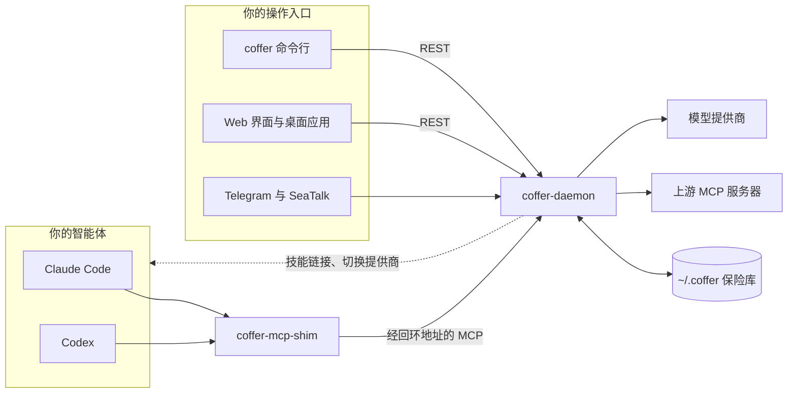

## 从这里开始 {#start-here}

第一次接触 Coffer？按顺序读这五页。全部读完大约半小时，读完后 Coffer 已经在运行，你也知道它是怎么工作的。

1. **[Coffer 是什么？](/zh/start/)** 它解决什么问题、管理什么、在哪里使用。
2. **[安装](/zh/start/install)** 把安装交给你的编程智能体，或者自己选一种安装方式。
3. **[快速上手](/zh/start/quickstart)** 大约十五分钟接入 Claude Code、注册一个 MCP 服务器并添加一个技能。
4. **[核心概念](/zh/start/concepts)** 资源、类型、生效范围和保险库：其他每一页都会用到的术语。
5. **[架构总览](/zh/architecture/)** 守护进程、网关和保险库如何配合，以及为什么这样设计。

之后，要完成某件事就去[指南](/zh/guides/)，要查某条命令就去[参考](/zh/reference/cli)。

## 工作原理 {#how-it-works}

Coffer 是运行在你机器上的一个守护进程，保险库放在 `~/.coffer`。智能体通过一个很小的 stdio shim 连到它，Coffer 会把这个 shim 写进每个智能体的 MCP 配置。你可以用命令行、Web 界面、桌面应用或消息渠道管理它，它们连的都是同一个守护进程。


```mermaid
flowchart LR
  subgraph agents["你的智能体"]
    CC["Claude Code"]
    CX["Codex"]
  end
  subgraph surfaces["你的操作入口"]
    CLI["coffer 命令行"]
    WEB["Web 界面与桌面应用"]
    IM["Telegram 与 SeaTalk"]
  end
  CC --> SHIM["coffer-mcp-shim"]
  CX --> SHIM
  SHIM -->|"经回环地址的 MCP"| D["coffer-daemon"]
  CLI -->|"REST"| D
  WEB -->|"REST"| D
  IM --> D
  D <--> V[("~/.coffer 保险库")]
  D --> UP["上游 MCP 服务器"]
  D --> PR["模型提供商"]
  D -.->|"技能链接、切换提供商"| agents
```

- **网关。** 每个智能体会话都有自己的一组上游 MCP 服务器。Coffer 以 `<server>__<tool>` 为前缀列出它们的工具，旁边是 Coffer 自己的 `coffer__*` 工具。
- **投递到智能体。** 技能以目录链接的形式出现在每个智能体的 `skills/` 文件夹里。切换提供商时，Coffer 把智能体自己的配置指向 Coffer 的本地模型代理。Coffer 从不把智能体的文件复制进自己的存储。
- **保险库。** 配置和内容以普通文件的形式放在 `~/.coffer/vault`，这是一个 git 仓库：每个资源一个 JSON 文件、技能文件夹、知识集，以及密文形式的密钥。任何文件都可以手工编辑，每次改动都有历史。审计日志这类历史记录放在它旁边的 `runs.db` 里。

[架构总览](/zh/architecture/)会逐一深入讲解各个部分。

## 安装 {#install}

Coffer 运行在你的 Mac 上，最快的安装方式是让你已经在用的编程智能体来装。把[让你的智能体来安装](/zh/start/install#let-your-agent-install-it)里的提示词粘贴给 Claude Code 或 Codex：智能体会阅读安装页，选出适合这台机器的方式并检查结果，动到 Coffer 自己目录以外的任何东西之前都会先问你。

如果要手动安装，[安装页](/zh/start/install)介绍了每一种方式。一行命令安装脚本、桌面应用和发布压缩包都从 GitHub 上打了标签的版本下载，适用于 Apple 芯片的 macOS：

```sh
curl -fsSL --proto '=https' --tlsv1.2 https://wyx-sg.github.io/Coffer/install.sh | sh
```

这会把 `coffer`、`coffer-daemon` 和 `coffer-mcp-shim` 装进 `~/.coffer/bin`，并把这个目录加进你的 `PATH`。在打出发布版本之前，以及在没有发布构建的机器上，请用 Python 3.12 或更高版本[从源码安装](/zh/start/install#from-source)。

## 接下来读什么 {#where-to-next}

- **[入门](/zh/start/)**：Coffer 是什么、为什么这样设计，以及一个 [15 分钟快速上手](/zh/start/quickstart)。
- **[指南](/zh/guides/)**：智能体、MCP 服务器、技能、知识、记忆、提供商、对话、消息渠道和同步的分步操作。
- **[架构](/zh/architecture/)**：守护进程、网关、资源框架和保险库如何配合，以及这样设计的原因。
- **[参考](/zh/reference/cli)**：每一条 CLI 命令、MCP 工具、配置项和错误码。
- **[参与贡献](/zh/contributing/)**：如何搭建开发环境，以及如何通过规格来修改 Coffer。
