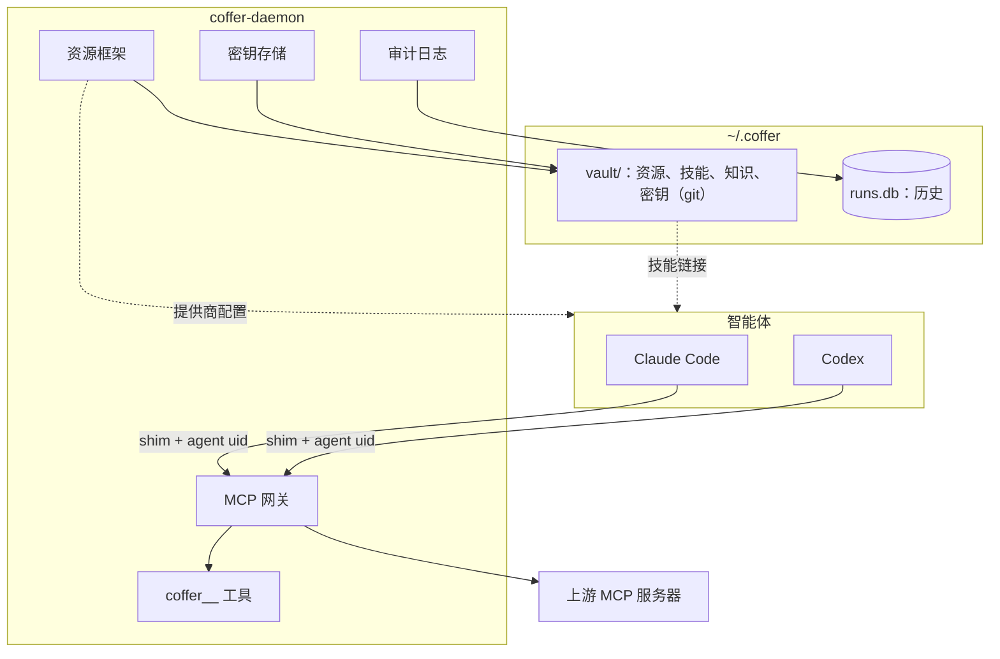

# 核心概念 {#core-concepts}

本页定义其余文档中用到的术语。读指南之前先通读一遍。每个概念都有一段简短定义，并链接到讲怎么用的指南，以及讲原理的架构页面。

## 全景图 {#the-picture}

## 守护进程 {#daemon}

`coffer-daemon` 是唯一的常驻进程，持有 Coffer 的全部状态。它监听 `127.0.0.1`，端口默认 38470，除非你另行设置。它在 `/api/v1` 下提供 REST API，在 `/mcp` 提供 MCP 端点，同时提供 Web 界面。它是唯一写入 Coffer 状态的进程（你也可以手动编辑保险库里的文件，守护进程会读到这些改动）。CLI、shim 和桌面应用都是客户端，它们通过 `~/.coffer/daemon.json` 找到守护进程，没有运行的就启动一个。

指南：[运行守护进程](/zh/guides/daemon)。架构：[守护进程与进程](/zh/architecture/daemon)。

## 保险库 {#vault}

保险库是 `~/.coffer/vault`，一个 git 仓库，以普通文件保存你的配置和你写的内容：每个资源一个 JSON 文件，外加技能文件夹、知识集和加密后的密钥。这些文件是唯一副本，每一次被接受的改动都是一个写明作者的提交，所以任何文件都可以和早先版本对比，也可以恢复到早先版本。保险库旁边，`~/.coffer` 还保存本机专属设置（`local/`）、媒体文件（`content/`）、审计日志和对话等历史（`runs.db`），以及 Coffer 可以重建的派生状态，比如记忆树（`derived/`）。要备份 Coffer，先停掉守护进程，再复制 `~/.coffer`。

指南：[手动编辑保险库](/zh/guides/vault-files)。

参考：[文件与目录](/zh/reference/filesystem)。架构：[持久化](/zh/architecture/persistence)。

## 资源与类型 {#resource-and-kind}

你在 Coffer 里管理的一切都是**资源**，每个资源都有一个**类型**。类型共七种：`mcp_server`、`agent`、`skill`、`knowledge`、`memory`、`channel` 和 `provider`。所有类型共用同一套生命周期：创建、更新、启用或停用、重命名、删除，每次改动都会记入审计（知识集、记忆分区和智能体不能停用）。资源具体*做*什么，由它的类型决定。每种类型在 Web 界面里都有自己的页面，控件相同（添加、编辑、移除、开启或关闭、设置生效范围，各取该类型支持的那些），所以技能和消息渠道的管理方式一样。

架构：[资源框架](/zh/architecture/resource-framework)。

## uid 与名字 {#uid-and-name}

每个资源都有一个不可变的 **uid**：一个不透明的 32 位十六进制字符串，只生成一次，永不复用，在持有该资源的每台机器上都相同。它的**名字**是一个标签，在同一类型内唯一，也是你在 Web 界面里看到的东西。你可以在资源的页面上重命名它；例外是 MCP 服务器和技能的名字（因为智能体会引用它们，所以固定不变），以及智能体的名字（就是它的类型）。提供商、消息渠道和记忆分区还可以带一个最多 80 个字符的**标题**，Coffer 的页面会用它代替名字显示；智能体、MCP 服务器、技能和知识集（以文件夹名显示）没有标题。凡是必须在重命名后依然有效的引用，都指向 uid。比如智能体 MCP 条目里的 `--agent-uid`，以及资源范围中的智能体列表，存的都是 uid。

架构：[资源框架](/zh/architecture/resource-framework)。

## 生效范围 {#reach}

资源的**生效范围**（reach）决定它在哪里起作用。它由两部分组成：

- **`enabled`**：开关。知识集、记忆分区和智能体没有开关，始终开启。
- **scope**：一个可选的智能体允许列表。不设 scope 表示所有智能体，`--agents a,b` 表示只有这些智能体，空列表表示一个都没有。

scope 适用于 MCP 服务器（哪些智能体能看到该服务器的工具）、技能（哪些智能体会收到该技能）、提供商（切换时写入哪些智能体的配置）和消息渠道（该渠道可以驱动哪些智能体）。知识集和记忆分区两者都没有：每一个都对所有智能体提供。生效范围是**本机专属**的：它在所作用的机器上设置，永不同步，所以你的每台机器各自决定生效范围。

用 `coffer <kind> scope <name> --agents <types>` 设置 scope（智能体按类型命名，比如 `claude-code`）（`--all` 表示所有智能体，`--none` 表示一个都没有），也可以在 Web 界面资源页面上的**生效范围**控件里设置。指南：[MCP 服务器](/zh/guides/mcp-servers)、[技能](/zh/guides/skills)。架构：[资源框架](/zh/architecture/resource-framework)。

## 智能体 {#agent}

**智能体**是一个已注册的本地编程智能体：Claude Code（`claude_code`）或 Codex（`codex`）。一台机器上每种类型最多一个智能体，名字就是它的类型：`claude-code` 或 `codex`。注册智能体就是告诉 Coffer 它的配置目录在哪里，默认是该类型的标准目录（`~/.claude`、`~/.codex`）。不会自动注册任何东西：**智能体**页面只列出候选项。智能体自己的文件仍是事实来源。Coffer 在需要时读取它的配置、MCP 条目、插件、记忆和对话记录；写入时只写允许列表内的条目，写入是原子的，并在 Coffer 自己的文件夹（`~/.coffer/config-backups`）里留一份备份副本。

指南：[智能体](/zh/guides/agents)。架构：[资源框架](/zh/architecture/resource-framework)。

## MCP 网关与命名空间 {#mcp-gateway-and-namespacing}

**网关**把 Coffer 以一个 MCP 服务器的形式呈现给每个智能体。智能体的 `coffer` 条目运行 `coffer-mcp-shim`，由它把会话转发给守护进程。每个会话都有自己的一组上游服务器进程。每项上游能力都以其服务器的名字加上**命名空间**：工具和提示词显示为 `<server>__<tool>`，资源放在 `coffer://<server>/…` URI 下，所以两个服务器永远不会冲突。你可以单独关掉某些工具，服务器的 scope 会对 scope 之外的智能体隐藏它。目录超过预算（默认 50 个上游工具）后，`tools/list` 只显示最常用的工具，其余的由 `coffer__search_tools` 搜索。

指南：[MCP 服务器](/zh/guides/mcp-servers)、[连接客户端](/zh/guides/connect-a-client)。架构：[MCP 网关](/zh/architecture/mcp-gateway)。

## 内置工具 {#built-in-tools}

除了上游工具，网关始终提供 Coffer 自己的工具，前缀为 `coffer__`：

| 工具 | 作用 |
| --- | --- |
| `coffer__search_tools` | 按一段自然语言查询对完整的上游目录排序，返回真实的工具 schema，智能体随后可以直接调用。 |

没有知识工具、记忆工具，也没有日志工具。知识文档和记忆笔记都是 Markdown 文件，智能体用自己的文件工具读取和修改；Coffer 的记录用 `coffer log audit|mcp|daemon` 读取。

网关从 MCP 握手中获取调用方智能体的身份，这不是智能体能自己设置的参数。

参考：[MCP 工具](/zh/reference/mcp-tools)。

## 技能与投递 {#skills-and-delivery}

**技能**是一个包含 `SKILL.md` 的文件夹，格式遵循 [AgentSkills](https://agentskills.io)。Coffer 在 `~/.coffer/vault/skills/<name>/` 为每个技能保存一份主副本，并通过把这个文件夹链接进每个智能体的 `skills/` 目录来**投递**它。只有当技能处于启用状态、且其 scope 包含某个智能体时，才会投递给该智能体。两者任何一个变化，Coffer 都会重新检查；守护进程启动时还会修复断掉的链接。`coffer-guide` 是 Coffer 自己的技能，它由正在运行的构建重新生成，和其他技能一样投递，向智能体介绍 Coffer 的工具和你的知识集。

指南：[技能](/zh/guides/skills)。

## 知识集与整理 {#knowledge-collections-and-tidying}

**知识集**是 `~/.coffer/vault/knowledge/<collection>/` 下的一个文件夹，存放一棵由你和你的智能体共同编写的 Markdown 文档树。文档的路径就是它的身份。网页界面以只读方式显示文档并在你的编辑器里打开它们，你在那里编辑；智能体用自己的文件工具读取和编辑，通过 `coffer-guide` 里的目录找到它们。要新增知识，智能体把一篇 Markdown 文档直接写进知识集；上传的文件会原样成为一篇文档。`coffer-guide` 技能告诉智能体一条事实该放在哪里、怎样整理知识集：合并讲同一件事的文档、拆开过长的文档、订正过时的说法。Coffer 不会用自己的模型去改你的文档。知识集上的**整理**会把这件事交给你的默认智能体，在一个新对话里完成。

指南：[知识](/zh/guides/knowledge)。架构：[知识](/zh/architecture/knowledge)。

## 记忆分区 {#memory-partitions}

Coffer 以只读方式**聚合**每个已注册智能体自己的原生记忆，从不写入智能体的记忆文件。它把读到的内容转成自己的笔记，归入各个**分区**：每个仓库一个，另加 `global`。每个分区位于 `~/.coffer/derived/memory/<partition>/`，包含一个 `MEMORY.md` 索引和一个 `notes/` 目录。你可以在网页界面或磁盘上编辑笔记，它会一直保留，直到更新的证据修订它；重建派生目录会丢掉这些编辑。如果你为某个智能体安装了投递 Hook，Coffer 会在会话开始时把索引交给它，并把每个提示词提到的那几条笔记也交给它。从消息渠道进来的轮次，则改为在系统提示词里带上索引。

指南：[记忆](/zh/guides/memory)。架构：[记忆](/zh/architecture/memory)。

## 提供商 {#providers}

**提供商**是一个模型提供商连接：一个 OpenAI 兼容地址（给 Codex）、一个 Anthropic 兼容地址（给 Claude Code），填一个或两个都填，外加一个密钥引用。它服务哪些智能体由地址决定。把智能体**切换**到某个提供商，会把这个连接写入该智能体的原生配置。切回智能体自己的登录是另一个单独的操作。你还可以把一个提供商标记为语音转文字的默认提供商，语音消息的转写跑在它上面。

指南：[模型提供商](/zh/guides/providers)。

## 消息渠道 {#channels}

**消息渠道**是一个绑定到你已注册智能体的 Telegram 或 SeaTalk 机器人。你把自己的 IM 账号和它配对，然后就能在手机上和 Claude Code 或 Codex 聊天、接收通知。消息渠道的 scope 指定它可以驱动哪些智能体。消息渠道随保险库同步，但每一个都绑定到运行它的那一台机器的守护进程上。Web 版**对话**页面是驱动智能体的另一种方式，它可以查看并接着进行从消息渠道开始的对话。

指南：[消息渠道](/zh/guides/channels)、[对话](/zh/guides/chat)。架构：[对话与轮次](/zh/architecture/chat)。

## 密钥引用 {#secret-refs}

Coffer 只以 Fernet 密文形式保存密钥，所用的主密钥存放在 macOS 钥匙串中，只有 Coffer 的签名二进制能读取。资源里从不包含密钥本身，而是包含一个**密钥引用**，即一个名字，比如 `github.token`；守护进程只在启动上游服务器或发送请求的那一刻才解析它。用 `coffer secret set <ref>` 设置密钥。明文永远不会进入数据库、日志或审计日志。

指南：[密钥存储](/zh/guides/secret-store)。架构：[安全模型](/zh/architecture/security)。

## 审计日志 {#audit-log}

对资源的每一次生命周期改动都会连同操作者写入**审计日志**：`cli`、`api`、`ui`、`system`、`sync`、`channel`，或者智能体自己操作时写智能体的名字。它旁边还有另外两份记录：**MCP 调用日志**（调用了哪个工具、什么时候、耗时多久、结果如何，从不记录内容）和**守护进程日志**。Web 界面的**活动**页面把三者分别放在各自的 tab 上展示。

指南：[活动与审计](/zh/guides/activity)。架构：[可观测性](/zh/architecture/observability)。

## 实验功能 {#experimental-features}

还没准备好面向所有人的能力，会以实验功能的形式发布：它一开始是关闭的，由你在每台机器上单独开启。关掉一项实验功能后它看起来就像不存在——页面、命令和 `coffer__` 工具都会消失——但不删除任何东西。功能成熟后会转正，并去掉开关。有两个功能处于实验状态：知识和记忆。设置 → 功能会列出它们。同步和模型提供商已经转正，始终开启。

指南：[实验功能](/zh/guides/experimental-features)。

## 术语表 {#glossary}

每个术语的一句话定义，见[术语表](/zh/reference/glossary)。
