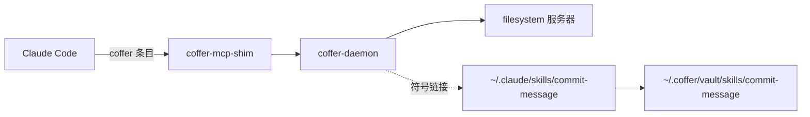

# 快速上手 {#quickstart}

这个教程大约需要 15 分钟。完成后，你会有：一个连到 Coffer 的 Claude Code；一个只注册了一次的上游 MCP 服务器，Claude Code 能以 `filesystem__*` 工具的形式看到它；以及一个投递到 Claude Code `skills/` 目录的技能。每一步先给出 CLI 命令，再给出 Web 界面的操作路径，用哪种都行。

## 开始之前 {#before-you-begin}

你需要：

- **已安装 Coffer**，并且 `coffer` 在你的 `PATH` 上。见[安装](/zh/start/install)。
- **已安装 Claude Code**，配置目录在 `~/.claude`。Codex 的用法完全一样：本页凡是写 `claude_code` 或 `claude-code` 的地方，换成 `codex` 即可。
- **Node.js**，这样 `npx` 才能运行示例 MCP 服务器。

## 六个步骤 {#six-steps}

::::: steps

### 启动 Coffer 并打开界面 {#start-coffer-and-open-the-ui}

```sh
coffer daemon start
coffer open
```

```text
daemon started (pid=48213)
opened http://127.0.0.1:8000/ in your browser
```

`coffer open` 会在浏览器里打开 `http://127.0.0.1:8000/`，并且已经处于登录状态。`coffer daemon start` 其实可以跳过，因为任何需要守护进程的命令都会启动它；这里运行一下只是让你看到守护进程已经起来了。如果守护进程已经在运行，这条命令会打印 `daemon already running`。

### 注册 Claude Code {#register-claude-code}

Coffer 从不自行注册智能体。先让它看看能找到什么，再由你确认。

```sh
coffer scan
```

```text
                          Not managed by Coffer
┏━━━━━━━┳━━━━━━━━━━━━━┳━━━━━━━━━━━━━┳━━━━━━━━━━━━━━━━━━━━━━━━━━━━━━━━━━━━━━━━━━━━━━━━━━━━━━━━━━━━━━━━━━━━━━━━━━━━┓
┃ Kind  ┃ Agent       ┃ Ref         ┃ Detail                                                                     ┃
┡━━━━━━━╇━━━━━━━━━━━━━╇━━━━━━━━━━━━━╇━━━━━━━━━━━━━━━━━━━━━━━━━━━━━━━━━━━━━━━━━━━━━━━━━━━━━━━━━━━━━━━━━━━━━━━━━━━━┩
│ agent │ claude-code │ claude-code │ Claude Code at /Users/you/.claude — register: coffer agent add claude-code │
└───────┴─────────────┴─────────────┴────────────────────────────────────────────────────────────────────────────┘
```

```sh
coffer agent add claude-code
```

```text
registered: agent claude-code
```

（`coffer scan` 列出检测到的智能体时，给的就是这条命令。）每种类型只有一个智能体，名字就是它的类型 `claude-code`。它注册在 `~/.claude`；如果你的 Claude Code 配置在别处，传 `--config-dir <path>`。装了 Claude Code 但从没运行过也没关系：注册时会创建 `~/.claude`。

**在 Web 界面中：** 打开**智能体**。这个页面总会列出 Claude Code 和 Codex；在 Claude Code 那一行选择**添加**，检查 Coffer 将要写入的内容，然后应用。如果两个智能体都装了、都还没添加，**全部添加**可以一次加两个。

### 把 Claude Code 连到 Coffer {#connect-claude-code-to-coffer}

```sh
coffer agent connect claude-code
```

```text
connected agent claude-code to Coffer
  gateway MCP entry: installed (/Users/you/.coffer/bin/coffer-mcp-shim)
```

这会在 `~/.claude.json` 的 `mcpServers` 中添加一条条目（同时往 `~/.claude/settings.json` 写入 Coffer 的记忆 Hook，共四条，从会话开始覆盖到每条 shell 命令，见[记忆](/zh/guides/memory)）。Coffer 以原子方式写入文件，并把上一个版本保存为 `.bak`：

```json
{
  "mcpServers": {
    "coffer": {
      "command": "/Users/you/.coffer/bin/coffer-mcp-shim",
      "args": ["--agent-uid", "fdc37200d76f4ff094a29e41fd06e13c"]
    }
  }
}
```

Coffer 靠 `--agent-uid` 参数知道一个会话属于哪个智能体，之后你就可以把某个服务器或技能限定给特定智能体。命令路径是绝对路径，因为从图形界面启动的智能体不会继承你 shell 的 `PATH`。

**在 Web 界面中：** 打开**智能体 → claude-code**，点击**连接到 Coffer**。智能体列表上该智能体的 **Coffer** 状态会从**未接入**变为**已接入**。

::: tip 为什么不用 `claude mcp add`？
你可以手动把 `coffer-mcp-shim` 加到任何 MCP 客户端。但手写的条目没有 `--agent-uid`，Coffer 就分不清会话属于哪个智能体，限定给特定智能体的服务器对它也就一直不可见。对于 Claude Code 和 Codex，请用 `coffer agent connect`。其他客户端见[连接客户端](/zh/guides/connect-a-client)。
:::

### 注册一个上游 MCP 服务器 {#register-an-upstream-mcp-server}

注册官方参考实现 [filesystem 服务器](https://github.com/modelcontextprotocol/servers/tree/main/src/filesystem)，并给它一个目录的访问权限：

```sh
mkdir -p ~/projects
coffer mcp add filesystem \
  --stdio "npx -y @modelcontextprotocol/server-filesystem $HOME/projects" \
  --description "Read and write files under ~/projects"
```

```text
registered: mcp_server filesystem
```

`--stdio` 把整条命令行当作一个字符串接收，由 Coffer 拆分成命令和参数。通过 HTTP 访问的服务器改用 `--http <url>`。需要 API 密钥 的服务器，加上 `--secret ENV_NAME=<secret-ref>`（见[密钥存储](/zh/guides/secret-store)）。

检查 Coffer 能否启动这个服务器并看到它的工具：

```sh
coffer mcp test filesystem
coffer mcp cap list filesystem --type tool
```

```text
capabilities: 14 tools, 0 prompts, 0 resources (re-queried)
OK  (993 ms)
                          filesystem capabilities
┏━━━━━━━━━━━━━━━━━━━━━┳━━━━━━━━━┳━━━━━━━━━━━━━┳━━━━━━━━━━━━━━━━━━━━━━━━━━━━┓
┃ Ref                 ┃ Enabled ┃ Name length ┃ Description                ┃
┡━━━━━━━━━━━━━━━━━━━━━╇━━━━━━━━━╇━━━━━━━━━━━━━╇━━━━━━━━━━━━━━━━━━━━━━━━━━━━┩
│ tool:read_file      │ yes     │ 34          │ Read the complete contents │
│ tool:read_text_file │ yes     │ 39          │ Read the complete contents │
│ tool:write_file     │ yes     │ 35          │ Create a new file or …     │
│ …                   │ …       │ …           │ …                          │
└─────────────────────┴─────────┴─────────────┴────────────────────────────┘
```

第一次测试可能要几秒钟，因为 `npx` 要下载包。智能体看到的每个工具名是 `filesystem__<tool>`。**Name length** 统计的是 Claude Code 这类客户端看到的完整名字 `mcp__coffer__filesystem__<tool>`；超过 64 个字符的名字会用 `!` 标出，因为模型提供商的 API 会拒绝它。

**在 Web 界面中：** 打开 **MCP 服务器**，点击**添加服务器**，以标准 `mcpServers` 格式粘贴服务器的 JSON（也可以粘贴一条命令行或一个 URL）。路径必须是绝对路径：

```json
{
  "mcpServers": {
    "filesystem": {
      "command": "npx",
      "args": ["-y", "@modelcontextprotocol/server-filesystem", "/Users/you/projects"]
    }
  }
}
```

点击**继续**，检查将要导入的内容，再点击**导入 1 个服务器**。在该服务器的页面上，**测试连接**做的检查和 `coffer mcp test` 一样。**工具** tab 列出每个工具，并带一个**已启用**开关。

### 在 Claude Code 中使用这些工具 {#use-the-tools-from-claude-code}

开一个**新的** Claude Code 会话。已经打开的会话在启动时就加载好了它的 MCP 服务器。运行 `/mcp`，`coffer` 会显示为一个已连接的服务器。它的工具包括：

- filesystem 服务器的工具：`filesystem__read_text_file`、`filesystem__list_directory`、`filesystem__write_file` 等；
- Coffer 自己的内置工具：`coffer__search_tools` 和 `coffer__write`。

Claude Code 会给每个 MCP 工具再加一层自己的前缀，所以在它的工具列表里，名字显示为 `mcp__coffer__filesystem__list_directory`。让它用一个试试：

```text
> Use the filesystem tools to list what is in ~/projects.
```

Claude Code 调用 `filesystem__list_directory`。Coffer 把这次调用以原名 `list_directory` 路由给 filesystem 服务器，并记录下来。你可以这样查看记录：

```sh
coffer log mcp --server filesystem
```

也可以在该服务器的**调用记录** tab 上查看。记录包含工具、时间、耗时和结果，从不包含参数或返回内容。

你在第 3 步连接的每个智能体现在都能用这个服务器。你没有再改过 Claude Code 的 MCP 配置，下一个服务器也不需要改。

### 导入并投递一个技能 {#import-and-deliver-a-skill}

技能是一个包含 `SKILL.md` 的文件夹，格式遵循 [AgentSkills](https://agentskills.io)。先建一个小的：

```sh
mkdir -p ~/skills-src/commit-message
cat > ~/skills-src/commit-message/SKILL.md <<'EOF'
---
name: commit-message
description: Write a Conventional Commits message for the staged changes. Use when the user asks for a commit message.
---

# Commit message

1. Run `git diff --staged` and read the change.
2. Pick the type: feat, fix, docs, refactor, test or chore.
3. Write a subject under 72 characters in the imperative mood.
EOF
```

导入它：

```sh
coffer skill add ~/skills-src/commit-message
coffer skill list
```

```text
added: skill commit-message

┏━━━━━━━━━━━━━━━━┳━━━━━━━━━━━━━━┳━━━━━━━━━━━━┳━━━━━━━━━━━━━━┳━━━━━━━━━━━━━━┓
┃ Name           ┃ Source       ┃ Scope      ┃ Delivered to ┃ Hash         ┃
┡━━━━━━━━━━━━━━━━╇━━━━━━━━━━━━━━╇━━━━━━━━━━━━╇━━━━━━━━━━━━━━╇━━━━━━━━━━━━━━┩
│ coffer-guide   │ builtin      │ everywhere │ claude-code  │ 4d6299cbbc18 │
│ commit-message │ local_import │ everywhere │ claude-code  │ ca9fb808474f │
└────────────────┴──────────────┴────────────┴──────────────┴──────────────┘
```

Coffer 把这个文件夹复制进了它的技能库 `~/.coffer/vault/skills/commit-message/`，并链接到了 Claude Code：

```sh
ls -l ~/.claude/skills
```

```text
coffer-guide -> /Users/you/.coffer/derived/skills/coffer-guide
commit-message -> /Users/you/.coffer/vault/skills/commit-message
```

需要了解几点：

- **Scope `everywhere`** 表示每个已注册的智能体都会收到这个技能，包括你以后注册的。要把技能限定给某些智能体，运行 `coffer skill scope commit-message --agents claude-code`。范围只对本机生效。
- **`coffer-guide`** 是 Coffer 自己的技能，会自动投递。它向智能体解释 Coffer 的工具，并列出你的知识集。
- **编辑。** 投递出去的副本是指向技能库副本的链接，所以无论从哪条路径编辑，改的都是同一个文件。`coffer skill verify` 会报告丢失或被改动的链接，加 `--fix` 可以修复。

**在 Web 界面中：** 打开**技能**，点击**添加技能**，选择文件夹，然后点击**导入**。技能页面会显示它投递给了哪些智能体，并允许你修改它的生效范围。

开一个新的 Claude Code 会话，让它写一条提交信息。Claude Code 会在自己的技能中找到 `commit-message`。

:::::

## 你现在有了什么 {#what-you-have-now}



## 下一步 {#next-steps}

<LinkList variant="cards">

- **添加 Codex。** 运行 `coffer agent add codex` 和 `coffer agent connect codex`。Codex 无需额外配置就能拿到同样的服务器和技能。见[智能体](/zh/guides/agents)。
- **整理工具。** 关掉你不想让智能体看到的工具，或把某个服务器限定给特定智能体。见 [MCP 服务器](/zh/guides/mcp-servers)。
- **保存密钥。** 用密钥引用注册一个需要 API 密钥 的服务器。见[密钥存储](/zh/guides/secret-store)。
- **共享知识。** 用 `coffer knowledge add handbook` 创建一个知识集，把 Markdown 文件放进去。见[知识](/zh/guides/knowledge)。
- **切换提供商。** 一步把两个智能体都指向同一个模型网关。见[模型提供商](/zh/guides/providers)。
- **理解模型。** [核心概念](/zh/start/concepts)解释了这些文档里用到的术语。

</LinkList>
